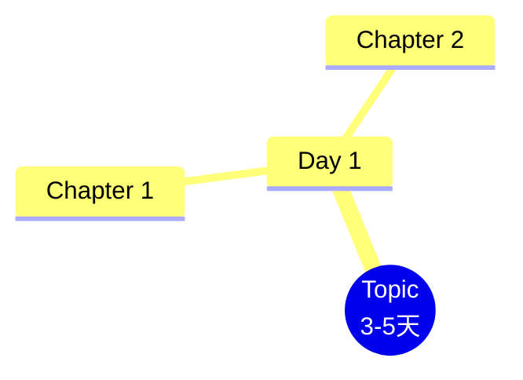
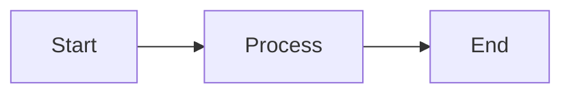

# CLAUDE.md

This file provides guidance to Claude Code (claude.ai/code) when working with code in this repository.

## Repository Overview

This is **LuminNexus Learning Map** - a structured onboarding and training documentation repository for new team members. The content is based on the LuminNexus-PrismaVision-SmartInsightEngine product (nutrition supplement data analysis platform).

**Core Purpose**: Provide 3-5 day quick onboarding learning paths for different roles (Testing & Business Analysis, Crawler Engineer) with general skills and role-specific content.

## Project Architecture

### Directory Structure

```
LuminNexus-LearningMap/
├── STRUCTURE_v3.md          # Architecture design document (source of truth)
├── general/                 # General skills applicable to all roles
│   └── 00_outline.md        # General learning outline (01-09 topics planned)
├── roles/                   # Role-specific learning paths
│   └── testing/             # Testing & Business Analysis role
│       └── 00_outline.md    # Testing learning outline (01-06 topics)
└── archive/                 # Historical versions with YYYYMMDD prefix
```

### Content Organization Philosophy

**Two-tier structure**:
1. **general/** - Universal transferable skills (all roles)
2. **roles/** - Role-specific deep-dive content

**Numbering System**:
- `00_outline.md` - Overview/outline for a learning domain
- `01-10` prefix - Indicates suggested learning sequence
- Format: `NN_topic-name.md` (lowercase, hyphen-separated)

**Current State vs. Planned State**:
- STRUCTURE_v3.md describes the **target architecture** (16 files planned)
- Current implementation has **only outline files** (00_outline.md)
- Individual topic files (01-10) are **not yet created**

## Design Principles

From STRUCTURE_v3.md and conversation context:

1. **Extreme Simplification** - Avoid over-design, minimal files
2. **Documentation First Policy** - Update docs before code changes
3. **No Unsolicited Implementation** - Never proactively implement unless explicitly requested
4. **Check Before Create** - Always verify if files/folders exist before creating
5. **Outline Focus** - Outlines should be concise, no detailed examples
6. **3-5 Day Learning Timeframe** - Concept understanding, not mastery
7. **Non-technical Friendly** - Especially for Testing role (weak IT background)

## Content Guidelines

### Outline Files (00_outline.md)

**Purpose**: High-level roadmap showing what topics will be covered

**Structure**:
- Version and metadata
- Design principles
- Learning path overview with Mermaid mindmap
- Complete outline (chapter summaries, NOT full content)
- Learning stage planning (Day 1-5)
- Capability verification standards
- Tools and resources
- FAQ section

**Important**:
- NO detailed examples in outlines
- NO step-by-step instructions
- NO code samples
- Keep it brief and structural

### Topic Files (01-10)

**Planned but not yet created**. When creating:
- Follow numbering from outline
- Use template from STRUCTURE_v3.md lines 320-371
- Include: Overview, Core Concepts, Practical Skills, Best Practices, FAQ
- Use Mermaid diagrams instead of images
- Support both markdown reading and future web conversion

### Version Management

**Outline Versioning**:
- Version number in header (e.g., v4.0)
- Version history table at bottom
- Update version when making structural changes

**Archive Naming**: `YYYYMMDD_description.md`

## Working with This Repository

### Common Modifications

**Updating Testing Outline**:
```bash
# Read current version first
cat roles/testing/00_outline.md

# Make changes with Edit tool
# Update version number and version history table
```

**Adding New Role**:
```bash
# Check roles/ first
ls roles/

# Create new subfolder
mkdir roles/[role-name]

# Create outline following testing/00_outline.md pattern
```

### Key Constraints

1. **Testing Role Context**:
   - Target: Non-technical BA role with weak IT background
   - Focus: Surface-level, user perspective
   - Avoid: Django internals, Newman CLI, pytest depth
   - Include: Postman (GUI), browser dev tools, Excel
   - Must understand product logic but not implementation details

2. **Product Context**:
   - Smart Insight Engine: Nutrition supplement data analysis API
   - Heimdallr: Django project containing Smart Insight Engine
   - MDFO Query: Measure/Dimensions/Filters/Options structure
   - ~130K product dataset with 13 dimensions

3. **Content Overlap Prevention**:
   - `01_product-understanding` = High-level "what is the product"
   - `04_mdfo-query-understanding` = Detailed "how to use MDFO"
   - General outlines should NOT duplicate role-specific content

## Mermaid Diagrams

Preferred visualization method (no image files):

**Mindmap** for learning paths:
```markdown

```

**Flowchart** for processes:
```markdown

```

See STRUCTURE_v3.md lines 210-270 for more diagram types.

## File Creation Policy

Before creating ANY new file:

1. **Check if it exists**: Use `ls`, `find`, or `Glob` tools
2. **Verify parent directory exists**: Use `ls` to check
3. **Confirm necessity**: Are you implementing or just discussing?
4. **Wait for explicit permission**: User must say "please implement" or similar

**Exception**: Only create files when user explicitly requests file creation.

## Git Workflow

**Commit Message Format**:
```
docs: Update documentation content
feat: Add new learning topic
fix: Correct errors or links
refactor: Restructure content
chore: Maintenance work
```

**Important**: Do NOT commit unless explicitly requested by user.

## Related Projects

This learning map is based on:
- **LuminNexus-PrismaVision-SmartInsightEngine** - The product being taught
- **LuminNexus-AtlasVault-Shopify** - Data collection system (referenced in context)

Team roles being trained:
1. **Test & Business Analysis** - Testing, BA, data validation
2. **Crawler Engineer** - Web scraping, data collection

## Common Pitfalls to Avoid

1. ❌ Adding detailed examples to outline files
2. ❌ Creating files proactively without explicit request
3. ❌ Including technical depth for Testing role
4. ❌ Adding "learning outcome checklists" (user doesn't want them)
5. ❌ Making content too similar between general/ and roles/
6. ❌ Creating documentation files (*.md, README) without request

## Current Session Context

Based on recent work:
- Testing outline is at v4.0 (just restructured with 01-06 chapters)
- Chapter 01 added: product understanding (Heimdallr + Smart Insight)
- All examples removed from outline for conciseness
- Learning outcome checklists removed per user preference
- Chapter 01 and 04 reviewed for overlap (now distinct)

---

**Document Version**: 1.0
**Last Updated**: 2025-11-10
**Maintained by**: LuminNexus Team
