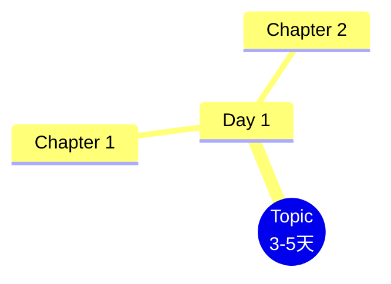
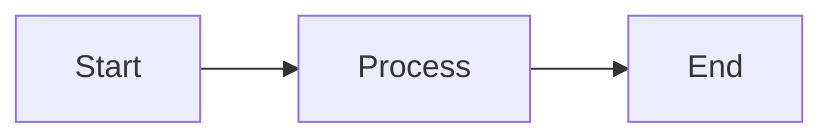

# CLAUDE.md

This file provides guidance to Claude Code (claude.ai/code) when working with code in this repository.

## Repository Overview

This is **LuminNexus Learning Map** - a structured onboarding and training documentation repository for new team members. The content is based on the LuminNexus-PrismaVision-SmartInsightEngine product (nutrition supplement data analysis platform).

**Core Purpose**: Provide 3-5 day quick onboarding learning paths for different roles (Testing & Business Analysis, Crawler Engineer) with general skills and role-specific content.

## Project Architecture

### Directory Structure

```
LuminNexus-LearningMap/
├── .stillflow.yaml          # Stillflow configuration (flat mode)
├── STRUCTURE.md             # Architecture design document (source of truth)
├── general/                 # General skills applicable to all roles
│   ├── 00_outline.md        # General learning outline
│   ├── 02_unix-linux-basics.md
│   ├── 03_data-engineering.md
│   ├── ai-data-terminology.md        # Infer / Derive / Reasoning 術語
│   ├── claude-agent-skill.md
│   ├── claude-code-tips.md           # Claude Code CLI 使用技巧
│   ├── claude-code-cli-discussion.md # Claude Code CLI 深度討論
│   ├── claude-code-cli-discussion-advanced.md
│   ├── compute-state-context.md      # Stateless 設計與 Context 本質
│   ├── contextops-discipline.md
│   ├── emergence-data-compute.md     # 湧現、Data/Compute 差異與遞歸循環
│   ├── tension-value-perspective.md  # 張力、事實單一價值多元
│   ├── isomorphism-projection.md     # 同構與投影：系列數學骨架
│   ├── no-one-is-home.md             # 運算、基質與湧現的所在（耦合）
│   ├── paradigm-shift-task-to-wish.md # 範式轉移：從描述任務到許願
│   ├── clarification-wish-and-plan.md # 許願與計畫一體兩面（實務層鉸鏈）
│   ├── know-your-unknowns.md         # 四象限與三階段技巧（實務層）
│   ├── agent-work-forms.md           # Pairing/委派/自主 Loop（實務層收頂）
│   ├── knowledge-management.md
│   ├── progressive-disclosure.md
│   └── ubuntu-desktop-tips.md
├── roles/                   # Role-specific learning paths
│   ├── testing/             # Testing & Business Analysis role
│   │   ├── 00_outline.md    # Testing learning outline
│   │   └── 01-06_*.md       # 六個主題檔（產品理解～測試結果分析）
│   ├── ui-ux/               # UI/UX 評估素養（跨角色、跨產品通用）
│   │   ├── 00_outline.md    # UI/UX learning outline
│   │   └── 01-06_*.md       # 六個主題檔（共同語言～報告協作），理論接 HCI 文獻
│   ├── crawler-engineer.md  # Crawler Engineer role（導覽既有教材）
│   └── project-manager.md   # Project Manager role
├── tools/                   # Tool documentation
│   ├── speckit.md           # Speckit tool guide (SDD implementation)
│   ├── ai-tools.md          # AI Coding Agent, Canvas, API 參考
│   ├── external-services.md # 外部服務 (Keepa, Oxylabs, Jina AI, MarkItDown)
│   └── google-product-category-intro.md # Google 商品分類標準
├── data-sources/            # Data source documentation
│   ├── data-sources-guide.md # 資料來源與關聯欄位指南
│   ├── dsld/                # DSLD 相關文檔
│   ├── keepa/               # Keepa API 文檔
│   └── shopify/             # Shopify 相關文檔
├── projects/                # LuminNexus 各系統文檔
│   ├── 00_architecture-overview.md
│   ├── 01_data-flow.md
│   ├── alchemymind/         # AlchemyMind (TheRefinery, TheWeaver, TheArgus, Factum...)
│   ├── atlasvault/          # AtlasVault (crawlers, vault, theforge)
│   ├── prismavision/        # PrismaVision (Smart Insight Engine, MCP)
│   └── stillflow/           # Stillflow 文檔
├── slides/                  # Marp 簡報 (Stillflow ignore_paths，不需 frontmatter)
│   ├── policy.md            # 簡報管理規範 (YYYY-MM-DD 資料夾命名)
│   ├── scripts/             # merge-and-build.sh, build-document.sh
│   └── YYYY-MM-DD/          # 各場次簡報 (NN_topic.md 分頁檔)
├── site/                    # Learning Map 網站 (自建 SPA，見下方 Website 一節)
│   ├── config.json          # 策展資料：角色 Day 結構、general 分軌、參考庫分類
│   ├── build.py             # 建置腳本 (掃描內容 + frontmatter → site/dist/，gitignored)
│   ├── index.html           # SPA 外殼
│   └── assets/              # app.js、style.css、vendor (marked、mermaid)
└── archive/                 # Historical versions with YYYYMMDD prefix
```

## Website (site/)

教材網站是自建的單頁應用 (SPA)，直接讀取本 repo 的 md 原檔渲染，**教材內容不需為網站做任何改動**：

- **建置**：`python3 site/build.py` → 產出 `site/dist/`（掃描 general/roles/tools/data-sources/projects，解析 frontmatter 產生導覽與搜尋索引；config 引用了不存在的檔案會輸出警告）
- **本地預覽**：`python3 -m http.server 8619 -d site/dist`
- **部署**：push 到 main 後由 `.github/workflows/deploy-site.yml` 自動建置並發佈到 GitHub Pages
- **策展資料**：角色學習路徑的 Day 分組、general 四分軌、深度教材清單都在 `site/config.json`——新增主題檔後在此登記；未登記的檔案仍會被掃描、可搜尋、出現在參考資料庫
- **功能**：角色分流首頁、Day 時間軸路徑頁、三欄閱讀頁（側欄＋TOC）、Mermaid 原生渲染、中文全文搜尋、相對 .md 連結自動轉路由、文件尾部 meta（文件版本／最後更新等）自動重排為統一小字格式

### Content Organization Philosophy

**Four-tier structure**:
1. **general/** - Universal transferable skills (all roles)
2. **roles/** - Role-specific deep-dive content
3. **tools/** - Tool-specific documentation and guides
4. **data-sources/** - Data source documentation and field guides

**Numbering System**:
- `00_outline.md` - Overview/outline for a learning domain
- `01-10` prefix - Indicates suggested learning sequence
- Format: `NN_topic-name.md` (lowercase, hyphen-separated)

**Current State vs. Planned State**:
- STRUCTURE.md describes the **target architecture**
- **general/** has outline, topic files, and reference docs (unix-linux, data-engineering, Claude Code 系列, ContextOps, terminology 等)
- **roles/** has outline files and role guides (testing, ui-ux, crawler-engineer, project-manager)
- **tools/** has: speckit.md, ai-tools.md, external-services.md, google-product-category-intro.md
- **data-sources/** has: data-sources-guide.md and subdirectories (dsld, keepa, shopify)
- **projects/** has per-system docs (alchemymind, atlasvault, prismavision, stillflow)
- **slides/** holds Marp presentations; folders use `YYYY-MM-DD` naming (see slides/policy.md); generated files (merged.md, document.md, *.pdf) are gitignored

## Stillflow Integration (ContextOps)

本專案使用 **Stillflow** 作為文檔治理工具，採用 **flat mode**（無 flow/crystallized 分層）。

### Configuration

`.stillflow.yaml` 定義專案設定：

```yaml
version: "1"
project: LearningMap
mode: flat
valid_status:
  - active
  - stable
  - deprecated
scan_paths:
  - general/
  - tools/
  - data-sources/
  - roles/
  - projects/
ignore_paths:
  - archive/
  - slides/
```

### Frontmatter Template

所有 markdown 文件必須包含 YAML frontmatter：

```yaml
---
title: "文件標題"
type: guide              # guide, reference, outline, topic, spec, overview, policy
status: active           # active, stable, deprecated
created: 2025-12-18
updated: 2025-12-18      # 最後更新日期（>= created）
version: "1.0"
project: LearningMap
author: maple            # maple, leana, yijou14；外部轉錄文件可改用 source 記出處
tags:
  - tag1
  - tag2
audience:
  - all
summary: |
  一兩句說明文章涵蓋什麼（目錄頁卡片的簡介來源）。
---
```

**Required fields**（由 hook 強制）：`title`, `type`, `status`, `created`, `updated`, `version`, `project`, `tags`, `audience`, `summary`，以及 `author`（有 `source` 者可免）。選用欄位：`related`（關聯文件）、`source`（外部出處）。

**Frontmatter 檢查 hook**：`.claude/settings.json` 掛了 PostToolUse hook，Claude 每次 Edit/Write 教材 md 後自動跑 `scripts/check_frontmatter.py` 驗證上述規範，不符合會把錯誤回饋給 Claude 要求修正。手動全檢：`python3 scripts/check_frontmatter.py --all`

### CLI Commands

```bash
# 查看所有文件
stillflow list

# 查看統計狀態
stillflow status

# 搜尋文件 (支援多條件 AND)
stillflow search "author:leana"
stillflow search "author:maple type:guide"
stillflow search "project:data-sources author:leana"
stillflow search "tags:onboarding" --json

# 驗證 frontmatter
muster lint .
muster lint general/

# 生成索引
muster index .
```

### Search Fields

| Field | Example |
|-------|---------|
| `author` | `author:leana` |
| `type` | `type:guide` |
| `status` | `status:active` |
| `project` | `project:data-sources` |
| `tags` | `tags:onboarding` |
| `folder` | `folder:flow` |

### References

- [Stillflow Runbook](https://github.com/pgylee/LuminNexus-Stillflow/blob/main/projects/Stillflow/crystallized/runbook.md)
- [stillflow_doc.v0.1.yaml schema](https://github.com/pgylee/LuminNexus-Stillflow/blob/main/schemas/stillflow_doc.v0.1.yaml)

## Design Principles

From STRUCTURE.md and conversation context:

1. **Extreme Simplification** - Avoid over-design, minimal files
2. **Documentation First Policy** - Update docs before code changes
3. **No Unsolicited Implementation** - Never proactively implement unless explicitly requested
4. **Check Before Create** - Always verify if files/folders exist before creating
5. **Outline Focus** - Outlines should be concise, no detailed examples
6. **3-5 Day Learning Timeframe** - Concept understanding, not mastery
7. **Non-technical Friendly** - Especially for Testing role (weak IT background)

## Content Guidelines

### Outline Files (00_outline.md)

**Purpose**: High-level roadmap showing what topics will be covered

**Structure**:
- Version and metadata
- Design principles
- Learning path overview with Mermaid mindmap
- Complete outline (chapter summaries, NOT full content)
- Learning stage planning (Day 1-5)
- Capability verification standards
- Tools and resources
- FAQ section

**Important**:
- NO detailed examples in outlines
- NO step-by-step instructions
- NO code samples
- Keep it brief and structural

### Topic Files (01-10)

**Planned but not yet created**. When creating:
- Follow numbering from outline
- Use template from STRUCTURE.md「主題檔案範本」section
- Include: Overview, Core Concepts, Practical Skills, Best Practices, FAQ
- Use Mermaid diagrams instead of images
- Support both markdown reading and future web conversion

### Version Management

**Outline Versioning**:
- Version number in header (e.g., v4.0)
- Version history table at bottom
- Update version when making structural changes

**Archive Naming**: `YYYYMMDD_description.md`

## Working with This Repository

### Common Modifications

**Updating Testing Outline**:
```bash
# Read current version first
cat roles/testing/00_outline.md

# Make changes with Edit tool
# Update version number and version history table
```

**Adding New Role**:
```bash
# Check roles/ first
ls roles/

# Create new subfolder
mkdir roles/[role-name]

# Create outline following testing/00_outline.md pattern
```

### Key Constraints

1. **Testing Role Context**:
   - Target: Non-technical BA role with weak IT background
   - Focus: Surface-level, user perspective
   - Avoid: Django internals, Newman CLI, pytest depth
   - Include: Postman (GUI), browser dev tools, Excel
   - Must understand product logic but not implementation details

2. **Product Context**:
   - Smart Insight Engine: Nutrition supplement data analysis API
   - Heimdallr: Django project containing Smart Insight Engine
   - MDFO Query: Measure/Dimensions/Filters/Options structure
   - ~130K product dataset with 13 dimensions

3. **Content Overlap Prevention**:
   - `01_product-understanding` = High-level "what is the product"
   - `04_mdfo-query-understanding` = Detailed "how to use MDFO"
   - General outlines should NOT duplicate role-specific content

## Mermaid Diagrams

Preferred visualization method (no image files):

**Mindmap** for learning paths:
```markdown

```mermaid
mindmap
  root((Topic<br/>3-5天))
    Day 1
      Chapter 1
      Chapter 2
```
```

**Flowchart** for processes:
```markdown

```mermaid
graph LR
    A[Start] --> B[Process]
    B --> C[End]
```
```

See STRUCTURE.md「視覺化內容策略」section for more diagram types.

## File Creation Policy

Before creating ANY new file:

1. **Check if it exists**: Use `ls`, `find`, or `Glob` tools
2. **Verify parent directory exists**: Use `ls` to check
3. **Confirm necessity**: Are you implementing or just discussing?
4. **Wait for explicit permission**: User must say "please implement" or similar

**Exception**: Only create files when user explicitly requests file creation.

## Git Workflow

**Commit Message Format**:
```
docs: Update documentation content
feat: Add new learning topic
fix: Correct errors or links
refactor: Restructure content
chore: Maintenance work
```

**Important**: Do NOT commit unless explicitly requested by user.

## Related Projects

This learning map is based on:
- **LuminNexus-PrismaVision-SmartInsightEngine** - The product being taught
- **LuminNexus-AtlasVault-Shopify** - Data collection system (referenced in context)

Team roles being trained:
1. **Test & Business Analysis** - Testing, BA, data validation
2. **Crawler Engineer** - Web scraping, data collection (planned)
3. **Project Manager** - Project planning, agile development, risk management
4. **UI/UX 評估素養** - Evaluation methodology, walkthrough principles, finding quality (cross-role, cross-product)

## Common Pitfalls to Avoid

1. ❌ Adding detailed examples to outline files
2. ❌ Creating files proactively without explicit request
3. ❌ Including technical depth for Testing role
4. ❌ Adding "learning outcome checklists" (user doesn't want them)
5. ❌ Making content too similar between general/ and roles/
6. ❌ Creating documentation files (*.md, README) without request
7. ❌ Creating markdown files without proper Stillflow frontmatter

## Key Documentation

### tools/ai-tools.md
AI 工具參考文件，涵蓋：
- **AI Coding Agent**: Claude Code, Gemini CLI, Codex CLI, Cursor
- **AI Canvas**: ChatGPT Canvas, Gemini Canvas
- **AI 研究工具**: NotebookLM
- **AI API**: Claude API, OpenAI API, Gemini API

### tools/external-services.md
外部服務參考，涵蓋：
- **資料蒐集**: Keepa (Amazon 價格追蹤), Apollo.io (B2B 資料)
- **代理服務**: Oxylabs
- **網頁解析**: Jina AI
- **文件轉換**: MarkItDown

### general/claude-code-tips.md (v1.3)
Claude Code CLI 使用技巧：
- Memory 與 CLAUDE.md 差異
- Slash Commands (/clear, /compact, /resume, /rewind, /model)
- Subagent 多代理模式與獨立 Context Window
- 快捷鍵 (Esc, Esc Esc, Shift+Tab)
- 官方文檔連結

### general/contextops-discipline.md
ContextOps 方法論參考：
- 核心概念：Context Pipeline 與 Context Budget
- Stillflow 作為 ContextOps 治理工具
- Context Quality Metrics

### data-sources/data-sources-guide.md
資料來源與關聯欄位指南：
- UPC, ASIN, brandCode 等識別碼說明
- 跨平台資料串接方式
- 常見問題與注意事項

---

**Document Version**: 1.6
**Last Updated**: 2026-07-04
**Maintained by**: LuminNexus Team
