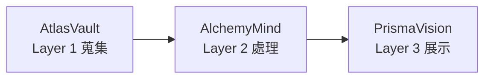
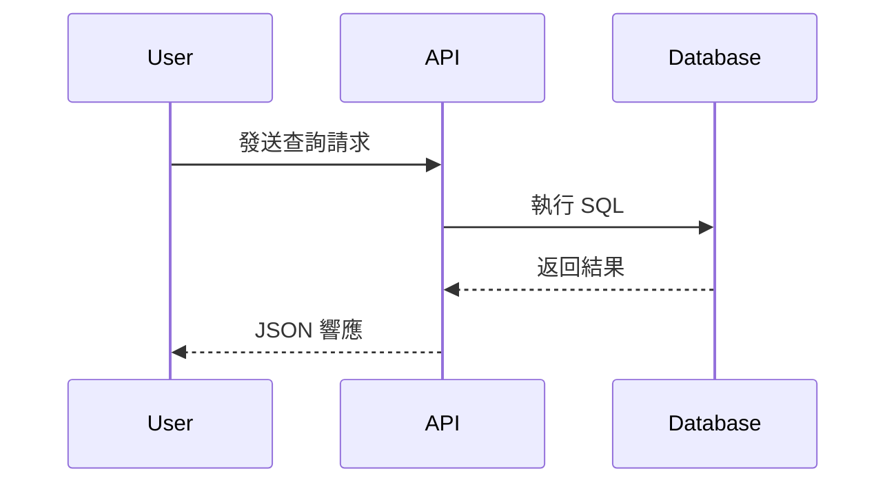
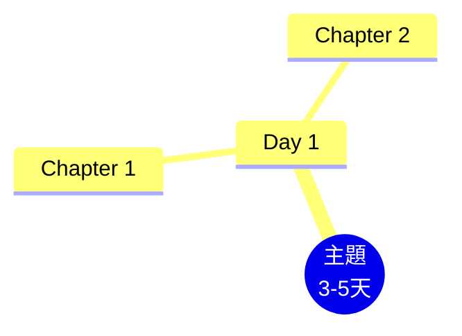
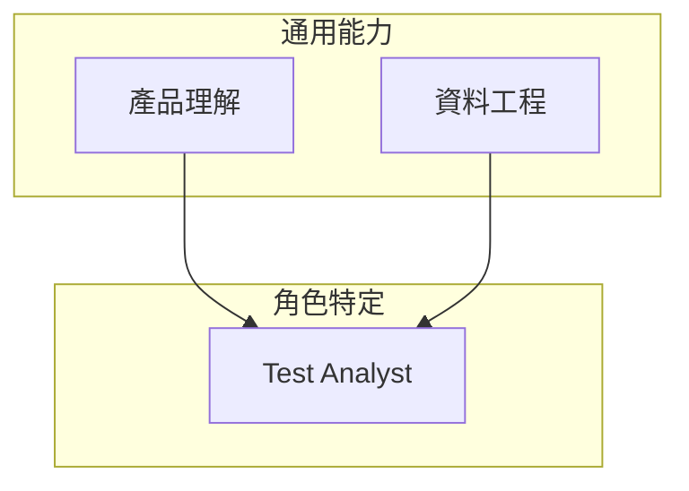

# LuminNexus Learning Map - 專案架構設計 v4

## 設計原則

1. **極簡主義**: 最少的目錄和檔案
2. **編碼表達順序**: 用檔案編號表達學習路徑
3. **內容優先**: 專注於文字內容，不依賴圖片
4. **易於維護**: 結構簡單，易於協作
5. **文檔治理**: 使用 Stillflow frontmatter 統一管理文件狀態

---

## 專案結構（現況）

```
LuminNexus-LearningMap/
│
├── CLAUDE.md                         # Claude Code 工作指引
├── STRUCTURE.md                      # 本檔案：架構設計說明
├── .stillflow.yaml                   # Stillflow 設定（flat mode）
│
├── general/                          # 通用核心能力（所有角色）
│   ├── 00_outline.md                 # 通用能力大綱
│   ├── 02_unix-linux-basics.md       # Unix/Linux 基礎
│   ├── 03_data-engineering.md        # 資料工程基礎
│   ├── ai-data-terminology.md        # Infer / Derive / Reasoning 術語
│   ├── claude-agent-skill.md         # Claude Agent Skill 參考
│   ├── claude-code-tips.md           # Claude Code CLI 使用技巧
│   ├── claude-code-cli-discussion.md # Claude Code CLI 深度討論
│   ├── claude-code-cli-discussion-advanced.md
│   ├── compute-state-context.md      # Stateless 設計與 Context 本質
│   ├── contextops-discipline.md      # ContextOps 方法論
│   ├── emergence-data-compute.md     # 湧現、Data/Compute 差異與遞歸循環
│   ├── tension-value-perspective.md  # 張力、事實單一價值多元
│   ├── isomorphism-projection.md     # 同構與投影：系列數學骨架
│   ├── no-one-is-home.md             # 運算、基質與湧現的所在（耦合）
│   ├── paradigm-shift-task-to-wish.md # 範式轉移：從描述任務到許願
│   ├── clarification-wish-and-plan.md # 許願與計畫一體兩面（實務層鉸鏈）
│   ├── know-your-unknowns.md         # 四象限與三階段技巧（實務層）
│   ├── agent-work-forms.md           # Pairing/委派/自主 Loop（實務層收頂）
│   ├── knowledge-management.md       # 知識管理 (PKM & Frontmatter)
│   ├── progressive-disclosure.md     # Progressive Disclosure 參考
│   └── ubuntu-desktop-tips.md        # Ubuntu Desktop 技巧
│
├── roles/                            # 角色特定學習路徑
│   ├── testing/                      # Testing & Business Analysis
│   │   ├── 00_outline.md             # Testing 學習大綱
│   │   └── 01-06_*.md                # 六個主題檔（產品理解～測試結果分析）
│   ├── ui-ux/                        # UI/UX 評估素養（跨角色、跨產品通用）
│   │   ├── 00_outline.md             # UI/UX 學習大綱
│   │   └── 01-06_*.md                # 六個主題檔（共同語言～報告協作）
│   ├── crawler-engineer.md           # Crawler Engineer 角色（導覽既有教材）
│   └── project-manager.md            # Project Manager 角色
│
├── tools/                            # 工具文檔
│   ├── speckit.md                    # Speckit 工具指南 (SDD)
│   ├── ai-tools.md                   # AI Coding Agent / Canvas / API 參考
│   ├── external-services.md          # 外部服務 (Keepa, Oxylabs, Jina AI...)
│   └── google-product-category-intro.md # Google 商品分類標準
│
├── data-sources/                     # 資料來源文檔
│   ├── data-sources-guide.md         # 資料來源與關聯欄位指南
│   ├── dsld/                         # DSLD (NIH) 相關文檔
│   ├── keepa/                        # Keepa API 文檔
│   └── shopify/                      # Shopify 相關文檔
│
├── projects/                         # LuminNexus 各系統文檔
│   ├── 00_architecture-overview.md   # 三層架構總覽
│   ├── 01_data-flow.md               # 資料流說明
│   ├── DOCUMENTATION_POLICY.md       # 文檔撰寫規範
│   ├── alchemymind/                  # Layer 2: 資料處理與 LLM 分析
│   │   ├── 00_overview.md
│   │   ├── therefinery.md / theweaver.md / theargus.md
│   │   ├── thedistiller.md / factum.md / shared.md
│   ├── atlasvault/                   # Layer 1: 資料蒐集與儲存
│   │   ├── 00_overview.md
│   │   ├── dsld-crawler.md / iherb-crawler.md
│   │   ├── theforge.md / vault.md / dsldxkeepa.md
│   ├── prismavision/                 # Layer 3: 查詢與展示
│   │   ├── 00_overview.md
│   │   ├── smart-insight-engine/     # SI Engine 學習專區
│   │   │   ├── 00_overview.md
│   │   │   ├── 01_mdof-fundamentals.md ⭐
│   │   │   ├── 02_query-design.md
│   │   │   └── 03_test-case-design.md
│   │   ├── mcp.md / next.md / smartinsightengine.md
│   └── stillflow/                    # 文檔治理工具
│       └── 00_overview.md
│
├── slides/                           # Marp 簡報（不納入 Stillflow 掃描）
│   ├── policy.md                     # 簡報管理規範
│   ├── scripts/                      # merge-and-build.sh / build-document.sh
│   └── YYYY-MM-DD/                   # 各場次簡報（NN_topic.md 分頁檔）
│
└── archive/                          # 歷史文檔（YYYYMMDD 前綴或版本後綴）
```

---

## 檔案編號系統

### 編碼規則

- **`00_outline.md` / `00_overview.md`**: 該領域的大綱或總覽
- **數字前綴 01-10**: 表達建議學習順序
- **底線分隔**: `01_mdof-fundamentals.md`
- **小寫字母**: 全部使用小寫 + 連字符
- **無編號檔案**: 獨立參考文件（reference），不屬於循序學習路徑

### 學習路徑定位

- **general/**: 3-5 天可完成的通用基礎（編號檔）+ 隨時查閱的參考文件（無編號檔）
- **roles/**: 角色專屬深入內容，前置為 general/ 基礎
- **projects/prismavision/smart-insight-engine/**: MDOF 查詢專業路徑（01-03 循序學習）

---

## Stillflow 文檔治理

本專案使用 **Stillflow**（flat mode）管理文件狀態。

### 掃描範圍

`scan_paths`: `general/`, `tools/`, `data-sources/`, `roles/`, `projects/`
`ignore_paths`: `archive/`, `slides/`

### Frontmatter 規範

掃描範圍內所有 markdown 文件**必須**包含 YAML frontmatter：

```yaml
---
title: "文件標題"
type: guide              # guide, reference, outline, topic, spec, overview, policy
status: active           # active, stable, deprecated
created: 2025-12-18
author: maple            # maple, leana, yijou14
tags:
  - tag1
---
```

**必填欄位**: `title`, `type`, `status`, `created`

詳細規範與 CLI 指令見 [CLAUDE.md](CLAUDE.md#stillflow-integration-contextops)。

---

## 各目錄詳細說明

### `general/` - 通用核心能力

**用途**: 所有角色都需要的跨職能通用技能與參考文件

**內容分兩類**:
1. **編號主題檔**（循序學習）: 00_outline → 02_unix-linux-basics → 03_data-engineering
2. **參考文件**（隨查隨用）: Claude Code 系列、ContextOps、知識管理、術語參考

### `roles/` - 角色特定學習路徑

**用途**: 針對不同職位的專屬技能與學習建議

**團隊角色**:
1. **Test & Business Analysis** ([testing/00_outline.md](roles/testing/00_outline.md)) - 測試設計、業務分析、資料驗證；非技術背景友善
2. **Project Manager** ([project-manager.md](roles/project-manager.md)) - 專案規劃、敏捷開發、風險管理
3. **Crawler Engineer** ([crawler-engineer.md](roles/crawler-engineer.md)) - 資料蒐集、爬蟲開發；導覽 data-sources/ 與 atlasvault/ 既有教材
4. **UI/UX 評估素養** ([ui-ux/00_outline.md](roles/ui-ux/00_outline.md)) - 評估方法設計、走查原理、發現品質、機械檢查；跨角色、跨產品通用，理論接 HCI 文獻

**學習建議**: 先完成 general/ 基礎，再進入角色路徑。

### `tools/` - 工具文檔

**用途**: 專案使用的工具與服務的獨立完整文檔

每份文件保持獨立性與完整性，包含概述、使用方法、最佳實踐，並與其他文檔交叉引用。

### `data-sources/` - 資料來源文檔

**用途**: 各資料來源的欄位參考與串接指南

- `data-sources-guide.md`: UPC / ASIN / brandCode 等識別碼與跨平台串接
- 子目錄依來源劃分: `dsld/`, `keepa/`, `shopify/`

### `projects/` - LuminNexus 系統文檔

**用途**: LuminNexus 三層架構各系統的說明文檔



- 每個子系統有自己的 `00_overview.md`
- Smart Insight Engine 學習專區位於 `prismavision/smart-insight-engine/`（MDOF 查詢 01-03 循序路徑）
- 文檔撰寫規範見 `DOCUMENTATION_POLICY.md`

### `slides/` - 簡報

**用途**: 團隊分享簡報（Marp 格式）

- 資料夾以 `YYYY-MM-DD` 命名，每場一個資料夾
- 分頁檔用 `NN_topic.md` 編號，`00_meta.md` 放 Marp 設定
- 產出物（`merged.md`, `document.md`, `*.pdf`, `*.pptx`）由 scripts/ 生成並被 gitignore
- 完整規範見 [slides/policy.md](slides/policy.md)
- **不納入 Stillflow 掃描**，不需 frontmatter

### `archive/` - 歷史文檔

**用途**: 保存重要的歷史版本和草稿

**命名規則**: `YYYYMMDD_description.md` 或版本後綴（如 `STRUCTURE_v3.md`）

---

## 視覺化內容策略

### 使用 Mermaid 圖表語法

**優點**:
- 純文字，版本控制友善
- 轉換成網頁時自動渲染成圖表
- 不需要外部圖片檔案
- 易於維護和更新

**支援的圖表類型**:

#### 1. 流程圖 (Flowchart)
```markdown

```

#### 2. 序列圖 (Sequence Diagram)
```markdown

```

#### 3. 心智圖 (Mindmap) - 學習路徑
```markdown

```

#### 4. 架構圖
```markdown

```

**Mermaid 文檔**: https://mermaid.js.org/

---

## 內容組織原則

### 1. 單一檔案完整性
- 每個主題檔案包含該領域的完整內容
- 使用 H2 (##) 組織主要段落、H3 (###) 組織子主題
- 避免過度拆分檔案

### 2. 大綱與主題分離
- `00_outline.md` 只放高層路線圖：章節摘要、學習階段、FAQ
- 大綱**不放**詳細範例、逐步教學、程式碼
- 詳細內容放編號主題檔

### 3. 交叉引用
```markdown
詳見 [資料工程基礎](../general/03_data-engineering.md#etl)
```

### 4. 內容重疊防範
- general/ 與 roles/ 內容不重複
- 「產品是什麼」(高層) 與「怎麼用 MDOF」(細節) 分屬不同文件

---

## 主題檔案範本

```markdown
---
title: "主題名稱"
type: topic
status: active
created: YYYY-MM-DD
author: maple
tags:
  - tag1
---

# [主題名稱]

> **學習階段**: 基礎/進階
> **建議時間**: X 天
> **適用角色**: 全員

## 概述
簡短說明本主題的核心內容與重要性

## 目錄
- [核心概念](#核心概念)
- [實務技能](#實務技能)
- [最佳實踐](#最佳實踐)
- [常見問題](#常見問題)

## 核心概念
### 1.1 子主題一
內容...

## 實務技能
### 2.1 技能一
內容...

## 最佳實踐
### 3.1 建議一
內容...

## 常見問題
**Q: 問題一？**
A: 回答...

## 延伸閱讀
- [相關主題連結](link)
```

---

## 維護流程

### 新增內容
1. 確定目錄歸屬（general / roles / tools / data-sources / projects）
2. 循序主題使用下一個編號；參考文件用描述性檔名
3. 加上 Stillflow frontmatter（必填: title, type, status, created）
4. 更新相關的 outline 或 overview
5. Commit 並 Push

### 更新內容
1. 直接編輯對應的 Markdown 檔案
2. 重大變更可保存舊版到 `archive/`
3. 更新文件內版本號與版本歷史表

### 重構調整
1. 檔案改名或搬移用 `git mv` 保留歷史
2. 更新所有內部連結
3. 同步更新 CLAUDE.md 與本檔案的目錄結構

---

## 協作規範

### Commit Message 規範
```
docs: 更新文檔內容
feat: 新增學習主題
fix: 修正錯誤或連結
refactor: 重構內容結構
chore: 其他維護性工作
```

### Pull Request
- 標題簡明扼要
- 說明變更原因和內容
- 至少一人 review 後合併

---

## 版本歷史

| 版本 | 日期 | 變更說明 |
|------|------|----------|
| 4.0 | 2026-07-04 | 對齊現況：新增 data-sources/、projects/、slides/ 說明；smart-insight-engine 移至 projects/prismavision/；加入 Stillflow 治理章節；移除未實現的 general/ 01-10 規劃與遷移步驟（v3 存於 archive/STRUCTURE_v3.md） |
| 3.0 | 2025-11-10 | 極簡版架構設計 |

---

**版本**: 4.0
**日期**: 2026-07-04
**設計者**: Learning Team
