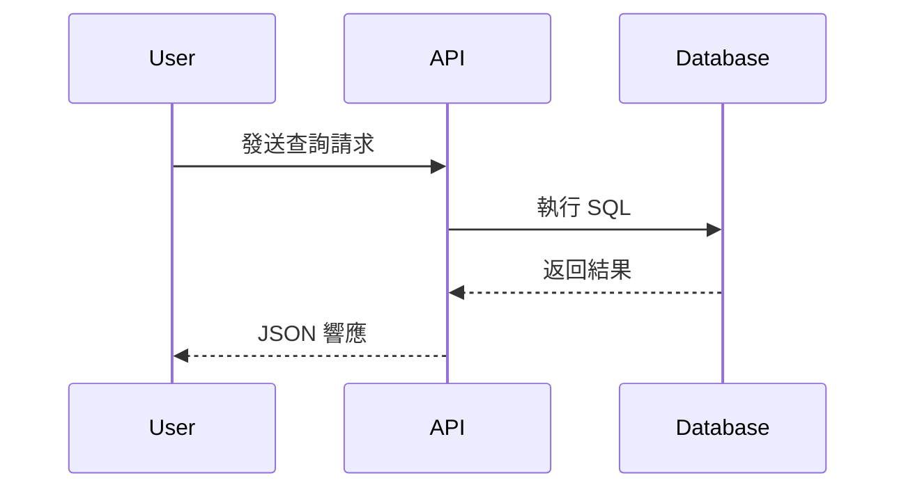
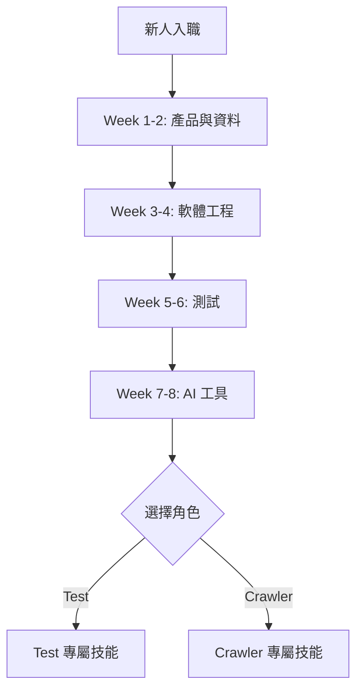
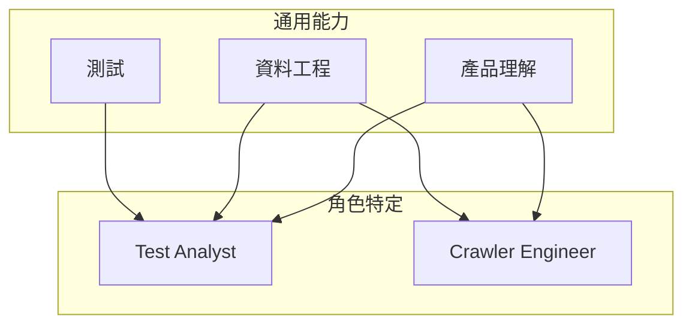

# LuminNexus Learning Map - 專案架構設計 v3 (極簡版)

## 設計原則

1. **極簡主義**: 最少的目錄和檔案
2. **編碼表達順序**: 用檔案編號表達學習路徑
3. **內容優先**: 專注於文字內容，不依賴圖片
4. **易於維護**: 結構簡單，易於協作

---

## 最終專案結構

```
LuminNexus-LearningMap/
│
├── README.md                         # 專案首頁、導航、使用說明
├── STRUCTURE.md                      # 本檔案：架構設計說明
│
├── general/                          # 通用核心能力
│   ├── README.md                     # 通用能力總覽與學習指引
│   ├── 00_outline.md                 # 通用能力大綱
│   ├── 01_product-business.md        # 產品與業務理解
│   ├── 02_data-engineering.md        # 資料工程基礎
│   ├── 03_software-engineering.md    # 軟體工程實踐
│   ├── 04_testing-qa.md              # 測試與品質保證
│   ├── 05_ai-assisted-dev.md         # AI 輔助開發
│   ├── 06_web-technologies.md        # 網頁技術與資料蒐集
│   ├── 07_data-analysis.md           # 資料分析與視覺化
│   ├── 08_systems-architecture.md    # 系統思維與架構
│   ├── 09_collaboration.md           # 協作與溝通
│   ├── 10_security.md                # 安全性與最佳實踐
│   └── unix-linux-basics.md          # Unix/Linux 基礎入門
│
├── roles/                            # 角色特定學習路徑
│   ├── README.md                     # 角色說明與選擇指引
│   ├── testing/                      # Testing 專業能力學習地圖
│   │   ├── 00_outline.md             # Testing 學習大綱
│   │   ├── 01_testing-fundamentals.md
│   │   ├── 02_unit-integration-testing.md
│   │   ├── 03_api-interface-testing.md
│   │   ├── 04_e2e-ui-testing.md
│   │   ├── 05_test-case-design.md
│   │   ├── 06_data-quality-validation.md
│   │   └── 07_business-analysis.md
│   ├── crawler-engineer.md           # Crawler Engineer 角色
│   └── project-manager.md            # Project Manager 角色
│
├── tools/                            # 工具文檔
│   └── speckit.md                    # Speckit 工具介紹與使用指南
│
└── archive/                          # 歷史文檔存檔
    └── 20251110_initial_draft.md

```

**總計**: 4 個目錄、19 個檔案

---

## 檔案編號系統

### 學習順序編碼

**基礎階段 (01-05)**: 前 8 週必修
```
01 → 產品與業務理解        (第 1-2 週)
02 → 資料工程基礎          (第 1-2 週)
03 → 軟體工程實踐          (第 3-4 週)
04 → 測試與品質保證        (第 5-6 週)
05 → AI 輔助開發           (第 7-8 週)
```

**進階階段 (06-10)**: 第 3-5 個月
```
06 → 網頁技術與資料蒐集    (Month 3)
07 → 資料分析與視覺化      (Month 3-4)
08 → 系統思維與架構        (Month 4)
09 → 協作與溝通            (Month 4-5)
10 → 安全性與最佳實踐      (Month 5)
```

### 編碼規則
- **數字前綴**: 01-10，表達建議學習順序
- **底線分隔**: `01_product-business.md`
- **小寫字母**: 全部使用小寫 + 連字符
- **簡短描述性**: 檔名清楚表達內容

---

## 各目錄詳細說明

### `general/` - 通用核心能力

**用途**: 所有角色都需要學習的跨職能通用技能

**README.md 內容**:
```markdown
# 通用核心能力

## 學習路徑

### 基礎階段 (第 1-8 週)
1. [產品與業務理解](01_product-business.md) - 1-2週
2. [資料工程基礎](02_data-engineering.md) - 1-2週
3. [軟體工程實踐](03_software-engineering.md) - 3-4週
4. [測試與品質保證](04_testing-qa.md) - 5-6週
5. [AI 輔助開發](05_ai-assisted-dev.md) - 7-8週

### 進階階段 (第 3-5 個月)
6. [網頁技術與資料蒐集](06_web-technologies.md)
7. [資料分析與視覺化](07_data-analysis.md)
8. [系統思維與架構](08_systems-architecture.md)
9. [協作與溝通](09_collaboration.md)
10. [安全性與最佳實踐](10_security.md)

## 使用建議
- 新人從 01 開始循序學習
- 已有經驗者可跳過熟悉主題
- 建議完成前 5 項後再進入進階階段
```

**10 個主題檔案**:
- 每個檔案對應一個學習領域
- 包含該領域的完整內容
- 使用 Markdown heading 組織結構
- 內部使用錨點連結方便跳轉

---

### `roles/` - 角色特定學習路徑

**用途**: 針對不同職位的專屬技能與學習建議

**README.md 內容**:
```markdown
# 角色特定學習路徑

## 團隊角色

### 1. Test & Business Analysis
- [查看完整學習路徑](testing/00_outline.md)
- 職責：測試設計、業務分析、資料洞察

### 2. Crawler Engineer
- [查看完整學習路徑](crawler-engineer.md)
- 職責：資料蒐集、爬蟲開發、資料清洗

### 3. Project Manager
- [查看完整學習路徑](project-manager.md)
- 職責：專案規劃、進度管理、風險控制、團隊協作

## 學習建議
1. 先完成 `general/` 的基礎階段 (01-05)
2. 再進入角色特定學習路徑
3. 依需求學習 `general/` 的進階主題 (06-10)
```

**角色檔案結構**:
```markdown
# Test & Business Analysis 學習路徑

## 角色概述
- 職責說明
- 核心能力要求

## 通用能力清單
- [ ] 01-05 基礎階段（必修）
- [ ] 06-10 進階階段（依需求選修）

## 角色專屬技能
### 1. 查詢設計與分析
內容...

### 2. 測試案例設計進階
內容...

### 3. 業務智能分析
內容...

## 推薦學習順序
第 1-8 週: General 基礎階段
第 9-12 週: 角色專屬技能
第 3-6 個月: General 進階 + 專案實作

## 能力驗證
- 自我評估檢查表
- 實務專案建議
```

---

### `tools/` - 工具文檔

**用途**: 專案中使用的工具與技術的介紹與使用指南

**speckit.md 內容**:
```markdown
# Speckit - 規格驅動開發工具

## 概述
- 什麼是 Speckit
- 為什麼需要 Speckit
- 在 LuminNexus 的應用

## 核心功能
- 規格文檔撰寫
- 測試案例自動生成
- 規格驗證

## 使用方法
- 規格文檔結構
- 工作流程
- 最佳實踐

## 與其他方法的比較
- Speckit vs TDD
- 適用場景

## 實際範例
- MDFO 查詢規格範例
- 測試案例生成範例

## 學習資源
- 內部文檔連結
- 推薦閱讀
```

**特色**:
- 獨立完整的工具文檔
- 包含實際範例和最佳實踐
- 與 General Learning Map 交叉引用
- 視覺化工作流程 (Mermaid)

**未來擴展**:
- 可加入其他工具文檔 (資料分析工具、CI/CD 工具等)
- 保持工具文檔的獨立性和完整性

---

### `archive/` - 歷史文檔

**用途**: 保存重要的歷史版本和草稿

**命名規則**: `YYYYMMDD_description.md`

**範例**:
```
20251110_initial_draft.md
20251115_v1_revision.md
20260201_restructure_notes.md
```

---

## 視覺化內容策略

### 使用 Mermaid 圖表語法

**優點**:
- 純文字，版本控制友善
- 轉換成網頁時自動渲染成圖表
- 不需要外部圖片檔案
- 易於維護和更新

**支援的圖表類型**:

#### 1. 流程圖 (Flowchart)
```markdown

```

#### 2. 序列圖 (Sequence Diagram)
```markdown

```

#### 3. 學習路徑圖
```markdown

```

#### 4. 架構圖
```markdown

```

**Mermaid 文檔**: https://mermaid.js.org/

---

## 內容組織原則

### 1. 單一檔案完整性
- 每個主題檔案包含該領域的完整內容
- 使用 H2 (##) 組織主要段落
- 使用 H3 (###) 組織子主題
- 避免過度拆分檔案

### 2. 錨點連結導航
```markdown
## 目錄
- [核心概念](#核心概念)
- [實務應用](#實務應用)
- [常見問題](#常見問題)

## 核心概念
內容...

## 實務應用
內容...
```

### 3. 交叉引用
```markdown
詳見 [軟體工程實踐 - Git 版本控制](../general/03_software-engineering.md#git-版本控制)

這個概念在 [Test Analyst 角色](../roles/test-business-analyst.md#測試案例設計) 中有更深入的說明。
```

### 4. 前置元數據（Front Matter）- 可選
```yaml
---
title: 產品與業務理解
order: 1
stage: foundation
duration: 1-2 weeks
difficulty: beginner
tags: [產品, 業務, 領域知識]
---
```

**用途**: 未來轉換成網頁時，可用於自動生成導航、標籤、排序等功能

---

## 檔案內容範本

### 通用能力檔案範本
```markdown
# [主題名稱]

> **學習階段**: 基礎/進階
> **建議時間**: X 週
> **適用角色**: 全員

## 概述
簡短說明本主題的核心內容與重要性

## 目錄
- [核心概念](#核心概念)
- [實務技能](#實務技能)
- [最佳實踐](#最佳實踐)
- [常見問題](#常見問題)

---

## 核心概念

### 1.1 子主題一
內容...

### 1.2 子主題二
內容...

## 實務技能

### 2.1 技能一
內容...

### 2.2 技能二
內容...

## 最佳實踐

### 3.1 建議一
內容...

## 常見問題

**Q: 問題一？**
A: 回答...

---

## 延伸閱讀
- [相關主題連結](link)
- 外部資源連結
```

---

## 未來網頁化考量

### 靜態網站生成器適配性

此架構可無縫對接以下工具：

**VitePress**:
```javascript
// .vitepress/config.js
export default {
  themeConfig: {
    sidebar: {
      '/general/': [
        { text: '產品與業務', link: '/general/01_product-business' },
        { text: '資料工程', link: '/general/02_data-engineering' },
        // ...
      ],
      '/roles/': [
        { text: 'Test Analyst', link: '/roles/test-business-analyst' },
        { text: 'Crawler Engineer', link: '/roles/crawler-engineer' },
      ]
    }
  }
}
```

**Docusaurus**:
```javascript
// sidebars.js
module.exports = {
  general: [
    'general/01_product-business',
    'general/02_data-engineering',
    // ...
  ],
  roles: [
    'roles/test-business-analyst',
    'roles/crawler-engineer',
  ]
};
```

**MkDocs**:
```yaml
# mkdocs.yml
nav:
  - 首頁: index.md
  - 通用能力:
    - general/README.md
    - 產品與業務: general/01_product-business.md
    - 資料工程: general/02_data-engineering.md
  - 角色路徑:
    - roles/README.md
    - Test Analyst: roles/test-business-analyst.md
    - Crawler Engineer: roles/crawler-engineer.md
```

---

## 維護流程

### 新增內容
1. 確定屬於 `general/` 或 `roles/`
2. 如果是新的通用主題，使用下一個編號
3. 更新對應的 README.md
4. Commit 並 Push

### 更新內容
1. 直接編輯對應的 Markdown 檔案
2. 重大變更可選擇保存舊版到 `archive/`
3. Commit message 清楚說明變更內容

### 重構調整
1. 如果檔案編號需要調整，批次重新命名
2. 更新所有內部連結
3. 測試連結有效性

---

## 協作規範

### Git Workflow
```bash
# 1. 創建功能分支
git checkout -b update/general-01-product

# 2. 編輯內容
# ...

# 3. 提交變更
git add general/01_product-business.md
git commit -m "docs: 更新產品理解章節，新增分類法案例"

# 4. 推送並發起 PR
git push origin update/general-01-product
```

### Commit Message 規範
```
docs: 更新文檔內容
feat: 新增學習主題
fix: 修正錯誤或連結
refactor: 重構內容結構
chore: 其他維護性工作
```

### Pull Request
- 標題簡明扼要
- 說明變更原因和內容
- 至少一人 review 後合併

---

## 優勢總結

| 特點 | 說明 |
|------|------|
| **極簡** | 只有 3 個目錄、16 個檔案 |
| **清晰** | 檔案編號直接表達學習順序 |
| **獨立** | 不依賴圖片、外部資源 |
| **通用** | 不綁定任何網頁框架 |
| **易維護** | 結構簡單，容易協作 |
| **可視化** | 使用 Mermaid 語法製作圖表 |
| **可擴展** | 需要時可輕易新增檔案 |

---

## 遷移步驟

### 從現有檔案到新架構

1. **建立目錄結構**
```bash
mkdir -p general roles archive
```

2. **拆分 General Learning Map**
- 將 `General_Learning_Map.md` 拆分成 10 個檔案
- 移動到 `general/01_*.md` ~ `general/10_*.md`

3. **建立 README 檔案**
- `README.md` (專案首頁)
- `general/README.md` (通用能力總覽)
- `roles/README.md` (角色說明)

4. **建立角色檔案**
- `roles/test-business-analyst.md`
- `roles/crawler-engineer.md`

5. **歸檔舊檔案**
```bash
mv General_Learning_Map.md archive/20251110_initial_draft.md
mv 20251110_General_Learning_Map.md archive/
```

6. **驗證連結**
- 檢查所有內部連結有效性
- 測試 Markdown 渲染

---

**版本**: 3.0 (極簡版)
**日期**: 2025-11-10
**設計者**: Learning Team

---

## 附錄：完整檔案清單

```
LuminNexus-LearningMap/
├── README.md                          [專案首頁]
├── STRUCTURE.md                       [架構說明]
├── general/
│   ├── README.md                      [通用能力總覽]
│   ├── 00_outline.md                  [通用能力大綱]
│   ├── 01_product-business.md         [產品與業務理解]
│   ├── 02_data-engineering.md         [資料工程基礎]
│   ├── 03_software-engineering.md     [軟體工程實踐]
│   ├── 04_testing-qa.md               [測試與品質保證]
│   ├── 05_ai-assisted-dev.md          [AI 輔助開發]
│   ├── 06_web-technologies.md         [網頁技術與資料蒐集]
│   ├── 07_data-analysis.md            [資料分析與視覺化]
│   ├── 08_systems-architecture.md     [系統思維與架構]
│   ├── 09_collaboration.md            [協作與溝通]
│   ├── 10_security.md                 [安全性與最佳實踐]
│   └── unix-linux-basics.md           [Unix/Linux 基礎入門]
├── roles/
│   ├── README.md                      [角色說明]
│   ├── testing/                       [Testing 路徑]
│   │   └── 00_outline.md              [Testing 大綱]
│   ├── crawler-engineer.md            [Crawler 路徑]
│   └── project-manager.md             [Project Manager 路徑]
├── tools/
│   └── speckit.md                     [Speckit 工具文檔]
└── archive/
    └── 20251110_initial_draft.md      [歷史文檔]
```

**總計**: 19 個檔案
