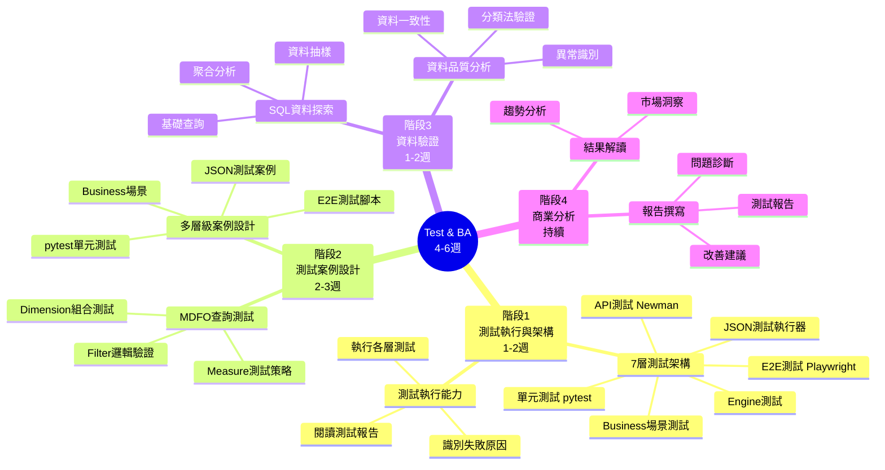

# Test & Business Analysis 角色學習路徑

**版本**: 2.1
**更新日期**: 2025-11-10
**前置要求**: 完成 General Learning Map 基礎階段 (01-05)

---

## 設計原則

- **角色專屬技能**: 專注於 Test & BA 角色特定的專業能力
- **避免重複**: 不重複 General Map 已涵蓋的通用內容
- **實務導向**: 以實際測試與分析場景為學習核心
- **漸進式學習**: 從執行測試 → 設計測試 → 分析問題

---

## 學習路徑概覽

### 🗺️ Test & BA 技能地圖

---

## 核心學習內容

### 1️⃣ 測試框架與工具理解

> **學習目標**: 理解多層級測試架構，掌握各測試工具的定位與使用場景

#### Smart Insight Engine 測試架構層級
- **第 1 層：單元與整合測試 (pytest)**
  - 測試個別元件與模組互動
  - Django TestCase 資料庫整合測試
  - 快速驗證核心邏輯

- **第 2 層：Engine-Level 測試**
  - 測試引擎相容性與路由
  - Multi-Dimension 架構驗證
  - 深度測試引擎行為

- **第 3 層：JSON 測試案例執行器**
  - 測試 MDFO 查詢正確性
  - Simple/Complex 測試案例
  - Measure 功能覆蓋率驗證

- **第 4 層：API 端到端測試**
  - 測試完整 HTTP 請求/回應週期
  - ViewSet 層功能驗證
  - 格式相容性測試

- **第 5 層：Newman/Postman 測試**
  - API 層級測試與認證流程
  - Multi-Dimension 場景測試
  - API 集合測試

- **第 6 層：Business Scenario 測試**
  - 真實商業分析場景測試
  - 使用實際 Taxonomy 資料
  - 業務邏輯一致性驗證

- **第 7 層：前端 E2E 測試 (Playwright)**
  - 使用者完整流程驗證
  - 前後端整合測試
  - Quick Cards UI 功能測試

#### 測試工具定位理解

**pytest (Python 測試框架)**
- **用途**: 後端單元與整合測試
- **測試對象**: Engine、Measure、Utility 函數
- **優勢**: 快速、精確、適合 TDD
- **測試範圍**: 單一功能點

**JSON 測試案例執行器 (test_case_runner.py)**
- **用途**: MDFO 查詢功能測試
- **測試對象**: Measure 計算邏輯正確性
- **優勢**: 測試案例可重用、易於維護
- **測試範圍**: 查詢結果驗證

**Newman/Postman**
- **用途**: API 層級端到端測試
- **測試對象**: HTTP API 完整流程
- **優勢**: 真實 API 呼叫、支援認證
- **測試範圍**: API 集合測試

**Playwright (前端自動化測試)**
- **用途**: 使用者介面 E2E 測試
- **測試對象**: 前端互動流程與顯示
- **優勢**: 跨瀏覽器、真實使用者場景
- **測試範圍**: 端對端使用者流程

#### 測試層級比較表

| 測試層級 | 工具 | 速度 | 覆蓋範圍 | 用途 |
|---------|------|------|---------|------|
| 單元測試 | pytest | 最快 | 單一函數 | 驗證邏輯 |
| 整合測試 | pytest + Django | 快 | 模組互動 | 驗證整合 |
| Engine 測試 | pytest | 快 | Engine 層 | 驗證引擎 |
| Measure 測試 | JSON Runner | 中 | 查詢結果 | 驗證計算 |
| API 測試 | Newman/Postman | 中 | HTTP API | 驗證介面 |
| Business 測試 | Python Scripts | 慢 | 業務場景 | 驗證邏輯 |
| E2E 測試 | Playwright | 最慢 | 完整流程 | 驗證體驗 |

---

### 2️⃣ Smart Insight Engine 測試專業

> **學習目標**: 深入理解 MDFO 查詢結構，能設計有效的測試案例

#### MDFO 查詢結構理解
- **Measure（指標）**
  - 計數類：`product_count`
  - 聚合類：`avg_price`, `price_statistics`
  - 分析類：`co_occurrence_analysis`, `price_distribution`
  - 測試重點：計算邏輯是否正確

- **Dimensions（維度）**
  - 單維度：單一分組（如 Brand）
  - 多維度：交叉分析（如 Brand × DosageForm）
  - 測試重點：維度組合是否正確

- **Filters（篩選）**
  - ANY (OR)：任一條件符合
  - ALL (AND)：全部條件符合
  - 測試重點：邏輯組合是否正確

- **Options（選項）**
  - limit：結果數量限制
  - cross_realms_logic：跨領域邏輯
  - 測試重點：選項是否生效

#### 測試案例設計思維
- **正向測試（Happy Path）**
  - 合法輸入 + 預期結果
  - 驗證核心功能正常

- **負向測試（Error Handling）**
  - 非法輸入 + 錯誤訊息
  - 驗證錯誤處理機制

- **邊界值測試（Boundary）**
  - 極端條件（空結果、最大值）
  - 驗證系統穩定性

- **整合測試（Integration）**
  - 前端 Quick Cards → 後端 API → 資料庫
  - 驗證完整流程

---

### 3️⃣ 資料品質驗證

> **學習目標**: 能識別資料品質問題，進行資料驗證與分析

#### 分類法 (Taxonomy) 驗證
- **階層結構檢查**
  - 父子關係正確性
  - 循環參照檢測
  - 孤立節點識別

- **資料一致性檢查**
  - 名稱標準化
  - 編碼規則一致
  - 多語言對應正確

#### 營養補充品資料驗證
- **SupplementFact（成分）**
  - 成分名稱標準化
  - 劑量單位一致性
  - 階層分類正確性

- **DosageForm（劑型）**
  - 劑型分類完整性
  - 產品對應正確性

- **Brand（品牌）**
  - 品牌名稱清洗
  - 重複品牌合併

#### SQL 資料探索技巧
- **為什麼需要 SQL？**
  - 直接查詢資料庫
  - 驗證 API 回應正確性
  - 進行資料抽樣與統計

- **基礎查詢能力**
  - SELECT, WHERE：資料篩選
  - GROUP BY：資料分組
  - JOIN：資料關聯
  - COUNT, AVG：基本統計

---

### 4️⃣ 商業分析能力

> **學習目標**: 能從測試結果中提取商業洞察，撰寫有價值的分析報告

#### 查詢結果解讀
- **市場分析視角**
  - 哪些品牌產品最多？
  - 哪些成分最受歡迎？
  - 價格分布合理嗎？
  - 劑型偏好趨勢？

- **資料異常識別**
  - 預期結果 vs 實際結果差異
  - 異常數值模式（過高/過低）
  - 缺失資料影響
  - 資料分布異常

#### 測試與分析報告撰寫
- **測試執行報告**
  - 測試範圍與案例數量
  - 通過/失敗統計
  - 關鍵問題列表
  - 影響範圍評估

- **問題診斷報告**
  - 問題現象描述
  - 根本原因分析
  - 影響範圍評估
  - 修復建議與優先級

- **資料品質報告**
  - 資料品質指標（完整性、準確性、一致性）
  - 問題分類統計
  - 改善建議

---

## 學習階段規劃

### 階段 1：測試執行與架構理解（1-2 週）

**學習重點**：
- 理解 7 層測試架構
- 理解各測試工具的定位與用途
- 執行各層級測試案例
- 閱讀與解讀測試報告

**實作練習**：
- 執行 pytest 單元與整合測試
- 執行 JSON 測試案例執行器（quick_test.py）
- 執行 Engine-level 測試
- 執行 API 測試（Postman/Newman）
- 執行 Business Scenario 測試
- 執行 Playwright E2E 測試

**能力檢核**：
- [ ] 理解 7 層測試架構與各層定位
- [ ] 能執行各層級測試
- [ ] 能閱讀並理解測試報告
- [ ] 能識別測試失敗原因
- [ ] 理解測試層級的選擇時機

---

### 階段 2：測試案例設計能力（2-3 週）

**學習重點**：
- 深入理解 MDFO 查詢結構
- 設計多層級測試案例
- 理解測試案例設計原則
- 撰寫 JSON 測試案例與測試腳本

**實作練習**：
- 設計 JSON 測試案例（Simple/Complex）
- 設計 Measure 功能測試案例
- 設計 Business Scenario 測試
- 撰寫 pytest 單元測試
- 撰寫 Playwright E2E 測試腳本
- 設計邊界值與錯誤測試

**能力檢核**：
- [ ] 深入理解 MDFO 查詢結構
- [ ] 能設計正向/負向/邊界測試案例
- [ ] 能撰寫 JSON 測試案例檔案
- [ ] 能撰寫 pytest 測試案例
- [ ] 能撰寫 Playwright 測試腳本
- [ ] 能為不同測試層級選擇合適測試策略

---

### 階段 3：資料驗證能力（1-2 週）

**學習重點**：
- 資料品質概念
- 分類法驗證方法
- SQL 資料探索

**實作練習**：
- 驗證分類法階層結構
- 檢查資料一致性問題
- 使用 SQL 查詢驗證資料
- 識別資料品質問題

**能力檢核**：
- [ ] 能驗證分類法正確性
- [ ] 能識別資料品質問題
- [ ] 能使用 SQL 進行資料探索
- [ ] 能撰寫資料品質報告

---

### 階段 4：商業分析能力（持續）

**學習重點**：
- 從資料中提取洞察
- 撰寫分析報告
- 提出改善建議

**實作練習**：
- 分析測試結果並提取洞察
- 撰寫測試報告
- 撰寫問題診斷報告
- 提出系統改善建議

**能力檢核**：
- [ ] 能從測試結果中提取商業洞察
- [ ] 能撰寫清晰的測試報告
- [ ] 能診斷問題並分析根本原因
- [ ] 能提出有價值的改善建議

---

## 工具與資源

### 必備工具
- ✅ **pytest** - 單元與整合測試框架
- ✅ **Django TestCase** - Django 整合測試
- ✅ **JSON 測試案例執行器** - quick_test.py, test_case_runner.py
- ✅ **Newman/Postman** - API 測試工具
- ✅ **Playwright** - 前端 E2E 測試框架
- ✅ **Python 3.8+** - 測試腳本語言
- ✅ **SQLite / SQL** - 資料庫查詢
- ✅ **Git** - 版本控制（已於 General Map 學習）

### 學習資源

#### 內部文檔
- `spec/Canonical_Query_Schema.md` - MDFO 查詢結構規格
- `spec/Measure_Reference.md` - 指標參考文檔
- `spec/Error_Warning_Test_Matrix.md` - 錯誤測試矩陣
- `tests/README.md` - 測試架構說明
- `tests/TEST_RUNNER_README.md` - 測試執行器使用指南
- `tests/MULTI_DIMENSION_BUSINESS_TESTING.md` - 商業場景測試文檔
- `tests/testcase/` - JSON 測試案例範例
- `tests/incremental_tests.md` - 增量測試套件

#### 外部資源
- **pytest 文檔**: https://docs.pytest.org/
- **Django Testing**: https://docs.djangoproject.com/en/stable/topics/testing/
- **Newman CLI**: https://learning.postman.com/docs/running-collections/using-newman-cli/
- **Playwright 文檔**: https://playwright.dev/python/
- **SQL 教學**: https://www.sqltutorial.org/

---

## 能力驗證標準

### 基礎能力（完成階段 1-2）
- ✅ 理解 7 層測試架構與各層定位
- ✅ 能執行各層級測試（pytest, JSON Runner, Newman, Playwright）
- ✅ 理解 MDFO 查詢結構
- ✅ 能設計基本測試案例（JSON/pytest/Playwright）
- ✅ 能閱讀並理解各類測試報告
- ✅ 能撰寫 Bug Report

### 進階能力（完成階段 3-4）
- ✅ 能為不同場景選擇合適的測試層級
- ✅ 能獨立設計完整多層級測試方案
- ✅ 能設計 Business Scenario 測試
- ✅ 能驗證資料品質與分類法正確性
- ✅ 能使用 SQL 進行資料探索與驗證
- ✅ 能從測試結果中提取商業洞察
- ✅ 能撰寫高品質的測試與分析報告

---

## 常見問題

### Q: 需要精通 Python 嗎？
A: 不需要。只需要能讀懂測試程式碼、撰寫簡單的測試案例即可。重點是測試思維而非程式設計。

### Q: 為什麼需要 7 層測試架構？
A: 不同層級測試不同面向：單元測試驗證邏輯、Engine 測試驗證引擎、JSON Runner 驗證 Measure、API 測試驗證介面、Business 測試驗證業務邏輯、E2E 測試驗證使用者流程。完整覆蓋才能確保品質。

### Q: 所有測試層級都需要學嗎？
A: 是的。Test & BA 角色需要理解並運用全部 7 層測試架構，根據測試目標選擇合適的測試層級與工具組合。

### Q: 需要懂前端開發嗎？
A: 不需要。只需要理解基本 HTML 元素與使用者互動概念，能撰寫 E2E 測試腳本即可。

### Q: SQL 需要學到什麼程度？
A: 基礎查詢即可（SELECT, WHERE, GROUP BY, JOIN）。主要用於驗證 API 回應與資料探索，不需要複雜查詢能力。

---

## 與 General Learning Map 的關係

### General 已涵蓋（不重複）
- ❌ Git 基礎操作
- ❌ 測試基本概念（測試層級、測試類型）
- ❌ Bug 報告撰寫
- ❌ JSON 格式理解
- ❌ API 基礎概念

### 本文件專注於
- ✅ Smart Insight Engine 7 層測試架構理解
- ✅ pytest/Django/JSON Runner/Newman/Playwright 測試工具
- ✅ MDFO 查詢測試專業知識
- ✅ Measure 功能測試與 Business Scenario 測試
- ✅ Engine-level 與 Multi-Dimension 架構測試
- ✅ 營養補充品資料驗證
- ✅ SQL 資料探索技巧
- ✅ 測試案例設計進階技巧（多層級）
- ✅ 商業分析與報告撰寫

---

**版本歷史**

| 版本 | 日期 | 變更內容 | 作者 |
|------|------|---------|------|
| 1.0 | 2025-11-10 | 初始版本 | Learning Team |
| 1.1 | 2025-11-10 | 新增 Playwright E2E 測試章節 | Learning Team |
| 2.0 | 2025-11-10 | 重構為 Learning Map 風格，移除操作細節 | Learning Team |
| 2.1 | 2025-11-10 | 整合完整 7 層測試架構（Heimdallr + SmartInsight）| Learning Team |
