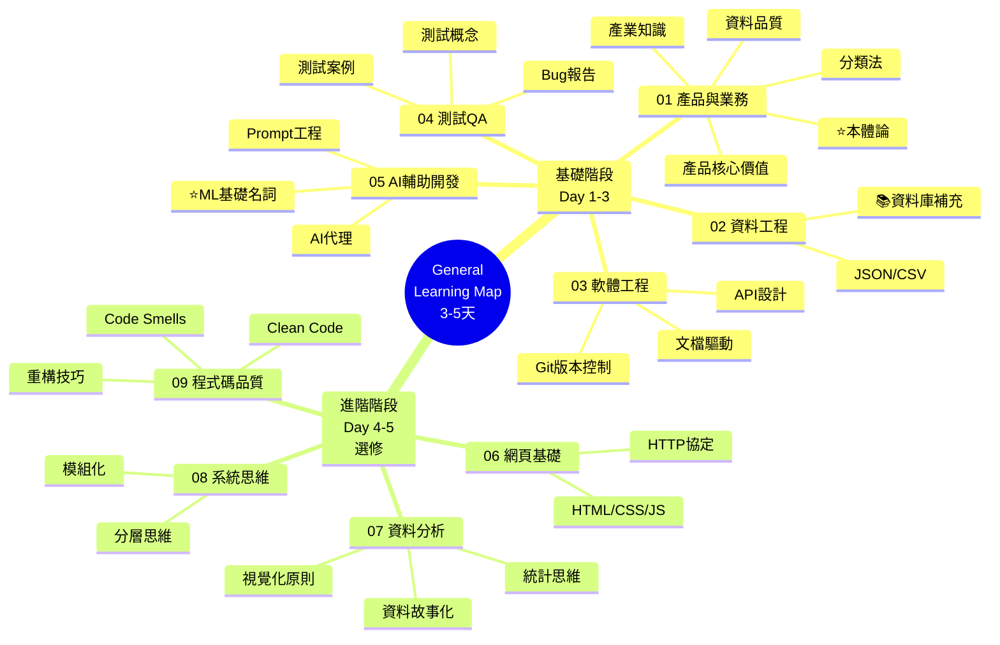

# General Learning Map - 通用核心能力大綱

**版本**: 2.0
**更新日期**: 2025-11-10
**適用角色**: 所有團隊成員 (Test & Business Analysis, Crawler Engineer)

---

## 設計原則

- **可遷移技能**: 聚焦通用概念，而非專案特定細節
- **跨角色適用**: 對 Test & Business Analysis 和 Crawler Engineer 都相關
- **漸進式學習**: 從基礎到進階的結構化內容
- **實務應用**: 每個概念都包含實際應用場景

---

## 學習路徑概覽

### 📚 完整學習地圖 (01-09) - 總共 3-5 天
**目標**：建立基本概念，不求精通，快速了解全貌

- 01-05：基礎核心能力（必修）
- 06-09：進階主題（依角色需求選修）

### 🗺️ 學習地圖



---

## 📋 完整大綱

### **01_product-business.md - 產品與業務理解**
> 學習階段：基礎 | 深度：概念理解

#### 1.1 產品核心價值
- 產品定位與目標客戶
- 資料生態系統理解
- 各角色在資料鏈中的位置

#### 1.2 營養補充品產業知識
- 常見補充品類型（維他命、礦物質、益生菌等）
- 劑型分類（膠囊、片劑、粉末、液體）
- 常見成分與功效
- 產業認證標準（NSF、USP、GMP）
- 法規環境

#### 1.3 分類法 (Taxonomy) 設計思維
- 什麼是分類法？
  - 系統化分類組織資訊
  - 目的：一致性標註、搜尋、分析
- 分類法類型
  - 階層式（樹狀結構）
  - 扁平式（列表式）
  - 面向式（多維度）
- 設計原則
  - 一致性、可擴展性
  - 互斥性、完整性
  - 以使用者為中心

#### 1.4 資料品質意識
- 六大品質維度
  - 完整性 (Completeness)
  - 準確性 (Accuracy)
  - 一致性 (Consistency)
  - 時效性 (Timeliness)
  - 唯一性 (Uniqueness)
  - 有效性 (Validity)
- 常見資料問題
  - 缺失值、重複資料
  - 格式不一致、異常值
  - 類型錯誤

#### 1.5 本體論 (Ontology) 與知識表示基礎 ⭐ NEW
- 什麼是本體論？
  - 本體論 vs 分類法的差異
  - 形式化知識表示
- 核心概念
  - 概念 (Concepts)
  - 關係 (Relations)
  - 屬性 (Properties)
- 知識建模基礎
  - 實體-關係-實體 (Entity-Relation-Entity)
  - 類別與實例 (Class vs Instance)
  - 繼承與層級關係
- 知識圖譜 (Knowledge Graph) 簡介
  - 什麼是知識圖譜
  - 圖的組成：節點與邊
  - 三元組 (Triple) 結構：主語-謂語-賓語
- 實務應用
  - 產品知識結構設計
  - 如何建模營養補充品領域知識
  - 為什麼本體論對查詢系統重要

---

### **02_data-engineering.md - 資料工程基礎**
> 學習階段：基礎 | 深度：概念理解

#### 2.1 資料結構與格式
- JSON
  - 何時使用、基本語法
  - 最佳實踐
- CSV
  - 優缺點、使用時機
  - 常見問題處理
- XML/YAML (簡介)

#### 2.2 資料庫基礎 📚 (補充資料 - 可選)
> 此章節作為補充資料，不列入核心學習路徑

- 關聯式資料庫核心概念
  - 表格、主鍵、外鍵、索引
  - 基本 SQL 操作 (SELECT, WHERE, JOIN, GROUP BY)
  - JOIN 類型 (INNER, LEFT, RIGHT, FULL)
- 正規化 vs 非正規化
  - 何時使用哪一種
  - 權衡考量
- NoSQL 簡介
  - 何時使用 NoSQL
  - 常見類型 (Document, Key-Value, Graph)

---

### **03_software-engineering.md - 軟體工程實踐**
> 學習階段：基礎 | 深度：概念理解

#### 3.1 版本控制 (Git)
- 為什麼需要版本控制
- 核心概念
  - Repository, Commit, Branch, Remote
- 基本工作流程
  - clone, add, commit, push, pull
  - 分支策略 (Git Flow, GitHub Flow)
- Commit Message 規範
- 處理合併衝突

#### 3.2 文檔驅動開發
- 文檔優先原則
  - 為什麼先寫文檔
  - 文檔類型（規格、設計、API、使用手冊）
- SSOT (Single Source of Truth)
  - 概念與重要性
  - 如何組織文檔
- 技術寫作技巧
  - Markdown 語法
  - 圖表工具 (Mermaid)
  - 文檔結構設計

#### 3.3 API 設計與整合
- 什麼是 API
  - API 的作用與價值
- RESTful API 基礎
  - HTTP 方法 (GET, POST, PUT, DELETE)
  - 狀態碼 (2xx, 4xx, 5xx)
  - Request/Response 結構
- API 設計原則
  - 資源導向設計
  - 版本管理
  - 錯誤處理設計

---

### **04_testing-qa.md - 測試與品質保證基礎**
> 學習階段：基礎 | 深度：概念理解

#### 4.1 為什麼需要測試
- 預防問題而非事後補救
- 確保功能正確運作
- 降低修改程式的風險

#### 4.2 基本測試概念
- 測試的三個層級
  - 單元測試：測試單一功能
  - 整合測試：測試多個功能組合
  - 端對端測試：測試完整流程
- 測試案例類型
  - 成功案例 (Happy Path)：正常使用情境
  - 失敗案例：錯誤輸入情境
  - 邊界案例：極端值測試

#### 4.3 撰寫測試案例的基本思路
- 成功情境：用戶正確使用時會發生什麼
- 失敗情境：用戶輸入錯誤時會發生什麼
- 邊界情境：最大值、最小值、空值

#### 4.4 Bug 報告基礎
- 好的 Bug Report 包含
  - 清楚的標題
  - 如何重現問題
  - 預期結果 vs 實際結果
  - 截圖或錯誤訊息

---

### **05_ai-assisted-dev.md - AI 輔助開發**
> 學習階段：基礎 | 深度：概念理解

#### 5.1 AI 代理 (Subagent) 架構
- 什麼是 AI 代理
  - 代理 vs 聊天機器人
  - 自主性與任務導向
  - 工具使用能力
- 常見代理類型
  - 程式碼生成代理
  - 測試生成代理
  - 程式碼審查代理
  - 除錯代理
  - 研究代理
  - 資料分析代理
  - 文檔代理

#### 5.2 建立自訂 AI 代理
- 代理架構組成
  - System Prompt（職責說明）
  - Tools（可用工具）
  - Context（知識範圍）
  - Output Format（輸出格式）
- 設計原則
  - 單一職責
  - 清楚的邊界
  - 適當的自主性
  - 失敗處理機制
  - 驗證策略
- 建立流程
  1. 定義目的與使用場景
  2. 指定所需工具
  3. 設計 System Prompt
  4. 測試與迭代
  5. 撰寫使用文檔

#### 5.3 Prompt Engineering
- 核心原則
  - 具體明確
  - 提供上下文
  - 使用範例 (Few-shot learning)
  - 指定輸出格式
  - 拆解複雜任務
- 進階技巧
  - Chain-of-thought prompting
  - 角色設定 (Role Prompting)
  - 限制條件設定
- Prompt 反模式
  - 模糊不清的指令
  - 假設上下文
  - 多任務混合
  - 缺少成功標準

#### 5.4 AI 程式碼審查與驗證
- AI 擅長偵測的問題
  - 語法錯誤、常見反模式
  - 缺失的錯誤處理
  - 潛在安全問題
  - 程式碼重複
- 驗證 AI 生成的程式碼
  - 功能性檢查清單
  - 安全性檢查清單
  - 效能考量
  - 可維護性評估
  - 測試性驗證
- 常見 AI 程式碼問題
  - 虛構的函式庫 (Hallucination)
  - 過時的 API
  - 過度工程化
  - 缺少錯誤處理
  - 忽略專案上下文

#### 5.5 AI 與機器學習基礎名詞 ⭐ NEW
- AI 領域基本概念
  - 人工智慧 (AI)
  - 機器學習 (Machine Learning)
  - 深度學習 (Deep Learning)
  - 生成式 AI (Generative AI)
- 常見任務類型
  - 分類 (Classification)
  - 回歸 (Regression)
  - 聚類 (Clustering)
  - 生成 (Generation)
- 大型語言模型 (LLM) 相關術語
  - Token（標記）：文本的最小單位
  - Context Window（上下文窗口）：模型能處理的最大長度
  - Temperature（溫度參數）：控制輸出的隨機性
  - Top-p / Top-k：控制生成的多樣性
- 模型訓練與應用
  - Pre-training（預訓練）
  - Fine-tuning（微調）：針對特定任務調整模型
  - Few-shot Learning（少樣本學習）
  - Zero-shot Learning（零樣本學習）
- 進階概念
  - Embedding（嵌入向量）：文本的數值表示
  - RAG (Retrieval-Augmented Generation)：檢索增強生成
  - Vector Database（向量資料庫）
  - Prompt Template（提示模板）
- 模型評估
  - Accuracy（準確率）
  - Precision（精確率）vs Recall（召回率）
  - F1 Score
- 為什麼要了解這些術語
  - 與 AI 工具更有效溝通
  - 理解 AI 的能力與限制
  - 設計更好的提示詞
  - 評估 AI 輸出品質

---

### **06_web-basics.md - 網頁基礎概念**
> 學習階段：進階 | 深度：概念理解

#### 6.1 網頁的組成
- HTML：內容與結構
- CSS：樣式與外觀
- JavaScript：互動功能

#### 6.2 網路通訊基礎
- HTTP 協定
  - Request（請求）：客戶端向伺服器要資料
  - Response（回應）：伺服器回傳資料
- 常見 HTTP 方法
  - GET：取得資料
  - POST：傳送資料

---

### **07_data-analysis.md - 資料分析與視覺化**
> 學習階段：進階 | 深度：概念理解

#### 7.1 統計思維
- 描述性統計
  - 平均值、中位數、眾數
  - 標準差、變異數
  - 百分位數與分布
- 資料探索技巧
  - 如何探索新資料集
  - 發現異常與模式
  - 提出假設與驗證

#### 7.2 視覺化原則
- 選擇正確的圖表
  - 長條圖 (Bar Chart)：比較類別
  - 折線圖 (Line Chart)：趨勢變化
  - 圓餅圖 (Pie Chart)：比例關係
  - 直方圖 (Histogram)：分布
  - 散佈圖 (Scatter Plot)：相關性
  - 熱圖 (Heatmap)：矩陣數據
- 視覺化最佳實踐
  - 清晰性：標題、標籤、圖例
  - 簡潔性：避免圖表雜訊
  - 色彩使用：有意義、無障礙

#### 7.3 資料故事化
- 從資料到行動
  - 資料 → 資訊 → 洞察 → 行動
- 針對不同受眾調整
  - 技術受眾 vs 業務受眾 vs 管理層
  - 調整深度與重點
- 敘事結構
  - 問題陳述
  - 分析過程
  - 發現與洞察
  - 建議行動

---

### **08_systems-thinking.md - 系統思維入門**
> 學習階段：進階 | 深度：概念理解

#### 8.1 模組化思維
- 什麼是模組化
  - 將複雜系統分解成小單元
  - 每個模組負責單一功能
- 為什麼需要模組化
  - 易於理解
  - 易於測試
  - 易於維護
- 基本原則
  - 高內聚：相關功能放在一起
  - 低耦合：減少模組之間的依賴

#### 8.2 分層思維
- 什麼是分層
  - 將系統分成不同層級
  - 每層負責不同職責
- 常見分層範例
  - 前端 → 後端 → 資料庫
  - 展示層 → 業務邏輯層 → 資料層
- 為什麼要分層
  - 職責清楚
  - 可以獨立修改某一層

---

### **09_code-quality.md - 程式碼品質基礎**
> 學習階段：進階 | 深度：概念理解

#### 9.1 Clean Code 原則
- 有意義的命名
  - 變數名稱要能看出用途
  - 避免縮寫和無意義的名稱
  - 範例：`productCount` 比 `x` 好
- 小函數
  - 一個函數只做一件事
  - 函數長度建議不超過 20-30 行
- DRY 原則 (Don't Repeat Yourself)
  - 避免複製貼上程式碼
  - 重複的邏輯應該提取成函數
- 註解的正確使用
  - 註解解釋「為什麼」而非「是什麼」
  - 好的程式碼應該自我說明
  - 範例：
    ```python
    # Bad: Increment counter
    counter += 1

    # Good: Skip first row because it's header
    start_index = 1
    ```

#### 9.2 常見的程式碼壞味道 (Code Smells)
- 長函數
  - 超過 30-50 行的函數
  - 解決：拆分成小函數
- 重複程式碼
  - 多處出現相同邏輯
  - 解決：提取共用函數
- 過長的參數列表
  - 超過 3-4 個參數
  - 解決：使用物件或字典傳遞參數
- 魔術數字
  - 程式碼中出現沒有說明的數字
  - 解決：定義成常數並命名
  - 範例：`MAX_RETRY_COUNT = 3` 比 `3` 好

#### 9.3 基本重構技巧
- 何時該重構
  - 新增功能前
  - 發現重複程式碼時
  - 程式碼難以理解時
- 重構的安全網
  - 先寫測試
  - 小步驟修改
  - 每次修改後都跑測試

---

## 📊 學習順序建議

### 快速概覽路徑（3-5 天）

**目標**: 建立基本概念，快速了解全貌，不求精通

**Day 1: 產品與資料基礎**
- 上午：01_product-business.md（快速瀏覽 1.1-1.4）
- 下午：02_data-engineering.md（快速瀏覽）

**Day 2: 工程實踐**
- 上午：03_software-engineering.md（Git 基礎、文檔概念）
- 下午：04_testing-qa.md（測試思維）

**Day 3: AI 工具與進階概念**
- 上午：05_ai-assisted-dev.md（AI 代理、Prompt、ML 名詞）⭐
- 下午：01_product-business.md（1.5 本體論）⭐

**Day 4-5: 進階主題（依角色選修）**
- 06_web-basics.md（網頁基礎）
- 07_data-analysis.md（資料分析）
- 08_systems-thinking.md（系統思維）
- 09_code-quality.md（程式碼品質）

### 學習重點

- ✅ 理解「是什麼」、「為什麼」
- ✅ 知道「何時使用」
- ❌ 不需要「如何實作細節」
- ❌ 不需要「完全精通」

---

## 📌 能力驗證標準

完成學習後，員工應該能夠：

### 基礎能力（01-05）
1. ✅ 理解並說明產品的核心價值與資料生態系統
2. ✅ 理解分類法與本體論的差異，能設計基本的知識結構 ⭐
3. ✅ 識別並處理常見的資料品質問題
4. ✅ 使用 Git 進行日常協作開發
5. ✅ 撰寫清晰的技術文檔與 API 規格
6. ✅ 設計完整的測試案例集（含邊界案例）
7. ✅ 建立自訂的 AI 代理來輔助工作
8. ✅ 撰寫有效的 Prompt 完成複雜任務
9. ✅ 理解常見 AI/ML 術語，能與 AI 工具有效溝通 ⭐

### 進階能力（06-09）
10. ✅ 理解網頁爬蟲的倫理與技術考量
11. ✅ 選擇合適的圖表呈現資料洞察
12. ✅ 理解模組化與分層思維
13. ✅ 撰寫乾淨易讀的程式碼
14. ✅ 識別並改善程式碼壞味道

---

## 🔄 版本歷史

| 版本 | 日期 | 變更內容 | 作者 |
|------|------|---------|------|
| 1.0 | 2025-11-10 | 初始版本 | Learning Team |
| 2.0 | 2025-11-10 | 新增本體論與 AI/ML 基礎名詞章節 | Learning Team |

---

## 📝 備註

- ⭐ 標記為 v2.0 新增內容
- 各主題詳細內容將分別撰寫於對應檔案中
- 此大綱作為整體學習地圖的導航與索引
