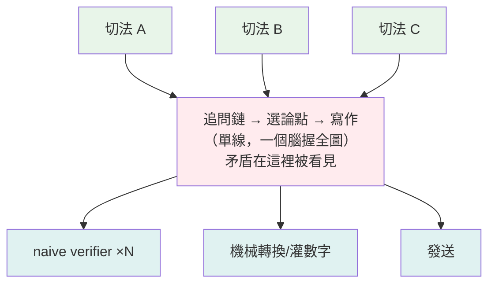

# 原子化＝Context 隔離：什麼時候切、什麼時候絕不能切

---

## 📋 文檔目的

這一篇接在 [compute-state-context.md](./compute-state-context.md) 之後讀最好。那一篇說：**context 是從 state 切出來、餵給這一次計算的那一片**。這一篇問下一個問題：當你把一條「生產知識」的流程切成一個個獨立單元（原子化）時——**每個單元拿到的 context 也被切了，這件事什麼時候是好事、什麼時候是災難？**

讀完你應該能回答：

1. 為什麼「這個流程能不能原子化」本身是問錯的問題？正確的問題是什麼？
2. 同樣是「把工作切碎交給獨立 agent」，為什麼**驗證**切了品質反而上升、**寫作**切了品質必然下降？
3. 想複用一條好的推理鏈，除了把它切碎，還有哪四層方法？
4. 一份 editorial plan（編輯計畫）為什麼既不是原子也不是推理——它是第五種東西？
5. 「隔離的 verifier 更客觀」這句話哪裡講太滿了？（Truth 軸 vs Worth 軸）

---

## 1. 核心判準：原子化＝強制的 context 隔離

先從一個常見場景說起。一條「產出分析報告」的流程——查資料、找洞察、選論點、寫成文——你想把它切成一個個可獨立執行、可重跑、可平行的單元。直覺的問法是：「這些工作能不能獨立完成？」

這是問錯的問題，因為**答案幾乎永遠是能**（品質另計）。切成單元的真正代價藏在別處：

> **設計鐵律**：把工作切成獨立單元時，你同時切斷的是**單元之間的 context**。
> 所以判斷能不能切，不要問「這段工作能不能獨立完成」，
> 要問——**context 對這段工作是什麼角色？**

context 的角色只有三種，每一種對應一個完全不同的答案：

| context 的角色 | 意思 | 原子化的效果 |
|---|---|---|
| **引擎** | 上一步的結果決定下一步的問題：追問鏈、論證、敘事弧線 | 切了＝拆掉引擎 ❌ |
| **偏誤** | 已成形的敘事會污染判斷：驗證、評審、天真走查 | 切了＝消毒，品質反升 ✅✅（＊僅 Truth 軸，§7 修正） |
| **無關／可外化** | 確定性計算、格式轉換、查詢、寄送；context 可壓成 metadata | 切了＝純賺 ✅ |

同一把刀（context 隔離），對不同工作是「拆引擎」還是「消毒」，決定一切。

這也解釋了一個表面矛盾：團隊 UX 走查 skill（cognitive-walkthrough）的實測教訓是「explorer / verifier **必須**是 context 隔離的天真 subagent（主 agent 自己走會被自己的預期污染，量產假發現）」，但深度分析的追問鏈卻**必須**留在同一個腦裡。同一個機制、兩種相反的效果——因為 context 在前者是偏誤，在後者是引擎。

---

## 2. 六種工作型態的光譜

「這個流程能不能原子化」問錯的第二個原因：同一條流程裡，不同工序落在光譜的不同位置。要**逐工序問**。

以「雙資料源對照分析報告」（例：供給側上架資料 × 需求側創作者聲量）為例：

| 工作型態 | context 的角色 | 原子化 | 例子 |
|---|---|---|---|
| **探索初掃**（多切法平行 sweep） | 各切法互不依賴（弱耦合） | ✅ 適用 | 不同分母、不同維度平行掃 |
| **追問鏈**（發現深化） | 引擎 | ❌ 不適用 | 「氧化鎂：標題含 7 筆 → 成分表含 16 筆 → 以單方產品上架 **0** 筆」——0 的意思是：新品貨架上已經沒有人單獨賣這個被創作者罵翻的廉價形式，它只剩複方成分表裡的一行。故事在第三跳才出現，而第三跳來自前兩跳的「不滿足感」 |
| **論點選擇／矛盾偵測** | 引擎（關係存在於原子**之間**） | ❌ 不適用 | 「六種鎂形式標價全在 $24–25」單獨看很無聊；但市場正把這六種化學形式行銷成階梯式升級（高級形式理應賣更貴），全部同價＝升級敘事沒有反映在價格上——撞上主敘事，才變成該篇分析最好的一節 |
| **寫作**（thesis → 成稿） | 引擎（全局弧線、voice、伏筆回收） | ❌ 不適用 | insight 逐條串接的成品＝「五個並列區塊」，有結構、沒論點 |
| **驗證／複驗** | 偏誤（生產者敘事） | ✅✅ 隔離更準＊ | naive verifier 不知道你想講什麼故事，就不會替故事護航（＊僅 Truth 軸，§7） |
| **儲存／複用・轉換／交付** | 無關（外化成 metadata／確定性） | ✅ 純賺 | 每個統計數字綁查詢＋時間戳；md→html；寄送腳本 |

上表的追問鏈例子值得多看一眼：如果「查氧化鎂的數字」是一個獨立的原子任務，agent 拿到 7 或 16 就會交卷。會去切第三刀，是因為**同一個推理者**看著前兩個結果覺得「不對，這還不是故事」。把發現過程原子化，等於把「不滿足感」切掉了。

---

## 3. 影響效果：切對與切錯的不對稱

兩邊的效果不是對稱的。切對的收益全部指向「**機械可重現**」；切錯的代價全部是「**全局性質的死亡**」。

### 切對地方，你得到——

1. **可重現**：原子自帶重建它所需的一切（以資料分析場景為例：查詢語句＋資料時間戳），任何時候重跑。資料源改版造成「跨期數字不可比」時，母體版本隨查詢自動被記錄。
2. **平行度**：互不依賴 → 多切法同時掃，探索期 wall-clock 大幅壓縮。
3. **偏誤隔離（消毒）**：驗證者不帶敘事 → 不護航。唯一一種「切了品質反而上升」的情況（Truth 軸內）。
4. **失敗隔離**：一顆原子錯，只重跑一顆，不沉全篇。
5. **複用與組合**：這一輪沒用上的驗證過發現進候選池，下一輪直接查。
6. **可稽核**：「資料誠實聲明」從自律變成機械產物——每個數字天生可追溯。

### 切錯地方，你付出——

1. **鏈斷裂**：發現是路徑依賴的。原子任務拿到「一個答案」就交卷，不會產生「再切一刀」。
2. **關係盲**：矛盾、共振、首尾呼應都活在原子**之間**；孤立的生產者永遠看不見自己撞上另一顆原子。
3. **縫隙無主（最隱蔽）**：品質缺陷從單元內部遷移到單元之間——每顆原子都合格、整體平庸，而且**沒有任何一顆原子該為此負責**。最危險的是它給你「全綠」的假信心。
4. **局部最優 ≠ 全局最優**：每段各自衝到最精彩 → 冗餘、搶戲、沒有節奏。好文章需要有段落甘願當配角。
5. **voice 碎裂與同質化**：模板化生產的原子趨向 generic 語言（「紅海」「死棋」）；具體性（具名的人＋原句、具名的品牌＋SKU）才是可信度的來源。
6. **序列化成本（兩頭虧）**：如果原子要做好需要全圖，你得把全圖餵給每一顆原子——成本比單線更高，還失去了整合者。

第 3 條值得對新人多說一句：這是原子化最隱蔽的失敗模式，因為**它不會報錯**。每個單元的驗收都通過，出問題的是單元之間沒人負責的縫。碰到「各部分都沒問題但整體就是不對」的成品，先懷疑這裡。

---

## 4. 常見誤判：用「大小」當切分軸

「段落比整篇小，所以段落是好的原子單位」——這是用**量的軸（大小）**去切一個**性質的問題（耦合結構）**。正確的軸是**依賴結構＋可局部驗證性**，跟單位大小無關。

四個 litmus 問題，任何流程通用：

1. **不看其他單元，能判斷這個單元「做對了」嗎？**——能 → 可切。（一條統計數字＝查詢＋結果，自足可驗；「這段服務論點嗎」必須看全篇 → 不可切。）
2. **做完第 N 個單元，會改變第 N+1 個單元「該是什麼」嗎？**——會 → 路徑依賴，不可切。
3. **成品的價值在單元「裡」，還是在單元的「排列與關係」裡？**——在關係裡 → 不可切。（論證＝關係的產物；一袋證據不是論證。）
4. **兩顆原子互相矛盾時，誰會發現？**——沒人 → 縫隙無主，不可切（或必須加一個握全圖的整合者）。

業界同構，佐證這不是內容生產的特例：**map-reduce** 成立的前提是 key 之間獨立；**microservice** 沿低耦合縫切是解耦、沿高耦合縫切是「分散式單體」（兩個世界的缺點兼得）；**單元測試**原子化很好，但永遠需要整合測試補「縫」；多 agent 長文寫作的普遍結論＝段落級分工 → 冗餘＋無弧線。

---

## 5. 正確形狀：沙漏

把判準套回一條完整流程，會得到一個固定的形狀：



- **上端寬**：平行探掃（發散，原子 ✅）
- **中間窄**：追問→選論點→寫作（收斂，單線 ❌ 不可切）
- **下端寬**：平行驗證＋機械轉換＋交付（發散，原子 ✅✅）

> **一句話**：兩端越原子越好，中間的脖子必須窄——**脖子就是推理品質所在**。
> 危險的從來不是原子化本身，是把脖子也切了。

---

## 6. 推理鏈的複用：不拆引擎的四層方法

脖子不能切，那一條好的推理鏈怎麼複用？關鍵是換複用的對象：**「複用鏈的執行過程」會傷品質；可複用的是鏈的「生成器」與鏈的「沉積物」**，一共四層：

| 層 | 複用什麼 | 怎麼運作 |
|---|---|---|
| **L1 招式層** | 追問的**問題模板**，不是答案 | 「換個切法還成立嗎？分母是什麼？」「是誰撐起來的？」——每輪的鏈重新長，但**長鏈的方法**被複用 |
| **L2 範例層** | 帶註解的**推理軌跡**（worked example） | 好的追問鏈連同「為什麼每一跳要跳」的註解存下來，教下一次推理者**鏈的形狀**，不限制內容 |
| **L3 硬化層** | **已穩定的子鏈**編譯成機械檢查 | 某段推理連續幾輪都長一樣（例：時序檢驗＝切前後半、比佔比）→ 它已經不是推理、是程序 → 變腳本 |
| **L4 結論層** | 鏈的**產物**（驗證過的發現＋查詢＋時間戳） | 下一輪的鏈不從零挖，站在候選池上重新推理 |

為什麼這樣不失品質？因為**活的鏈從頭到尾沒被拆**——複用進場的位置全在鏈的外面：

- **L1、L2 在鏈啟動前**進場（更好的問題、更好的示範＝更好的燃料）
- **L3 在鏈執行中**以工具形態進場（被推理者**呼叫**，不是**取代**推理者——儀表不開車）
- **L4 在鏈結束後**收割（沉積物墊高下一輪的地板）

生命週期串起來看：每一輪的推理鏈執行完就死，但留下四種遺產——新招式→方法文件（L1）、好軌跡→範例（L2）、穩定子鏈→腳本（L3）、驗證過的結論→候選池（L4）。下一輪的鏈站在遺產上**重新長**。重新長不是浪費，是品質的來源：跑步的還是同一個腦，只是拿到更好的油、更好的儀表、更高的起跑線。

兩個反面要警惕：

1. **過早硬化（L3 的風險）**：子鏈還沒證明夠一般就編譯＝給推理鋪軌，鏈只沿軌走、錯過新跳法。硬化門檻建議＝「連續 3 輪長得一模一樣」。
2. **範例錨定（L2 的風險）**：下一輪的推理者拚命想複製上一輪範例的形狀。解法＝範例**成對存、形狀互異**（一條「越切越小最後歸零」＋一條「反向證據推翻主敘事」）——教的是跳躍的膽量，不是特定路線。

---

## 7. 案例：TheJournalism Report Pipeline v4

（repo：`LuminNexus-AlchemyMind-TheJournalism`，設計文件：`docs/20260612_report_pipeline_v4_design.md`）

v4 把 pipeline 的軸從「newsroom 角色（誰做）」換成「**epistemic state**（資訊處於什麼信任狀態）」——八個狀態、七個躍遷，一個 stage（A–G）負責一個躍遷：

```text
資料 →A→ 事實 →B→ 洞察候選 →C→ 已驗證洞察 →D→ 敘事承諾(人閘) →E→ 散文與圖 →F→ 已查核散文 →G→ 出版物
     編譯     調查          對抗驗證        編輯計畫+人審       撰寫+製圖      逐句查核       組裝出版
```

這是沙漏框架目前最完整的工程化實作——值得逐項對照。先給四個會反覆出現的內部名詞一句話定義（細節見設計文件，讀本節不需要更多）：

- **lens**：一種分析視角（結構／品牌／異常…），Stage B 平行掃描的單位——一個 lens＝一個獨立調查 agent。
- **beat**：編輯計畫裡的段落級寫作單位，每個 beat 指定段落形狀、目的、與它必須引用的事實 ID。
- **spine**：整份報告的敘事主軸——跨洞察的新綜合（「這三個 pattern 合起來暗示 X」）。
- **human gate**：Stage D 後的強制人審停點，三種結果：**approve**（放行）／**revise**（退回改計畫）／**re-investigate**（退回 Stage B 補調查）。

### 7.1 對照分類

| v4 產物 | 框架位置 | 判定 |
|---|---|---|
| Stage A `corpus.facts.json`（無 LLM 機械編譯＋provenance） | context 無關 → 純賺 | 「數字綁查詢」做到底的樣子 |
| Stage B lens fan-out（structure／brands／anomaly…） | 沙漏上端：平行探掃 | 原子化的是**視角**不是鏈——追問鏈活在每個 lens 內部（on-demand drill-down） |
| Stage C 對抗驗證（refute 須附 `refute_evidence[]`） | 沙漏下端：消毒 | 「另一種故事可以想像」不算 refute——寫進 schema 的紀律 |
| `insights.verified.json`（statement＋cited_facts＋verdict） | L4 沉積物 | 洞察候選池的現成實作：一池餵多份報告 |
| `insights.refuted.json`（死假設連理由保留） | L4 **負**沉積 | 防止重新驗屍死假設——L4 框架原本沒想到的一層 |
| Stage D editorial plan＋human gate | **第五類：承諾物**（見 7.2） | 脖子本體——被做窄，而不是被切 |

### 7.2 第五類產物：承諾物（commitment artifact）

editorial plan 不落在原子（L4）也不落在推理（脖子）——它是兩者之間的**介面**，有雙重身分：

- **產生它的「動作」＝脖子**：單一 LLM pass、全 pipeline 唯一的判斷集中點＋唯一強制停下的 human gate。spine（跨洞察的新綜合，「這三個 pattern 合起來暗示 X」）的認識論地位明文＝「human-approved judgment」——不歸任何自動驗證管，歸人。
- **它產出的「物件」＝可原子執行的合約**：每個 beat 帶 paragraph_shape／purpose／anchor_facts，章級 narrative_frame＋resolution_position——弧線、對比、callback 全部**預先承諾**在 plan 裡，下游才能安全 fan-out。

於是 Writer 逐 beat 寫作（看似 §3 說「必死」的段落級原子化）不死——因為**縫隙有主了**，三道機制各堵一種縫：

- **anchor constraint**：beat 只准錨定已驗證洞察或原始事實——未驗證的假設進不了計畫。
- **typed blocker**：Writer 寫到一半發現「事實撐不起這個 beat」時，發一張結構化的阻擋單退回 Editor；只准改該 beat、不准動 spine，動到 spine 就必須重新過人閘（防止下游修修改改把人審過的主軸架空）。
- **逐句 entailment 查核**：機械抽出每一個「句子＋它引用的事實」配對，逐對檢查句子有沒有超出事實能支撐的範圍（引用**存在**不夠，還要引用**忠實**）。

> **一句話**：脖子沒有被切——是被**做窄、做早、做成一份可稽核的合約**。

### 7.3 它有沒有切到不該切的？——有，四條

四條切口全部穿過「context 是引擎」的區域，但每道切口上都裝了儀器：

| 切口 | 切掉了什麼 | 裝的儀器（補丁） | 蓋得住嗎 |
|---|---|---|---|
| **① 跨 lens 追問鏈** | lens 內鏈完整；跨 lens 的鏈（A 視角的發現引出該問 B 視角的問題）只能走 gate 的 re-investigate 退回 Stage B——人工中介、明文 never automated | re-investigate 這個出口本身＝承認斷鏈、人手搭橋 | 部分 |
| **② 地形不過境** | Editor 只收**倖存者**不收**地形**——死路、不滿足感、「感覺有東西沒挖出來」全蒸發（而最好的反直覺段落常來自地圖上不合直覺的區塊）；Editor 也不能自己補查資料（drill-down 是 lens 才有的能力） | refuted.json 保留死假設＋理由——但記錄的是「被殺的結論」，記不了「未成形的直覺」 | 最弱 |
| **③ 驗證先於收斂** | 「三個弱訊號指向同一方向」的**組合價值**對逐顆 verifier 不可見；anchor constraint 使其成硬約束 | 舉證責任（refute 必須附反證事實，「另一種故事可以想像」不算數）＋殺率雙向校準（殺太少＝驗證是裝飾；殺太多＝反直覺洞察最先死，驗證變成**平庸過濾器**——只剩人人都想得到的結論）＋人閘可下 re-investigate 翻案 | 部分 |
| **④ 決策充分性（Worth 軸）** | Stage C 孤立 verifier 逐顆驗「**真**」，抓不到 **true but misleading**——範圍過度外推、快照講成趨勢、覆蓋過度宣稱。隔離消毒掉生產者的敘事偏誤時，把「消費者拿這條洞察**敢不敢下注**」的判斷 context 一起切掉了 | `insight-stress-test` skill：角色扮演決策者＋**機械強制資訊不對稱**（questioner 只見 statements、明令不得查資料），每問＝「不被回答就不敢下注」。先在 pipeline 外試跑，等抓到的問題模式穩定，再收編成 Stage C 的正式檢查 | 在補（draft） |

### 7.4 由切口④倒逼的框架修正：Truth 軸 vs Worth 軸

§1 那格「context 是偏誤 → 隔離必升 ✅✅」講太滿了。驗證其實有兩軸，隔離只對其中一軸是消毒：

- **Truth 軸（是不是真的）**：生產者的敘事 context＝**偏誤** → 隔離＝消毒 ✅✅——原判定在這一軸成立。
- **Worth 軸（拿去做決策夠不夠）**：消費者的決策 context＝**判準本身** → 隔離連它一起切掉 → true-but-misleading 全數漏網。

> **修正後的原則**：隔離不是把 context 歸零，是**選擇灌哪一種**——
> 切掉生產者的敘事 context，灌入消費者的決策 context。
> stress-test 同時做兩件事：對資料隔離（看不到數字）＋對決策沉浸（角色扮演）——隔離與灌注並存，不矛盾。

這個修正讓 §1 的判準更精確：問「context 是什麼角色」之前，要先多問一句——**誰的 context？**

### 7.5 判定

v4 用鏈的連續性換了三樣東西：**scale**（13 個市場品類——如關節健康、長壽——可以過夜批跑各出一份報告）、**可稽核**（每句話溯源到 fact/insight ID）、**複用**（一池餵多報告）。工程紀律＝「知道自己在哪裡切，就在切口上裝儀器」。

這四刀對**參考型多章報告**（價值在覆蓋與可稽核，兩端寬、脖子薄）是划算的稅；對**單論點深度分析**（價值就在鏈與地形感，產品本身就是脖子）會是致命傷。跨產品搬架構時：該搬 Stage A（fact 編譯）與洞察池（schema 可直接抄），不該搬 beat 級分工結構——那會把差異化優勢標準化掉。

---

## 8. 對新人的實務守則

1. **不要問「能不能切」，問「context 是誰的、什麼角色」**：引擎 → 不切；偏誤 → 切了更好；無關 → 隨便切。同一條流程逐工序問。
2. **用依賴結構選切分軸，不要用大小**：四個 litmus 問題（可局部驗證？路徑依賴？價值在關係裡？矛盾誰發現？）比「這塊看起來夠小」可靠得多。
3. **把流程整成沙漏**：探索與驗證兩端盡量原子化（平行、可重跑、可稽核），追問→選論點→寫作收成單線。發現自己在切脖子時停手。
4. **複用推理鏈走 L1–L4，不要切執行**：抽招式、存範例、硬化穩定子鏈、收割結論——四層全在引擎外面。
5. **「各部分都對但整體不對」→ 先查縫**：縫隙無主不報錯；每次原子化之後，明確指定誰握全圖、誰負責單元之間的縫。
6. **驗證要問兩次**：這是真的嗎（Truth，隔離驗）？拿去下注夠嗎（Worth，灌入決策 context 驗）？只做第一次，true-but-misleading 全數漏網。

---

## 相關文檔

- [compute-state-context.md](./compute-state-context.md) - 前篇：context 是交給無記憶 compute 的那一片 state；本篇問的是「切開工作時，那一片給誰、給多少」
- [contextops-discipline.md](./contextops-discipline.md) - ContextOps：把 context 組裝當 pipeline 管理——本篇的判準決定「哪些工序值得進這條 pipeline」
- [tension-value-perspective.md](./tension-value-perspective.md) - 事實單一、價值多元：Worth 軸（§7.4）正是「同一條洞察對不同決策者價值不同」的驗證版
- [emergence-data-compute.md](./emergence-data-compute.md) - 遞歸循環與回存：L4 沉積物（§6）是同一個「輸出回存為下一輪輸入」模式
- [know-your-unknowns.md](./know-your-unknowns.md) - 追問鏈的「不滿足感」（§2）與 null space 探索是同一種能力

---

## 📝 文檔維護

### 版本歷史

| 版本 | 日期 | 作者 | 變更說明 |
|------|------|------|----------|
| 1.0 | 2026-07-07 | leana | 初版建立：核心判準（context 三角色）、六型光譜、切對/切錯不對稱、大小軸誤判與 litmus、沙漏、L1–L4 推理鏈複用、TheJournalism v4 案例（四切口、承諾物、Truth/Worth 修正）、實務守則 |
| 1.1 | 2026-07-07 | leana | 依天真讀者測讀（7/10）修訂：§2 兩大例證補「故事是什麼」、§7 開頭加 A–G 對照與 lens/beat/spine/gate 名詞小抄、§7.2 三機制與 §7.3 儀器欄降密度改白話、§7.5 標明 market 粒度、§1 UX 教訓補出處、§3 query/as_of 標明為場景例示 |
| 1.2 | 2026-07-07 | leana | 二輪天真讀者複測（整體 8.5/10、§7 由 5→7.5）殘留微修：§2「六種鎂形式」補主詞、「掛牌」改「以單方產品上架」、§1 走查 skill 具名 cognitive-walkthrough、§7.3 切口④「離線發現層」改白話 |

---

**文檔結束**
