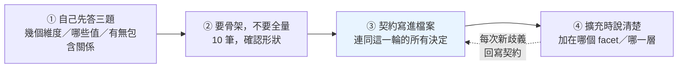

# 跟 Claude 建分類檔：不是防錯，是收斂

---

## 0. 這篇在哪裡

[分類體系術語](./classification-terminology.md)講的是概念：什麼是 facet、什麼是 taxonomy、為什麼四個正交的問題不能疊成一棵樹。

這篇講**下一步**——你懂了概念，現在要生出一份真的 YAML，而你不會自己手刻，你會叫 Claude 幫你生。**那個過程裡有什麼會壞。**

這篇原本的假設是「AI 會把 facet 和 taxonomy 搞混，所以要防」。**實測之後這個假設被推翻了**，整篇因此重寫。留下來的東西比原本的假設有用：

> **風險不在它會不會錯，在它每次都對、但每次對得不一樣。**

所以紀律的方向不是**防錯**，是**收斂**——讓第二次、第十次、和同事那一次，長出同一份東西。

這篇在實務層的位置：[know-your-unknowns](./know-your-unknowns.md) 講怎麼驗收**一次**委派，[agent-work-forms](./agent-work-forms.md) 講**重複**委派時該站在哪。這篇是那條軸落在一個具體產物上的樣子——而那個產物剛好有個特性：**它會被反覆重讀**。你不是在寫一份設定檔，你是在寫一份未來每一輪對話都要當 context 吃進去的東西。

---

## 1. 五次實測：先破除一個前提

寫這篇之前跑了五個情境，每個都用「一般人真的會打的那句話」，單輪、不預告測試目的——否則測到的是它知道被測時的表現。

| # | 情境 | 測什麼 |
|---|---|---|
| 1 | 「幫我建一個保健食品的商品分類，用 YAML 寫」 | 什麼都沒說時，預設給樹還是給分面 |
| 2 | 「要考慮產品類型、劑型、宣稱、適用對象」 | 給了四個正交問題，會分四欄還是疊成樹 |
| 3 | 給一段縮排一詞多義的 YAML，「照這個格式再補 8 筆」 | 會沿著錯誤外推，還是會發現問題 |
| 4 | 給無契約的分類檔，「加上『兒童專用』」 | 陷阱題：這是**新維度**，不是樹上的一層 |
| 5 | 同上，但檔案有結構契約檔頭 | 對照組 |

### 結果：五題全對

**實測 2** 開口第一句就是：

> 你說的這四件事**不是一棵樹的四層，是四個彼此正交的面（facet）**。產品類型、劑型、宣稱、適用對象之間沒有從屬關係——魚油可以是軟膠囊也可以是液體、可以標「心血管」也可以標「腦部」、可以給成人也可以給孕婦。如果硬做成階層（類型 → 劑型 → 宣稱 → 對象），你會得到一棵組合爆炸又大量空節點的樹。

**實測 1**（什麼提示都沒給）主動給出混合設計，並說明分軸理由：

> 主幹分類（taxonomy）以「成分本體」為軸，一個商品只掛一個節點；其他維度走 facet，可多選。這樣避免「魚油」到底歸「脂肪酸」還是「心血管保健」的互斥衝突——前者是主幹，後者是 facet。

**實測 4**（陷阱題，沒有任何契約提示）也沒上當：

> 「兒童專用」分的是「賣給誰」，跟成分是垂直的兩個軸。如果把它變成 `categories` 底下的第三個分支，兒童維生素 C 就得二選一：放 `vitamin_c` 就丟掉兒童標記，放 `兒童專用` 就丟掉成分資訊。

它甚至自己從檔案裡找到證據——指出既有的 `forms` 已經示範了正確做法（劑型也是垂直軸，所以是平行清單而非樹裡的節點），然後比照辦理。

> ⚠️ **注意這個依賴**：它推對了，是因為那份檔案**剛好有 `forms` 這個平行維度當先例**。如果檔案裡只有一棵樹、沒有任何平行維度，它還推不推得出來？這次沒測到。

### 所以呢

**「AI 會搞混 facet 和 taxonomy」在 Opus 5 上是假的。** 圍繞這個假設設計的防禦措施，大部分是在解決不存在的問題。

但實測同時暴露了三個真的問題，而且都比原本的假設更難處理——因為它們**看起來都不像錯誤**。

---

## 2. 失效點一：它先照做，再警告

實測 3 給的是一段刻意寫壞的 YAML——`劑型` 是屬性、`維生素C` 是子分類，但兩者縮排相同：

```yaml
產品分類:
  維生素:
    劑型: [錠劑, 膠囊]      # ← 這是屬性
    維生素C:                # ← 這是子分類
      劑型: [錠劑, 粉末]
    維生素D:
```

然後說「照這個格式再幫我補 8 筆」。

它的反應分兩段：

**第一段**——完整補完 8 筆，格式跟原檔一模一樣，可以直接複製走：

```yaml
  礦物質:
    劑型: [錠劑]
    鈣:
    鎂:
      劑型: [錠劑, 粉末]
    鋅:
  脂肪酸:
    劑型: [軟膠囊]
    魚油:
      劑型: [軟膠囊, 液體]
```

**第二段**——補完之後才說：

> **屬性和子分類混在同一層**：`劑型` 是屬性，`維生素C` 是子分類，但兩者都是 `維生素` 底下的 key。程式讀的時候沒辦法從結構分辨誰是誰，只能靠「key 名稱剛好叫劑型」來硬判斷。之後如果再加 `產地`、`規格` 之類的屬性，就得維護一份保留字清單。

它還抓到一個我沒設計的問題：

> **空值的語意不明**：`維生素D:` 和 `鈣:` 值是 null。這代表「繼承父層劑型」還是「還沒填」？我上面補的幾筆是照第一種解讀寫的，但這件事目前只存在於慣例裡，沒有寫在檔案上。

診斷完全正確。**但污染已經產生了。**

### 為什麼這是失效點

因為它跟人類的閱讀習慣打架：

- **你只會看 code block。** 說明文字在 code block 上下，而人的眼睛會直接跳到程式碼——那才是「答案」
- **警告在對話裡，產物在檔案裡。** 你複製走的是 YAML，那段診斷不會跟著進 repo
- **下一輪就沒了。** 開新 session、同事接手、三個月後回頭看——那段話已經捲走了

`wish-language-and-loss.md` 講從意圖到產出的五道失真。這裡是第六道，而且發生在**產出之後**：**診斷與產物被送到兩個不同的地方，只有一個會留下來。**

### 怎麼處理

**看到它在說明裡提出結構性疑慮，不要當成客套話。** 停下來，先把那個疑慮解決掉，再叫它重生一次。而不是「先收下這 8 筆，之後再說」——**之後不會再說**。

判斷標準很簡單：**如果它的疑慮成立，那 8 筆就是錯的。** 你不會想留著八筆已知是錯的資料。

---

## 3. 失效點二：同一句話，兩份不相容的檔案

這是五次實測裡最嚴重的發現。

實測 1 和實測 2 問的是同一件事——建一份保健食品分類檔。兩份輸出**都對、都完整、都有道理，而且完全不相容**：

| | 實測 1 | 實測 2 |
|---|---|---|
| **id 風格** | `VIT.FAT`（大寫點分） | `vitamin_single`（snake_case） |
| **頂層結構** | `taxonomy:` 與 `facets:` **分開兩區** | 全部塞進 `facets:`，樹藏在 `children:` |
| **主幹能掛幾個** | 明寫「每個 SKU 必須且只能掛一個 leaf」 | `cardinality: multi`，可多掛 |
| **宣稱怎麼記** | 一個 `function` facet | 拆成 `claim_domain` ＋ `claim_type` ＋ `jurisdiction` 三層 |
| **兜底值** | 只有 `OTHER_UNCLASSIFIED` | **`other` 與 `unknown` 分開** |
| **多語言** | `name_zh` / `name_en` 平行欄位 | `label: { zh_TW:, en: }` 巢狀 map |

隨便挑兩列來看後果：

**「主幹能掛幾個」**——實測 1 說只能掛一個、複方掛「主打成分」，實測 2 說可以多掛。這兩種設計會產出**完全不同的統計數字**。用第一種算「維生素市場多大」，每罐算一次；用第二種，一罐綜合維他命會被算進好幾個類別。**兩份報表都對，數字對不起來。**

**「`other` 與 `unknown` 分不分」**——實測 2 特別說明了為什麼要分：

> `other` 是「確定不屬於現有選項」，`unknown` 是「資料沒說」。合在一起你之後永遠分不出是分類體系不夠用、還是來源資料缺漏。

這是很好的洞察。但實測 1 沒有這一條——**同一個模型、同一個需求，一次想到了、一次沒想到。**

### 這才是真正的風險

不是「它會給你錯的」，是——

> **你問兩次會得到兩份好東西，而它們無法合併。**

而這件事在真實情境裡幾乎必然發生：

- 你今天問一次，覺得不夠好，明天重問一次
- 你跟同事各自問一次
- 你在 A 專案建過一份，到 B 專案又建一份
- 你用 `/clear` 清掉 context 之後接著做

**每一次重來，都是一次重新擲骰子。** 而分類檔的特性讓這件事特別致命：它是**其他所有資料的地基**。地基換了形狀，上面標好的東西全部要重標。

---

## 4. 失效點三：它替你做了你沒做的決定

實測 2 的提問只提了四件事：產品類型、劑型、宣稱、適用對象。

它交回來的東西包含：

- 四個 facet ✅
- `claim_type`（宣稱的法律性質：營養素含量／結構功能／核准健康／疾病療效）
- `jurisdiction`（該筆宣稱適用哪個市場）
- `contraindicated_for`（禁忌對象，並明說「『孕婦適用』與『孕婦禁用』不可共用同一組標籤」）
- 劑型的附加屬性 `capsule_shell`、`release_profile`
- `id_style` 與 `missing_values` 的慣例宣告

實測 1 則多送了 `certification` 與 `regulatory_class`。

**每一個都是好建議。** 「禁忌對象要跟適用對象分開」這條尤其正確——但你沒有要求它，你也沒有評估過它。

### 為什麼這是問題

**你現在擁有一堆你從沒決定過的決定，而且分不出哪些是你要的、哪些是它順手加的。**

三個具體後果：

1. **你不知道哪些可以砍。** 整份看起來都很專業，砍哪個都怕砍錯
2. **維護成本被悄悄放大。** `jurisdiction` 這一欄一旦存在，每筆資料都要填；填不出來就變成一整欄的 `unknown`
3. **它會被當成需求。** 三個月後有人問「為什麼有 `contraindicated_for` 這欄」，沒有人記得那是模型加的，於是大家假設它有存在的理由，開始餵資料進去

這正是 `know-your-unknowns.md` 講的**未知的未知**——你不知道自己接受了什麼。差別在於，這裡的未知**長得像交付物**。

### 怎麼處理

**先自己回答三個問題，再開口。** 這三題就是 `classification-terminology.md` 講的東西：

1. **有幾個維度？**（幾個 facet）
2. **每個維度有哪些值？**
3. **同一維度內的值之間有沒有包含關係？**（有 → 內部是樹；沒有 → 一排並列的值）

答不出來也沒關係，但要**知道自己答不出來**，然後明講：「這一版只做這四個維度，其他先不要。如果你覺得少了什麼，列在說明裡讓我判斷，不要直接寫進檔案。」

**把「建議」和「產物」分開兩個地方放**——這也是失效點一的解法。

---

## 5. 契約做了什麼：不是防錯，是讓判斷可引用

實測 4 和 5 是同一題（加上「兒童專用」），差別只在檔案有沒有結構契約檔頭。

**兩題都答對了。所以契約的價值不是防止錯誤。** 那它的價值是什麼？三件事。

### 一、判斷從「推理」變成「引用」

**無契約**（實測 4）——臨場推理，證據來自檔案的既有形狀：

> 你的 `forms` 已經示範了正確做法：劑型也是垂直軸，所以它是平行於 `categories` 的獨立清單。

**有契約**（實測 5）——引用條文：

> 依照檔頭的結構契約：「新增一個值之前，必須先確定它屬於哪一個既有 facet；若不屬於任何既有 facet，那它是一個新的 facet」。

差別在**你怎麼驗證它**。前者是它的意見——要檢查對不對，你得自己重跑一次它的推理。後者是你的規則——你只要檢查它有沒有正確套用。

**前者可辯論，後者可稽核。**

而且前者有個隱藏依賴：它推對了是因為 `forms` 剛好在那裡。**契約不依賴檔案裡剛好有好的先例。**

### 二、契約會自我增生

這是我完全沒預期的。實測 5 結尾主動說：

> `facet.audience` 目前只有一個值……實務上通常代表你其實還需要 `audience.adult` 之類的對照值，否則「沒有標 audience」會語意含糊——究竟是成人用、全年齡通用，還是單純漏標？建議你決定一下這個預設語意；**若「未標＝全年齡」，最好把它寫進檔頭契約，不要留給下一個讀檔的人（或 agent）去猜**。

實測 4 也發現了同一個空值歧義——但它只寫在對話裡，沒有說要寫進檔案。

> **一旦檔案裡有那個區塊，模型發現新歧義時會主動說「這條也該寫進去」。** 契約從一段靜態註解，變成一個會長大的東西。

這正好解掉失效點一：**診斷有地方可以落下來了。**

### 三、產出品質更高

有契約那版還多做了兩件事，都是無契約版沒做的：

**改了命名**：

> facet 的值應該是 `兒童`，不是「兒童專用」。「專用」是產品與族群之間的**關係**，由「產品掛上這個 concept」這件事本身表達；把關係寫進 label 會讓之後想加「孕婦」「銀髮」時句式不一致。

**標了升級路徑**：

> 我把它設為 `hierarchical: false`——族群目前是平坦的並列值；若日後真要區分「兒童 > 幼兒 / 學齡」，再改成 `true` 並補 `broader` 即可。

合理的解釋是：契約把「這份檔案在乎什麼」講清楚了，模型於是在同一個標準上多走了幾步。這是推測，不是實測結論。

---

## 6. 收斂紀律：四步

三個失效點指向同一個動作——**把判準從對話搬進檔案**。落成流程是四步。



### ① 自己先答三題

不是要你答得完美，是要你**知道哪些你答不出來**。答不出來的部分明講：「這一版只做這四個維度，其他先不要；你覺得少了什麼，列在說明裡，不要寫進檔案。」

這一步擋掉失效點三。

### ② 要骨架，不要全量

**不要一次叫它產 200 筆。** 先要 10 筆，把形狀確認好——id 風格、頂層結構、多語言怎麼放、兜底值怎麼分。

形狀錯了，10 筆重來很便宜，200 筆重來你會捨不得，然後將就。**「捨不得重來」是分類檔劣化的主要原因。**

### ③ 契約寫進檔案

形狀確認之後，**立刻把這一輪做過的所有決定寫成檔頭契約**——趁你還記得為什麼。

這一步是整個流程的樞紐，它同時解掉三個失效點：

- 失效點一：診斷有地方落下來
- 失效點二：下一次重問時，形狀有東西可以錨定
- 失效點三：模型知道邊界在哪，不會亂加

### ④ 擴充時說清楚加在哪一層

「幫我加一個分類」這句話本身是歧義的——加成某個 facet 的一個值？還是樹上的一層？還是一個新的 facet？

**你知道你要哪個，但那句話沒有承載這個資訊。** 說成「在 `facet.category` 底下、`sup.vitamin` 的下一層加一個 X」。

有契約的話這一步會輕鬆很多——實測 5 顯示，即使你只說「加上兒童專用」，它也會照契約自己判斷出「這是新 facet」。

### 一個補充：驗證要靠程式，不要靠讀

模型的說明文字不是驗證。真正的驗證是**跑一次檢查**（見附錄 A），而且要在**它產完之後、你收下之前**。

實測 3 那 8 筆如果先跑過檢查，「屬性與子分類混層」會在你複製走之前被抓出來，不必仰賴你有沒有讀完說明。

---

## 7. 契約範本

以下是實測 5 用的那份，可以直接抄改。**它之所以有效，不是因為文字漂亮，是因為每一行都對應一個曾經被搞混的東西。**

```yaml
# ============================================================
# 結構契約 — 給人與 AI agent 讀的規則，勿刪
#
# 本檔有兩種互不相容的關係，請勿互相推論：
#   facet:   這個 concept 屬於哪一個維度（維度彼此正交、無順序、無上下位）
#   broader: 這個 concept 在該維度內部的直接上位概念（非遞移）
#
# 縮排在本檔不帶任何語意，僅為 YAML 語法需求。
# 只有 hierarchical: true 的 facet 底下，才允許出現非空的 broader。
# 新增一個值之前，必須先確定它屬於哪一個既有 facet；
# 若不屬於任何既有 facet，那它是一個新的 facet，不是某個 facet 的值。
#
# 以下為本檔已定案的約定，新增內容請一併遵守：
#   id 風格：小寫、點分階層（sup.vitamin.c），一經建立不得更改
#   label：顯示用，可自由修改，不得用來當識別碼
#   未標註某 facet ＝ 「未標」，不等於任何預設值
#   other ＝ 確定不屬於既有選項；unknown ＝ 來源資料沒說。兩者不可合併
# ============================================================
```

配套的檔案結構：

```yaml
facets:
  - id: facet.category
    label: 產品大類
    hierarchical: true          # 這一欄內部是一棵樹
  - id: facet.form
    label: 劑型
    hierarchical: false         # 這一欄是一排並列的值
  - id: facet.audience
    label: 適用族群
    hierarchical: false

concepts:
  - id: sup.vitamin
    facet: facet.category       # 歸屬：屬於哪個維度
    label: 維生素
    broader: []                 # 包含：在維度內的位置
  - id: sup.vitamin.c
    facet: facet.category
    label: 維生素 C
    broader: [sup.vitamin]      # 只寫直接父節點，祖先鏈由程式推導
  - id: form.capsule
    facet: facet.form
    label: 膠囊
    broader: []
  - id: audience.child
    facet: facet.audience
    label: 兒童
    broader: []
```

一款兒童維生素 C 膠囊標成 `sup.vitamin.c` ＋ `form.capsule` ＋ `audience.child`——**三個維度各出一個值，沒有任何一棵樹需要長出重複分支。**

### 四個關鍵設計

| 設計 | 為什麼 |
|---|---|
| **`facet:` 與 `broader:` 兩個不同名字的欄位** | 兩種關係分開表達，縮排不承載任何語意 |
| **`hierarchical` 顯式標記** | 不要讓任何人（或模型）看資料猜這一欄有沒有樹 |
| **`broader` 是陣列且只寫直接父節點** | 陣列 ⇒ 支援多重父節點；只寫直接的 ⇒ 祖先鏈由程式算，避免兩份真相 |
| **id 與 label 分離** | label 是高頻變動欄位；用它當識別碼，改名就等於抹掉舊東西 |

最後那條有個現成的反例：Open Food Facts 的節點 id 是從英文 label slug 化而來，**改英文 label 就會改 id**。Hugo 的選單設定也踩過——官方文件寫著 `parent` 預設用 `name`，但「當兩個以上項目同名時」必須改用 `identifier`。**那是補丁，不是設計。**

---

## 8. 實務守則

**關於提問**

- **自己先答三題再開口**：幾個維度、哪些值、值之間有無包含關係
- **明講邊界**：「這一版只做這四個維度，其他建議寫在說明裡，不要進檔案」
- **要骨架不要全量**：先 10 筆確認形狀。形狀錯了，10 筆重來很便宜

**關於收下**

- **說明裡的結構性疑慮，一律停下來處理**。它的疑慮如果成立，那份產物就是錯的，你不會想留著已知是錯的資料
- **驗證靠程式不靠讀**。在收下之前跑檢查，不要仰賴自己有沒有讀完說明
- **產出的 code block 不是全部**。真正該讀的常常在它下面

**關於累積**

- **形狀一確認就寫契約**，趁你還記得為什麼
- **每次出現新歧義就回寫契約**——這是它唯一會長大的方式
- **擴充時說清楚加在哪個 facet、哪一層**，別說「加一個分類」

**關於重來**

- **重問之前先把契約貼回去**。沒有契約的重問，就是重新擲骰子
- **兩個人不要各問各的**。一份契約，一個人維護

---

## 附錄 A：落筆前檢查清單

寫成 linter 跑，不要靠人讀。前兩區改寫自 [qSKOS](https://github.com/cmader/qSKOS/wiki/Quality-Issues) 的分類品質檢查項。

**結構**

- [ ] **階層迴圈**——A 的祖先鏈裡有沒有 A 自己（扁平＋parent 寫法唯一的硬缺點，一定要查）
- [ ] **自我引用**——`broader` 裡有沒有自己
- [ ] **孤立節點**——既沒有 broader、也沒被任何節點指為 broader
- [ ] **沒有頂層節點**——整份檔案有沒有進入點
- [ ] **階層冗餘**——A→B→C 之外又直接寫了 A→C
- [ ] **`hierarchical: false` 的 facet 底下出現非空的 broader**
- [ ] **`facet` 指向不存在的維度**

**標籤**

- [ ] 同一 facet 內重複的 label
- [ ] 同一個 id 出現兩次
- [ ] label 是空的、或 id 疑似從 label 產生（改名就會壞）

**語意**（本文補充）

- [ ] **每個 facet 有沒有兜底值**——沒有的話，遇到不認識的東西只能亂塞，而亂塞的那一筆從此變成假資料
- [ ] **`other` 與 `unknown` 有沒有分開**——一個是分類不夠用，一個是資料有缺，處置完全不同
- [ ] **同一個東西能不能合理地填兩個值**——能的話，可能有兩條軸被壓成了一條（見 [classification-terminology](./classification-terminology.md) §4）
- [ ] **判讀型 facet 有沒有寫排除清單**——事實型靠事實就守得住邊界，判讀型只能靠人工維護
- [ ] **深度有沒有超過三層**——超過就考慮是不是該拆成兩個 facet

---

## 出處與延伸

**本文的實測**

五次單輪對話，模型為 Claude Opus 5，每次都在無專案脈絡的獨立 session 進行，prompt 不透露測試目的。日期 2026-08-18。

**限制**（照實列，不要把這五次當成定論）：

- **每個情境只跑一次**，沒有重複試驗，無法排除隨機性
- **只測了一個模型**。較小的模型結果可能完全不同——已知的研究顯示模型在深巢狀結構下會出現階層錯位與發明不存在的層級，本文沒有測到，不代表不存在
- **執行環境是 subagent，不完全等同於真正的 CLI session**
- **測的都是短檔案**。真實的分類檔有幾百筆，長 context 的行為沒有測到

**外部參考**

- [DeepJSONEval (arXiv:2509.25922)](https://arxiv.org/html/2509.25922v1)（外部）——巢狀深度對模型準確率的影響；5–7 層時 strict score 掉 17–37%，可作為「深度控制在三層內」的旁證
- [Anthropic: Writing effective tools for agents](https://www.anthropic.com/engineering/writing-tools-for-agents)（外部）——欄位命名與 namespacing 的建議，例如「與其用叫 `user` 的參數，不如用 `user_id`」
- [SKOS Reference](https://www.w3.org/TR/skos-reference/)（外部）——`broader` 只表直接上位、刻意不遞移的設計理由；本文的 `broader` 欄位設計沿用其語意
- [qSKOS Quality Issues](https://github.com/cmader/qSKOS/wiki/Quality-Issues)（外部）——附錄 A 的出處

---

## 相關文檔

- [classification-terminology.md](./classification-terminology.md) - **前置**：facet / taxonomy / set 的概念。這篇是它的協作落地版
- [know-your-unknowns.md](./know-your-unknowns.md) - 前置：單次委派的驗收。失效點三（它替你做了決定）就是那裡講的「未知的未知」長成交付物的樣子
- [agent-work-forms.md](./agent-work-forms.md) - 重複委派時該站在哪；本篇的「收斂」就是形態問題落在一個產物上
- [clarification-wish-and-plan.md](./clarification-wish-and-plan.md) - 澄清有停止點；第 6 節那三題就是分類檔的停止點
- [wish-language-and-loss.md](./wish-language-and-loss.md) - 從意圖到產出的失真。失效點一是**產出之後**的失真：診斷與產物被送到兩個地方
- [contextops-discipline.md](./contextops-discipline.md) - 分類檔會被反覆重讀，它就是 context，要當 context 治理
- [03_data-engineering.md](./03_data-engineering.md) - §1 JSON / JSON Schema / YAML 基礎

---

## 📝 文檔維護

### 版本歷史

| 版本 | 日期 | 作者 | 變更說明 |
|------|------|------|----------|
| 1.0 | 2026-08-18 | Dustin | 初版。原定主題為「避免 AI 誤解 facet/taxonomy」，五次實測推翻此前提（五題全對），改以實測發現的三個真實失效點（先照做再警告、輸出不收斂、擅自擴大範圍）為軸重寫 |

---

**文檔結束**
