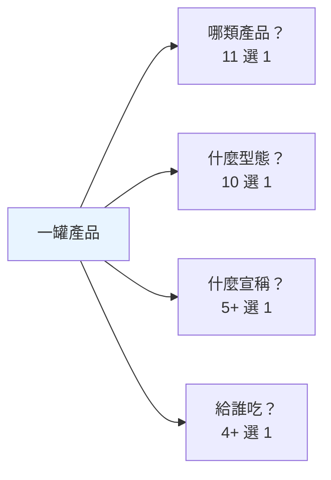
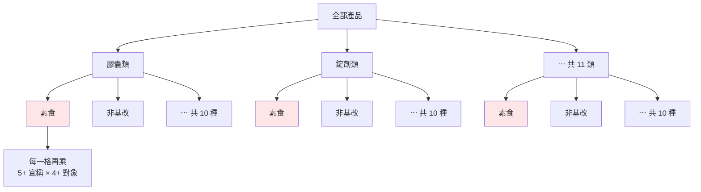
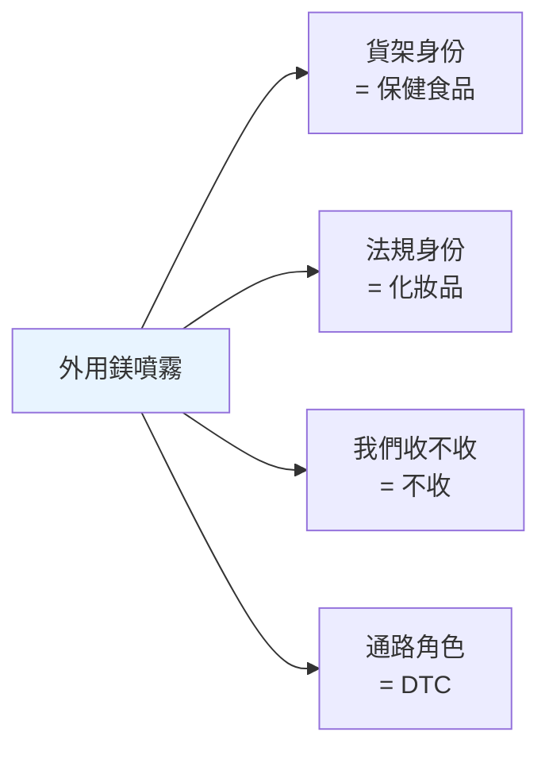
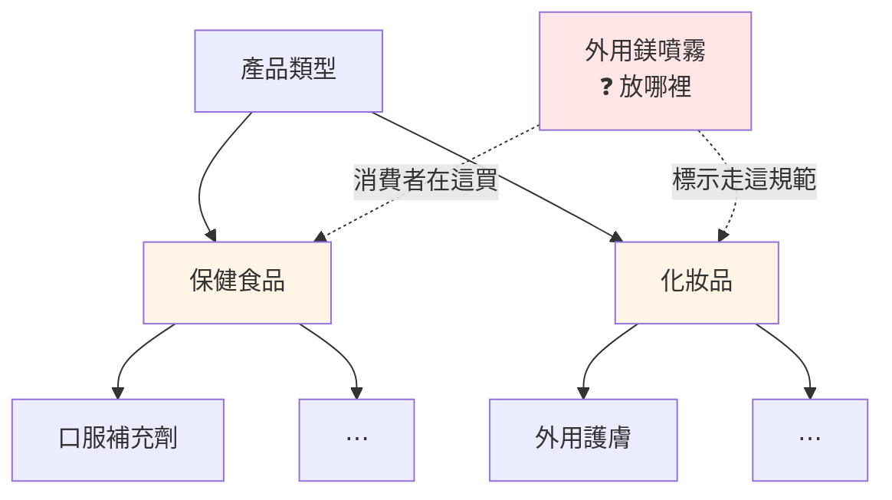
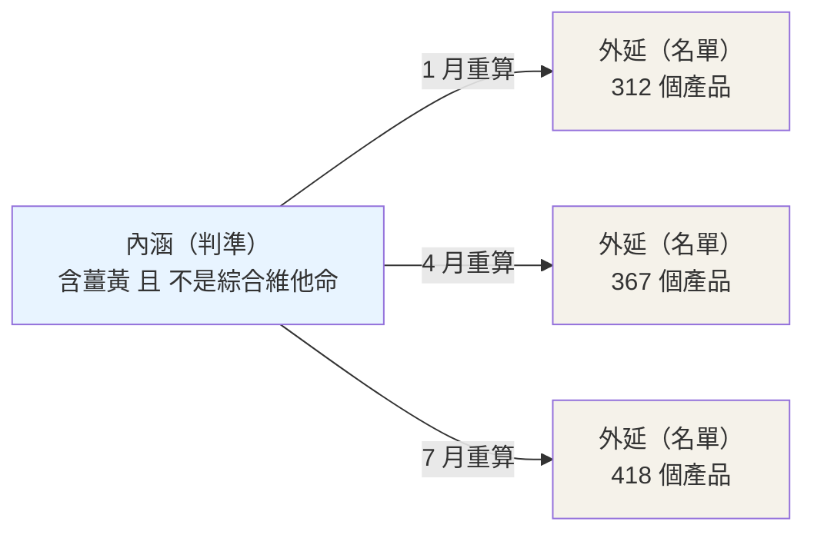
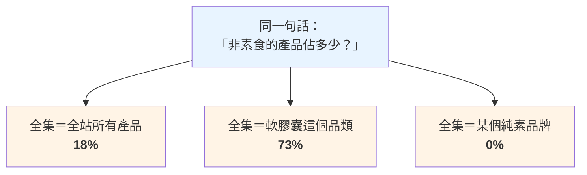
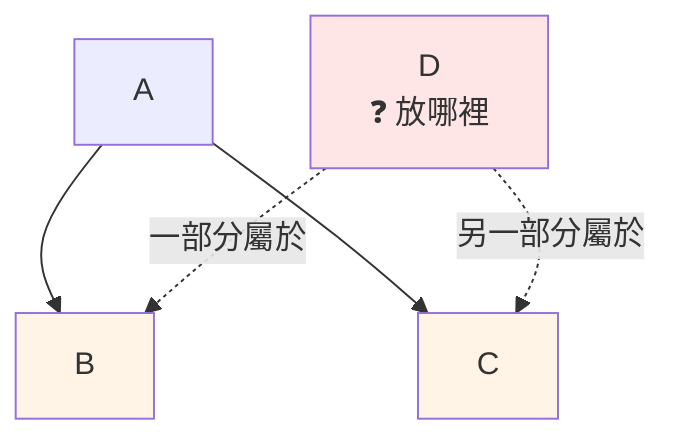
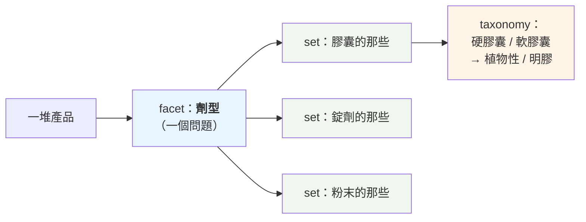

# 分類體系術語：taxonomy / facet / set / canonical

## 📋 文檔目的

這批詞看起來各不相干，其實在回答**同一組問題**：

> 一大堆東西擺在面前，**哪些算數、怎麼分類、怎麼命名、怎麼確認兩個名字指的是同一個東西**。

它們不屬於保健食品產業——換成汽車零件、換成書店庫存，同一套詞照樣成立。這也是它們跟[產業術語](./supplement-industry-terminology.md)的分界線：**「這個詞搬到別的產業還講得通嗎？」通 → 在本文；不通 → 在產業術語文。**

**本文教的是概念，不是某個系統怎麼實作。** 內文會拿我們自己的系統當例子，但只到「有個系統這樣用」為止；要知道某個系統實際怎麼跑，請直接讀那個系統的文件。

### 一個貫穿全文的真實案例

我們資料庫裡有一堆這樣的東西：

```
Lion's Mane  ·  lions mane  ·  Lions Mane  ·  Hericium erinaceus  ·  猴頭菇
```

它們是同一種菇。但因為成分名稱從未正規化，**同一個成分在資料庫裡碎成約 90 種寫法**，於是「猴頭菇市場有多大」這個問題，答案直接錯了。

從「發現它碎了」到「把它收攏」，一路上要用的詞就是本文這批。

> **怎麼讀**：先看下面「一句話總結」認個臉，第 1 節（taxonomy vs facet）與第 4 節（集合）是本文核心，其餘用到再查。

---

## 🎯 一句話總結

| 術語 | 白話 |
|------|------|
| **taxonomy（分類法）** | 一棵樹。每個東西掛在樹上的一個位置 |
| **facet（分面）** | 一個 facet = 一個問題，而**它的答案推導不出別的問題的答案** |
| **set（集合）** | 一群「算數的東西」。**它的本體是那條判準，不是那份名單** |
| **canonical（正典）** | 一群同義寫法裡，被選為官方代表的那一個 |
| **alias（別名）** | 「這些寫法都指向同一個 canonical」的對照表 |
| **slug** | 給機器用的乾淨識別字串：全小寫、空格改連字號、去標點 |
| **realm（領域）** | 一個自帶 schema 與 taxonomy 的獨立分析維度。⚠️ 先問「誰的 realm」 |
| **kind（種類）** | 同一層裡的類型標記 |
| **predicate（謂詞／判準）** | 兩個意思：可判定真假的**條件**，或一句話裡的那個**關係** |
| **cohort（同群）** | 為了互相比較而圈在一起的一群——**成員資格會回頭影響每個成員的讀數** |
| **macro** | 一個字四個意思，看到先確認脈絡 |

---

## 1. 兩種分類法：taxonomy 與 facet

### 先看 taxonomy（分類法）

**一棵樹。每個東西掛在樹上的一個位置。**

```
SupplementFact
├─ Vitamins
│   ├─ Vitamin C
│   └─ Vitamin D
├─ Minerals
│   ├─ Calcium
│   └─ Zinc
└─ Probiotics
```

特性是**階層、有父子關係、互斥**——往下鑽一條路徑，最後停在一個節點。站內完整教材見 [`smart-insight-engine/01_mdof-fundamentals.md`](../projects/prismavision/smart-insight-engine/01_mdof-fundamentals.md) §3.2。

公司與品牌的歸屬也是一棵樹：`公司 → 品牌 → 子品牌`，往上只有一個母親。

### 再看 facet（分面）

**一個 facet = 一個問題。** 這個問題對每個東西都問得出答案，而且**它的答案推導不出別的問題的答案**。

如果你讀過[產業術語文第 4 節](./supplement-industry-terminology.md)，你已經看過 facet 了——那節說「品質驗證標章回答『**這罐是不是它說的東西**』，消費者訴求標章回答『**合不合我的價值觀**』，**一罐有機非基改的產品完全可能沒做過任何含量驗證**」。那就是兩個 facet：兩個獨立的問題，互相推導不出對方。

> 💡 那節還補了第三個觀察：**兩種標章都不回答「有沒有效」**。這正是 facet 思維的日常用法——先問「這批分類軸各自回答什麼」，才看得出**它們共同答不出什麼**。

要檢查一組分類軸切得乾不乾淨，最省事的做法是替每一軸填三格：**這一軸回答什麼問題／它答不出什麼／它跟別軸有沒有互相決定**。第三格只要出現「有」，那兩軸就不是獨立的，該併成一軸或重新切。

### 最好的比喻：電商的篩選側欄

你在購物網站左邊看到的那條側欄：

```
劑型      □ 膠囊  □ 錠劑  □ 粉末  □ 軟糖
飲食適性  □ 素食  □ 非基改  □ 無麩質
認證      □ USP  □ NSF  □ USDA Organic
適用對象  □ 成人  □ 兒童  □ 孕哺
```

**每個粗體標題是一個 facet，底下的勾選項是它的值。**

這個比喻好在它自帶正確的運作規則：

- 同一組裡勾兩個 → **OR**（膠囊**或**錠劑都給我）
- 跨組各勾一個 → **AND**（要是膠囊**而且**要素食）

這兩條不是某個網站的巧思，是**分面檢索的標準語意**——凡是照 facet 做的篩選介面都這樣運作。反過來說，一個介面如果「同一組裡勾兩個」會讓結果變少，那它底下就不是 facet。

> ⚠️ **不要用「尺」來理解 facet。** 尺（scale）暗示有刻度、有大小順序，但 facet 的答案通常沒有——軟膠囊不比膠囊「大」，孕婦不比成人「高」。站內文件明確反對過這個比喻：[`isomorphic-tension.html`](./isomorphic-tension.html) 的「**predicate 是 facet 不是 scale**」，理由是「每個成員本身就是一個維度，彼此不可通約」。

### 為什麼需要 facet：30 vs 2,200

國際食品描述標準 **LanguaL** 用四組編碼描述一項產品，各組回答一個問題：

| 問的問題 | 大約幾種答案 |
|---|---|
| 這是哪類產品？ | 11 |
| 這是什麼物理型態？ | 10 |
| 標了哪種宣稱？ | 5 起跳 |
| 給誰吃的？ | 4 起跳 |

- **當成 facet**：11 + 10 + 5 + 4 = **約 30 個標籤**
- **當成一棵樹**：11 × 10 × 5 × 4 = **約 2,200 個葉節點**

差別在哪，畫出來最快。**facet 是四欄各自獨立**：



**同樣四個問題塞成一棵樹，第二層就開始重複**：



**「素食」這一個概念，在樹上被複製了 11 份**（紅色節點）——而且下面每一份還要各自再長出宣稱與對象兩層。改一次「素食」的定義，要改 11 個地方。

每多問一個問題（「有機嗎？」），facet 只是**再開一欄**，樹要**整棵 ×2** 變成約 4,400 個節點。**數字會變，量級不會——加法 vs 乘法的差距才是重點。**

**而且樹逼你決定「先問哪一題」，那個順序是武斷的。** 一罐有機薑黃素軟膠囊，成人用，標了結構功能宣稱——用 facet 記就是四個獨立座標；用樹記，你得先決定是「產品類型 > 劑型 > 對象」還是「劑型 > 產品類型 > 對象」。一旦決定，「按劑型看市場」這件事就永久變貴（得掃遍上層所有分支的子樹）。

> 🔍 **上表為什麼寫「問題」不寫「facet」**：LanguaL 官方把「給誰吃的」跟「標了什麼宣稱」**綁在同一個 facet 底下**，下游的使用者想分開用，只能自己拆成兩欄；拆完之後兩邊的代碼還是共用同一個開頭字母，只能靠欄位名區分。
>
> 這是一個**正交性沒做乾淨、下游要付代價**的實例：上游把兩個其實獨立的問題塞進一個 facet，痛的是很後面的人。**分類軸切得夠不夠開，會一路影響到你不認識的下游。**

> 🔍 **另一件值得看的事：LanguaL 的 facet 字母是跳號的。** 官方共 14 個 facet，字母是 A、B、C、E、F、G、H、J、K、M、N、P、R、Z——中間的 D、I、L、O、Q、S 到 Y 全部空著。而用它的資料庫多半只用得到其中兩三個（食物來源、烹調方式、包裝材質⋯跟補充劑無關），其餘直接不填。
>
> **這正是「加一欄，其他不動」的實證**：不用的 facet 就是不填，用到的 facet 之間沒有先後、沒有包含關係，未來要加第 15 個問題也只是再開一格。換成一棵樹，任何一個問題不適用都會在樹上留下一個尷尬的空層。

### 最嚴重的問題：樹會逼資料說謊

這是真的踩過的坑。一罐**外用鎂噴霧**，四個問題的答案是：

| 問題（facet） | 答案 | 為什麼 |
|---|---|---|
| 貨架身份 | 保健食品 | 消費者在保健食品貨架上買它 |
| 法規身份 | 化妝品 | 外用不是口服，標示面板走化妝品規範 |
| 我們收不收 | 不收 | 我們只收可食用的 |
| 通路角色 | DTC | 它有可爬的官方賣場 |

當時寫下的結論是：

> **All four facets disagree, and all four are correct.** Encoding any of these as a function of another loses information.
>
> （四個分面互相矛盾，四個都對。把其中任何一個寫成另一個的函數，就會弄丟資訊。）

**用 facet 記，四個答案各佔一欄，互不干擾**：



**但只要把「產品類型」做成一棵樹，它就沒有位置可站**：



兩條虛線各有各的道理，**但樹只准選一條**——放進「保健食品」會誤導法規判讀，放進「化妝品」會弄丟它的貨架身份。**選哪邊都在丟資訊。**

而真正的災難是後續：寵物保健品沒地方放，有人就把它標成「不在我們範圍內」，**只為了讓它從爬蟲清單消失**。當時的評語是——

> this **lies about identity** to win a transient crawl-policy fight
>
> （為了打贏一場短暫的爬取政策攻防，對身份說謊。）

**為了一個暫時的操作需求，把一個永久的身份事實改成假的。** 這是格子不夠時，人一定會做的事——所以格子夠不夠，是設計者的責任，不是使用者的自制力問題。

### 關鍵：兩者不對立

最容易誤會、也最值得記住的一點：

> **facet 決定「你問幾個問題」；taxonomy 決定「單一問題的答案怎麼組織」。**
> **一個 facet 內部，完全可以是一棵樹。**

LanguaL 的「這是哪類產品」就是這樣——代碼**前綴本身帶著階層**，開頭一碼分成補充品配方與食品配方兩大群，後面幾碼才往下細分。所以「只看是補充品還是食品」與「看到最細的產品類型」，是**同一個問題的兩種解析度**，不是兩個問題。

> 💡 這種「在同一個問題內部選一個解析度」的動作，常被叫做 **lens（鏡頭）**。看到有人說「某某參數是某某 facet 的 lens」，意思就是：**facet 是那個問題，lens 是你要看多細。**

| | taxonomy（樹） | facet（多問題） |
|---|---|---|
| 結構 | 一條路徑 | 一組座標 |
| 一個東西能有幾個位置 | **一個** | **每個 facet 各一個答案** |
| 問「所有軟膠囊」 | 掃遍全樹 | 讀那一欄 |
| 新增一個問題 | 整棵樹重建 | 加一欄，其他不動 |
| 答案有大小順序嗎 | 上下層＝包含關係 | 通常沒有 |

### 兩者同時上場的實例

我們有一套系統拿 LLM 讀產品頁、把行銷文案轉成結構化分類。它登記了 **10 個知識領域**（健康效果、效能提升、生活品質、認證、飲食適性、配方技術、成分純度、使用情境、使用便利性、風味特徵），**每個領域各自掛一份自己的分類樹，一對一，不共用**。

這正好就是上面那條規則的實作：

- **10 個領域 ＝ 10 個問題** → facet 那一側
- **每個領域內部一棵樹** → taxonomy 那一側

問題彼此獨立這件事，該系統寫成了一條明文原則：

> 獨立評估原則：每個 analyzer 只問自己的問題，同一 claim 可被多個 analyzer 收錄

「同一句宣稱可以被多個領域收錄」就是 facet 的定義本身——一句 `supports joint comfort` 可以同時被兩三個領域收下，不必先決定它「屬於」誰。換成一棵樹，你就得先決定，而且只能決定一次。

順帶一個容易誤會的點：那十棵樹**大小差很多**，最大的一棵有一百多個節點、最小的只有四十幾個。**樹的大小反映的是「這個問題底下有多少種答案」，不是「這個問題比較重要」**——它們仍然是平等的十個 facet。

### 事實型 facet 與判讀型 facet

上面電商側欄的例子（劑型、認證、適用對象）有個共同性質：**答案由物件本身決定**。這罐是不是膠囊，翻過來看瓶身就知道；兩個人分別去看，會得到同一個答案。

「這句文案算效能提升還是生活品質」不是這樣。它**取決於文案的語氣**，不取決於瓶子裡裝什麼。同一件生理上的事，寫成 `improves memory` 偏向表現，寫成 `helps you feel sharper day to day` 偏向生活品質——東西沒變，分類變了。

這件事在資料結構上留下了痕跡：**同一個概念在不同的樹上各長了一個名字略有不同的節點**——記憶、皮膚、認知、能量這幾個概念，在兩三棵樹上各有一個對應節點，名字靠尾巴區分（`Support`、`Enhancement`、`Performance`）。每一列都有兩三棵樹**預先準備好接住同一個概念**，因為誰也無法保證文案會用哪一種語氣寫。

**實務上的差別在這裡**：事實型 facet 的邊界靠事實就守得住（不是膠囊就不是膠囊）；判讀型 facet 的邊界**只能靠人工維護一份排除清單**——寫明「這種句子不歸我，歸隔壁」，並附範例句。

所以看到一組 facet，先問一句：**它們的答案是讀出來的，還是判出來的？** 判出來的那種，分類軸畫好只是開始——跨批次、跨標註者的一致性要另外顧。

---

## 2. 同一個東西的多個名字：canonical / slug / alias

回到猴頭菇。你發現資料庫裡有 90 種寫法，接下來要收攏它們——這一組就是收攏的工具。

| 詞 | 白話 |
|---|---|
| **canonical（正典 / 正規形式）** | 一群同義寫法裡，**被選為官方代表的那一個** |
| **alias（別名）** | 「這些寫法都指向同一個 canonical」的對照表 |
| **slug** | 給機器用的**乾淨識別字串**：全小寫、空格改連字號、去掉標點 |

套用到猴頭菇：

```
alias:      Lion's Mane / lions mane / Hericium erinaceus / 猴頭菇
canonical:  Lion's Mane          ← 選定的官方代表
slug:       lions-mane           ← 給網址、檔名、程式用的形式
```

> 💡 **為什麼要分成三個詞？** canonical 是**選擇**（哪個當代表）、alias 是**對照**（哪些算同一個）、slug 是**格式**（怎麼寫成機器友善的樣子）。三件事分開，任何一件改變都不影響另外兩件——顯示名稱可以改，slug 不動，舊網址就不會壞。

> 🔍 **沒有 alias 表會怎樣**：有些分類樹的儲存形式是**純巢狀 JSON**——鍵是節點名稱，值是它的子節點，空的 `{}` 就代表這是葉節點。整份檔案**沒有節點 ID、沒有版本欄位、也沒有 alias 表**，一個節點的身分就是那串**大小寫敏感的字串**本身。
>
> 後果是：`Skin Health` 和 `Skin Health Support` 在系統眼裡是兩個毫無關係的節點，看起來像不像同一件事，機器不知道；而**把一個節點改名，等於把舊名字所指的東西整個抹掉**——先前標成舊名字的資料失去落腳處，也沒有 alias 表可以把它接回來。canonical / slug / alias 三件事要分開的價值，在這種地方最看得出來。

> ⚠️ **別名的筆數是活的。** 同一件事在每個系統各有一份別名表，數字彼此不通用，每次匯入都會變，連表名也可能不一樣。看到「別名 X 萬筆」這種說法，先問**哪個系統、哪一天**——這個數字沒有脫離出處的意義。

---

## 3. 分層與歸群：realm / kind

| 詞 | 白話 |
|---|---|
| **realm（領域）** | 一個**獨立的分析維度**，自帶一套 schema 和自己的 taxonomy |
| **kind（種類）** | **同一層裡**的類型標記——不是上下層關係，是並排的幾種 |

**kind 的重點在「同一層」**：一份清單裡的每一筆都是這幾類之一，彼此互斥、地位平等。例如一份資料來源清單，每一筆不是「電商平台」就是「零售商」——這就是一個乾淨的 kind。

而**同一層裡並列的幾種東西，各自暴露不同的 facet**：品牌這一類會有「還在不在營運」「身份確認到什麼程度」；菌株那一類會有「屬與種」「適用哪國法規」。同一個系統裡，不同種類的東西問的問題本來就不一樣——這也是為什麼 kind 不能塞進 taxonomy：它們不是誰包含誰。

> ⚠️ **遇到 realm，先問「誰的 realm」。** 有些系統把 realm 定義成「分析產品的一個特定維度」，那是該系統的專屬語意，跟英文裡「領域、範圍」的泛用義不是同一件事。看到這個字，先確認說話的人在哪個系統裡。

### 三個從實戰裡撿到的判準

這一節真正該帶走的不是某個系統有哪些 kind，而是下面三條——它們在任何系統裡都成立。

> 🔍 **一、高詞頻不等於術語。**
>
> `family（族）` 在某個 repo 裡出現上萬次，看起來像個沒被定義的重要概念。實查後發現：絕大多數是英文散文——`family farm`、`family-owned since 1962`、`the founding family's involvement`。**沒有任何 schema key 或 enum 叫 family。**
>
> 判準是：一個詞該不該當術語，要看它**有沒有出現在定義位置**（schema、enum、欄位名、規範文件），而不是 grep 出來幾筆。

> 🔍 **二、這條判準對你自己寫的句子同樣有效。**
>
> 本文先前有一版把某系統的 kind 實例寫錯了——欄位名錯、值的形式錯，其中一個「值」根本只是個目錄名。錯的來源是「這個系統顯然有『種類』這個概念」的印象，而不是任何一次查證。
>
> **印象會長得跟知識一模一樣。** 你寫下一個具體的欄位名時，那是在宣稱一件可被否證的事——寫之前去看一眼。

> ⚠️ **三、名字會騙人。**
>
> 有個模組叫 `taxonomy_builder`，名字看起來像「產生 taxonomy 的東西」。它不是——它做的是把 taxonomy 轉成 ASCII 樹狀圖，好塞進 LLM 的 prompt 裡。taxonomy 本身是人維護的檔案，builder 只負責排版。
>
> **看到 `xxx_builder` 不要假設它在建 xxx。** 名字是寫的人當下的意圖，不是契約。

---

## 4. 集合：一群東西怎麼被界定

前面三節都在講「怎麼把東西切開」。這一節退回更前面的一步：**在切之前，得先說清楚「哪些算數」。**

這是所有統計數字的地基。一份報告說「薑黃市場成長 12%」，這句話能不能信，先取決於「薑黃市場」這個集合是怎麼圈出來的。

### 兩種界定方式

| 方式 | 怎麼做 | 例 |
|---|---|---|
| **列舉（extensional）** | 把成員一個一個寫下來 | 「這 30 個品牌原料」 |
| **判準（intensional）** | 寫一條規則，符合的就算 | 「所有含薑黃、且不是綜合維他命的產品」 |

列舉的好處是沒有爭議——名單就在那裡；壞處是**東西一變就過期**，而且沒人知道當初為什麼是這些。

判準的好處是**自動跟著資料走**——新產品進來，符合條件就自動算進去；壞處是那條規則本身要寫得別人看得懂、也同意。

### 內涵與外延：定義不等於名單

這組詞值得記住，因為混淆它們是最常見的錯誤來源：

- **內涵（intension）** ＝ 那條判準，也就是「什麼算數」的**定義**
- **外延（extension）** ＝ 符合判準的**成員名單**

同一個集合，內涵只有一份、外延每跑一次都可能不同：



**左邊只有一個，右邊有無限多個。** 三份名單都對，因為它們是同一條判準在不同時間的答案。

> 📌 **一句要記住的話：集合是判準的集合，不是成員的集合。**
> 名單是每批推導出來的產物，定義才是本體。

**把名單當成定義，會出什麼事**：

- 有人把某次跑出來的名單複製走、存成自己的檔案，從此兩邊各自演化，數字對不起來也沒人知道為什麼
- 上游改了判準，下游拿著舊名單繼續算，兩份報告講同一件事卻不同意
- 名單存進資料庫、判準只活在某個人腦裡，那個人離職之後，這個集合就變成**不能改也不敢改**的東西

反過來說，只要判準寫在明處，名單過期是無害的——重跑一次就好。

### 集合運算，以及它們各自的前提

| 運算 | 意思 | 要注意的 |
|---|---|---|
| **聯集** A∪B | 是 A **或** 是 B | 最安全，沒什麼陷阱 |
| **交集** A∩B | **同時**是 A 和 B | 真實世界的品類常常是交集——例如「頭髮、皮膚、指甲」這種商品分類，就是三個訴求的交集 |
| **差集** A−B | 是 A **但不是** B | **方向不能反**，A−B 跟 B−A 是兩件事。講差集一定要講清楚誰減誰 |
| **補集** ¬A | **不是** A 的那些 | **必須先講定全集**，否則這句話沒有意義 |

**補集那條特別值得停下來想**。同一句「非素食的產品有多少」，換一個全集就是完全不同的答案：



三個數字都對，因為它們回答的其實是三個不同的問題。**沒有全集，「不是 A 的那些」這句話沒有意義。**

> 🔗 這正是產業術語文那句「**講 penetration 一定要講分母**」的抽象版本：**分母就是全集**。凡是講比例、講「有多少不是⋯」，先把全集講出來，否則數字可以隨便長。

### 集合寫得出來、樹寫不出來的形狀

回到第 1 節那個「樹只准選一條路」的限制。用集合的語言講，樹要求的是**互斥**——每個東西只能屬於一個節點。

但真實的歸類經常長成這樣：**A 底下有 B 和 C，而 D 一部分在 B、一部分在 C**。



樹畫不出這個形狀，只給你三個都不好的選項：

| 你能做的 | 代價 |
|---|---|
| 把 D 塞進 B | 丟掉「D 也有一部分在 C」這件事 |
| 把 D 複製成兩份 | 兩份從此各自演化，而且總數開始重複計算 |
| 為 D 另開一個節點 | 每遇到一個跨界的東西就多一個節點，樹愈長愈像清單 |

集合則直接寫得出來：**D ＝（B 的一部分）∪（C 的一部分）**，不必先決定 D「屬於」誰。

**看到「這個東西到底該放哪邊？」這種爭論冒出來，通常不是大家沒想清楚，是形狀本身塞不進樹。**

### facet、set、taxonomy、macro：四個詞的分工

這四個詞很容易混在一起，因為它們都跟「分類」有關。但**它們回答的是四個不同的問題**：

| 詞 | 回答什麼問題 | 它是什麼東西 |
|---|---|---|
| **facet（分面）** | **從哪個角度問？** | 一個**問題**、一條軸 |
| **set（集合）** | **哪些算數？** | 一**群**東西 |
| **taxonomy（分類法）** | **這些答案怎麼組織？** | 一棵**樹** |
| **macro / micro** | **站在哪一層看？** | 一個**視角高度** |

前三個是接力關係——**一個 facet 把全體切成幾個 set，而單一 set 內部還可以再長成一棵 taxonomy**：



換一個 facet（改問「素不素食」），同一堆產品就被切成另一組完全不同的 set——**東西沒變，切法變了**。這就是為什麼一個東西可以同時屬於很多個 set，卻只能掛在一棵樹的一個位置上。

**macro 不在這條接力線上，它是垂直的那一軸**：同一批東西，你可以看每一罐（micro），也可以退開看整個品類的平均（macro）。退開的動作叫粗粒化，**而它是有損的**——從「這個品類平均含量 300mg」回不去每一罐各是多少。facet 換的是**角度**，macro 換的是**高度**。

> 💡 一句話記法：**facet 是切法、set 是切出來的塊、taxonomy 是塊裡面的層、macro 是你站多遠看。**

### 這一節跟前後的關係

- 界定集合用的那條規則，有專門的名字叫 **predicate（判準）** → 第 5 節
- 為了互相比較而特意圈定的集合，有專門的名字叫 **cohort（同群）** → 第 6 節
- macro 的四個意思與粗粒化的有損性 → 第 7 節

---

## 5. 條件與關係：predicate

`predicate`（謂詞）有**兩個意思**，而且兩個都常見。

### 意思一：一個可以判定真假的條件

就是 SQL `WHERE` 後面那種東西：「這一列符不符合？」符合留下、不符合丟掉。**它就是上一節說的「判準」**——用來界定集合的那條規則。

這個意思的 predicate 有兩個日常性質值得知道：

- **可以合併**：兩個條件併成一個現成欄位，讓下游不必知道內情（例如把「品牌被否決」與「品牌保留但這個產品要排除」合併成一個「要不要算進市場總量」的欄位）
- **也可以拆開**：需要區分兩軸時再展開回去

合併的代價是**下游看不見理由**——數字對了，但問「為什麼這罐沒算進去」時答不出來。要不要合併，取捨就在這裡。

回到第 1 節的側欄比喻：**每勾一個框，就是加一個 predicate；勾完之後畫面上剩下的那批東西，就是這組 predicate 篩出來的集合。**

### 意思二：一句話裡的那個「關係」

主詞—謂詞—受詞。從文章裡抽取「宣稱」時，每一條都拆成這種三段式，中間那一格就叫 predicate，值通常來自一組固定枚舉，例如：`efficacy`（有效）／`mechanism`（機轉）／`safety`（安全）／`association`（相關）／`comparison`（比較）／`composition`（組成）。

「薑黃**減輕**發炎」是 efficacy，「薑黃**透過**抑制某個通路」是 mechanism，「薑黃**比**某藥物如何」是 comparison——**同樣兩個東西，關係不同，讀出來的意思完全不同**。

而這組枚舉本身就是一個 facet：選哪個 predicate＝選一個看事情的鏡頭，它們彼此不可通約，沒有誰比誰「大」。這也正是第 1 節說「facet 不是尺」的原因。

> ⚠️ 兩個意思共用一個字，區分方法很簡單：**它出現在 `WHERE` 後面，還是出現在一個 schema 欄位裡？** 前者是條件，後者是關係。

---

## 6. 為了比較而圈定的一群：cohort

| 詞 | 白話 |
|---|---|
| **cohort（同群）** | 因為**要互相比較**而被圈在一起的一群 |
| **dimension（維度）階層** | 查詢時「按什麼分組」，而分組本身可以有層級 |

cohort 跟「用 predicate 篩出來的一批」差在哪？

- predicate 篩出來的是**符合條件的都算**，多一個少一個不影響其他成員
- cohort 是**先圈定成員，然後每個成員的數字都以「在這群裡排第幾、離最大最小值多遠」的形式呈現**

**所以 cohort 的成員資格會回頭影響每個成員的讀數。** 少算一個，所有人的名次和範圍都跟著變——這是 cohort 跟一般篩選最根本的差別。

實務上因此會出現一種契約：**這一群必須完整，一個都不能少**。有系統把它寫成明文規定，並據此禁止使用任何會漏掉部分成員的資料來源——因為漏掉的不只是那一筆，是整組排名。

> 💡 判斷方法：問「如果我拿掉其中一個成員，其他成員的數字會不會變？」會變 → 那是 cohort，成員資格要當契約看待；不會變 → 那只是一次篩選。

---

## 7. macro：一個字四個意思

同一個希臘字根 μακρός（長、大），四個意思共用一個字：

| 意思 | 脈絡 | 歸屬 |
|---|---|---|
| **巨集 / 宏** | 程式：一個名字展開成一串指令 | 本文 |
| **巨觀 / 微觀層次** | 湧現、粗粒化 coarse-graining | 本文 |
| 總體 / 個體 | 經濟學 | 順帶提及 |
| **巨量營養素 macronutrient** | 營養學 | → [產業術語文](./supplement-industry-terminology.md) 第 9 節 |

**共同的根**：一個上層的名字，代表下層的一大堆。

**但教學價值在前兩者的差別**：

- **巨集的展開是確定且可逆的** —— 展開回去一模一樣，沒有資訊損失
- **粗粒化是有損且多對一的** —— 從「溫度」回不去每顆粒子的位置

> 📌 **這一義站內已經教過了，只是沒用這個名字**：[`emergence-data-compute.md`](./emergence-data-compute.md) §2.1「描述螞蟻的語言，跟描述蟻丘的語言，是兩套語言」就是 micro vs macro；[`no-one-is-home.md`](./no-one-is-home.md) 整篇是跨層級的分析陷阱；[`isomorphism-projection.md`](./isomorphism-projection.md) 的投影失真與 null space 是粗粒化有損性的代數版。**本節只負責安上名字，概念請讀那三篇。**

---

## 8. 命名衝突速查：L0/L1/L2 vs Layer 1/2/3

這兩組數字長得像，指的完全是兩件事：

| 講法 | 指什麼 |
|---|---|
| **Layer 1 / 2 / 3** | LuminNexus **生態系**的三大層：AtlasVault / AlchemyMind / PrismaVision |
| **L0 / L1 / L2** | TheJournalism **系統內部**的三層：Extract / Report / Narrate |

TheJournalism 整體位於生態系的 **Layer 3**，其內部再分 L0 / L1 / L2。

> 完整的稱呼約定見 [`thejournalism.md`](../projects/prismavision/thejournalism.md) 的「🗞️ 三層架構」節——本文只做收攏參照，不重述。

---

## 9. 中文對應建議

| 英文 | 建議中文 | 備註 |
|---|---|---|
| taxonomy | 分類法 | 一棵樹 |
| facet | 分面 | 一個問題／一條篩選軸。依國教院《圖書館學與資訊科學大辭典》「分面式分類法」 |
| set | 集合 | 判準的集合，不是成員的集合 |
| intension / extension | 內涵 / 外延 | 定義 / 名單。這組是邏輯學的標準譯法 |
| canonical | 正典 / 正規形式 | 官方代表寫法 |
| alias | 別名 | 對照表 |
| slug | slug（不譯） | 譯成「短代碼」易生歧義 |
| realm | 領域 | ⚠️ 先問「誰的 realm」 |
| kind | 種類 | 同一層裡的並排幾種 |
| predicate | 謂詞 / 判準 | 兩義：條件、關係（第 5 節） |
| cohort | 同群 | 為了比較而圈在一起 |
| dimension | 維度 | MDFO 的 D |
| lens | 鏡頭 | 同一個問題內部的解析度 |

---

## 🔗 相關文檔

**站內延伸**

- [supplement-industry-terminology.md](./supplement-industry-terminology.md) —— 姊妹作：保健食品**產業域詞**（MVM、BI/BT/BP、voice⋯）。分界線：能搬到別的產業的在本文，不能的在那篇
- [ai-data-terminology.md](./ai-data-terminology.md) —— 家族第三份：AI / 資料術語（infer / derive / reasoning）
- [`smart-insight-engine/01_mdof-fundamentals.md`](../projects/prismavision/smart-insight-engine/01_mdof-fundamentals.md) §3.2 —— **taxonomy 的完整教材**（含階層圖），本文只講它跟 facet 的差別
- [`tools/google-product-category-intro.md`](../tools/google-product-category-intro.md) —— 一個真實世界 taxonomy 的完整案例
- [`emergence-data-compute.md`](./emergence-data-compute.md) · [`no-one-is-home.md`](./no-one-is-home.md) · [`isomorphism-projection.md`](./isomorphism-projection.md) —— macro / micro 那一義的完整討論

**外部標準**

- [LanguaL Thesaurus](https://www.langual.org/langual_thesaurus.asp) —— 14 個 facet 的官方清單與全名，第 1 節的例子出處

**各系統怎麼實作這些概念**

本文只教概念。想知道某個系統實際的欄位名、資料表、規模與規則，請直接讀該系統的文件——站內導覽見 [`projects/alchemymind/`](../projects/alchemymind/00_overview.md) 與 [`projects/prismavision/`](../projects/prismavision/00_overview.md)，更深的內容在各自的 repo（需要該 repo 的存取權）。

---

## 📝 文檔維護

### 版本歷史

| 版本 | 日期 | 作者 | 變更說明 |
|------|------|------|----------|
| 0.1 | 2026-07-28 | Dustin | 初稿（issue #2） |
| 1.0 | 2026-08-13 | leana | 定案：改以概念教學為軸重寫，補入「集合」一節（內涵／外延、集合運算、補集需要全集）；各系統的欄位名、路徑、筆數等實作細節移出本文 |

---

**文檔結束**
