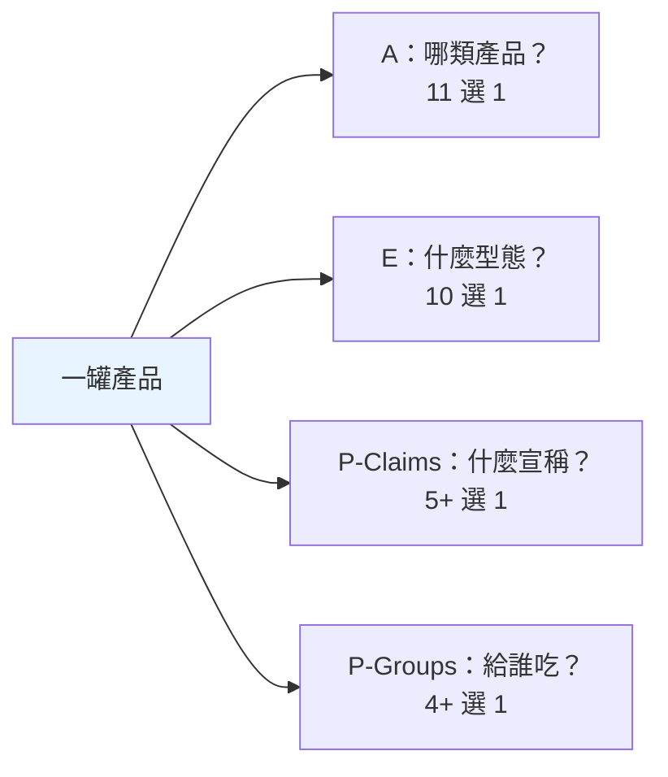
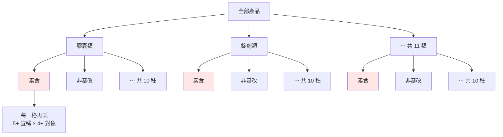
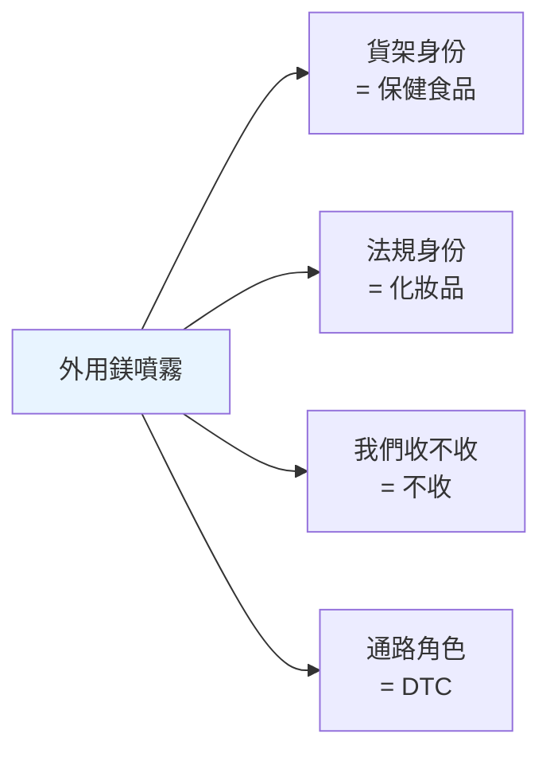
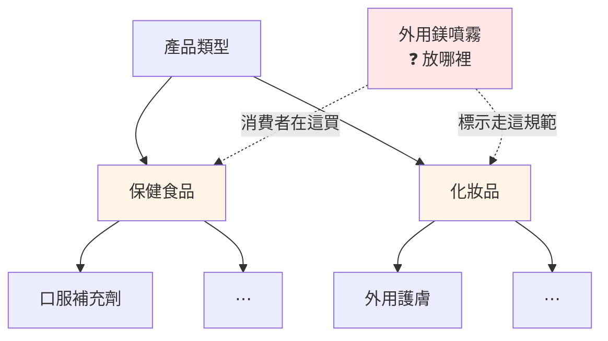

# 分類體系術語：taxonomy / facet / canonical / realm

## 📋 文檔目的

這批詞看起來各不相干，其實在回答**同一組問題**：

> 一大堆東西擺在面前，**怎麼分類、怎麼命名、怎麼確認兩個名字指的是同一個東西**。

它們不屬於保健食品產業——換成汽車零件、換成書店庫存，同一套詞照樣成立。這也是它們跟[產業術語](./supplement-industry-terminology.md)的分界線：**「這個詞搬到別的產業還講得通嗎？」通 → 在本文；不通 → 在產業術語文。**

### 一個貫穿全文的真實案例

我們資料庫裡有一堆這樣的東西：

```
Lion's Mane  ·  lions mane  ·  Lions Mane  ·  Hericium erinaceus  ·  猴頭菇
```

它們是同一種菇。但因為成分名稱從未正規化，**同一個成分在資料庫裡碎成約 90 種寫法**（TheJournalism issue #357），於是「猴頭菇市場有多大」這個問題，答案直接錯了。

從「發現它碎了」到「把它收攏」，一路上要用的詞就是本文這批。

> **怎麼讀**：先看下面「一句話總結」認個臉，第 1 節（taxonomy vs facet）是本文核心，其餘用到再查。

---

## 🎯 一句話總結

| 術語 | 白話 |
|------|------|
| **taxonomy（分類法）** | 一棵樹。每個東西掛在樹上的一個位置 |
| **facet（分面）** | 一個 facet = 一個問題，而**它的答案推導不出別的問題的答案** |
| **canonical（正典）** | 一群同義寫法裡，被選為官方代表的那一個 |
| **alias（別名）** | 「這些寫法都指向同一個 canonical」的對照表 |
| **slug** | 給機器用的乾淨識別字串：全小寫、空格改連字號、去標點 |
| **realm（領域）** | 一個自帶 schema 與 taxonomy 的獨立分析維度。⚠️ 先問「誰的 realm」 |
| **kind（種類）** | 同一層裡的類型標記 |
| **predicate（謂詞／判準）** | 兩個意思：可判定真假的**條件**，或一句話裡的那個**關係** |
| **cohort（同群）** | 為了互相比較而圈在一起的一群——**成員資格會回頭影響每個成員的讀數** |
| **macro** | 一個字四個意思，看到先確認脈絡 |

---

## 1. 兩種分類法：taxonomy 與 facet

### 先看 taxonomy（分類法）

**一棵樹。每個東西掛在樹上的一個位置。**

```
SupplementFact
├─ Vitamins
│   ├─ Vitamin C
│   └─ Vitamin D
├─ Minerals
│   ├─ Calcium
│   └─ Zinc
└─ Probiotics
```

特性是**階層、有父子關係、互斥**——往下鑽一條路徑，最後停在一個節點。站內完整教材見 [`smart-insight-engine/01_mdof-fundamentals.md`](../projects/prismavision/smart-insight-engine/01_mdof-fundamentals.md) §3.2。

我們自己的實例：Eidos 的 `Company → Brand → Sub-brand` 就是一棵三層的樹（Eidos `specs/ENTITY_CLASSIFICATION_POLICY.md` §2.1）。

### 再看 facet（分面）

**一個 facet = 一個問題。** 這個問題對每個東西都問得出答案，而且**它的答案推導不出別的問題的答案**。

如果你讀過[產業術語文第 4 節](./supplement-industry-terminology.md)，你已經看過 facet 了——那節說「品質驗證標章回答『**這罐是不是它說的東西**』，消費者訴求標章回答『**合不合我的價值觀**』，**一罐有機非基改的產品完全可能沒做過任何含量驗證**」。那就是兩個 facet：兩個獨立的問題，互相推導不出對方。

> 💡 那節還補了第三個觀察：**兩種標章都不回答「有沒有效」**。這正是 facet 思維的日常用法——先問「這批分類軸各自回答什麼」，才看得出**它們共同答不出什麼**。

Eidos 的規範文件裡，那張表的欄位標題直接就是這個意思（Eidos `specs/DogTag/VERTICAL_SEGMENT_GUIDE.md`）：

> `| Facet | Question it answers | What it does NOT answer |`

### 最好的比喻：電商的篩選側欄

你在購物網站左邊看到的那條側欄：

```
劑型      □ 膠囊  □ 錠劑  □ 粉末  □ 軟糖
飲食適性  □ 素食  □ 非基改  □ 無麩質
認證      □ USP  □ NSF  □ USDA Organic
適用對象  □ 成人  □ 兒童  □ 孕哺
```

**每個粗體標題是一個 facet，底下的勾選項是它的值。**

這個比喻好在它自帶正確的運作規則：

- 同一組裡勾兩個 → **OR**（膠囊**或**錠劑都給我）
- 跨組各勾一個 → **AND**（要是膠囊**而且**要素食）

這兩條規則不是這個網站的巧思，是**分面檢索的標準語意**——凡是照 facet 做的篩選介面都這樣運作。我們自己的工具也曾把它一字不差寫進註解：

> AND across axes; OR within an axis (standard facet semantics).
>
> —— Eidos 舊版 DogTag SPA 的篩選模組（`dogtag_spa/`，2026-08 已整個退役改為 `dogtag_spa_v2/`；原句見該 repo git 史）

而且這不只是比喻——**我們的資料裡就有真的電商 facet**：Vitaway 這個品牌，是靠爬波蘭電商 Allegro 側欄的「marka（品牌）」那一格才發現的（Eidos `profiles/brands/vitaway.md`）。

> ⚠️ **不要用「尺」來理解 facet。** 尺（scale）暗示有刻度、有大小順序，但 facet 的答案通常沒有——軟膠囊不比膠囊「大」，孕婦不比成人「高」。站內文件明確反對過這個比喻：[`isomorphic-tension.html`](./isomorphic-tension.html) 的「**predicate 是 facet 不是 scale**」，理由是「每個成員本身就是一個維度，彼此不可通約」。

### 為什麼需要 facet：30 vs 2,200

DSLD 用 LanguaL 標準標了四個欄位，以下是[站內文件](../data-sources/dsld/dsld_database_guide.md)記載的代碼數：

| 欄位 | 問的問題 | 代碼數 |
|---|---|---|
| A-series | 這是哪類產品？ | 11 |
| E-series | 這是什麼物理型態？ | 10 |
| P-series（Claims） | 標了哪種宣稱？ | 5+ |
| P-series（User Groups） | 給誰吃的？ | 4+ |

> ⚠️ 這些是[站內文件](../data-sources/dsld/dsld_database_guide.md)記載的數字，**P-series 兩列原文就標 `+`，是下界**（實際代碼更多，見下文 Facet A 的例子）。下面的算術請當**量級示意**，不是精確計數。

- **當成 facet**：11 + 10 + 5 + 4 = **約 30 個標籤**
- **當成一棵樹**：11 × 10 × 5 × 4 = **約 2,200 個葉節點**

差別在哪，畫出來最快。**facet 是四欄各自獨立**：



**同樣四個問題塞成一棵樹，第二層就開始重複**：



**「素食」這一個概念，在樹上被複製了 11 份**（紅色節點）——而且下面每一份還要各自再長出宣稱與對象兩層。改一次「素食」的定義，要改 11 個地方。

每多問一個問題（「有機嗎？」），facet 只是**再開一欄**，樹要**整棵 ×2** 變成約 4,400 個節點。**數字會變，量級不會——加法 vs 乘法的差距才是重點。**

**而且樹逼你決定「先問哪一題」，那個順序是武斷的。** 一罐有機薑黃素軟膠囊，成人用，標了結構功能宣稱——用 facet 記就是四個獨立座標；用樹記，你得先決定是「產品類型 > 劑型 > 對象」還是「劑型 > 產品類型 > 對象」。一旦決定，「按劑型看市場」這件事就永久變貴（得掃遍上層所有分支的子樹）。

> 🔍 **上表為什麼寫「欄位」不寫「facet」**：LanguaL 官方的 [facet 清單](https://www.langual.org/langual_thesaurus.asp)裡，**Facet P 是單一一個 facet**，全名 `CONSUMER GROUP/DIETARY USE/LABEL CLAIM`——「給誰吃的」跟「標了什麼宣稱」原本就綁在同一個 facet 底下。DSLD 在下游把它拆成 `claims` 和 `userGroups` 兩個欄位。
>
> 這是一個**正交性沒做乾淨、下游要付代價**的實例：上游把兩個其實獨立的問題塞進一個 facet，下游想分開用，只能自己拆；拆完之後兩邊的代碼還是共用 P 開頭，靠欄位名而不是代碼本身區分。**分類軸切得夠不夠開，會一路影響到很後面的人。**

> 🔍 **另一件值得看的事：LanguaL 的字母是跳號的。** 官方清單共 14 個 facet，字母是 A、B、C、E、F、G、H、J、K、M、N、P、R、Z——中間的 D、I、L、O、Q、S 到 Y 全部空著。DSLD 只用到其中三個（A、E、P），其餘十一個（食物來源、烹調方式、包裝材質、地理產區……）跟補充劑無關，直接不用。
>
> **這正是「加一欄，其他不動」的實證**：不用的 facet 就是不填，用到的 facet 之間沒有先後、沒有包含關係，未來要加第 15 個問題也只是再開一格。換成一棵樹，任何一個問題不適用都會在樹上留下一個尷尬的空層。

### 最嚴重的問題：樹會逼資料說謊

這是真的踩過的坑（Eidos `specs/DogTag/VERTICAL_SEGMENT_GUIDE.md` §2）。一罐**外用鎂噴霧**，四個問題的答案是：

| 問題（facet） | 答案 | 為什麼 |
|---|---|---|
| 貨架身份 | 保健食品 | 消費者在保健食品貨架上買它 |
| 法規身份 | 化妝品 | 外用不是口服，標示面板走化妝品規範 |
| 我們收不收 | 不收 | 我們只收可食用的 |
| 通路角色 | DTC | 它有可爬的官方賣場 |

文件的原話是：

> **All four facets disagree, and all four are correct.** Encoding any of these as a function of another loses information.

四個答案彼此矛盾，四個都對。**用 facet 記，四個答案各佔一欄，互不干擾**：



**但只要把「產品類型」做成一棵樹，它就沒有位置可站**：



兩條虛線各有各的道理，**但樹只准選一條**——放進「保健食品」會誤導法規判讀，放進「化妝品」會弄丟它的貨架身份。**選哪邊都在丟資訊。**

而真正的災難是同一份文件記下的後續：寵物保健品沒地方放，有人就把它標成「不在我們範圍內」，**只為了讓它從爬蟲清單消失**。文件的評語是——

> this **lies about identity** to win a transient crawl-policy fight

**為了一個暫時的操作需求，把一個永久的身份事實改成假的。** 這是格子不夠時，人一定會做的事。

### 關鍵：兩者不對立

最容易誤會、也最值得記住的一點：

> **facet 決定「你問幾個問題」；taxonomy 決定「單一問題的答案怎麼組織」。**
> **一個 facet 內部，完全可以是一棵樹。**

DSLD 的 Facet A 就是這樣——代碼**前綴本身帶著階層**：`A1xxx` = 補充品配方，`A0xxx` = 食品配方（見 TheJournalism `specs/sdd_market_product_type_class.md`）。

> ⚠️ 站內 [dsld guide](../data-sources/dsld/dsld_database_guide.md) 列的 11 個 A-series 代碼**全部是 `A1xxx`**，看不到這個階層——那份清單是 DSLD dump 的子集，不是全集（2026-07-29 實查當時的 `distiller.db` 有 56 個相異 A-series 代碼，`A1` 前綴 315,935 筆、`A0` 前綴 26,728 筆）。**看到「完整列表」四個字，先確認它完整的是哪個範圍。**
>
> 📌 **引用 `distiller.db` 的數字一定要標是哪一份、哪一天。** 這個檔名底下有多個世代（產出者 TheDistiller 從 v2 的 `dsld_distiller.db`、僅 DSLD 單一來源，演進到 v3.x 的 `distiller.db`、DSLD＋Amazon＋iHerb 多來源），各 repo 手上那份也不見得同步。同一個查詢在不同世代會給出不同答案——上面這組數字就只對得上當時那一份。世代沿革見 [`thedistiller.md`](../projects/alchemymind/thedistiller.md)。

TheJournalism 的 `product_type_class` 參數做的正是「**在 Facet A 這一個問題內部，往上退一層看**」，四個值 `all` / `supplement` / `food` / `classified`。所以當有人說「`product_type_class` 是 LanguaL Facet A lens」，完整意思是：**Facet A** 是那個問題，**lens（鏡頭）** 是在這個問題內部選一個解析度。

| | taxonomy（樹） | facet（多問題） |
|---|---|---|
| 結構 | 一條路徑 | 一組座標 |
| 一個東西能有幾個位置 | **一個** | **每個 facet 各一個答案** |
| 問「所有軟膠囊」 | 掃遍全樹 | 讀那一欄 |
| 新增一個問題 | 整棵樹重建 | 加一欄，其他不動 |
| 答案有大小順序嗎 | 上下層＝包含關係 | 通常沒有 |

### 兩者同時上場的完整實例：TheWeaver

[TheWeaver](../projects/alchemymind/theweaver.md) 是 AlchemyMind 裡拿 LLM 讀產品頁、把行銷文案轉成結構化分類的系統。它的 analyzer 註冊表（TheWeaver `src/weaver/config/analyzers.py`）登記了 **10 個 Knowledge Realm**：health effect、performance enhancement、quality of life、certification、dietary adaptability、formulation technology、ingredient purity、usage context、usage convenience、flavor characteristics。

**每個 realm 各自掛一份自己的 taxonomy JSON，一對一，不共用。** 這正好就是上面那條規則的實作：

- **10 個 realm ＝ 10 個問題** → facet 那一側
- **每個 realm 內部一棵樹** → taxonomy 那一側

問題彼此獨立這件事，TheWeaver 寫成了一條明文原則（TheWeaver `CLAUDE.md`）：

> 獨立評估原則：每個 analyzer 只問自己的問題，同一 claim 可被多個 analyzer 收錄

「同一 claim 可被多個 analyzer 收錄」就是 facet 的定義本身——一句 `supports joint comfort` 可以同時被兩三個 realm 收下，不必先決定它「屬於」誰。換成一棵樹，你就得先決定，而且只能決定一次。

其中三個 realm 問的都是「這罐對我有什麼好處」的不同切面，各自的消費者問題寫在自己的 skill 定義裡（TheWeaver `.claude/skills/weaver-{realm}/SKILL.md`）：

| Realm | 消費者問題 | taxonomy 規模（2026-07-29 實查） |
|---|---|---|
| Health Effect | 吃這個對我的健康有什麼具體改善？ | 159 個節點、110 個葉節點，根之下 4 層 |
| Performance Enhancement | 吃這個能讓我表現更好嗎？ | 49 個節點、30 個葉節點，根之下 3 層 |
| Quality of Life | 吃這個能讓我的日常生活感覺更好嗎？ | 41 個節點、25 個葉節點，根之下 3 層 |

三棵樹大小差三倍多，但**它們是平等的三個 facet**。樹的大小反映的是「這個問題底下有多少種答案」，不是「這個問題比較重要」。

### 事實型 facet 與判讀型 facet

上面電商側欄的例子（劑型、認證、適用對象）有個共同性質：**答案由物件本身決定**。這罐是不是膠囊，翻過來看瓶身就知道；兩個人分別去看，會得到同一個答案。

TheWeaver 的三個 benefit realm 不是這樣。「這句話算 performance 還是 quality of life」**取決於文案的語氣**，不取決於瓶子裡裝什麼。同一件生理上的事，寫成 `improves memory` 偏向表現，寫成 `helps you feel sharper day to day` 偏向生活品質——東西沒變，分類變了。

這件事在資料結構上留下了痕跡：**同一個概念在不同的樹上各長了一個名字略有不同的節點**。

| 概念 | Health Effect | Performance Enhancement | Quality of Life |
|---|---|---|---|
| 記憶 | — | `Memory Support`（下含 `Short-term Memory Enhancement`、`Long-term Memory Retention`） | `Memory Enhancement` |
| 皮膚 | `Skin Health` | — | `Skin Health Support` |
| 認知 | `Cognitive Enhancement` | `Cognitive Performance Enhancement` | `Cognitive Support` → `Cognitive Function Support` |
| 能量 | `Energy Metabolism` | `Energy Enhancement` | `Daily Energy` |

每一列都有兩到三棵樹預先準備好接住同一個概念，因為誰也無法保證文案會用哪一種語氣寫。**節點名字之所以要各自加尾巴（`Support`、`Enhancement`、`Performance`），正是為了讓三棵樹的同名概念不至於長成一模一樣的字串。**

**實務上的差別在這裡**：事實型 facet 的邊界靠事實就守得住（不是膠囊就不是膠囊）；判讀型 facet 的邊界**只能靠人工維護一份排除清單**。TheWeaver 每個 realm 的 skill 定義裡都有一張「排除範圍」表，寫的正是「這種句子不歸我，歸隔壁」——例如 Quality of Life 那張表把「客觀身體系統功能」推給 health effect、把「可量化效能提升」推給 performance enhancement，並各附一個範例句。

所以看到一組 facet，先問一句：**它們的答案是讀出來的，還是判出來的？** 判出來的那種，分類軸畫好只是開始——跨批次、跨標註者的一致性要另外顧。

---

## 2. 同一個東西的多個名字：canonical / slug / alias

回到猴頭菇。你發現資料庫裡有 90 種寫法，接下來要收攏它們——這一組就是收攏的工具。

| 詞 | 白話 |
|---|---|
| **canonical（正典 / 正規形式）** | 一群同義寫法裡，**被選為官方代表的那一個** |
| **alias（別名）** | 「這些寫法都指向同一個 canonical」的對照表 |
| **slug** | 給機器用的**乾淨識別字串**：全小寫、空格改連字號、去掉標點 |

套用到猴頭菇：

```
alias:      Lion's Mane / lions mane / Hericium erinaceus / 猴頭菇
canonical:  Lion's Mane          ← 選定的官方代表
slug:       lions-mane           ← 給網址、檔名、程式用的形式
```

我們系統裡的規模，以 Eidos 為例（2026-07-30 實查 `profiles/` 卡片的 `aliases` 欄位）：**品牌別名 25,473 條**，分布在 11,132 張品牌卡；**品牌原料別名 5,231 條**，分布在 815 張卡。

落到資料庫之後，表名**跟著資料庫走**，兩邊叫法不同：

| 你在查哪個資料庫 | 品牌別名表 | 品牌原料別名表 |
|---|---|---|
| Eidos 自己匯出的 `eidos.db` | `BrandAliases` | `ProprietaryIngredientAliases`（用 BI 的舊稱 Proprietary Ingredient，見[產業術語文第 3 節](./supplement-industry-terminology.md)的命名沿革陷阱） |
| `distiller.db`（分析時多半查這份） | `BrandAliases` | `BrandedIngredientAliases` |

TheJournalism 另有 `CanonicalProduct` 表處理「同一罐產品在不同通路各有一筆紀錄」。

> ⚠️ **別名筆數一定要標「哪個 repo、哪一天」才有意義。** 同一件事在每個系統各有一份別名表，數字彼此不通用，而且每次 ingest 都會變——上面那組是 2026-07-30 的快照，過幾週再查一定不一樣。看到「別名 X 萬筆」先問清楚來源與時點；連表名都會因為資料庫不同而不同（見上表）。

**`slug` 在 Eidos 裡到處都是**（2026-07-30 全 repo grep 得到五萬多處）——因為每個實體都需要一個穩定、不會因為顯示名稱改動而失效的識別字串。你看到的 `joint_health`、`brand_slug` 都是 slug。

> 💡 **為什麼要分成三個詞？** canonical 是**選擇**（哪個當代表）、alias 是**對照**（哪些算同一個）、slug 是**格式**（怎麼寫成機器友善的樣子）。三件事分開，任何一件改變都不影響另外兩件——顯示名稱可以改，slug 不動，舊網址就不會壞。

> 🔍 **沒有 alias 表會怎樣**：第 1 節那些 TheWeaver taxonomy，儲存形式是**純巢狀 JSON**——鍵是節點名稱，值是它的子節點，空的 `{}` 就代表這是葉節點。整份檔案**沒有節點 ID、沒有版本欄位、也沒有 alias 表**，一個節點的身分就是那串**大小寫敏感的字串**本身。
>
> 後果是：`Skin Health` 和 `Skin Health Support` 在系統眼裡是兩個毫無關係的節點，看起來像不像同一件事，機器不知道；而**把一個節點改名，等於把舊名字所指的東西整個抹掉**——先前標成舊名字的資料失去落腳處，也沒有 alias 表可以把它接回來。canonical / slug / alias 三件事要分開的價值，在這種地方最看得出來。

---

## 3. 分層與歸群：realm / kind

| 詞 | 白話 | 實例 |
|---|---|---|
| **realm（領域）** | 一個**獨立的分析維度**，自帶一套 schema 和自己的 taxonomy | TheWeaver 的 10 個 Knowledge Realm（第 1 節） |
| **kind（種類）** | 同一層裡的類型標記 | Eidos `data_sources_v2[].kind`，值域兩個：`marketplace` / `retailer` |

### 「同一層裡的類型標記」長什麼樣：Eidos 的 `type`

Eidos 的每張實體卡片開頭都有一個型別欄位，**欄位名是 `type`**。值與卡片數（2026-07-30 實查 `profiles/`；卡片持續新增，**數字看個量級就好**）：

| `type` 的值 | 卡片數 |
|---|---|
| `brand_profile` | 11,936 |
| `domain_profile` | 8,398 |
| `company_profile` | 4,139 |
| `branded_ingredient_profile` | 854 |
| `branded_provenance_profile` | 80 |
| `branded_technology_profile` | 62 |
| `strain_profile` | 30 |

概念上要記的是：**同一層裡並列七種東西，而每一種各自暴露不同的 facet**——`brand_profile` 有 `status`（值域 `active` / `discontinued` / `legacy` / `consolidated` / `unknown`）與 `identity_confidence`；`strain_profile` 的屬／種掛在 `taxonomy:` 欄位下，適用哪國法規寫在 `regulatory:` 欄位。同一個系統裡，不同種類的東西問的問題本來就不一樣。

> ⚠️ **要查請 grep `type:`，不是 `kind:`。** Eidos `profiles/` 底下 `^kind:` 命中 **0 檔**——這個 repo 的型別欄位就叫 `type`，值也不是 `brand` 而是帶 `_profile` 後綴的形式。另外 `mark`（商標）**不是任何欄位的值**，它是目錄名 `profiles/marks/`，BI／BT／BP 三種卡片放在它底下。
>
> `kind` 在 Eidos 唯一的真實用法在別的地方：`data_sources_v2[].kind`，值域只有 `marketplace` 與 `retailer`（見 Eidos `src/muster/validator.py` 的 CR-7 檢查）。那反而是個很乾淨的 kind 實例——**同一份資料來源清單裡，每一筆都是這兩類之一**。

> 🔍 **本文自己踩過下面那條判準。** 這一節先前把 kind 的實例寫成「Eidos 的 `brand` / `domain` / `mark` / `strain`」：欄位名錯（是 `type`）、值的形式錯（是 `brand_profile`）、`mark` 根本不是值。錯的來源是「這個系統顯然有『種類』這個概念」的印象，而不是任何一次查證。
>
> 它剛好完整示範了下面那則 `family` callout 給的判準：**一個詞該不該當術語引用，要看它有沒有出現在 schema、enum、欄位名或規範文件的定義位置。**「Eidos 有 kind」通不過這個判準——`profiles/` 裡沒有這個欄位名。判準對別人寫的詞有效，對我們自己寫下的句子同樣有效。

> 🔍 **一個「查了才知道不是術語」的實例——`family`**
>
> `family（族）` 在 Eidos 出現上萬次，看起來像個沒被定義的重要概念。實查後發現：絕大多數出現在 `profiles/`，而且全是英文散文——`family farm`、`family-owned since 1962`、`the founding family's involvement`。`specs/` 只有十來次，都在註解的修辭裡。**沒有任何 schema key 或 enum 叫 family。**
>
> 這條留在這裡是因為它示範了一個判準：**高詞頻不等於術語**。判斷一個詞該不該收，要看它有沒有出現在 schema、enum、欄位名或規範文件的定義位置，而不是 grep 出來幾筆。

> ⚠️ **遇到 realm，先問「誰的 realm」。** [`theweaver.md`](../projects/alchemymind/theweaver.md) 定義的 **Knowledge Realm** = 「LLM 分析產品的一個特定維度」，這是 AlchemyMind 的專屬語意，跟英文裡「領域、範圍」的泛用義不是同一件事。看到這個字，先確認說話的人在哪個系統裡。

> 🔍 **同一份註冊表裡，realm 和 facet 是兩個技術類別。** TheWeaver 的 `analyzers.py` 把 analyzer 分成兩區：Knowledge Realm 那一區，每個都掛一份 `taxonomy_path`（指向一棵階層樹）；Dosage Facet 那一區的 `taxonomy_path` 是 `None`，檔案裡的註解寫得很白：
>
> > Dosage facets use flat node lists, not hierarchical taxonomies
>
> 也就是說「劑型」這個問題的答案是一份**平面清單**，沒有父子關係。回到第 1 節那條規則——facet 決定你問幾個問題，taxonomy 決定單一問題的答案怎麼組織，而**有些問題的答案根本不需要組織成樹**。同一個系統裡兩種都在用，是很正常的事。

> ⚠️ **順帶一個名字會騙人的例子**：TheWeaver 有個模組叫 `src/weaver/taxonomy_builder/builder.py`，名字看起來像「產生 taxonomy 的東西」。它不是。docstring 第一句就寫明了實際功能——把 taxonomy JSON 轉成 ASCII 樹狀圖，好塞進 LLM 的 prompt 裡：
>
> > Taxonomy Builder - Convert taxonomy JSON to ASCII tree format.
>
> taxonomy 本身是人維護的 JSON，builder 只負責排版。**看到 `xxx_builder` 不要假設它在建 xxx。**

---

## 4. 條件與關係：predicate

`predicate`（謂詞）在我們的系統裡有**兩個意思**，而且兩個都常見。

### 意思一：一個可以判定真假的條件

就是 SQL `WHERE` 後面那種東西：「這一列符不符合？」符合留下、不符合丟掉。

Eidos 的資料庫建置指南有一段標準示範（Eidos `docs/crystallized/guides/EIDOS_DB_BUILD.md`）。它處理的問題是「哪些產品該算進市場總量」——原本要判斷兩件不同的事（品牌本身被否決 / 品牌保留但產品要排除），文件的做法是把兩者合併成一個現成欄位：

```sql
-- Clean market denominator — ONE predicate, both axes, no Brands join:
SELECT * FROM ProductBrandIdentityMap WHERE market_excluded = 0;
```

文件明講這是 "ONE predicate"，並另外列出等價的 "two-predicate form" 給需要區分兩軸的人用。這裡看得到 predicate 的兩個日常性質：**可以合併**（兩個條件併成一個，讓下游不必知道內情）、**也可以拆開**（需要細節時再展開）。

回到第 1 節的側欄比喻：**每勾一個框，就是加一個 predicate；勾完之後畫面上剩下的那批東西，就是這組 predicate 篩出來的結果。**

### 意思二：一句話裡的那個「關係」

主詞—謂詞—受詞。GoViral 從 KOL 貼文抽健康宣稱時，每一條 claim 都拆成這種三段式，中間那一格就叫 `predicate`，值來自一組固定枚舉（GoViral `specs/schema/post.md`）：`efficacy` / `mechanism` / `safety` / `association` / `comparison` / `composition`。

「薑黃**減輕**發炎」是 efficacy，「薑黃**透過**抑制某個通路」是 mechanism，「薑黃**比**某藥物如何」是 comparison——同樣兩個東西，關係不同，讀出來的意思完全不同。

站內的 [`isomorphic-tension.html`](./isomorphic-tension.html) 把這組枚舉當成一條分析軸看：

> predicate enum 的每個成員**本身就是一個力的維度**，彼此不可通約、也不該通約。
> 選哪個 predicate = 選一個 lens。

換句話說，**這個意思的 predicate 本身就是一個 facet**——這也正是第 1 節引它來說明「facet 不是尺」的原因。

> ⚠️ 兩個意思共用一個字，區分方法很簡單：**它出現在 `WHERE` 後面，還是出現在一個 schema 欄位裡？** 前者是條件，後者是關係。

---

## 5. 聚合與比較：cohort / dimension 階層

| 詞 | 白話 | 實例 |
|---|---|---|
| **cohort（同群）** | 因為**要互相比較**而被圈在一起的一群 | TheJournalism 的 BI positioning：30 個列入白名單的品牌原料構成一個 cohort |
| **dimension（維度）階層** | 查詢時「按什麼分組」，而分組本身可以有層級 | MDFO 查詢結構裡的 **D** |

cohort 跟「用 predicate 篩出來的一批」差在哪：predicate 篩出來的是**符合條件的都算**；cohort 是**先圈定成員，然後每個成員的數字都以「在這群裡排第幾、離最大最小值多遠」的形式呈現**。

TheJournalism 的 `branded_ingredient/positioning.py` 是現成例子：它一次算完 30 個品牌原料的 6 個指標（總 voice、產品數、voice density、品牌數、品牌集中度、voice 覆蓋率），再回答「你問的這個 BI，在這 30 個裡排第幾、範圍到哪」。程式碼把「30 個一個都不能少」寫成一條明文契約（`cohort completeness contract`），並據此禁止使用會漏掉部分成員的資料來源。

**理由就是 cohort 跟一般篩選最大的差別：cohort 的成員資格會回頭影響每個成員的讀數。** 少算一個，所有人的名次和範圍都跟著變。

---

## 6. macro：一個字四個意思

同一個希臘字根 μακρός（長、大），四個意思共用一個字：

| 意思 | 脈絡 | 歸屬 |
|---|---|---|
| **巨集 / 宏** | 程式：一個名字展開成一串指令 | 本文 |
| **巨觀 / 微觀層次** | 湧現、粗粒化 coarse-graining | 本文 |
| 總體 / 個體 | 經濟學 | 順帶提及 |
| **巨量營養素 macronutrient** | 營養學 | → [產業術語文](./supplement-industry-terminology.md) 第 9 節 |

**共同的根**：一個上層的名字，代表下層的一大堆。

**但教學價值在前兩者的差別**：

- **巨集的展開是確定且可逆的** —— 展開回去一模一樣，沒有資訊損失
- **粗粒化是有損且多對一的** —— 從「溫度」回不去每顆粒子的位置

> 📌 **這一義站內已經教過了，只是沒用這個名字**：[`emergence-data-compute.md`](./emergence-data-compute.md) §2.1「描述螞蟻的語言，跟描述蟻丘的語言，是兩套語言」就是 micro vs macro；[`no-one-is-home.md`](./no-one-is-home.md) 整篇是跨層級的分析陷阱；[`isomorphism-projection.md`](./isomorphism-projection.md) 的投影失真與 null space 是粗粒化有損性的代數版。**本節只負責安上名字，概念請讀那三篇。**

---

## 7. 命名衝突速查：L0/L1/L2 vs Layer 1/2/3

這兩組數字長得像，指的完全是兩件事：

| 講法 | 指什麼 |
|---|---|
| **Layer 1 / 2 / 3** | LuminNexus **生態系**的三大層：AtlasVault / AlchemyMind / PrismaVision |
| **L0 / L1 / L2** | TheJournalism **系統內部**的三層：Extract / Report / Narrate |

TheJournalism 整體位於生態系的 **Layer 3**，其內部再分 L0 / L1 / L2。

> 完整的稱呼約定見 [`thejournalism.md`](../projects/prismavision/thejournalism.md) 的「🗞️ 三層架構」節——本文只做收攏參照，不重述。

---

## 8. 中文對應建議

| 英文 | 建議中文 | 備註 |
|---|---|---|
| taxonomy | 分類法 | 一棵樹 |
| facet | 分面 | 一個問題／一條篩選軸。依國教院《圖書館學與資訊科學大辭典》「分面式分類法」 |
| canonical | 正典 / 正規形式 | 官方代表寫法 |
| alias | 別名 | 對照表 |
| slug | slug（不譯） | 譯成「短代碼」易生歧義 |
| realm | 領域 | ⚠️ 先問「誰的 realm」 |
| kind | 種類 | — |
| predicate | 謂詞 / 判準 | 兩義：條件、關係（第 4 節） |
| cohort | 同群 | 為了比較而圈在一起 |
| dimension | 維度 | MDFO 的 D |

---

## 🔗 相關文檔

本文只做白話入口，**正式定義都在各系統自己的文件裡**。

> 📌 **怎麼分辨連結**：可以點的連結都在本站（LearningMap）內。標了 repo 名稱的（Eidos、TheJournalism、TheWeaver、GoViral）是外部 private repo 的檔案路徑，**需要該 repo 的存取權**才看得到。特別注意 **Eidos 和 TheJournalism 都有 `specs/` 目錄**，看到 `specs/...` 一定要先看前面掛的是哪個 repo 名。

- [supplement-industry-terminology.md](./supplement-industry-terminology.md) —— 姊妹作：保健食品**產業域詞**（MVM、BI/BT/BP、voice…）。分界線：能搬到別的產業的在本文，不能的在那篇
- [ai-data-terminology.md](./ai-data-terminology.md) —— 家族第三份：AI / 資料術語（infer / derive / reasoning）
- [`projects/alchemymind/eidos.md`](../projects/alchemymind/eidos.md) —— 站內的 Eidos 系統導覽（kind、strain、BI/BT/BP 三商標）。**本文正文引的 Eidos `specs/` 檔案需要該 repo 權限，沒有權限時先讀這份**
- [`smart-insight-engine/01_mdof-fundamentals.md`](../projects/prismavision/smart-insight-engine/01_mdof-fundamentals.md) §3.2 —— **taxonomy 的完整教材**（含階層圖），本文只講它跟 facet 的差別
- [`tools/google-product-category-intro.md`](../tools/google-product-category-intro.md) —— 一個真實世界 taxonomy 的完整案例
- [`projects/alchemymind/theweaver.md`](../projects/alchemymind/theweaver.md) —— Knowledge Realm 的正式定義
- [`projects/alchemymind/therefinery.md`](../projects/alchemymind/therefinery.md) —— `DosageFormFacets` 的四維劑型分類
- [`data-sources/dsld/dsld_database_guide.md`](../data-sources/dsld/dsld_database_guide.md) —— LanguaL 在 DSLD 的對照表（含覆蓋率與代碼數）
- [`data-sources/dsld/json_structure_reference.md`](../data-sources/dsld/json_structure_reference.md) §5.2 —— **DSLD 三個 LanguaL 欄位的完整代碼值列表**
- [`emergence-data-compute.md`](./emergence-data-compute.md) · [`no-one-is-home.md`](./no-one-is-home.md) · [`isomorphism-projection.md`](./isomorphism-projection.md) —— macro / micro 那一義的完整討論
- [LanguaL Thesaurus](https://www.langual.org/langual_thesaurus.asp)（外部）—— 14 個 facet 的官方清單與全名
- Eidos `specs/DogTag/VERTICAL_SEGMENT_GUIDE.md` §2（外部 repo，英文）—— 全庫最完整的 facet 正交性說明，含反例與後果分析
- Eidos `docs/crystallized/guides/EIDOS_DB_BUILD.md`（外部 repo，英文）—— predicate 意思一的實例（`market_excluded` 單一訊號）
- TheWeaver `src/weaver/config/analyzers.py`（外部 repo）—— 10 個 Knowledge Realm 與 Dosage Facet 的註冊表

---

## 📝 文檔維護

### 版本歷史

| 版本 | 日期 | 作者 | 變更說明 |
|------|------|------|----------|
| 0.1 | 2026-07-28 | Dustin | 初稿（issue #2） |
| 1.0 | 2026-08-13 | leana | 定案：合併前逐條回查來源 repo，修正引用與數字口徑（詳見 git 史） |

---

**文檔結束**
