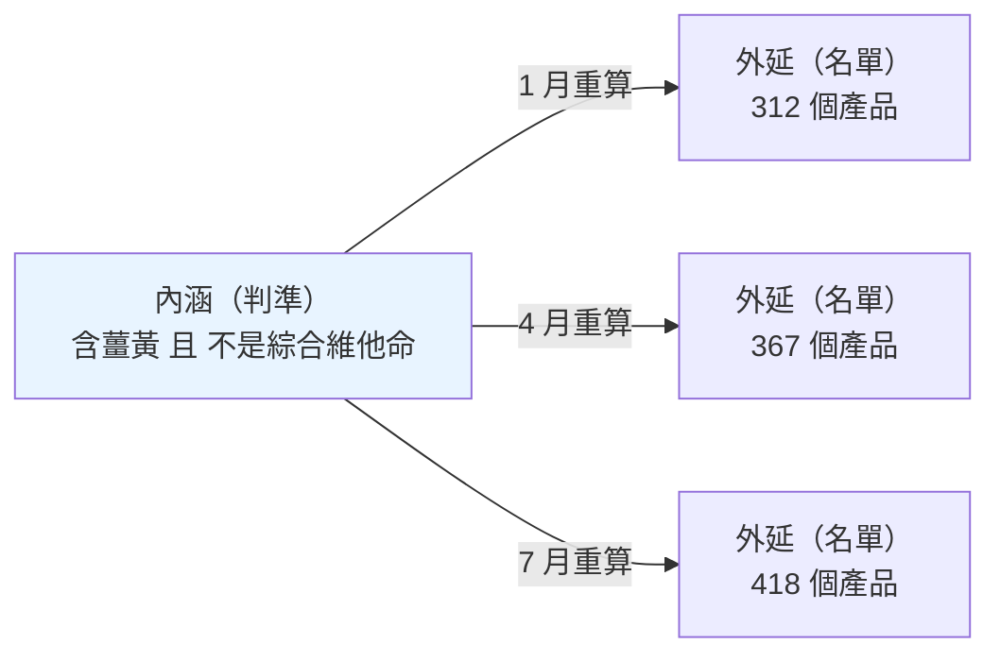
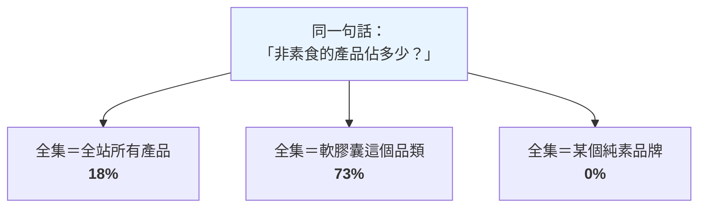
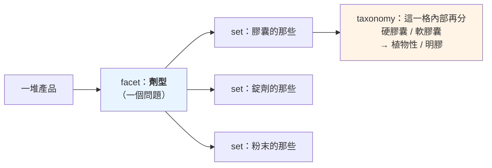
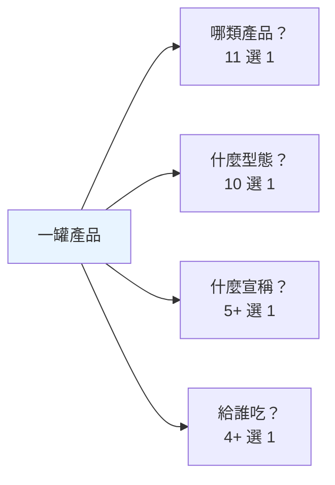
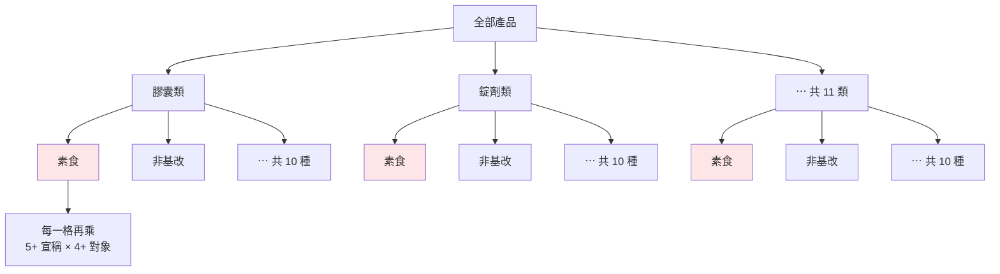
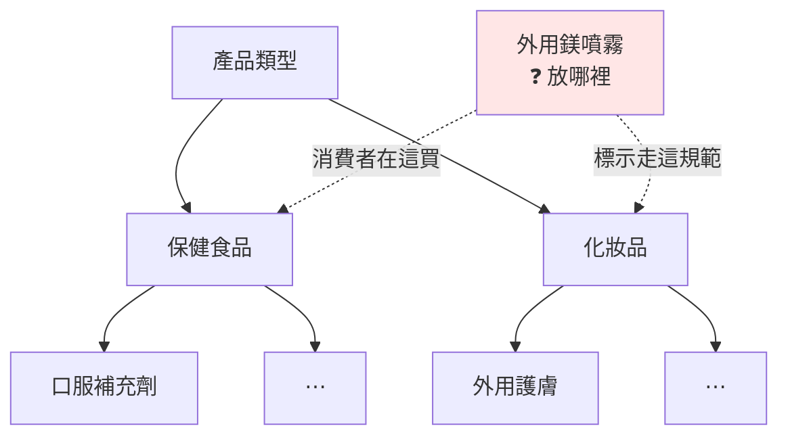
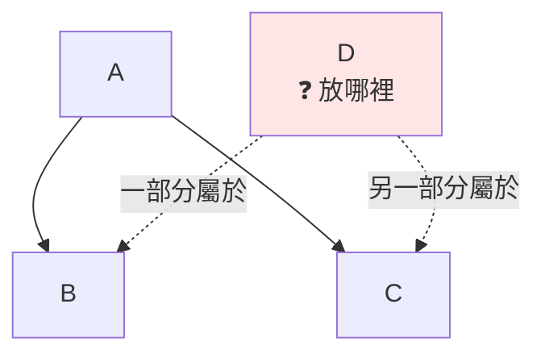

# 分類體系術語：set / facet / taxonomy / macro

---

## 📋 文檔目的

這批詞看起來各不相干，其實在回答同一組問題：一大堆東西擺在面前，**哪些算數、怎麼分類、怎麼命名**。

它們不屬於任何產業——換成汽車零件、換成書店庫存，同一套詞照樣成立。這也是它們跟[產業術語](./supplement-industry-terminology.md)的分界線：這個詞搬到別的產業還講得通嗎？通，就在本文。

本文檔說明：

- 一群東西怎麼被界定：set、predicate
- 怎麼被切開：facet、taxonomy，以及兩者的分工
- 站在哪一層看：macro / micro
- 同一個東西的多個名字：canonical、slug、alias
- 幾個常見的歸群用詞：realm、kind、cohort

---

## 🎯 一句話總結

| 術語 | 核心意思 |
|------|----------|
| **set（集合）** | 一群算數的東西。**本體是那條判準，不是那份名單** |
| **predicate（判準）** | 一個可以判定真假的條件；也指一句話裡的那個「關係」 |
| **facet（分面）** | 一個問題、一條軸。**它的答案推導不出別的問題的答案** |
| **taxonomy（分類法）** | 一棵樹。每個東西掛在樹上的一個位置 |
| **macro / micro** | 巨觀 / 微觀。站遠看還是站近看 |
| **canonical（正典）** | 一群同義寫法裡，被選為官方代表的那一個 |
| **alias（別名）** | 「這些寫法都指向同一個 canonical」的對照表 |
| **slug** | 給機器用的乾淨識別字串 |
| **realm（領域）** | 一個自帶結構的獨立分析維度 |
| **kind（種類）** | 同一層裡並排的幾種類型 |
| **cohort（同群）** | 為了互相比較而圈在一起的一群 |

---

## 1. set：一群東西怎麼被界定

**set（集合）**：一群「算數的東西」。

界定一個集合有兩種方式：

| 方式 | 怎麼做 | 例 |
|---|---|---|
| **列舉** | 把成員一個一個寫下來 | 「這 30 個品牌原料」 |
| **判準** | 寫一條規則，符合的就算 | 「所有含薑黃、且不是綜合維他命的產品」 |

列舉沒有爭議——名單就在那裡；但**東西一變就過期**，而且時間久了沒人知道當初為什麼是這些。判準會自動跟著資料走，代價是那條規則要寫得別人看得懂、也同意。

### 內涵與外延

這組詞是理解集合的關鍵：

- **內涵（intension）** ＝ 那條判準，也就是「什麼算數」的**定義**
- **外延（extension）** ＝ 符合判準的**成員名單**

同一個集合，內涵只有一份，外延每跑一次都可能不同：



三份名單都對，因為它們是同一條判準在不同時間的答案。

重點：**集合是判準的集合，不是成員的集合**。名單是每次推導出來的產物，定義才是本體。

把名單當成定義，常見的後果有三種：有人把某次跑出來的名單複製走、兩邊從此各自演化；上游改了判準，下游拿舊名單繼續算；名單存進了資料庫，判準只留在某個人腦裡。反過來，只要判準寫在明處，名單過期是無害的——重跑一次就好。

### 集合運算

| 運算 | 意思 | 要注意的 |
|---|---|---|
| **聯集** A∪B | 是 A **或**是 B | 最單純 |
| **交集** A∩B | **同時**是 A 和 B | 真實世界的品類常常是交集，例如「頭髮、皮膚、指甲」就是三個訴求的交集 |
| **差集** A−B | 是 A **但不是** B | 方向不能反，A−B 跟 B−A 是兩件事 |
| **補集** ¬A | **不是** A 的那些 | 必須先講定**全集**，否則這句話沒有意義 |

補集那條值得停下來想。同一句「非素食的產品佔多少」，換一個全集就是完全不同的答案：



三個數字都對，因為它們回答的其實是三個不同的問題。凡是講比例、講「有多少不是⋯」，**先把全集講出來**。

---

## 2. predicate：判準與關係

`predicate` 有兩個意思，都常見。

### 意思一：一個可以判定真假的條件

就是 SQL `WHERE` 後面那種東西：「這一列符不符合？」符合留下、不符合丟掉。**這就是上一節用來界定集合的那條判準。**

```text
WHERE contains_turmeric = true AND is_mvm = false
```

判準可以合併，也可以拆開。把兩個條件併成一個現成欄位，下游就不必知道內情；代價是下游也**看不見理由**——數字對了，但問「為什麼這罐沒被算進去」時答不出來。

### 意思二：一句話裡的那個「關係」

主詞—謂詞—受詞。從文章裡抽取「宣稱」時，每一條都拆成這種三段式，中間那一格就叫 predicate，值通常來自一組固定選項：

```text
薑黃  減輕  發炎      → predicate: efficacy（有效）
薑黃  透過  某個通路   → predicate: mechanism（機轉）
薑黃  比    某藥物     → predicate: comparison（比較）
```

同樣兩個東西，關係不同，讀出來的意思完全不同。

兩個意思共用一個字，區分方法很簡單：**它出現在 `WHERE` 後面，還是出現在一個資料欄位裡？** 前者是條件，後者是關係。

---

## 3. facet：一個問題、一條軸

**facet（分面）**：一個 facet 就是**一個問題**。這個問題對每個東西都問得出答案，而且**它的答案推導不出別的問題的答案**——這個性質叫**正交**。

最好的例子是購物網站左邊那條篩選側欄：

```text
劑型      □ 膠囊  □ 錠劑  □ 粉末  □ 軟糖
飲食適性  □ 素食  □ 非基改  □ 無麩質
認證      □ USP  □ NSF  □ USDA Organic
適用對象  □ 成人  □ 兒童  □ 孕哺
```

每個粗體標題是一個 facet，底下的勾選項是它的值。知道劑型是膠囊，推不出它素不素食；知道它素食，也推不出它有沒有認證。

這個比喻自帶正確的運作規則：

- 同一組裡勾兩個 → **OR**（膠囊**或**錠劑都給我）
- 跨組各勾一個 → **AND**（要是膠囊**而且**要素食）

這是分面檢索的標準語意。反過來說，一個介面如果「同一組裡多勾一個」會讓結果**變少**，那它底下就不是 facet。

檢查一組分類軸切得乾不乾淨，最省事的做法是替每一軸填三格：**這一軸回答什麼問題／它答不出什麼／它跟別軸有沒有互相決定**。第三格只要出現「有」，那兩軸就不獨立，該併成一軸或重新切。

### 一個 facet 就是一組 set

facet 與 set 的關係很直接：**一個 facet 把全體切成幾個 set**。問「劑型？」就切出「膠囊的那些」「錠劑的那些」「粉末的那些」；換一個 facet 去問，同一堆東西就被切成另一組完全不同的 set。

東西沒變，切法變了。這也是為什麼**一個東西可以同時屬於很多個 set**——它在每一條軸上都有一個位置。

### 不要用「尺」來理解 facet

尺（scale）暗示有刻度、有大小順序，但 facet 的答案通常沒有——軟膠囊不比膠囊「大」，孕婦不比成人「高」。站內文件明確反對過這個比喻：[`isomorphic-tension.html`](./isomorphic-tension.html) 的「predicate 是 facet 不是 scale」，理由是「每個成員本身就是一個維度，彼此不可通約」。

---

## 4. taxonomy：一棵樹

**taxonomy（分類法）**：一棵樹，每個東西掛在樹上的一個位置。

```text
SupplementFact
├─ Vitamins
│   ├─ Vitamin C
│   └─ Vitamin D
├─ Minerals
│   ├─ Calcium
│   └─ Zinc
└─ Probiotics
```

特性是**階層、有父子關係、互斥**——往下鑽一條路徑，最後停在一個節點。公司與品牌的歸屬也是一棵樹：`公司 → 品牌 → 子品牌`，往上只有一個母親。

站內完整教材見 [`smart-insight-engine/01_mdof-fundamentals.md`](../projects/prismavision/smart-insight-engine/01_mdof-fundamentals.md) §3.2；一個真實世界的大型 taxonomy 案例見 [`tools/google-product-category-intro.md`](../tools/google-product-category-intro.md)。

---

## 5. facet 與 taxonomy 的分工

這兩個最容易被當成競爭關係，其實不是：

> **facet 決定「你問幾個問題」；taxonomy 決定「單一問題的答案怎麼組織」。**
> **一個 facet 內部，完全可以是一棵樹。**



真實的分類編碼常常就是這樣設計的：代碼的**前綴本身帶著階層**，開頭一碼分大群、後面幾碼往下細分。所以「只看大群」與「看到最細」是**同一個問題的兩種解析度**，不是兩個問題。這種「在同一個問題內部選一個解析度」的動作，常被叫做 **lens（鏡頭）**。

### 為什麼不把所有問題都塞成一棵樹

國際食品描述標準 LanguaL 用四組編碼描述一項產品，各組回答一個問題：

| 問的問題 | 大約幾種答案 |
|---|---|
| 這是哪類產品？ | 11 |
| 這是什麼物理型態？ | 10 |
| 標了哪種宣稱？ | 5 起跳 |
| 給誰吃的？ | 4 起跳 |

- **當成 facet**：11 + 10 + 5 + 4 = **約 30 個標籤**
- **當成一棵樹**：11 × 10 × 5 × 4 = **約 2,200 個葉節點**

差別畫出來最快。facet 是四欄各自獨立：



同樣四個問題塞成一棵樹，第二層就開始重複：



「素食」這一個概念在樹上被複製了 11 份（紅色節點），下面每一份還要各自再長出兩層。改一次「素食」的定義，要改 11 個地方。

每多問一個問題，facet 只是再開一欄，樹要整棵 ×2。**數字會變，量級不會——加法 vs 乘法的差距才是重點。**

而且樹逼你決定「先問哪一題」，那個順序是武斷的。一旦決定是「產品類型 > 劑型 > 對象」，「按劑型看市場」這件事就永久變貴——得掃遍上層所有分支的子樹。

### 樹會逼資料說謊

比效率更嚴重的是這個。一罐**外用鎂噴霧**，四個問題的答案是：

| 問題 | 答案 | 為什麼 |
|---|---|---|
| 貨架身份 | 保健食品 | 消費者在保健食品貨架上買它 |
| 法規身份 | 化妝品 | 外用不是口服，標示面板走化妝品規範 |
| 我們收不收 | 不收 | 只收可食用的 |
| 通路角色 | 品牌直營 | 它有可爬的官方賣場 |

**四個答案互相矛盾，四個都對。** 用 facet 記，四個答案各佔一欄，互不干擾。但只要把「產品類型」做成一棵樹，它就沒有位置可站：



兩條虛線各有各的道理，但樹只准選一條——放進「保健食品」會誤導法規判讀，放進「化妝品」會弄丟它的貨架身份。**選哪邊都在丟資訊。**

真正的災難是接下來會發生的事：當一個東西沒有格子可放，人會開始**改資料去遷就格子**。實際發生過的版本是——寵物保健品沒地方放，於是被標成「不在收錄範圍」，只為了讓它從爬蟲清單裡消失。為了一個暫時的操作需求，把一個永久的身份事實改成假的。

**格子夠不夠，是設計者的責任，不是使用者的自制力問題。**

### 集合寫得出來、樹寫不出來的形狀

用集合的語言講，樹要求的是**互斥**。但真實的歸類經常長成這樣：A 底下有 B 和 C，而 **D 一部分在 B、一部分在 C**。



樹只給你三個都不好的選項：

| 你能做的 | 代價 |
|---|---|
| 把 D 塞進 B | 丟掉「D 也有一部分在 C」這件事 |
| 把 D 複製成兩份 | 兩份從此各自演化，總數也開始重複計算 |
| 為 D 另開一個節點 | 每遇到一個跨界的東西就多一個節點，樹愈長愈像清單 |

集合則直接寫得出來：**D ＝（B 的一部分）∪（C 的一部分）**，不必先決定 D 屬於誰。

看到「這東西到底該放哪邊？」這種爭論冒出來，通常不是大家沒想清楚，**是形狀本身塞不進樹**。

### 對照表

| | taxonomy（樹） | facet（多問題） |
|---|---|---|
| 結構 | 一條路徑 | 一組座標 |
| 一個東西能有幾個位置 | 一個 | 每個 facet 各一個答案 |
| 問「所有軟膠囊」 | 掃遍全樹 | 讀那一欄 |
| 新增一個問題 | 整棵樹重建 | 加一欄，其他不動 |
| 答案有大小順序嗎 | 上下層＝包含關係 | 通常沒有 |

### 事實型 facet 與判讀型 facet

上面側欄的例子（劑型、認證、適用對象）有個共同性質：**答案由物件本身決定**。這罐是不是膠囊，翻過來看瓶身就知道；兩個人分別去看，會得到同一個答案。

但有些 facet 不是這樣。「這句文案算效能提升還是生活品質」**取決於文案的語氣**，不取決於瓶子裡裝什麼。同一件生理上的事，寫成 `improves memory` 偏向表現，寫成 `helps you feel sharper day to day` 偏向生活品質——東西沒變，分類變了。

差別在於邊界怎麼守：事實型 facet 靠事實就守得住（不是膠囊就不是膠囊）；判讀型 facet **只能靠人工維護一份排除清單**，寫明「這種句子不歸我，歸隔壁」並附範例句。

所以看到一組 facet，先問一句：**它們的答案是讀出來的，還是判出來的？** 判出來的那種，分類軸畫好只是開始——跨批次、跨標註者的一致性要另外顧。

---

## 6. macro / micro：站在哪一層看

**macro（巨觀）／ micro（微觀）** 講的不是分類，是**看事情的高度**。同一批東西，你可以看每一罐（micro），也可以退開看整個品類的平均（macro）。

退開的動作叫**粗粒化（coarse-graining）**，而它是**有損的**——從「這個品類平均含量 300mg」回不去每一罐各是多少。

`macro` 這個字在不同領域至少有四個意思，共用同一個希臘字根 μακρός（長、大）：

| 意思 | 脈絡 | 內涵 |
|---|---|---|
| **巨觀 / 微觀** | 科學、湧現 | 一個巨觀狀態涵蓋海量微觀狀態 |
| **巨集 / 宏** | 程式 | 一個名字展開成一串指令 |
| 總體 / 個體 | 經濟學 | 聚合層 vs 個體層 |
| 巨量營養素 | 營養學 | 見[產業術語文](./supplement-industry-terminology.md)第 9 節 |

共同的根是：**一個上層的名字，代表下層的一大堆**。

而前兩者的差別很值得記：**巨集的展開是確定且可逆的**——展開回去一模一樣，沒有資訊損失；**粗粒化是有損且多對一的**——從溫度回不去每顆粒子的位置。

這一義站內已經教過了，只是沒用這個名字：[`emergence-data-compute.md`](./emergence-data-compute.md) §2.1「描述螞蟻的語言，跟描述蟻丘的語言，是兩套語言」就是 micro vs macro；[`no-one-is-home.md`](./no-one-is-home.md) 整篇是跨層級的分析陷阱；[`isomorphism-projection.md`](./isomorphism-projection.md) 的投影失真與 null space 是粗粒化有損性的代數版。

---

## 7. set / facet / taxonomy / macro：四個詞的分工

這四個最容易混在一起，因為它們都跟「分類」有關。但它們回答的是四個不同的問題：

| 詞 | 回答什麼問題 | 它是什麼 |
|---|---|---|
| **facet** | 從哪個角度問？ | 一個**問題**、一條軸 |
| **set** | 哪些算數？ | 一**群**東西 |
| **taxonomy** | 這些答案怎麼組織？ | 一棵**樹** |
| **macro / micro** | 站在哪一層看？ | 一個**視角高度** |

前三個是接力關係，就是第 5 節那張圖：**一個 facet 把全體切成幾個 set，而單一 set 內部還可以再長成一棵 taxonomy。**

macro 不在這條接力線上，它是**垂直的那一軸**。facet 換的是**角度**（改問另一個問題），macro 換的是**高度**（同一個問題看粗看細）。

一句話記法：**facet 是切法、set 是切出來的塊、taxonomy 是塊裡面的層、macro 是你站多遠看。**

---

## 8. canonical / slug / alias：同一個東西的多個名字

資料庫裡常有這種東西：

```text
Lion's Mane  ·  lions mane  ·  Lions Mane  ·  Hericium erinaceus  ·  猴頭菇
```

它們是同一種菇。但因為名稱從未正規化，同一個成分碎成幾十種寫法，於是「猴頭菇市場有多大」這個問題，答案直接錯了。這一組詞就是收攏它們的工具：

| 詞 | 意思 |
|---|---|
| **canonical（正典 / 正規形式）** | 一群同義寫法裡，被選為官方代表的那一個 |
| **alias（別名）** | 「這些寫法都指向同一個 canonical」的對照表 |
| **slug** | 給機器用的乾淨識別字串：全小寫、空格改連字號、去掉標點 |

```text
alias:      Lion's Mane / lions mane / Hericium erinaceus / 猴頭菇
canonical:  Lion's Mane          ← 選定的官方代表
slug:       lions-mane           ← 給網址、檔名、程式用的形式
```

**為什麼要分成三個詞**：canonical 是**選擇**（哪個當代表）、alias 是**對照**（哪些算同一個）、slug 是**格式**（怎麼寫成機器友善的樣子）。三件事分開，任何一件改變都不影響另外兩件——顯示名稱可以改，slug 不動，舊網址就不會壞。

### 沒有 alias 表會怎樣

有些分類樹的儲存形式是純巢狀 JSON——鍵是節點名稱，值是它的子節點。整份檔案沒有節點 ID、沒有版本欄位、也沒有 alias 表，一個節點的身分就是那串**大小寫敏感的字串**本身。

後果是：`Skin Health` 和 `Skin Health Support` 在系統眼裡是兩個毫無關係的節點；而**把一個節點改名，等於把舊名字所指的東西整個抹掉**——先前標成舊名字的資料失去落腳處，也沒有對照表可以把它接回來。

---

## 9. realm / kind：兩個歸群用詞

| 詞 | 意思 |
|---|---|
| **realm（領域）** | 一個**獨立的分析維度**，自帶一套結構和自己的分類樹 |
| **kind（種類）** | **同一層裡**並排的幾種類型 |

**realm** 實際上就是一個 facet，只是它「自帶結構」——每個 realm 有自己的欄位定義和自己的一棵樹。看到一個系統說它有十個 realm，意思通常是：它從十個獨立的角度各問一次，每個角度的答案各自組織成一棵樹。

**kind 的重點在「同一層」**：一份清單裡的每一筆都是這幾類之一，彼此互斥、地位平等。例如一份資料來源清單，每一筆不是「電商平台」就是「零售商」。

同一層裡並排的幾種東西，**各自暴露不同的 facet**：品牌那一類會有「還在不在營運」「身份確認到什麼程度」；菌株那一類會有「屬與種」「適用哪國法規」。不同種類的東西問的問題本來就不一樣——這也是為什麼 kind 不能塞進 taxonomy：它們不是誰包含誰。

**遇到 realm，先問「誰的 realm」。** 這個字在不同系統裡被賦予過不同的專屬語意，跟英文裡「領域、範圍」的泛用義也不是同一件事。

---

## 10. cohort：為了比較而圈定的一群

**cohort（同群）**：因為**要互相比較**而被圈在一起的一群。

它跟「用 predicate 篩出來的一批」差在哪：

- predicate 篩出來的是**符合條件的都算**，多一個少一個不影響其他成員
- cohort 是**先圈定成員，然後每個成員的數字都以「在這群裡排第幾、離最大最小值多遠」的形式呈現**

所以 **cohort 的成員資格會回頭影響每個成員的讀數**。少算一個，所有人的名次和範圍都跟著變。

實務上因此會出現一種契約：**這一群必須完整，一個都不能少**，並據此禁止使用任何會漏掉部分成員的資料來源——因為漏掉的不只是那一筆，是整組排名。

判斷方法：問「如果我拿掉其中一個成員，其他成員的數字會不會變？」會變，那是 cohort，成員資格要當契約看待；不會變，那只是一次篩選。

順帶一個相鄰的詞：**dimension（維度）階層**——查詢時「按什麼分組」，而分組本身可以有層級。它是 MDFO 查詢結構裡的 **D**。

---

## 11. 一個同形異義的實例：L0/L1/L2 vs Layer 1/2/3

同一組詞在不同脈絡指不同的東西，這是最常撞到的一個。兩組數字長得像，指的完全是兩件事：

| 講法 | 指什麼 |
|---|---|
| **Layer 1 / 2 / 3** | LuminNexus **生態系**的三大層：AtlasVault / AlchemyMind / PrismaVision |
| **L0 / L1 / L2** | TheJournalism **系統內部**的三層：Extract / Report / Narrate |

TheJournalism 整體位於生態系的 Layer 3，其內部再分 L0 / L1 / L2。完整的稱呼約定見 [`thejournalism.md`](../projects/prismavision/thejournalism.md)。

遇到這類詞，養成一個習慣就好：**先問「你說的是哪一套」**，再往下講。

---

## 12. 中文對應建議

| 英文 | 建議中文 | 備註 |
|------|----------|------|
| set | 集合 | 判準的集合，不是成員的集合 |
| intension / extension | 內涵 / 外延 | 定義 / 名單。邏輯學的標準譯法 |
| predicate | 謂詞 / 判準 | 兩義：條件、關係 |
| facet | 分面 | 依國教院《圖書館學與資訊科學大辭典》「分面式分類法」 |
| orthogonal | 正交 | 誰也推導不出誰 |
| taxonomy | 分類法 | 一棵樹 |
| lens | 鏡頭 | 同一個問題內部的解析度 |
| macro / micro | 巨觀 / 微觀 | 粗粒化那一義 |
| coarse-graining | 粗粒化 | 有損、多對一 |
| canonical | 正典 / 正規形式 | 官方代表寫法 |
| alias | 別名 | 對照表 |
| slug | slug（不譯） | 譯成「短代碼」易生歧義 |
| realm | 領域 | 先問「誰的 realm」 |
| kind | 種類 | 同一層裡並排的幾種 |
| cohort | 同群 | 為了比較而圈在一起 |
| dimension | 維度 | MDFO 的 D |

---

## 🔗 相關文檔

- [supplement-industry-terminology.md](./supplement-industry-terminology.md) - 姊妹作：保健食品產業術語（能搬到別的產業的在本文，不能的在那篇）
- [ai-data-terminology.md](./ai-data-terminology.md) - AI 與資料術語（infer / derive / reasoning）
- [../projects/prismavision/smart-insight-engine/01_mdof-fundamentals.md](../projects/prismavision/smart-insight-engine/01_mdof-fundamentals.md) - taxonomy 的完整教材（含階層圖）
- [../tools/google-product-category-intro.md](../tools/google-product-category-intro.md) - 一個真實世界 taxonomy 的完整案例
- [emergence-data-compute.md](./emergence-data-compute.md) · [no-one-is-home.md](./no-one-is-home.md) · [isomorphism-projection.md](./isomorphism-projection.md) - macro / micro 那一義的完整討論
- [LanguaL Thesaurus](https://www.langual.org/langual_thesaurus.asp)（外部）- 第 5 節分面編碼例子的出處

---

## 📝 文檔維護

### 版本歷史

| 版本 | 日期 | 作者 | 變更說明 |
|------|------|------|----------|
| 0.1 | 2026-07-28 | Dustin | 初稿（issue #2） |
| 1.0 | 2026-08-13 | leana | 定案：改以概念教學為軸，補入 set 一節，章節依「先各自解釋、再比較」重排 |

---

**文檔結束**
