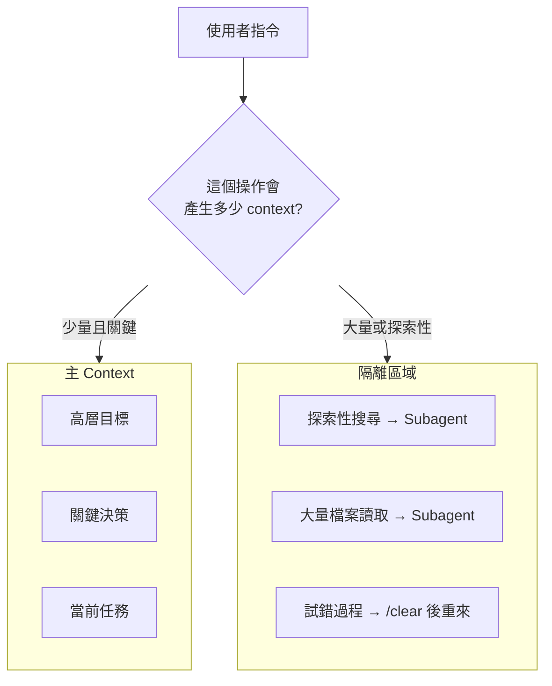
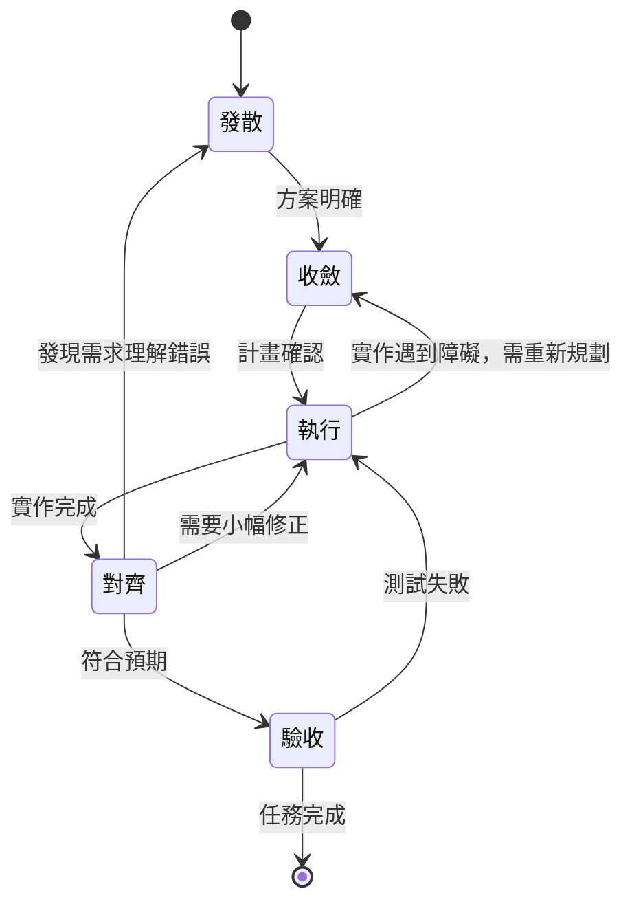
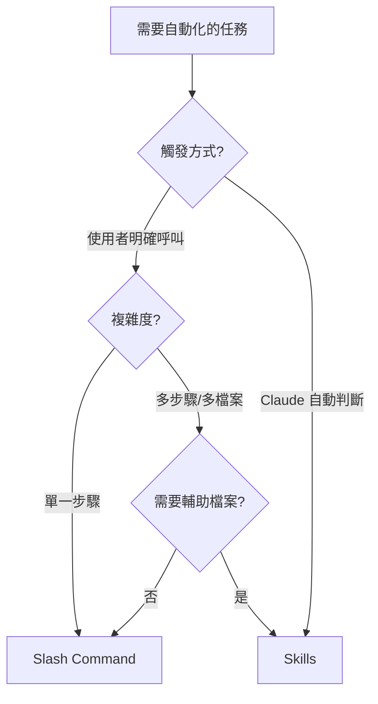
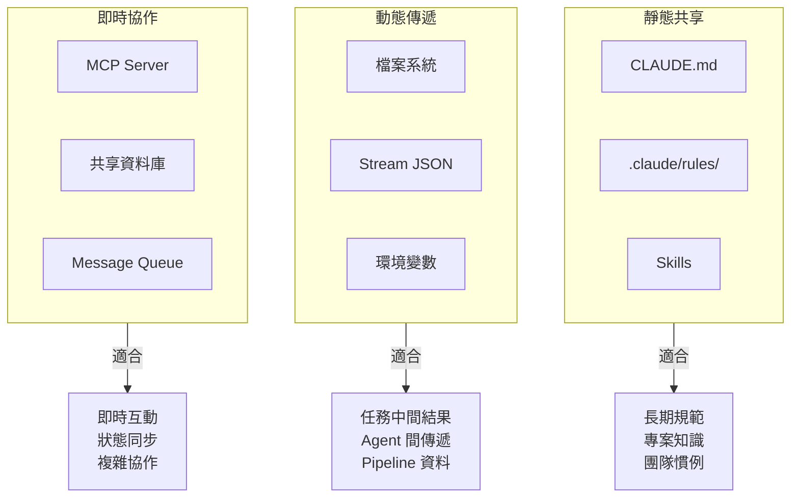
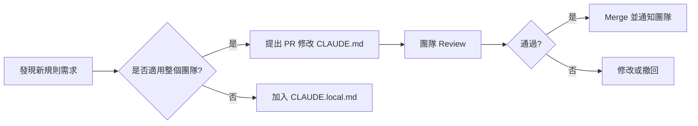

# Claude Code CLI 進階討論：補充篇

> 📌 **時代標注**：本文寫於 2025-12（許願範式早期）。判讀基準同主文件——見[範式轉移：從描述任務到許願](./paradigm-shift-task-to-wish.md)。

> **文件版本**: v1.0
> **建立日期**: 2025-12-31
> **前置文件**: [claude-code-cli-discussion.md](./claude-code-cli-discussion.md)
> **目的**: 深入探討主文件未涵蓋的進階概念與設計哲學

---

## 目錄

1. [主動式 Context Management](#1-主動式-context-management)
2. [迭代式開發流程模型](#2-迭代式開發流程模型)
3. [被低估的 CLI 功能深度解析](#3-被低估的-cli-功能深度解析)
4. [Skills vs Commands 設計哲學](#4-skills-vs-commands-設計哲學)
5. [Headless Mode 進階應用：Agent Orchestration](#5-headless-mode-進階應用agent-orchestration)
6. [跨 Agent Context 交換的本質問題](#6-跨-agent-context-交換的本質問題)
7. [Debugging Claude Code 的行為](#7-debugging-claude-code-的行為)
8. [Token 成本優化策略](#8-token-成本優化策略)
9. [團隊協作模式](#9-團隊協作模式)

---

## 1. 主動式 Context Management

### 1.1 思維轉變

```
❌ 傳統思維：Context 是有限的桶子，要節省使用
✅ 進階思維：Context 是 Agent 的「意識範圍」，要策略性地塑造
```

Context 不只是「資源限制」，而是決定 Claude **能看到什麼、記得什麼、關注什麼**的核心機制。

### 1.2 Context Shaping 策略

**核心概念**：主動決定什麼該進入 context，什麼該隔離



**實作範例**：

```bash
# ❌ 錯誤方式：直接在主 context 探索
> 幫我找出所有跟 authentication 相關的檔案並分析它們

# ✅ 正確方式：隔離探索過程
> 使用 explore agent 找出所有 authentication 相關的檔案，
> 只回報最重要的 3-5 個檔案和它們的關鍵發現
```

### 1.3 Context Checkpointing

在關鍵決策點主動建立「存檔點」：

```bash
# 決策完成後，主動壓縮並保留摘要
/compact 我們剛才決定了：
1. 使用 JWT 而非 Session（原因：微服務架構）
2. Token 存放在 httpOnly cookie（原因：XSS 防護）
3. Refresh token 機制採用 sliding window
請保留以上決策和原因，其他討論過程可以省略。
```

### 1.4 Context Layering 三層結構

| 層次 | 載體 | 內容類型 | 持久性 |
|------|------|----------|--------|
| 第一層：永久記憶 | CLAUDE.md | 專案規範、架構決策 | 跨 session |
| 第二層：規則記憶 | .claude/rules/*.md | 模組化規則、特定領域指引 | 跨 session |
| 第三層：對話記憶 | 當前對話 | 任務細節、即時討論 | 單 session |

**設計原則**：
- 反覆出現的指引 → 升級到第一或第二層
- 一次性的討論 → 留在第三層，用完 `/clear`

---

## 2. 迭代式開發流程模型

### 2.1 線性模型的問題

主文件提出的「發散→收斂→執行→對齊→驗收」是**理想化**的線性流程，但實際開發充滿回退和迭代。

### 2.2 實際的迭代流程



### 2.3 回退時的 Context 處理

| 回退類型 | Context 處理策略 |
|----------|------------------|
| 對齊 → 發散 | `/clear` 重新開始，但先記錄已知的錯誤假設 |
| 對齊 → 執行 | 保持 context，直接修正 |
| 驗收 → 執行 | 保持 context，專注在失敗的測試 |
| 執行 → 收斂 | `/compact` 保留障礙描述，重新規劃 |

### 2.4 Escape + Escape 的戰術應用

當 Claude 走偏時，不要硬著頭皮繼續：

```bash
# 情境：Claude 開始實作，但方向不對
> [Claude 正在寫程式碼...]
> [你意識到這不是你要的]

# 按 Escape 停止
# 按 Escape + Escape 回溯到之前的對話點
# 重新給予更清晰的指示

> 等等，我要的不是這樣。讓我重新說明...
```

---

## 3. 被低估的 CLI 功能深度解析

### 3.1 Escape + Escape：時間旅行

**功能**：回溯到對話歷史中的任意點，從那裡重新開始

**使用場景**：

| 場景 | 操作 |
|------|------|
| Claude 走偏了 | 回到走偏前的點，重新指示 |
| 想嘗試不同方案 | 回到決策點，選擇另一條路 |
| 意外的變更 | 回到變更前，配合 git checkout 復原 |

**重要注意**：回溯只影響對話，**不會復原檔案變更**。需要配合版本控制：

```bash
# 回溯對話後，如果需要復原檔案
git checkout -- path/to/file
# 或
git stash
```

### 3.2 Ctrl+B：背景執行的藝術

**功能**：將長時間執行的 Bash 指令移到背景

```bash
# 情境：執行測試需要 5 分鐘
> 執行完整的測試套件

# Claude 開始執行 pytest...
# 按 Ctrl+B（tmux 用戶按兩次）

# 測試在背景執行，你可以繼續對話
> 在測試跑的同時，幫我看一下 README 需要更新的地方
```

**進階技巧**：預先告訴 Claude 某些指令應該背景執行

```markdown
# 在 CLAUDE.md 中
## 長時間指令
以下指令執行時間較長，建議背景執行：
- `pytest` - 完整測試約 3-5 分鐘
- `npm run build` - 建置約 2 分鐘
- `docker-compose up` - 啟動服務約 1 分鐘
```

### 3.3 @ 檔案引用：精確且高效

**功能**：用 `@` 前綴引用檔案，有自動補全

```bash
# 直接引用檔案
> 幫我 review @src/auth/login.ts

# 引用多個檔案
> 比較 @src/v1/api.ts 和 @src/v2/api.ts 的差異

# 引用整個目錄（Claude 會列出內容）
> 看看 @src/components/ 目錄下有什麼
```

**為什麼比複製貼上好**：
1. 自動補全減少打字錯誤
2. Claude 得到完整檔案而非片段
3. 保留檔案路徑資訊，方便後續編輯

### 3.4 /vim 模式：Vim 用戶必備

```bash
# 啟用 vim 模式
/vim

# 或永久設定
/config
# 然後設定 editor mode 為 vim
```

**啟用後的操作**：
- `Escape` 進入 normal mode
- `i`, `a`, `o` 等進入 insert mode
- `dd`, `yy`, `p` 等編輯指令
- `/` 搜尋

---

## 4. Skills vs Commands 設計哲學

### 4.1 哲學差異

```
Slash Commands = Imperative（命令式）
「我告訴你要做什麼」

Skills = Declarative（宣告式）
「你知道什麼時候該做什麼」
```

### 4.2 選擇指南



### 4.3 設計範例對比

**任務：PR 建立前的檢查**

**Slash Command 版本**（適合：每次 PR 前手動執行）：

```markdown
<!-- .claude/commands/pre-pr.md -->
---
description: PR 建立前的檢查清單
---

請執行以下檢查：
1. 執行 `npm run lint` 確認沒有 lint 錯誤
2. 執行 `npm run test` 確認測試通過
3. 檢查是否有 console.log 殘留
4. 確認 CHANGELOG 已更新
```

使用：`/pre-pr`

**Skill 版本**（適合：Claude 自動在適當時機執行）：

```markdown
<!-- .claude/skills/pr-readiness/SKILL.md -->
---
name: pr-readiness
description: 當用戶提到要建立 PR、準備 merge、或完成功能開發時，自動執行檢查
---

# PR 就緒檢查

當偵測到以下情境時自動啟動：
- 用戶說「準備 PR」「要 merge 了」「功能完成了」
- 用戶執行 git commit 後詢問下一步

## 檢查項目
1. Lint 檢查
2. 測試執行
3. 程式碼品質掃描
4. 文件更新確認
```

### 4.4 組合使用模式

```
Skills 做判斷 → Slash Commands 做執行
```

```markdown
<!-- Skill: 判斷何時需要 review -->
當用戶完成較大的程式碼變更時，
建議執行 /security-review 和 /performance-review
```

---

## 5. Headless Mode 進階應用：Agent Orchestration

### 5.1 單一 Agent 的局限

Headless mode 的基本用法是單一 agent 執行單一任務。但複雜任務需要**多 agent 協作**。

### 5.2 Orchestrator Pattern

```bash
#!/bin/bash
# orchestrator.sh - 多 Agent 協作框架

orchestrate_complex_task() {
    local task="$1"

    # Phase 1: 分析任務複雜度
    echo "📊 分析任務..."
    local analysis=$(claude -p "分析以下任務的複雜度和所需步驟：$task" \
        --output-format json \
        --json-schema '{
            "type": "object",
            "properties": {
                "complexity": {"enum": ["low", "medium", "high"]},
                "subtasks": {"type": "array", "items": {"type": "string"}},
                "estimated_files": {"type": "number"}
            }
        }')

    local complexity=$(echo "$analysis" | jq -r '.complexity')
    echo "複雜度: $complexity"

    # Phase 2: 根據複雜度選擇策略
    case $complexity in
        "low")
            # 簡單任務：單一 agent 直接執行
            claude -p "$task" --allowedTools "Read,Edit,Bash"
            ;;
        "medium")
            # 中等任務：循序執行子任務
            echo "$analysis" | jq -r '.subtasks[]' | while read subtask; do
                echo "🔨 執行: $subtask"
                claude -p "$subtask" --allowedTools "Read,Edit,Bash" --continue
            done
            ;;
        "high")
            # 複雜任務：平行執行 + 整合
            echo "🚀 啟動平行處理..."
            echo "$analysis" | jq -r '.subtasks[]' | \
                parallel -j4 --tag 'claude -p "{}" --allowedTools "Read,Edit" --output-format json'

            # 整合結果
            claude -p "整合以上各子任務的結果，確保一致性" --continue
            ;;
    esac
}

# 使用範例
orchestrate_complex_task "重構 authentication 模組，改用 JWT，並更新所有相關測試"
```

### 5.3 Pipeline Pattern

```bash
#!/bin/bash
# pipeline.sh - Agent Pipeline

# Stage 1: 分析
analyze() {
    claude -p "分析 $1 的程式碼結構" \
        --output-format json \
        --allowedTools "Read,Glob,Grep"
}

# Stage 2: 規劃
plan() {
    claude -p "基於以下分析結果，制定修改計畫：$(cat -)" \
        --output-format json \
        --allowedTools "Read"
}

# Stage 3: 執行
execute() {
    claude -p "執行以下計畫：$(cat -)" \
        --allowedTools "Read,Edit,Bash"
}

# Stage 4: 驗證
verify() {
    claude -p "驗證變更是否正確，執行相關測試" \
        --allowedTools "Bash,Read"
}

# Pipeline 執行
analyze "src/auth" | plan | execute | verify
```

### 5.4 Supervisor Pattern

```bash
#!/bin/bash
# supervisor.sh - 帶有監督的 Agent 執行

supervised_execution() {
    local task="$1"
    local max_attempts=3
    local attempt=1

    while [ $attempt -le $max_attempts ]; do
        echo "🔄 嘗試 $attempt/$max_attempts"

        # 執行任務
        result=$(claude -p "$task" \
            --output-format json \
            --allowedTools "Read,Edit,Bash")

        # 驗證結果
        verification=$(claude -p "驗證以下執行結果是否正確：$result" \
            --output-format json \
            --json-schema '{
                "type": "object",
                "properties": {
                    "success": {"type": "boolean"},
                    "issues": {"type": "array", "items": {"type": "string"}}
                }
            }')

        if echo "$verification" | jq -e '.success == true' > /dev/null; then
            echo "✅ 任務成功完成"
            return 0
        fi

        # 提取問題並重試
        issues=$(echo "$verification" | jq -r '.issues | join(", ")')
        task="修正以下問題後重新執行：$issues。原始任務：$task"
        ((attempt++))
    done

    echo "❌ 任務在 $max_attempts 次嘗試後仍失敗"
    return 1
}
```

---

## 6. 跨 Agent Context 交換的本質問題

### 6.1 核心挑戰

```
如何在保持 context 隔離（避免污染）的同時，
又能有效共享知識（避免重複工作）？
```

這是一個**權衡問題**，沒有完美解法。

### 6.2 Context 交換的三種層次



### 6.3 實用建議：從簡單開始

**90% 的場景**：靜態共享 + 動態傳遞就夠了

```bash
# 靜態共享：共用規則
ln -s /path/to/team/rules ~/.claude/rules/team

# 動態傳遞：檔案交換
# Agent A
claude -p "將分析結果輸出到 /tmp/context-handoff.md" --allowedTools "Write"

# Agent B
claude -p "讀取 /tmp/context-handoff.md 並繼續工作" --allowedTools "Read,Edit"
```

**只有在以下情況才需要即時協作**：
- 兩個 Agent 需要同時修改相同檔案
- 需要即時的雙向溝通
- 任務有嚴格的時序依賴

### 6.4 Context Handoff Protocol

設計一個標準化的交接格式：

```markdown
<!-- /tmp/context-handoff.md -->
# Context Handoff

## Metadata
- From: Agent A (Implementation)
- To: Agent B (Review)
- Timestamp: 2025-12-31T10:30:00Z
- Session ID: abc123

## Task Summary
實作了 JWT authentication，包含：
- login endpoint
- token refresh 機制
- middleware 驗證

## Key Decisions
1. Token 有效期：15 分鐘（安全考量）
2. Refresh token：7 天（用戶體驗）
3. 儲存位置：httpOnly cookie（XSS 防護）

## Files Changed
- src/auth/jwt.ts (新增)
- src/middleware/auth.ts (修改)
- src/routes/login.ts (修改)

## Open Questions
1. 是否需要支援 token revocation？
2. Rate limiting 的閾值要設多少？

## Expected Next Steps
請 review 程式碼，特別注意安全性問題。
```

---

## 7. Debugging Claude Code 的行為

### 7.1 常見問題與診斷

| 問題 | 可能原因 | 診斷方法 |
|------|----------|----------|
| Claude 不遵守 CLAUDE.md | 規則太模糊或衝突 | 檢查 `/memory` 載入狀態 |
| Claude 忘記之前的討論 | Context 被壓縮 | `/context` 檢查使用量 |
| Claude 執行錯誤的工具 | 指示不夠明確 | `Ctrl+O` 看詳細執行過程 |
| Claude 陷入迴圈 | 任務定義有歧義 | `Escape` 中斷，重新描述 |

### 7.2 詳細輸出模式

```bash
# 開啟詳細輸出
Ctrl+O

# 你會看到：
# - 每個 tool 的完整輸入輸出
# - Claude 的內部推理過程
# - Token 使用詳情
```

### 7.3 CLAUDE.md 調試技巧

```markdown
# 在 CLAUDE.md 中加入調試指令

## Debug Mode
當我說「debug mode」時，請：
1. 在執行任何動作前，先說明你打算做什麼
2. 列出你從 CLAUDE.md 中讀取到的相關規則
3. 解釋為什麼選擇這個方案

## Verbose Reasoning
當我說「explain your reasoning」時，請詳細解釋：
1. 你對任務的理解
2. 你考慮過的替代方案
3. 你最終選擇的原因
```

### 7.4 Session 錄影與回放

```bash
# 查看 session 歷史
claude --resume

# 回到特定 session 檢查發生了什麼
claude --resume <session-id>

# 在那個 session 中
> 請摘要一下這個 session 發生了什麼，特別是任何錯誤或問題
```

---

## 8. Token 成本優化策略

### 8.1 成本結構理解

```
總成本 = 輸入 tokens × 輸入價格 + 輸出 tokens × 輸出價格
```

| 模型 | 輸入價格 | 輸出價格 | 適用場景 |
|------|----------|----------|----------|
| Haiku | 最低 | 最低 | 快速搜尋、簡單任務 |
| Sonnet | 中等 | 中等 | 一般開發工作 |
| Opus | 最高 | 最高 | 複雜推理、架構設計 |

### 8.2 優化策略矩陣

| 策略 | 節省幅度 | 實作難度 | 適用情況 |
|------|----------|----------|----------|
| 使用 Subagent | 高 | 低 | 探索性任務 |
| 主動 /compact | 中 | 低 | 長對話 |
| 精確的檔案引用 | 中 | 低 | 每次互動 |
| 選擇適當模型 | 高 | 中 | 根據任務選模型 |
| Headless 批次處理 | 高 | 中 | 重複性任務 |
| 優化 CLAUDE.md | 低 | 高 | 長期維護 |

### 8.3 實用技巧

**1. 避免「讀取整個 codebase」**

```bash
# ❌ 高成本
> 幫我了解這個專案

# ✅ 低成本
> 使用 explore agent 快速了解這個專案的架構，
> 只需要告訴我主要的目錄結構和入口點
```

**2. 精確指定範圍**

```bash
# ❌ 模糊範圍
> 檢查有沒有安全問題

# ✅ 明確範圍
> 檢查 @src/auth/login.ts 是否有 SQL injection 風險
```

**3. 善用 Haiku**

```bash
# 簡單搜尋用 Haiku
> 使用 explore agent (quick) 找出所有 TODO 註解
```

### 8.4 成本監控

```bash
# 定期檢查成本
/cost

# 設定成本警示（在 CLAUDE.md 中）
## Cost Awareness
當單次對話成本超過 $0.50 時，請提醒我。
```

---

## 9. 團隊協作模式

### 9.1 共享資源結構

```
project/
├── CLAUDE.md                    # 團隊共識（進版控）
├── CLAUDE.local.md              # 個人偏好（不進版控，auto gitignore）
├── .claude/
│   ├── rules/
│   │   ├── code-style.md       # 程式風格（團隊）
│   │   ├── security.md         # 安全規範（團隊）
│   │   └── personal/           # 個人規則（gitignore）
│   ├── commands/
│   │   ├── team/               # 團隊指令（進版控）
│   │   └── personal/           # 個人指令（gitignore）
│   ├── skills/                  # 團隊技能（進版控）
│   └── agents/                  # 團隊 agents（進版控）
└── .gitignore                   # 包含 CLAUDE.local.md, .claude/*/personal/
```

### 9.2 CLAUDE.md 維護流程



### 9.3 新成員 Onboarding

```markdown
<!-- CLAUDE.md 中的 Onboarding 區塊 -->

## 新成員指南

### 環境設定
1. 安裝 Claude Code: `npm install -g @anthropic/claude-code`
2. 執行 `/init` 初始化個人設定
3. 閱讀本文件了解團隊規範

### 個人化建議
建議在 CLAUDE.local.md 中設定：
- 你偏好的程式風格（如果與團隊規範不同）
- 你常用的 alias 或快捷方式
- 你的 debug 偏好設定

### 常用指令
- `/team-review` - 執行團隊 code review 標準
- `/pre-commit` - 提交前檢查
- `/deploy-check` - 部署前檢查
```

### 9.4 衝突解決

當團隊成員的 Claude 行為不一致時：

```bash
# 1. 確認載入的 memory
/context

# 2. 比較 CLAUDE.md 版本
git diff HEAD~5 CLAUDE.md

# 3. 確認沒有被 CLAUDE.local.md 覆蓋
cat CLAUDE.local.md

# 4. 如果是 rules 優先序問題
ls -la .claude/rules/
# 檢查是否有衝突的規則
```

### 9.5 團隊 Skills 開發流程

```markdown
## Skills 開發 SOP

1. **提案**：在 team channel 提出新 skill 需求
2. **設計**：寫出 SKILL.md 草稿，定義觸發條件和行為
3. **Review**：團隊成員測試並提供反饋
4. **迭代**：根據反饋修改
5. **發布**：PR merge 後，通知團隊新 skill 可用
6. **監控**：收集使用反饋，持續改進
```

---

## 附錄

### A. 進階指令速查

| 指令/快捷鍵 | 功能 | 使用場景 |
|-------------|------|----------|
| `Escape + Escape` | 對話時間旅行 | 回到任意對話點 |
| `Ctrl+B` | 背景執行 | 長時間指令 |
| `Ctrl+O` | 詳細輸出模式 | Debug Claude 行為 |
| `Option+P` | 切換模型 | 根據任務選模型 |
| `/compact [指引]` | 帶指引的壓縮 | 保留關鍵 context |
| `@filepath` | 檔案引用 | 精確指定檔案 |

### B. 成本優化檢查清單

- [ ] 探索性任務使用 Subagent
- [ ] 長對話定期 `/compact`
- [ ] 簡單任務使用 Haiku
- [ ] 避免讀取整個 codebase
- [ ] 精確指定檔案範圍
- [ ] 善用 `/clear` 切換任務

### C. 團隊協作檢查清單

- [ ] CLAUDE.md 有版本控制
- [ ] CLAUDE.local.md 在 .gitignore
- [ ] 團隊有 CLAUDE.md 修改流程
- [ ] 新成員有 onboarding 指南
- [ ] 定期 review 和更新規則

---

**文件維護者**: LuminNexus Team
**相關文件**: [claude-code-cli-discussion.md](./claude-code-cli-discussion.md)
