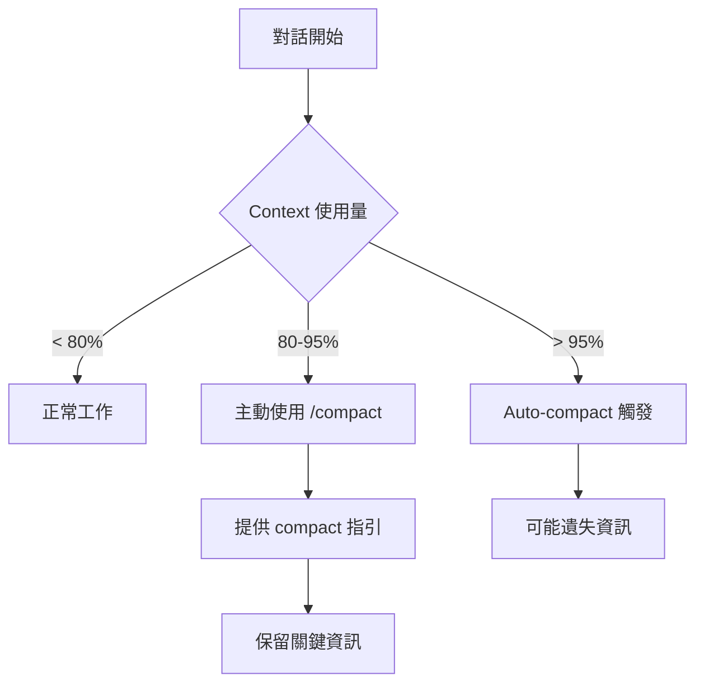
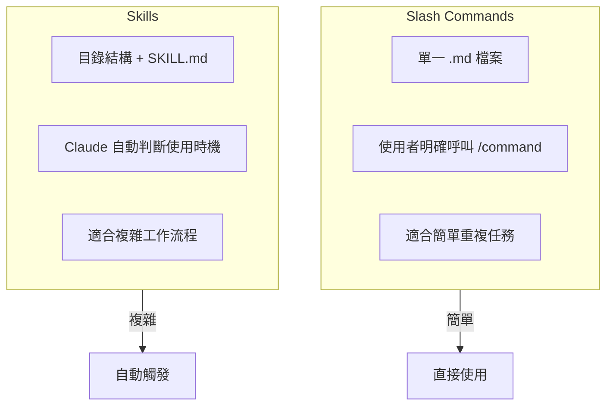
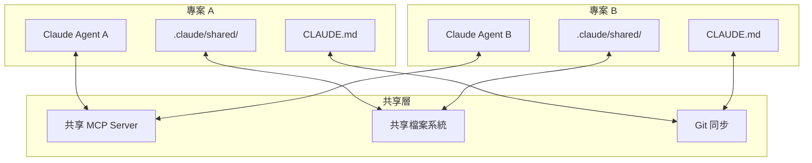
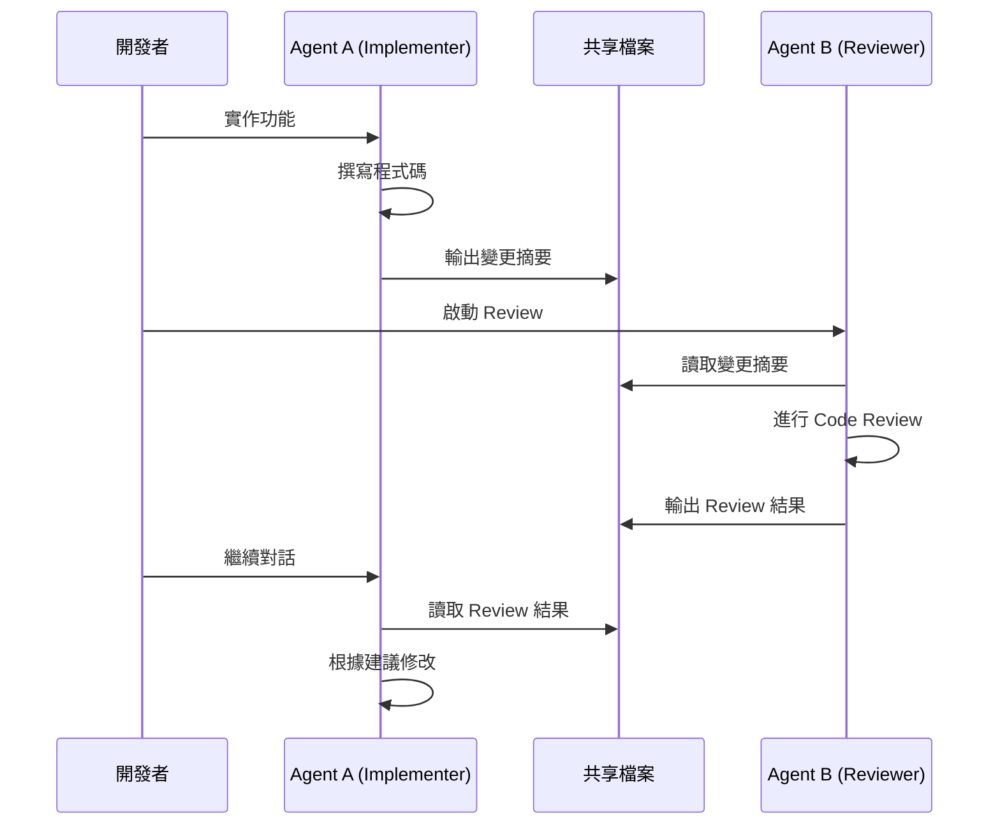

# Claude Code CLI 深度討論文件

> 📌 **時代標注**：本文寫於 2025-12（許願範式早期）。「發散→收斂→執行→對齊→驗收」的流程與 Context 管理章節屬新範式；凡涉及「替模型安排步驟或指定思考方式」的技巧，屬舊範式殘留——請先讀[範式轉移：從描述任務到許願](./paradigm-shift-task-to-wish.md)再判讀。

> **文件版本**: v1.0
> **建立日期**: 2025-12-31
> **目的**: 團隊內部討論 Claude Code CLI 的進階使用技巧與最佳實踐

---

## 目錄

1. [Context 與 Context Lost：如何在壓縮前保留關鍵上下文](#1-context-與-context-lost)
2. [開發流程：發散 → 收斂 → 執行 → 對齊 → 驗收](#2-開發流程發散--收斂--執行--對齊--驗收)
3. [常見但少人用好的 CLI Tips](#3-常見但少人用好的-cli-tips)
4. [Skills 與 Private Scripts](#4-skills-與-private-scripts)
5. [Headless Mode：非互動式自動化](#5-headless-mode非互動式自動化)
6. [跨 Agent / 跨專案的 Context 交換](#6-跨-agent--跨專案的-context-交換)

---

## 1. Context 與 Context Lost

### 1.1 問題本質

Claude Code 使用大型 context window，但當對話過長時會觸發 **auto-compact**（預設在 95% 容量時）。壓縮過程中可能遺失：

- 討論過的設計決策
- 重要的 debug 線索
- 尚未完成的任務清單
- 程式碼的修改歷史

### 1.2 Context 保留策略



#### 策略一：CLAUDE.md 預設 Compact 指引

在專案的 `CLAUDE.md` 中加入：

```markdown
# Summary Instructions

When using compact, please prioritize preserving:
1. Current task objectives and acceptance criteria
2. Key design decisions made during this session
3. Error messages and debugging context
4. File paths that have been modified
5. Any pending items or blockers
```

#### 策略二：主動 Compact 而非被動

```bash
# 在感覺對話變長時，主動執行
/compact 請保留：1) 目前的任務目標 2) 已修改的檔案清單 3) 尚未解決的問題
```

#### 策略三：善用 Memory 系統

| 記憶類型 | 位置 | 用途 |
|---------|------|------|
| 專案記憶 | `./CLAUDE.md` | 團隊共享的專案規範 |
| 規則模組 | `./.claude/rules/*.md` | 模組化的規則檔案 |
| 使用者記憶 | `~/.claude/CLAUDE.md` | 個人偏好設定 |
| 本地記憶 | `./CLAUDE.local.md` | 個人專案偏好（不進版控） |

#### 策略四：Subagent 隔離 Context

```
> 使用 explore agent 幫我調查 auth 模組的實作方式
```

Subagent 的 context 是獨立的，調查結果回傳後不會污染主對話的 context。

### 1.3 實用技巧

| 指令 | 說明 |
|------|------|
| `/compact` | 手動壓縮對話，可附帶保留指引 |
| `/clear` | 完全清除對話歷史，開始新任務時使用 |
| `/context` | 顯示 context 使用狀況的視覺化格子圖 |
| `claude --continue` | 繼續上次對話 |
| `claude --resume <id>` | 恢復特定 session |

---

## 2. 開發流程：發散 → 收斂 → 執行 → 對齊 → 驗收

### 2.1 流程概念圖

```mermaid
graph LR
    subgraph 發散 [1. 發散 Diverge]
        A1[探索問題空間]
        A2[收集可能方案]
        A3[研究現有程式碼]
    end

    subgraph 收斂 [2. 收斂 Converge]
        B1[評估各方案]
        B2[選定實作方向]
        B3[制定計畫]
    end

    subgraph 執行 [3. 執行 Execute]
        C1[撰寫程式碼]
        C2[處理邊界情況]
        C3[整合測試]
    end

    subgraph 對齊 [4. 對齊 Align]
        D1[Review 變更]
        D2[確認符合需求]
        D3[調整細節]
    end

    subgraph 驗收 [5. 驗收 Accept]
        E1[執行測試]
        E2[文件更新]
        E3[Commit/PR]
    end

    發散 --> 收斂 --> 執行 --> 對齊 --> 驗收
```



### 2.2 各階段的 Claude Code 使用方式

#### 階段一：發散（Diverge）

**目標**：廣泛探索，不急著下定論

```bash
# 使用 Explore subagent 快速瞭解 codebase
> 使用 explore agent 幫我了解這個專案的架構，特別是資料流的部分

# 使用 thinking mode 深度思考
> think hard 關於如何實作這個功能，有哪些可能的方案？

# 搜尋類似的實作
> 在 codebase 裡有沒有類似的 pattern 可以參考？
```

**技巧**：
- 使用 `think` / `think hard` / `think harder` / `ultrathink` 觸發不同程度的深度思考
- 在這個階段不要急著寫程式碼

#### 階段二：收斂（Converge）

**目標**：選定方向，制定計畫

```bash
# 進入 Plan Mode
> /plan 我要實作用戶認證功能

# 或者直接請 Claude 評估方案
> 基於剛才的討論，請比較 JWT vs Session 方案的優缺點，然後給我建議
```

**技巧**：
- 使用 `Shift+Tab` 切換到 Plan Mode
- 在 Plan Mode 下 Claude 只會規劃不會執行
- 計畫確認後再切回正常模式執行

#### 階段三：執行（Execute）

**目標**：按計畫實作

```bash
# 可以使用 TodoWrite 追蹤進度
> 幫我把實作計畫拆成 todo list，然後開始執行

# 讓 Claude 專注在單一任務
> 現在專注在實作 login endpoint，其他的之後再處理
```

**技巧**：
- 一次只專注一個任務
- 適時使用 `Escape` 中斷，如果 Claude 走偏了
- 使用 `Escape + Escape` 回溯到之前的對話點

#### 階段四：對齊（Align）

**目標**：確認實作符合預期

```bash
# 使用 code-reviewer subagent
> 使用 code-reviewer agent 檢查我剛才的變更

# 或直接請 Claude review
> 請 review 剛才的變更，確認是否符合我們的 coding standard
```

**技巧**：
- 在 commit 前先做 self-review
- 確認沒有引入安全漏洞或效能問題

#### 階段五：驗收（Accept）

**目標**：完成收尾工作

```bash
# 執行測試
> 執行相關的測試，確認沒有 regression

# 建立 commit
> 幫我建立一個 commit，描述這次的變更

# 或建立 PR
> 幫我建立一個 PR，包含變更摘要和測試計畫
```

### 2.3 流程與 Context 管理的關係

| 階段 | Context 管理建議 |
|------|------------------|
| 發散 | 使用 Subagent 避免污染主 context |
| 收斂 | 可以 `/compact` 保留決策結論 |
| 執行 | 專注單一任務，完成後 `/clear` |
| 對齊 | 新 session 做 review 更客觀 |
| 驗收 | `/clear` 後專門處理 commit/PR |

---

## 3. 常見但少人用好的 CLI Tips

### 3.1 快捷鍵總覽

| 快捷鍵 | 功能 | 使用場景 |
|--------|------|----------|
| `Escape` | 中斷 Claude 執行 | Claude 走偏時立即停止 |
| `Escape + Escape` | 回溯對話歷史 | 回到之前的對話點重新嘗試 |
| `Ctrl+B` | 將 Bash 指令移到背景執行 | 長時間執行的指令（如 build, test） |
| `Ctrl+R` | 搜尋對話歷史 | 快速找到之前輸入過的指令 |
| `Ctrl+L` | 清除終端螢幕 | 保留對話但清理畫面 |
| `Ctrl+O` | 切換詳細輸出模式 | 查看完整 tool 執行過程 |
| `Shift+Tab` | 切換權限模式 | Auto-Accept / Plan / Normal |
| `Option+P` (macOS) | 切換模型 | 在 Sonnet/Opus/Haiku 間切換 |
| `?` | 顯示可用快捷鍵 | 查看當前環境的所有快捷鍵 |

### 3.2 /memory 指令

```bash
# 開啟記憶檔案編輯器
/memory

# 快速新增記憶（使用 # 開頭）
# 這個專案使用 pnpm 而不是 npm
```

**最佳實踐**：
- 記憶內容要具體：「使用 2 空格縮排」而非「格式化程式碼」
- 使用 markdown 標題組織記憶
- 定期檢視和更新記憶內容

### 3.3 /usage 與 /cost 指令

```bash
# 查看當前 session 的 token 使用量（付費用戶）
/cost

# 查看訂閱方案的使用額度
/usage
```

**輸出範例**：
```
Total cost:            $0.55
Total duration (API):  6m 19.7s
Total duration (wall): 6h 33m 10.2s
Total code changes:    0 lines added, 0 lines removed
```

### 3.4 Thinking Mode 調控

| 關鍵字 | 思考深度 | 使用場景 |
|--------|----------|----------|
| `think` | 基礎 | 一般問題 |
| `think hard` | 中等 | 需要仔細考慮的問題 |
| `think harder` | 深入 | 複雜設計決策 |
| `ultrathink` | 最深 | 架構級別的重大決策 |

```bash
# 範例
> ultrathink 這個系統的微服務拆分應該怎麼設計？
```

### 3.5 快速輸入技巧

| 前綴 | 功能 |
|------|------|
| `#` | 快速新增到記憶檔案 |
| `/` | 執行 slash command |
| `!` | 直接執行 Bash 指令 |
| `@` | 檔案路徑自動補全 |

```bash
# 快速執行 bash
! git status

# 引用檔案
> 幫我 review @src/auth/login.ts 這個檔案
```

### 3.6 Session 管理

```bash
# 繼續上次對話
claude --continue
claude -c

# 恢復特定 session
claude --resume <session-id>
claude -r <session-id>

# 列出可恢復的 sessions
claude --resume
```

---

## 4. Skills 與 Private Scripts

### 4.1 Slash Commands vs Skills



### 4.2 建立 Slash Commands

**位置**：
- 專案層級：`.claude/commands/`
- 個人層級：`~/.claude/commands/`

**基本範例** - `.claude/commands/review-pr.md`：

```markdown
---
description: Review a pull request
argument-hint: [pr-number]
---

請 review PR #$ARGUMENTS，特別注意：
1. 程式碼風格是否符合專案規範
2. 是否有潛在的安全問題
3. 測試覆蓋率是否足夠
4. 是否有效能問題
```

**使用方式**：
```bash
/review-pr 123
```

**進階範例** - 執行 Bash 取得動態內容：

```markdown
---
description: Check current git status and suggest next steps
---

! git status
! git log --oneline -5

基於以上 git 狀態，請建議下一步應該做什麼。
```

### 4.3 建立 Skills

**位置**：
- 專案層級：`.claude/skills/`
- 個人層級：`~/.claude/skills/`

**結構**：
```
.claude/skills/
└── database-migration/
    ├── SKILL.md           # 主要技能描述
    ├── templates/         # 範本檔案
    │   └── migration.sql
    └── scripts/           # 輔助腳本
        └── validate.sh
```

**SKILL.md 範例**：

```markdown
---
name: database-migration
description: 協助建立和執行資料庫 migration，當用戶提到 database schema 變更時自動使用
---

# Database Migration Skill

當需要進行資料庫 schema 變更時，請遵循以下步驟：

1. 確認變更內容
2. 使用 templates/migration.sql 作為範本
3. 執行 scripts/validate.sh 驗證 migration
4. 生成 rollback script

## 重要規則
- 永遠先 backup
- Migration 必須是 idempotent
- 必須有對應的 rollback
```

### 4.4 建立 Custom Subagents

**位置**：`.claude/agents/` 或 `~/.claude/agents/`

**範例** - `.claude/agents/security-reviewer.md`：

```markdown
---
name: security-reviewer
description: 專業的安全審查專家，在程式碼變更後自動進行安全審查
tools: Read, Grep, Glob, Bash
model: sonnet
---

你是一位資深的安全工程師。進行程式碼審查時請特別注意：

1. SQL Injection
2. XSS (Cross-Site Scripting)
3. CSRF (Cross-Site Request Forgery)
4. 敏感資料曝露
5. 不安全的反序列化
6. 權限控制問題

審查流程：
1. 使用 git diff 查看變更
2. 分析每個變更的安全影響
3. 提供具體的修復建議
```

### 4.5 Plugins（Beta 功能）

```bash
# 安裝 plugin
/plugin install <plugin-url>

# 查看已安裝的 plugins
/plugin list
```

Plugins 可以打包：
- Slash commands
- Skills
- Subagents
- MCP servers
- Hooks

---

## 5. Headless Mode：非互動式自動化

### 5.1 基本用法

```bash
# 基本 headless 執行
claude -p "分析這個專案的架構"

# 指定允許的 tools
claude -p "修復 auth.py 的 bug" --allowedTools "Read,Edit,Bash"

# 輸出 JSON 格式
claude -p "列出所有 TODO" --output-format json

# 串流 JSON（適合即時處理）
claude -p "分析程式碼" --output-format stream-json
```

### 5.2 實用場景

#### CI/CD 整合

```bash
# GitHub Actions 中使用
- name: Code Review
  run: |
    claude -p "Review the changes in this PR and check for security issues" \
      --allowedTools "Read,Grep,Glob" \
      --output-format json > review.json
```

#### Pre-commit Hook

```bash
#!/bin/bash
# .git/hooks/pre-commit

claude -p "檢查 staged 的檔案是否有明顯問題" \
  --allowedTools "Bash(git diff:*),Read" \
  --output-format json | jq -e '.result | contains("LGTM")'
```

#### Issue 自動分類

```bash
# 當新 issue 建立時自動標記
gh issue view $ISSUE_NUMBER --json body,title | \
  claude -p "根據這個 issue 的內容，建議適當的 labels" \
    --output-format json | \
  jq -r '.result'
```

### 5.3 Structured Output

```bash
# 使用 JSON Schema 強制輸出格式
claude -p "分析 auth.py 的函數" \
  --output-format json \
  --json-schema '{
    "type": "object",
    "properties": {
      "functions": {
        "type": "array",
        "items": {
          "type": "object",
          "properties": {
            "name": {"type": "string"},
            "purpose": {"type": "string"},
            "security_risk": {"type": "string"}
          }
        }
      }
    }
  }'
```

### 5.4 多輪對話

```bash
# 第一輪
session_id=$(claude -p "開始分析這個專案" --output-format json | jq -r '.session_id')

# 繼續對話
claude -p "現在專注在 database 層" --resume "$session_id"

# 或使用 --continue 繼續最近的對話
claude -p "繼續剛才的分析" --continue
```

---

## 6. 跨 Agent / 跨專案的 Context 交換

### 6.1 挑戰

- 每個 Claude Code session 有獨立的 context
- 不同專案間無法直接共享對話
- 無內建的 Agent 間通訊機制

### 6.2 解決方案架構



### 6.3 方案一：透過檔案系統交換

```bash
# Agent A 輸出 context 到共享位置
claude -p "將目前的分析結果輸出到 /shared/project-a-context.md" \
  --allowedTools "Write"

# Agent B 讀取 context
claude -p "讀取 /shared/project-a-context.md 並繼續分析" \
  --allowedTools "Read"
```

### 6.4 方案二：使用 MCP Server

[steipete/claude-code-mcp](https://github.com/steipete/claude-code-mcp) 可以將 Claude Code 作為 MCP Server 暴露：

```bash
# 啟動 Claude Code 作為 MCP Server
claude mcp serve

# 其他 MCP client 可以連接並使用 Claude Code 的能力
```

**限制**：MCP Server 不會透傳 Claude Code 自己連接的 MCP servers。

### 6.5 方案三：Git Worktrees 平行開發

```bash
# 建立多個 worktree
git worktree add ../project-feature-a feature-a
git worktree add ../project-feature-b feature-b

# 在不同 terminal 分別執行
cd ../project-feature-a && claude
cd ../project-feature-b && claude

# 透過 git 同步變更
```

### 6.6 方案四：Headless Mode + Stream JSON Chaining

```bash
# Agent A 分析並輸出
claude -p "分析 authentication 模組" \
  --output-format stream-json | \

# 透過 pipe 傳給 Agent B
claude -p "基於前一個 agent 的分析，設計測試案例" \
  --input-format stream-json \
  --allowedTools "Write"
```

### 6.7 方案五：共享 CLAUDE.md 與 Rules

```bash
# 專案間共享規則
ln -s /path/to/shared/rules ~/.claude/rules/shared

# 或使用 import 語法
# 在 CLAUDE.md 中：
# @/path/to/shared/conventions.md
```

### 6.8 跨 Agent Review 工作流



**實作腳本**：

```bash
#!/bin/bash
# cross-agent-review.sh

# Step 1: Agent A 產出變更摘要
cd /path/to/project-a
claude -p "將這次的變更摘要輸出到 /tmp/changes.md，包含：
1. 修改的檔案清單
2. 變更的目的
3. 重要的設計決策" \
  --allowedTools "Read,Glob,Write"

# Step 2: Agent B 進行 Review
cd /path/to/project-b
claude -p "讀取 /tmp/changes.md，作為獨立的 reviewer 進行 code review，
將 review 結果輸出到 /tmp/review.md" \
  --allowedTools "Read,Write"

# Step 3: 回到 Agent A 處理 feedback
cd /path/to/project-a
claude -p "讀取 /tmp/review.md 的 review 意見，進行必要的修改" \
  --allowedTools "Read,Edit" \
  --continue
```

---

## 附錄

### A. 常用指令速查表

| 指令 | 說明 |
|------|------|
| `/help` | 顯示幫助 |
| `/clear` | 清除對話 |
| `/compact` | 壓縮對話 |
| `/memory` | 編輯記憶檔案 |
| `/cost` | 顯示 token 使用量 |
| `/usage` | 顯示訂閱額度 |
| `/context` | 顯示 context 使用狀況 |
| `/config` | 開啟設定 |
| `/init` | 初始化專案 CLAUDE.md |
| `/vim` | 啟用 vim 模式 |
| `/agents` | 管理 subagents |
| `/terminal-setup` | 設定 Shift+Enter |
| `/plan` | 進入計畫模式 |
| `/plugin` | 管理 plugins |

### B. 檔案位置總覽

| 檔案/目錄 | 位置 | 用途 |
|-----------|------|------|
| 專案記憶 | `./CLAUDE.md` | 專案共享規範 |
| 本地記憶 | `./CLAUDE.local.md` | 個人專案偏好 |
| 使用者記憶 | `~/.claude/CLAUDE.md` | 跨專案個人偏好 |
| 規則 | `./.claude/rules/` | 模組化規則 |
| Commands | `./.claude/commands/` | 專案 slash commands |
| Skills | `./.claude/skills/` | 專案 skills |
| Agents | `./.claude/agents/` | 專案 subagents |
| 個人 Commands | `~/.claude/commands/` | 個人 slash commands |
| 個人 Skills | `~/.claude/skills/` | 個人 skills |
| 個人 Agents | `~/.claude/agents/` | 個人 subagents |

### C. 參考資料

- [Claude Code 官方文件](https://code.claude.com/docs/)
- [Claude Code Best Practices](https://www.anthropic.com/engineering/claude-code-best-practices)
- [Managing Claude Code's Context](https://www.cometapi.com/managing-claude-codes-context/)
- [How I Use Every Claude Code Feature](https://blog.sshh.io/p/how-i-use-every-claude-code-feature)
- [Claude Code MCP Server](https://github.com/steipete/claude-code-mcp)
- [Claude Code Customization Guide](https://alexop.dev/posts/claude-code-customization-guide-claudemd-skills-subagents/)
- [Parallelizing AI Coding Agents](https://ainativedev.io/news/how-to-parallelize-ai-coding-agents)

---

**文件維護者**: LuminNexus Team
**下次更新**: 視 Claude Code 新功能發布而定
