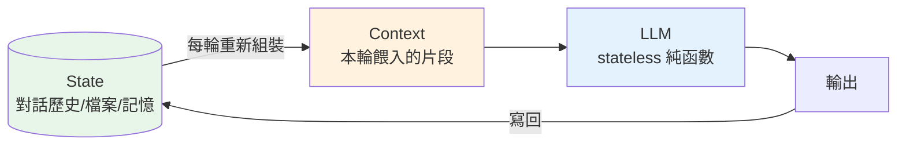
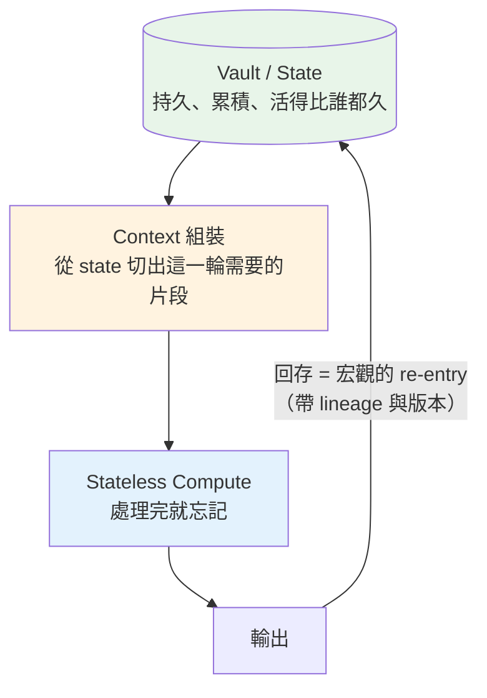

# Compute、State 與 Context：Stateless 設計與 Context 的本質

---

## 📋 文檔目的

這是 [emergence-data-compute.md](./emergence-data-compute.md) 的姊妹篇。那一篇講 Data 與 Compute 在**時間軸上**的差異（留下來的 vs 用過即逝的）；這一篇講它們在**每一次計算的當下**如何相遇。讀完你應該能回答：

1. **Stateful 與 Stateless 設計**差在哪裡？為什麼現代系統偏愛 stateless？
2. **Context 到底是什麼**？為什麼這個詞突然無所不在？
3. 為什麼「管理 context」會變成一門學問（ContextOps）？
4. **Re-entry** 發生在哪些尺度？單次 predict 的 context 和 agent loop 的 context 差在哪？

---

## 1. Compute 的本質：沒有記憶

先從一個理想形狀說起——**純函數 (pure function)**：

```text
f(input) → output
```

相同的輸入，永遠得到相同的輸出。它不記得上一次被呼叫過，不偷看外面的世界，不在任何地方留下痕跡。呼叫一萬次和呼叫第一次，對它來說沒有差別。

這種「沒有記憶」不是缺陷，是**美德**：

- **可重跑**：出錯了？再跑一次，結果一樣。
- **可替換**：換一台機器、換一個實作、換一代模型，只要輸入輸出介面不變，沒人察覺。
- **可平行**：一萬個請求可以分給一萬個副本，因為副本之間不需要共享任何記憶。
- **可測試**：給輸入、看輸出，不需要「先把系統弄到某個狀態」。

這組性質在工程上有一個正式的名字：**reentrant（可重入）**——一個函數可以在執行到一半時被打斷、被再次進入而不出錯，條件正是它不持有任何共享的可變 state。這個詞根第 5 節會回來，它比表面看起來重要得多。

注意這四個性質，正是 [emergence-data-compute.md](./emergence-data-compute.md) 說「compute 可以整代替換」的技術基礎。**Compute 之所以能被無情地換代，正因為它被設計成不擁有任何東西。**

---

## 2. State：需要被記住的東西

但真實世界的系統必須記得事情——你的購物車、你的登入狀態、爬蟲爬到第幾頁了。這些「呼叫與呼叫之間必須存活下來的資訊」就是 **state**。

問題從來不是「要不要有 state」（一定要有），而是——**state 放在哪裡**。

| | **Stateful 設計** | **Stateless 設計** |
|---|---|---|
| State 放哪 | 藏在 compute 裡面（記憶體、session） | 放在 compute **外面**（資料庫、檔案、token） |
| 每次請求 | 「還記得我嗎？」 | 「這是我的完整資料，請處理」 |
| Compute 掛掉 | state 一起消失 | 沒有任何損失，換一台重來 |
| 擴展 | 難（請求必須回到「記得你」的那一台） | 容易（任何一台都能服務任何人） |
| 例子 | 傳統 session-based 登入 | REST API、JWT token |

REST 的 "ST" 就是 State Transfer——**每個請求自帶完整的狀態**，伺服器讀完、處理、回應、然後忘記你。這就是為什麼 REST API 可以無限水平擴展。

> **設計鐵律**：state 藏在 compute 裡，它就會隨著 compute 一起消失。
> 這句話對機器成立，**對人也成立**——只存在某個人腦子裡的知識、只存在某段對話裡的決定，都是藏在 compute 裡的 state。寫下來，就是把 state 外部化。

---

## 3. Context：交給無記憶者的那一片 State

現在可以回答「context 是什麼」了。

一個 stateless 的 compute 沒有記憶，但我們常常需要它**表現得像有記憶**。唯一的辦法：每次呼叫時，把「它需要記得的東西」**隨著輸入一起交給它**。

```text
output = f(context + input)
```

**Context 就是：從全部的 state 裡切出來、餵給這一次計算的那一片。**

三個立刻成立的推論：

1. **Context 是有限的**——你不可能把整個世界塞進一次呼叫，所以永遠在做選擇。
2. **Context 的品質決定輸出的品質**——stateless compute 只知道你給它的東西；餵錯了片段，再強的 compute 也答錯。
3. **選什麼進 context，是呼叫者的責任**——不是 compute 的。

---

## 4. LLM：最純粹的例子

LLM 把上面這一切演到極致，因為**模型本身是徹底 stateless 的**。

每一次 API 呼叫都是一個純函數：丟進一串文字，吐出一串文字，然後**忘得一乾二淨**。它不記得你，不記得上一句話，不記得這場「對話」存在。

那為什麼你感覺它記得？因為 harness（ChatGPT 介面、Claude Code）在每一輪**把整段歷史重新餵進去**。所謂「對話」是一個幻覺——是呼叫端勤勞地搬運 state 製造出來的。



一旦看穿這一點，幾個現象立刻變得理所當然：

- **Context window 有限** → 所以有 context lost、compaction（見 [claude-code-tips.md](./claude-code-tips.md)）——不是模型「忘記」，是搬運工搬不動了，只好丟掉一部分 state。
- **CLAUDE.md 與 Memory 的本質** → 把重要的 state 從「對話」（易失）外部化到「檔案」（持久），讓每一輪都能重新裝進 context。
- **ContextOps 是一門學問**（見 [contextops-discipline.md](./contextops-discipline.md)）→ 因為「從龐大的 state 裡選出對的片段、在有限預算內組裝 context」本來就是工程問題，跟資料 pipeline 一模一樣。

**「Prompt 工程」的大部分，其實是 state 管理工程。**

---

## 5. Re-entry：同一個動詞，好幾個尺度

§1 埋下的那個詞根，現在可以展開了。它有兩張臉：

- **Reentrant（可重入）**是 compute 的性質：*我隨時可以被再次進入，因為我什麼都不記得。*
- **Re-entry（重新進入）**是 state 的宿命：*我必須每一輪重新進場，因為對面什麼都不記得。*

同一個字根，兩個視角——合起來就是這篇文章真正想說的一句話：

> **Stateless 設計不是消滅 state，而是紀律化 re-entry：**
> 所有 state 只能從正門（context）進來，不准走後門。
> Stateful 系統的病從來不是「有 state」，是 state 從後門滲入——
> 藏在記憶體、session、某人腦子裡，在你看不見的地方重新進入計算。

用這個透鏡回看前面的一切：REST 要求每個請求自帶完整狀態，是**強制走正門**；reentrant code 之所以安全，是**保證沒有後門**；「把決定寫下來」，是把人腦裡的 state 搬到正門口排隊。

### 新人最常搞混的：re-entry 發生在哪個尺度

「context」這個詞在四個尺度上各有意思。混在一起用，想像就會出錯：

| 尺度 | 「一次」是什麼 | context 是什麼 | re-entry 誰負責 | 常見誤解 |
|---|---|---|---|---|
| **單次 predict** | 一次模型呼叫（純函數） | 這一次餵入的全部 | 沒有 re-entry——進去一次就結束 | 以為模型「記得」上一次呼叫 |
| **Agent loop** | 多次 predict 串成的迴圈 | 每輪重新組裝：指令＋歷史＋工具結果 | harness 每一輪做 | 以為 agent 是一個持續活著的心智 |
| **Context management** | 跨輪、跨 session 的治理 | 有限的門寬 vs 無限的 state | 你——設計 memory、compaction、CLAUDE.md | 以為這是模型的事；其實是呼叫者的工程 |
| **系統 pipeline** | 一整代處理循環 | 從 Vault 切出的資料集 | pipeline 的回存與排程 | 以為算出來的結果「系統就知道了」——不回存，下一輪它不存在 |

第二列值得對新人多說一句：**agent 不是一個持續思考的心智**。它是一串離散的、各自完整的 predict，被 harness 的 re-entry 一針一針縫起來的。兩次呼叫之間，agent 沒有在「想」——**兩次呼叫之間，它不存在**。你感覺到的連續性，全部是 re-entry 工程的品質。

尺度分清楚之後，前面的現象各就各位：compaction 是第三尺度在第二尺度門口做的分流；CLAUDE.md 是讓重要 state 每一輪都拿到 re-entry 的門票；[emergence 篇](./emergence-data-compute.md)的 Strange Loop 則是第四尺度的 re-entry。**同一個動詞，從毫秒級跑到月級。**

---

## 6. 呼應 Emergence：同一個世界觀的兩個切面

把兩篇放在一起看：

| | emergence-data-compute.md | 本篇 |
|---|---|---|
| 視角 | 時間軸（跨越多代） | 單次計算（每一輪的當下） |
| Data / State | 留下來的蛻殼，湧現的基質 | 放在 compute 外面、活得比 compute 久的記憶 |
| Compute | 用過即逝、整代替換 | stateless 純函數、沒有記憶 |
| 橋樑 | 遞歸 loop：輸出回存為下一輪輸入 | **Context**：每輪從 state 切一片餵給 compute |

它們描述的是同一個循環：



LuminNexus 的 pipeline 正是這樣設計的：**state 全部住在 Vault**（Single Source of Truth），TheRefinery、TheWeaver、TheDistiller 都是 stateless 的 compute——可以砍掉重跑、可以整代升級，因為它們不擁有任何 state。這不是巧合，是同一個世界觀在架構上的落實。

> **一句話**：Data 是活得最久的 state；Compute 是被設計成不擁有記憶的過程；**Context 是兩者相遇的方式**——每一輪，從殼裡取出一勺，餵給那個永遠是第一次醒來的計算。

---

## 7. 對新人的實務守則

1. **State 永遠放在 compute 外面**：寫進檔案、資料庫、Vault——不要留在記憶體裡、對話裡、或某個人的腦子裡。
2. **把 compute 設計成可以隨時被砍掉**：如果砍掉一個程序會遺失資訊，代表有 state 藏錯了地方。
3. **和 LLM 工作時，你是 context 的組裝者**：它每一輪都是第一次醒來。重要的決定與結論，隨手外部化（寫進文件），不要指望「對話」替你記得。
4. **Context 是預算，不是倉庫**：塞得越多不等於答得越好——選對片段比塞滿更重要。這條對 LLM 成立，對你自己的注意力也成立。
5. **設計 re-entry 的門，而不是消滅 state**：問題從來不是 state 太多，是它從哪裡進來。把正門做明確（context、schema、回存介面），把後門封死。遇到「context」相關的討論，先問一句：我們在講哪個尺度的 re-entry？

---

## 延伸閱讀

- **Roy Fielding 的 REST 論文（2000）第 5 章** — stateless 約束的原始論證：為什麼「每個請求自帶完整狀態」換來了可見性、可靠性與可擴展性。
- **"Out of the Tar Pit" (Moseley & Marks, 2006)** — 軟體複雜度的主要來源正是 state；經典短論文。

## 相關文檔

- [emergence-data-compute.md](./emergence-data-compute.md) - 系列第一篇：Data 與 Compute 的時間軸視角
- [tension-value-perspective.md](./tension-value-perspective.md) - 系列第三篇：張力——不同角度的 Value（視角）
- [isomorphism-projection.md](./isomorphism-projection.md) - 系列第四篇（骨架）：context 的選擇也是一次投影
- [atomization-context-isolation.md](./atomization-context-isolation.md) - 續篇：切開工作＝切開單元之間的 context，什麼時候該切、什麼時候絕不能切
- [contextops-discipline.md](./contextops-discipline.md) - ContextOps：把 context 當 pipeline 管理
- [claude-code-tips.md](./claude-code-tips.md) - Memory、compaction 的實際操作
- [ai-data-terminology.md](./ai-data-terminology.md) - Derived / Inferred：回存 state 時的兩種產物

---

## 📝 文檔維護

### 版本歷史

| 版本 | 日期 | 作者 | 變更說明 |
|------|------|------|----------|
| 1.0 | 2026-07-05 | maple | 初版建立 |
| 1.1 | 2026-07-06 | maple | 新增 §5 Re-entry：reentrant/re-entry 對偶、正門/後門、四尺度表（單次 predict / agent loop / context management / 系統 pipeline）；§1 補 reentrant 學名；守則加第 5 條 |

---

**文檔結束**
