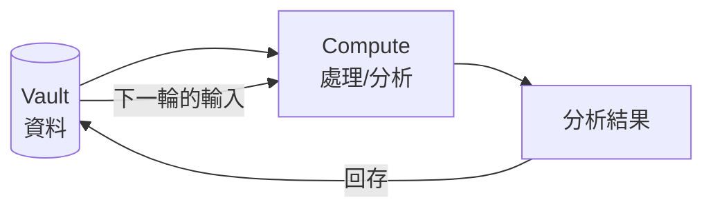
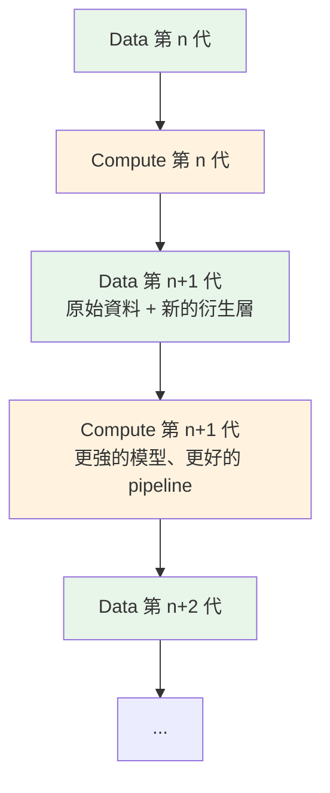

# Emergence 湧現：Data、Compute 與遞歸循環

---

## 📋 文檔目的

這是一份概念性文件，適合所有角色。讀完你應該能回答三個問題：

1. 什麼是**湧現 (emergence)**？為什麼它跟我們的工作有關？
2. **Data 與 Compute 有什麼本質上的不同**？
3. 為什麼我們說「**data 需要留下來**」——即使現在還不知道要拿它做什麼？

---

## 1. 什麼是湧現 (Emergence)

**湧現**：整體展現出「任何單一部件都不具備」的性質。你無法在部件裡找到它，它存在於部件之間的**模式**裡。

| 部件（各自都不懂） | 整體（湧現出的東西） |
|---|---|
| 單隻螞蟻 | 蟻群的築巢、覓食路徑、「決策」 |
| 單顆神經元 | 思想、意識 |
| 單個像素 | 一張人臉 |
| 單筆產品紀錄 | 市場趨勢、品牌策略、成分流行週期 |

最後一列就是我們的日常：資料庫裡的**一筆**產品資料，只是一列欄位；13 萬筆放在一起，市場的結構才「浮現」出來。洞察不在任何一筆資料裡——它湧現於資料之間。

---

## 2. 三個有用的想法

**意義如何從無意義的基底中湧現**——三個概念對我們特別有用：

### 2.1 層次 (Levels of Description)

「Aunt Hillary」是一隻會思考的蟻丘：每隻螞蟻什麼都不懂，但蟻丘作為整體能對話、有個性。重點是——**描述螞蟻的語言，跟描述蟻丘的語言，是兩套語言**。你在錯誤的層次上提問，就得不到答案。

對應到我們：
- 「這筆 Keepa 紀錄的 ASIN 是什麼」——資料層的問題
- 「維他命 D 市場過去兩年在漲還是跌」——湧現層的問題

兩個層次都真實，但工具不同：前者用 SQL 查一筆，後者需要整批資料加上統計與分析。**理解系統，先選對層次。**

但我們要做的不只如此。湧現層之上還有更多層——趨勢之上有結構，結構之上有策略——而**更高的層次，只能從下面的層次長出來**。如果只是 top-down 地帶著需求提問，卻沒有 bottom-up 地把底層一層層建實，那麼無論問題問得多漂亮，永遠只會得到**似是而非的答案**：聽起來像洞察，底下卻沒有任何一層真正撐住它。

這件事在 LLM 的世代尤其危險。LLM 讓「為了需求提問」變得毫無成本——你問，它答，答案流暢、自信、立即可得。但如果底層沒有你自己一層層建立起來的資料與結構，那個答案只是**多巴胺刺激，而不是 enlightenment**：你得到的是「被回答的感覺」，不是理解。真正的湧現無法靠提問召喚，只能從紮實的底層長出來。

### 2.2 Strange Loop（怪圈）

一個層次結構，走著走著**繞回自己的起點**——艾雪的《畫手》（兩隻手互相畫出對方）、哥德爾的自指語句。

我們的 pipeline 就是一個 Strange Loop：

**系統的輸出變成自己的輸入**。AlchemyMind 的分析結果回存 Vault，成為下一輪處理的一部分。每繞一圈，資料層就比上一圈更豐富——這就是「資料煉金術的循環之旅」。

### 2.3 意義從形式中湧現

符號本身沒有意義，意義存在於符號之間的**同構模式**。資料庫裡的一列只是位元；當 UPC 把 DSLD、Keepa、Shopify 三個來源的紀錄**串起來**，「同一個產品在三個世界的樣貌」這個意義才存在。意義不在任何一筆資料裡，在關聯裡。

---

## 3. Data 與 Compute 的本質差異

這是本文最重要的一節。

| | **Data** | **Compute** |
|---|---|---|
| 本質 | **狀態**（某時刻世界的快照） | **過程**（對狀態的轉換） |
| 時間性 | 帶時間戳，**錯過就永遠沒有** | 隨時可以重跑 |
| 替換性 | 不可替換 | 可以**整代替換**（換模型、重寫 pipeline） |
| 趨勢 | 只會累積、隨時間增值 | 越來越便宜、越來越強 |
| 犯錯的代價 | 丟了 = 永久損失 | 錯了 = 重跑一次 |

幾個具體例子：

- **歷史價格**：Keepa 上某產品 2024 年的價格波動，今天不存，明天就沒有任何 compute 能把它變出來。
- **下架產品**：產品下架後頁面消失。當初爬下來的紀錄，是它存在過的唯一證據。
- **LLM 分析**：TheWeaver 用今天的模型生成 10 個 Knowledge Realms 的分析——這是 compute 的產物。兩年後用更強的模型**重新分析同一批原始資料**，會得到更好的結果。前提：原始資料還在。

> **The Bitter Lesson 的推論**：Sutton 說，長期而言「更多算力的通用方法」總是贏。換句話說——**compute 會自己變強，你不用替它操心；你唯一守得住的湧現資本，是 data。**

---

## 4. 我們遞歸的是 Data + Compute 的 Loop

把時間軸拉開，LuminNexus 的運作是這樣一個遞歸：

注意兩條軸的不同命運：

- **Compute 軸**：每一代都可以被下一代**完全取代**。舊的 OCR 換成新的 VLM、舊的分類規則換成 LLM——沒有人懷念上一代的 compute。
- **Data 軸**：每一代都**包含**上一代。原始資料永遠在底層，衍生層一層層疊上去。

對應到實際系統：AtlasVault 負責「留」（Vault 是 Single Source of Truth），AlchemyMind 負責「算」（TheRefinery、TheWeaver、TheDistiller 都是可重跑的 compute），結果回存後由 PrismaVision 呈現。詳見 [projects/01_data-flow.md](../projects/01_data-flow.md)。

---

## 5. Data 是唯一的蛻殼 (Molt)

生物蛻皮：生物體不斷成長、蛻下舊殼。**Compute 是那個會成長蛻變的生物體**——每一代都比上一代強，也毫不留情地拋棄上一代。

**Data 是蛻下來的殼**：每一輪循環留下的、不會再改變的紀錄。它看起來是死的，但它是——

1. 這個循環**曾經發生過**的唯一證據；
2. 未來更強的 compute 回頭重新處理時，**湧現出新東西的唯一基質**。

今天的模型從一批 OCR 文字裡讀不出的東西，不代表資料裡沒有——只代表**今天的 compute 還不夠強**。Factum 保留原始圖片與 OCR 輸出，正是為了讓未來的 VLM 能重新解析出今天解析不出的欄位。湧現需要基底；丟掉資料，就是丟掉未來湧現的可能性本身。

還有一個推論，跟「留下來」同樣重要：**你沒蒐集的東西，永遠不會湧現。** 蛻殼只能保存你曾經活過的形狀——今天決定不爬的欄位、不留的快照，就是永久放棄了那個方向的未來。儲存很便宜；**蒐集的邊界，才是真正的戰略決定。**

> **一句話**：Compute 決定你今天能看見什麼；Data 決定你未來還有沒有機會看見更多。

---

## 6. 湧現不保證是真的

資料夠多的時候，模式**必然**出現——包括假的。雜訊會湧現出看似有意義的相關性，而人腦天生會替任何模式編故事。讀完本文的你，很快就會開始在資料裡「看見趨勢」；請同時記住：**湧現出的模式，必須經過驗證才算數。**

看見一個模式時，先問三個問題：

1. **換一批資料還在嗎？**（out-of-sample：只在這批資料裡成立的模式，多半是雜訊）
2. **有沒有更無聊的解釋？**（抽樣偏差、季節性、爬蟲行為改變、欄位定義變更）
3. **效應大小值得行動嗎？**（統計上顯著 ≠ 商業上重要）

這正是 **TheArgus 存在的理由**：異常檢測是這個系統的免疫系統，它的工作就是攔下那些「看起來像洞察、其實是資料品質問題」的假湧現。架構裡早已內建了這個答案——湧現層的每一個發現，都要先過免疫系統這一關。

---

## 7. 對新人的實務守則

這套哲學已經體現在系統的目錄設計裡（以 [Factum](../projects/alchemymind/factum.md) 為例）：

| 目錄 | 可變性 | 對應概念 |
|------|--------|----------|
| `data/` | **只讀** | 原始 data——蛻殼，永不修改 |
| `vault/` | 不變 | 第一層衍生（圖片、OCR 輸出），保留供重算 |
| `working/` | 迭代 | compute 的產物，可以隨時砍掉重跑 |

日常判斷準則：

1. **丟棄任何東西之前先問**：這是 data 還是 compute 的產物？**可以重算出來的才可以丟**；帶時間戳、來自外部世界的，永遠留。
2. **Pipeline 設計成可重跑**：determinism（相同輸入 → 相同輸出）是 compute 側的美德，因為它讓「整代替換」變得安全。
3. **裸資料不是資產**：沒有 lineage、沒有時間戳、沒有 schema 說明的資料，未來的 compute 讀不懂——那不是蛻殼，是垃圾。「留下來」必須連同 context（來源、時間、版本、欄位意義）一起留。
4. **標記 inferred 產物的來源版本**：LLM 產物（如 TheWeaver 的分析）回存 Vault 時必須帶上模型版本——它是 inferred data（見 [ai-data-terminology.md](./ai-data-terminology.md)），注定被更強的下一代 compute 整批取代；不標版本，未來就不知道哪些該重算。
5. **不要用今天的需求評估資料的價值**：今天用不到 ≠ 未來湧現不出東西。儲存很便宜，錯過很昂貴。

---

## 延伸閱讀

- **Wei et al., "Emergent Abilities of Large Language Models" (2022)** — LLM 能力隨規模「突現」的正方論述。
- **Schaeffer et al., "Are Emergent Abilities of Large Language Models a Mirage?" (2023)** — 反方：湧現可能是度量方式造成的假象。兩篇對照著讀。
- **Sutton, "The Bitter Lesson" (2019)** — compute 長期必勝的經典短文；本文第 3 節的推論來自於此。

## 相關文檔

- [compute-state-context.md](./compute-state-context.md) - 系列第二篇：Stateless 設計與 Context 的本質（單次計算的視角）
- [tension-value-perspective.md](./tension-value-perspective.md) - 系列第三篇：張力——不同角度的 Value（視角）
- [isomorphism-projection.md](./isomorphism-projection.md) - 系列第四篇（骨架）：§2.3 同構承載意義的展開
- [ai-data-terminology.md](./ai-data-terminology.md) - Derived vs Inferred：衍生層的兩種性質
- [03_data-engineering.md](./03_data-engineering.md) - ETL 與資料處理實務
- [../projects/01_data-flow.md](../projects/01_data-flow.md) - LuminNexus 資料循環全貌
- [../projects/alchemymind/factum.md](../projects/alchemymind/factum.md) - 目錄可變性設計的實例

---

## 📝 文檔維護

### 版本歷史

| 版本 | 日期 | 作者 | 變更說明 |
|------|------|------|----------|
| 1.0 | 2026-07-04 | maple | 初版建立 |

---

**文檔結束**
