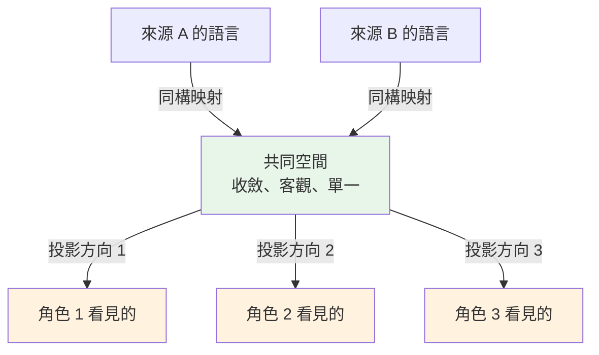

# Isomorphism 與 Projection：可比較的前提，與視角的代價

---

這是概念基礎系列的第四篇，性質跟前三篇不同：[時間](./emergence-data-compute.md)、[當下](./compute-state-context.md)、[視角](./tension-value-perspective.md)是三段敘事，這一篇是它們**共用的骨架**——三篇偷偷用掉的兩個數學概念，在這裡明說。

前半段只有直覺，一條公式都沒有；後半段給要動手的人。

---

## 0. 兩句話活在不同的宇宙

看兩句真實世界會出現的話：

> **KOL／科學端**：「甘胺酸鎂縮短入睡時間、提升深睡比例——這是有隨機對照試驗支持的。」
> **產品頁**：「每份含甘胺酸鎂 200mg，幫助夜間放鬆，支持良好的睡眠習慣。」

同一顆成分、同一個訴求方向。但第一句在講**因果**（強、可證偽、帶實證），第二句只敢講**成分與氛圍**（弱、被法規修剪過的措辭）。

人眼看得出「這兩句有微妙的落差」。**系統看不出來**——因為這兩句話的型別不同，放在一起沒辦法運算。它們活在不同的宇宙。

要讓它們可比較，需要本篇的兩個概念：先用**同構**把它們拉進同一個空間，再用**投影**理解為什麼不同的人看同一個落差會看到不同的東西。

---

## 1. Isomorphism 同構：保結構的對應

**同構**：兩個系統表面完全不同，但**內部關係的結構一一對應**。

樂譜和演奏是兩種完全不同的物理存在——紙上的墨跡 vs 空氣的振動。但它們同構：譜上音符的高低對應聲音的頻率、前後對應時間、疊放對應和聲。**關係的形狀在兩邊一模一樣**。所以你能照譜演奏、能聽音記譜——在兩個世界之間來回翻譯而不失真。

關鍵定理（白話版）：

> **同構是「可比較」的前提。**
> 不同構的東西放在一起，只能吵架，不能運算。

落地到我們的系統，同構無所不在：

- **UPC 串接**：DSLD 的一筆與 Keepa 的一筆表面毫無關係，但 UPC 揭露了它們是同一產品在兩個表象系統裡的對應——你不是「建立」了連結，是**發現**了本來就存在的同構。
- **Identity Resolution**（TheDistiller）：整個子系統的工作就是在多來源之間建立同構映射。
- **開場的兩句話**：KOL 語言和產品頁語言要可比較，唯一的路是把兩邊都**保結構地**翻譯進同一個表示空間——誰在說（主詞）、說什麼關係（謂詞）、對什麼對象（受詞），三個槽位各自對到同一套標準名。

「保結構」三個字是全部的重量所在：翻譯過去之後，原本的關係必須還在。只把單字翻過去、關係翻丟了，那不是同構，是假翻譯——後面第 4 節會回來講這個坑。

---

## 2. Projection 投影：降維的代價與自由

拿一個立體物件打光，牆上出現平面的影子。這就是**投影**：高維的東西，落到低維的面上。

兩件事同時成立：

**投影必然丟資訊。** 影子永遠比物件少一個維度。從影子你無法完整重建物件——丟掉的那個維度，在影子的世界裡不存在。

**投影方向是自由的。** 換一個打光的方向，同一個物件投出完全不同的影子——差異可以大到讓人不相信是同一個物件。有一個著名的封面設計：一塊精心雕過的立體木頭，從三個方向打光，牆上投出三個**不同的字母**。三個影子都是真的，三個影子都不是那塊木頭。

落地：

- **13 維的資料 → 一張報表**，就是一次投影。任何報表都是影子。
- **選 Dimension = 選投影軸**。MDFO 讓提問者自選 Measure × Dimension，就是把打光的方向交給提問者。
- **[Tension 篇](./tension-value-perspective.md)的五種 B 端角色**——原料商、品牌商、OEM/ODM、學術端、監管端——就是五個不同的打光方向。同一個市場，五個影子。

---

## 3. 兩個方向，合成整個系統

把兩個概念放在一起，會發現它們的方向互補：

- **同構橫著走**：跨系統、保結構，讓多來源變得**可通約**。這是 AtlasVault、TheDistiller、跨語言宣稱對齊在做的事。
- **投影往下走**：降維、取視角，必有損失但各取所需。這是 MDFO、每種角色的權重在做的事。



先同構、後投影——順序不能反。**沒有同構就投影，是把不可比的東西硬疊在一起取影子；有同構不投影，是把 13 維的物件原封不動丟給只能看 2 維的人。**

而這正是「事實單一、價值多元」的幾何版本：

> 同構空間裡的東西**收斂**——那是事實，market 的 truth，一張圖。
> 每個角色的投影**不收斂**——那是價值，每個 position 自己的影子。
> 前者存進系統，後者算給各自的人看。**存事實，不存影子。**

寫成全篇第一條、也是前半段唯一一條公式：

```text
張力 = w · F
```

F 是共同空間裡客觀的「力」（一個多維向量），w 是你的立場權重（你在乎什麼），內積之後得到你感受到的張力。**同一個 F，不同的 w，不同的張力**——第 5 節把這條展開。

---

## 4. 兩個經典錯誤

### 4.1 假同構：「像」不等於「同」

最誘人的捷徑：兩句話的語意向量很接近（embedding 相似），就當它們在講同一件事。錯——**相似度量的是「語氣像」，同構要求的是「指稱同」**。「幫助放鬆」和「降低皮質醇」語氣完全不像，卻可能指向同一個 outcome；「支持免疫力」和「支持專注力」語氣極像，指稱完全不同。

相似可以當**線索**（便宜的預聚類），但判定「是不是同一個東西」需要真正讀懂命題的裁決。把線索當判定，你的共同空間會充滿假對齊——之後所有運算都建立在流沙上。

### 4.2 把影子當物件

拿著自己的投影，跟別人的投影吵「誰才是真的」——雙方都忘了自己手上是影子。一份報表、一個 KPI、一個角色的市場觀，都是某個方向的投影。它們可以都是真的，同時都不是物件本身。

遇到兩個「互相矛盾」的報告，先問的不是誰對誰錯，是：**這兩個影子是從哪兩個方向打的光？** 多數矛盾在這一問之後會變成互補。

---

## 5. 給要動手的人：把直覺變成代數

前面全是直覺。這一節把它們寫成可以實作的形狀——不需要的讀者可以直接跳到第 6 節。

### 5.1 同構的正式條件

一個映射 `f: A → B` 是保結構的，意思是：

```text
若 a₁ 與 a₂ 在 A 中有關係 R，則 f(a₁) 與 f(a₂) 在 B 中有對應關係 R'
```

落到宣稱對齊的場景：每條宣稱是一個三元組 `S ─[P, valence]→ O`（主詞—謂詞—受詞），兩個來源要投進同一個空間 Σ，**三個槽位各自都要對齊**，缺一不可：

1. **S 對到同一 canonical entity space**——「甘胺酸鎂」「magnesium glycinate」「Mg-glycinate 200mg」是同一個實體
2. **O 對到同一 canonical outcome space**——「深睡比例」「放鬆」「睡眠品質」要能裁決是否同指稱
3. **P 對到同一 predicate enum**——efficacy / mechanism / safety / composition… 是兩邊共用的一組維度

任何一個槽位沒對齊，兩邊落進 Σ 也只是住在同一棟樓的陌生人。

### 5.2 力是向量，不是純量

對一組對齊的 (S, O)，兩個來源之間的「力」是**逐維度**的：

```text
F = ⟨ 每個 predicate 維度上的：Δvalence, Δ在場, Δevidence ⟩
```

例如：科學端在 efficacy 維度上是 pro 且有實證，產品頁在 efficacy 維度上**缺席**、只在 composition 維度上 pro——這個「錯位」本身就是 F 的一個分量。**永遠不要把 F 塌成一個「強度分數」**：塌掉的那一刻，你就把多維的力壓成了一維，等於替所有使用者預選了投影方向。

### 5.3 線性投影與它的盲區

某個立場（position）感受到的張力，是用自己的權重向量對力做內積：

```text
T_position = w_position · F = Σᵢ wᵢ Fᵢ
```

三個性質，各對應一件工程上的實事：

1. **線性**——權重加倍、張力加倍；兩個力疊加、張力疊加。所以不同角色的視圖可以用同一份 F 便宜地算出來，不用為每個角色維護一份資料。
2. **降維**——多維的 F 進去，一個數出來。這就是「報表」的數學本質。
3. **盲區（null space）**——凡是與 w **正交**的分量，內積之後全部歸零。翻成白話：**你不加權的東西，你就看不見**。而且這種看不見是結構性的——不是資料缺席，是你的視角在數學上注定看不見它。

第三條值得多停三秒。[Tension 篇](./tension-value-perspective.md)說「被消除的視角不會抗議，它只是安靜地消失」——這裡是那句話的代數形式：**消失發生在內積的那一瞬間**。每一個 w 都自帶一整個看不見的子空間；唯一能看見全部 F 的，是不做投影、直接持有向量的那一方。這就是平台的位置。

---

## 6. 守則

1. **比較之前，先問「同構嗎」**：兩個數字、兩份報告、兩種說法，放在一起之前先確認它們的槽位對齊過。沒對齊就比較，結論再漂亮都是噪音。
2. **看報告時，先問「這是哪個方向的投影、丟掉了什麼」**：每個影子都有它的 null space。
3. **存向量，不存純量**：塌維的動作留給查詢的那一刻、由查詢者的 w 決定——不要在資料層替所有人預選視角。
4. **相似是線索，裁決才是判定**：embedding 用來省錢，不用來拍板。

---

## 相關文檔

- [emergence-data-compute.md](./emergence-data-compute.md) - 系列第一篇：§2.3「意義從形式中湧現」——同構承載意義的出處
- [compute-state-context.md](./compute-state-context.md) - 系列第二篇：context = 從 state 切一片，也是一次投影
- [tension-value-perspective.md](./tension-value-perspective.md) - 系列第三篇：本篇是它的幾何化——力收斂、張力不收斂
- [../projects/alchemymind/thedistiller.md](../projects/alchemymind/thedistiller.md) - Identity Resolution：同構映射的實作

---

## 📝 文檔維護

### 版本歷史

| 版本 | 日期 | 作者 | 變更說明 |
|------|------|------|----------|
| 1.0 | 2026-07-05 | maple | 初版建立 |

---

**文檔結束**
