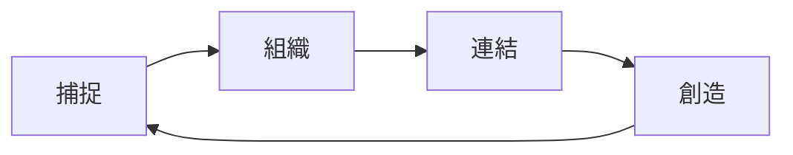
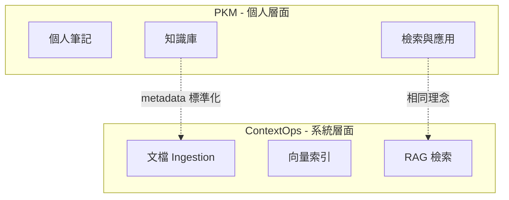

# Knowledge Management: PKM 與 Frontmatter

本文是 [ContextOps](contextops-discipline.md) 的延伸閱讀，介紹兩個相關概念：

1. **PKM (Personal Knowledge Management)** - 個人知識管理的方法論
2. **Frontmatter** - 我們用於文檔治理的 metadata 格式

---

## 1. PKM - Personal Knowledge Management

### 什麼是 PKM

PKM (Personal Knowledge Management) 是一套管理個人知識的方法論，核心目標是：

- **捕捉 (Capture)** - 記錄想法、筆記、靈感
- **組織 (Organize)** - 建立結構，讓知識可被檢索
- **連結 (Connect)** - 發現知識之間的關聯
- **創造 (Create)** - 將知識轉化為產出



### 為什麼 PKM 重要

在資訊爆炸的時代，我們每天接觸大量資訊，但能夠真正內化、應用的知識卻很有限。PKM 幫助我們：

| 問題 | PKM 解決方案 |
|------|-------------|
| 資訊過載 | 選擇性捕捉，過濾雜訊 |
| 忘記學過什麼 | 建立可檢索的知識庫 |
| 知識孤島 | 透過連結發現關聯 |
| 重複學習 | 累積式知識建構 |

### PKM 與 ContextOps 的關係

ContextOps 關注的是 LLM 的 context pipeline 治理，而 PKM 是個人層面的知識管理。兩者有共同的核心理念：



**共同理念**：

- **結構化** - 知識需要結構才能被有效檢索
- **Metadata 驅動** - 標籤、分類、屬性是檢索的關鍵
- **品質優先** - 垃圾進、垃圾出 (Garbage In, Garbage Out)

當你的個人知識庫有良好的 PKM 實踐（如：一致的命名、完整的 metadata），它就能更好地整合到 ContextOps 系統中，成為 RAG pipeline 的優質 context 來源。

---

## 2. Frontmatter

### 什麼是 Frontmatter

Frontmatter 是放在 Markdown 文件**開頭**的 YAML 區塊，用於定義文件的 metadata：

```yaml
---
title: "文件標題"
type: guide
status: active
created: 2025-12-18
author: maple
tags:
  - tag1
  - tag2
---

# 這裡開始是正文...
```

Frontmatter 由三個連字號 `---` 包圍，內容遵循 YAML 格式。

### 為什麼使用 Frontmatter

| 用途 | 說明 |
|------|------|
| **機器可讀** | 自動化工具可以解析、索引、搜尋 |
| **人類可讀** | 一眼看出文件的類型、狀態、作者 |
| **一致性** | 團隊遵循相同標準，減少混亂 |
| **治理** | 支援 Stillflow 等文檔治理工具 |

### 我們的 Frontmatter 規範

本專案使用 [Stillflow](https://github.com/pgylee/LuminNexus-Stillflow) 進行文檔治理，所有 Markdown 文件必須包含 frontmatter。

#### 必填欄位

```yaml
---
title: "文件標題"           # 必填 - 文件的顯示名稱
type: guide                 # 必填 - 文件類型
status: active              # 必填 - 文件狀態
created: 2025-12-18         # 必填 - 建立日期 (YYYY-MM-DD)
---
```

#### 常用選填欄位

```yaml
---
author: maple               # 作者 (maple, leana, yijou14)
updated: 2025-12-18         # 最後更新日期
version: "1.0"              # 版本號
project: LearningMap        # 所屬專案
tags:                       # 標籤列表
  - onboarding
  - testing
summary: |                  # 摘要 (多行文字)
  這是文件的簡短描述...
---
```

### 欄位值說明

#### type (文件類型)

| 值 | 說明 | 範例 |
|----|------|------|
| `guide` | 教學指南 | claude-code-tips.md |
| `reference` | 參考文檔 | contextops-discipline.md |
| `outline` | 大綱 | 00_outline.md |
| `topic` | 主題文章 | 02_unix-linux-basics.md |
| `spec` | 規格文檔 | - |
| `overview` | 概覽 | - |
| `policy` | 政策文件 | - |

#### status (文件狀態)

| 值 | 說明 |
|----|------|
| `active` | 活躍使用中，持續更新 |
| `stable` | 穩定版本，很少變動 |
| `deprecated` | 已棄用，保留供參考 |

### Stillflow CLI 驗證

使用 `muster lint` 驗證 frontmatter 是否符合規範：

```bash
# 驗證整個專案
muster lint .

# 驗證特定目錄
muster lint general/

# 驗證單一文件
muster lint general/knowledge-management.md
```

---

## 總結

| 概念 | 層面 | 核心目的 |
|------|------|----------|
| PKM | 個人 | 管理個人知識，提升學習效率 |
| Frontmatter | 文件 | 提供 metadata，支援自動化治理 |
| ContextOps | 系統 | 治理 LLM context pipeline |

三者環環相扣：良好的 PKM 習慣產出結構化的知識，Frontmatter 讓這些知識可被機器理解，ContextOps 則將這些知識整合到 AI 系統中。

---

## 延伸閱讀

- [ContextOps: The Hidden Discipline](contextops-discipline.md) - ContextOps 方法論
- [Stillflow Runbook](https://github.com/mapleelpam/LuminNexus-Stillflow/blob/main/projects/Stillflow/crystallized/runbook.md) - Stillflow 使用指南
