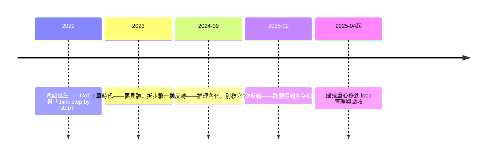

# 範式轉移：從描述任務到許願

> 📌 **本篇自己也有保存期限**：寫於 2026-07，描述的是當時的範式。
> 如果你在下一次反轉之後讀到它，請帶著考古的眼光——這正是本篇第 5 節想教你的事。

---

## 1. 兩個時代的「好 prompt」

**2023 年的好 prompt**（教科書會給你滿分）：

```text
你是一位資深資料工程師。請嚴格按照以下步驟處理：
步驟 1：讀取 prices.csv，注意編碼為 UTF-8
步驟 2：用 pandas 移除空值列，規則如下……
步驟 3：將日期欄轉為 ISO 格式
步驟 4：……
請一步一步思考（think step by step），並以下列格式輸出：……
範例輸入：……範例輸出：……
```

**2026 年的好 prompt**：

```text
把這批價格資料清成可以進 Vault 的樣子。
邊界：raw 檔案只讀，不准動。
驗收：清完跑 validation，把輸出貼給我看。
```

第一種寫法在今天**不只是過時，是有害的**：你逐步指定的流程，把模型銬在你的計畫上——而它自己規劃的多半比你的好。三年之內，「把任務描述完整」從最佳實踐變成了反模式。

這中間發生了什麼？

---

## 2. 建議是怎麼反轉的：兩次反轉



**舊範式（2022–2024 中）：把模型當外包工人，工單寫得越細越好。**
2022 年學界給了兩個咒語——Chain-of-Thought（用範例教模型推理）與「Let's think step by step」。2023 年各家 prompt engineering 指南把它們寫進正典：要具體、拆解任務、給 few-shot 範例、指定步驟與格式。這一切的潛台詞是：**模型不會想也不會規劃，所以你要替它想、替它規劃。**

**第一次反轉（2024-09-12）：別再指揮它怎麼想。**
o1 發布，官方指南第一次公開叫大家**停止**遵守舊最佳實踐：prompt 保持簡單、不要用 CoT 提示、先試 zero-shot——因為推理已經內化到模型裡，你外加的思考步驟不但多餘，還會**傷害**表現。鷹架變成了天花板。

**第二次反轉（2025-02）：別再指揮它怎麼做。**
2025 年 2 月 2 日，Karpathy 發文描述一種新的寫程式方式——「fully give in to the vibes……forget that the code even exists」，並點出原因：「It's possible because the LLMs are getting too good.」**許願範式在這一天得到名字（vibe coding）**；三週後（2025-02-24）Claude Code 發布，它得到了介面。規劃與執行也內化了——這次搬進去的不是推理，是整個 agent loop。

**過渡期的化石（2025-04）**：當時官方的 agentic coding 最佳實踐還留著「be specific」的舊話，但重心已經完全轉移——context 管理、**verification with evidence**、計畫與執行分離。注意建議的主詞變了：從「怎麼**措辭**」變成「怎麼**管理 loop 與驗收**」。這就是範式已經換掉的證據。

如果要在牆上釘一個日期，釘 **2025 年 2 月**：同一個月裡，新範式得到了名字和介面。

---

## 3. 為什麼會反轉

**量化的原因**：METR 的追蹤顯示，agent 能自主完成的任務長度（以人類專業者所需時間計）**每 7 個月翻倍**，2024–2025 年更加速到約 4 個月——從 2019 年的 4 秒，到 2026 年的 16 小時以上。「許願」之所以從笑話變成工作方式，是因為自主時程跨過了「有意義的任務」的門檻——而且還在指數成長。

**概念上的原因**，兩篇前文早就鋪好了：

- [emergence-data-compute.md](./emergence-data-compute.md) 第 3 節：**compute 會自己變強，你不用替它操心。** 舊範式的工單，本質是用人力補 compute 的不足——compute 補上了，工單就從幫助變成阻礙。
- [compute-state-context.md](./compute-state-context.md)：你寫的步驟清單，是**把自己的思考鏈硬塞進對方的 re-entry 之門**。當門後的推理已經比你塞進去的好，你塞的每一步都是降級。

---

## 4. 許願不是不負責任

範式轉移最常見的誤讀：「所以我什麼都不用寫了」。錯——**描述的功夫沒有消失，是上移了**：從 how 移到 what 與 why。

一個負責任的願望有四個部分：

| 部分 | 說什麼 | 例子 |
|------|--------|------|
| **意圖 (what)** | 要達成什麼結果 | 「清成可以進 Vault 的樣子」 |
| **理由 (why)** | 為什麼要、給誰用 | 「下游 TheRefinery 要吃」 |
| **邊界 (constraints)** | 不能動什麼、預算多少 | 「raw 只讀」「別開超過十個查詢」 |
| **驗收 (acceptance)** | 怎樣算完成、要什麼證據 | 「validation 輸出貼給我」 |

願望的品質仍然決定結果的品質——只是「品質」的定義變了：不再是步驟寫得多細，而是**意圖多清楚、邊界多明確、驗收多可查**。

還有一條沒變、而且更重要了：**許願 ≠ 免驗收**。agent 的產出永遠 plausible——流暢、自信、格式完美——而 plausible 與 correct 的距離，要靠證據去量。這是 [emergence 篇](./emergence-data-compute.md)「多巴胺 vs enlightenment」的日常操作版，[know-your-unknowns.md](./know-your-unknowns.md) 展開了完整的方法論。

---

## 5. 範式轉移的代價：教科書會變成毒藥

範式轉移和普通的知識更新不同：普通更新讓舊教材**過時**（沒用但無害），範式轉移讓舊教材**有害**——2023 年的滿分技巧，今天會主動降低你的結果品質。這對文件庫是一個嚴肅的推論：

1. **文件要標注時代。** 本 repo 的 Claude Code 系列文件已加上時代註記——哪些建議屬於哪個範式，讀之前先看標注。
2. **舊範式的直覺會透過人傳承。** 比文件更難清除的是資深者的肌肉記憶——「我幫你把步驟拆好了」在舊範式是善意，在新範式是把對方（和 agent）銬在自己的計畫上。
3. **下一次反轉會再來。** 每 4–7 個月翻倍的曲線沒有停。今天的新範式就是明天的舊範式——所以本篇開頭給自己標了保存期限。你真正該學的不是「現在的正確做法」，而是**識別反轉的能力**：當官方指南開始叫你停止做以前的最佳實踐，範式正在換。

---

## 出處

- Karpathy 的 vibe coding 貼文（2025-02-02）：https://x.com/karpathy/status/1886192184808149383
- OpenAI o1 提示指南的反轉（2024-09）：https://www.vellum.ai/blog/how-to-prompt-the-openai-o1-model
- Claude Code 最佳實踐（2025-04，過渡期文件）：https://simonwillison.net/2025/Apr/19/claude-code-best-practices/
- METR〈Measuring AI Ability to Complete Long Tasks〉（2025-03）：https://metr.org/blog/2025-03-19-measuring-ai-ability-to-complete-long-tasks/

## 相關文檔

- [emergence-data-compute.md](./emergence-data-compute.md) - compute 會自己變強：反轉的概念根源
- [compute-state-context.md](./compute-state-context.md) - re-entry：步驟清單是塞進門裡的人類 CoT
- [claude-code-tips.md](./claude-code-tips.md) / [claude-code-cli-discussion.md](./claude-code-cli-discussion.md) - 工具層文件（見各篇時代標注）

---

## 📝 文檔維護

### 版本歷史

| 版本 | 日期 | 作者 | 變更說明 |
|------|------|------|----------|
| 1.0 | 2026-07-06 | maple | 初版建立 |

---

**文檔結束**
