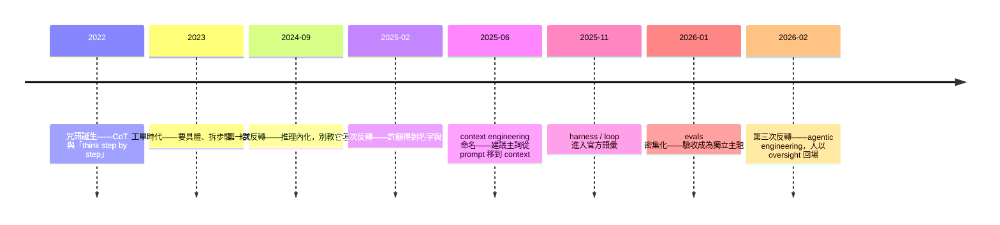

# 範式轉移：從描述任務到許願

> 📌 **本篇自己也有保存期限**：初版寫於 2026-07，2026-08 補入第三次反轉。
> 如果你在下一次反轉之後讀到它，請帶著考古的眼光——這正是本篇第 5 節想教你的事。
>
> 💡 初版只寫到兩次反轉，而第三次反轉在初版動筆前五個月就發生了（2026-02）。
> 本篇預言「下一次反轉會再來」，自己卻漏掉了已經來過的那次——這件事本身就是第 5 節的教材。

---

## 1. 兩個時代的「好 prompt」

**2023 年的好 prompt**（教科書會給你滿分）：

```text
你是一位資深資料工程師。請嚴格按照以下步驟處理：
步驟 1：讀取 prices.csv，注意編碼為 UTF-8
步驟 2：用 pandas 移除空值列，規則如下……
步驟 3：將日期欄轉為 ISO 格式
步驟 4：……
請一步一步思考（think step by step），並以下列格式輸出：……
範例輸入：……範例輸出：……
```

**2026 年的好 prompt**：

```text
把這批價格資料清成可以進 Vault 的樣子。
邊界：raw 檔案只讀，不准動。
驗收：清完跑 validation，把輸出貼給我看。
```

第一種寫法在今天**不只是過時，是有害的**：你逐步指定的流程，把模型銬在你的計畫上——而它自己規劃的多半比你的好。三年之內，「把任務描述完整」從最佳實踐變成了反模式。

（留意第二種寫法的最後一行。**「驗收」那一行在 2026 年之後不是禮貌，是必要**——理由見 §3 與 §4。）

這中間發生了什麼？

---

## 2. 建議是怎麼反轉的：三次反轉


```mermaid
timeline
    2022 : 咒語誕生——CoT 與「think step by step」
    2023 : 工單時代——要具體、拆步驟、給範例
    2024-09 : 第一次反轉——推理內化，別教它怎麼想
    2025-02 : 第二次反轉——許願得到名字與介面
    2025-06 : context engineering 命名——建議主詞從 prompt 移到 context
    2025-11 : harness / loop 進入官方語彙
    2026-01 : evals 密集化——驗收成為獨立主題
    2026-02 : 第三次反轉——agentic engineering，人以 oversight 回場
```

**舊範式（2022–2024 中）：把模型當外包工人，工單寫得越細越好。**
2022 年學界給了兩個咒語——Chain-of-Thought（用範例教模型推理）與「Let's think step by step」。2023 年各家 prompt engineering 指南把它們寫進正典：要具體、拆解任務、給 few-shot 範例、指定步驟與格式。這一切的潛台詞是：**模型不會想也不會規劃，所以你要替它想、替它規劃。**

**第一次反轉（2024-09-12）：別再指揮它怎麼想。**
o1 發布，官方指南第一次公開叫大家**停止**遵守舊最佳實踐：prompt 保持簡單、不要用 CoT 提示、先試 zero-shot——因為推理已經內化到模型裡，你外加的思考步驟不但多餘，還會**傷害**表現。鷹架變成了天花板。

**第二次反轉（2025-02）：別再指揮它怎麼做。**
2025 年 2 月 2 日，Karpathy 發文描述一種新的寫程式方式——「fully give in to the vibes……forget that the code even exists」，並點出原因：「It's possible because the LLMs are getting too good.」**許願範式在這一天得到名字（vibe coding）**；三週後（2025-02-24）Claude Code 發布，它得到了介面。規劃與執行也內化了——這次搬進去的不是推理，是整個 agent loop。

**過渡期的化石（2025-04）**：Anthropic 的《Claude Code: Best practices for agentic coding》（2025-04-18）是一份標準的過渡期文件——**新舊同體**。新的一半是 explore-plan-code-commit、TDD、「course correct early and often」，已經是 loop 的雛形；舊的一半是它同時在教 extended thinking 的觸發詞（`think` 4,000 → `think hard` 10,000 → `ultrathink` 31,999 tokens 的預算階梯），那是**指定模型怎麼思考**——按第一次反轉的判準，這正是該淘汰的東西。

> ⚠️ **別把 2025-04 當成「重心已轉向 loop 與驗收」的證據**（本篇 v1.0 曾這樣寫，是錯的）。那時只是萌芽。真正的重心轉移是後面一條清楚的曲線：
>
> | 日期 | 事件 | 意義 |
> |---|---|---|
> | 2025-06-18 | Tobi Lütke 命名 context engineering，Karpathy 同月背書 | 建議主詞從 prompt 移到 **context** |
> | 2025-09-29 | Anthropic《Effective context engineering for AI agents》 | 官方正式化 |
> | 2025-10-16 | 《Equipping agents for the real world with Agent Skills》 | 作業說明書化 |
> | **2025-11-26** | **《Effective harnesses for long-running agents》** | **harness / loop 進入官方語彙** |
> | **2026-01-09** | **《Demystifying evals for AI agents》**（此後 01-21、02-05、03-06 連發） | **驗收成為獨立主題** |
> | 2026-07-22 | 《Building verification loops in Claude Code with skills》 | 驗證迴路變成可打包的技能 |
>
> 也就是：**loop 是 2025-11 起，驗收是 2026-01 起**，都比 2025-04 晚了半年到一年。

**第三次反轉（2026-02）：別以為許完願就沒你的事。**
距離創造「vibe coding」整整一年後，Karpathy 在 X 上宣告這個詞已經 passé，並給新階段起名 **agentic engineering**：

> "Today (1 year later), programming via LLM agents is increasingly becoming a default workflow for professionals, except with **more oversight and scrutiny**."
>
> "'Agentic' because the new default is that you are not writing the code directly 99% of the time. You are **orchestrating agents** who do and acting as **oversight**."

**注意這次的方向和前兩次相反。** 前兩次都是人退出（別教它怎麼想 → 別教它怎麼做），第三次是**人以另一種形式回場**——不是回去寫步驟，而是規格、編排、監督、稽核。Anthropic 的《2026 Agentic Coding Trends Report》講的是同一件事，八個轉變裡有三個直接打在這裡：**orchestration over implementation**（工程師從寫程式轉為協調 agent 系統）、**verification as core skill**（品質評估成為核心工程技能）、**intent as foundational**（結構化規格取代非正式 prompt，成為可執行的 artifact）。

如果要在牆上釘日期，釘 **2025 年 2 月**與 **2026 年 2 月**：前者是新範式得到名字和介面的月份，後者是它被宣告長大的月份。

---

## 3. 為什麼會反轉

**量化的原因**：METR 的追蹤顯示，agent 能自主完成的任務長度（以人類專業者所需時間計）**每 7 個月翻倍**，2024–2025 年更加速到約 4 個月——從 2019 年的 4 秒，到 2026 年的 16 小時以上。「許願」之所以從笑話變成工作方式，是因為自主時程跨過了「有意義的任務」的門檻——而且還在指數成長。

**概念上的原因**，兩篇前文早就鋪好了：

- [emergence-data-compute.md](./emergence-data-compute.md) 第 3 節：**compute 會自己變強，你不用替它操心。** 舊範式的工單，本質是用人力補 compute 的不足——compute 補上了，工單就從幫助變成阻礙。
- [compute-state-context.md](./compute-state-context.md)：你寫的步驟清單，是**把自己的思考鏈硬塞進對方的 re-entry 之門**。當門後的推理已經比你塞進去的好，你塞的每一步都是降級。

**第三次反轉的原因不同：不是模型又變強了，是產量撞上了審查量。** 當 agent 能一次跑好幾小時、能並行成隊，產出的量超過人能逐行看完的量，瓶頸就從「寫得出來嗎」變成「你憑什麼相信它」。三個可量的訊號：

- **delegation gap**（Anthropic《2026 Agentic Coding Trends Report》）：開發者約 **60%** 的工作用 AI，但只有 **0–20%** 的任務能「完全委派」，其餘 **80–100%** 仍需主動監督。能力上去了，信任沒跟上——中間那段差距就是 oversight 要填的
- **驗證者是瓶頸**：2026 年「loop engineering / harness engineering」的核心命題是 **the verifier is the bottleneck, not the model**——生成器可以便宜地跑上千次，決定這些動作變成價值還是垃圾的是驗證器。所以**先寫驗證器，再放大生成器**
- 這也解釋了為什麼 evals 從 2026-01 起變成官方部落格的常駐主題：驗收不再是流程末端的一步，它本身變成要被工程化的東西

---

## 4. 許願不是不負責任

範式轉移最常見的誤讀：「所以我什麼都不用寫了」。錯——**描述的功夫沒有消失，是上移了**：從 how 移到 what 與 why。

一個負責任的願望有四個部分：

| 部分 | 說什麼 | 例子 |
|------|--------|------|
| **意圖 (what)** | 要達成什麼結果 | 「清成可以進 Vault 的樣子」 |
| **理由 (why)** | 為什麼要、給誰用 | 「下游 TheRefinery 要吃」 |
| **邊界 (constraints)** | 不能動什麼、預算多少 | 「raw 只讀」「別開超過十個查詢」 |
| **驗收 (acceptance)** | 怎樣算完成、要什麼證據 | 「validation 輸出貼給我」 |

願望的品質仍然決定結果的品質——只是「品質」的定義變了：不再是步驟寫得多細，而是**意圖多清楚、邊界多明確、驗收多可查**。

還有一條沒變、而且更重要了：**許願 ≠ 免驗收**。agent 的產出永遠 plausible——流暢、自信、格式完美——而 plausible 與 correct 的距離，要靠證據去量。這是 [emergence 篇](./emergence-data-compute.md)「多巴胺 vs enlightenment」的日常操作版，[know-your-unknowns.md](./know-your-unknowns.md) 展開了完整的方法論。

**第三次反轉之後：oversight 不是回去寫步驟。** 這是最容易走錯的一步——聽到「要監督、要稽核」就退回 2023 年的工單。兩者的差別在**你介入的是哪一格**：

| | 舊範式的介入 | agentic engineering 的 oversight |
|---|---|---|
| 介入什麼 | how（步驟、順序、格式） | what / why / 邊界 / 驗收證據 |
| 時機 | 事前把路線釘死 | 事前定規格與停止條件，事後查證據 |
| 失敗長相 | 模型被銬在你的劣質計畫上 | 你被淹沒在看不完的 diff 裡 |
| 補救 | 少寫步驟 | 把驗證做成機器能跑的東西（測試、lint、eval、hook） |

換句話說，四部分裡**沒有新增第五格**——第三次反轉只是把**驗收**那一格的權重推高，並要求它從「我等下看一眼」升級成**可自動重跑的檢查**。當工作規模化到你看不完時，驗收若還是人眼，它就是那個瓶頸（見 §3）。這一格怎麼工業化，見 [agent-work-forms.md](./agent-work-forms.md)。

---

## 5. 範式轉移的代價：教科書會變成毒藥

範式轉移和普通的知識更新不同：普通更新讓舊教材**過時**（沒用但無害），範式轉移讓舊教材**有害**——2023 年的滿分技巧，今天會主動降低你的結果品質。這對文件庫是一個嚴肅的推論：

1. **文件要標注時代。** 本 repo 的 Claude Code 系列文件已加上時代註記——哪些建議屬於哪個範式，讀之前先看標注。
2. **舊範式的直覺會透過人傳承。** 比文件更難清除的是資深者的肌肉記憶——「我幫你把步驟拆好了」在舊範式是善意，在新範式是把對方（和 agent）銬在自己的計畫上。
3. **下一次反轉會再來。** 每 4–7 個月翻倍的曲線沒有停。今天的新範式就是明天的舊範式——所以本篇開頭給自己標了保存期限。你真正該學的不是「現在的正確做法」，而是**識別反轉的能力**：當官方指南開始叫你停止做以前的最佳實踐，範式正在換。
4. **反轉不一定往同一個方向。** 前兩次都是「人再退一步」，很容易讓人外推成「以後只會更放手」——第三次反轉（2026-02）直接證偽了這個外推：人回場了，只是回在不同的格子（規格、編排、驗證）。**趨勢的方向不能靠前兩點連線去預測**，只能看當期的證據。
5. **這篇自己就是案例。** v1.0 寫於 2026-07，卻漏掉了 2026-02 的第三次反轉——寫的人（和幫他查的模型）都以為自己站在範式的最前沿，實際上落後了五個月。**你此刻讀到的版本也可能正處在同樣的位置。** 對付它的方法只有一個：讀到任何「現在的最佳實踐」，先去查它的出處日期，再去查那之後發生了什麼。

---

## 出處

**三次反轉的錨點**

- 第一次反轉｜OpenAI o1 提示指南（2024-09）：https://www.vellum.ai/blog/how-to-prompt-the-openai-o1-model
- 第二次反轉｜Karpathy 的 vibe coding 貼文（2025-02-02）：https://x.com/karpathy/status/1886192184808149383
- 第三次反轉｜Karpathy 宣告 vibe coding passé、提出 agentic engineering（2026-02）：
  - The New Stack〈Vibe coding is passé. Karpathy has a new name for the future of software.〉：https://thenewstack.io/vibe-coding-is-passe/
  - Forbes〈Is Vibe Coding Already Dead? Even Karpathy Is Moving On〉（2026-06-12）：https://www.forbes.com/sites/jodiecook/2026/06/12/is-vibe-coding-already-dead-even-karpathy-is-moving-on/
  - ⚠️ 本文引用的兩句 Karpathy 原話取自上列二手報導的一致轉引；**貼文本身的永久連結與確切日期尚未取得**，只確認到「2026 年 2 月」。要精確引用請自行核對原貼文

**建議重心的移轉（官方一手，依發文日期）**

- Claude Code: Best practices for agentic coding（2025-04-18，過渡期文件）：https://code.claude.com/docs/en/best-practices
  - 當期外部摘錄（可見它同時在教 `ultrathink` 觸發詞）：https://simonwillison.net/2025/Apr/19/claude-code-best-practices/
- Effective context engineering for AI agents（2025-09-29）：https://www.anthropic.com/engineering/effective-context-engineering-for-ai-agents
- Equipping agents for the real world with Agent Skills（2025-10-16）
- Effective harnesses for long-running agents（2025-11-26）
- Demystifying evals for AI agents（2026-01-09）：https://anthropic.com/engineering/demystifying-evals-for-ai-agents
- Building verification loops in Claude Code with skills（2026-07-22）：https://claude.com/blog/building-verification-loops-in-claude-code-with-skills
- 上列各篇的發文日期可在 Anthropic 工程部落格索引核對：https://anthropic.com/engineering

**量化依據**

- METR〈Measuring AI Ability to Complete Long Tasks〉（2025-03）：https://metr.org/blog/2025-03-19-measuring-ai-ability-to-complete-long-tasks/
- Anthropic〈2026 Agentic Coding Trends Report〉（delegation gap、八個轉變）：https://resources.anthropic.com/2026-agentic-coding-trends-report
- 「the verifier is the bottleneck」的 loop engineering 論述（二手整理）：https://www.aibuilderclub.com/blog/loop-engineering-anthropic-playbook

## 相關文檔

- [emergence-data-compute.md](./emergence-data-compute.md) - compute 會自己變強：反轉的概念根源
- [compute-state-context.md](./compute-state-context.md) - re-entry：步驟清單是塞進門裡的人類 CoT
- [clarification-wish-and-plan.md](./clarification-wish-and-plan.md) - 續篇：補上本篇「別寫步驟」挖出的洞——計畫換了作者，不是消失
- [know-your-unknowns.md](./know-your-unknowns.md) - 續篇：許願之後怎麼驗收
- [agent-work-forms.md](./agent-work-forms.md) - 實務層收頂：許願的工業化（Pairing / 委派 / 自主 Loop）
- [claude-code-tips.md](./claude-code-tips.md) / [claude-code-cli-discussion.md](./claude-code-cli-discussion.md) - 工具層文件（見各篇時代標注）

---

## 📝 文檔維護

### 版本歷史

| 版本 | 日期 | 作者 | 變更說明 |
|------|------|------|----------|
| 1.0 | 2026-07-06 | maple | 初版建立 |
| 1.1 | 2026-08-14 | maple | 查證後補入**第三次反轉**（2026-02 agentic engineering）並修正時間線錯誤：①「2025-04 起重心移到 loop 與驗收」是錯的——2025-04 的官方文件新舊同體（explore-plan-code-commit 與 `ultrathink` 觸發詞並存），loop 進官方語彙是 2025-11、驗收密集化是 2026-01，時間線補上 2025-06／2025-11／2026-01／2026-02 四格；② §2 新增第三次反轉與 Karpathy 原話、Anthropic《2026 Agentic Coding Trends Report》三個轉變；③ §3 補第三次反轉的成因（delegation gap、驗證者是瓶頸）——這次不是模型變強，是產量撞上審查量；④ §4 新增「oversight 不是回去寫步驟」對照表，釐清四部分沒有新增第五格，是驗收那格要能自動重跑；⑤ §5 新增第 4、5 點：反轉方向不能靠前兩點連線外推，以及本篇 v1.0 漏掉已發生五個月的反轉這件事本身即案例；⑥ 出處分組重整，標注各篇一手發文日期，並註記 Karpathy 2026-02 貼文的永久連結尚未取得 |

---

**文檔結束**
