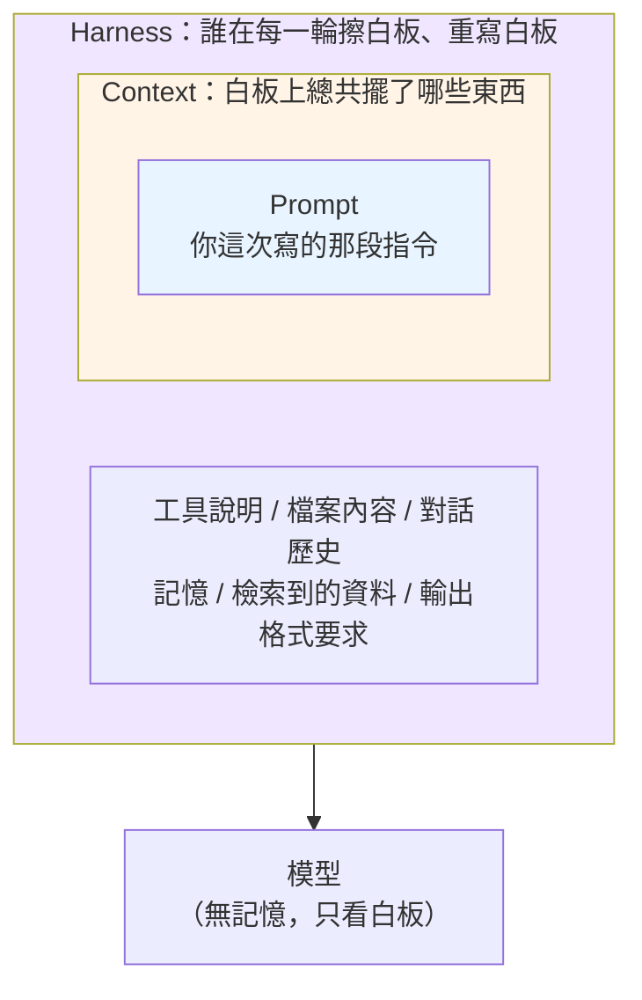
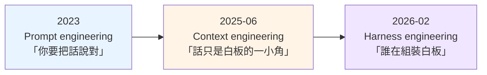

# 從 Prompt 到 Harness：與 AI 協作的三層工程

---

## 📋 文檔目的

你大概已經學過一堆技巧了：`CLAUDE.md` 怎麼寫、`/compact` 什麼時候按、subagent 為什麼要獨立 context、skill 怎麼做漸進載入、hook 怎麼掛。

**但很少有人告訴你這些技巧各自在解什麼問題。** 於是它們在腦子裡是一袋散裝的招式，遇到新狀況不知道該掏哪一個。

這篇給那個骨架。它不教任何新招式——它把你已經會的招式排進三個層次，讓你下次遇到問題時，先問「這是哪一層的問題」，再決定用哪一招。

> **怎麼讀**：§1 到 §2 是骨架，看完就有收穫。§3 是實務層（CLI 與 script 何時該固化），§4 用本 repo 當實例。§5 是誠實聲明——這套三層講法有多新、有什麼爭議，建議別跳過。

---

## 🎯 一句話總結

| 層 | 它管什麼 | 一句話 |
|---|---|---|
| **Prompt engineering** | 你寫給 AI 的那段指令 | **你怎麼說** |
| **Context engineering** | AI 回答前看到的一切資訊 | **它還看到什麼** |
| **Harness engineering** | 每一輪把上述一切組裝起來的那套機制 | **誰在做組裝這件事** |

**三者是包含關係，不是取代關係。** 新的沒有淘汰舊的，是把舊的裝進去了。

---

## 1. 三層是包含關係

### 1.1 從白板說起

先回到 [compute-state-context.md](./compute-state-context.md) 建立的世界觀：**LLM 是無記憶的**。它不會「記得」你上一句說了什麼——每一次呼叫，都要有人把該看的東西重新擺到它面前。

把那個「面前」想成一塊白板。模型每次醒來，只看得到白板上此刻寫著的東西，然後回答，然後又忘光。

三層工程就是在問白板的三個不同問題：



- **Prompt** 是白板上的一小塊——你這次打的字。
- **Context** 是整塊白板——你打的字，加上系統指令、對話歷史、工具說明、檔案內容、檢索到的資料。
- **Harness** 是那個**每一輪負責擦掉、重寫、決定擺什麼**的機制。你按 Enter 之後、模型醒來之前，有一整套程式在做這件事。

### 1.2 為什麼說「你感覺它記得」是假的

[compute-state-context.md](./compute-state-context.md) 講過這件事，這裡從 harness 的角度再看一次：

> 你感覺 AI 記得剛才的對話，是因為 harness 在每一輪**把整段歷史重新餵進去**。所謂「對話」是一個幻覺——是呼叫端勤勞地搬運 state 製造出來的。

**agent 不是一個持續思考的心智。** 它是一串離散的、各自完整的呼叫，被 harness 一針一針縫起來的。兩次呼叫之間，它沒有在「想」——**兩次呼叫之間，它不存在**。

你感覺到的連續性，全部是 harness 的品質。

**這就是為什麼會多出第三層**：當工作只有一問一答時，你只需要管好那句話（prompt）；當工作變成要跑幾百輪時，「誰在縫、縫得好不好」變成比「那句話怎麼寫」更決定成敗的事。

### 1.3 你已經會的招式，各屬哪一層

| 你學過的 | 屬於哪一層 | 它在解什麼 |
|---|---|---|
| 角色設定、指定格式、給範例 | **Prompt** | 這一次要怎麼說 |
| `CLAUDE.md`、`MEMORY.md` | **Context** | 每輪都該在白板上的常駐資訊 |
| `/compact`、`/clear` | **Context** | 白板滿了怎麼辦 |
| Skill 的漸進載入 | **Context** | 什麼時候才把這塊搬上白板 |
| subagent 獨立 context | **Context** | 這塊資訊不要讓它看到 |
| hook（自動觸發的檢查） | **Harness** | 不靠你開口，機制自己會做 |
| slash command | **Harness** | 把一串固定動作壓成一個詞 |
| 停止條件、驗收閘門 | **Harness** | 什麼時候該停、誰在把關 |

看出分界了嗎：**前面幾項是「白板上放什麼」，後面幾項是「誰來放、什麼時候放、放完之後誰檢查」。**

---

## 2. 為什麼這些詞一直在換

新人常有的困惑是：一年換一個詞，是不是在炒作？

**部分是，但底下有一條真實的變化。**



### 2.1 驅動變化的不是流行，是工作型態

- **一問一答的時代**，你唯一能控制的就是那句話。所以重點是措辭、範例、步驟拆解。
- **AI 開始使用工具、讀檔案、多輪往返之後**，那句話只佔白板的一小角。真正決定結果的變成「白板上還有什麼、有沒有塞太多、重要的東西有沒有被埋掉」。
- **AI 開始一口氣跑幾百輪之後**，白板每一輪都要重組一次。這時「誰在組裝、組裝規則是什麼、跑歪了誰攔」變成主要工程問題。

**每一次換詞，都對應工作型態的一次放大。** 不是舊的錯了，是舊的變成新的一部分。

### 2.2 這條線跟「三次反轉」是同一段歷史的兩種切法

[paradigm-shift-task-to-wish.md](./paradigm-shift-task-to-wish.md) 也在講 2024–2026 這段時間，但它切的是**給人的建議怎麼變**（別教它怎麼想 → 別教它怎麼做 → 別以為許完願就沒你的事）；本篇切的是**工程對象怎麼變**（那句話 → 整塊白板 → 組裝白板的機制）。

**兩條線在 2026-02 交會**，而且交會得很乾淨：

| | 那篇說 | 本篇說 |
|---|---|---|
| **2026-02** | 第三次反轉：**人以 oversight 回場**——不是回去寫步驟，而是規格、編排、監督、稽核 | harness engineering 這個詞開始流通 |

**這是同一件事的兩面。** 人要回場做 oversight，就得有著力點——規格要放在哪、編排靠什麼跑、監督由誰執行、稽核用什麼證據。**那些著力點的總和，就是 harness。**

所以本篇的實用價值可以這樣講：**當那篇告訴你「人要以 oversight 回場」時，本篇告訴你回場之後手要放在哪裡。**

### 2.3 官方是怎麼定義的

**Context engineering**（Anthropic，2025-09-29）——目前最常被引用的定義：

> 在 LLM 推論期間，**策展與維持最佳 token（資訊）集合**的策略。

它的目標寫得更好記：**找出「能最大化期望結果機率的、最小的高訊噪比 token 集合」**。

這句話跟本 repo 一直在講的東西是同一件事的兩種說法——[progressive-disclosure.md](./progressive-disclosure.md) 的按需載入、[contextops-discipline.md](./contextops-discipline.md) 的 context pipeline 治理、以及 `CLAUDE.md` 裡規定的 Summary-First 檢索法（先讀 summary 索引，需要細節才進正文），全都在做「用最少的字傳達最多的訊號」。

**Harness engineering**（Thoughtworks / Birgitta Böckeler，2026-04-02）——目前最可操作的定義：

> harness ＝ **AI agent 中除了模型以外的一切**。

她把 harness 的元件切成兩組互相正交的軸，這組切法很適合當檢查表：

| | **Computational**（確定性、快、CPU 執行） | **Inferential**（語意判斷、慢、貴、非確定性） |
|---|---|---|
| **Guides（前饋）**<br/>在 agent 行動**之前**引導 | 型別定義、schema、lint 規則 | `CLAUDE.md`、skill 說明 |
| **Sensors（回饋）**<br/>在 agent 行動**之後**觀察 | 測試、type checker、frontmatter 檢查 | AI code review、判讀式驗收 |

（關於「正交」是什麼意思，見 [classification-terminology.md](./classification-terminology.md) §1——這裡兩條軸互相推導不出對方：前饋／回饋跟確定／不確定是兩個獨立的問題。）

**Anthropic 對 harness 的官方用法**（2026-01-09）則從評估角度切入：

> agent harness（或 scaffold）是**使模型能作為 agent 行動的系統**：它處理輸入、編排 tool call、回傳結果。
> 當我們評估「一個 agent」，我們評的是 **harness 與模型共同運作的結果**。

最後這句對新人特別重要：**你沒辦法單獨評價一個模型「行不行」**——你評到的永遠是「這個模型配上這套 harness」。

---

## 3. CLI 與 script：harness 的元件

這一節回答一個很實際的問題：**什麼時候該把一段流程從「每次開口叫 AI 做」，變成「寫死成 script 或 hook，讓機器自動做」？**

### 3.1 一條軸，兩端

```
    不確定 ←───────────────────────────────→ 確定
   叫 agent 做                              寫成 script
  （你說要什麼）                           （你說怎麼做）
        │                                        ▲
        └──────── 跑穩了就固化下來 ──────────────┘
                  （這才是主要流向）
```

常見的誤解是「以前寫 script、現在改用 AI，所以是 script → CLI 的單向轉移」。

**方向反了。** 真正的流向是：

> **用 agent 探索 → 流程穩定了 → 固化成 script／slash command／hook → 騰出注意力給下一個不確定的問題。**

agent 負責的是**還不確定怎麼做**的那部分。一旦做法穩定下來、每次都一樣，它就該被固化——因為機器做這件事比 agent 便宜、穩定、而且不會忘。

### 3.2 為什麼「能固化就該固化」

理由直接接回第 1 層的白板：

| 交給 script | 交給 agent |
|---|---|
| 不佔白板空間 | 每次都要在白板上解釋一遍 |
| 每次結果一樣 | 每次可能不一樣 |
| 不會忘、不會漏 | 埋太深就可能沒被看到 |
| 幾乎免費 | 要花 token、要花時間 |

**每留一件「確定的事」給 agent 做，就是拿白板空間去換一件機器本來就會的事。**

這也呼應 [agent-work-forms.md](./agent-work-forms.md) 的主軸——那篇問「你把多少 re-entry 紀律交給機器」，本節是它的一個具體答案：**紀律交出去的方式之一，就是把它寫成 script 或 hook。**

### 3.3 一個現成的例子：把「被拷問」固化成一支 skill

[clarification-wish-and-plan.md](./clarification-wish-and-plan.md) 講過一個技巧：**讓 agent 反問你**，用它的提問挖出你自己看不見的 unknown knowns（你覺得理所當然、所以沒寫下來的東西）。

這個技巧原本是「你每次記得要說一句『動手前先問我問題』」。而 2026 年它最流行的形式，是被固化成一支叫 `/grill-me` 的 skill——把那句話變成一個詞。

**這正是 §3.1 那條回流箭頭走過一遍**：

```
每次手動叫它反問     →  發現每次做法都一樣  →  固化成一支 skill
（不確定，靠你記得）                          （確定，一個詞叫得動）
```

值得注意的是**固化的是「動作」，不是「答案」**。skill 裡寫死的是「要一路追問到取得共識、把決策樹的每個分支都問完」這個**流程**；至於它會問出什麼、你會答什麼，每次都不一樣——那部分仍然留在不確定那一端。

**這是固化的一般形狀**：把重複的**動作**固化，把每次不同的**判斷**留著。分不清這兩者，就會把不該固化的東西寫死。

### 3.4 判準：三個問題

要決定一段流程該不該固化，依序問：

1. **每次做法都一樣嗎？**
   一樣 → 可以固化。不一樣 → 留給 agent。
2. **判斷得出對錯嗎？**
   能寫成「檢查這個檔案有沒有這個欄位」→ 固化成檢查。只能靠讀了才知道 → 留給人或 agent。
   （這條的完整版見 [know-your-unknowns.md](./know-your-unknowns.md) 的驗收設計。）
3. **會不會過期？**
   會隨產品、規範一直變的東西，固化的維護成本可能高過收益。[agent-work-forms.md](./agent-work-forms.md) 說得更直接：**「會過期的東西別自動化。」**

> ⚠️ **這三個問題的答案會移動，所以要定期重問。**
> [clarification-wish-and-plan.md](./clarification-wish-and-plan.md) §1 講的是同一件事：**unknown 是相對於「當期模型能力」的量，不是專案的固有屬性。** 今天「每次做法都不一樣、只能留給 agent」的事，明年可能穩定到值得固化；反過來，今天固化的東西也可能因為模型變強而變成多餘的束縛（見 §4.2）。
>
> 判準不變，答案會變。

---

## 4. 本 repo 就是一個 harness

最好的例子在你手上。這個教材庫本身就是一套 harness——每一個元件都在替 agent 補上它自己做不到的事：

| 元件 | 屬於哪一層 | 它在解什麼 | Böckeler 分類 |
|---|---|---|---|
| `CLAUDE.md` | Context（常駐） | 每次都要知道的專案規則 | Guide × Inferential |
| `MEMORY.md` ＋ `memory/` | Context（長期） | 跨對話活下來的東西 | Guide × Inferential |
| Frontmatter 規範 | Context | 讓檢索能走 summary 而不用掃全文 | Guide × Computational |
| `scripts/check_frontmatter.py` ＋ hook | **Harness** | 每次寫完 md **自動**驗證，不靠人記得 | **Sensor × Computational** |
| `/build-site` slash command | **Harness** | 把「建置→起 server→開瀏覽器」壓成一個詞 | — |
| `site/build.py` | **Harness** | 把散落的 md 收成可導覽的網站 | — |
| Summary-First 檢索法 | Context | 用最少的 token 找到對的檔案 | Guide × Computational |

### 4.1 看一眼這兩個元件是怎麼長出來的

**`/build-site`**——不是一開始就有的。是先手動叫 AI「建置、然後起 server、然後開瀏覽器」跑了很多次，做法穩定了，才壓縮成一個詞。這就是 §3.1 那條回流箭頭。

**frontmatter hook**——也不是。是「每次寫完 md 記得檢查」講到膩了，才轉成機器每次自動執行。

**兩個都走同一條路徑：先由人／agent 做，穩定後固化。**

### 4.2 一個值得記住的原則

Anthropic 在一篇 harness 設計的文章裡（2026-03-24）留下一句話，很適合當本節的收尾：

> **harness 中的每一個元件，都編碼了一個關於「模型自己做不到什麼」的假設——而這些假設值得反覆壓力測試。**

同一篇還記了一件事：當模型變強之後，作者反而**移除**了原本 harness 裡的任務拆解結構——因為那個「模型做不到」的假設不再成立了。

**harness 不是越多越好。每加一塊，都是在賭模型做不到某件事。** 賭錯了，那塊就變成純粹的累贅。

---

## 5. 誠實聲明：這是社群讀法，不是官方正典

這一節請不要跳過。**上面那個乾淨的三層，是 2026 年社群把幾個不同來源疊起來的讀法，沒有任何權威機構提出過這個正典。**

### 5.1 三個必須知道的事實

**① Anthropic 的 context engineering 官方文章（2025-09-29）全文沒有出現 "harness" 一字。**
prompt 與 context 這兩層有官方定義，第三層是後來別的地方長出來的，不是同一個來源的延伸。

**② Böckeler 的定位跟三層敘事有衝突。** 她的原話是：

> Context engineering 提供我們讓 guides 與 sensors 對 agent 可用的手段。**為 coding agent 打造 user harness，是 context engineering 的一種特定形式。**

也就是說——**她認為 harness engineering 是 context engineering 的「特例」，而不是它上面的一層。** 本篇採用的「三層包含」是另一種讀法。兩種都說得通，但你應該知道有這個分歧。

**③ 還有競爭版本。** 有人主張第三層是 **loop** 而不是 harness；也有人主張是四層（context → harness → loop）。這個詞太新，定義還在移動。

### 5.2 一個值得認真對待的批評

有評論者（2026-05-08）主張 harness engineering 只是既有實踐換了名字——「在不可靠的元件周圍打造受控環境」這件事早就有名字，叫 platform engineering、middleware design、SRE。

他給的論據是這個詞的傳播速度本身：

> **一個新詞在七週內，從某人隨口造的詞變成正典工程分類——這件事本身就該讓任何技術讀者起疑。**

**這個批評值得放進來，因為它有一半是對的。** 持平的答案大概是：概念上確實有繼承，但 agent 的**非確定性**帶來了舊學科沒處理過的問題——前饋／回饋雙控制、以及 computational 與 inferential 的區分——所以不算純換皮。

### 5.3 所以該怎麼用這篇

**把三層當成一副眼鏡，不是當成一張地圖。**

它的價值在於幫你分辨「這是哪一層的問題」——白板上該放什麼（context）、還是誰來放（harness）。至於這副眼鏡的鏡片叫什麼名字、分幾層，一年後可能就換了。

**分辨問題層次的能力不會過期；詞會。**

---

## 6. 對新人的實務守則

1. **遇到問題先分層**：AI 沒照做 → 是話沒說清楚（prompt）、還是它根本沒看到（context）、還是根本沒人在那個環節把關（harness）？三種問題三種修法，修錯層次是白費力氣。
2. **重要的東西別只放在對話裡**：對話會被壓縮、會被埋掉。放進檔案（`CLAUDE.md`、skill、memory）才保證每輪都在。
3. **同一件事講第三次，就該固化**：第三次還在用嘴巴交代同一套流程，那是 harness 缺了一塊。
4. **但別急著固化會過期的東西**：固化有維護成本，會變的東西留給 agent 比較划算。
5. **每加一塊 harness，問自己在賭什麼**：你賭模型做不到某件事。模型變強之後，記得回來檢查這個賭注還成不成立。
6. **評估的是組合，不是模型**：說「這個模型不行」之前，先想想是不是 harness 沒給到它需要的東西。

---

## 7. 後續研究

- loop
- graph

---

## 出處與時效

本篇引用的一手來源與日期：

- Anthropic〈Effective context engineering for AI agents〉，2025-09-29——context engineering 的官方定義與「最小高訊噪比 token 集合」
- Anthropic〈Demystifying evals for AI agents〉，2026-01-09——harness／scaffold 的官方定義、「評估的是 harness 與模型的組合」
- Mitchell Hashimoto，2026-02-05——「engineer the harness」一詞的提出：發現 agent 犯了某個錯，就工程化一個解法讓它不再犯
- Anthropic〈Harness design for long-running application development〉，2026-03-24——「每個元件都編碼了一個關於模型做不到什麼的假設」
- Thoughtworks / Birgitta Böckeler〈Harness Engineering〉，2026-04-02——harness ＝ 模型以外的一切；guides/sensors × computational/inferential

> ⚠️ **時效警告**：harness 這個詞在 2026-02 才開始流通，定義尚未收斂（見 §5）。本篇的三層框架請視為 2026 年中的社群共識快照，**引用前建議回查上述來源的現行版本**。

---

## 相關文檔

- [paradigm-shift-task-to-wish.md](./paradigm-shift-task-to-wish.md) - 同一段歷史的另一種切法：三次反轉。第三次反轉（2026-02，人以 oversight 回場）與本篇的 harness 層是同一件事的兩面，見 §2.2
- [compute-state-context.md](./compute-state-context.md) - 前置：stateless compute 與 re-entry，harness 縫合的正是那些離散呼叫
- [progressive-disclosure.md](./progressive-disclosure.md) - Context 層：按需載入的三層機制
- [contextops-discipline.md](./contextops-discipline.md) - Context 層：把 context pipeline 當學科治理
- [agent-work-forms.md](./agent-work-forms.md) - 實務層：你把多少 re-entry 紀律交給機器；本篇 §3 是它的一種具體交法
- [clarification-wish-and-plan.md](./clarification-wish-and-plan.md) - §1「unknown 是相對於當期模型能力的量」是本篇 §3.4 三問要定期重估的理由；§2「計畫換了作者」是 §3.3 那支 skill 的來歷
- [know-your-unknowns.md](./know-your-unknowns.md) - 驗收設計：§3.4 第二問的完整版
- [atomization-context-isolation.md](./atomization-context-isolation.md) - context 穿不穿過邊界是一個獨立的旋鈕
- [classification-terminology.md](./classification-terminology.md) - §1 正交性：§2.2 那張二乘二表為什麼是兩條獨立的軸
- [claude-code-tips.md](./claude-code-tips.md) - 招式層：本篇排進骨架的那些技巧的操作細節
- [knowledge-management.md](./knowledge-management.md) - frontmatter 作為治理 metadata

---

## 📝 文檔維護

### 版本歷史

| 版本 | 日期 | 作者 | 變更說明 |
|------|------|------|----------|
| 1.0 | 2026-08-14 | Dustin | 初版建立。三層骨架（prompt ⊂ context ⊂ harness）、詞彙演進的成因、CLI/script 的固化判準、以本 repo 為 harness 實例、以及三層作為「社群讀法」的誠實聲明與批評 |

---

**文檔結束**
