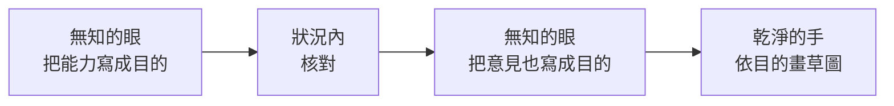

# 重構的 Context 分配：無知的眼、狀況內的核對、乾淨的手

---

## 0. 這篇在哪裡

**context** 是一個角色開始工作時手上有的全部資訊 —— 看過什麼、讀過什麼、跟誰討論過什麼。

[atomization-context-isolation](./atomization-context-isolation.md) 講：把一件工作切給好幾個角色接力時，每一個交接處都要決定「前一棒的 context 放多少過去」—— 那篇把它比喻成一個**旋鈕**，從「什麼都不給」轉到「整包都給」。該給多少，要看那份 context 對下一棒是什麼角色：是推動工作的**引擎**、會污染判斷的**偏誤**，還是**無關**。

這篇把這個判準用在「重構」上：

> **重構要保留的是能力，要丟掉的是形狀。這兩件事要交給知道程度不同的角色。**

角色可以是 AI agent，也可以是人。一個角色屬於下一節三種狀態的哪一種，由它看過什麼決定。

---

## 1. 問題：看過舊版，就畫不出新版

先定兩個詞：

- **能力**：使用者靠它做到的事。分兩種：
  - **讓人得到答案**：能回答的問題、能完成的事
  - **讓人讀對答案**：讓結果不被誤會的那些設計 —— 比較的基準、計算的範圍、哪裡是「沒有資料」而不是「是零」
- **形狀**：它現在長的樣子 —— 版面、元件、欄位排列、章節順序、流程步驟。

兩者不總是分得乾淨：有些形狀本身就承載能力（例如某個步驟順序是必要的，換了順序就會出事）。分辨的方法見第 3 節。

重構有兩種方向相反的失敗：

| | 做法 | 結果 |
| --- | --- | --- |
| 看了舊版再設計 | 每個設計問題，舊版都已經給了一個答案 | 新版是舊版換皮 |
| 沒有系統盤點過舊版就設計 | 只列得出大家記得的功能 | 新版好看，但有些能力不見了 —— 通常是沒人記得、卻一直在發揮作用的那些 |

一個角色很難同時避開這兩種失敗：要留住能力，就得仔細看舊版；而**設計時**，看過的形狀會自動變成預設答案。

「被形狀綁住」其實有兩種：

- **替自己做設計決定**：看過的形狀變成預設答案。這只發生在設計的時候 —— 只列出舊版有什麼、不負責設計的角色，看再仔細也不會有這一種。
- **跟著寫出來的文字傳下去**：描述舊版時，用詞、切分的粗細都可能沿用舊的形狀。這一種誰都可能有，差別只在多寡：只看過表面的，帶的是表面的用詞；知道背後的，還會帶上元件名稱和當初的設計理由。

第一種讓三種角色能分工（見第 2 節）；第二種是交接時要「只傳目的」的原因（見第 3 節）。

---

## 2. 三種 context 狀態

### 無知的眼

只看得到成品表面，用使用者的方式去用它；不知道背後怎麼做、為什麼這樣做。

- **擅長**：把能力寫成**目的** —— 「這是為了讓使用者回答什麼問題」。
- **盲點**：看不到藏起來的部分，也看不到背後的資料；也容易漏掉「讓人讀對答案」的能力 —— 使用者不是為它而來，走一遍時它不像一個功能（見第 4 節）。
- **為什麼要無知**：知道背後的人，會把「設計者本來想做什麼」當成「使用者實際得到什麼」；知道舊版為什麼這樣做，就會替舊的形狀找到保留的理由。無知的眼寫不出這些理由，所以只留下目的。
- **不做什麼**：不評價好不好看 —— 一評價，清單就混進了偏好。
- 當使用者和製作者是不同的人，無知的眼站在使用者那一邊。

### 狀況內

架構、資料流程、原本的設計全都知道。

- **擅長**：核對 —— 無知的眼列的能力是否真的存在、真的會出現在使用者面前；有沒有它走不到的地方（藏起來的入口）；清單是不是缺了整整一個軸（見第 4 節）。
- **盲點**：知道得最多，意見裡帶的形狀也最多（第 1 節的第二種綁住）。
- **不做什麼**：不判斷做不做得到。核對的問題是「舊版有沒有這個能力」，不是「新版能不能做」；一旦開始判斷可行性，「這個做不到」的限制就會被當成事實寫進清單，還沒設計就先綁住了設計。

### 乾淨的手

從沒看過舊版。手上只有一份能力清單，加上**底層**（資料和系統）能給什麼、想給什麼。

- **擅長**：從目的出發，設計新的形狀。
- **盲點**：沒有清單就不知道要保留什麼。
- **為什麼兩種底層資訊都要知道**：只知道「能給什麼」，設計會被現有的資料綁住；不知道「能給什麼」，會設計出底層撐不起的東西。「想給什麼」是底層的設計者希望被看見、但舊版沒用上的東西 —— 包括已經產出卻沒有任何畫面在用的資料。
- **不做什麼**：不看舊版「參考一下」；也不在舊實作觸手可及的地方工作 —— 舊元件就在手邊時，一重用，舊的形狀就回來了。先畫草圖，不直接實作。

### 對照

| 狀態 | 看過舊版？ | 知道背後？ | 擅長 | 盲點 |
| --- | --- | --- | --- | --- |
| 無知的眼 | 看過表面 | 不知道 | 把能力寫成目的 | 看不到藏起來的；容易漏掉讓人讀對的能力 |
| 狀況內 | 看過 | 全知道 | 核對真偽、補漏、找缺的軸 | 意見裡帶著形狀 |
| 乾淨的手 | 沒看過 | 只知道底層能給／想給什麼 | 從目的設計新形狀 | 不知道要保留什麼 |

「無知」和「乾淨」是兩回事：**無知的眼看過舊版，只是不知道背後；乾淨的手連舊版都沒看過。**

用 [atomization-context-isolation](./atomization-context-isolation.md) 的判準來看，每個角色該擋掉什麼、該給什麼：

- 對無知的眼，「背後怎麼做的」是**偏誤** —— 它的工作正是那篇 §1.2 說的「天真走查」（不帶著對背後的預期，只照使用者看得到的走一遍），知道背後就會被自己的預期污染。所以擋掉。
- 對乾淨的手，舊的形狀是**偏誤**，擋掉；能力清單和底層資訊則放行。它不是旋鈕轉到「什麼都不給」，而是只放行特定的東西。
- 對狀況內，前一棒的對話是偏誤，擋掉；架構與資料的知識不是從前一棒傳來的，而是它核對時的依據，必須給。

---

## 3. 接力：只傳目的，不傳形狀

兩個關鍵：

**一、狀況內的意見要回到無知的眼。** 狀況內是最了解舊形狀的角色，它補上的東西難免用舊形狀來描述。交回無知的眼改寫成目的之後，交給乾淨的手的形狀就少得多。無知的眼因此是整條接力的**濾網** —— 濾掉的是大部分，不是全部（第 1 節的第二種綁住，誰都可能有）。

**二、交接的是整理好的文字，不是對話。** 傳對話，等於把前一棒的偏誤一起傳過去。文字本身也要是**目的語言**：

| 形狀語言（會把下一棒錨定回舊版） | 目的語言（只留下要做到的事） |
| --- | --- |
| 左上角有個下拉選單可以選月份 | 能把任一個月份單獨拿出來看 |
| 一張紅綠兩色的長條圖 | 能比較兩個群體在同一個指標上的差距 |
| 數字旁邊有一行小字說明統計範圍 | 讀到這個數字時，要同時知道它是在什麼範圍內算的 |

檢查方法：**換一個完全不同的呈現方式，這句話還成立嗎？** 成立，就是目的語言。這個方法也能分辨第 1 節說的「承載能力的形狀」：如果某個順序換掉之後，某件事就做不到或會出錯，那個「某件事」就是能力，要用目的語言寫進清單。

這個方法擋得住用詞，擋不住**切分的粗細**：沿用舊版粗細寫出的句子，換任何呈現方式都成立。這一種只能追問 —— 使用者要的就是這個粗細，還是舊版只給得了這個粗細？

這正是 [atomization-context-isolation](./atomization-context-isolation.md) §1.4 說的「東西存成一格一格，下游才能一格一格挑」：清單寫成一條一條的目的，交接時才能只放行目的、擋掉形狀；寫成一大段描述，目的和形狀就糊在一起，只能全給或全不給。

**驗收也按 context 分工**，各驗只有自己驗得了的東西：

| 驗收者 | 驗什麼 | 為什麼只有它能驗 |
| --- | --- | --- |
| 無知的眼 | 清單上每個目的，新版都有落點 | 清單是它寫的，而且它只從使用者的眼睛看 |
| 狀況內 | 新版的結果對得上真實的資料和架構 | 只有它知道背後 |
| 一個全新、什麼都沒看過的角色 | 第一次來的人看不看得懂、用不用得起來 | 前面每一棒都已經知道新版要做什麼，看不到第一次來的人會卡在哪 |

---

## 4. 最容易漏的：讓人讀對的能力

盤點能力時，清單常常只有一個軸：「讓人得到答案」。只看表面的角色走一遍，讓人讀對的那些設計不像功能 —— 使用者不是為它而來；就算注意到，清單上也沒有位置可放，只好當成其他項目的附註，讀起來像「還沒做完的地方」。所以這個軸通常要靠狀況內在核對時補上，再交回無知的眼寫成目的。

改版時版面一緊，它們第一個被刪，**而且刪掉之後沒有任何症狀**：結果還在、還看得懂，只是讀出來的意思變了。第 1 節說的「沒人記得、卻一直在發揮作用的能力」，最典型的就是這一種。

| | 使用者為什麼看它 | 拿掉的後果 | 怎麼失敗 |
| --- | --- | --- | --- |
| **讓人得到答案** | 為了得到某個答案 | 少一個答案的來源，其他結果照樣成立 | 使用者找不到、會反映 |
| **讓人讀對答案** | 不為它而來；讀完它才敢用旁邊的結果 | 結果還在，意思變了 | 被擠掉，而且沒有人發現 |

判準一句話：

> **沒有它，這個結果會不會被讀成另一件事？**

示意：某份報表寫「本月營收成長 80%」，旁邊一行小字說明「統計的門市從 10 家增加到 18 家；同一批門市只成長 5%」。拿掉這行小字，80% 還是 80%，但讀的人會以為生意變好了。

這個軸不限於數字：一份 SOP 裡「這一步只適用於舊型機器」的但書、一份問卷結果旁「只有 12 人回答」的提醒，都是讓人讀對的能力。

它在清單上一樣寫成目的 —— 「讀到 X 時，要同時知道 Y」。至於 Y 要擺在 X 旁邊、收成一個記號，還是放進說明頁，那是形狀，交給乾淨的手去設計。

---

## 5. 不只是畫面

任何「舊的形狀會替你回答設計問題」的重構，都適用這套分配：報告改版、流程或 SOP 改版。不同的只是「成品表面」和「草圖」長什麼樣 —— 畫面的草圖是 wireframe，報告的草圖是章節骨架；三種 context 狀態的分工不變。

---

## 相關文檔

- [atomization-context-isolation.md](./atomization-context-isolation.md) - 前置：context 旋鈕與引擎／偏誤／無關的判準；本篇是它用在重構上的一種分配
- [compute-state-context.md](./compute-state-context.md) - context 的本質：交給無記憶 compute 的那一片 state
- [agent-work-forms.md](./agent-work-forms.md) - 與 agent 協作的形態；本篇的每一棒由 agent 擔任時，就是一次委派

---

## 📝 文檔維護

### 版本歷史

| 版本 | 日期 | 作者 | 變更說明 |
|------|------|------|----------|
| 1.0 | 2026-09-23 | yijou14 | 初版建立 |

---

**文檔結束**
