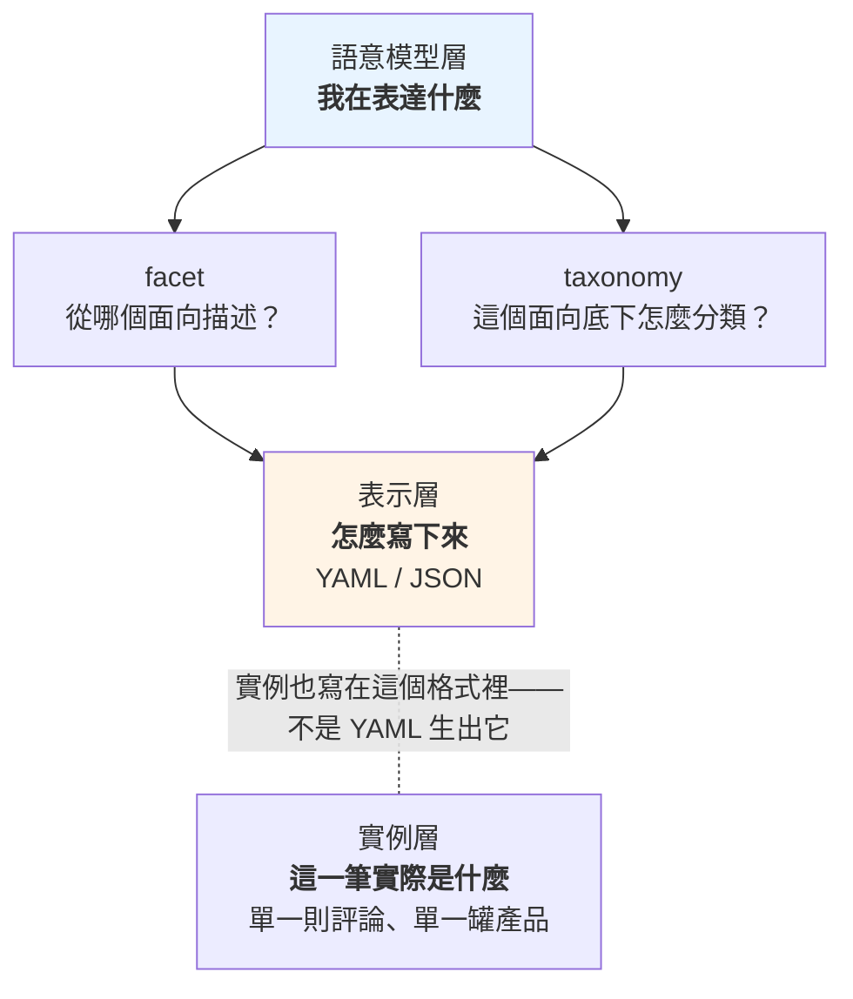
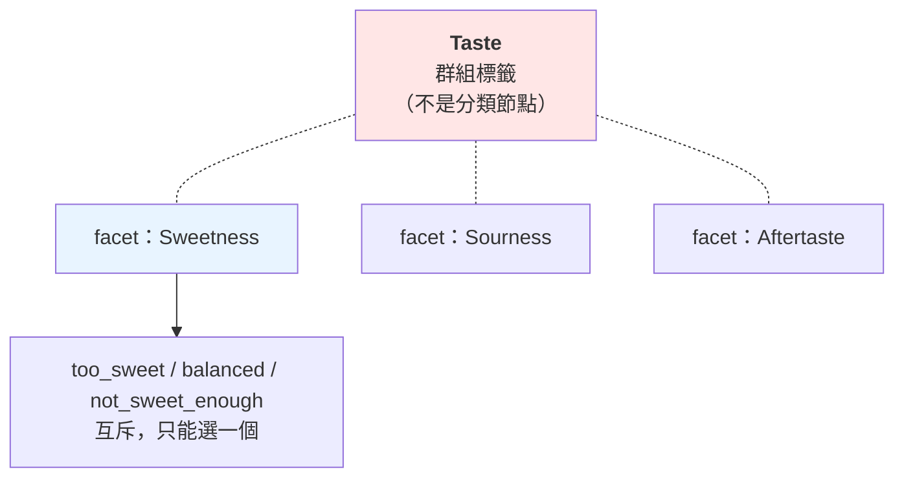
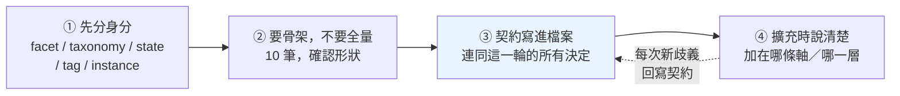

# 寫下來之前：facet、taxonomy、state、tag、instance

---

## 0. 這篇在哪裡

[分類體系術語](./classification-terminology.md)講的是概念：什麼是 facet、什麼是 taxonomy、為什麼四個正交的問題不能疊成一棵樹。

這篇講**動手的那一刻**——你要把那些概念寫成一份真的 YAML，而且多半會叫 Claude 幫你寫。

最容易出事的地方不是語法，是這個：

> **YAML 是「怎麼寫」，facet / taxonomy 是「你在表達什麼」。這兩件事不在同一層。**

疊在一起的後果是：**YAML 寫得非常漂亮，語意模型還是錯的。** 而語法錯誤會被工具擋下來，語意錯誤不會——它會一路長大，直到有人問「為什麼這兩張表的數字加不起來」。

所以這篇的順序刻意反過來：**先分清楚要表達什麼，最後才看 YAML。**

「**寫下來之前**」對多數人不是自己動筆之前——是**你收下一份檔案、把它寫進 repo 之前**。這篇要給的不是一套可以抄的成品，是**看得出對不對的判準**。

在實務層的位置：[know-your-unknowns](./know-your-unknowns.md) 講怎麼驗收一次委派，[agent-work-forms](./agent-work-forms.md) 講重複委派時該站在哪。這篇是那條軸落在一個具體產物上——而那個產物有個特性：**它會被反覆重讀**。你不是在寫一份設定檔，你是在寫一份未來每一輪對話都要當 context 吃進去的東西。

---

## 1. 三層不要疊

先把三件常被混在一起的東西拆開：

| 東西 | 它是什麼 | 回答的問題 |
|---|---|---|
| **facet / taxonomy** | 語意模型 | 我要**表達什麼**？ |
| **YAML / JSON** | 表示格式 | 我要**怎麼寫下來**？ |
| **一筆資料** | 實例 | 這一則**實際是什麼**？ |



關鍵在最上面那層對最下面那層的關係：

> **YAML 沒有決定任何東西是 facet 還是 taxonomy。是你設計的語意模型決定的，YAML 只是把它記下來。**

所以「我該用巢狀還是扁平」這種問題，**在語意模型定案之前是問不出答案的**——你還不知道要記什麼，怎麼決定怎麼記。

（本文一律拿 YAML 舉例，因為那是團隊實際在用的格式。**三層分離對 JSON 一樣成立**；差別只在後面會講的那個坑——「縮排被讀成階層」——**只有用縮排表達包含關係的格式才會發生**，JSON 用括號就沒有這個問題。）

反過來說，這也是為什麼有人可以寫出一份格式完全合法、通過所有驗證、但語意徹底錯誤的 YAML。**驗證器只看得到中間那層。**

### 同一個階層，兩種寫法

三層分離最常在一個地方被撞見：**同一份分類體系，可以寫成兩種形狀完全不同的檔案。**

階層由**檔案的形狀**承載：

```yaml
- id: vitamin
  label: 維生素
  children:
    - id: vitamin_c
      label: 維生素 C
```

階層由**紀錄上的一個欄位**承載：

```yaml
- id: vitamin
  label: 維生素
  parent: null
- id: vitamin_c
  label: 維生素 C
  parent: vitamin
```

**這兩份檔案表達的是同一件事。** 拿到其中一份，你要認得出它是哪一種——因為兩種寫法各自**免費送你一些保證**，也各自把一些保證變成**你要自己做的事**：

| | 由形狀承載 | 由欄位承載 |
|---|---|---|
| 繞圈、指到不存在的上層 | 語法上不可能發生 | `parent: vitamn` 沒東西擋，**要自己檢查** |
| 兄弟之間的顯示順序 | 清單順序就是順序 | 要另外加 `order` 欄位 |
| 搬動一整支 | 整段搬家，版本控制的 diff 很難看 | 改一行 |
| 深度不固定時要驗證 | 規則得逐層寫 | 一條規則走到底 |

（還有第三種寫法：把整條路徑寫成一個字串，`path: 營養成分/維生素/維生素C`，業界叫 **materialized path／物化路徑**。它是「由欄位承載」的變體，換來單行自解釋，代價是上層一改名，所有後代的路徑都失效。）

所以**這一節給你的不是「該選哪一個」，是一句驗收問句**：

> **這份檔案的階層寫在形狀裡，還是欄位裡？如果是欄位——那驗證程式在哪？**

由欄位承載在業界確有正統做法（W3C 的 SKOS 標準就是扁平＋`broader`），但 SKOS 是給機器讀的，而且配套有 qSKOS 這類驗證器。**沒有驗證機制而選了欄位那條，等於把「語法上不可能」換成了口頭約定。**

兩件事跟寫法無關，兩種都要守：

- **識別碼不要用顯示名稱。** label 是會改的東西，拿它當身分，改名就等於抹掉舊資料（什麼時候該換識別碼，見 [classification-terminology](./classification-terminology.md) §7）
- **「想把一個節點掛在兩個上層」是警訊，不是需求。** 欄位那條技術上做得到（`parent` 改成陣列），但一棵樹的定義就是每個東西只掛一個位置。會想掛兩個，通常代表**兩條互相獨立的軸被壓成了一棵樹**——例如「劑型」和「適用對象」被塞進同一棵樹，於是「兒童軟糖」不知道該掛哪。正確處理是拆成兩條軸，這正是第 3 節那個例子在講的事

最後一件事：**以上都預設這個階層是一棵樹**（每個東西只有一個上層）。如果資料本身是一張網——一個東西連到很多個、甚至互相連——上面三種寫法都寫不出來，它在檔案裡會長成 `related: [...]` 這類欄位，那已經不是階層了。

---

## 2. 三個問題

拿到一份檔案，對裡面每一個東西問三個問題。**三個要分開問**——理由在本節最後。

| | 問題 | 可能的答案 |
|---|---|---|
| ① | 這在**哪一層**？ | 定義層 ／ 實例層 |
| ② | 若在定義層，它**扮演什麼**？ | 一條軸 ／ 軸底下怎麼分類 ／ 一個會變的狀態 |
| ③ | 它**被怎麼記錄**？ | 有寫清楚屬於哪條軸 ／ 沒寫 |

五個名字就是這三個問題的答案：

| 名字 | 它是哪一格 | 判準 |
|---|---|---|
| **facet（分面）** | ②：一條軸 | **它的答案推導不出別條軸的答案** |
| **taxonomy（分類法）** | ②：軸底下怎麼分類 | 值之間有**真實的包含關係**，而且往上只有一個父節點 |
| **state（狀態）** | ②：會變的狀態 | **它會變，而且變了之後要留下歷史** |
| **instance（實例）** | ①：實例層 | 它是**資料**，不是定義 |
| **tag（標籤）** | ③：沒寫歸屬 | 你講不出它屬於哪條軸 |

前兩個 [classification-terminology](./classification-terminology.md) 已經講透了，這裡只補後三個。

### 為什麼是三個問題，不是一句「它是哪一種」

因為**三個問題的答案可以並存**。`tags: [too_sweet]` 這一筆，同時是「實例層的一筆資料」（①）也是「沒寫歸屬的記錄方式」（③）——它既是 instance 也是 tag，兩者不互斥。

把五個名字排成「這一個東西是 A、B、C、D 還是 E？」會讓人以為只能挑一個，那是錯的：它們回答的**不是同一個問題**。真正互斥的只有同一個問題底下的選項。

### state 不是 facet value

最容易混的一組。判準是**「它會變嗎，變了之後舊值還算數嗎」**。

先看同一個主體——**一則評論**——身上的兩個欄位：

| 欄位 | 它在說什麼 | 會變嗎 |
|---|---|---|
| `dosage_form: gummy` | 這則評論在講一罐**軟糖**產品 | 不會。要變只有一種情況：判讀錯了，那是修正不是變化 |
| `review_status: pending` → `reviewed` | 這則評論的**判讀流程走到哪** | 會，而且變了之後要查得出什麼時候變的 |

> **facet value 描述「這個東西是什麼」；state 描述「這筆資料在流程中的位置」。**

**定義層的東西也有 state。** 一個分類節點會退役：`status: active` → `status: retired`——節點**還在**，只是不再建議使用，舊資料還掛在它上面，而且必須查得到「它什麼時候退役、改用誰」。

分不開的後果很具體：如果你把 `retired` 做成分類樹的一個節點，那些被退役的東西就會在報表上憑空消失——因為它們被搬到另一個分支去了。而正確做法是**節點留在原位，另外掛一個狀態欄位**。（同一條規則在 [classification-terminology](./classification-terminology.md) §7 是「東西不要刪掉，標記成已退役就好」。）

### tag：沒寫下歸屬的那種記錄方式

前面四個講的是「這東西是什麼」，tag 不是——**tag 講的是「你選擇用什麼方式記錄它」**。`too_sweet` 本身不是 tag，它是「被記成一個裸標籤、而不是某條軸的值」的那個狀態。

```yaml
tags:
  - too_sweet
  - effective
  - gummy
```

表面上很好用。但 `too_sweet` 到底是什麼？

- 味道這條軸的一個值？
- taxonomy 上的一個節點？
- 一個隨手打的自由標籤？
- 一個會變的狀態？

**沒有任何東西回答得了這個問題**，因為那份 YAML 裡沒有寫。它把三種不同身分的東西並排在同一個陣列裡，然後靠讀的人自己補上缺掉的語意。

**在探索階段，這是合理的**——你還不知道有幾條軸，先把觀察到的東西記下來。問題出在它留太久：**一旦有人開始拿 tag 做統計，那個「還沒想清楚」就變成了地基。**

### 但 tag 不是只有「暫存」這一種用法

自由標籤有它自己的正當性，這種「讓使用者自己貼、分類由下而上長出來」的做法有正式名稱：**folksonomy（大眾分類）**。它跟事先定好合法值清單是一組明確的取捨——

| | 事先定好合法值 | 自由貼標籤 |
|---|---|---|
| 換到的 | 一致性、可統計、可驗證 | 覆蓋率、長尾、**使用者真正在用的說法** |
| 付出的 | 沒想到的東西無處可放 | 統計要另外對帳 |

至少三種情況，tag 是終點而不是暫存：

- **那條軸本質上就是開放的**——使用情境、品牌聯想，你永遠列不完
- **刻意跨軸的流程標記**——`待複查`、`拿來訓練用`，它本來就不屬於任何一條描述性的軸
- **長尾的維護成本大於收益**——為了三筆資料開一條新軸並不划算

判斷方式還是同一句：**有沒有人要拿它做統計。** 要，就得有歸屬；不要，裸標籤沒有問題。

### instance 不要跟定義混在一起

這是最常見、也最好抓的一種混淆：

```yaml
# ❌ 三種東西混在一起
review_id: R001
taste:
  too_sweet
  too_sour
  balanced
  not_sweet
selected_taste:
  too_sweet
```

這份 YAML 同時塞了三種東西：**這一則評論的判讀結果**、**味道這條軸的定義**、**味道底下所有可能的值**。於是出現了 `selected_taste` 這種欄位——因為前面那坨已經分不出哪個是選中的、哪個是選項。

正確的做法是分開三份檔案，見第 5 節。

---

## 3. 走一次真實案例：一則 Amazon 評論

拿一句真的評論：

> "These gummies work well, but they are way too sweet."

你想從評論裡分析五件事：**味道、功效、劑型、副作用、價格**。

```text
Review
├── Taste          味道
├── Effectiveness  功效
├── Dosage Form    劑型
├── Side Effect    副作用
└── Price          價格
```

這五個彼此正交——知道它太甜，推不出它有沒有效；知道它是軟糖，推不出它貴不貴。**五個 facet，沒有問題。**

### 接下來這一步是關鍵

現在展開 Taste。很自然會寫成這樣：

```text
Taste
├── Sweetness
│   ├── Too Sweet
│   ├── Balanced
│   └── Not Sweet Enough
├── Sourness
│   ├── Too Sour
│   ├── Balanced
│   └── Not Sour Enough
└── Aftertaste
    ├── Pleasant
    └── Unpleasant
```

看起來像一棵漂亮的 taxonomy。**但它不是。**

拿 [classification-terminology](./classification-terminology.md) §2 的**正交測試**跑一次——「知道 A 的答案，推不推得出 B 的答案」：

| 問 | 答 | 結論 |
|---|---|---|
| 知道「太甜」，推得出酸不酸嗎？ | **推不出** | Sweetness 與 Sourness **正交** |
| 知道「太甜」，推得出是不是「甜度剛好」嗎？ | **推得出**（不可能同時） | Too Sweet 與 Balanced **互斥** |

所以這棵樹的兩層，身分完全不同：



| 那一層 | 真實身分 |
|---|---|
| Sweetness / Sourness / Aftertaste | **三個獨立的 facet**——一則評論可以同時太甜又太酸 |
| Too Sweet / Balanced / Not Sweet Enough | **一個 facet 的值**——互斥，只能選一個 |
| **Taste** | **不是分類節點**，是一個把三條軸收在一起的**群組標籤** |

最後那條有標準的名字。SKOS（W3C 的知識組織標準）把這種「只是把幾個東西收在一起、本身不參與上下位關係」的東西叫 **node label**——規範裡明訂**它不是概念，不能有上位或下位關係**。

> **這個例子不是錯的，它是真實世界的典型長相**：一份看起來像 taxonomy 的東西，跑過正交測試才發現裡面躺著三個 facet。錯誤不在畫的人，在於「畫成樹」這個動作太順手了。

### 附帶一個例外：有些 facet 真的是一把尺

`classification-terminology.md` §2 特別說過「**不要用尺來理解 facet**」——因為軟膠囊不比硬膠囊「大」。

但 `Too Sweet / Balanced / Not Sweet Enough` **確實有序**：太甜 → 剛好 → 不夠甜，這是一條有方向的軸。

**這是那條守則的例外，而且是常見的例外**：凡是程度評價（太多／剛好／太少）、滿意度、嚴重程度，值本身就帶順序。這種 facet 叫 **ordinal（有序）facet**，處理上有兩個差別：

- **排序有意義**——「比 Balanced 更甜的那些」是問得出來的，一般 facet 問不出這種話
- **中間值不是 catch-all**——`Balanced` 是一個真實的評價，不是「沒填」。**兩者一定要分開**，否則你會把「沒人提到甜度」算成「大家覺得剛好」

---

## 4. 什麼時候一組值該升級成 taxonomy

第 3 節的 Sweetness 是**一組平的值**，不需要階層。那什麼時候需要？

用**劑型**當例子——它剛好同時出現在評論分析和產品分類兩邊，是兩個場景的交會點。

**平的寫法**（大多數情況這樣就夠）：

```text
Dosage Form
├── Gummy
├── Capsule
├── Tablet
└── Powder
```

**升級成 taxonomy**：

```text
Dosage Form
├── Solid
│   ├── Tablet
│   ├── Capsule
│   └── Gummy
└── Liquid
    ├── Drop
    ├── Syrup
    └── Drink
```

### 判準：上層那個名字，有人會拿來查嗎

不是「能不能分層」——**任何東西都能硬分層**。判準是這兩條，**要同時成立**：

**① 包含關係是真的。** 軟糖**確實是**固體劑型的一種。如果你得停下來想「這算不算」，那多半不是包含關係，是你在硬套。

**② 上層那個名字會被單獨查詢。** 有人會問「固體劑型佔多少」嗎？會 → 需要 taxonomy，因為那個數字必須是底下所有子項的總和。不會 → **平的清單就夠了，多一層只是多一層要維護的東西**。

第二條常被忽略，但它才是決定性的。`classification-terminology.md` §4 講的 **lens（鏡頭）**——報表下拉選單裡「同一個維度看粗看細」——**只有階層撐得住**，因為粗的層級必須剛好等於細項的總和。**沒有人要看粗的，就不需要階層。**

### 對照：兩個場景的同一條軸

| | 評論分析 | 產品分類 |
|---|---|---|
| 劑型的用途 | 這則評論在講什麼型態的產品 | 這罐產品是什麼型態 |
| 會不會查「固體劑型」 | 通常不會——評論分析在乎的是具體型態 | 會——市場報表要按大類看 |
| 建議 | **平的清單** | **升級成 taxonomy** |

> **同一條軸，在不同場景可以有不同的形狀。** 這不是不一致，是因為「要不要階層」取決於你會怎麼查，而不是取決於這條軸本身。

**在檔案裡，這個「升級」就是一個欄位的差別**：`hierarchical: false` 還是 `true`（見下一節的 C 檔）。沒升級之前它只是一組合法值，**還不能叫 taxonomy**。

---

## 5. 三份檔案分開

前面所有的判斷，最後落成三份**分開的**檔案。這一節的用途不是給你抄，是讓你**認得出眼前這份是不是混寫的**。

### 三份各回答一個問題

| 檔案 | 只回答 | 長什麼樣 |
|---|---|---|
| **實例** `reviews/R001.yaml` | 這一則**實際**被判斷成什麼 | `facets: { sweetness: too_sweet, dosage_form: gummy }` |
| **facet 定義** `schema/facets.yaml` | 我們從**哪些面向**描述東西 | 一列軸，每條軸一個 `id` 與一個 `values_ref` |
| **值集合定義** `schema/value-sets/*.yaml` | 這條軸底下有**哪些合法值** | `value_set:` ＋ `hierarchical:` ＋ `values:` / `nodes:` |

**分三份的第一個理由是語意的**：這是三個不同的問題，答案自然落在三個地方。混在一起不只是不整齊——**它讓「哪個是選項、哪個是選中的」變得答不出來**，就是第 2 節那個 `selected_taste` 的來源。

第二個理由才是維護。三份東西的**變更頻率、作者、版本節奏完全不同**：

| | 誰在改 | 多久改一次 | 改錯的後果 |
|---|---|---|---|
| **實例** | 標註流程／模型 | 每天，幾萬筆 | 一筆資料錯 |
| **facet 定義** | 資料負責人 | 幾個月一次 | 整個分析框架換掉 |
| **值集合定義** | 領域專家 | 偶爾，且要版控 | 所有既有標註需要重新對映 |

混在一份裡，**這三種節奏會互相綁架**：你想改一條軸的合法值，卻要動到幾萬筆實例資料所在的檔案；你想重跑標註，卻可能不小心覆蓋掉領域專家的定義。

### 三個要認出來的特徵

拿到一份檔案，看這三個地方就知道它有沒有把該分開的東西寫在一起。

**① 值集合有沒有自己的身分。** facet 定義裡應該是一個**指標**，不是一坨內嵌的值：

```yaml
# schema/facets.yaml —— 對的樣子
- id: sweetness
  label: 甜度
  ordinal: true                # 值有順序（太甜 → 剛好 → 不夠甜）
  values_ref: sweetness_v1     # ← 指過去，不是把值抄在這裡
```

`values_ref` 那一行是關鍵——**它讓一條軸的值集合變成一個有身分、可以掛版本號的獨立物件**。`sweetness_v1` 改成 `sweetness_v2` 時，舊資料還指著 v1，你查得出當初是用哪一版標的。**值直接內嵌在 facet 定義裡，就沒有東西可以掛版本號。**

**② 群組有沒有被明寫成「不是分類節點」。** 第 3 節那個 `Taste` 應該長這樣：

```yaml
groups:
  - id: taste
    members: [sweetness, sourness, aftertaste]
    note: 這是導覽用的群組，不是分類節點——底下三條軸彼此正交
```

那行 `note` 就是在防止下一個人（或下一輪的 agent）把它當成上層概念。**沒有這行，群組遲早會被當成一層樹。**

**③ 兜底值有沒有分開。** 值集合裡這兩個欄位是不同的東西：

```yaml
value_set:
  id: sweetness_v1
  hierarchical: false            # 平的一組值——還不是 taxonomy
  values: [too_sweet, balanced, not_sweet_enough]
  catch_all: not_mentioned       # 評論沒提到甜度，不等於「剛好」
```

`balanced` 是一個**真實的評價**，`not_mentioned` 是**沒有資料**。合併成一個，你會把「沒人提到甜度」算成「大家覺得剛好」。

> **為什麼這個 key 叫 `value_set` 而不是 `taxonomy`。** 照[分類體系術語](./classification-terminology.md)第 3 節，**taxonomy 是一棵樹**——`sweetness_v1` 是平的一組值，它還不是 taxonomy。兩者共用同一種檔案，用 `hierarchical` 區分：**`hierarchical: true` 的那些才是 taxonomy**（那時值改寫成 `nodes:`，每個節點帶 `broader:`），也就是第 4 節說的「升級」。用同一個 key 稱呼兩者，會讓第 4 節那條判準沒有東西可以落下來。

---

## 6. `too_sweet` 是什麼？——tag 的代價

回到第 2 節那個問題。這份 YAML：

```yaml
tags:
  - too_sweet
  - effective
  - gummy
```

跟這份：

```yaml
facets:
  sweetness: too_sweet
  effectiveness: effective
  dosage_form: gummy
```

**資訊量差在哪？** 差在歸屬：

```text
too_sweet  ──屬於──▶  sweetness
effective  ──屬於──▶  effectiveness
gummy      ──屬於──▶  dosage_form
```

第一份把這三條線丟掉了。丟掉之後會發生四件事：

1. **統計問不出來**——「甜度分布長怎樣」需要知道哪些 tag 屬於甜度。你得另外維護一份對照表，而那份表通常在某個人腦裡
2. **值域無法驗證**——`too_sweet` 打成 `to_sweet` 沒有任何東西會擋，因為沒有哪條軸宣稱過自己的合法值
3. **同名衝突無解**——`balanced` 可能是甜度的「剛好」，也可能是酸度的「剛好」。扁平的 tag 陣列裡，它們是同一個字
4. **沒辦法問「這則評論有沒有提到甜度」**——沒提到和提到但覺得剛好，在 tag 世界裡長得一樣

### 一句流傳的說法，實測對不上

有一種講法是「人有背景知識可以猜出來，**AI 更容易猜錯**」。

**五次實測裡沒有出現這種情形**（見第 7 節，含限制）：Claude 面對這類模糊結構時判斷得相當好，包括刻意設計的陷阱題。

精確的說法是：

> **AI 猜得出來，但它每次猜的可能不一樣。**

你今天問，`too_sweet` 被歸到 `taste`；下週重問，被歸到 `sweetness`；同事那次，被歸到 `flavor_profile`。**每一次都合理，合起來無法對帳。**

所以 tag 的代價不是「會被猜錯」，是**「每次都要重猜一次，而重猜的結果不保證一致」**。歸屬寫在檔案裡，就沒有人需要猜。

---

## 7. 實測：五次都沒搞混，但有三個失效點

寫這篇前跑了五個情境，用「一般人真的會打的那句話」，單輪、不預告測試目的。題材用的是**保健食品分類檔**（不是評論）。

> **先講這五次證據有多強**（完整限制見文末）：**每個情境只跑一次**、**只測了一個模型**（Claude Opus 5）、**檔案都很短**、執行環境是 subagent。所以下面的結論只在「這五次裡」成立，**不足以當成通則**。

| # | 情境 | 結果 |
|---|---|---|
| 1 | 「幫我建一個保健食品的商品分類，用 YAML 寫」 | 主動給樹＋分面**混合設計**並說明理由 |
| 2 | 「要考慮產品類型、劑型、宣稱、適用對象」 | 開口第一句：「**這不是一棵樹的四層，是四個彼此正交的面**」 |
| 3 | 給縮排一詞多義的 YAML，「照這格式補 8 筆」 | 診斷正確：「屬性和子分類混在同一層」 |
| 4 | 給無契約的檔案，「加上『兒童專用』」（陷阱題） | 沒上當，識別出這是**新維度**不是樹的一層 |
| 5 | 同上但檔案有結構契約 | 引用契約條文作判斷 |

**五題在「有沒有把正交的面壓成一棵樹」這一點上全對。** 實測 2 甚至自己講出了組合爆炸的後果，實測 4 自己從檔案裡找到「既有的 `forms` 是平行清單」當證據。

**這裡評的只有這一件事，不是產出品質。** 照本文第 10 節的守則看，實測 1 其實有問題——它只給了 `OTHER_UNCLASSIFIED`，沒有把 `other` 與 `unknown` 分開（見下面的失效點二）。**沒搞混概念，不等於交出來的檔案可以直接用。**

> **在這五次裡，「AI 會搞混 facet 和 taxonomy」沒有發生。** 如果你的防禦全部是圍繞這個假設做的，值得先驗證它在你的情境下是不是真的會發生——但這五次不足以宣告它不存在。

但實測暴露了三個真的問題，共同點是——**它們都不長得像錯誤**。

### 失效點一：它先照做，再警告

實測 3 的反應分兩段：**先**完整補完 8 筆（格式跟原檔一樣，可以直接複製走），**補完之後才說**格式有問題。

診斷完全正確，**但污染已經產生**。而這跟人的閱讀習慣打架：你只會看 code block、警告留在對話裡不會進 repo、下一輪就捲走了。

**處理**：看到它在說明裡提結構性疑慮，停下來先解決再重生一次。判斷很簡單——**它的疑慮如果成立，那 8 筆就是錯的**，你不會想留著已知是錯的資料。

### 失效點二：同一句話，兩份不相容的檔案

實測 1 和 2 問的是同一件事，兩份輸出**都對、都完整、完全不相容**：

| | 實測 1 | 實測 2 |
|---|---|---|
| id 風格 | `VIT.FAT` | `vitamin_single` |
| 主幹能掛幾個 | 「只能掛一個 leaf」 | `cardinality: multi` |
| 兜底值 | 只有 `OTHER_UNCLASSIFIED` | **`other` 與 `unknown` 分開** |

隨便挑一列看後果：「主幹能掛幾個」不同，**兩份報表算出來的市場規模就對不起來**——一份每罐算一次，一份綜合維他命會被算進好幾類。

而這在真實情境幾乎必然發生：你重問一次、你跟同事各問一次、`/clear` 之後接著做。**每次重來都是重新擲骰子**，而分類檔是其他所有資料的地基。

**這就是第 6 節那個結論的來源**：它未必猜錯，但不保證每次一樣。

### 失效點三：它替你做了你沒做的決定

實測 2 只被問了四個維度，交回來的還包含 `claim_type`、`jurisdiction`、`contraindicated_for`、劑型的 `capsule_shell` 與 `release_profile`。

每一個都是好建議。但**你現在擁有一堆你沒評估過的決定**，而且分不出哪些是你要的、哪些是它順手加的。三個月後有人問「為什麼有這欄」，沒人記得那是模型加的，於是大家假設它有理由，開始餵資料進去。

**處理**：先自己答第 2 節那三個問題，然後明講邊界——「這一版只做這四個維度，其他建議寫在說明裡，**不要進檔案**」。

---

## 8. 契約做了什麼

實測 4 和 5 是同一題，差別只在檔案有沒有結構契約檔頭。**兩題都答對，所以契約的價值不是防錯。** 它的價值是三件事。

**一、判斷從「推理」變成「引用」。** 無契約那版說「你的 `forms` 已經示範了正確做法」——那是它的意見，你要驗證得自己重跑一次推理，而且它推對了是因為 `forms` 剛好在那裡。有契約那版說「依照結構契約第 N 條」——那是你的規則，你只要檢查有沒有正確套用。**前者可辯論，後者可稽核。**

**二、契約會自我增生。** 這是我沒預期的。有契約那版主動說：

> 若「未標＝全年齡」，最好把它寫進檔頭契約，**不要留給下一個讀檔的人（或 agent）去猜**。

無契約那版也發現了同一個歧義，但只寫在對話裡。**一旦檔案裡有那個區塊，模型發現新歧義時會主動要求把它寫進去**——這正好解掉失效點一：診斷有地方可以落下來了。

**三、產出品質更高。** 有契約那版還改了命名（「值應該叫『兒童』不是『兒童專用』——『專用』是關係，不是值」）並標了升級路徑。

### 契約範本

```yaml
# ============================================================
# 結構契約 — 給人與 AI agent 讀的規則，勿刪
#
# 【這份檔案是什麼】
#   這是 facet 定義，不是實例資料，也不是值集合定義。
#   實例在 reviews/，值集合在 schema/value-sets/。三者不得混寫。
#
# 【兩種關係，請勿互相推論】
#   facet:        這個值屬於哪一條軸（軸彼此正交、無順序、無上下位）
#   broader:      這個值在該軸內部的直接上位概念（非遞移）
#   縮排在本檔不帶任何語意，僅為 YAML 語法需求。
#
# 【groups 不是階層】
#   groups 只是把幾條軸收在一起方便導覽。
#   群組名稱不是分類節點，不得出現在任何實例資料裡。
#
# 【新增規則】
#   新增一個值之前，先確定它屬於哪一條既有的軸；
#   若不屬於任何既有的軸，那它是一條新的軸，不是某條軸的值。
#
# 【已定案的約定】
#   id 風格：小寫、底線分隔，一經建立不得更改
#   label：顯示用，可自由修改，不得用來當識別碼
#   catch_all 與「沒提到」是兩件事，不得合併
#   other ＝ 確定不屬於既有選項；unknown ＝ 來源資料沒說
# ============================================================
```

**它有效不是因為文字漂亮，是因為每一行都對應一個曾經被搞混的東西。**

---

## 9. 收斂紀律：四步



**① 先分身分。** 不是要答得完美，是要**知道哪些你答不出來**。答不出來的先放 tag，但要明記「這是暫存區」。

**② 要骨架，不要全量。** 先要 10 筆確認形狀——id 風格、三份檔案怎麼切、兜底值怎麼分。形狀錯了，10 筆重來很便宜，**200 筆重來你會捨不得，然後將就**。「捨不得重來」是分類檔劣化的主要原因。

**③ 契約寫進檔案。** 形狀一確認就寫，趁你還記得為什麼。這一步同時解掉三個失效點：診斷有地方落下來、重問時形狀有東西可錨定、模型知道邊界不會亂加。

**④ 擴充時說清楚加在哪一層。** 「幫我加一個分類」是歧義的——加成某條軸的值？樹上的一層？還是一條新的軸？**你知道你要哪個，但那句話沒有承載這個資訊。**

**驗證要靠程式，不要靠讀。** 模型的說明文字不是驗證。在**它產完之後、你收下之前**跑一次檢查（附錄 A），不要仰賴自己有沒有讀完說明。

---

## 10. 對新人的實務守則

**關於設計**

- **收下之前先問第 2 節那三個問題**：在哪一層、扮演什麼、被怎麼記錄
- **看起來像樹的東西，先跑正交測試**——同一層的兩個東西如果推不出彼此，它們是兩條軸不是兩個分支
- **「上層那個名字有人會拿來查嗎」**——不會查就不要建階層
- **要拿來做統計的 tag，就不能沒有歸屬**。開放軸與流程標記可以一直是 tag；但一旦有人拿它算數字，那個「還沒想清楚」就變成地基

**關於檔案**

- **實例 / facet 定義 / 值集合定義，三份分開**。它們的變更頻率、作者、版本節奏完全不同
- **每條軸的值集合要有自己的 id 和版本號**，用 `values_ref` 串。內嵌在 facet 裡就沒東西可以掛版本
- **catch_all 與「沒提到」分開**。沒人提到甜度 ≠ 大家覺得剛好
- **識別碼不要用顯示名稱**。label 是會改的東西，拿它當身分，改名就等於抹掉舊資料

**關於協作**

- **說明裡的結構性疑慮，一律停下來處理**——它的疑慮如果成立，那份產物就是錯的
- **明講邊界**：「這一版只做這幾條軸，其他建議寫在說明裡，不要進檔案」
- **重問之前先把契約貼回去**。沒有契約的重問就是重新擲骰子
- **兩個人不要各問各的**。一份契約，一個人維護

---

## 附錄 A：收下之前的檢查清單

**在你收下、寫進 repo 之前跑一次。** 不要靠讀說明——模型的說明文字不是驗證。

下面八條是**只有讀語意才抓得到**的，機器抓不到、人不刻意看也會漏：

- [ ] **`catch_all` 與「沒提到」是分開的兩個值**——`balanced` 是評價，`not_mentioned` 是沒資料
- [ ] **`other` 與 `unknown` 有沒有分開**——一個是分類不夠用，一個是來源資料有缺，處置完全不同
- [ ] **同一個東西能不能合理地填兩個值**——能的話，可能有兩條軸被壓成了一條
- [ ] **跨軸同名值有沒有歸屬**——`balanced` 同時屬於甜度與酸度時，實例裡要分得出來
- [ ] **實例裡有沒有出現 group 名稱**——group 不是分類節點，不該被標到資料上
- [ ] **`hierarchical: false` 的值集合裡有沒有非空的 `broader`**——沒有階層就不該有上位關係
- [ ] **id 是不是從 label 產生的**——是的話，改名就會壞
- [ ] **深度有沒有超過三層**——超過就考慮是不是該拆成兩條軸

至於**機械性的結構檢查**——階層迴圈、`broader` 指向自己、孤立節點、冗餘的上位邊、`values_ref` 指向不存在的值集合——那些寫成 linter 跑，別用眼睛看。現成的清單見 [qSKOS](https://github.com/cmader/qSKOS/wiki/Quality-Issues)。

---

## 出處與延伸

**本文的實測**

五次單輪對話，模型為 Claude Opus 5，每次在無專案脈絡的獨立 session 進行，prompt 不透露測試目的。日期 2026-08-18，題材為保健食品分類檔。

**限制**（照實列，不要把這五次當成定論）：

- **每個情境只跑一次**，沒有重複試驗，無法排除隨機性
- **只測了一個模型**。較小的模型結果可能完全不同——已知研究顯示模型在深巢狀結構下會出現階層錯位與發明不存在的層級，本文沒測到，不代表不存在
- **執行環境是 subagent**，不完全等同於真正的 CLI session
- **測的都是短檔案**。真實分類檔有幾百筆，長 context 的行為沒有測到
- **題材是產品分類，不是評論分析**。第 3–6 節的評論案例沒有經過實測

**外部參考**

- [SKOS Reference](https://www.w3.org/TR/skos-reference/)（外部）——`broader` 只表直接上位、刻意不遞移的設計理由；第 3 節「node label 不是概念」的出處
- [DeepJSONEval (arXiv:2509.25922)](https://arxiv.org/html/2509.25922v1)（外部）——巢狀深度對模型準確率的影響，5–7 層時 strict score 掉 17–37%，可作為「深度控制在三層內」的旁證
- [Anthropic: Writing effective tools for agents](https://www.anthropic.com/engineering/writing-tools-for-agents)（外部）——欄位命名與 namespacing 建議
- [qSKOS Quality Issues](https://github.com/cmader/qSKOS/wiki/Quality-Issues)（外部）——附錄 A 的出處

---

## 相關文檔

- [classification-terminology.md](./classification-terminology.md) - **前置**：facet / taxonomy / set 的概念、正交測試、canonical 與識別碼治理。這篇是它的落地版
- [03_data-engineering.md](./03_data-engineering.md) - 資料格式（JSON／CSV／YAML）、資料庫與 ETL 基礎；第 1 節「兩種寫法」原本在那篇的 §1.5
- [supplement-industry-terminology.md](./supplement-industry-terminology.md) - voice ＝ 評論數加總；第 3 節的評論來源在那裡有說明
- [know-your-unknowns.md](./know-your-unknowns.md) - 前置：單次委派的驗收。失效點三就是那裡講的「未知的未知」長成交付物的樣子
- [agent-work-forms.md](./agent-work-forms.md) - 重複委派時該站在哪；本篇的「收斂」是形態問題落在一個產物上
- [clarification-wish-and-plan.md](./clarification-wish-and-plan.md) - 澄清有停止點；第 2 節那三個問題就是分類檔的停止點
- [wish-language-and-loss.md](./wish-language-and-loss.md) - 從意圖到產出的失真。失效點一是**產出之後**的失真：診斷與產物被送到兩個地方
- [contextops-discipline.md](./contextops-discipline.md) - 分類檔會被反覆重讀，它就是 context，要當 context 治理

---

## 📝 文檔維護

### 版本歷史

| 版本 | 日期 | 作者 | 變更說明 |
|------|------|------|----------|
| 1.0 | 2026-08-18 | Dustin | 初版（原名 building-taxonomy-with-claude.md）。以五次實測為據，收束為三個失效點：先照做再警告、同一句話兩份不相容的檔案、替你做了你沒做的決定 |
| 2.4 | 2026-08-21 | Dustin | 依 issue #12 改站位：全篇從「怎麼設計」轉為「怎麼看得出對不對」。第 5 節三份完整 YAML 降為三個可辨識的特徵，並補上分三份的語意理由（原本只給變更節奏，那是維護成本）；附錄 A 十七條收為八條語意檢查，機械檢查交給 linter；「角色」統一改為「身分」，避開 repo 既有的職務用法；標明三層分離對 JSON 同樣成立，縮排的坑才是 YAML 特有 |
| 2.3 | 2026-08-21 | Dustin | 依 issue #12 守住正典：檔案裡的 `taxonomy:` 改為 `value_set:`、`taxonomy_ref` 改為 `values_ref`、路徑改 `schema/value-sets/`。平的一組值不是 taxonomy，`hierarchical: true` 才是——原寫法讓第 4 節「什麼時候該升級成 taxonomy」失去落腳處，也與術語文第 3 節「taxonomy：一棵樹」衝突 |
| 2.2 | 2026-08-20 | Dustin | 第 1 節新增「同一個階層，兩種寫法」（由 03_data-engineering.md §1.5 移入並改寫）：不再並排三欄做選型，改問階層由檔案形狀還是紀錄欄位承載，收束為一句驗收問句 |
| 2.1 | 2026-08-20 | Dustin | 依 issue #12 收斂：第 2 節改為三個問題（哪一層／扮演什麼／怎麼記錄），說明五個名字不互斥；tag 補 folksonomy 與「終點而非暫存」的三種情況；state 對照改用同一主體；實測的限制提前到第 7 節開頭，結論收斂為「這五次裡沒有發生」 |
| 2.0 | 2026-08-19 | Dustin | 重構並改名。新增前六節：三層分離、五種身分、Amazon 評論案例走查（含正交測試與 ordinal facet 例外）、一組值何時升級成 taxonomy、三份檔案分離、tag 的代價。實測壓縮為第 7–8 節 |

---

**文檔結束**
