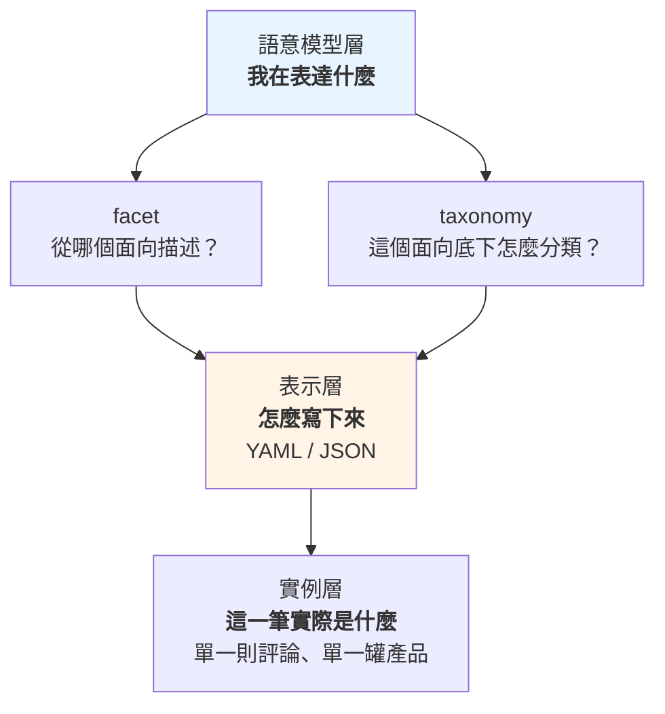
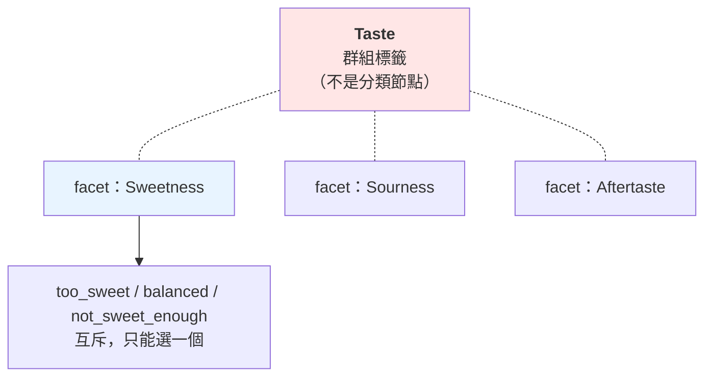
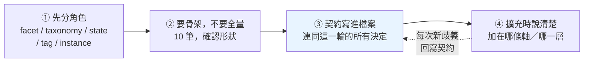

# 寫下來之前：facet、taxonomy、state、tag、instance

---

## 0. 這篇在哪裡

[分類體系術語](./classification-terminology.md)講的是概念：什麼是 facet、什麼是 taxonomy、為什麼四個正交的問題不能疊成一棵樹。

這篇講**動手的那一刻**——你要把那些概念寫成一份真的 YAML，而且多半會叫 Claude 幫你寫。

最容易出事的地方不是語法，是這個：

> **YAML 是「怎麼寫」，facet / taxonomy 是「你在表達什麼」。這兩件事不在同一層。**

疊在一起的後果是：**YAML 寫得非常漂亮，語意模型還是錯的。** 而語法錯誤會被工具擋下來，語意錯誤不會——它會一路長大，直到有人問「為什麼這兩張表的數字加不起來」。

所以這篇的順序刻意反過來：**先分清楚你在設計什麼，最後才寫 YAML。**

在實務層的位置：[know-your-unknowns](./know-your-unknowns.md) 講怎麼驗收一次委派，[agent-work-forms](./agent-work-forms.md) 講重複委派時該站在哪。這篇是那條軸落在一個具體產物上——而那個產物有個特性：**它會被反覆重讀**。你不是在寫一份設定檔，你是在寫一份未來每一輪對話都要當 context 吃進去的東西。

---

## 1. 三層不要疊

先把三件常被混在一起的東西拆開：

| 東西 | 它是什麼 | 回答的問題 |
|---|---|---|
| **facet / taxonomy** | 語意模型 | 我要**表達什麼**？ |
| **YAML / JSON** | 表示格式 | 我要**怎麼寫下來**？ |
| **一筆資料** | 實例 | 這一則**實際是什麼**？ |



關鍵在最上面那層對最下面那層的關係：

> **YAML 沒有決定任何東西是 facet 還是 taxonomy。是你設計的語意模型決定的，YAML 只是把它記下來。**

所以「我該用巢狀還是扁平」這種問題，**在語意模型定案之前是問不出答案的**——你還不知道要記什麼，怎麼決定怎麼記。

反過來說，這也是為什麼有人可以寫出一份格式完全合法、通過所有驗證、但語意徹底錯誤的 YAML。**驗證器只看得到中間那層。**

---

## 2. 五個角色

動手前要能回答一句話：**這一個東西，是 facet、taxonomy、state、tag，還是 instance？**

| 角色 | 回答什麼問題 | 判準 |
|---|---|---|
| **facet（分面）** | 從哪個面向描述？ | 它是一條軸。**它的答案推導不出別條軸的答案** |
| **taxonomy（分類法）** | 這條軸底下怎麼分類？ | 值之間有**真實的包含關係**，而且往上只有一個父節點 |
| **state（狀態）** | 這筆東西在流程中走到哪了？ | **它會變，而且變了之後要留下歷史** |
| **tag（標籤）** | ⚠️ 答不出來 | 它**沒有維度歸屬**——你講不出它屬於哪條軸 |
| **instance（實例）** | 這一筆實際是什麼？ | 它是**資料**，不是定義 |

前兩個 [classification-terminology](./classification-terminology.md) 已經講透了，這裡只補後三個。

### state 不是 facet value

最容易混的一組。判準是**「它會變嗎，變了之後舊值還算數嗎」**：

- `dosage_form: gummy` —— 這罐**就是**軟糖。要改變只有一種情況：產品改版了，那其實是另一個產品
- `status: active` → `status: retired` —— 這個分類節點**還在**，只是不再建議使用。舊資料還掛在它上面，而且必須查得到「它什麼時候退役、改用誰」

> **facet value 描述「這個東西是什麼」；state 描述「這筆資料在流程中的位置」。**

分不開的後果很具體：如果你把 `retired` 做成分類樹的一個節點，那些被退役的東西就會在報表上憑空消失——因為它們被搬到另一個分支去了。而正確做法是**節點留在原位，另外掛一個狀態欄位**。

### tag 是「還沒想清楚」的暫存區

tag 的定義有點奇怪——**它是由「答不出來」定義的**。

```yaml
tags:
  - too_sweet
  - effective
  - gummy
```

表面上很好用。但 `too_sweet` 到底是什麼？

- 味道這條軸的一個值？
- taxonomy 上的一個節點？
- 一個隨手打的自由標籤？
- 一個會變的狀態？

**沒有任何東西回答得了這個問題**，因為那份 YAML 裡沒有寫。它把三個不同角色的東西並排在同一個陣列裡，然後靠讀的人自己補上缺掉的語意。

這不代表 tag 一定是壞的。**在探索階段，tag 是合理的暫存區**——你還不知道有幾條軸，先把觀察到的東西記下來。問題出在它留太久：**一旦有人開始拿 tag 做統計，那個「還沒想清楚」就變成了地基。**

### instance 不要跟定義混在一起

這是最常見、也最好抓的一種混淆：

```yaml
# ❌ 三種東西混在一起
review_id: R001
taste:
  too_sweet
  too_sour
  balanced
  not_sweet
selected_taste:
  too_sweet
```

這份 YAML 同時塞了三種東西：**這一則評論的判讀結果**、**味道這條軸的定義**、**味道底下所有可能的值**。於是出現了 `selected_taste` 這種欄位——因為前面那坨已經分不出哪個是選中的、哪個是選項。

正確的做法是分開三份檔案，見第 5 節。

---

## 3. 走一次真實案例：一則 Amazon 評論

拿一句真的評論：

> "These gummies work well, but they are way too sweet."

你想從評論裡分析五件事：**味道、功效、劑型、副作用、價格**。

```text
Review
├── Taste          味道
├── Effectiveness  功效
├── Dosage Form    劑型
├── Side Effect    副作用
└── Price          價格
```

這五個彼此正交——知道它太甜，推不出它有沒有效；知道它是軟糖，推不出它貴不貴。**五個 facet，沒有問題。**

### 接下來這一步是關鍵

現在展開 Taste。很自然會寫成這樣：

```text
Taste
├── Sweetness
│   ├── Too Sweet
│   ├── Balanced
│   └── Not Sweet Enough
├── Sourness
│   ├── Too Sour
│   ├── Balanced
│   └── Not Sour Enough
└── Aftertaste
    ├── Pleasant
    └── Unpleasant
```

看起來像一棵漂亮的 taxonomy。**但它不是。**

拿 [classification-terminology](./classification-terminology.md) §2 的**正交測試**跑一次——「知道 A 的答案，推不推得出 B 的答案」：

| 問 | 答 | 結論 |
|---|---|---|
| 知道「太甜」，推得出酸不酸嗎？ | **推不出** | Sweetness 與 Sourness **正交** |
| 知道「太甜」，推得出是不是「甜度剛好」嗎？ | **推得出**（不可能同時） | Too Sweet 與 Balanced **互斥** |

所以這棵樹的兩層，身分完全不同：



| 那一層 | 真實身分 |
|---|---|
| Sweetness / Sourness / Aftertaste | **三個獨立的 facet**——一則評論可以同時太甜又太酸 |
| Too Sweet / Balanced / Not Sweet Enough | **一個 facet 的值**——互斥，只能選一個 |
| **Taste** | **不是分類節點**，是一個把三條軸收在一起的**群組標籤** |

最後那條有標準的名字。SKOS（W3C 的知識組織標準）把這種「只是把幾個東西收在一起、本身不參與上下位關係」的東西叫 **node label**——規範裡明訂**它不是概念，不能有上位或下位關係**。

> **這個例子不是錯的，它是真實世界的典型長相**：一份看起來像 taxonomy 的東西，跑過正交測試才發現裡面躺著三個 facet。錯誤不在畫的人，在於「畫成樹」這個動作太順手了。

### 附帶一個例外：有些 facet 真的是一把尺

`classification-terminology.md` §2 特別說過「**不要用尺來理解 facet**」——因為軟膠囊不比硬膠囊「大」。

但 `Too Sweet / Balanced / Not Sweet Enough` **確實有序**：太甜 → 剛好 → 不夠甜，這是一條有方向的軸。

**這是那條守則的例外，而且是常見的例外**：凡是程度評價（太多／剛好／太少）、滿意度、嚴重程度，值本身就帶順序。這種 facet 叫 **ordinal（有序）facet**，處理上有兩個差別：

- **排序有意義**——「比 Balanced 更甜的那些」是問得出來的，一般 facet 問不出這種話
- **中間值不是 catch-all**——`Balanced` 是一個真實的評價，不是「沒填」。**兩者一定要分開**，否則你會把「沒人提到甜度」算成「大家覺得剛好」

---

## 4. 什麼時候一組值該升級成 taxonomy

第 3 節的 Sweetness 是**一組平的值**，不需要階層。那什麼時候需要？

用**劑型**當例子——它剛好同時出現在評論分析和產品分類兩邊，是兩個場景的交會點。

**平的寫法**（大多數情況這樣就夠）：

```text
Dosage Form
├── Gummy
├── Capsule
├── Tablet
└── Powder
```

**升級成 taxonomy**：

```text
Dosage Form
├── Solid
│   ├── Tablet
│   ├── Capsule
│   └── Gummy
└── Liquid
    ├── Drop
    ├── Syrup
    └── Drink
```

### 判準：上層那個名字，有人會拿來查嗎

不是「能不能分層」——**任何東西都能硬分層**。判準是這兩條，**要同時成立**：

**① 包含關係是真的。** 軟糖**確實是**固體劑型的一種。如果你得停下來想「這算不算」，那多半不是包含關係，是你在硬套。

**② 上層那個名字會被單獨查詢。** 有人會問「固體劑型佔多少」嗎？會 → 需要 taxonomy，因為那個數字必須是底下所有子項的總和。不會 → **平的清單就夠了，多一層只是多一層要維護的東西**。

第二條常被忽略，但它才是決定性的。`classification-terminology.md` §4 講的 **lens（鏡頭）**——報表下拉選單裡「同一個維度看粗看細」——**只有階層撐得住**，因為粗的層級必須剛好等於細項的總和。**沒有人要看粗的，就不需要階層。**

### 對照：兩個場景的同一條軸

| | 評論分析 | 產品分類 |
|---|---|---|
| 劑型的用途 | 這則評論在講什麼型態的產品 | 這罐產品是什麼型態 |
| 會不會查「固體劑型」 | 通常不會——評論分析在乎的是具體型態 | 會——市場報表要按大類看 |
| 建議 | **平的清單** | **升級成 taxonomy** |

> **同一條軸，在不同場景可以有不同的形狀。** 這不是不一致，是因為「要不要階層」取決於你會怎麼查，而不是取決於這條軸本身。

---

## 5. 三份檔案分開

前面所有的判斷，最後落成三份**分開的**檔案。

### A. 實例：這一筆實際是什麼

```yaml
# reviews/R001.yaml
review_id: R001
source: amazon
facets:
  sweetness: too_sweet
  effectiveness: effective
  dosage_form: gummy
```

**只回答一件事**：這一則評論被判斷成什麼。

### B. Facet 定義：我們有哪些分析維度

```yaml
# schema/facets.yaml
facets:
  - id: sweetness
    label: 甜度
    ordinal: true                # 值有順序（太甜 → 剛好 → 不夠甜）
    taxonomy_ref: sweetness_v1
  - id: effectiveness
    label: 功效
    taxonomy_ref: effectiveness_v1
  - id: dosage_form
    label: 劑型
    taxonomy_ref: dosage_form_v1

groups:                          # 群組標籤：把幾條軸收在一起方便導覽
  - id: taste
    label: 味道
    members: [sweetness, sourness, aftertaste]
    note: 這是導覽用的群組，不是分類節點——底下三條軸彼此正交
```

**只回答一件事**：我們從哪些面向描述東西。

注意 `groups`——第 3 節那個 `Taste` 放在這裡，而且**明寫它不是分類節點**。這一行註解就是在防止下一個人（或下一輪的 agent）把它當成上層概念。

### C. Taxonomy 定義：每條軸底下的分類世界

```yaml
# schema/taxonomies/sweetness_v1.yaml
taxonomy:
  id: sweetness_v1
  label: 甜度評價
  hierarchical: false            # 平的一組值，沒有階層
  ordinal: true
  values:                        # 順序即語意，由甜到不甜
    - { id: too_sweet,        label: 太甜 }
    - { id: balanced,         label: 剛好 }
    - { id: not_sweet_enough, label: 不夠甜 }
  catch_all: not_mentioned       # 評論沒提到甜度，不等於「剛好」
```

```yaml
# schema/taxonomies/dosage_form_v1.yaml
taxonomy:
  id: dosage_form_v1
  label: 劑型
  hierarchical: true             # 這一條有階層
  nodes:
    - { id: solid,   label: 固體, broader: null }
    - { id: tablet,  label: 錠劑, broader: solid }
    - { id: capsule, label: 膠囊, broader: solid }
    - { id: gummy,   label: 軟糖, broader: solid }
    - { id: liquid,  label: 液體, broader: null }
    - { id: syrup,   label: 糖漿, broader: liquid }
  catch_all: form_other
```

**只回答一件事**：這條軸底下有哪些合法值、彼此怎麼組織。

### 為什麼一定要分三份

不是為了整齊。三份東西的**變更頻率、作者、版本節奏完全不同**：

| | 誰在改 | 多久改一次 | 改錯的後果 |
|---|---|---|---|
| **實例** | 標註流程／模型 | 每天，幾萬筆 | 一筆資料錯 |
| **facet 定義** | 資料負責人 | 幾個月一次 | 整個分析框架換掉 |
| **taxonomy 定義** | 領域專家 | 偶爾，且要版控 | 所有既有標註需要重新對映 |

混在一份裡，**這三種節奏會互相綁架**：你想改一個 taxonomy 的值，卻要動到幾萬筆實例資料所在的檔案；你想重跑標註，卻可能不小心覆蓋掉領域專家的定義。

`taxonomy_ref` 那一行是關鍵——**它讓 taxonomy 變成一個有身分、可以掛版本號的獨立物件**。`sweetness_v1` 改成 `sweetness_v2` 時，舊資料還指著 v1，你查得出當初是用哪一版標的。如果階層直接內嵌在 facet 定義裡，**就沒有東西可以掛版本號**。

---

## 6. `too_sweet` 是什麼？——tag 的代價

回到第 2 節那個問題。這份 YAML：

```yaml
tags:
  - too_sweet
  - effective
  - gummy
```

跟這份：

```yaml
facets:
  sweetness: too_sweet
  effectiveness: effective
  dosage_form: gummy
```

**資訊量差在哪？** 差在歸屬：

```text
too_sweet  ──屬於──▶  sweetness
effective  ──屬於──▶  effectiveness
gummy      ──屬於──▶  dosage_form
```

第一份把這三條線丟掉了。丟掉之後會發生四件事：

1. **統計問不出來**——「甜度分布長怎樣」需要知道哪些 tag 屬於甜度。你得另外維護一份對照表，而那份表通常在某個人腦裡
2. **值域無法驗證**——`too_sweet` 打成 `to_sweet` 沒有任何東西會擋，因為沒有哪條軸宣稱過自己的合法值
3. **同名衝突無解**——`balanced` 可能是甜度的「剛好」，也可能是酸度的「剛好」。扁平的 tag 陣列裡，它們是同一個字
4. **沒辦法問「這則評論有沒有提到甜度」**——沒提到和提到但覺得剛好，在 tag 世界裡長得一樣

### 這裡要修正一句常見的說法

流傳的講法是「人有背景知識可以猜出來，**AI 更容易猜錯**」。

**實測顯示這句話不準確**（見第 7 節）：Claude 面對這類模糊結構時，判斷得相當好——五次實測全部答對，包括刻意設計的陷阱題。

精確的說法是：

> **AI 猜得出來，但它每次猜的可能不一樣。**

你今天問，`too_sweet` 被歸到 `taste`；下週重問，被歸到 `sweetness`；同事那次，被歸到 `flavor_profile`。**每一次都合理，合起來無法對帳。**

所以 tag 的代價不是「會被猜錯」，是**「每次都要重猜一次，而重猜的結果不保證一致」**。歸屬寫在檔案裡，就沒有人需要猜。

---

## 7. 實測：模型不會搞混，但有三個失效點

寫這篇前跑了五個情境，用「一般人真的會打的那句話」，單輪、不預告測試目的。題材用的是**保健食品分類檔**（不是評論），結論不受題材影響。

| # | 情境 | 結果 |
|---|---|---|
| 1 | 「幫我建一個保健食品的商品分類，用 YAML 寫」 | 主動給樹＋分面**混合設計**並說明理由 |
| 2 | 「要考慮產品類型、劑型、宣稱、適用對象」 | 開口第一句：「**這不是一棵樹的四層，是四個彼此正交的面**」 |
| 3 | 給縮排一詞多義的 YAML，「照這格式補 8 筆」 | 診斷正確：「屬性和子分類混在同一層」 |
| 4 | 給無契約的檔案，「加上『兒童專用』」（陷阱題） | 沒上當，識別出這是**新維度**不是樹的一層 |
| 5 | 同上但檔案有結構契約 | 引用契約條文作判斷 |

**五題全對。** 實測 2 甚至自己講出了組合爆炸的後果，實測 4 自己從檔案裡找到「既有的 `forms` 是平行清單」當證據。

> **「AI 會搞混 facet 和 taxonomy」是假的。** 圍繞這個假設做的防禦，大多在解決不存在的問題。

但實測暴露了三個真的問題，共同點是——**它們都不長得像錯誤**。

### 失效點一：它先照做，再警告

實測 3 的反應分兩段：**先**完整補完 8 筆（格式跟原檔一樣，可以直接複製走），**補完之後才說**格式有問題。

診斷完全正確，**但污染已經產生**。而這跟人的閱讀習慣打架：你只會看 code block、警告留在對話裡不會進 repo、下一輪就捲走了。

**處理**：看到它在說明裡提結構性疑慮，停下來先解決再重生一次。判斷很簡單——**它的疑慮如果成立，那 8 筆就是錯的**，你不會想留著已知是錯的資料。

### 失效點二：同一句話，兩份不相容的檔案

實測 1 和 2 問的是同一件事，兩份輸出**都對、都完整、完全不相容**：

| | 實測 1 | 實測 2 |
|---|---|---|
| id 風格 | `VIT.FAT` | `vitamin_single` |
| 主幹能掛幾個 | 「只能掛一個 leaf」 | `cardinality: multi` |
| 兜底值 | 只有 `OTHER_UNCLASSIFIED` | **`other` 與 `unknown` 分開** |

隨便挑一列看後果：「主幹能掛幾個」不同，**兩份報表算出來的市場規模就對不起來**——一份每罐算一次，一份綜合維他命會被算進好幾類。

而這在真實情境幾乎必然發生：你重問一次、你跟同事各問一次、`/clear` 之後接著做。**每次重來都是重新擲骰子**，而分類檔是其他所有資料的地基。

**這就是第 6 節那個結論的來源**：AI 不會猜錯，但不保證每次一樣。

### 失效點三：它替你做了你沒做的決定

實測 2 只被問了四個維度，交回來的還包含 `claim_type`、`jurisdiction`、`contraindicated_for`、劑型的 `capsule_shell` 與 `release_profile`。

每一個都是好建議。但**你現在擁有一堆你沒評估過的決定**，而且分不出哪些是你要的、哪些是它順手加的。三個月後有人問「為什麼有這欄」，沒人記得那是模型加的，於是大家假設它有理由，開始餵資料進去。

**處理**：先自己答第 2 節那五個角色的問題，然後明講邊界——「這一版只做這四個維度，其他建議寫在說明裡，**不要進檔案**」。

---

## 8. 契約做了什麼

實測 4 和 5 是同一題，差別只在檔案有沒有結構契約檔頭。**兩題都答對，所以契約的價值不是防錯。** 它的價值是三件事。

**一、判斷從「推理」變成「引用」。** 無契約那版說「你的 `forms` 已經示範了正確做法」——那是它的意見，你要驗證得自己重跑一次推理，而且它推對了是因為 `forms` 剛好在那裡。有契約那版說「依照結構契約第 N 條」——那是你的規則，你只要檢查有沒有正確套用。**前者可辯論，後者可稽核。**

**二、契約會自我增生。** 這是我沒預期的。有契約那版主動說：

> 若「未標＝全年齡」，最好把它寫進檔頭契約，**不要留給下一個讀檔的人（或 agent）去猜**。

無契約那版也發現了同一個歧義，但只寫在對話裡。**一旦檔案裡有那個區塊，模型發現新歧義時會主動要求把它寫進去**——這正好解掉失效點一：診斷有地方可以落下來了。

**三、產出品質更高。** 有契約那版還改了命名（「值應該叫『兒童』不是『兒童專用』——『專用』是關係，不是值」）並標了升級路徑。

### 契約範本

```yaml
# ============================================================
# 結構契約 — 給人與 AI agent 讀的規則，勿刪
#
# 【這份檔案是什麼】
#   這是 facet 定義，不是實例資料，也不是 taxonomy 定義。
#   實例在 reviews/，taxonomy 在 schema/taxonomies/。三者不得混寫。
#
# 【兩種關係，請勿互相推論】
#   facet:        這個值屬於哪一條軸（軸彼此正交、無順序、無上下位）
#   broader:      這個值在該軸內部的直接上位概念（非遞移）
#   縮排在本檔不帶任何語意，僅為 YAML 語法需求。
#
# 【groups 不是階層】
#   groups 只是把幾條軸收在一起方便導覽。
#   群組名稱不是分類節點，不得出現在任何實例資料裡。
#
# 【新增規則】
#   新增一個值之前，先確定它屬於哪一條既有的軸；
#   若不屬於任何既有的軸，那它是一條新的軸，不是某條軸的值。
#
# 【已定案的約定】
#   id 風格：小寫、底線分隔，一經建立不得更改
#   label：顯示用，可自由修改，不得用來當識別碼
#   catch_all 與「沒提到」是兩件事，不得合併
#   other ＝ 確定不屬於既有選項；unknown ＝ 來源資料沒說
# ============================================================
```

**它有效不是因為文字漂亮，是因為每一行都對應一個曾經被搞混的東西。**

---

## 9. 收斂紀律：四步



**① 先分角色。** 不是要答得完美，是要**知道哪些你答不出來**。答不出來的先放 tag，但要明記「這是暫存區」。

**② 要骨架，不要全量。** 先要 10 筆確認形狀——id 風格、三份檔案怎麼切、兜底值怎麼分。形狀錯了，10 筆重來很便宜，**200 筆重來你會捨不得，然後將就**。「捨不得重來」是分類檔劣化的主要原因。

**③ 契約寫進檔案。** 形狀一確認就寫，趁你還記得為什麼。這一步同時解掉三個失效點：診斷有地方落下來、重問時形狀有東西可錨定、模型知道邊界不會亂加。

**④ 擴充時說清楚加在哪一層。** 「幫我加一個分類」是歧義的——加成某條軸的值？樹上的一層？還是一條新的軸？**你知道你要哪個，但那句話沒有承載這個資訊。**

**驗證要靠程式，不要靠讀。** 模型的說明文字不是驗證。在**它產完之後、你收下之前**跑一次檢查（附錄 A），不要仰賴自己有沒有讀完說明。

---

## 10. 實務守則

**關於設計**

- **動手前先問五個角色**：這是 facet、taxonomy、state、tag，還是 instance
- **看起來像樹的東西，先跑正交測試**——同一層的兩個東西如果推不出彼此，它們是兩條軸不是兩個分支
- **「上層那個名字有人會拿來查嗎」**——不會查就不要建階層
- **tag 是暫存區不是終點**。一旦有人拿 tag 做統計，那個「還沒想清楚」就變成地基

**關於檔案**

- **實例 / facet 定義 / taxonomy 定義，三份分開**。它們的變更頻率、作者、版本節奏完全不同
- **taxonomy 要有自己的 id 和版本號**，用 `taxonomy_ref` 串。內嵌在 facet 裡就沒東西可以掛版本
- **catch_all 與「沒提到」分開**。沒人提到甜度 ≠ 大家覺得剛好
- **識別碼不要用顯示名稱**。label 是會改的東西，拿它當身分，改名就等於抹掉舊資料

**關於協作**

- **說明裡的結構性疑慮，一律停下來處理**——它的疑慮如果成立，那份產物就是錯的
- **明講邊界**：「這一版只做這幾條軸，其他建議寫在說明裡，不要進檔案」
- **重問之前先把契約貼回去**。沒有契約的重問就是重新擲骰子
- **兩個人不要各問各的**。一份契約，一個人維護

---

## 附錄 A：落筆前檢查清單

寫成 linter 跑，不要靠人讀。前兩區改寫自 [qSKOS](https://github.com/cmader/qSKOS/wiki/Quality-Issues) 的分類品質檢查項。

**結構**

- [ ] **階層迴圈**——A 的祖先鏈裡有沒有 A 自己（扁平＋parent 寫法唯一的硬缺點）
- [ ] **自我引用**——`broader` 裡有沒有自己
- [ ] **孤立節點**——既沒有 broader、也沒被任何節點指為 broader
- [ ] **階層冗餘**——A→B→C 之外又直接寫了 A→C
- [ ] **`hierarchical: false` 的 taxonomy 裡出現非空的 broader**
- [ ] **`taxonomy_ref` 指向不存在的 taxonomy**
- [ ] **實例裡出現了 group 名稱**——group 不是分類節點，不該被標到資料上

**標籤**

- [ ] 同一條軸內重複的 label
- [ ] 同一個 id 出現兩次
- [ ] label 是空的、或 id 疑似從 label 產生（改名就會壞）
- [ ] **跨軸同名值沒有加上歸屬**——`balanced` 同時屬於甜度與酸度時，實例裡要分得出來

**語意**

- [ ] **每條軸有沒有 catch_all**，而且 **catch_all 與「沒提到」是分開的兩個值**
- [ ] **`other` 與 `unknown` 有沒有分開**——一個是分類不夠用，一個是資料有缺，處置完全不同
- [ ] **同一個東西能不能合理地填兩個值**——能的話，可能有兩條軸被壓成了一條
- [ ] **ordinal facet 有沒有標 `ordinal: true`**，值的順序有沒有寫對
- [ ] **判讀型 facet 有沒有寫排除清單**——事實型靠事實就守得住邊界（是不是軟糖翻包裝就知道），判讀型只能靠人工維護
- [ ] **深度有沒有超過三層**——超過就考慮是不是該拆成兩條軸

---

## 出處與延伸

**本文的實測**

五次單輪對話，模型為 Claude Opus 5，每次在無專案脈絡的獨立 session 進行，prompt 不透露測試目的。日期 2026-08-18，題材為保健食品分類檔。

**限制**（照實列，不要把這五次當成定論）：

- **每個情境只跑一次**，沒有重複試驗，無法排除隨機性
- **只測了一個模型**。較小的模型結果可能完全不同——已知研究顯示模型在深巢狀結構下會出現階層錯位與發明不存在的層級，本文沒測到，不代表不存在
- **執行環境是 subagent**，不完全等同於真正的 CLI session
- **測的都是短檔案**。真實分類檔有幾百筆，長 context 的行為沒有測到
- **題材是產品分類，不是評論分析**。第 3–6 節的評論案例沒有經過實測

**外部參考**

- [SKOS Reference](https://www.w3.org/TR/skos-reference/)（外部）——`broader` 只表直接上位、刻意不遞移的設計理由；第 3 節「node label 不是概念」的出處
- [DeepJSONEval (arXiv:2509.25922)](https://arxiv.org/html/2509.25922v1)（外部）——巢狀深度對模型準確率的影響，5–7 層時 strict score 掉 17–37%，可作為「深度控制在三層內」的旁證
- [Anthropic: Writing effective tools for agents](https://www.anthropic.com/engineering/writing-tools-for-agents)（外部）——欄位命名與 namespacing 建議
- [qSKOS Quality Issues](https://github.com/cmader/qSKOS/wiki/Quality-Issues)（外部）——附錄 A 的出處

---

## 相關文檔

- [classification-terminology.md](./classification-terminology.md) - **前置**：facet / taxonomy / set 的概念、正交測試、canonical 與識別碼治理。這篇是它的落地版
- [03_data-engineering.md](./03_data-engineering.md) - §1.5 設定檔裡的階層三種寫法（巢狀／扁平＋parent／物化路徑）
- [supplement-industry-terminology.md](./supplement-industry-terminology.md) - voice ＝ 評論數加總；第 3 節的評論來源在那裡有說明
- [know-your-unknowns.md](./know-your-unknowns.md) - 前置：單次委派的驗收。失效點三就是那裡講的「未知的未知」長成交付物的樣子
- [agent-work-forms.md](./agent-work-forms.md) - 重複委派時該站在哪；本篇的「收斂」是形態問題落在一個產物上
- [clarification-wish-and-plan.md](./clarification-wish-and-plan.md) - 澄清有停止點；第 2 節那五個角色就是分類檔的停止點
- [wish-language-and-loss.md](./wish-language-and-loss.md) - 從意圖到產出的失真。失效點一是**產出之後**的失真：診斷與產物被送到兩個地方
- [contextops-discipline.md](./contextops-discipline.md) - 分類檔會被反覆重讀，它就是 context，要當 context 治理

---

## 📝 文檔維護

### 版本歷史

| 版本 | 日期 | 作者 | 變更說明 |
|------|------|------|----------|
| 1.0 | 2026-08-18 | Dustin | 初版（原名 building-taxonomy-with-claude.md）。原定主題為「避免 AI 誤解 facet/taxonomy」，五次實測推翻此前提，改以三個真實失效點為軸 |
| 2.0 | 2026-08-19 | Dustin | 重構並改名。新增前六節：三層分離（語意模型／表示格式／實例）、五個角色（補入 state 與 tag）、Amazon 評論案例走查（含正交測試與 ordinal facet 例外）、一組值何時升級成 taxonomy、三份檔案分離與 `taxonomy_ref`、tag 的代價。實測部分壓縮為第 7–8 節。兩個例子並存：評論分析用於前段概念，產品分類用於實測 |

---

**文檔結束**
