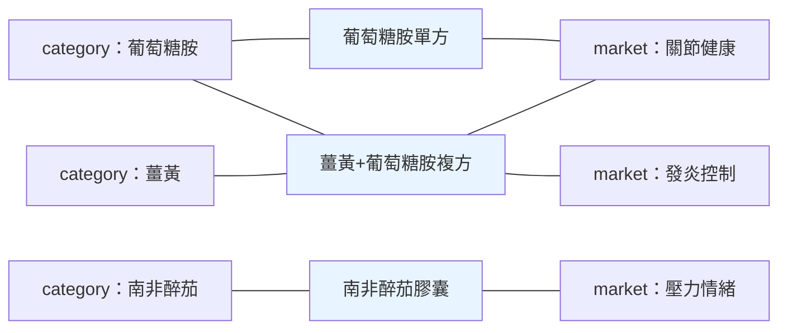

# 保健食品產業術語：看懂這個產業在講什麼

## 📋 文檔目的

你第一週會遇到這種句子：

> 「joint_health 這個 market 的 MVM dependency 偏高，排掉之後 KSM-66 的 penetration 才看得出來；不過 Official 通路那批 voice 是 0，別當成沒人買。」

每個字都認得，合起來完全不知道在說什麼。這不是你的問題——**這句話裡有六個詞是這個產業（或這套系統）的專有講法**，而它們的解釋散落在五、六份不同文件裡。

本文把這些詞集中翻成白話，讓你看得懂會議、看得懂報告。它**不是**權威定義書：每個詞的正式定義都住在各自的系統裡（見文末指路），本文只負責讓你第一次遇到時不卡住。

> **怎麼讀**：先看下面「一句話總結」的 8 個詞，那是不懂就會看不下去的最小集合。其餘章節用到再回來查。

---

## 🎯 一句話總結

| 術語 | 白話 |
|------|------|
| **Supplement Facts** | 產品標籤上那塊法規規定要標的成分表 |
| **dosage form（劑型）** | 這東西長什麼樣：膠囊、錠劑、軟糖、粉末 |
| **MVM** | 綜合維他命。成分多到會污染幾乎所有統計，分析時常要排掉 |
| **BI / BT / BP** | 三種「被品牌化」的東西：成分本身 / 製程技術 / 產地來源 |
| **market（功能市場）** | 依**消費者想解決什麼問題**切出來的市場，如關節健康、壓力情緒 |
| **category（品類）** | 依**含哪個成分**切出來的分類，如薑黃、南非醉茄 |
| **voice** | 消費者注意力的代理指標，實際上是評論數加總 |
| **penetration（滲透率）** | 某個東西在它「有資格出現」的產品裡，實際出現的比例 |

---

## 1. 先看懂一張產品標籤

所有資料最終都來自一張貼在瓶子上的標籤。標籤分兩塊，**這兩塊的意義完全不同**，但新人很容易混為一談。

| 詞 | 白話 | 為什麼重要 |
|---|---|---|
| **Supplement Facts** | 法規強制標示的成分表，列出每份含哪些活性成分、各多少 mg | 我們資料庫裡絕大多數成分分析都來自這一塊 |
| **Other Ingredients** | 這塊**不在**上表裡的東西：膠囊殼、賦形劑、色素、抗結塊劑 | 名字叫「其他」，但它決定了素食者能不能吃、會不會有過敏原 |
| **serving size（每份用量）** | 「一份」是幾顆。可能是 1 顆，也可能是 3 顆 | 比較劑量時**一定要看**——A 牌一顆 500mg、B 牌一份 500mg 但一份 3 顆，兩者差三倍 |
| **dosage form（劑型）** | 膠囊 / 錠劑 / 軟膠囊 / 軟糖 / 粉末 / 液體 | 同樣的成分做成軟糖和做成膠囊，是兩種生意 |

> ⚠️ **最常見的第一週錯誤**：把 Other Ingredients 當成「不重要的雜項」。它是**載體**，不是雜項——一個宣稱純素的產品，破功通常破在這一欄的明膠膠囊。

---

## 2. 成分不是平等的：六種角色

同一個成分，放在不同配方裡扮演的角色完全不同。這是這個產業最重要、也最不直覺的一個概念——**看懂它，你才看得懂為什麼兩個「都含薑黃」的產品是完全不同的東西**。

| 角色 | 白話 | 例子 |
|---|---|---|
| **hero（主角成分）** | 消費者買這罐就是為了它，名字通常印在瓶身最大 | 一罐「薑黃膠囊」裡的薑黃 |
| **credential（背書成分）** | 品牌放它是為了**證明配方有科學根據**，不見得放足量 | 複方裡加一點有臨床試驗的品牌原料 |
| **destination（目的地成分）** | 消費者**指名要找它**才買這罐——與 credential 正好相反 | 認明 KSM-66 才買的消費者 |
| **enabler（增效成分）** | 不針對特定功效，負責提升**其他成分**的吸收率 | 黑胡椒萃取物（提高薑黃吸收） |
| **supporting（輔助成分）** | 跟主角同一個方向，幫忙加強 | 關節配方裡陪著葡萄糖胺的 MSM |
| **passenger（乘客成分）** | 存在感極低，就是配方師順手加的 | 複方裡那個誰也說不出為什麼在的成分 |

**credential 與 destination 的對立最值得記**：前者是「**品牌**拿這個成分來背書自己」，後者是「**消費者**主動來找這個成分」。同一個原料在 A 品牌是 credential、在 B 品牌是 destination，商業意義天差地遠。

> 🔀 **注意兩條軸是正交的**：上表的 enabler 例子「黑胡椒萃取物」，它的品牌化版本 BioPerine® 是第 3 節的 BI 代表例。**「在配方裡扮演什麼角色」和「有沒有被品牌化」是互不相干的兩件事**——同一個成分兩邊都要看。

配套的兩個詞：

- **clinical dose（臨床劑量）**：經臨床試驗驗證的有效劑量。
- **below-clinical dose（低於臨床劑量）**：明顯低於上者的**象徵性添加**——目的是讓標籤上多一個成分名，不是讓它起作用。這在複方產品裡非常普遍，不是弊端指控，是產業常態，但寫報告時必須點出來。

還有一組描述「配方有多複雜」的機械分類：

| 詞 | 定義 |
|---|---|
| **simple** | 成分數 ≤ 5 |
| **moderate** | 成分數 6–20 |
| **complex** | 成分數 21+ |

由此衍生兩個常用指標：**standalone rate**（成分數 ≤5 的產品在該品類的佔比，衡量一個成分被「當主角賣」的程度）、**identity dilution（身份稀釋）**（一個品牌原料被丟進 complex 產品裡，在標籤上被其他二十個成分淹沒）。

---

## 3. 三種「被品牌化」的標記：BI / BT / BP

一般成分（薑黃、南非醉茄）沒有商標，誰都能用。但產業裡有一整套**被註冊成商標的東西**，它們是原料商的生意核心。分三種：

| 縮寫 | 全稱 | 品牌化的是什麼 | 例子 |
|---|---|---|---|
| **BI** | Branded Ingredient | **成分本身**——特定萃取規格、特定產地的原料 | BioPerine®（黑胡椒萃取）、KSM-66（南非醉茄） |
| **BT** | Branded Technology | **製程或遞送技術** | Phytosome®、TRAACS®、LipoSomax®、BakeShure® |
| **BP** | Branded Provenance | **來源、產地或栽培方式** | Albion®、AjiPure®、Aquamin®、Rosell® |

> ⚠️ **「技術」與「技術的商標」是兩件事**：`liposomal`（微脂體）、`chelation`（螯合）、`sustained-release`（緩釋）**不是 BT**——它們是**技術類型的枚舉值**，誰都能這樣做、誰都能這樣寫。BT 是**做這件事的那個註冊名**：Phytosome® 是一種特定的微脂體／植物複合體技術、TRAACS® 是一套特定的螯合規格。
>
> 這個區分在資料模型裡看得很清楚：**技術類型是一個枚舉欄位**（微脂體遞送、螯合、微膠囊化⋯誰用都填同一個值），**商標則是一筆自己的資料**（有擁有者、有註冊狀態）。**枚舉值回答「這是哪類技術」，商標回答「這是誰家的」——後者才是 BT。**
>
> 同一條線也適用於 BP：`Organic India®` 常被當成 BP 的例子，但它其實是一個**品牌**，不是產地商標——「有機」是栽培方式的宣稱，誰都可以宣稱，不是某一家獨有的來源標記。

> ⚠️ **命名沿革陷阱**：BI 以前叫 **PI（Proprietary Ingredient）**，舊文件、舊欄位名、舊報告裡到處都是 PI。**兩者指同一件事**，看到 `pi_landscape`、`pi_gap`、`PI penetration` 不要以為是另一個概念。

相對於這三種標記，**generic（通用配方）** 指的是完全不含任何 BI 的產品。

還會遇到 **owner（原料商 / 品牌擁有者）** 與 **strain（菌株）** 兩個詞——前者是擁有某個 BI 的公司（注意它跟**產品品牌**是兩件事），後者是益生菌專有的層級概念。兩者的正規化規則見下方指路。

> 📌 三型商標的正式定義、schema 版本與實際筆數，以及 owner / strain 的正規化，見 [eidos.md](../projects/alchemymind/eidos.md)——**本節只做白話對照，不是定義書**。

---

## 4. 認證標章：兩種完全不同的東西

標籤上那一排標章，dashboard 上是 `Certification` 這個維度。新人最容易犯的錯是**把它們當成同一類東西**——實際上分兩種，回答的是完全不同的問題。

### 品質驗證標章：「這罐裡面真的是它說的東西嗎？」

| 標章 | 誰給的 | 驗什麼 |
|---|---|---|
| **USP Verified** | [United States Pharmacopeia（美國藥典）](https://www.usp.org/verification-services/verified-mark) | 成分與標示相符（含**宣稱效價與含量**）、不含**有害含量**的指定污染物（重金屬、微生物、農藥等） |
| **NSF Certified** | NSF International | 內容物與標示相符、污染物無不安全含量；[**NSF Certified for Sport**](https://www.nsfsport.com/our-mark.php) 另外檢驗 **290 種**運動禁藥 |
| **GMP / cGMP** | 稽核機構依 FDA 規範（[21 CFR Part 111](https://www.govinfo.gov/content/pkg/CFR-2023-title21-vol2/xml/CFR-2023-title21-vol2-part111.xml)）查廠 | 製造流程、品管、紀錄是否合規 |

> ⚠️ **USP / NSF 與 GMP 是不同性質**：USP / NSF 是**第三方獨立驗證**某批產品達標並掛標章；GMP 稽核的是**製造商有沒有一套合規的品管與檢驗流程**。
>
> 常見的簡化說法是「GMP 查工廠不查產品」，但**這不完全準確**——21 CFR Part 111 也強制廠商對成分與成品做鑑別、純度、組成、污染物檢驗。差別在那是**廠商自檢**，不是第三方替你確認。所以 GMP 合規**不等於**某罐產品的含量被獨立驗證過。

> 📌 **USP Verified 的邊界**：USP 官方對這個標章的表述是「**what's on the label is what's in the bottle**」（標示寫什麼、瓶裡就是什麼）——**驗證範圍到此為止**。它處理的是「這罐東西是不是它說的東西」，不是「這個成分對你有沒有效」，也不涵蓋藥物交互作用或禁忌症。看到標章不等於看到療效背書。

### 消費者訴求標章：「這罐符合我的價值選擇嗎？」

| 標章 | 誰定的 | 意思 |
|---|---|---|
| **USDA Organic** | **政府法規**（[7 CFR Part 205](https://www.govinfo.gov/content/pkg/CFR-2023-title7-vol3/xml/CFR-2023-title7-vol3-part205.xml)，美國農業部） | 原料依有機農法生產 |
| **Non-GMO** | **民間非營利**（[Non-GMO Project](https://www.nongmoproject.org/butterfly-label/)） | 依循迴避基改原料的驗證流程 |
| **Vegan / 純素** | **民間非營利**（如 [Vegan Action 的 Certified Vegan](https://vegan.org/certification)） | 兩個條件缺一不可：**不含動物來源成分或副產品**、且**未經動物實驗**——成分那半**膠囊殼是最常破功的地方**（明膠來自動物，需改用植物性 HPMC） |

> ⚠️ **這三個標章的權威等級不一樣**：USDA Organic 是**政府法規標準**，Non-GMO 與 Vegan 是**民間第三方驗證**。混在同一排標章裡看起來對等，法規地位完全不同。
>
> 而且 Non-GMO Project 官方自己澄清：這個標章**不等於「保證不含 GMO」**——受檢測與污染風險限制，做不到法律或科學上站得住腳的 GMO-free 宣稱，它保證的是「依循了迴避 GMO 的最佳實踐流程」。

**兩者的差別很重要**：品質驗證標章回答「**這罐是不是它說的東西**」，消費者訴求標章回答「**合不合我的價值觀**」。一罐有機非基改的產品，**完全可能沒有做過任何含量驗證**；反過來也成立。

> ⚠️ 注意**兩種標章都不回答「有沒有效」**。整排標章沒有一個是療效背書——功效宣稱受法規管制，那是下一節的事。

> 🔭 **你剛剛體驗過的東西有名字**：這一節你其實做了三次同一件事——問「這罐是不是它說的東西」、問「合不合我的價值觀」、問「有沒有效」，然後發現**這三個問題誰也推導不出誰**（有機非基改的產品完全可能沒做過含量驗證，反過來也成立）。
>
> 這種「彼此獨立、必須分開問」的分類軸，在資料建模裡叫 **facet（分面）**，而「誰也推導不出誰」這個性質叫**正交性**。它不是保健食品專有的概念，換成汽車零件、書店庫存都成立，所以收在姊妹作裡：[classification-terminology.md](./classification-terminology.md) §1 有完整教學，包含為什麼這種軸不能塞進一棵分類樹、以及硬塞會出什麼事。**先體驗、後命名——你已經走完前半段了。**

---

## 5. 法規環境：為什麼所有宣稱都寫得那麼含糊

看多了產品文案你會發現一件怪事：所有產品都在講「支持」「幫助維持」「有助於」，沒有一個敢說「治好」。**這不是廠商在打混，是法規畫的線。**

### structure-function claim（結構功能宣稱）

美國把膳食補充劑歸類為**食品**而非藥品（依據 1994 年的 DSHEA 法案，[21 U.S.C. §321(ff)](https://www.law.cornell.edu/uscode/text/21/321)），因此：

| 可以說 | 不可以說 |
|---|---|
| 「支持關節健康」 | 「治療關節炎」 |
| 「幫助維持正常免疫功能」 | 「預防流感」 |
| 「有助於入睡」 | 「治療失眠」 |

左欄叫 **structure-function claim**——描述成分對身體**結構或功能**的作用。右欄叫 **disease claim**（疾病宣稱，定義見 [21 CFR 101.93(g)](https://www.law.cornell.edu/cfr/text/21/101.93)），一旦跨線，產品在法規上就變成「未核准的新藥」，違反 [21 U.S.C. §355(a)](https://www.law.cornell.edu/uscode/text/21/355)。

> 💡 **「有助於入睡」vs「治療失眠」為什麼是這條線最典型的例子**：依 [21 CFR 101.93(g)](https://www.law.cornell.edu/cfr/text/21/101.93) 的判準，宣稱落在「疾病的**診斷、緩解、治療、治癒或預防**」（原文 *diagnose, mitigate, treat, cure, or prevent*）就是 disease claim。失眠（insomnia）是可診斷的病症，「治療失眠」直接落入該範圍。**分界不在用詞客氣不客氣，在於指涉的對象是不是一個病。**
>
> ⚠️ 至於「偶發性難以入睡（occasional sleeplessness）」被視為**非疾病的日常狀態**、因而「有助於入睡」仍屬結構功能宣稱——這個定位出自 **FDA 的規則制定說明與指引**，**不在 101.93 的法條文字裡**。引用時請注意這兩者層級不同。

配套規則：打了 structure-function claim 的產品，標籤必須附上免責聲明（[21 CFR 101.93(c)](https://www.law.cornell.edu/cfr/text/21/101.93)，**逐字規定、不得自行改寫**）——

> "This statement has not been evaluated by the Food and Drug Administration. This product is not intended to diagnose, treat, cure, or prevent any disease."
>
> 「本聲明未經 FDA 評估。本產品非為診斷、治療、治癒或預防任何疾病之用。」

（多重宣稱時開頭改為 "These statements..."）

### 這件事為什麼跟你的工作有關

1. **它決定了整批宣稱資料的形狀** —— 我們資料庫裡的功效宣稱之所以全是「支持 / 促進 / 維持」這種模糊句型，源頭就是這條線。看到宣稱寫得含糊，那是合規，不是資料品質問題。
2. **上市前多半不需要 FDA 核准** —— 補充劑不像藥品要做上市前審查。所以「這個成分有沒有效」跟「這罐能不能賣」是兩件事，市場上同時存在證據充分與證據薄弱的產品。

   ⚠️ **一個例外：NDI（New Dietary Ingredient，新膳食成分）**。1994-10-15 之後才引入市場的成分，業者必須在上市前至少 **75 天**向 FDA 提交安全性通報（[21 U.S.C. §350b](https://www.law.cornell.edu/uscode/text/21/350b)）。這是「**通報**」不是「核准」——FDA 不發許可證，但仍是一道上市前程序。所以「補充劑完全不需上市前審查」這個說法對舊成分成立、對新成分不成立。
3. **它解釋了 BI 存在的商業理由** —— 既然不能宣稱療效、又不需審查，品牌要證明自己「有科學根據」，最省事的辦法就是採用有臨床試驗的品牌原料（第 3 節的 BI）。這正是 credential ingredient（第 2 節）的由來。

> 🔗 **本節與第 4 節的法規連結指向哪裡**：美國法典與 CFR 條文連的是 **Cornell Law School LII**（`law.cornell.edu`），CFR 全文連的是 **govinfo.gov**（美國政府出版局官方版，2023 年版快照）。兩者都是法規原文重製、不是二手整理，但**要引用到正式文件時，請回查 [eCFR](https://www.ecfr.gov/) 的現行版**——法規會修，快照不會。

---

## 6. 市場是怎麼被切的

這裡有一組**日常可以互換、但本專案嚴格區分**的詞。這是最容易誤會的一組：

| 詞 | 依什麼切 | 一個產品可以屬於幾個 |
|---|---|---|
| **market（功能市場）** | 消費者**想解決什麼問題**（benefit-defined） | 多個 |
| **category（品類）** | **含哪個成分**（ingredient-defined） | 只要含該成分就算 |

例：一罐「薑黃 + 葡萄糖胺」複方，在 category 上屬於薑黃**也**屬於葡萄糖胺；在 market 上可能同時出現在關節健康與發炎控制。

**同一批產品，兩套切法各切各的**——同一罐可以往兩邊各拉出多條線：

左邊是 **category（依成分切）**、右邊是 **market（依消費者問題切）**。看那罐複方：**往左兩條線、往右兩條線**，四邊都算它一份。

> ⚠️ **這就是「兩張表的百分比加不起來」的根源**（見第 11 節第 ① 問）。同一罐產品在多個 market 各被計一次，各 market 的產品數加總**一定大於**實際產品數。看到佔比時先問：分母是「不重複產品數」還是「各市場計次總和」。

- **functional market（功能市場）** = 上表的 market，只是講法不同。專案目前有 **24 個**。
- **demand cluster（需求分群）**：把 24 個 market 按消費者需求語意再往上收成幾個高階群組。

---

## 7. voice：把「消費者注意力」變成一個數字

**voice** 是這套系統最常出現的指標，也是最容易被誤解的。

> **voice = Amazon 的評論數 + iHerb 的評分數**

它是消費者注意力的**代理指標**——概念上接近「討論度」，但資料上就是評論數加總。

> 🔍 **為什麼一邊算評論、一邊算評分？** 這不是筆誤，是兩個平台給的東西本來就不一樣：Amazon 分得出「留了文字評論的人」與「只打星等的人」，iHerb 只給得出後者。加總是**實務上的折衷，不是嚴格的同質相加**。
>
> 這是跨平台指標的通例：**能加在一起，不代表加的是同一種東西**。看到任何跨來源合併的數字，先問各來源給的是不是同一種粒度。

**它不是**：不是銷售額、不是市佔率、不是媒體聲量（share of voice）、不是質性回饋（voice of customer）。

⚠️ **一定要記的一件事**：有兩種通路的產品 **voice 永遠是 0**——不是沒人買，是**那些通路根本沒有評論資料**。把 0 讀成「乏人問津」是新人最常犯的錯。

| 通路 | 是什麼 | 為什麼是 0 |
|---|---|---|
| **Official** | 品牌官網 | 官網不收消費者評論 |
| **Regulation** | 法規資料庫（DSLD 那類） | 那是政府的標籤登錄資料，本來就沒有評論欄位 |

**這叫 by construction 的 0** ——不是量到 0，是那個欄位在那條通路上根本不存在。看到 0 之前先問一句：**這是「量了，結果是零」，還是「這裡本來就量不到」？** 兩者在圖上長得一模一樣，意思天差地遠。

由 voice 衍生的兩個指標，差別要分清：

| 指標 | 算法 | 白話 |
|---|---|---|
| **voice density（聲量密度）** | voice 佔比 ÷ 產品數佔比 | **相對值**。>1 = 用比較少的產品拿到超額注意力 |
| **VPP（Voice Per Product）** | voice 總量 ÷ 產品數 | **絕對值**。平均每個產品帶來多少評論 |

---

## 8. penetration：一個成分鋪得多廣

**penetration（滲透率）** 指某個 BI 在「有資格含它的產品」裡實際出現的比例（<10% 低、10–20% 中、>20% 高）。

⚠️ 講 penetration **一定要講分母**——「有資格出現」的範圍怎麼定，數字就跟著變。同一個成分換一個母體，可以從「低滲透」變成「高滲透」。

**pi_gap** 則是滲透率與 voice 佔比的落差：一個成分**鋪得廣**（penetration 高）不代表**被討論得多**（voice 佔比高），兩者的差距正是商業機會或警訊所在。

> 📌 penetration 屬於 BI 家族（第 3 節），不是 voice 家族——只是計算 pi_gap 時要跟 voice 佔比放在一起看。

---

## 9. MVM 與 macronutrient：為什麼分析常常要「排掉」

**MVM = Multi-Vitamin/Mineral（綜合維他命）**。

它不是一種普通產品，是**統計的污染源**：一罐綜合維他命動輒含三、四十種成分，於是幾乎每個成分的「滲透率」都被它灌水。所以你會常看到分析加了排除條件、參數名叫 `exclude_mvm` 之類的東西——**那不是在隱藏資料，是在還原真實的成分採用率**。

衍生詞 **MVM dependency（MVM 依賴度）**：某個市場有多少比例是靠綜合維他命撐起來的。這個數字高，代表該市場的成分分析要特別小心。

同理還有 **macronutrient（巨量營養素）**——蛋白質、脂肪、碳水這類，相對於 vitamin / mineral 這些微量營養素。分析功能性成分時通常也會排掉。

### 先把三組成分講清楚

「排除 vitamin / mineral」這條規則常出現，但前提是你知道它們各是什麼：

| 分組 | 是什麼 | 為什麼分析時常被排除 |
|---|---|---|
| **vitamin（維生素）** | 身體無法自行合成、必須攝取的有機化合物（A、B 群、C、D、E、K…） | **幾乎每罐都有**。留著會淹沒真正的差異——就像分析餐廳特色時把「有提供水」也算進去 |
| **mineral（礦物質）** | 身體需要的無機元素（鈣、鎂、鋅、鐵…） | 同上；且綜合產品往往一次含十幾種 |
| **functional ingredient（功能性成分）** | **排除上面兩組之後**的成分：草本萃取、益生菌、胺基酸、特殊化合物 | 這才是品牌之間真正拉開差距的地方 |

換句話說，**functional ingredient 是一個「減法定義」**——它不是一類有共同性質的東西，而是「扣掉基礎營養素後剩下的」。所以看到這個詞，要先確認扣掉的是哪些。

> 🔀 **同形異義提醒**：**macro** 這個字在我們的文件裡至少有四個意思。**本文脈絡只指「巨量營養素 macronutrient」**；程式的「巨集」、經濟學的「總體」是另外的意思，而「巨觀 / 微觀層次」那一義在 [emergence-data-compute.md](./emergence-data-compute.md) 有完整討論。**四義的正式消歧在 [classification-terminology.md](./classification-terminology.md) 第 7 節**。看到 macro 先確認脈絡。

---

## 10. 資料是從哪裡來的：一堆縮寫

看 dashboard 或跟資料團隊講話時會撞到這些：

| 縮寫 | 是什麼 |
|---|---|
| **DSLD** | 美國 NIH 膳食補充劑辦公室（ODS）維護的補充劑標籤資料庫，收錄各產品的標籤原文 |
| **LanguaL** | 一套國際食品描述的分類編碼系統，DSLD 用它來標劑型 |
| **facet（分面）** | LanguaL 用來切分類的**軸**——同一個產品可以同時被好幾個 facet 描述，彼此不衝突。DSLD 的劑型就標在 **Facet A**。發音近 /ˈfæsɪt/（「花-sit」，不是「法-sei」）。⚠️ **本文只講 LanguaL 脈絡**；facet 當通用邏輯概念（正交性、為什麼不能塞成一棵樹）見 [classification-terminology.md](./classification-terminology.md) §1 |
| **UNII** | FDA 給每個成分的唯一識別碼，用來跨系統對齊「這兩個名字是不是同一個成分」 |
| **ASIN** | Amazon 的商品編號 |
| **UPC** | 商品條碼，實體零售的通用識別碼 |

另外，產品 ID 開頭那個字母標的是**這筆資料從哪裡來**（Amazon、iHerb、品牌官網⋯）。

> ⚠️ **「從哪裡抓到的」不等於「它在哪裡賣」**，也不等於這個賣家的商業角色——那是兩條互相推導不出來的軸（見第 11 節第 ④ 問）。

---

## 11. ⚠️ 看數字之前先問的五個問題

前面十節講的是「這個詞是什麼意思」。這一節講的是**看到一個數字時的反射動作**——五個問句，每一個都對應一種實際發生過的誤讀。

它們跟這個產業無關，換個題目照樣成立；欄位名只是舉例，換一套系統就變了，**留下的應該是問句本身**。

### ①「這個百分比的分母是什麼？」

同一個名字的比例欄位，在不同的表裡母體可能完全不同——所以**兩張表的百分比常常加不起來**，不是算錯。

更常見的是分母根本不唯一：一罐複方產品同時屬於好幾個功能市場（見第 6 節），各市場的產品數加總**一定大於**實際產品數。看到佔比先問：分母是「不重複的東西有幾個」，還是「各群各數一次的總和」？

> 🔗 這就是分類體系文說的「**補集必須先講定全集**」——分母就是全集。（[classification-terminology.md](./classification-terminology.md) 第 4 節）

### ②「這個數量去重了嗎？」

同一罐產品在 Amazon 和 iHerb 各有一筆紀錄，**資料庫裡就是 2**。有些欄位算的是「紀錄數」，有些算的是「不重複的產品數」，名字上不一定看得出來（例如 `listing_count` 這種名字，算的是紀錄）。

**「幾筆」跟「幾個」是兩件事。** 講數量時把哪一種講清楚，比講出精確數字更重要。

### ③「這個 0 是量到的，還是量不到？」

見第 7 節：某些通路的 voice 恆為 0，因為那條通路根本沒有評論資料。**在圖上，「真的沒人買」跟「這裡量不到」長得一模一樣。**

同理適用於任何空值：欄位是空的，可能是「查過，沒有」，也可能是「沒查過」。

### ④「這兩個欄位是不是被我當成同一件事了？」

最典型的一組：**資料是從哪裡抓來的**（技術來源）跟**這個賣家在商業上扮演什麼角色**（通路角色）——它們是**兩條互相推導不出來的軸**，也就是分類體系文說的兩個 facet。從 Amazon 抓到的不見得是 Amazon 自營，從品牌官網抓到的也不保證是品牌直營。

看到兩個欄位「感覺很像」，先問一句：**其中一個能不能算出另一個？** 不能，就別互推。

### ⑤「這個詞在這裡是哪個意思？」

同一個詞在不同語境指不同的東西，最常見的是「**覆蓋率**」：可以指「某個欄位有資料的產品佔多少」，也可以指「某個東西涵蓋了幾個市場或品類」。兩者都叫覆蓋率，數字卻不相干。

**規矩很簡單：不准裸寫「覆蓋率」，一定要講完整是哪一種。** 這條推廣到任何多義詞都成立——包括第 9 節的 macro。

> 💡 **還有一個不是問句、但要記住的**：金額欄位常以**分（cents）為單位**存放，直接當成元來讀會差 100 倍；而且要分清是每包裝、每份、還是每單位的價格。**講價格必須標明基準。**

---

## 12. 中文對應建議

| 英文 | 建議中文 | 備註 |
|---|---|---|
| voice | 聲量 | 不要譯成「聲音」 |
| voice density | 聲量密度 | 相對值 |
| penetration | 滲透率 | 首次提及必須講清楚分母 |
| dosage form | 劑型 | — |
| facet | 分面 | 依國教院《圖書館學與資訊科學大辭典》「分面式分類法」。**專名 `Facet A` 不譯**。泛用義見 [classification-terminology.md](./classification-terminology.md) §1 |
| Branded Ingredient (BI) | 品牌原料 | 舊稱 PI / 專利成分 |
| Branded Technology (BT) | 品牌化技術 | — |
| Branded Provenance (BP) | 品牌化產地 | — |
| market | 功能市場 | 依需求切 |
| category | 品類 | 依成分切 |
| hero ingredient | 主角成分 | — |
| clinical dose | 臨床劑量 | — |
| MVM | 綜合維他命 | — |
| certification | 認證標章 | 第 4 節。不要譯成「證書」——它指標籤上那排標記 |
| structure-function claim | 結構功能宣稱 | **法規用語，勿自創譯法**。與下一列是法規上界線分明的對立詞 |
| disease claim | 疾病宣稱 | **法規用語，勿自創譯法**。跨線即「未核准新藥」，見第 5 節 |

---

## 🔗 相關文檔

**站內延伸**

- [classification-terminology.md](./classification-terminology.md) —— 姊妹作：分類體系術語（taxonomy / facet / set / macro⋯）。分界線：能搬到別的產業的在那篇，只在保健食品成立的在本文
- [ai-data-terminology.md](./ai-data-terminology.md) —— 家族第三份：AI / 資料術語（infer / derive / reasoning）
- [../roles/testing/01_product-understanding.md](../roles/testing/01_product-understanding.md) —— 測試角色的產品理解（本文補的正是它「資料維度」那節沒展開的產業語意）
- [../data-sources/dsld/dsld_database_guide.md](../data-sources/dsld/dsld_database_guide.md) · [../data-sources/data-sources-guide.md](../data-sources/data-sources-guide.md) —— DSLD 與各資料來源的欄位說明

**外部權威**

- 法規原文：[21 CFR 101.93](https://www.law.cornell.edu/cfr/text/21/101.93)（宣稱規則）、[21 CFR Part 111](https://www.govinfo.gov/content/pkg/CFR-2023-title21-vol2/xml/CFR-2023-title21-vol2-part111.xml)（GMP）。**正式引用請回查 [eCFR](https://www.ecfr.gov/) 現行版**——法規會修，本文連的是快照
- 認證機構官網：[USP](https://www.usp.org/verification-services/verified-mark) · [NSF for Sport](https://www.nsfsport.com/our-mark.php) · [Non-GMO Project](https://www.nongmoproject.org/butterfly-label/) · [Certified Vegan](https://vegan.org/certification)

**各系統的正式定義**

本文只做白話入口，**每個指標的精確公式、閾值與使用限制住在各自的系統裡**——站內導覽見 [thejournalism.md](../projects/prismavision/thejournalism.md)（指標與詞彙）與 [eidos.md](../projects/alchemymind/eidos.md)（品牌原料與菌株）。需要到欄位層級的定義時，請直接問工程團隊或讀該 repo 的文件（需要存取權）。

---

## 📝 文檔維護

### 版本歷史

| 版本 | 日期 | 作者 | 變更說明 |
|------|------|------|----------|
| 0.1 | 2026-07-28 | Dustin | 初稿（issue #5） |
| 1.0 | 2026-08-13 | leana | 定案：外部法規與認證來源逐條複驗；「六個數字陷阱」改寫為「看數字前先問的五個問題」（欄位名降為舉例，留下帶得走的問句）；系統實作細節（欄位路徑、ID 前綴、公式原文）移出本文 |

---

**文檔結束**
