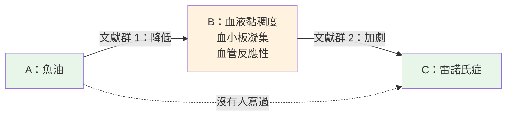

# 未被發現的公共知識：答案散在兩處，沒人同時讀到

---

[no-one-is-home](./no-one-is-home.md) 的最後一節押了一個賭注：湧現不只發生在模型的權重裡，也會發生在**資料裡**——今天沒有人看得見的東西，可能已經躺在我們累積的資料之間，等一個夠強的運算把它點亮。

那是一個賭注。這一篇講一個人在 1986 年真的從資料裡把東西挖出來的故事。他用的不是模型，是讀論文；但他看見的結構，正好是本系列前幾篇的骨架。

---

## 0. 兩疊互不往來的論文

一疊論文在講**雷諾氏症**：手指遇冷時血管過度收縮、發白發紫。病人的血液偏黏稠、血小板容易凝集、血管反應過強。

另一疊論文在講**魚油**：吃了魚油，血液黏稠度下降、血小板凝集被抑制、血管反應變和緩。

兩疊都公開發表、都經過審查。但它們沒有共同作者、不互相引用——讀第一疊的是風濕免疫科醫師，讀第二疊的是營養與心血管研究者。於是「魚油可能改善雷諾氏症」這個推論，在邏輯上早就存在，實際上沒有任何人想過。

芝加哥大學的資訊學者 Don R. Swanson 把它寫了出來。兩年後，一個臨床團隊的試驗結果支持了它。

Swanson 從這件事裡看出的，比魚油大得多：

> **答案可能早就寫好了，只是散在兩處，從沒被同一個人讀到。**

---

## 1. 公開，不等於被知道

Swanson 同年寫了一篇論文，題目就叫〈Undiscovered Public Knowledge〉。開頭一句話把整件事說完：

> "Knowledge can be public, yet undiscovered, if independently created fragments are logically related but never retrieved, brought together, and interpreted."
>
> 知識可以是公開的，卻未被發現——只要那些各自產生的碎片在邏輯上相關，卻從沒被一起找出來、湊在一起、讀懂。

注意他怎麼定位那條推論：它**不是被遺忘的舊知識**，是真正的新知識。只是它的原料，早就攤在公共領域裡了。

為什麼「更認真地檢索」解決不了？因為**檢索永遠無法被證明是完整的**。你可以證明一次檢索漏了東西——找到一篇它該找到卻沒找到的論文；但你永遠證明不了它沒漏。這跟 Popper 說科學理論只能被否證、不能被證實，是同一個形狀。所以未被發現的知識不是誰不夠用功，是**結構性的**：只要知識分散在夠多人手上，就一定有拼圖散在桌上，沒被拼起來。

而且這種東西會越來越多。科學應付文獻爆炸的方法是**越分越細**——每個人只讀自己的專科，讀的量才追得上。但專科化恰好切斷了連結。可能的文獻配對數，大致隨文獻數的平方成長。Swanson 的說法是：

> 資訊爆炸，說到底是**連結爆炸**。

### 跟 unknown knowns 不是同一件事

[know-your-unknowns](./know-your-unknowns.md) 的四象限裡有一格 unknown knowns：你知道、但覺得理所當然而沒說的東西。乍看很像，但兩者站的位置不同：

| | Unknown knowns | 未被發現的公共知識 |
|---|---|---|
| 知識在哪 | 在**一個人**腦子裡，沒說出口 | 散在**好幾群人**寫下的文獻裡，都說出口了 |
| 用 [re-entry](./compute-state-context.md) 的話說 | 從沒進入 context | 每一塊都進過 context，但從沒進入**同一個** context |
| 解法 | 反向訪談，逼它說出來 | 把碎片並排，讓人看見中間的橋 |

前者是「沒寫下來」，後者是「寫下來了，但沒被放在一起」。

---

## 2. 答案在「之間」

把魚油的推論畫出來：



這就是後來被稱為 **ABC 模型**的形狀。B 是橋——兩邊的研究者都在講它，只是從不同方向講。

A→C 這條線，不在文獻群 1 的任何一篇裡，也不在文獻群 2 的任何一篇裡。你把兩疊論文逐篇翻遍，找不到它。它在兩疊論文**之間**。

這個句型你已經見過兩次了。[emergence 篇](./emergence-data-compute.md) §1：洞察不在任何一筆資料裡，它湧現於資料之間。[no-one-is-home](./no-one-is-home.md) §3：蟻群的智慧不在任何一隻螞蟻裡，在螞蟻之間的互動模式裡。Swanson 的發現是同一件事落在文獻上：**部件都不知道的東西，存在於部件的組合裡。**

Swanson 給這種文獻對下了兩個條件：

- **邏輯相關**：兩邊的論證接得起來，A→B 和 B→C 能串成一條推論。這只有讀過兩邊的人判斷得出來。
- **互不往來**：沒有共同的文章、不互相引用、也沒被別的文章一起引用過。這可以用檢索和引用分析確認。

第二個條件是「未被發現」的操作定義：如果已經有人同時引用了兩邊，那就代表有人站上過那座橋了。

---

## 3. 橋要是同一座橋

[同構篇](./isomorphism-projection.md) §5.1 把一條宣稱寫成三元組：`S ─[P]→ O`，主詞、謂詞、受詞。用這個寫法看，ABC 推論就是**兩條三元組串起來**：

```text
魚油   ─[降低]→  血小板凝集
血小板凝集 ─[加劇]→  雷諾氏症
───────────────────────────
魚油   ─[可能改善]→  雷諾氏症   （推論）
```

能不能串，取決於兩件事。

**第一，中間那個 B 必須是同一個東西。** 第一條的受詞和第二條的主詞，字面上都是「血小板凝集」，但營養學論文量的和風濕科論文量的，可能是不同的指標、不同的機制、不同的時間尺度。同構篇 §4.1 的「假同構」在這裡原封不動地出現：**字面像，不代表指稱同。** 兩邊的 B 只是撞名，這座橋就是假的。

**第二，方向要接得起來。** 魚油「降低」B，B「加劇」C，所以魚油「可能改善」C。如果 C 需要的其實是 B 升高，同一組論文會推出完全相反的結論。同構篇的三元組裡，謂詞本來就帶著 valence（正向或負向）；只看「兩邊都提到 B」，等於把 valence 丟掉了，而它正是推論的一部分。

這也解釋了 Swanson 為什麼一直說他的方法**不是演算法**。後來他和神經科學家 Neil Smalheiser 做了一套叫 Arrowsmith 的系統：輸入 A、C 兩組文獻，系統列出兩邊共同出現的詞當候選的 B，把兩邊的標題並排顯示，然後——交給人讀、交給人判斷。他們對它的定位是：

> 它不使用「人工智慧」，而是過濾、並排資訊，讓人更容易做出自己的專業判斷。

這正是同構篇的守則 4：**相似是線索，裁決才是判定。** 共同出現的詞是便宜的線索，用來把上萬篇論文縮小到人讀得完的範圍；「這兩個 B 是不是同一個 B、方向接不接得起來」，是要讀懂命題才做得出的裁決。Swanson 很早就認定後者沒辦法交給機器。

> 落地：[Parallax](../projects/prismavision/thejournalism-parallax.md) 做的是同一種分工——機器只標記兩本登記簿的差異、永不自動同步，決定者永遠是人。Arrowsmith 擺出來的是候選的橋，Parallax 擺出來的是對不上的欄位；兩者都把判斷留在人手上，而且是刻意的。

---

## 4. 推得出來，不等於是真的

橋是同一座、方向也接得起來，A→C 仍然只是一個猜測。用 [術語篇](./ai-data-terminology.md) 的分法，它是 **inferred**（從線索推斷），不是 **derived**（從規則算出）。

Swanson 自己在相信一條推論之前，會先試著推翻它：

1. **查 A 和 C 有沒有人一起研究過。** 有，就不是未被發現的知識。他做鎂與偏頭痛時，Medline 裡偏頭痛約 4,600 篇、鎂約 38,000 篇，兩者交集只有 6 篇。
2. **查兩邊有沒有被一起引用過。** 有，就代表橋上早有人走過。

而他最成功的兩個案例，認真看都帶著限定：

- **魚油**：1988–1989 年的臨床試驗只有 32 人，魚油延緩了遇冷時的血管痙攣，但**只對原發性**雷諾氏症有效，次發性無效。而且試驗論文沒有引用 Swanson——他主張對方讀過他的文章，依據是對方的參考文獻全落在他那篇的引用範圍內。這是推論，不是證據。
- **鎂與偏頭痛**：他找出十一條間接關聯，從血管張力、擴散性皮質抑制到血小板活性。但鎂與偏頭痛的關係，Altura 在 1985 年已經提過，更早還有零星的臨床記述。Swanson 後來承認，這個案例有一部分是「把已存在卻幾乎查不到的證據挖出來」，不全是預測。

他對這些限定的態度很坦白：每個案例的生理假說最後是對是錯，**是次要的**；他要證明的是這種結構存在、而且可以被系統性地找出來。

這和 [emergence 篇](./emergence-data-compute.md) §6 是同一個教訓：資料夠多的時候，模式一定會出現，包括假的。那篇給了三個問題（換一批資料還在嗎、有沒有更無聊的解釋、效應大小值得行動嗎），也說了我們架構裡的 TheArgus 就是這道免疫系統。Swanson 的兩道檢驗做的是同一件事——**一個發現被當真之前，先試著把它擋下來。**

---

## 5. 我們站在哪裡

回頭看那兩個案例的 A：魚油、鎂。**兩個都是保健食品成分。**

Swanson 的經典案例，落在的正是我們每天處理的領域。把 ABC 的三個角放到我們的系統上：

| 角 | 是什麼 | 在哪裡 |
|---|---|---|
| **A** | 成分 | DSLD 標籤、產品配方——我們手上 |
| **C** | 健康訴求、功效市場 | 產品頁宣稱、市場切法——我們手上 |
| **B** | 生理機制 | 學術文獻——不在我們手上 |

[Tension 篇](./tension-value-perspective.md) §5 列 B 端角色時，學術端那一列問的是：「成分與健康宣稱之間的**實證縫隙**在哪？」這幾乎就是 ABC 的問題。[同構篇](./isomorphism-projection.md) §0 開場那兩句話——科學端說甘胺酸鎂「縮短入睡時間」，產品頁只敢說「幫助夜間放鬆」——也是同一個 A、同一個 C：科學端講的是有實證的因果，產品頁只剩被法規修剪過的氛圍。A 和 C 之間那條線有多強、靠什麼撐著，兩個世界說法完全不同——而撐住那條線的，正是 B。

同構篇講 UPC 串接時說過一句話：你不是**建立**了 DSLD 和 Keepa 之間的連結，是**發現**了本來就存在的同構。Swanson 做的是同一個動作，只是對象從產品紀錄換成了論文。連結本來就在，缺的是一個同時看見兩邊的人。

這也給 [emergence 篇](./emergence-data-compute.md) §5 的那句話補了一個理由：**你沒蒐集的東西，永遠不會湧現。** 橋只能在兩岸都存在的地方被看見。少蒐集一邊，那座橋就永遠不會出現在任何人面前——不是因為它不存在，是因為沒有人同時握著兩岸。

---

## 6. 守則

1. **兩個資料源互不往來時，先問中間有沒有橋。** 互不往來不代表無關；最值錢的連結，常常在沒人同時讀兩邊的地方。
2. **找到橋，先確認是同一座橋。** 兩邊的 B 要同指稱、謂詞方向要接得起來——字面相同只是線索。
3. **先試著推翻，再相信。** 查 A 和 C 是不是早有人做過；用 emergence 篇的三問過一遍。
4. **機器並排，人裁決；推出來的標成 inferred。** 讓機器把候選擺到人面前，判斷留給讀得懂命題的人；推論產物要標來源，不能混進事實層。

拼圖已經在桌上了。缺的是一個同時看見兩塊的人——或一個把兩塊並排擺好、等人來看的系統。

---

## 參考

閱讀程度：**〔全文〕** 讀過原文；**〔摘要〕** 只讀到摘要；**〔轉述〕** 原文未取得，內容依作者本人後續文章。Swanson 與 Smalheiser 多數論文的 PDF，由作者團隊公開在 [Arrowsmith 專案頁](https://arrowsmith.psych.uic.edu/arrowsmith_uic/tutorial/)。

- Swanson, D. R. (1986). Undiscovered public knowledge. *The Library Quarterly*, 56(2), 103–118. [doi:10.1086/601720](https://doi.org/10.1086/601720) **〔全文〕** —— 第 1 節的論證來源；開頭引文見 p.103。
- Swanson, D. R. (1986). Fish oil, Raynaud's syndrome, and undiscovered public knowledge. *Perspectives in Biology and Medicine*, 30(1), 7–18. [doi:10.1353/pbm.1986.0087](https://doi.org/10.1353/pbm.1986.0087) **〔轉述〕** —— 原文在付費牆後；第 0 節依 Swanson 1986 LQ、1990、1993 的轉述。
- Swanson, D. R. (1988). Migraine and magnesium: eleven neglected connections. *Perspectives in Biology and Medicine*, 31(4), 526–557. [doi:10.1353/pbm.1988.0009](https://doi.org/10.1353/pbm.1988.0009) **〔全文〕** —— 兩個條件的定義（p.526）、AC 交集（p.528）、十一條關聯（pp.545–546）、「連結爆炸」與「對錯是次要的」（p.549）。
- Swanson, D. R. (1990). Medical literature as a potential source of new knowledge. *Bulletin of the Medical Library Association*, 78(1), 29–37. [PMC225324](https://www.ncbi.nlm.nih.gov/pmc/articles/PMC225324/) **〔全文〕** —— 「不是演算法」（p.31）、共被引檢驗。
- Smalheiser, N. R., & Swanson, D. R. (1998). Using ARROWSMITH: a computer-assisted approach to formulating and assessing scientific hypotheses. *Computer Methods and Programs in Biomedicine*, 57(3), 149–153. [doi:10.1016/S0169-2607(98)00033-9](https://doi.org/10.1016/S0169-2607(98)00033-9) **〔全文〕** —— 第 3 節的定位引文（p.153）。
- DiGiacomo, R. A., Kremer, J. M., & Shah, D. M. (1989). Fish-oil dietary supplementation in patients with Raynaud's phenomenon. *The American Journal of Medicine*, 86(2), 158–164. [doi:10.1016/0002-9343(89)90261-1](https://doi.org/10.1016/0002-9343(89)90261-1) **〔摘要〕**
- Smalheiser, N. R. (2017). Rediscovering Don Swanson: The past, present and future of literature-based discovery. *Journal of Data and Information Science*, 2(4), 43–64. [PMC5771422](https://www.ncbi.nlm.nih.gov/pmc/articles/PMC5771422/) —— 想往下讀的入口：Swanson 的工作，以及之後「文獻探勘發現」（literature-based discovery）這個領域怎麼發展。

註：Keepa 文件與 TheJournalism 報告裡的「Swanson」是保健食品品牌 Swanson Health Products，與 Don R. Swanson 無關。

## 相關文檔

- [no-one-is-home.md](./no-one-is-home.md) - 湧現在耦合裡：本篇是它 §7「湧現也在資料裡」的實證
- [isomorphism-projection.md](./isomorphism-projection.md) - 三元組、假同構、「相似是線索，裁決才是判定」：本篇第 3 節的骨架
- [emergence-data-compute.md](./emergence-data-compute.md) - 洞察在資料之間（§1）、沒蒐集的不會湧現（§5）、假湧現三問（§6）
- [know-your-unknowns.md](./know-your-unknowns.md) - Unknown knowns：容易和本篇混淆的另一種「看不見」
- [tension-value-perspective.md](./tension-value-perspective.md) - 學術端的問題：成分與宣稱之間的實證縫隙
- [ai-data-terminology.md](./ai-data-terminology.md) - Inferred vs Derived：ABC 推論屬於哪一種
- [../projects/prismavision/thejournalism-parallax.md](../projects/prismavision/thejournalism-parallax.md) - 機器標記、人決定：同一種人機分工

---

## 📝 文檔維護

### 版本歷史

| 版本 | 日期 | 作者 | 變更說明 |
|------|------|------|----------|
| 1.0 | 2026-10-08 | Dustin | 初版建立：依原始論文整理 Swanson 的論證與兩個案例，接上同構篇的三元組與假同構 |

---

**文檔結束**
