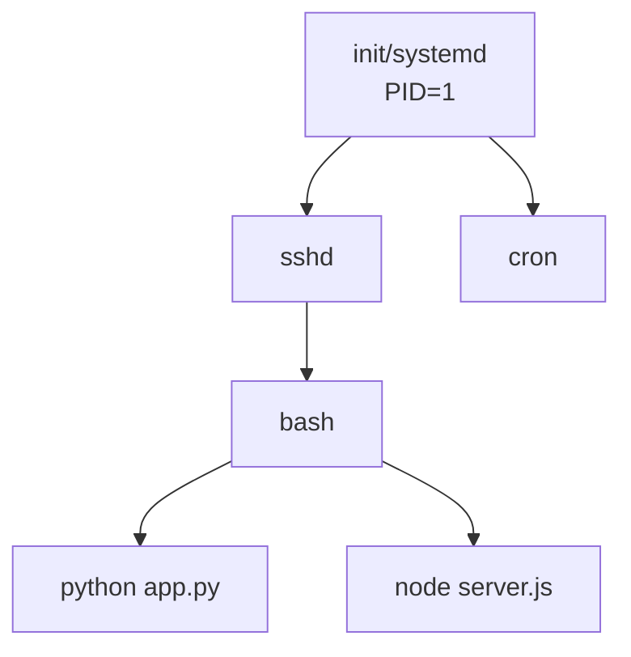

# Unix/Linux 基礎入門 - 給 Windows 使用者

**版本**: 1.0
**更新日期**: 2025-11-10
**適用對象**: 習慣 Windows 的使用者，第一次接觸 Unix/Linux 系統

---

## 概述

如果你習慣使用 Windows 的圖形介面，第一次接觸 Unix/Linux 可能會覺得陌生。這份文件將幫助你理解 Unix/Linux 的核心概念，特別是 **檔案導向哲學** 和 **命令列操作**。

**學習目標**:
- 理解 Unix/Linux 與 Windows 的根本差異
- 掌握「一切皆檔案」的概念
- 能夠使用 Shell 進行基本操作
- 理解檔案路徑、權限、Process 等核心概念

---

## 目錄

- [1. Unix/Linux 是什麼？](#1-unixlinux-是什麼)
- [2. 核心概念：Everything is a File](#2-核心概念everything-is-a-file)
- [3. Shell、Terminal、Console 的區別](#3-shellterminalconsole-的區別)
- [4. 檔案系統與目錄結構](#4-檔案系統與目錄結構)
- [5. 基本命令操作](#5-基本命令操作)
- [6. 檔案權限管理](#6-檔案權限管理)
- [7. Process（進程）概念](#7-process進程概念)
- [8. 環境變數與 PATH](#8-環境變數與-path)
- [9. 常見問題](#9-常見問題)

---

## 1. Unix/Linux 是什麼？

### 1.1 歷史與哲學

**Unix**:
- 1969 年由 AT&T Bell Labs 開發
- 設計哲學：簡潔、模組化、可組合

**Linux**:
- 1991 年由 Linus Torvalds 創建
- 開源的 Unix-like 作業系統
- 廣泛應用於伺服器、雲端、Android 手機

**核心哲學**:
```
1. 一切皆檔案 (Everything is a file)
2. 小工具組合成大功能 (Do one thing well)
3. 文字是通用介面 (Text streams)
4. 避免使用者介面 (Avoid captive interfaces - 偏好命令列)
```

### 1.2 與 Windows 的對比

| 特性 | Windows | Unix/Linux |
|------|---------|------------|
| **介面** | 圖形介面為主 (GUI) | 命令列為主 (CLI) |
| **檔案系統** | 多個磁碟機 (C:, D:) | 單一根目錄樹 (/) |
| **路徑分隔符** | 反斜線 `\` | 正斜線 `/` |
| **大小寫** | 不區分 | 區分大小寫 |
| **副檔名** | 依賴副檔名 | 不依賴副檔名 |
| **權限** | ACL 為主 | Unix 權限 (rwx) |
| **哲學** | 整合的套裝軟體 | 小工具組合 |

**範例對比**:

```bash
# Windows 路徑
C:\Users\Maple\Documents\file.txt

# Linux 路徑
/home/maple/Documents/file.txt
```

### 1.3 為什麼開發者需要學習 Unix/Linux？

- 🖥️ **伺服器主流**: 絕大部分伺服器運行 Linux
- 🐳 **容器技術**: Docker, Kubernetes 都基於 Linux
- ☁️ **雲端服務**: AWS, GCP, Azure 的虛擬機器多為 Linux
- 🛠️ **開發工具**: Git, Node.js, Python 等工具源自 Unix 環境
- 🍎 **macOS**: 基於 Unix，命令列操作相同

---

## 2. 核心概念：Everything is a File

### 2.1 「一切皆檔案」的哲學

在 Unix/Linux 中，幾乎所有東西都被抽象為「檔案」：

```
檔案 (File)
├── 普通檔案 (Regular files)
├── 目錄 (Directories) - 也是檔案！
├── 裝置 (Devices) - /dev/sda, /dev/null
├── 管道 (Pipes)
├── Socket (網路通訊)
└── 符號連結 (Symbolic links)
```

**為什麼這樣設計？**
- 統一的介面：所有東西都用 open(), read(), write(), close() 操作
- 簡化設計：不需要為每種資源設計不同的 API
- 可組合性：可以用相同方式處理檔案、裝置、網路

### 2.2 實際範例

**範例 1: 讀取檔案**
```bash
# 讀取文字檔案
cat document.txt
```

**範例 2: 讀取裝置（也是檔案！）**
```bash
# /dev/urandom 是一個產生隨機數的「裝置檔案」
head -c 10 /dev/urandom | base64

# /dev/null 是一個「黑洞」，寫入的資料會消失
echo "test" > /dev/null
```

**範例 3: Process 資訊（也是檔案！）**
```bash
# 每個 process 在 /proc/ 下都有一個目錄
cat /proc/cpuinfo    # CPU 資訊
cat /proc/meminfo    # 記憶體資訊
```

### 2.3 對比 Windows

```
Windows:
- 檔案是檔案
- 硬體是硬體（裝置管理員）
- Process 是 Process（工作管理員）
→ 需要不同的工具和介面

Linux:
- 全部都是檔案
- 統一用檔案操作命令
→ 學會檔案操作就能做很多事
```

---

## 3. Shell、Terminal、Console 的區別

很多人會混淆這三個詞，讓我們釐清：

### 3.1 概念區分

**Terminal (終端機)**:
- 字面意義：輸入輸出的「介面」
- 現代：Terminal 模擬器（Terminal.app, iTerm2, Windows Terminal）
- 比喻：電話聽筒（你講話和聽對方的工具）

**Shell (殼層)**:
- 字面意義：包裹在作業系統核心外的「殼」
- 功能：解釋你輸入的命令，執行程式
- 常見 Shell：bash, zsh, fish, sh
- 比喻：接線員（接收你的請求，幫你轉接）

**Console (控制台)**:
- 字面意義：主機直接連接的物理終端
- 現代：通常與 Terminal 混用
- 比喻：總機（直接連接系統的主要介面）

### 3.2 關係圖


### 3.3 實際範例

**查看當前使用的 Shell**:
```bash
echo $SHELL
# 輸出: /bin/bash 或 /bin/zsh
```

**查看可用的 Shell**:
```bash
cat /etc/shells
# 輸出:
# /bin/bash
# /bin/zsh
# /bin/sh
```

**Windows 對比**:
```
Windows:
- cmd.exe (命令提示字元)
- PowerShell
- Windows Terminal (終端模擬器)

Linux:
- bash (Bourne Again Shell)
- zsh (Z Shell)
- gnome-terminal, iTerm2 (終端模擬器)
```

---

## 4. 檔案系統與目錄結構

### 4.1 單一根目錄樹 vs 多磁碟機

**Windows 概念**:
```
C:\         (系統磁碟機)
D:\         (資料磁碟機)
E:\         (USB 隨身碟)
→ 每個磁碟機都是獨立的根
```

**Linux 概念**:
```
/           (唯一的根目錄)
├── home/   (使用者目錄，類似 C:\Users)
├── usr/    (程式安裝位置)
├── etc/    (設定檔)
├── var/    (變動資料，如 log)
└── mnt/    (掛載外部磁碟的地方)
→ 所有東西都掛載在 / 下面
```

### 4.2 重要目錄說明

```
/                   # 根目錄（最上層）
├── home/           # 使用者家目錄
│   └── maple/      # 使用者 maple 的目錄
│       ├── Documents/
│       ├── Downloads/
│       └── .bashrc  # 以 . 開頭的是隱藏檔
├── usr/            # Unix System Resources (程式安裝位置)
│   ├── bin/        # 使用者程式 (user binaries)
│   ├── lib/        # 函式庫 (libraries)
│   └── local/      # 本機安裝的程式
├── etc/            # 系統設定檔 (etcetera)
│   ├── passwd      # 使用者帳號資訊
│   └── hosts       # 主機名稱對應
├── var/            # 變動資料 (variable)
│   ├── log/        # 系統日誌
│   └── tmp/        # 暫存檔案
├── tmp/            # 臨時檔案
├── dev/            # 裝置檔案 (devices)
│   ├── sda         # 第一顆硬碟
│   └── null        # 黑洞裝置
└── proc/           # Process 和系統資訊
    ├── cpuinfo
    └── meminfo
```

**Windows 對比**:
| Linux | Windows | 用途 |
|-------|---------|------|
| `/home/maple/` | `C:\Users\Maple\` | 使用者目錄 |
| `/etc/` | `C:\Windows\System32\config\` | 系統設定 |
| `/usr/bin/` | `C:\Program Files\` | 程式安裝 |
| `/var/log/` | `C:\Windows\Logs\` | 系統日誌 |
| `/tmp/` | `C:\Windows\Temp\` | 暫存檔案 |

### 4.3 路徑表示法

**絕對路徑 (Absolute Path)**:
- 從根目錄 `/` 開始
- 完整描述檔案位置
```bash
/home/maple/Documents/project/README.md
```

**相對路徑 (Relative Path)**:
- 相對於當前目錄
- 使用 `.` (當前目錄) 和 `..` (上層目錄)
```bash
# 當前在 /home/maple/Documents/
./project/README.md       # 相對路徑
../Downloads/file.txt     # 上一層的 Downloads
../../etc/hosts           # 上兩層，然後到 etc
```

**特殊符號**:
```bash
~       # 使用者家目錄 (/home/maple)
.       # 當前目錄
..      # 上層目錄
/       # 根目錄
-       # 前一個工作目錄
```

**實際範例**:
```bash
# 當前在 /home/maple/project/src/

cd ~            # 回到 /home/maple/
cd ~/Documents  # 到 /home/maple/Documents/
cd ..           # 上一層 /home/maple/project/
cd ../..        # 上兩層 /home/maple/
cd -            # 回到前一個目錄 /home/maple/project/src/
```

---

## 5. 基本命令操作

### 5.1 檔案與目錄操作

#### 5.1.1 瀏覽與查看

**`pwd` - Print Working Directory (顯示當前目錄)**
```bash
pwd
# 輸出: /home/maple/Documents
```

**`ls` - List (列出檔案)**
```bash
# 基本用法
ls                    # 列出當前目錄檔案

# 常用選項
ls -l                 # 詳細資訊 (long format)
ls -a                 # 顯示隱藏檔 (all)
ls -lh                # 人類可讀的檔案大小 (human-readable)
ls -lt                # 按時間排序 (time)
ls -lS                # 按大小排序 (Size)

# 組合使用
ls -lah               # 詳細 + 隱藏 + 可讀大小
```

**輸出範例**:
```bash
$ ls -lh
total 16K
drwxr-xr-x 2 maple users 4.0K Nov 10 10:00 Documents
-rw-r--r-- 1 maple users  1.2K Nov 10 09:30 README.md
-rwxr-xr-x 1 maple users  512  Nov 09 15:20 script.sh
```

**`cd` - Change Directory (切換目錄)**
```bash
cd /home/maple        # 絕對路徑
cd Documents          # 相對路徑
cd ..                 # 上一層
cd ~                  # 回家目錄
cd -                  # 回前一個目錄
```

#### 5.1.2 創建與刪除

**`mkdir` - Make Directory (建立目錄)**
```bash
mkdir new_folder                 # 建立目錄
mkdir -p path/to/deep/folder     # 建立多層目錄 (parents)
```

**`touch` - 建立空檔案或更新時間**
```bash
touch file.txt                   # 建立空檔案
touch file1.txt file2.txt        # 建立多個檔案
```

**`rm` - Remove (刪除檔案)**
```bash
rm file.txt                      # 刪除檔案
rm -r folder/                    # 遞迴刪除目錄 (recursive)
rm -rf folder/                   # 強制遞迴刪除 (force)

# ⚠️ 危險命令警告！
rm -rf /                         # 刪除整個系統（千萬不要執行！）
rm -rf *                         # 刪除當前目錄所有檔案
```

#### 5.1.3 複製與移動

**`cp` - Copy (複製)**
```bash
cp file.txt backup.txt           # 複製檔案
cp file.txt /path/to/dest/       # 複製到其他目錄
cp -r folder/ backup_folder/     # 複製整個目錄
```

**`mv` - Move (移動 / 重新命名)**
```bash
mv old_name.txt new_name.txt     # 重新命名
mv file.txt /path/to/dest/       # 移動檔案
mv folder/ /path/to/dest/        # 移動目錄
```

### 5.2 檔案內容操作

**`cat` - Concatenate (顯示檔案內容)**
```bash
cat file.txt                     # 顯示整個檔案
cat file1.txt file2.txt          # 顯示多個檔案
cat file.txt | less              # 配合 less 分頁顯示
```

**`less` / `more` - 分頁顯示**
```bash
less large_file.txt              # 分頁顯示 (可上下捲動)
# 操作: 空白鍵=下一頁, b=上一頁, q=退出, /=搜尋
```

**`head` / `tail` - 顯示開頭/結尾**
```bash
head file.txt                    # 前 10 行
head -n 20 file.txt              # 前 20 行
tail file.txt                    # 後 10 行
tail -f log.txt                  # 即時追蹤檔案更新 (follow)
```

**`grep` - 搜尋文字**
```bash
grep "keyword" file.txt          # 搜尋包含 keyword 的行
grep -i "keyword" file.txt       # 不區分大小寫 (ignore case)
grep -r "keyword" folder/        # 遞迴搜尋目錄
grep -n "keyword" file.txt       # 顯示行號 (number)
```

### 5.3 命令組合（管道與重導向）

**管道 `|` - 將前一個命令的輸出傳給下一個命令**
```bash
# 列出檔案，然後搜尋 .txt
ls -l | grep ".txt"

# 查看最近的 log
tail -f /var/log/app.log | grep "ERROR"

# 統計檔案數量
ls | wc -l
```

**重導向 `>` 和 `>>`**
```bash
# > 覆蓋寫入
echo "Hello" > file.txt          # 寫入檔案（覆蓋）

# >> 附加寫入
echo "World" >> file.txt         # 附加到檔案尾端

# 錯誤輸出重導向
command 2> error.log             # 將錯誤訊息寫入檔案
command > output.txt 2>&1        # 將標準輸出和錯誤都寫入檔案
```

### 5.4 常用工具命令

**`find` - 尋找檔案**
```bash
find /path -name "*.txt"         # 尋找所有 .txt 檔案
find . -type f -name "README*"   # 尋找檔案 (type f=file)
find . -type d -name "test"      # 尋找目錄 (type d=directory)
find . -mtime -7                 # 尋找 7 天內修改的檔案
```

**`wc` - Word Count (計數)**
```bash
wc file.txt                      # 行數、字數、位元組數
wc -l file.txt                   # 只顯示行數 (lines)
wc -w file.txt                   # 只顯示字數 (words)
```

**`sort` - 排序**
```bash
sort file.txt                    # 排序檔案內容
sort -r file.txt                 # 反向排序 (reverse)
sort -n numbers.txt              # 數字排序 (numeric)
```

**`uniq` - 去除重複**
```bash
sort file.txt | uniq             # 排序後去除重複行
sort file.txt | uniq -c          # 統計重複次數 (count)
```

---

## 6. 檔案權限管理

### 6.1 Unix 權限模型

在 Unix/Linux 中，每個檔案都有三組權限：

```
-rw-r--r-- 1 maple users 1024 Nov 10 10:00 file.txt
│││││││││  │ │     │     │    │              │
│││││││││  │ │     │     │    │              └─ 檔案名稱
│││││││││  │ │     │     │    └─ 時間
│││││││││  │ │     │     └─ 檔案大小
│││││││││  │ │     └─ 群組
│││││││││  │ └─ 擁有者
│││││││││  └─ 硬連結數量
││││││││└─ 其他人 (others)
││││││└──── 群組 (group)
│││││└───── 擁有者 (owner/user)
││││└────── 分隔符號
│││└─────── 檔案類型 (- 一般檔案, d 目錄, l 連結)
```

### 6.2 權限符號

**三種權限**:
```
r (read)    = 4  # 讀取
w (write)   = 2  # 寫入
x (execute) = 1  # 執行
```

**三組對象**:
```
u (user)    # 擁有者
g (group)   # 群組
o (others)  # 其他人
a (all)     # 所有人
```

### 6.3 實際範例

**讀懂權限**:
```bash
-rw-r--r--  file.txt
# 擁有者: rw-  (讀寫，不能執行) = 4+2 = 6
# 群組:   r--  (只讀) = 4
# 其他人: r--  (只讀) = 4
# 數字表示: 644

drwxr-xr-x  folder/
# 擁有者: rwx  (讀寫執行) = 4+2+1 = 7
# 群組:   r-x  (讀和執行) = 4+1 = 5
# 其他人: r-x  (讀和執行) = 4+1 = 5
# 數字表示: 755
```

**`chmod` - Change Mode (修改權限)**
```bash
# 符號方式
chmod u+x script.sh              # 給擁有者增加執行權限
chmod g-w file.txt               # 移除群組的寫入權限
chmod o=r file.txt               # 設定其他人只有讀取權限
chmod a+r file.txt               # 所有人增加讀取權限

# 數字方式
chmod 644 file.txt               # rw-r--r--
chmod 755 script.sh              # rwxr-xr-x
chmod 600 private.key            # rw------- (私鑰檔案)
chmod 777 file.txt               # rwxrwxrwx (所有人都可以做任何事)
```

**常見權限模式**:
```bash
644  # 一般檔案：擁有者可讀寫，其他人只讀
755  # 可執行檔：擁有者可執行，其他人可讀可執行
600  # 私密檔案：只有擁有者可讀寫
700  # 私密腳本：只有擁有者可執行
```

**`chown` - Change Owner (修改擁有者)**
```bash
chown maple file.txt             # 改變擁有者
chown maple:users file.txt       # 改變擁有者和群組
chown -R maple folder/           # 遞迴改變整個目錄
```

### 6.4 與 Windows 的差異

| Windows | Unix/Linux |
|---------|-----------|
| 檔案屬性：唯讀、隱藏、系統 | 權限：r, w, x |
| ACL (Access Control List) | 簡單的 owner/group/others |
| 右鍵 → 屬性 → 安全性 | `chmod`, `chown` 命令 |
| 複雜但彈性高 | 簡單但夠用 |

---

## 7. Process（進程）概念

### 7.1 什麼是 Process？

**Process (進程)**:
- 正在執行的程式實例
- 每個 Process 有唯一的 PID (Process ID)
- Process 之間相互獨立

**Windows 對比**:
```
Windows:
- 工作管理員 (Task Manager) 查看程式
- 每個視窗通常是一個 Process

Linux:
- 用命令查看 Process
- 一個程式可能有多個 Process
```

### 7.2 查看 Process

**`ps` - Process Status**
```bash
ps                           # 顯示當前 shell 的 process
ps aux                       # 顯示所有 process (常用)
ps aux | grep python         # 尋找 python 相關的 process
```

**輸出範例**:
```bash
$ ps aux
USER       PID %CPU %MEM    VSZ   RSS TTY      STAT START   TIME COMMAND
maple     1234  0.5  1.2 123456  7890 pts/1    S    10:00   0:05 python app.py
maple     5678  0.0  0.3  45678  2345 pts/1    S    09:30   0:00 bash
```

**`top` / `htop` - 即時監控**
```bash
top                          # 即時顯示 process (按 q 退出)
htop                         # 更友善的介面 (需要安裝)
```

### 7.3 管理 Process

**前台 vs 背景執行**:
```bash
# 前台執行 (佔用 terminal)
python long_running_script.py

# 背景執行 (加上 &)
python long_running_script.py &

# 前台執行中，按 Ctrl+Z 暫停
# 然後用 bg 放到背景
bg

# 查看背景工作
jobs

# 將背景工作帶回前台
fg %1                        # 1 是 job number
```

**終止 Process**:
```bash
# 方法 1: 找到 PID，然後 kill
ps aux | grep python
kill 1234                    # 終止 PID 1234

# 方法 2: 強制終止
kill -9 1234                 # 強制終止 (SIGKILL)

# 方法 3: 用程式名稱終止
pkill python                 # 終止所有 python process
killall python               # 同上
```

**訊號 (Signals)**:
```bash
kill -l                      # 列出所有訊號

# 常用訊號
kill -15 1234                # SIGTERM (正常終止，預設)
kill -9 1234                 # SIGKILL (強制終止)
kill -1 1234                 # SIGHUP (重新載入設定)
```

### 7.4 Process 階層



**查看 Process 樹狀結構**:
```bash
pstree                       # 顯示 process 樹
pstree -p                    # 顯示 PID
```

---

## 8. 環境變數與 PATH

### 8.1 什麼是環境變數？

**環境變數 (Environment Variables)**:
- 儲存系統設定和資訊的變數
- 每個 Process 都繼承父 Process 的環境變數
- 用大寫字母命名（慣例）

**Windows 對比**:
```
Windows:
- 控制台 → 系統 → 進階系統設定 → 環境變數
- %PATH%, %USERPROFILE%, %TEMP%

Linux:
- Shell 中設定環境變數
- $PATH, $HOME, $USER
```

### 8.2 查看與設定環境變數

**查看環境變數**:
```bash
# 查看所有環境變數
env

# 查看特定環境變數
echo $HOME                   # 使用者家目錄
echo $USER                   # 當前使用者名稱
echo $SHELL                  # 當前 shell
echo $PATH                   # 執行檔搜尋路徑
```

**設定環境變數**:
```bash
# 暫時設定（只在當前 shell 有效）
export MY_VAR="hello"
echo $MY_VAR                 # 輸出: hello

# 永久設定（寫入設定檔）
echo 'export MY_VAR="hello"' >> ~/.bashrc
source ~/.bashrc             # 重新載入設定
```

### 8.3 PATH 環境變數

**PATH 是什麼？**
- 告訴 Shell 去哪裡尋找可執行檔
- 用冒號 `:` 分隔多個路徑

**查看 PATH**:
```bash
echo $PATH
# 輸出範例:
# /usr/local/bin:/usr/bin:/bin:/usr/sbin:/sbin
```

**為什麼 PATH 重要？**
```bash
# 當你輸入命令
ls

# Shell 會依序在 PATH 的路徑中尋找 ls 這個程式
# /usr/local/bin/ls  → 沒有
# /usr/bin/ls        → 找到了！執行它
```

**加入新路徑到 PATH**:
```bash
# 暫時加入
export PATH=$PATH:/new/path

# 永久加入（加到 ~/.bashrc 或 ~/.zshrc）
echo 'export PATH=$PATH:$HOME/bin' >> ~/.bashrc
source ~/.bashrc
```

### 8.4 常見環境變數

```bash
$HOME         # 使用者家目錄 (/home/maple)
$USER         # 當前使用者名稱 (maple)
$PATH         # 執行檔搜尋路徑
$SHELL        # 當前使用的 shell (/bin/bash)
$PWD          # 當前工作目錄
$OLDPWD       # 前一個工作目錄
$EDITOR       # 預設編輯器 (vim, nano)
$LANG         # 語言設定 (zh_TW.UTF-8)
```

**使用環境變數的場景**:
```bash
# 切換到家目錄
cd $HOME

# 編輯檔案
$EDITOR file.txt             # 用預設編輯器開啟

# 在腳本中使用
#!/bin/bash
echo "Hello, $USER!"
echo "Your home is $HOME"
```

---

## 9. 常見問題

### Q1: 如何在 Windows 上練習 Linux 命令？

**方法 1: WSL (Windows Subsystem for Linux)**
- Windows 10/11 內建
- 安裝方式：
```powershell
wsl --install
```

**方法 2: 虛擬機器**
- 使用 VirtualBox 或 VMware
- 安裝 Ubuntu 或其他 Linux 發行版

**方法 3: Docker**
```bash
docker run -it ubuntu bash
```

**方法 4: 雲端**
- AWS EC2, Google Cloud, Azure 提供免費額度

---

### Q2: 為什麼 Linux 區分大小寫？

因為 Unix 從一開始就這樣設計：
- `file.txt` 和 `File.txt` 是不同檔案
- 更靈活但需要更謹慎

**實際影響**:
```bash
# 以下是三個不同的檔案！
README.md
Readme.md
readme.md
```

---

### Q3: 如何快速學習命令？

**1. 使用 `man` (manual) 查閱文件**:
```bash
man ls                       # 查看 ls 的完整文件
man chmod                    # 查看 chmod 的完整文件
```

**2. 使用 `--help` 查看簡短說明**:
```bash
ls --help
chmod --help
```

**3. 使用 `tldr` (Too Long; Didn't Read)**:
```bash
# 需要先安裝
npm install -g tldr

# 查看簡潔的範例
tldr ls
tldr tar
```

**4. 練習常用命令**:
```bash
# 建議每天練習
cd, ls, pwd, mkdir, rm, cp, mv, cat, grep, find
```

---

### Q4: 不小心執行了 `rm -rf /` 怎麼辦？

**預防措施**:
```bash
# 使用 alias 增加安全性
alias rm='rm -i'             # 刪除前會詢問

# 使用 trash 而非 rm
alias rm='trash'             # 移到垃圾桶而非直接刪除

# 養成好習慣
rm -rf ./folder              # 用相對路徑
rm -rf /path/to/folder       # 確認絕對路徑
```

**如果真的刪除了**:
- 停止一切操作，避免資料被覆蓋
- 使用 `testdisk` 或 `extundelete` 等工具嘗試救援
- 從備份還原

---

### Q5: Shell 腳本中的 `#!/bin/bash` 是什麼？

這叫做 **Shebang** (或 Hashbang):

```bash
#!/bin/bash
# 告訴系統用 /bin/bash 執行這個腳本

echo "Hello, World!"
```

**常見 Shebang**:
```bash
#!/bin/bash              # Bash script
#!/bin/sh                # POSIX shell script
#!/usr/bin/env python3   # Python script
#!/usr/bin/env node      # Node.js script
```

---

### Q6: 如何查找某個命令的位置？

**方法 1: `which` - 顯示命令的完整路徑**
```bash
which python
# 輸出: /usr/bin/python
```

**方法 2: `whereis` - 顯示二進位檔、原始碼、手冊的位置**
```bash
whereis python
# 輸出: python: /usr/bin/python /usr/lib/python2.7 /usr/share/man/man1/python.1
```

**方法 3: `type` - 顯示命令類型**
```bash
type ls
# 輸出: ls is aliased to `ls --color=auto'

type cd
# 輸出: cd is a shell builtin
```

---

## 10. 學習資源

### 10.1 線上練習

- **Learn Shell** - https://www.learnshell.org/
- **Command Line Challenge** - https://cmdchallenge.com/
- **Over The Wire: Bandit** - https://overthewire.org/wargames/bandit/

### 10.2 推薦書籍

- 📚 **《鳥哥的 Linux 私房菜》** - 繁體中文，詳細完整
- 📚 **The Linux Command Line** - 英文，適合初學者
- 📚 **Unix and Linux System Administration Handbook** - 深入管理

### 10.3 實用工具

**終端模擬器**:
- **iTerm2** (macOS)
- **Windows Terminal** (Windows)
- **gnome-terminal** (Linux)

**Shell 增強**:
- **Oh My Zsh** - zsh 設定框架
- **fish shell** - 友善的 shell

**學習輔助**:
- **tldr** - 簡化的 man page
- **cheat** - 命令速查表
- **explainshell.com** - 線上命令解釋

---

## 11. 實戰練習

### 練習 1: 檔案操作

```bash
# 1. 建立一個測試目錄
mkdir ~/test_unix
cd ~/test_unix

# 2. 建立幾個檔案
touch file1.txt file2.txt file3.txt

# 3. 建立子目錄
mkdir backup

# 4. 複製檔案
cp file1.txt backup/

# 5. 重新命名
mv file2.txt file2_renamed.txt

# 6. 查看目錄結構
ls -lR

# 7. 刪除測試目錄
cd ~
rm -rf test_unix
```

### 練習 2: 管道與重導向

```bash
# 1. 建立測試檔案
echo "apple" > fruits.txt
echo "banana" >> fruits.txt
echo "cherry" >> fruits.txt
echo "apple" >> fruits.txt

# 2. 查看內容
cat fruits.txt

# 3. 排序
sort fruits.txt

# 4. 排序並去重
sort fruits.txt | uniq

# 5. 統計行數
cat fruits.txt | wc -l

# 6. 搜尋
grep "apple" fruits.txt
```

### 練習 3: Process 管理

```bash
# 1. 啟動一個背景 process
sleep 100 &

# 2. 查看背景工作
jobs

# 3. 查看 process
ps aux | grep sleep

# 4. 終止 process
kill %1                    # 或 kill <PID>
```

---

## 總結

**核心概念回顧**:

1. **Everything is a File** - 統一的抽象介面
2. **檔案系統** - 單一根目錄樹結構 (`/`)
3. **Shell** - 命令解釋器，連接使用者與系統
4. **權限** - Owner/Group/Others + Read/Write/Execute
5. **Process** - 正在執行的程式實例
6. **環境變數** - 系統設定，特別是 `$PATH`

**從 Windows 到 Linux 的思維轉換**:

| Windows 思維 | Linux 思維 |
|-------------|-----------|
| 點擊圖示啟動程式 | 輸入命令執行程式 |
| 檔案總管瀏覽 | `cd`, `ls` 瀏覽 |
| 右鍵選單操作 | 命令參數操作 |
| 每個磁碟機獨立 | 統一目錄樹 |
| 依賴圖形介面 | 命令列優先 |

**下一步**:

1. 安裝 WSL 或虛擬機器
2. 每天練習基本命令
3. 嘗試寫簡單的 Shell 腳本
4. 閱讀 `man` 文件
5. 參與實際專案，在真實環境中學習

**記住**:
> 「Unix 哲學不是要你記住所有命令，而是理解如何組合簡單工具完成複雜任務。」

---

**版本歷史**

| 版本 | 日期 | 變更內容 | 作者 |
|------|------|---------|------|
| 1.0 | 2025-11-10 | 初始版本，包含 Unix/Linux 基礎概念、File-oriented、Shell、常用命令、權限、Process、環境變數 | Learning Team |
