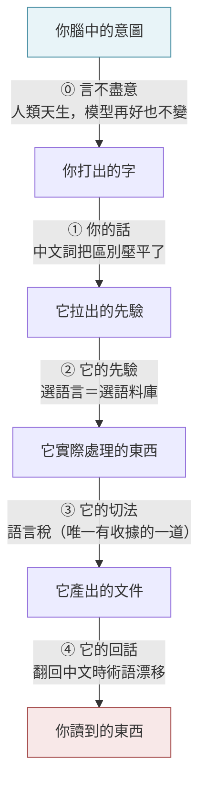
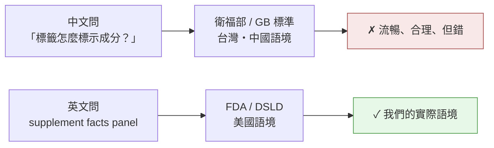
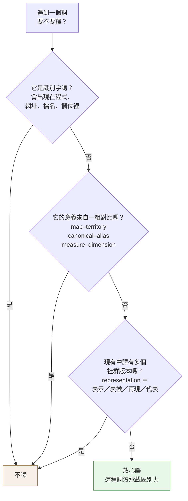

# 許願的語言：中英切換時，你丟掉了什麼

---

## 0. 先看一次事故

> 你問 agent：「保健食品的標籤要怎麼標示成分？」
>
> 它給你一份條理分明、格式漂亮、讀起來完全正確的說明。
>
> 你沒發現的是：**它整份是按台灣衛福部的規定寫的。而我們的資料來源是 DSLD，法規語境是美國 FDA。**

沒有人說錯話。你的中文沒問題，它的回答也沒問題。錯的是**你用中文問**這件事本身，把它推向了一份錯的法規語境——而且它答得非常流暢、非常有自信。

這篇要講的就是這種錯：**不是「你不懂英文術語」，是「你以為那個中文詞說的是同一件事」。**

前者你會去查，後者你不會。

---

## 1. 最底下那道，跟 AI 無關

在談 AI 之前，先把地基放好，否則你會誤以為這篇在講「模型的毛病」。

> **書不盡言，言不盡意。**（《易傳·繫辭上》）

**從你腦中的意圖，到你打出來的字，天然就有一道落差。** 這道落差在 AI 出現之前就存在，是人類溝通的常態——需求訪談之所以難、規格書之所以永遠寫不完整、「我以為你懂我的意思」之所以是職場最貴的一句話，全都是這一道。

AI 沒有製造這個問題。**AI 做的是在它之上，再疊四道轉譯——而且每一道你都看不見。**

這件事有一個很要緊的推論：

> 第 0 道**不會**因為模型變強而消失。它是語言的物理限制，不是技術債。
> 所以「等下一代模型出來就好了」對這一道無效。**你能改善的只有你自己那端。**

五道關卡，每道漏一點。**而只有第 ③ 道會給你收據**——其他四道漏掉的東西，不會出現在任何帳單上。

---

## 2. 三把刀：不用背，但要認得出它們怎麼咬你

英文圈談「表示物 ≠ 被表示物」有三組常見講法。列出來不是要你背，是要你**認得出未來的三種故障長相**：

| 說法 | 一句話 |
|------|--------|
| **map – territory** | 決定你**看得到什麼** |
| **representation – reality** | 決定你**保留什麼** |
| **model – world** | 決定你**能推論什麼** |

對應三種錯，往下每一道關卡我會標出它是哪一種：

- **切錯了世界**（map error）——硬立一個現實中不存在的分類軸
- **切法對但編碼掉東西**（representation error）——把連續的年齡硬壓成「young / old」
- **表示對但推錯關係**（model error）——看到紅色三角形很多，就推論「紅色導致三角形」

> 這三把刀在 repo 裡已有親戚：[同構與投影篇](./isomorphism-projection.md)給的是數學骨架，[Know Your Unknowns](./know-your-unknowns.md)用過其中一對——**你的願望是地圖，任務是疆域**。這篇把同一組刀架到「語言選擇」這條軸上。

---

## 3. 四道關卡

### ① 你的話——中文詞把區別壓平了

> 故障類型：**切錯了世界**。失真發生在你按 Enter 之前，跟 AI 無關。

中文有些技術詞是「垃圾桶詞」：一個中文詞吃掉好幾個英文區別。三個在我們產品裡天天出事的：

| 你打的中文 | 它其實可能是 |
|-----------|-------------|
| 「幫我做**分類**」 | taxonomy（建體系）／ classification（把東西歸位）／ category（某一類）／ categorization（歸位這個動作） |
| 「這欄位要**正規化**」 | DB normalization（拆表）／ 數值 normalization（縮放到 0-1）／ canonical form（統一寫法） |
| 「幫我建個**模型**」 | schema ／ 科學模型 ／ ML model ／ mockup |

第三個尤其誇張——中文「模型」連模特兒都收，區別力接近零。

你許願時少的那一刀，agent 補不回來。[它會忠實地按你的地圖走；地圖上缺的那條河，它不會替你發現，它會直接淹進去。](./know-your-unknowns.md)

> **解法不是「改用英文許願」**，是垃圾桶詞旁邊**補一個英文樁**：
> 「幫我把成分做分類（taxonomy，要建體系不是逐筆歸位）」——一個括號解決。

### ② 它的先驗——選語言就是選語料庫

> 故障類型：**切錯了世界**，但這次錯的是你沒說出口的那部分。這道最少人講，對我們傷害最大。

§0 那場事故就是這一道。用中文問和用英文問，拉出來的不是同一份東西的兩種翻譯，是**兩個社群各自的實踐慣例**：

這不是 token 問題，也不是翻譯問題，是**語料分布問題**：兩個語言的技術討論在密度、時效、來源結構上本來就不同。

> **解法**：凡是牽涉**法規、平台慣例、外部標準**的提問，用該規範原生的語言問，或明寫語境（「以 FDA supplement facts 的定義為準」）。
>
> 這是典型的 **unknown known**——你當然知道我們做美國市場，你只是覺得太理所當然而沒寫。[反向訪談](./know-your-unknowns.md)就是逼它出來的工具。

### ③ 它的切法——語言稅

> 故障類型：**編碼掉東西**。這是唯一有收據的一道，所以「稅」這個字只該用在這裡。

機制不講（那不影響你的決策），只講你會遇到的三個後果：

1. **同樣的意思，中文通常吃掉更多 token。** 直接反映在 context 預算上——長文件、長對話會更早撞牆。
2. **中文沒有空白分詞，切割邊界和語意邊界不對齊。** 後果是**識別字會被切碎**：`brandCode` 夾在中文句子裡是一個穩定的塊，「品牌代碼」可能被切成跟語意無關的碎片。
3. **碎掉的東西不好當錨點。** 搜尋、grep、跨檔案對齊全靠穩定字串。

> **解法**：identifier、欄位名、API 參數、canonical 術語一律保留原形。不是為了看起來專業，是**為了它還能被找到**。

### ④ 它的回話——術語漂移

> 故障類型：**編碼掉東西**，但發生在回程。

你用中文許願 → agent 內部大量用英文概念網絡推理 → 用中文寫出文件。這趟來回**不是恆等映射**，而且轉譯過程你看不見。

最常見的病徵：

> 同一份文件裡，MDFO 的 `measure` 被寫成「度量」「指標」「量值」三種寫法。讀者以為在講三件事。

這正是[分類體系術語](./classification-terminology.md) §7 的 **canonical / alias 失控**——沒有正典，每次生成都重擲一次骰子。AI 生成文件特別容易犯，因為它每一段的譯法都是當場決定的，不會回頭跟前一段對齊。

> **解法**：驗收 AI 寫的文件時，**專門跑一遍術語一致性**。一個概念全文只准一種寫法。

---

## 4. 這不是「中文比較差」

上面很容易被讀成中文吃虧。那是錯的結論。

**每個語言都是一張地圖，每張地圖都有它切不出來的東西。** 最好的反例就在這個 repo：

> [compute-state-context.md](./compute-state-context.md) 給了 `context` 一個很嚴格的定義——**交給無記憶的 compute 的那一片 state**。
>
> 但日常英文的 "context" 泛到不行（背景、情境、脈絡、上下文）。英文母語者讀那篇會**被自己的語感干擾**，反而讀不出它在切哪一刀。中文讀者因為「context 不譯」，把它當全新的專有名詞來學，切得更乾淨。

同理，`map`／`model` 這些字在英文裡日常到近乎透明，母語者不會警覺；你我看到它們是外來詞，反而會停下來問「這裡是哪個意思」。

**外來詞的陌生感是一種保護。**

---

## 5. 所以：中英夾雜不是懶惰，是策略

團隊裡常有人覺得中英夾雜的文件不專業，該全翻成中文。按前面四道關卡，這個直覺是**反的**。

| 成分 | 用什麼語言 | 為什麼 |
|------|-----------|--------|
| **敘事／意圖**（你要什麼、為什麼、邊界在哪） | **母語** | 願望的品質取決於你想得清不清楚。用不熟的語言許願，你會不自覺地把願望簡化成你「講得出來」的那部分 |
| **術語** | **原生形式** | 術語的價值就是它的區別力。翻譯＝掉刀（見關卡 ①） |
| **identifier**（欄位、API、slug、code） | **絕不翻譯** | 它們是錨點，翻了就找不到（見關卡 ③） |

這正是本 repo `CLAUDE.md` 那條規則的理由：

> Technical terms and code identifiers should remain in their original form.

它不是風格潔癖，是**五道關卡下的最小損失解**。

### 一個詞該不該譯

第 2 題是核心：**拆開單譯會殺死配對關係**。中文的「地圖」沒有對比項，「模型不是世界」在中文聽起來像廢話——但 "the map is not the territory" 在英文裡是一句有攻擊性的斷言。

> [分類體系術語](./classification-terminology.md)文末那張中譯對照表（`slug → 不譯，因為譯成「短代碼」易生歧義`）就是這條規則的個案判決——**那篇給判例，這篇給判準。**

---

## 6. 守則

1. **垃圾桶詞旁邊補英文樁**：分類、正規化、模型——看到就加個括號。一秒鐘，省掉一次做偏。
2. **外部規範照原生語言問**：法規、平台慣例、標準文件。用中文問會把 agent 推向錯的先驗，而且錯得很安靜。
3. **identifier 一律不譯**：不是為了專業感，是為了它還找得到。
4. **驗收 AI 文件時專跑一遍術語一致性**：一個概念全文只准一種寫法。這是 AI 生成文件最穩定的病灶。
5. **不要把「全中文」當成品質標準**：混語是最低失真解，不是妥協。
6. **不要指望模型變強會解決第 0 道**：言不盡意是語言的物理限制。你能改善的只有你自己那端。

---

## 7. 附記：這篇自己犯過一次

初版寫完後，第一位讀者的反應是——**這份文件本身就是一個難讀的 context，它自己示範了它要批評的東西。**

當時的開場是這樣的：文章第一句就丟出「交叉熵」，第二段解釋 cross-entropy 與 KL divergence 的差別，第三節立刻上三組英文術語表格。**一篇批評術語塌陷的文章，自己術語過載。**

那個開場原本的用意是「用詞本身當示範」——但實際效果是勸退，不是啟發。差別在於：**好的示範讓人先痛再懂，壞的示範讓人先卡住。** 所以現在的 §0 換成了那場法規事故：先讓你看見後果，再談為什麼。

留這一節不是為了認錯，是因為它是本篇最好的教材：

> 失真不會因為你「知道有失真這回事」就自動避開。
> 寫的人以為自己在示範，讀的人只覺得看不懂——**這兩件事同時為真，而且只有讀者那邊算數。**

順帶把那個被砍掉的概念補在這裡，讀到這裡的你應該吃得下了：

- **熵高** = 你知道自己不確定 → 安全，因為你會去查
- **KL 大** = 你有一個很自信、但錯的理解 → 這才貴，因為你不會去查

全篇處理的都是後者。§0 那份台灣法規的答案，就是一份 KL 很大的答案。

---

## 相關文檔

- [know-your-unknowns.md](./know-your-unknowns.md) - 姊妹篇：那篇講**願望和任務**的落差，本篇講落差更上游的那一段——從意圖到語言
- [classification-terminology.md](./classification-terminology.md) - canonical/alias/slug；文末中譯對照表是本篇 §5 判準的個案判決
- [isomorphism-projection.md](./isomorphism-projection.md) - 投影與 null space：五道關卡的數學骨架
- [compute-state-context.md](./compute-state-context.md) - §4 反例的來源：英文母語者被自己語感干擾的那個 context
- [progressive-disclosure.md](./progressive-disclosure.md) - token 預算：語言稅直接打在這裡
- [paradigm-shift-task-to-wish.md](./paradigm-shift-task-to-wish.md) - 許願範式與它的三次反轉

---

## 📝 文檔維護

### 版本歷史

| 版本 | 日期 | 作者 | 變更說明 |
|------|------|------|----------|
| 1.0 | 2026-08-14 | maple | 初版建立 |
| 1.1 | 2026-08-14 | maple | 依首位讀者回饋重構：加入第 0 道（言不盡意，AI 之前就存在的落差）；開場改為事故場景、KL 概念後移；四層改為五道關卡並統一命名；新增三張 diagram；新增 §7 附記自我檢討 |

---

**文檔結束**
