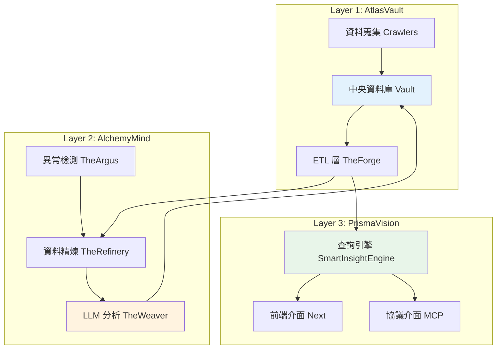

# LuminNexus 系統架構全景

---

## 📋 文檔目的

本文檔提供 LuminNexus 生態系統的**高層級架構概覽**,幫助新成員快速理解:
- 系統整體架構與三層設計
- 各子系統的職責與定位
- 系統間的關係與互動
- 專案文檔的導航指引

> **注意**: 本文檔僅提供概覽,詳細的資料流與串連方式請參考 [01_data-flow.md](01_data-flow.md)

---

## 🏗️ 三層架構概述

LuminNexus 採用**三層架構設計**,各層職責清晰分離:



---

## 📊 系統分層說明

### Layer 1: AtlasVault - 資料蒐集與 ETL 層

**核心職責**: 資料蒐集、儲存、ETL 處理

**主要元件**:
- **Vault**: 中央資料庫 (Single Source of Truth)
- **Crawlers**: DSLD, iHerb, Keepa 爬蟲
- **TheForge**: ETL 層 (4個 Pure ETL Forges + Unified Forge)

**詳細文檔**: [atlasvault/00_overview.md](atlasvault/00_overview.md)

**資料規模**:
- DSLD: 211,782 products
- iHerb: 50,461 products
- Keepa: 64,661 products

---

### Layer 2: AlchemyMind - 資料處理與分析層

**核心職責**: 資料清理、分析、異常檢測

**主要元件**:
- **TheWeaver**: LLM 分析生成 (10 Knowledge Realms)
- **TheRefinery**: 資料精煉、品質檢查、業務邏輯
- **TheArgus**: 異常檢測與驗證

**詳細文檔**: [alchemymind/00_overview.md](alchemymind/00_overview.md)

**分析規模**:
- Weaver 分析: 290,768 analyses
- 10 個知識領域 (Edible, Health Effect, Certification, etc.)

---

### Layer 3: PrismaVision - 使用者介面與引擎層

**核心職責**: 資料查詢、分析、展示

**主要元件**:
- **SmartInsightEngine**: MDOF 查詢引擎
- **PrismaVision-Next**: 前端介面
- **MCP**: 協議介面

**詳細文檔**: [prismavision/00_overview.md](prismavision/00_overview.md)

**查詢能力**:
- ~130K 產品資料集
- 13 維度支援
- MDOF 查詢語言 (Measure/Dimension/Filter/Options)

---

## 🔄 資料循環架構

LuminNexus 採用**循環式資料處理架構** (Cyclical Architecture):

```
Vault (SSoT)
  ↓ [Extract JSON]
TheForge (ETL)
  ↓ [SQLite DB]
TheRefinery (Processing)
  ↓ [Refined DB]
TheWeaver (LLM Analysis)
  ↓ [Analysis JSON]
Vault (Archive) ← 循環完成!
```

**關鍵特性**:
- **Single Source of Truth**: Vault 是唯一的資料真相來源
- **循環更新**: TheWeaver 的分析結果會回寫到 Vault
- **版本控制**: 所有資料以日期為版本 (`YYYYMMDD`)

> **詳細說明**: 完整的資料流與循環機制請參考 [01_data-flow.md](01_data-flow.md)

---

## 📁 專案文檔導航

### 核心文檔
- [00_architecture-overview.md](00_architecture-overview.md) - **本文檔** (系統全景)
- [01_data-flow.md](01_data-flow.md) - 資料流與循環機制 ⭐
- [DOCUMENTATION_POLICY.md](DOCUMENTATION_POLICY.md) - 文檔撰寫規範

### Layer 1: AtlasVault
- [atlasvault/00_overview.md](atlasvault/00_overview.md) - AtlasVault 總覽
- [atlasvault/vault.md](atlasvault/vault.md) - 中央資料庫
- [atlasvault/theforge.md](atlasvault/theforge.md) - ETL 層
- [atlasvault/dsld-crawler.md](atlasvault/dsld-crawler.md) - DSLD 爬蟲
- [atlasvault/iherb-crawler.md](atlasvault/iherb-crawler.md) - iHerb 爬蟲
- [atlasvault/dsldxkeepa.md](atlasvault/dsldxkeepa.md) - DSLD x Keepa 整合

### Layer 2: AlchemyMind
- [alchemymind/00_overview.md](alchemymind/00_overview.md) - AlchemyMind 總覽
- [alchemymind/theweaver.md](alchemymind/theweaver.md) - LLM 分析生成
- [alchemymind/therefinery.md](alchemymind/therefinery.md) - 資料精煉
- [alchemymind/theargus.md](alchemymind/theargus.md) - 異常檢測
- [alchemymind/shared.md](alchemymind/shared.md) - 共用元件

### Layer 3: PrismaVision
- [prismavision/00_overview.md](prismavision/00_overview.md) - PrismaVision 總覽
- [prismavision/smart-insight-engine/](prismavision/smart-insight-engine/) - 查詢引擎 (完整學習路徑)
- [prismavision/next.md](prismavision/next.md) - 前端介面
- [prismavision/mcp.md](prismavision/mcp.md) - MCP 協議介面

---

## 🎯 適用角色

本文檔適合以下角色閱讀:

### 必讀角色
- **新進工程師** (所有角色) - 理解系統全貌
- **架構師** - 系統設計與規劃
- **專案經理** - 專案管理與協調

### 選讀角色
- **測試工程師** - 理解系統邊界與介面
- **資料分析師** - 理解資料來源與處理流程

---

## 🔑 關鍵概念速查

### 架構設計原則
- **Single Source of Truth (SSoT)**: Vault 是唯一的資料真相來源
- **純 ETL 分離**: TheForge 只做 ETL,不做 enrichment
- **循環架構**: 資料會循環流動,TheWeaver 的輸出會回到 Vault
- **Config-Driven**: Unified Forge 使用配置驅動,支援多種輸出

### 核心術語
- **Vault**: 中央資料庫,所有原始資料的儲存位置
- **TheForge**: ETL 層,負責將 JSON 轉換為 SQLite
- **TheWeaver**: LLM 分析生成器,產生 10 個知識領域的分析
- **TheRefinery**: 資料精煉層,負責品質檢查與業務邏輯
- **TheArgus**: 異常檢測系統
- **SmartInsightEngine**: MDOF 查詢引擎
- **Knowledge Realm**: 知識領域,TheWeaver 的分析維度 (共 10 個)
- **MDOF**: Measure/Dimension/Filter/Options 查詢語言

---

## 📚 延伸閱讀

### 理解資料流
1. 先讀本文檔,理解三層架構
2. 再讀 [01_data-flow.md](01_data-flow.md),理解資料如何流動
3. 最後讀各子系統的詳細文檔

### 深入學習特定系統
- **學習 ETL 流程**: [atlasvault/theforge.md](atlasvault/theforge.md)
- **學習 LLM 分析**: [alchemymind/theweaver.md](alchemymind/theweaver.md)
- **學習查詢語言**: [prismavision/smart-insight-engine/](prismavision/smart-insight-engine/)

### 參考外部文檔
- TheForge 詳細架構: `LuminNexus-AtlasVault-TheForge/docs/20251203_architecture_cycle.md`
- 各專案的 README.md 與 CLAUDE.md

---

## 📝 文檔維護

### 版本歷史

| 版本 | 日期 | 作者 | 變更說明 |
|------|------|------|----------|
| 1.0 | 2025-12-09 | Architecture Team | 初版建立 |

### 維護規範
- 本文檔由 Architecture Team 統一維護
- 各子系統的詳細文檔由對應團隊維護
- 文檔撰寫規範請參考 [DOCUMENTATION_POLICY.md](DOCUMENTATION_POLICY.md)

---

## ❓ 常見問題

### Q1: 我是新進工程師,應該從哪裡開始?
**A**: 建議閱讀順序:
1. 本文檔 (理解三層架構)
2. [01_data-flow.md](01_data-flow.md) (理解資料流)
3. 你的角色對應的子系統文檔

### Q2: 為什麼要用循環架構?
**A**: TheWeaver 的 LLM 分析結果需要回寫到 Vault,作為下一輪 ETL 的輸入。這樣可以讓資料不斷豐富與更新。

### Q3: 各層之間如何通訊?
**A**: 請參考 [01_data-flow.md](01_data-flow.md) 的「系統間介面規範」章節。

### Q4: 如何貢獻文檔?
**A**: 請參考 [DOCUMENTATION_POLICY.md](DOCUMENTATION_POLICY.md) 的撰寫規範。

---

**文檔結束**
