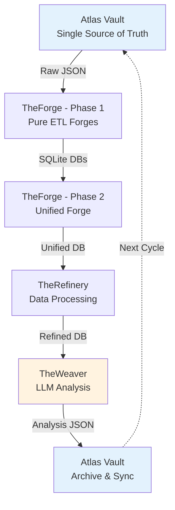

# LuminNexus 資料流與系統串連

**版本**: 1.0
**更新日期**: 2025-12-09
**文檔類型**: 資料流說明
**維護團隊**: Architecture Team + 各子系統團隊

---

## 📋 文檔目的

本文檔詳細說明 LuminNexus 生態系統的**資料傳遞與系統串連方式**,幫助讀者理解:
- 完整的資料循環流程
- 每個階段的資料格式與轉換
- 系統間的介面規範與協議
- 實際案例:一個產品從爬蟲到前端的完整旅程

> **前置閱讀**: 請先閱讀 [00_architecture-overview.md](00_architecture-overview.md) 理解系統架構

---

## 🔄 資料循環架構概覽

LuminNexus 採用**循環式資料處理架構** (Cyclical Architecture):



---

## 📊 完整資料流程

### Stage 1: 資料蒐集 (Raw Data Collection)

**職責**: 從外部來源爬取原始資料

**資料來源**:
- **DSLD Crawler** → Vault: `dsld/official/YYYYMMDD/*.json`
- **iHerb Crawler** → Vault: `iherb/catalog/YYYYMMDD/*.json`
- **Keepa Crawler** → Vault: `keepa/products/YYYYMMDD/*.json`

**資料規模**:
- DSLD: 211,782 products
- iHerb: 50,461 products
- Keepa: 64,661 products

**資料格式**: 原始 JSON 檔案 (每個產品一個檔案)

**負責團隊**: AtlasVault Team - Crawlers

**詳細文檔**:
- [atlasvault/dsld-crawler.md](atlasvault/dsld-crawler.md)
- [atlasvault/iherb-crawler.md](atlasvault/iherb-crawler.md)

---

### Stage 2: ETL 處理 - Phase 1 (Pure ETL Forges)

**職責**: 將原始 JSON 轉換為結構化的 SQLite 資料庫

**處理模組**:

#### 2.1 DSLD Forge
- **輸入**: `dsld/official/20250728/*.json` (211,782 files)
- **輸出**: `dsld_20250728.db`
- **處理內容**:
  - 19 個資料表
  - 7 個自動生成的 Taxonomies
  - Pure ETL: 無 enrichment
- **處理時間**: ~35-40 分鐘

#### 2.2 iHerb Forge
- **輸入**: `iherb/catalog/20250905/*.json` (50,461 files)
- **輸出**: `iherb_20250905.db`
- **處理內容**:
  - 118 個欄位
  - UPC mapping 整合
  - Pure ETL: 無 enrichment
- **處理時間**: ~15-20 分鐘

#### 2.3 Keepa Forge
- **輸入**: `keepa/products/20250912/*.json` (64,661 files)
- **輸出**: `keepa_20250912.db`
- **處理內容**:
  - Price history tracking
  - Amazon marketplace data
  - Pure ETL: 無 enrichment
- **處理時間**: ~15-20 分鐘

#### 2.4 Weaver Forge
- **輸入**: `weaver/edible/v1.0/20251124/**/*.json` (290,768 files)
- **輸出**: `edible_20251124.db` (+ 9 other realm DBs)
- **處理內容**:
  - Composite PK: `(id, source)`
  - Cross-database JOIN ready
  - Pure ETL: 無 enrichment
- **處理時間**: ~1 分鐘

**負責團隊**: AtlasVault Team - TheForge

**詳細文檔**: [atlasvault/theforge.md](atlasvault/theforge.md)

---

### Stage 3: ETL 處理 - Phase 2 (Unified Forge)

**職責**: Config-driven 資料過濾與組裝

**處理方式**:
- ATTACH 多個資料庫
- 根據 Config 進行過濾
- 複製過濾後的資料表 (無 schema 變更)
- 生成單一檔案供下游使用

**Config 範例**:

#### Config A: edible_dsld_centric
```json
{
  "name": "edible_dsld_centric",
  "filter": "is_edible = True",
  "sources": ["dsld", "keepa", "iherb", "edible_analysis"],
  "join_strategy": "upc_matching"
}
```
**輸出**: `products_edible_dsld_centric.db`

#### Config B: iherb_complete
```json
{
  "name": "iherb_complete",
  "filter": "source = 'iherb'",
  "sources": ["iherb", "all_weaver_realms"],
  "join_strategy": "inner"
}
```
**輸出**: `products_iherb_complete.db`

**負責團隊**: AtlasVault Team - TheForge

**詳細文檔**: [atlasvault/theforge.md](atlasvault/theforge.md#unified-forge)

---

### Stage 4: 資料精煉 (Domain Processing)

**職責**: 業務邏輯、資料品質檢查、Taxonomy mapping

**處理內容**:
- Taxonomy mapping (將產品映射到分類階層)
- Knowledge realms integration
- Business logic application
- Data quality checks
- Derived attributes calculation

**輸入**: `products_*.db` (from Unified Forge)

**輸出**: `refined_products.db`

**負責團隊**: AlchemyMind Team - TheRefinery

**詳細文檔**: [alchemymind/therefinery.md](alchemymind/therefinery.md)

---

### Stage 5: LLM 分析生成 (LLM Analysis)

**職責**: 使用 LLM 生成 10 個知識領域的分析

**10 Knowledge Realms**:
1. **Edible Classification** - 可食用性分類 (is_edible, confidence)
2. **Health Effect** - 健康效果 (benefits, warnings)
3. **Certification** - 認證標章 (organic, non-gmo, etc.)
4. **Ingredient Purity** - 成分純度 (quality indicators)
5. **Formulation Technology** - 配方技術 (delivery methods)
6. **Performance Enhancement** - 效能提升 (athletic, cognitive)
7. **Usage Convenience** - 使用便利性 (ease of use)
8. **Flavor Characteristics** - 風味特徵 (taste, texture)
9. **Quality of Life** - 生活品質 (wellness impacts)
10. **Usage Context** - 使用情境 (when, how to use)

**每個 Realm 產生**:
- Analysis JSON (per product)
- Taxonomy JSON (realm hierarchy)

**輸入**: `refined_products.db`

**輸出**:
- `weaver/[realm]/v1.0/[date]/[source]/[id]/result.json`
- `weaver/taxonomy/[Realm]Taxonomy.json`

**負責團隊**: AlchemyMind Team - TheWeaver

**詳細文檔**: [alchemymind/theweaver.md](alchemymind/theweaver.md)

---

### Stage 6: Archive & Sync (回到 Vault)

**職責**: 將 TheWeaver 的分析結果同步回 Vault

**同步內容**:
- Weaver analysis results → `weaver/[realm]/v1.0/[date]/`
- Taxonomies → `weaver/taxonomy/`

**版本控制**:
- 使用日期為版本: `YYYYMMDD`
- 每次同步建立新版本目錄

**循環完成**: 新的 Weaver 分析成為下一輪 ETL 的輸入!

**負責團隊**: AtlasVault Team - Vault

**詳細文檔**: [atlasvault/vault.md](atlasvault/vault.md)

---

## 🔌 系統間介面規範

### Interface 1: Vault → TheForge (Phase 1)

**資料格式**: Raw JSON files

**目錄結構**:
```
/opt/atlas_vault/
├── dsld/official/20250728/
│   ├── 1000.json
│   ├── 1001.json
│   └── ...
├── iherb/catalog/20250905/
│   ├── iherb_12345.json
│   └── ...
└── keepa/products/20250912/
    └── ...
```

**JSON Schema**: 參考各 Forge 的 `file_structure.md`

**負責定義**: AtlasVault Team

---

### Interface 2: TheForge Phase 1 → TheForge Phase 2

**資料格式**: SQLite database files

**檔案命名**:
- `dsld_20250728.db`
- `iherb_20250905.db`
- `keepa_20250912.db`
- `edible_20251124.db`

**Schema**: 參考各 Forge 的 schema 文檔

**負責定義**: AtlasVault Team - TheForge

---

### Interface 3: TheForge Phase 2 → TheRefinery

**資料格式**: SQLite database (single file)

**檔案命名**: `products_[config_name].db`

**Schema**: 與 Phase 1 輸出相同 (只是過濾後的子集)

**負責定義**: AtlasVault Team - TheForge

---

### Interface 4: TheRefinery → TheWeaver

**資料格式**: SQLite database

**檔案命名**: `refined_products.db`

**篩選條件**: 通常只包含 `is_edible = True` 的產品

**負責定義**: AlchemyMind Team - TheRefinery

---

### Interface 5: TheWeaver → Vault

**資料格式**: JSON files (per product, per realm)

**目錄結構**:
```
/opt/atlas_vault/weaver/
├── edible/v1.0/20251124/
│   ├── dsld/1000/
│   │   ├── result.json
│   │   └── response.meta.json
│   └── ...
└── taxonomy/
    ├── EdibleTaxonomy.json
    ├── HealthEffectTaxonomy.json
    └── ...
```

**JSON Schema**: 參考 TheWeaver 文檔

**負責定義**: AlchemyMind Team - TheWeaver

---

### Interface 6: SmartInsightEngine → PrismaVision

**資料格式**: JSON API (HTTP REST)

**協議**: MDOF Query Language

**Query 結構**:
```json
{
  "measures": ["product_count", "avg_price"],
  "dimensions": ["Brand", "SupplementFact"],
  "filters": {
    "any": [
      {"dimension": "Brand", "values": ["Nature Made"]}
    ]
  },
  "options": {
    "limit": 100,
    "offset": 0
  }
}
```

**Response 結構**: 參考 SmartInsightEngine 文檔

**負責定義**: PrismaVision Team - SmartInsightEngine

---

## 🎬 實際案例: 一個產品的完整旅程

### 案例背景
假設有一個新的 DSLD 產品 (ID: 99999) "Vitamin C 1000mg by Nature Made"

### 完整流程

#### Step 1: 爬蟲蒐集 (Day 1)
```
DSLD Crawler 發現新產品
  ↓
儲存到 Vault: /opt/atlas_vault/dsld/official/20250728/99999.json
```

**資料內容** (簡化):
```json
{
  "id": 99999,
  "name": "Vitamin C 1000mg",
  "brand": "Nature Made",
  "upc": "031604012342",
  "ingredients": ["Vitamin C (as Ascorbic Acid) 1000mg"],
  ...
}
```

---

#### Step 2: DSLD Forge ETL (Day 1)
```
dsld-forge 執行
  ↓
讀取 99999.json
  ↓
插入到 dsld_20250728.db
  ↓
Products 表新增一筆記錄
```

**資料狀態**: 產品存在於 `dsld_20250728.db` 的 `Products` 表

---

#### Step 3: Unified Forge (Day 1)
```
unified-forge 執行 (config: edible_dsld_centric)
  ↓
過濾條件: is_edible = True
  ↓
產品 99999 沒有 edible analysis → 不包含在輸出中
```

**資料狀態**: 產品 99999 **不在** `products_edible_dsld_centric.db` 中

---

#### Step 4: TheWeaver 分析 (Day 2)
```
TheWeaver 掃描 refined_products.db
  ↓
發現產品 99999 尚無 edible analysis
  ↓
使用 LLM 分析產品是否可食用
  ↓
生成 result.json: { "is_edible": true, "confidence": 0.95 }
  ↓
同步到 Vault: /opt/atlas_vault/weaver/edible/v1.0/20251202/dsld/99999/result.json
```

**資料內容**:
```json
{
  "id": 99999,
  "source": "dsld",
  "realm": "edible",
  "is_edible": true,
  "confidence": 0.95,
  "reasoning": "Vitamin C is a dietary supplement, edible.",
  "analyzed_at": "2025-12-02T10:30:00Z"
}
```

---

#### Step 5: Weaver Forge ETL (Day 3)
```
weaver-forge 執行
  ↓
讀取 /opt/atlas_vault/weaver/edible/v1.0/20251202/**/*.json
  ↓
插入到 edible_20251202.db
  ↓
EdibleAnalysis 表新增產品 99999 的記錄
```

**資料狀態**: `edible_20251202.db` 包含產品 99999 的分析

---

#### Step 6: Unified Forge (Day 3 - 第二輪)
```
unified-forge 再次執行 (config: edible_dsld_centric)
  ↓
ATTACH edible_20251202.db
  ↓
過濾條件: is_edible = True
  ↓
產品 99999 符合條件 → 包含在輸出中!
```

**資料狀態**: 產品 99999 **現在在** `products_edible_dsld_centric.db` 中

---

#### Step 7: TheRefinery 精煉 (Day 3)
```
TheRefinery 處理 products_edible_dsld_centric.db
  ↓
Taxonomy mapping: Vitamin C → Vitamins → Water-Soluble Vitamins
  ↓
Business logic: 計算 serving_size_per_dollar
  ↓
輸出到 refined_products.db
```

---

#### Step 8: SmartInsightEngine 查詢 (Day 4)
```
使用者在前端查詢: "所有 Nature Made 的維他命 C 產品"
  ↓
PrismaVision-Next 發送 MDOF Query:
{
  "measures": ["product_count"],
  "dimensions": ["Brand", "SupplementFact"],
  "filters": {
    "any": [
      {"dimension": "Brand", "values": ["Nature Made"]},
      {"dimension": "SupplementFact", "values": ["Vitamin C"]}
    ]
  }
}
  ↓
SmartInsightEngine 執行查詢
  ↓
返回結果: 產品 99999 包含在結果中!
```

**循環完成!** 🎉

---

## 📏 資料格式與 Schema

### JSON Schema 參考
- **DSLD JSON**: `LuminNexus-AtlasVault-TheForge/specs/dsld-forge/file_structure.md`
- **iHerb JSON**: `LuminNexus-AtlasVault-iHerb/docs/schema.md`
- **Weaver Analysis JSON**: `LuminNexus-AlchemyMind-TheWeaver/docs/schema.md`

### SQLite Schema 參考
- **DSLD DB Schema**: `LuminNexus-AtlasVault-TheForge/dsld-forge/schema.sql`
- **iHerb DB Schema**: `LuminNexus-AtlasVault-TheForge/iherb-forge/schema.sql`
- **Weaver DB Schema**: `LuminNexus-AtlasVault-TheForge/weaver-forge/schema.sql`

---

## ⚙️ 資料流控制

### 版本控制策略

#### 資料庫命名
- **格式**: `{module}_{YYYYMMDD}.db`
- **範例**: `dsld_20250728.db`, `edible_20251124.db`

#### Taxonomy 版本
- **格式**: `{Realm}Taxonomy.json`
- **位置**: `weaver/taxonomy/`
- **版本控制**: 透過父目錄日期隱式版本

#### Unified Output 命名
- **格式**: `products_{config_name}.db`
- **範例**: `products_edible_dsld_centric.db`

---

### 資料更新觸發機制

#### Pattern 1: 新產品加入
```
1. Crawler 發現新產品 → Vault
2. 執行對應的 Forge (e.g., dsld-forge)
3. 執行 unified-forge → 產品可能不包含 (無 analysis)
4. 執行 TheWeaver → 生成 analysis
5. 同步回 Vault
6. 執行 weaver-forge
7. 再次執行 unified-forge → 產品現在包含!
```

#### Pattern 2: Taxonomy 更新
```
1. TheWeaver 發現新類別
2. 更新 Taxonomy JSON
3. 同步到 Vault
4. TheRefinery 使用新 Taxonomy
5. 不需要重新執行 Forge (原始資料庫不變)
```

#### Pattern 3: Config 新增
```
1. 新增 Config 檔案 (e.g., certified_organic.json)
2. 執行 unified-forge with new config
3. 生成新的輸出 DB
4. 不影響既有的輸出 DB
```

---

## 🚀 效能考量

### 處理時間估算

| 階段 | 模組 | 資料量 | 處理時間 |
|------|------|--------|----------|
| Stage 2 | dsld-forge | 211,782 files | ~35-40 分鐘 |
| Stage 2 | iherb-forge | 50,461 files | ~15-20 分鐘 |
| Stage 2 | keepa-forge | 64,661 files | ~15-20 分鐘 |
| Stage 2 | weaver-forge | 290,768 files | ~1 分鐘 |
| Stage 3 | unified-forge | 4 DBs | ~2-5 分鐘 |
| Stage 4 | TheRefinery | 1 DB | TBD |
| Stage 5 | TheWeaver | Per product | ~10-30 秒/產品 |

### 資料庫大小

| 資料庫 | 大小 |
|--------|------|
| dsld_20250728.db | ~1.8-2.0 GB |
| iherb_20250905.db | ~200-300 MB |
| keepa_20250912.db | ~200-300 MB |
| edible_20251124.db | ~151 MB |
| products_edible_dsld_centric.db | ~500MB-2GB |

---

## 📚 相關文檔

### 架構文檔
- [00_architecture-overview.md](00_architecture-overview.md) - 系統架構全景
- [DOCUMENTATION_POLICY.md](DOCUMENTATION_POLICY.md) - 文檔撰寫規範

### 子系統文檔
- [atlasvault/theforge.md](atlasvault/theforge.md) - TheForge 詳細說明
- [alchemymind/theweaver.md](alchemymind/theweaver.md) - TheWeaver 詳細說明
- [alchemymind/therefinery.md](alchemymind/therefinery.md) - TheRefinery 詳細說明

### 外部文檔
- `LuminNexus-AtlasVault-TheForge/docs/20251203_architecture_cycle.md` - TheForge 完整架構

---

## 📝 文檔維護

### 版本歷史

| 版本 | 日期 | 作者 | 變更說明 |
|------|------|------|----------|
| 1.0 | 2025-12-09 | Architecture Team | 初版建立 |

### 維護職責
- **Architecture Team**: 維護整體資料流框架
- **AtlasVault Team**: 維護 Stage 1-3 的詳細內容
- **AlchemyMind Team**: 維護 Stage 4-6 的詳細內容
- **PrismaVision Team**: 維護 Interface 6 的詳細內容

---

## ❓ 常見問題

### Q1: 為什麼 TheWeaver 的結果要回寫到 Vault?
**A**: 因為 TheWeaver 的分析 (如 is_edible) 會被 Unified Forge 用來過濾資料。這形成一個循環:新資料 → 分析 → 過濾 → 再分析。

### Q2: Unified Forge 和 TheRefinery 有什麼差別?
**A**:
- **Unified Forge**: 簡單的過濾與組裝,不改變 schema
- **TheRefinery**: 複雜的業務邏輯、Taxonomy mapping、資料品質檢查

### Q3: 為什麼要分 Phase 1 和 Phase 2?
**A**:
- **Phase 1** (Pure ETL): 保持原始資料的完整性,不做任何過濾
- **Phase 2** (Unified Forge): 根據不同需求生成不同的子集

### Q4: 如何知道某個產品目前在哪個階段?
**A**: 檢查以下位置:
1. Vault 有 JSON → 已爬取
2. `dsld_20250728.db` 有記錄 → 已 ETL
3. `edible_20251124.db` 有記錄 → 已分析
4. `products_edible_dsld_centric.db` 有記錄 → 已過濾進入 unified DB

---

**文檔結束**
