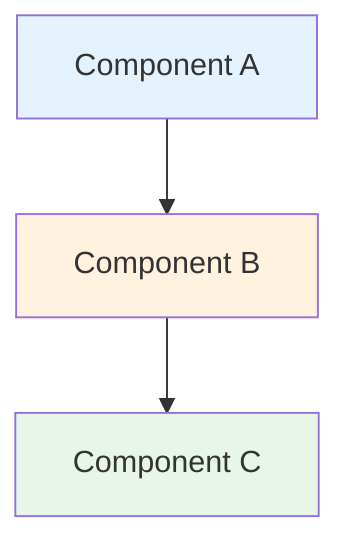
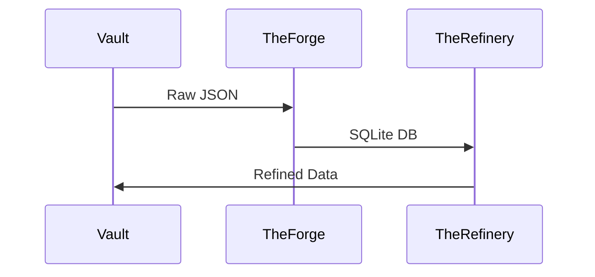
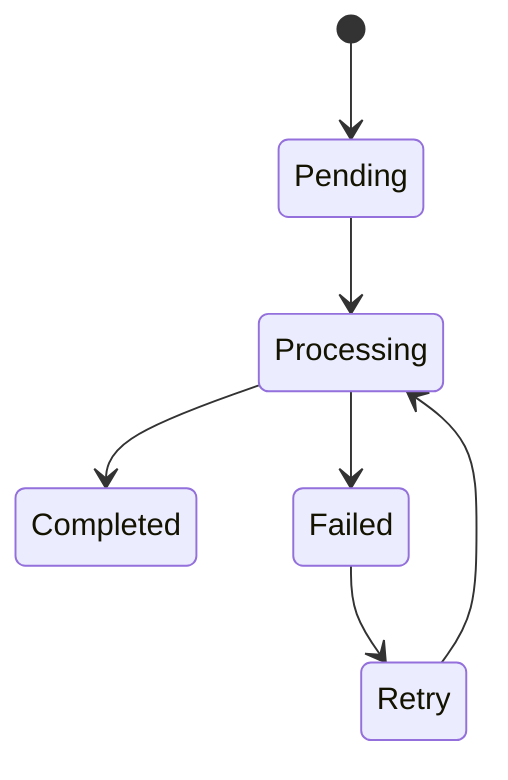
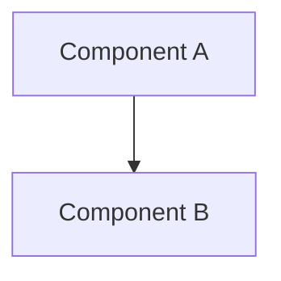

# LuminNexus 專案文檔撰寫規範

**版本**: 1.0
**更新日期**: 2025-12-09
**適用範圍**: `projects/` 目錄下的所有專案文檔
**維護者**: Architecture Team

---

## 📋 文檔目的

本文檔提供**專案文檔撰寫規範**,供各團隊撰寫其負責的子系統文檔使用。

**目標**:
- 統一文檔格式與風格
- 確保文檔可讀性與維護性
- 方便跨團隊協作與整合

---

## 🎯 文檔分類與職責

### 核心架構文檔 (Architecture Team 維護)
- `00_architecture-overview.md` - 系統架構全景
- `01_data-flow.md` - 資料流與系統串連
- `DOCUMENTATION_POLICY.md` - 本文檔

### 子系統文檔 (各 Team 維護)

#### AtlasVault Team
- `atlasvault/00_overview.md` - AtlasVault 總覽
- `atlasvault/vault.md` - 中央資料庫
- `atlasvault/theforge.md` - ETL 層
- `atlasvault/dsld-crawler.md` - DSLD 爬蟲
- `atlasvault/iherb-crawler.md` - iHerb 爬蟲
- `atlasvault/dsldxkeepa.md` - DSLD x Keepa 整合

#### AlchemyMind Team
- `alchemymind/00_overview.md` - AlchemyMind 總覽
- `alchemymind/theweaver.md` - LLM 分析生成
- `alchemymind/therefinery.md` - 資料精煉
- `alchemymind/theargus.md` - 異常檢測
- `alchemymind/shared.md` - 共用元件

#### PrismaVision Team
- `prismavision/00_overview.md` - PrismaVision 總覽
- `prismavision/smart-insight-engine/` - 查詢引擎 (已存在)
- `prismavision/next.md` - 前端介面
- `prismavision/mcp.md` - MCP 協議介面

---

## 📝 文檔格式規範

### 1. Front Matter (文檔頭部)

每個文檔**必須**包含以下元數據:

```markdown
# [文檔標題]

**版本**: 1.0
**更新日期**: YYYY-MM-DD
**文檔類型**: [概覽/詳細說明/API 文檔/教學]
**維護團隊**: [Team Name]
**適用角色**: [選填] [工程師/測試/PM/全員]
**前置知識**: [選填] [需要先讀哪些文檔]

---
```

**範例**:
```markdown
# TheForge - ETL 層詳細說明

**版本**: 1.0
**更新日期**: 2025-12-09
**文檔類型**: 詳細說明
**維護團隊**: AtlasVault Team - TheForge
**適用角色**: 工程師、架構師
**前置知識**: 00_architecture-overview.md, 01_data-flow.md

---
```

---

### 2. 文檔結構 (必要章節)

#### 2.1 概覽文檔 (`00_overview.md`)

```markdown
# [系統名稱] 概覽

[Front Matter]

## 📋 文檔目的
[簡短說明本文檔的用途]

## 🎯 系統概述
[系統的核心職責、目標]

## 🏗️ 系統架構
[Mermaid 圖表]

## 📦 子系統/模組列表
[列出所有子系統,並連結到詳細文檔]

## 🔄 與其他系統的關係
[說明資料流入/流出]

## 📚 相關文檔
[連結到詳細文檔]

## 📝 文檔維護
[版本歷史表]
```

#### 2.2 詳細文檔 (如 `theforge.md`)

```markdown
# [模組名稱] 詳細說明

[Front Matter]

## 📋 文檔目的

## 🎯 系統職責
[這個模組負責什麼?]

## 🏗️ 系統架構
[Mermaid 圖表]

## 🔧 核心功能
[詳細說明各個功能]

## 📊 資料格式與 Schema
[輸入/輸出的資料格式]

## 🔌 介面說明
[與其他系統的介面]

## ⚙️ 配置與參數
[如何配置、有哪些參數]

## 🚀 使用方式
[如何執行、使用範例]

## 🐛 常見問題與除錯
[FAQ、Troubleshooting]

## 📚 相關文檔

## 📝 文檔維護
```

---

### 3. 視覺化規範 (Mermaid 圖表)

**強制使用 Mermaid 語法**,禁止使用圖片檔案 (除非絕對必要)。

#### 3.1 系統架構圖
```markdown

```

#### 3.2 資料流圖
```markdown

```

#### 3.3 狀態機圖
```markdown

```

**顏色使用規範**:
- `#e3f2fd` (淡藍色): 資料儲存、Vault
- `#fff3e0` (淡橘色): 資料處理、分析
- `#e8f5e9` (淡綠色): 使用者介面、API
- `#f3e5f5` (淡紫色): 配置、控制

---

### 4. 程式碼與範例規範

#### 4.1 程式碼區塊
使用語法高亮:

```markdown
```python
# Python code example
def process_data(input_file):
    with open(input_file, 'r') as f:
        data = json.load(f)
    return data
```
```

```markdown
```json
{
  "id": 99999,
  "name": "Product Name",
  "brand": "Brand Name"
}
```
```

#### 4.2 指令範例
```markdown
```bash
# 執行 dsld-forge
cd LuminNexus-AtlasVault-TheForge/dsld-forge
python main.py --date 20250728
```
```

#### 4.3 配置檔範例
```markdown
```yaml
# config.yaml
forge:
  input_path: /opt/atlas_vault/dsld/official/20250728/
  output_db: dsld_20250728.db
  batch_size: 1000
```
```

---

### 5. 資料格式說明規範

#### 5.1 JSON Schema
使用表格說明欄位:

```markdown
### Input JSON Schema

| 欄位名稱 | 類型 | 必填 | 說明 | 範例 |
|---------|------|------|------|------|
| id | integer | ✅ | 產品 ID | 99999 |
| name | string | ✅ | 產品名稱 | "Vitamin C 1000mg" |
| brand | string | ✅ | 品牌名稱 | "Nature Made" |
| upc | string | ❌ | UPC 條碼 | "031604012342" |
```

#### 5.2 Database Schema
使用 SQL 格式:

```markdown
```sql
CREATE TABLE Products (
    id INTEGER PRIMARY KEY,
    name TEXT NOT NULL,
    brand TEXT NOT NULL,
    upc TEXT,
    created_at TIMESTAMP DEFAULT CURRENT_TIMESTAMP
);

CREATE INDEX idx_products_brand ON Products(brand);
```
```

---

### 6. 連結與引用規範

#### 6.1 內部文檔連結
使用相對路徑:

```markdown
詳見 [資料流說明](../01_data-flow.md)
詳見 [TheForge 文檔](theforge.md)
詳見 [TheForge 的 Unified Forge 章節](theforge.md#unified-forge)
```

#### 6.2 外部專案文檔連結
使用絕對路徑或說明位置:

```markdown
詳見專案文檔: `LuminNexus-AtlasVault-TheForge/docs/20251203_architecture_cycle.md`
```

#### 6.3 程式碼參考
使用 `file_path:line_number` 格式:

```markdown
實作位於 `dsld-forge/main.py:127`
Schema 定義在 `dsld-forge/schema.sql:15`
```

---

### 7. 版本控制規範

#### 7.1 版本號規則
使用 Semantic Versioning:
- **Major (1.0 → 2.0)**: 重大架構變更、不相容變更
- **Minor (1.0 → 1.1)**: 新增章節、功能說明
- **Patch (1.0.0 → 1.0.1)**: 錯誤修正、小幅調整

#### 7.2 版本歷史表
每個文檔底部必須包含:

```markdown
## 📝 文檔維護

### 版本歷史

| 版本 | 日期 | 作者 | 變更說明 |
|------|------|------|----------|
| 1.1 | 2025-12-15 | Alice | 新增 Unified Forge 章節 |
| 1.0 | 2025-12-09 | Bob | 初版建立 |

### 維護職責
- **主要維護者**: AtlasVault Team - TheForge
- **審核者**: Architecture Team
- **更新頻率**: 每季度檢視一次
```

---

## 🎨 撰寫風格指南

### 1. 語氣與用詞

#### ✅ 推薦
- 使用**主動語態**: "TheForge 將 JSON 轉換為 SQLite"
- 使用**清楚的術語**: "ETL 處理" 而非 "資料處理"
- 使用**具體的數字**: "211,782 個產品" 而非 "大量產品"
- 使用**明確的動詞**: "執行"、"生成"、"同步"

#### ❌ 避免
- 被動語態: "JSON 被轉換為 SQLite"
- 模糊描述: "很多產品"、"快速處理"
- 行話術語 (除非已解釋): 避免未定義的縮寫

### 2. 段落組織

#### 每個段落應該:
- 只講一個主題
- 3-5 句話為佳
- 第一句話是主題句

#### 使用清單:
- 當有 3 個以上並列項目時使用清單
- 使用**無序清單** (bullet points) 表示並列關係
- 使用**有序清單** (numbered) 表示順序步驟

### 3. 標題層級

```markdown
# H1: 文檔標題 (每個檔案只有一個)

## H2: 主要章節

### H3: 次要章節

#### H4: 詳細說明 (避免使用更深層級)
```

---

## 📊 資料規模標示規範

當說明系統處理能力時,**必須**標示資料規模:

```markdown
### 處理能力

| 指標 | 數值 |
|------|------|
| 產品數量 | 211,782 |
| 檔案大小 | ~1.8-2.0 GB |
| 處理時間 | ~35-40 分鐘 |
| 資料表數量 | 19 |
```

---

## 🔄 文檔審核流程

### 1. 撰寫階段
1. 團隊內部起草文檔
2. 依照本規範格式化
3. 內部 review

### 2. 提交階段
1. 將文檔放置到指定目錄
2. 更新 `00_overview.md` 的文檔連結
3. 通知 Architecture Team

### 3. 審核階段
1. Architecture Team 檢查格式與內容
2. 提出修改建議
3. 團隊修改後再次提交

### 4. 整合階段
1. Architecture Team 整合到 LearningMap
2. 更新跨文檔連結
3. 發布通知

---

## 📋 文檔 Checklist

提交文檔前,請確認以下項目:

### 格式檢查
- [ ] 包含 Front Matter (版本、日期、團隊)
- [ ] 章節結構完整 (目的、概述、架構...)
- [ ] 使用 Mermaid 圖表 (非圖片)
- [ ] 所有程式碼區塊有語法高亮
- [ ] 包含版本歷史表

### 內容檢查
- [ ] 系統職責描述清楚
- [ ] 資料格式有詳細說明
- [ ] 介面規範完整
- [ ] 有使用範例或案例
- [ ] 包含常見問題 (FAQ)

### 連結檢查
- [ ] 所有內部連結可用
- [ ] 外部文檔路徑正確
- [ ] 交叉引用完整

### 可讀性檢查
- [ ] 無拼寫錯誤
- [ ] 用詞一致 (如統一使用 "TheForge" 而非 "the forge")
- [ ] 段落長度適中
- [ ] 清單格式正確

---

## 🛠️ 文檔工具推薦

### Markdown 編輯器
- **VS Code** + Markdown Preview Enhanced
- **Typora** (所見即所得)
- **Obsidian** (適合交叉引用)

### Mermaid 預覽
- **Mermaid Live Editor**: https://mermaid.live/
- **VS Code** + Mermaid Preview 擴充套件

### Schema 工具
- **DB Browser for SQLite**: 查看 SQLite schema
- **JSON Schema Validator**: 驗證 JSON schema

---

## 📚 範本檔案

### 概覽文檔範本
```markdown
# [系統名稱] 概覽

**版本**: 1.0
**更新日期**: YYYY-MM-DD
**文檔類型**: 概覽
**維護團隊**: [Your Team]

---

## 📋 文檔目的

[說明本文檔的用途]

---

## 🎯 系統概述

[系統的核心職責]

---

## 🏗️ 系統架構



---

## 📦 子系統列表

### 子系統 A
- **職責**: [說明]
- **詳細文檔**: [link]

---

## 🔄 與其他系統的關係

[說明資料流入/流出]

---

## 📚 相關文檔

- [Link 1]
- [Link 2]

---

## 📝 文檔維護

### 版本歷史

| 版本 | 日期 | 作者 | 變更說明 |
|------|------|------|----------|
| 1.0 | YYYY-MM-DD | [Your Name] | 初版建立 |
```

### 詳細文檔範本
(請參考 `01_data-flow.md` 的結構)

---

## ❓ 常見問題

### Q1: 文檔應該多詳細?
**A**:
- **概覽文檔**: 1-2 頁,高層級說明
- **詳細文檔**: 5-15 頁,包含所有細節
- **原則**: 讀者應能從文檔中獨立完成任務

### Q2: 可以複製貼上其他專案的文檔嗎?
**A**: 可以參考格式,但內容必須是你團隊的原創。如果需要引用,請使用連結。

### Q3: 文檔要用中文還是英文?
**A**:
- 文檔本體: **中文** (主要讀者是內部團隊)
- 程式碼、術語: **英文** (如 TheForge, ETL, JSON)
- 註解: 中文

### Q4: 如何處理機密資訊?
**A**:
- 避免包含密碼、API Key、內部 IP
- 使用範例值: `example.com`, `your-api-key-here`
- 機密配置請參考 `.env.example`

### Q5: 文檔更新頻率?
**A**:
- **重大變更**: 立即更新
- **小幅調整**: 每月檢視
- **定期審核**: 每季度

---

## 📞 聯絡方式

### 文檔問題
- **Slack Channel**: #learning-map-docs
- **負責人**: Architecture Team Lead

### 技術問題
- **AtlasVault**: @atlasvault-team
- **AlchemyMind**: @alchemymind-team
- **PrismaVision**: @prismavision-team

---

## 📝 文檔維護

### 版本歷史

| 版本 | 日期 | 作者 | 變更說明 |
|------|------|------|----------|
| 1.0 | 2025-12-09 | Architecture Team | 初版建立 |

### 維護職責
- **主要維護者**: Architecture Team
- **審核者**: All Team Leads
- **更新頻率**: 每季度檢視

---

**文檔結束**

**祝撰寫順利!** 如有任何問題,歡迎隨時聯絡 Architecture Team。
