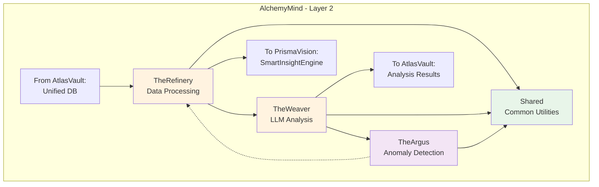
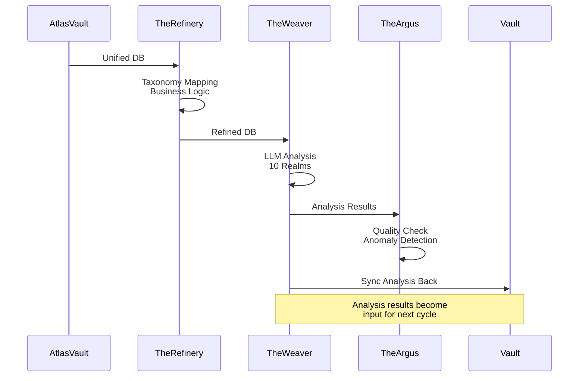

# AlchemyMind - 資料處理與分析層概覽

**版本**: 1.0
**更新日期**: 2025-12-09
**文檔類型**: 概覽
**維護團隊**: AlchemyMind Team
**適用角色**: 全員
**前置知識**: [00_architecture-overview.md](../00_architecture-overview.md)

---

## 📋 文檔目的

本文檔提供 **AlchemyMind** 系統的概覽,幫助讀者理解:
- AlchemyMind 在整體架構中的定位
- 各子系統的職責與關係
- 資料處理、分析、異常檢測的完整流程

> **詳細內容**: 各子系統的詳細說明請參考對應的文檔連結

---

## 🎯 系統概述

**AlchemyMind** 是 LuminNexus 的**資料處理與分析層** (Layer 2),負責:
- 資料精煉與品質檢查 (TheRefinery)
- LLM 驅動的知識領域分析 (TheWeaver)
- 異常檢測與驗證 (TheArgus)

---

## 🏗️ 系統架構

---

## 📦 子系統列表

### 1. TheRefinery - 資料精煉

- **職責**: Domain-specific processing, 資料品質檢查, 業務邏輯應用
- **處理內容**:
  - Taxonomy mapping (產品分類映射)
  - Knowledge realms integration
  - Business logic application
  - Data quality validation
  - Derived attributes calculation
- **輸入**: `products_*.db` (from AtlasVault Unified Forge)
- **輸出**: `refined_products.db`
- **詳細文檔**: [therefinery.md](therefinery.md)

### 2. TheWeaver - LLM 分析生成

- **職責**: 使用 LLM 生成 10 個知識領域 (Knowledge Realms) 的分析
- **10 Knowledge Realms**:
  1. **Edible Classification** - 可食用性分類
  2. **Health Effect** - 健康效果
  3. **Certification** - 認證標章
  4. **Ingredient Purity** - 成分純度
  5. **Formulation Technology** - 配方技術
  6. **Performance Enhancement** - 效能提升
  7. **Usage Convenience** - 使用便利性
  8. **Flavor Characteristics** - 風味特徵
  9. **Quality of Life** - 生活品質
  10. **Usage Context** - 使用情境
- **輸入**: `refined_products.db`
- **輸出**:
  - Analysis JSON (per product, per realm)
  - Taxonomy JSON (realm hierarchy)
- **分析規模**: 290,768 analyses (Edible realm)
- **詳細文檔**: [theweaver.md](theweaver.md)

### 3. TheArgus - 異常檢測

- **職責**: 資料異常檢測、匹配驗證、品質監控
- **檢測內容**:
  - 資料完整性檢查
  - 跨來源匹配驗證
  - 異常值偵測
  - 品質報告生成
- **輸入**: `refined_products.db` 或 TheWeaver 分析結果
- **輸出**: 異常報告、品質指標
- **詳細文檔**: [theargus.md](theargus.md)

### 4. Shared - 共用元件

- **職責**: 提供各子系統共用的工具與函式庫
- **內容**:
  - Common utilities
  - Shared data models
  - Configuration management
- **詳細文檔**: [shared.md](shared.md)

---

## 🔄 資料流程

---

## 📊 處理能力

### TheRefinery
- **輸入規模**: ~100K-200K products (depends on filter)
- **處理時間**: TBD (待 AlchemyMind Team 補充)

### TheWeaver
- **已完成分析**: 290,768 (Edible realm)
- **每個產品處理時間**: ~10-30 秒 (depends on LLM)
- **總處理時間**: ~80-240 小時 (for 290,768 products)

### TheArgus
- **檢測速度**: TBD (待 AlchemyMind Team 補充)

---

## 🔄 與其他系統的關係

### 資料流入
- **AtlasVault (TheForge Unified)** → TheRefinery
- **AtlasVault (TheForge Unified)** → (optional direct to) TheWeaver

### 資料流出
- TheWeaver → **AtlasVault (Vault)** - Analysis Results
- TheRefinery → **PrismaVision (SmartInsightEngine)** - Refined DB

### 內部資料流
- TheRefinery → TheWeaver → TheArgus

**詳細說明**: 參考 [01_data-flow.md](../01_data-flow.md)

---

## 🎯 核心設計原則

### 1. Domain-Specific Processing
- TheRefinery 負責業務邏輯,不是單純的 ETL
- 每個業務規則都有明確的文檔與測試

### 2. LLM-Driven Analysis
- TheWeaver 使用 LLM 生成結構化分析
- 每個 realm 有獨立的 prompt 與 schema
- 分析結果必須符合 JSON Schema

### 3. Quality-First Approach
- TheArgus 確保資料品質
- 異常檢測貫穿整個處理流程
- 所有異常都有追蹤與報告

### 4. Cyclical Feedback
- TheWeaver 的分析結果回寫到 Vault
- 下一輪處理會使用新的分析結果
- 資料會不斷豐富與更新

---

## 🔑 關鍵概念

### Knowledge Realm (知識領域)
- TheWeaver 的分析維度
- 每個 realm 代表一個特定的知識領域
- 共 10 個 realms,每個有獨立的 Taxonomy

### Taxonomy (分類階層)
- 層次化的分類系統
- 由 TheWeaver 自動生成與更新
- 用於產品分類與查詢

### Refined Data (精煉資料)
- 經過 TheRefinery 處理的資料
- 包含 Taxonomy mapping、業務邏輯、品質檢查
- 準備好給 TheWeaver 分析或 SmartInsightEngine 查詢

---

## 📚 相關文檔

### 內部文檔
- [00_architecture-overview.md](../00_architecture-overview.md) - 整體架構
- [01_data-flow.md](../01_data-flow.md) - 資料流詳解
- [therefinery.md](therefinery.md) - TheRefinery 詳細說明
- [theweaver.md](theweaver.md) - TheWeaver 詳細說明
- [theargus.md](theargus.md) - TheArgus 詳細說明
- [shared.md](shared.md) - Shared 元件說明

### 外部專案文檔
- `LuminNexus-AlchemyMind-TheWeaver/README.md` - TheWeaver README
- `LuminNexus-AlchemyMind-TheRefinery/README.md` - TheRefinery README
- `LuminNexus-AlchemyMind-TheArgus/README.md` - TheArgus README

---

## ❓ 常見問題

### Q1: AlchemyMind 和 AtlasVault 的 TheForge 有什麼差別?
**A**:
- **TheForge** (AtlasVault): Pure ETL,不做業務邏輯
- **TheRefinery** (AlchemyMind): Domain-specific processing,應用業務邏輯

### Q2: TheWeaver 為什麼要生成 10 個 realms?
**A**: 每個 realm 代表一個不同的分析維度 (如健康效果、認證、風味等),讓資料更豐富,支援更多元的查詢需求。

### Q3: TheArgus 檢測到異常後會怎麼處理?
**A**: (待 AlchemyMind Team 補充)

### Q4: TheWeaver 的 LLM 分析如何確保品質?
**A**: (待 AlchemyMind Team 補充)

---

## 📝 文檔維護

### 版本歷史

| 版本 | 日期 | 作者 | 變更說明 |
|------|------|------|----------|
| 1.0 | 2025-12-09 | Architecture Team | 初版建立 (待 AlchemyMind Team 補充) |

### 維護職責
- **主要維護者**: AlchemyMind Team
- **審核者**: Architecture Team
- **更新頻率**: 每季度檢視一次

### 待補充內容
- [ ] TheRefinery 的詳細業務邏輯
- [ ] TheWeaver 的 10 個 realms 詳細說明
- [ ] TheArgus 的異常檢測策略
- [ ] 效能優化與規模化策略
- [ ] LLM prompt engineering 最佳實踐

---

**文檔結束**

> **Note to AlchemyMind Team**: 這是一個 skeleton 文檔,請根據 [DOCUMENTATION_POLICY.md](../DOCUMENTATION_POLICY.md) 補充詳細內容。
