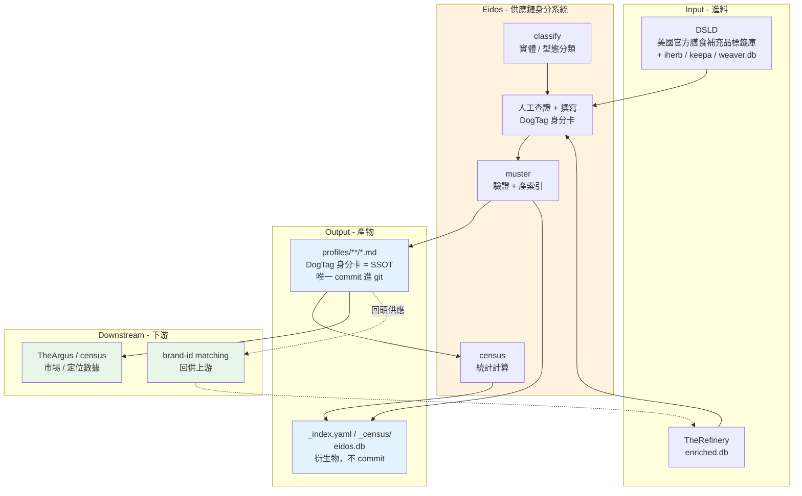

# Eidos - 供應鏈身分系統

---

## 📋 文檔目的

本文檔提供 **Eidos** 的系統導覽，幫助**新人建立對這套系統的整體理解**：

- Eidos 的系統職責與在 AlchemyMind 層的定位（它跟 pipeline 有何不同）
- 它的核心比喻：七種「DogTag 身分卡」
- 輸入 / 輸出資料格式與上下游介面
- 一份把系統術語翻成白話的**名詞對照表**（放在「🔑 關鍵概念」）

> **給你的閱讀建議**：先看「🎯 系統職責」的命名由來與「🪪 七種 DogTag 身分卡」建立直覺，再看「🔑 關鍵概念」的名詞對照表時**只讀標 🔴 的 11 個**即可上手；其餘 🟡 用到再回來查。

> **完整技術文檔**：Eidos 專案的 `CLAUDE.md` 與 `specs/DogTag/README.md`
> **操作指南**：`.claude/skills/` 目錄下的 21 個專用 skill

---

## 🎯 系統職責

**Eidos** 是 AlchemyMind 層的**膳食補充品供應鏈身分系統**，把保健食品產業裡的每一個角色 —— 每個品牌、每間公司、每個官網、每個專利成分、每個菌株 —— 都登記成一張帶有來源證據的**身分卡（DogTag）**。

市面上有幾十萬項保健食品，但「這些產品背後是誰做的、誰擁有誰」常常一團亂 —— 同一個品牌可能被併購、換過名、有好幾個網站。Eidos 的工作就是把這些身分關係**查清楚、記下來，而且每一筆都能追到證據來源**。

### 核心職責

| 項目 | 說明 |
|------|------|
| **職責** | curate 品牌 / 公司 / 網域 / 商標 / 菌株的持久身分事實（ownership、composition、certification、type） |
| **輸入** | DSLD 官方標籤庫 + TheRefinery 的 `enriched.db`（另有 iherb / keepa / weaver.db） |
| **輸出** | `profiles/**/*.md` DogTag 身分卡（唯一 commit 進 git 的來源真相） |
| **處理規模** | 24,000+ 張身分卡（7 種實體類型） |

### 核心價值

- **身分即真相**：把雜亂的供應鏈關係萃取成結構化、可查證的身分卡
- **互相指認**：品牌卡寫「屬於哪間公司」、成分卡寫「擁有者是誰、用了哪項技術」，連起來成一張供應鏈關係網
- **provenance 可追**：每筆欄位都記「哪來的、多可信」，資料才不會越改越糟
- **身分 ≠ 市場表現**：只記持久身分事實，不記市占 / 銷量這類會變的數字（那是下游 TheArgus 的工作）

### 命名由來

- **Eidos**（希臘文 εἶδος）意為「形式、本質」。在希臘哲學裡指事物的「本質形態」—— 系統的任務正是從雜亂資料中**萃取每個實體的身分本質**。
- **DogTag** 原意是軍人配戴的「身分辨識牌」。這裡借喻：每個實體都有一張記載其身分事實的檔案卡。

（這延續了 LuminNexus 用命名承載概念的傳統，如 TheArgus 取自百眼巨人 Argus Panoptes，象徵全面監控。）

### 系統定位
- **Layer**: AlchemyMind (Layer 2)
- **上游**: TheRefinery（產出 `enriched.db`）
- **下游**: TheArgus / census（市場 / 定位數據）；並回頭供應 brand-id matching

---

## 🏗️ 系統架構



**資料流說明**：
1. **Input**：DSLD 官方標籤庫是最主要的原始進料；TheRefinery 的 `enriched.db` 提供加值 / 交叉對應資料。
2. **Processing**：`classify` 判斷實體型態 → 人工查證撰寫 DogTag → `muster` 驗證並產索引 → `census` 算統計。
3. **Output**：唯一 commit 進 git 的來源真相是 `profiles/**/*.md`；`_index.yaml`、`_census/`、`eidos.db` 都是衍生物，不進 git。
4. **Downstream**：身分卡供 TheArgus / census 計算市場數據，並回頭供應 brand-id matching。

---

## 📥 輸入資料 (Input)

### 主要原始資料來源

**DSLD**（Dietary Supplement Label Database）—— 美國政府官方的「膳食補充品標籤資料庫」，是 Eidos 最主要的原始進料。

### 五個進料資料庫

| 資料庫 | 內容 | 說明 |
|--------|------|------|
| `dsld.db` | DSLD 核心資料 | 產品 / 品牌 / 成分（官方標籤） |
| `iherb.db` | iHerb 產品資料 | 線上零售商目錄 |
| `keepa.db` | Amazon 產品目錄 | brand / manufacturer / UPC / title / ingredients |
| `weaver.db` | 交叉對應、功能映射 | cross-references |
| `enriched.db` | 品牌身分映射、加值資料 | **由上游 TheRefinery 產出** |

**重要**：Eidos 是 TheRefinery 產出 `enriched.db` 的**下游消費者**；下游系統以 ATTACH 方式讀取這些資料庫進行分析。

---

## 📤 輸出資料 (Output)

### 1. DogTag 身分卡（來源真相，SSOT）

**格式**：Markdown（`.md`），一個檔 = 一張身分卡

**位置**：`profiles/**/*.md`

**這是唯一 commit 進 git 的來源真相**。目錄結構：

```
profiles/
├── brands/                 # 品牌身分卡
├── companies/              # 公司身分卡
├── domains/                # 網域身分卡
├── strains/                # 菌株身分卡
└── marks/                  # 三種商標
    ├── branded_ingredient/     # BI: WHAT — 成分
    ├── branded_technology/     # BT: HOW — 技術
    └── branded_provenance/     # BP: WHO/WHERE — 來源
```

### 2. 衍生物（不 commit，用再重生）

| 產物 | 產生器 | 說明 |
|------|--------|------|
| `_index.yaml` | `muster` | 自動產的總目錄，人不用手改 |
| `_census/` | `census` | DSLD 統計 + 目標客群 |
| `output/eidos.db` | `dogtag export` | 把所有卡打包成一個 SQLite，供下游用 |
| `brand_profiles/*.json` | `batch_brand_profiles.py` | 可重生的統計版品牌 JSON |

---

## 🪪 七種 DogTag 身分卡

身分卡分三群：**主角**（品牌、公司）、**周邊**（網域、菌株）、以及最有特色的**三種商標**（用 WHAT / HOW / WHO 區分）。

| 類型 | 英文 | 白話 | 回答的問句 | 例子 | 實測數量 |
|---|---|---|---|---|---|
| **品牌** | Brand | 消費者看到的招牌 | — | Nature's Bounty | 11,526 |
| **公司** | Company | 背後的法人 | — | Nestlé Health Science | 3,731 |
| **網域** | Domain | 官網 / 網站 | — | olly.com | 8,398 |
| **成分商標** | Branded Ingredient (BI) | 有商標的原料成品 | **WHAT** 是什麼成分 | BioPerine® | 854 |
| **技術商標** | Branded Technology (BT) | 有商標的製程 / 技術 | **HOW** 用什麼技術做 | Phytosome® | 62 |
| **來源商標** | Branded Provenance (BP) | 有商標的來源 / 品質保證 | **WHO/WHERE** 來自哪 | Albion® | 80 |
| **菌株** | Strain | 益生菌的特定品系 | — | PS128 | 30 |

> **記住三種商標的一句話**：把一顆保健食品拆開 —— **BI = 裡面放什麼、BT = 用什麼手法做、BP = 原料從哪來、品質如何**。

身分卡的價值在於**互相指認**：品牌卡寫「我屬於哪間公司」、成分卡寫「擁有者是誰、用了哪項技術」。連起來就成了一張供應鏈關係網，這就是 Eidos 的核心產出。

---

## 🔧 核心功能

### 1. 四個工具鏈（都用 `uv run`）

| 工具 | 職責 | 白話 |
|------|------|------|
| **muster** | 驗證 + 產索引 | 「點名整隊」：掃過所有卡編總目錄，順便檢查有沒有寫錯 |
| **census** | 統計計算 | 「人口普查」：從資料庫**算出**品牌統計 |
| **dogtag** | 查詢 CLI | 查卡查詢機：輸入品牌名就吐出那張卡 |
| **classify** | 實體分類 | 自動判斷「這是什麼類型」的分類器 |

### 2. Provenance Gate（來源可信度閘門）

每筆資料都記「哪來的、多可信」；閘門規定 **「低可信來源不准覆蓋高可信」**，避免多個程式互改打架。可信度等級（source tier）由高到低：人工查證 > LLM 判斷 > 內容分類 > 直接探測 > 種子匯入。

### 3. SSOT（唯一真相來源）

某件事只以一個地方為準。例：`profiles/**/*.md` 是身分的唯一真相；`_index.yaml` 等衍生物不是。issue 是它自己狀態的唯一真相，commit 訊息不算。

### 4. 品質關卡（pre-commit / muster --strict）

送出前的自動檢查關卡：存進 git 前先跑一輪 `muster --strict`，有 ERROR 就擋下。批次產出另有 `acceptance_review.py` 驗收總關卡，把散落檢查收成一個過 / 不過結論（訊息分 **BLOCK / WARN / INFO** 三級，有一個 BLOCK 就不通過）。

> **延伸**：provenance / source tier 是 Eidos 特有的機制（LearningMap 他處未涵蓋），故在此自述。資料品質的通用視角（品質維度、驗證）可延伸看 [theargus.md](theargus.md)（姊妹系統，資料品質檢測）與 [../../roles/testing/](../../roles/testing/)（資料品質三面向）。

---

## 📊 資料格式與 Schema

### 身分卡的結構：frontmatter + 內文

每張 DogTag 是一個 Markdown 檔，最上面用 `---` 夾住的是 **frontmatter**（表頭欄位區，寫法叫 **YAML**），下面才是文字說明。

```markdown
---
schema_version: "0.8"
brand_name: "Nature's Bounty"
parent_company: nbty-inc        # FK：指向公司卡
status: active
draft: false
---

# Nature's Bounty
（身分描述內文…）
```

### 關鍵欄位概念

| 欄位概念 | 說明 |
|---------|------|
| `schema_version` | 「該有哪些欄位」的規格書版本（如網域目前 `domain_profile.v0.13`） |
| **FK（外鍵）** | 「這張卡指向另一張卡」的連結（如品牌 → 母公司） |
| **slug / kebab-case** | 卡片檔名代號，命名規則是小寫 + 連字號（`nature-made`） |
| `eidos_scope` | 判定「算不算我們要收的補充品範圍」 |
| `draft` | 卡片還在草稿、未核准的標記 |

### 三種商標的 schema

BI / BT / BP 共用一組 Identity Core（12 欄位，由 muster 驗證）。三型目前版本異質：**BI 為 v0.9**，**BT / BP 為 v0.8**。BI 另有選用的 `branded_technology`（BI→BT FK）與 `variant_of`（子款指回母款）。

> **通用概念**：本節只講 Eidos 專屬的 schema。frontmatter / YAML 的基礎見 [../../general/knowledge-management.md](../../general/knowledge-management.md)；schema、主鍵 / 外鍵（FK）、正規化等概念見 [../../general/03_data-engineering.md](../../general/03_data-engineering.md)。

---

## 🔌 介面說明

### 1. TheRefinery（上游）

**輸入介面**：`enriched.db`（品牌身分映射、加值資料）。Eidos 是這份資料庫的下游消費者。

### 2. brand-id matching（下游 - 回頭供應）

Eidos 的身分卡會**回頭供應** brand-id matching，幫上游把散落的 brand 欄位對應到正確的身分。

### 3. TheArgus / census（下游 - 市場數據）

**這是 Eidos 不做的那半**：市場覆蓋、定位、銷量、市占等**會變動的數字**由下游 TheArgus / census 層**從產品資料計算**，不在 Eidos curate。

> **一條最重要的界線：身分 ≠ 市場表現。** 分清這條線，是理解 Eidos 的第一把鑰匙。

---

## ⚙️ 配置與參數

### 執行工具

本專案用 **uv** 管理 Python 環境，所有指令前都加 `uv run`。

```bash
# 一次性安裝 pre-commit hooks
uv sync --extra dev
uv run pre-commit install
```

### 進料資料庫路徑

```bash
input/dsld.db      # DSLD 核心
input/iherb.db     # iHerb
input/keepa.db     # Amazon
input/weaver.db    # 交叉對應
input/enriched.db  # 上游 TheRefinery 加值
```

---

## 🚀 使用方式

### 查詢身分卡（dogtag CLI）

```bash
uv run dogtag brand "Nature's Bounty"
uv run dogtag company "Nestlé"
uv run dogtag domain "olly.com"
uv run dogtag ingredient "BioPerine"        # BI
uv run dogtag strain "PS128"
uv run dogtag search "organic"
```

### 驗證與產索引（muster）

```bash
# 加卡後重產索引
uv run muster ./profiles

# 嚴格驗證（CI / pre-commit 用，有 ERROR 就擋）
uv run muster ./profiles --strict --dry-run

# 只驗單一檔
uv run muster profiles/brands/some_brand.md --strict
```

### 產統計（census）

```bash
uv run census ./profiles
```

### 正確的工作流程

```bash
# 1. 編輯源檔 profiles/*.md
# 2. 重產衍生物（不 commit）
uv run muster ./profiles      # → _index.yaml
uv run census ./profiles      # → _census/
# 3. 只 commit 源檔
git add profiles/brands/new_brand.md
git commit -m "feat: Add new brand profile"
```

> **詳細操作**：請參考 Eidos 專案的 `specs/DogTag/README.md` 與 `.claude/skills/`。

---

## 🔑 關鍵概念

> 把系統術語翻成白話。分兩層：**🔴 必懂**（不懂就看不懂系統，先只記這些）與 **🟡 該懂**（理解運作原理時需要）。更細的日常操作術語不在此列，請查專案的 `specs/DogTag/README.md`。

### 🔴 最小必懂集合（先只記這 11 個）

| 名詞 | 白話 |
|---|---|
| **DogTag** | 系統的靈魂比喻：一切都是「身分辨識牌」。 |
| **profile** | 一張 DogTag 身分卡，一個 `.md` 檔=一張卡。 |
| **frontmatter** | 檔案最上面用 `---` 夾住的「表頭欄位區」，像表單的固定欄位；下面才是文字說明。 |
| **muster** | 「點名整隊」工具：掃過所有卡編總目錄，順便檢查有沒有寫錯。 |
| **dogtag (CLI)** | 查卡的查詢機：輸入品牌名就吐出那張卡。 |
| **provenance / provenance gate** | 每筆資料都記「哪來的、多可信」；閘門規定「低可信來源不准覆蓋高可信」，避免程式互改打架。 |
| **SSOT**（唯一真相來源） | 某件事只以一個地方為準。例：issue 是它自己狀態的唯一真相，commit 訊息不算。 |
| **pre-commit / hook** | 「送出前的自動檢查關卡」：存進 git 前先跑一輪，沒過就擋下。 |
| **BLOCK / WARN / INFO** | 三級訊息：BLOCK 必須修、WARN 警告可放行、INFO 純提示。 |
| **BI / BT / BP** | 三種商標：成分(WHAT)/ 技術(HOW)/ 來源(WHO)。 |
| **DSLD** | 美國政府官方的「膳食補充品標籤資料庫」，最主要的原始進料。 |

### 🟡 該懂：資料怎麼組織

| 名詞 | 白話 |
|---|---|
| **YAML / Markdown** | frontmatter 的「欄位: 值」寫法叫 YAML；整張卡的檔案格式叫 Markdown。 |
| **schema / schema_version** | 「該有哪些欄位」的規格書，及它的版本號（如網域目前 v0.13）。 |
| **source tier** | 來源的可信度等級：人工查證 > LLM 判斷 > 內容分類 > 直接探測 > 種子匯入。 |
| **FK（外鍵）** | 「這張卡指向另一張卡」的連結（如品牌 → 母公司）。 |
| **slug / kebab-case** | 卡片檔名代號；命名規則是小寫 + 連字號（`nature-made`）。 |
| **eidos_scope** | 判定「算不算我們要收的補充品範圍」。 |
| **draft** | 卡片還在草稿、未核准的標記。 |
| **branded_ingredient / technology / provenance** | BI / BT / BP 三類商標的完整名稱，也是 `profiles/marks/` 下的資料夾名。 |

### 🟡 該懂：工具與流程

| 名詞 | 白話 |
|---|---|
| **census** | 「人口普查」：從資料庫**算出**品牌統計（不是查證來的）。 |
| **uv / uv run** | 這專案的 Python 執行工具，所有指令前都加 `uv run`。 |
| **五個 .db**（dsld / iherb / keepa / weaver / enriched） | 五個原料資料庫（官方標籤 / iHerb / Amazon / 交叉對應 / 加值），是「進料倉庫」。 |
| **_index.yaml** | muster 自動產的「總目錄檔」，人不用手改。 |
| **muster --strict** | muster 的嚴格模式：有 ERROR 就擋下，CI 與 pre-commit 用的就是它。 |
| **acceptance_review.py** | 批次「驗收總關卡」：把散落的檢查收成一個過 / 不過結論。 |
| **issue lifecycle** | GitHub issue 生命週期：issue 本身是工作說明書，也是它自己狀態的唯一來源。 |
| **domain-probe (L0–L3)** | 幫網域填卡的四步：身分 → 建站技術 → 範圍 → 年份 / 地區。 |
| **TheRefinery / TheArgus** | 上下游姊妹系統（精煉層 / 檢測層）；市場數據由下游算，不在 Eidos。 |

---

## 🐛 常見問題與除錯

### Q1: Eidos 和 pipeline（產品層）有什麼差別？

**A**：
- **產品層 pipeline**：以「產品」（SKU）為單位，回答「市面上有哪些產品、賣得如何」，資料是機器產出的 SQLite DB。
- **Eidos 身分層**：以「實體身分」為單位，回答「這些產品背後**是誰**、誰擁有誰」，資料是人工查證的 Markdown 身分卡。

| | 產品層 pipeline | Eidos 身分層 |
|---|---|---|
| 基本單位 | 產品(SKU) | 實體(品牌/公司/網域/商標/菌株) |
| 資料形態 | SQLite DB(機器產出) | Markdown 身分卡(人工查證) |
| 真相來源 | 上游 API / 爬蟲快照 | 第一手查證 + provenance |
| 誰算市場數據 | TheArgus / census | 不在 Eidos(身分 ≠ 定位) |

### Q2: Eidos 和 TheDistiller 都有「品牌數」，為什麼數字差很多？

**A**：不同單位。TheDistiller 的品牌數是「產品表上的 brand 欄位」；Eidos 的品牌數是「有身分卡的品牌 profile」(含 status / ownership 等查證資訊)。兩者不是同一種東西。

### Q3: 身分卡改完要 commit 哪些檔？

**A**：只 commit `profiles/**/*.md` 源檔。`_index.yaml`、`_census/`、`eidos.db` 等是自動產生的衍生物，不進 git。

### Q4: 為什麼一直強調 provenance / 可信度？

**A**：因為 Eidos 的價值是「可信的身分」。同一個欄位可能被多個程式想寫，provenance gate 確保「低可信來源不會蓋掉人工查證的值」，資料才不會越改越糟。

### Q5: muster --strict 沒過怎麼辦？

**A**：
1. 看訊息前綴：`✗` = ERROR（必修）、`⚠` = WARN、`ℹ` = INFO。
2. 常見 ERROR：重複 `company_name`、非 kebab-case 的 company slug、遺漏必要欄位、frontmatter YAML 語法錯。
3. 只驗單檔快速回饋：`uv run muster profiles/brands/xxx.md --strict`。

---

## 🎯 適用角色

### 新進工程師
- ✅ 建立「身分層 vs 產品層」的基本分野
- ✅ 看懂一張 DogTag 身分卡的組成（frontmatter + 內文）
- ✅ 知道七種身分卡各代表什麼、彼此如何互相指認
- 📖 建議先閱讀: [00_overview.md](00_overview.md), [therefinery.md](therefinery.md)

### 身分卡維護者
- ✅ 掌握 muster / dogtag / census 的日常用法
- ✅ 理解 provenance gate 為何存在，以及 source tier 的高低順序
- ✅ 記住「只 commit 源檔、衍生物用再重生」的工作流程
- 📖 建議先閱讀: 本文檔「🚀 使用方式」+ 專案 `specs/DogTag/README.md`

### 跨團隊協作
- ✅ 明確 Eidos 的輸入來自 TheRefinery `enriched.db`
- ✅ 知道身分卡會回頭供應 brand-id matching
- ✅ 分清市場 / 定位數據不在 Eidos，而在 TheArgus / census
- 📖 建議先閱讀: [../01_data-flow.md](../01_data-flow.md), [theargus.md](theargus.md)

### 架構師
- ✅ 掌握 Eidos 在 AlchemyMind 層的定位（不在逐批處理的產品流水線上）
- ✅ 評估 SSOT 以 Markdown 為真相來源的取捨
- ✅ 規劃身分資料與產品資料的整合邊界
- 📖 建議先閱讀: [../00_architecture-overview.md](../00_architecture-overview.md)

---

## 📚 相關文檔

### Learning Map 文檔
- [00_overview.md](00_overview.md) - AlchemyMind 概覽
- [../00_architecture-overview.md](../00_architecture-overview.md) - 系統架構全景
- [../01_data-flow.md](../01_data-flow.md) - 資料流與系統串連
- [therefinery.md](therefinery.md) - TheRefinery（產出 enriched.db，Eidos 的上游）
- [theargus.md](theargus.md) - TheArgus（市場 / 異常檢測，Eidos 不做的那半）

### 通用概念（先備知識）
- [../../general/knowledge-management.md](../../general/knowledge-management.md) - Frontmatter 與 PKM（「資料格式與 Schema」的先備知識）
- [../../general/03_data-engineering.md](../../general/03_data-engineering.md) - Schema、主鍵 / 外鍵（FK）、ETL / Enrich 基礎

### Eidos 專案文檔
- `LuminNexus-AlchemyMind-Eidos/CLAUDE.md` - 專案索引與開發歷史
- `LuminNexus-AlchemyMind-Eidos/specs/DogTag/README.md` - DogTag 使用指南
- `LuminNexus-AlchemyMind-Eidos/specs/DogTag/RUNBOOK.md` - 維護者指南
- `LuminNexus-AlchemyMind-Eidos/.claude/skills/` - 21 個 Claude Code 技能

---

## 📝 文檔維護

### 版本歷史

| 版本 | 日期 | 作者 | 變更說明 |
|------|------|------|----------|
| 1.0 | 2026-07-20 | Dustin | 初版：對齊子系統文檔結構（系統職責 / 架構圖 / 七種 DogTag / 名詞白話對照表）；schema 概念外連 general/，profile 數字與 schema 版本對齊實檔 |
| 1.1 | 2026-07-20 | Dustin | 定位改為新人系統導覽（非「非技術背景」）；關鍵概念砍 ⚪ 進階詞、消除重複定義、五表併兩表；新增「適用角色」；related 補 thedistiller |

### 維護職責
- **主要維護者**: Dustin
- **審核者**: Architecture Team
- **更新頻率**: 當架構變更或 profile 數量大幅變動時

### 系統依賴

**上游依賴**：
- AlchemyMind Team (TheRefinery) - `enriched.db`
- DSLD 官方標籤庫 - 主要原始進料

**下游依賴**：
- TheArgus / census - 使用身分卡計算市場 / 定位數據
- brand-id matching - 回頭供應上游對應

---

**文檔結束**

> **注意**：本文檔為新人導覽用的系統概覽，詳細技術實作請參考 Eidos 專案的 `CLAUDE.md` 與 `specs/DogTag/`。profile 數量會隨批次上架成長，如與現況落差過大請重新核對。
