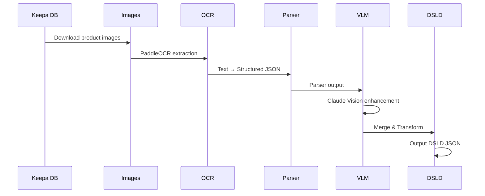

# Factum - Supplement Facts 圖片解析

---

## 📋 文檔目的

本文檔提供 **Factum** 系統的說明，幫助讀者理解：
- Factum 的職責與功能
- OCR + Parser + VLM 的處理流程
- DSLD 相容 JSON 的輸出格式

---

## 🎯 系統概述

**Factum** 是 AlchemyMind 的 **圖片解析子系統**，負責：
- 從 Amazon 產品圖片中提取 Supplement Facts 標籤
- 使用 OCR + Parser 結構化解析營養成分
- 使用 VLM (Claude Vision) 補充 OCR 無法捕捉的資訊
- 輸出 **DSLD (NIH Dietary Supplement Label Database)** 相容的 JSON

---

## 🏗️ 系統架構

```mermaid
graph LR
    subgraph "Factum Pipeline"
        DB[(Keepa DB)] --> DL[Download Images]
        DL --> OCR[PaddleOCR]
        OCR --> Parser[Supplement Facts Parser]
        Parser --> VLM[Claude VLM Enhancement]
        VLM --> DSLD[DSLD JSON Transformer]
    end

    DSLD --> OUT[working/dsld/{asin}/*.dsld.json]

    style OCR fill:#fff3e0
    style Parser fill:#fff3e0
    style VLM fill:#e3f2fd
    style DSLD fill:#e8f5e9
```

---

## 📦 核心元件

### 1. Image Downloader
- **職責**: 從 Amazon CDN 下載產品圖片
- **輸入**: Keepa DB 中的 image URLs
- **輸出**: `vault/images/{asin}/{hash}.jpg`

### 2. PaddleOCR
- **職責**: 文字辨識
- **功能**:
  - 行合併 (Y 座標群組)
  - 多欄排版偵測
  - Supplement Facts 關鍵字偵測
- **輸出**: `vault/ocr/{asin}/{hash}.txt`

### 3. Supplement Facts Parser
- **職責**: 結構化解析 OCR 文字
- **功能**:
  - Name + Amount + Unit 模式辨識
  - 多面板支援 (AM/PM formulas)
  - 縮排層級偵測
  - 酵素產品單位支援 (HUT, PC, USP, etc.)
- **輸出**: `working/parsed/{asin}/{hash}.sf.json`

### 4. VLM Enhancement (Claude Vision)
- **職責**: 補充 OCR/Parser 無法擷取的資訊
- **擷取內容**:
  - 品牌名稱 (Brand)
  - 頁尾地址 (Footer Address)
  - 認證標章 (Certifications)
  - 斜體/造型文字
  - 科學名稱
- **輸出**: `working/vlm/{asin}/{hash}.sf.json`

### 5. DSLD Transformer
- **職責**: 轉換為 NIH DSLD 相容格式
- **輸出格式**: LanguaL codes, servingSizes, ingredientRows
- **輸出**: `working/dsld/{asin}/{hash}.dsld.json`

---

## 🔄 處理流程



---

## 📁 目錄結構

| 目錄 | 內容 | 可變性 |
|------|------|--------|
| `data/` | Keepa 資料庫 | **只讀** |
| `vault/images/` | 產品圖片 | 不變 |
| `vault/ocr/` | OCR 文字輸出 | 穩定 |
| `working/parsed/` | Parser 輸出 JSON | 迭代 |
| `working/vlm/` | VLM 擷取 JSON | 迭代 |
| `working/dsld/` | DSLD 相容 JSON | 迭代 |

---

## 📊 品質分級

| 等級 | 分數範圍 | 說明 |
|------|----------|------|
| A | ≥ 0.90 | 優秀 - 可生產使用 |
| B | ≥ 0.80 | 良好 - 小問題 |
| C | ≥ 0.70 | 一般 - 需審查 |
| D | ≥ 0.60 | 差 - 顯著問題 |
| F | < 0.60 | 失敗 - 不可用 |

---

## 🎯 VLM 處理策略

根據 Parser Grade 選擇不同路徑：

| Parser Grade | 處理路徑 | 成本/圖 |
|--------------|----------|---------|
| A/B | OCR+Parser+Haiku | ~$0.003 |
| C/D/F | Opus Skill Agent | ~$0.10 |

**關鍵發現**:
- VLM One-Shot 數值讀取不可靠
- OCR+Parser 數值可靠，Haiku 可修結構和補欄位
- Haiku 能修正名稱 OCR 錯誤（如 lodine→Iodine, Dz→D2）

---

## 📄 DSLD 輸出格式

```json
{
  "asin": "B00014D20K",
  "hash": "61qPoG5C52L",
  "version": "dsld-v1.0",
  "fullName": "Hawthorn Berries",
  "brandName": "Nature's Way",
  "productType": {"langualCode": "A1306", "langualCodeDescription": "Botanical"},
  "physicalState": {"langualCode": "E0159", "langualCodeDescription": "Capsules"},
  "servingSizes": [...],
  "ingredientRows": [...],
  "otherIngredients": {...},
  "statements": [...],
  "certifications": [...]
}
```

---

## 🔧 CLI 指令

```bash
# 完整 pipeline (單一 ASIN)
factum run <asin>

# 分步執行
factum ocr <asin>
factum parse <asin>
factum validate <asin>

# 批次處理
factum ocr --all
factum parse --all --force

# VLM Pipeline
uv run python scripts/batch_vlm_pipeline.py --asin-list asins.txt
```

---

## 🔗 與其他系統的關係

### 資料來源
- **Keepa DB** (AtlasVault): 產品資訊與圖片 URL

### 資料輸出
- **DSLD JSON**: 可供 AtlasVault 或其他系統使用
- 未來可整合到 TheWeaver 的分析流程

---

## 📚 相關文檔

### 內部文檔
- [00_overview.md](00_overview.md) - AlchemyMind 概覽
- [../atlasvault/dsld-crawler.md](../atlasvault/dsld-crawler.md) - DSLD Crawler

### 外部專案
- `LuminNexus-AlchemyMind-Factum/CLAUDE.md` - 完整專案說明
- `LuminNexus-AlchemyMind-Factum/specs/` - 規格文檔

---

## 📝 文檔維護

### 版本歷史

| 版本 | 日期 | 作者 | 變更說明 |
|------|------|------|----------|
| 1.0 | 2026-01-19 | maple | 初版建立 |

### 維護職責
- **主要維護者**: AlchemyMind Team
- **更新頻率**: 依專案進度更新

---

**文檔結束**
