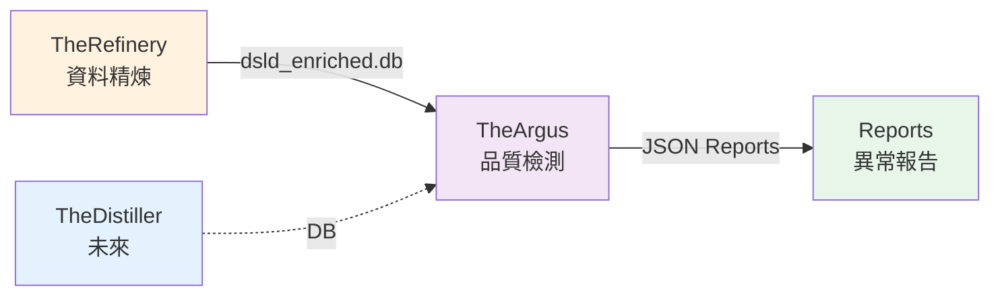
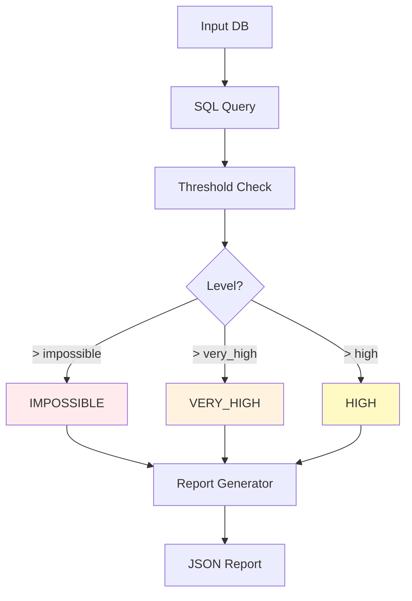

# TheArgus - 資料品質檢測系統

---

## 📋 文檔目的

本文檔提供 **TheArgus 資料品質檢測系統**的完整說明,幫助讀者理解:
- 系統的核心職責與目標
- 輸入/輸出資料格式與介面
- 基本使用方式 (CLI 命令)
- 在 LuminNexus 資料流中的定位
- 檢測策略與技術架構

---

## 🎯 系統職責

**TheArgus** 是 AlchemyMind 層的資料品質守護者,專門檢測 DSLD 補充品成分資料中的異常劑量值。

**命名由來**: Argus Panoptes (百眼阿爾戈斯) - 希臘神話中的百眼巨人,象徵全面監控與守護。

### 核心職責

| 項目 | 說明 |
|------|------|
| **職責** | 檢測補充品成分資料中的異常劑量 (impossibly high doses) |
| **檢測範圍** | 1.8M+ 補充品成分記錄 |
| **檢測層級** | Category-based (維生素、礦物質) + Ingredient-specific (維生素 A/C/D/E) |
| **輸出** | JSON 格式的異常報告,標註 HIGH / VERY_HIGH / IMPOSSIBLE 三級異常 |

### 系統定位
- **Layer**: AlchemyMind (Layer 2)
- **上游**: TheRefinery (資料精煉層)
- **下游**: Reports & Analytics (未來可能連接到 AlertSystem)

---

## 🏗️ 系統架構



**資料流說明**:
1. **Input**: TheRefinery 產出 `dsld_enriched.db` (標準化的成分資料)
2. **Processing**: TheArgus 執行檢測,識別異常劑量
3. **Output**: 生成 JSON 報告,供後續分析或人工審核
4. **未來**: 將接收 TheDistiller 的資料庫作為額外輸入

---

## 🔌 介面說明

### 輸入 (from TheRefinery)

**來源**: TheRefinery 的精煉資料庫
- **檔案**: `dsld_enriched.db` (SQLite, ~2.2GB)
- **關鍵資料表**: `NormalizedSupplementFact` - 含標準化後的成分劑量
- **未來擴充**: 將接收 TheDistiller 的輸出資料庫

**資料規模**:
- Vitamin 類: 272,859 筆記錄
- Mineral 類: 263,367 筆記錄

**Schema 要求**:
- `dsld_id` (INTEGER): 產品 ID
- `ingredient_name` (TEXT): 成分名稱
- `normalized_quantity` (REAL): 標準化劑量 (mg)
- `unit` (TEXT): 單位

---

### 輸出 (JSON Reports)

**格式**: JSON 報告檔案

**報告結構**:
```json
{
  "report_metadata": {
    "generated_at": "2025-11-28T17:00:00",
    "checker": "CategoryChecker",
    "category": "vitamin",
    "version": "0.2.0"
  },
  "thresholds": {
    "high": 1000,
    "very_high": 5000,
    "impossible": 10000
  },
  "summary": {
    "total_scanned": 272859,
    "total_anomalies": 1265,
    "by_level": {
      "IMPOSSIBLE": 36,
      "VERY_HIGH": 19,
      "HIGH": 1210
    }
  },
  "anomalies": [
    {
      "level": "IMPOSSIBLE",
      "dsld_id": 248050,
      "product_name": "Super Greens",
      "normalized_quantity": 2796833.0,
      "ingredient_name": "Vitamin C"
    }
  ]
}
```

**關鍵欄位說明**:
- `dsld_id`: 產品 ID (DSLD 產品識別碼)
- `level`: 異常等級 (HIGH / VERY_HIGH / IMPOSSIBLE)
- `normalized_quantity`: 標準化後的劑量 (統一單位: mg)
- `product_name`: 產品名稱 (供人工審核)

---

## 🔧 核心功能

### 1. Category-based 檢測

檢測整個類別的異常劑量 (如所有維生素、所有礦物質)

**支援類別**:
- **Vitamin** (維生素類) - 272,859 筆記錄
- **Mineral** (礦物質類) - 263,367 筆記錄

**特性**:
- 使用類別共用的閾值 (high / very_high / impossible)
- 適合快速掃描大範圍異常
- 配置檔案: `config/definitions/categories/`

---

### 2. Ingredient-specific 檢測

針對特定成分的精準檢測,使用針對該成分的專屬閾值

**已實作**:
- **Vitamin A** (維生素 A)
- **Vitamin C** (維生素 C)
- **Vitamin D** (維生素 D)
- **Vitamin E** (維生素 E)

**特性**:
- 更精確的閾值 (根據該成分的安全劑量範圍)
- 適合針對重點成分深入檢測
- 配置檔案: `config/definitions/ingredients/`

---

### 3. 三級異常分類

| 等級 | 定義 | 範例 (Vitamin C) | 建議動作 |
|------|------|-----------------|----------|
| **HIGH** | 高劑量但可能合理 | 1,000 - 5,000 mg | 標記供審核 |
| **VERY_HIGH** | 非常高劑量 | 5,000 - 10,000 mg | 優先審核 |
| **IMPOSSIBLE** | 不可能的劑量 (數據錯誤) | > 10,000 mg | 必須修正 |

**閾值設計原則**:
- 基於醫學文獻與安全劑量指南
- 考慮劑型差異 (錠劑 vs 粉末)
- 可透過 YAML 配置調整

---

## 📊 資料格式與 Schema

### Input Schema (dsld_enriched.db)

**資料表**: `NormalizedSupplementFact`

| 欄位 | 類型 | 說明 | 範例 |
|------|------|------|------|
| `dsld_id` | INTEGER | 產品 ID | 248050 |
| `ingredient_name` | TEXT | 成分名稱 | "Vitamin C" |
| `normalized_quantity` | REAL | 標準化劑量 (mg) | 2796833.0 |
| `unit` | TEXT | 單位 | "mg" |
| `product_name` | TEXT | 產品名稱 | "Super Greens" |

**重要**: TheRefinery 負責標準化劑量單位,TheArgus 假設所有劑量已轉換為 mg

---

### Output Schema (JSON Report)

**檔案命名**: `{category/ingredient}_report_{YYYYMMDD}.json`

**範例**:
- `vitamin_category_report_20251209.json`
- `vitamin_c_report_20251209.json`

**報告元數據**:
- `generated_at`: 生成時間
- `checker`: 檢測器類型 (CategoryChecker / IngredientChecker)
- `version`: TheArgus 版本號

---

## ⚙️ 配置與參數

### 環境設置

```bash
# 進入專案目錄
cd LuminNexus-AlchemyMind-TheArgus

# 安裝依賴 (使用 uv)
uv sync
```

### 配置檔案架構

```
theargus/config/definitions/
├── categories/
│   ├── vitamin.yaml    # 維生素類別配置
│   └── mineral.yaml    # 礦物質類別配置
└── ingredients/
    ├── vitamin_a.yaml  # 維生素 A 配置
    ├── vitamin_c.yaml  # 維生素 C 配置
    ├── vitamin_d.yaml  # 維生素 D 配置
    └── vitamin_e.yaml  # 維生素 E 配置
```

**YAML 配置範例** (vitamin_c.yaml):
```yaml
name: Vitamin C
category: vitamin
thresholds:
  high: 1000      # mg
  very_high: 5000 # mg
  impossible: 10000 # mg
sql_filter: "ingredient_name LIKE '%Vitamin C%'"
```

---

## 🚀 使用方式

### 列出可用的檢測器

```bash
# 列出所有成分檢測器
uv run theargus list-ingredients

# 輸出:
# Available ingredient checkers:
# - vitamin_a
# - vitamin_c
# - vitamin_d
# - vitamin_e

# 列出所有類別檢測器
uv run theargus list-categories

# 輸出:
# Available category checkers:
# - vitamin
# - mineral
```

---

### 執行成分檢測

```bash
# 檢測 Vitamin C
uv run theargus check-ingredient vitamin_c \
  --db input/dsld_enriched.db \
  -o output/reports/vitamin_c_report.json

# 檢測 Vitamin D
uv run theargus check-ingredient vitamin_d \
  --db input/dsld_enriched.db \
  -o output/reports/vitamin_d_report.json
```

**輸出範例**:
```
TheArgus v0.2.0 - Data Quality Checker
======================================
Checker: IngredientChecker (vitamin_c)
Input DB: input/dsld_enriched.db
Output: output/reports/vitamin_c_report.json

Scanning... ━━━━━━━━━━━━━━━━━━━━━━━━━━━━━━━━━━━━ 100%
✓ Scanned: 45,123 records
✓ Anomalies found: 87
  - IMPOSSIBLE: 3
  - VERY_HIGH: 8
  - HIGH: 76

Report saved to: output/reports/vitamin_c_report.json
```

---

### 執行類別檢測

```bash
# 檢測所有維生素
uv run theargus check-category vitamin \
  --db input/dsld_enriched.db \
  -o output/reports/vitamin_category_report.json

# 檢測所有礦物質
uv run theargus check-category mineral \
  --db input/dsld_enriched.db \
  -o output/reports/mineral_category_report.json
```

---

### 運行測試

```bash
# 執行所有測試 (123 tests, 87% coverage)
uv run python -m pytest tests/ -v

# 執行特定測試
uv run python -m pytest tests/test_category_checker.py -v

# 生成覆蓋率報告
uv run python -m pytest tests/ --cov=theargus --cov-report=html
```

---

## 📊 性能指標

### 檢測成果 (Latest Run: 2025-11-28)

| Category | Total Scanned | Anomalies | IMPOSSIBLE | VERY_HIGH | HIGH |
|----------|--------------|-----------|------------|-----------|------|
| Vitamin  | 272,859      | 1,265     | 36         | 19        | 1,210 |
| Mineral  | 263,367      | 117       | 51         | 15        | 51    |

**關鍵發現**:
- ~0.5% 的維生素記錄存在異常劑量
- ~0.04% 的礦物質記錄存在異常劑量
- **87 個 IMPOSSIBLE 等級異常需要資料修正**

---

### 性能表現

| 指標 | 數值 |
|------|------|
| 掃描速度 | ~50,000 records/second |
| 報告生成時間 | < 1 second |
| 記憶體使用 | < 100 MB |
| 測試覆蓋率 | 87% |

**優化策略**:
- SQLite 索引加速查詢
- 參數化查詢防止 SQL injection
- 批次處理減少記憶體使用

---

## 🏗️ 技術架構

### 1. 配置驅動架構

**優點**:
- **可擴展**: 新增檢測器只需添加 YAML 配置,無需修改程式碼
- **可維護**: 閾值調整不需要重新部署
- **可測試**: 配置與邏輯分離,易於單元測試

**配置載入流程**:
```
YAML 配置檔 → ConfigLoader → CheckerFactory → Checker 實例
```

---

### 2. 動態 SQL 查詢

**Query Builder**:
- 根據配置動態生成 SQL 查詢
- 支援複雜的過濾條件 (LIKE, IN, BETWEEN)
- 參數化查詢防止 SQL injection

**範例**:
```python
# 根據 vitamin_c.yaml 生成的 SQL
SELECT
    dsld_id,
    ingredient_name,
    normalized_quantity,
    product_name
FROM NormalizedSupplementFact
WHERE ingredient_name LIKE '%Vitamin C%'
  AND normalized_quantity > ?
ORDER BY normalized_quantity DESC
```

---

### 3. 三層檢測邏輯



---

## 🔄 資料循環說明

TheArgus 在 LuminNexus 的資料循環中扮演**品質守護角色**:

```
Vault (原始資料)
  ↓
TheForge (ETL)
  ↓
TheRefinery (精煉)
  ↓ dsld_enriched.db
TheArgus (品質檢測) ← 本系統
  ↓ JSON Reports
人工審核 / 自動化修正
  ↓
(回到 Vault,更新原始資料)
```

**重要**: TheArgus 不會直接修改資料庫,只產出報告供後續處理。

---

## 🐛 常見問題與除錯

### Q1: 為什麼 Vitamin 類異常率比 Mineral 類高?
**A**:
- 維生素類產品劑量範圍較大 (0.1mg - 10,000mg+)
- 礦物質類產品劑量較集中 (通常 < 1,000mg)
- 維生素 C 的高劑量產品 (1,000mg+) 在市場上較常見

---

### Q2: IMPOSSIBLE 等級的異常如何處理?
**A**:
1. 檢查報告中的 `dsld_id` 和 `product_name`
2. 回到原始資料 (Vault) 查證
3. 確認是資料錯誤後,更新原始資料
4. 重新執行 TheForge → TheRefinery → TheArgus 流程

---

### Q3: 如何新增一個成分檢測器?
**A**:
1. 在 `config/definitions/ingredients/` 新增 YAML 檔案
2. 定義 `name`, `category`, `thresholds`, `sql_filter`
3. (選擇性) 撰寫測試案例
4. 執行 `uv run theargus list-ingredients` 驗證

**範例**: 新增 Vitamin B12 檢測器
```yaml
# config/definitions/ingredients/vitamin_b12.yaml
name: Vitamin B12
category: vitamin
thresholds:
  high: 1000      # mcg (需注意單位轉換!)
  very_high: 5000
  impossible: 10000
sql_filter: "ingredient_name LIKE '%Vitamin B12%' OR ingredient_name LIKE '%Cobalamin%'"
```

---

### Q4: 檢測器執行失敗,如何除錯?
**A**:
1. 檢查輸入資料庫是否存在: `ls -lh input/dsld_enriched.db`
2. 檢查資料表是否正確: `sqlite3 input/dsld_enriched.db ".schema NormalizedSupplementFact"`
3. 檢查配置檔案語法: `yamllint config/definitions/`
4. 啟用 debug 模式: `uv run theargus check-ingredient vitamin_c --debug`

---

### Q5: 如何調整閾值?
**A**: 直接編輯 YAML 配置檔案,不需要修改程式碼

**範例**: 調整 Vitamin C 的閾值
```yaml
# config/definitions/ingredients/vitamin_c.yaml
thresholds:
  high: 2000      # 從 1000 調整為 2000
  very_high: 8000 # 從 5000 調整為 8000
  impossible: 15000 # 從 10000 調整為 15000
```

重新執行檢測即可套用新閾值。

---

## 📚 相關文檔

### Learning Map 文檔
- [00_overview.md](00_overview.md) - AlchemyMind 概覽
- [../00_architecture-overview.md](../00_architecture-overview.md) - 系統架構全景
- [../01_data-flow.md](../01_data-flow.md) - 資料流與系統串連
- [therefinery.md](therefinery.md) - TheRefinery 詳細說明 (上游系統)

### TheArgus 專案文檔
- `LuminNexus-AlchemyMind-TheArgus/CLAUDE.md` - 專案記憶檔與開發歷史
- `LuminNexus-AlchemyMind-TheArgus/README.md` - 專案 README
- `LuminNexus-AlchemyMind-TheArgus/.claude/skills/` - Claude Code 技能指南
- `LuminNexus-AlchemyMind-TheArgus/specs/` - 檢測器規格文檔

---

## 🎯 適用角色

### 新進工程師
- ✅ 快速理解 TheArgus 的職責與定位
- ✅ 學習基本的 CLI 使用方式
- ✅ 了解檢測報告格式
- 📖 建議先閱讀: [00_overview.md](00_overview.md), [therefinery.md](therefinery.md)

### 測試工程師
- ✅ 理解檢測邏輯與閾值設計
- ✅ 學習如何撰寫測試案例
- ✅ 了解如何驗證檢測結果
- 📖 建議先閱讀: 本文檔 + 專案測試文檔

### 跨團隊協作
- ✅ 明確 Input/Output 資料格式
- ✅ 理解資料流的上下游關係
- ✅ 協調資料介面規範
- 📖 建議先閱讀: [../01_data-flow.md](../01_data-flow.md)

### 架構師
- ✅ 掌握系統在 AlchemyMind 層的角色
- ✅ 評估系統擴展性 (TheDistiller 整合)
- ✅ 規劃未來的檢測策略
- 📖 建議先閱讀: [../00_architecture-overview.md](../00_architecture-overview.md)

---

## 📝 文檔維護

### 版本歷史

| 版本 | 日期 | 作者 | 變更說明 |
|------|------|------|----------|
| 1.0 | 2025-12-09 | AlchemyMind Team - TheArgus | 初版建立,整合 TheArgus team 的內容 |

### 維護職責
- **主要維護者**: AlchemyMind Team - TheArgus
- **審核者**: Architecture Team
- **更新頻率**: 每季度檢視,或重大功能更新時

### 下一步
- [ ] 整合 TheDistiller 的輸入介面
- [ ] 新增更多成分檢測器 (Vitamin B 系列, Calcium, Iron, etc.)
- [ ] 實作自動化修正建議功能
- [ ] 建立異常追蹤系統 (與 Vault 整合)

---

**文檔結束**

*"百眼守護,品質無虞" - Hundred eyes watching, quality assured* 👁️
