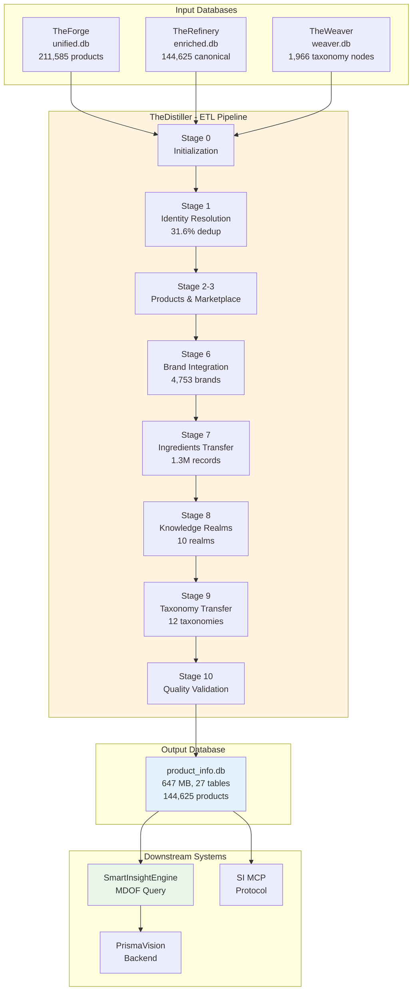
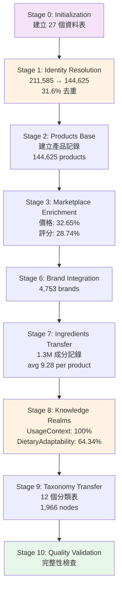

# TheDistiller - 產品資料統一化 ETL Pipeline

---

## 📋 文檔目的

本文檔說明 **TheDistiller** 作為 LuminNexus 的**資料統一化 ETL Pipeline**，幫助讀者理解:
- TheDistiller 在整體資料循環中的定位
- 從多資料庫整合到統一產品資料庫的完整流程
- Identity Resolution 與去重策略
- 與 SmartInsightEngine 的資料介面

> **完整技術文檔**: TheDistiller 專案的 `CLAUDE.md` 與 `specs/` 目錄

---

## 🎯 系統職責

**TheDistiller** 是 LuminNexus 的**資料統一化 ETL Pipeline**，負責將來自 TheForge 和 TheRefinery 的多個資料來源整合、清理、豐富，最終生成一個統一的產品資訊資料庫。

### 核心職責

| 項目 | 說明 |
|------|------|
| **職責** | 資料整合、身份解析、知識領域分類 |
| **輸入** | 3 個資料庫 (unified.db, enriched.db, weaver.db) |
| **輸出** | product_info.db (647 MB, 27 tables) |
| **處理規模** | 211,585 → 144,625 products (31.6% 去重) |
| **執行時間** | ~10 分鐘 (完整 pipeline) |

### 核心價值

將分散的補充品資料（211,585 筆 DSLD 產品）整合為乾淨、去重、豐富的資料集（144,625 筆標準產品），並提供完整的成分資訊、分類標籤、知識領域屬性。

---

## 🏗️ 系統架構



---

## 📥 輸入來源 (Input)

TheDistiller 從三個資料庫讀取資料：

| 資料庫 | 來源系統 | 內容 | 產品數 |
|--------|---------|------|--------|
| **unified.db** | TheForge | 原始 DSLD 產品資料、基本產品資訊 | 211,585 |
| **enriched.db** | TheRefinery | 身份解析 (DSLDProductIdentityMembers)<br/>知識領域分類 (UsageContext, DietaryAdaptability)<br/>Marketplace 數據 (價格、評分)<br/>正規化成分 (IngredientNormalized) | 144,625 |
| **weaver.db** | TheWeaver | 分類定義 (12 個 Taxonomy 表)<br/>階層式分類結構<br/>參考資料 | 1,966 nodes |

### 關鍵輸入表

**來自 enriched.db**:
- `DSLDProductIdentityMembers` - 產品身份映射 (1:N mapping)
- `MarketplaceEnrichedDSLD` - Marketplace 數據 (價格、評分)
- `IngredientNormalized` - 正規化成分 (130 萬筆)

**來自 weaver.db**:
- `UsageContextTaxonomy` - 使用情境分類 (922 nodes)
- `DietaryAdaptabilityTaxonomy` - 飲食適應性分類 (137 nodes)
- 其他 10 個 Taxonomy 表

---

## 📤 輸出結果 (Output)

### product_info.db

**檔案名稱**: `product_info.{version}.db` (目前: `dsld_distiller.db`)

**資料庫大小**: 647 MB

**表結構**: 27 個資料表，分為 5 大類別

#### 1. 核心資料表 (2)

| 表名 | 記錄數 | 說明 |
|------|--------|------|
| Products | 144,625 | 統一產品資訊 (canonical products) |
| Brands | 4,753 | 品牌資訊 |

#### 2. 成分資料 (1)

| 表名 | 記錄數 | 說明 |
|------|--------|------|
| SupplementFact | 1,307,542 | 正規化成分記錄 (avg 9.28 per product)<br/>包含成分名稱、UNII 代碼、劑量、單位 |

#### 3. 分類表 (12 Taxonomies)

- **DosageFormTaxonomy** - 劑型分類
- **SupplementFactTaxonomy** - 成分分類
- **UsageContextTaxonomy** - 使用情境 (922 nodes)
- **DietaryAdaptabilityTaxonomy** - 飲食適應性 (137 nodes)
- **HealthEffectsTaxonomy** - 健康效果
- **CertificationTaxonomy** - 認證標章
- **FlavorCharacteristicsTaxonomy** - 風味特徵
- **FormulationTechnologyTaxonomy** - 配方技術
- **IngredientPurityTaxonomy** - 成分純度
- **PerformanceEnhancementTaxonomy** - 效能提升
- **QualityOfLifeTaxonomy** - 生活品質
- **UsageConvenienceTaxonomy** - 使用便利性

#### 4. 知識領域表 (10 Knowledge Realms)

| 知識領域 | 記錄數 | 覆蓋率 | 說明 |
|---------|--------|--------|------|
| UsageContext | 144,625 | 100% | 使用情境分類 |
| DietaryAdaptability | 93,049 | 64.34% | 飲食適應性 |
| HealthEffects | - | - | 健康效果 |
| Certification | - | - | 認證標章 |
| FlavorCharacteristics | - | - | 風味特徵 |
| ... | - | - | 其他 5 個領域 |

#### 5. 元數據 (1)

| 表名 | 說明 |
|------|------|
| _metadata | Pipeline 狀態與設定 |

---

## 🔄 Pipeline 流程

TheDistiller 使用 **11 階段 ETL Pipeline** (Stage 0-10)：



### 關鍵階段說明

**Stage 0: Initialization**
- 建立 27 個資料表的 schema
- 啟用 Foreign Key constraints

**Stage 1: Identity Resolution** ⭐
- 將重複產品合併為標準產品
- 211,585 DSLD IDs → 144,625 canonical products
- 31.6% 去重率

**Stage 2-3: Products & Marketplace**
- 建立產品基本記錄
- 整合 Marketplace 數據 (價格、評分)

**Stage 6: Brand Integration**
- 整合 4,753 個品牌資訊

**Stage 7: Ingredients Transfer** ⭐
- 轉移 130 萬筆成分記錄
- 使用批次處理 (1,000 筆/批次)

**Stage 8: Knowledge Realms** ⭐
- 應用去重邏輯，每個產品只保留一個 leaf node
- UsageContext: 100% 覆蓋率
- DietaryAdaptability: 64.34% 覆蓋率

**Stage 9: Taxonomy Transfer**
- 轉移 12 個分類表
- 1,966 個 taxonomy nodes

**Stage 10: Quality Validation**
- 驗證資料完整性與參照完整性
- 檢查 Foreign Key constraints

---

## 🔧 核心技術特性

### 1. Identity Resolution

**1:N 映射**: 一個標準 product_id → 多個 DSLD IDs

**範例**:
```
canonical_product_id: 12345
  ├─ dsld_id: 1000
  ├─ dsld_id: 1001
  └─ dsld_id: 1002
```

**資料整合**: 所有成員 DSLD IDs 的資料合併到標準產品下

**實作**: 透過 `enriched.DSLDProductIdentityMembers` 表

### 2. Deduplication Strategy

**規則**:
1. 每個產品可以有多個分類標籤
2. 每個知識領域只保留**一個 leaf node**（最高信心度）
3. 保留所有 non-leaf nodes

**應用**: Stage 8 的 UsageContext 和 DietaryAdaptability

**效果**:
- 避免重複分類
- 保留階層式分類結構
- 提升查詢效能

### 3. Batch Processing

**批次大小**: 1,000 筆/批次

**記憶體管理**: 每批次後 commit

**進度追蹤**: tqdm 進度條

**優點**:
- 減少記憶體使用
- 提升處理效能
- 易於錯誤復原

### 4. Foreign Key Integrity

**嚴格檢查**: 啟用 SQLite foreign key constraints

**順序依賴**: 父表必須先於子表建立

**驗證**: Stage 10 檢查所有參照完整性

---

## 📊 關鍵指標

| 指標 | 數值 | 說明 |
|------|------|------|
| **輸入產品數** | 211,585 | DSLD raw products |
| **輸出產品數** | 144,625 | Canonical products |
| **去重率** | 31.6% | Identity resolution |
| **成分記錄數** | 1,307,542 | Avg 9.28 per product |
| **品牌數** | 4,753 | Unique brands |
| **分類節點數** | 1,966 | Across 12 taxonomies |
| **Knowledge Realm 覆蓋率** | UsageContext: 100%<br/>DietaryAdaptability: 64.34% | - |
| **Pipeline 執行時間** | ~10 分鐘 | Full pipeline |
| **輸出資料庫大小** | 647 MB | 27 tables |
| **Marketplace 數據覆蓋率** | 價格: 32.65%<br/>評分: 28.74% | - |

---

## 🔌 下游系統整合

TheDistiller 的輸出 (`product_info.db`) 被以下系統使用：

### 1. SmartInsightEngine

**用途**: MDOF 查詢引擎的資料來源

**查詢能力**:
- ~130K 產品資料集
- 13 維度支援
- MDOF Query Language (Measure/Dimension/Filter/Options)

**介面**: SQLite 資料庫直接讀取

**範例查詢**:
```json
{
  "measure": "product_count",
  "dimensions": ["Brand", "UsageContext"],
  "filters": {
    "any": [
      {"dimension": "Brand", "value": "Nature Made"}
    ]
  }
}
```

### 2. SmartInsightEngine MCP

**用途**: MCP 協議介面

**查詢能力**: 透過 MCP 提供查詢服務

**介面**: MCP Protocol

### 3. PrismaVision Backend

**用途**: 前端應用的後端服務

**架構**: 託管 SmartInsightEngine

**介面**: REST API (MDOF Query Language)

---

## 🚀 使用方式

### 執行 Pipeline

```bash
# 安裝依賴
uv sync

# 執行完整 pipeline (Stage 0-10)
python scripts/run_pipeline.py

# 執行特定階段
python scripts/run_pipeline.py --stages 0-5
python scripts/run_pipeline.py --stage 7

# 自訂輸入/輸出路徑
python scripts/run_pipeline.py \
  --input-dir /path/to/input \
  --output-db /path/to/product_info.v2.db
```

### 前置需求

- Python 3.10+
- 輸入資料庫: `unified.db`, `enriched.db`, `weaver.db`
- 可用磁碟空間: ~2 GB (輸入 + 輸出)

### 輸出位置

預設輸出: `output/product_info.db` 或 `output/dsld_distiller.db`

---

## 🔑 關鍵概念

### 1. Identity Resolution (身份解析)

**問題**: DSLD 資料庫有重複的產品記錄

**解決方案**: 透過 TheRefinery 的 identity resolution，將重複產品合併為標準產品

**範例**:
```
DSLD IDs: 1000, 1001, 1002 (同一產品的不同記錄)
  → Canonical Product ID: 12345 (標準產品)
```

### 2. Canonical Product (標準產品)

**定義**: 經過 identity resolution 後的唯一產品記錄

**特性**:
- 一個 canonical product 可能對應多個 DSLD IDs
- 所有成員 DSLD IDs 的資料都合併到標準產品下
- 144,625 個標準產品 (從 211,585 個 DSLD IDs)

### 3. Knowledge Realms (知識領域)

**定義**: TheWeaver 生成的 10 個分類領域

**去重策略**: 每個產品在每個領域只保留一個 leaf node (最高信心度)

**10 個領域**:
1. Edible (可食用性)
2. HealthEffect (健康效果)
3. Certification (認證)
4. IngredientPurity (成分純度)
5. SupplementFact (營養標示)
6. DosageForm (劑型)
7. TargetAudience (目標受眾)
8. AllergenInfo (過敏原)
9. StorageCondition (儲存條件)
10. UsageInstruction (使用說明)

### 4. Taxonomy (分類法)

**定義**: 階層式的分類結構

**特性**:
- 支援多層級 (root → parent → child → leaf)
- 12 個獨立的 taxonomy 表
- 1,966 個 taxonomy nodes

---

## 🐛 常見問題與除錯

### Q1: TheDistiller 和 TheRefinery 有什麼差別?

**A**:
- **TheRefinery**: 資料豐富化 (enrichment) - 添加 marketplace 數據、正規化成分
- **TheDistiller**: 資料統一化 (consolidation) - 整合多資料庫、生成單一查詢資料庫

### Q2: 為什麼需要 Identity Resolution?

**A**: DSLD 資料庫有重複的產品記錄 (211,585 筆)，透過 identity resolution 可以去重為 144,625 筆標準產品，避免重複查詢。

### Q3: 為什麼每個知識領域只保留一個 leaf node?

**A**: 避免重複分類。例如一個產品可能有多個 UsageContext 分類，但我們只保留最高信心度的 leaf node，同時保留所有 non-leaf nodes 以支援階層式查詢。

### Q4: Pipeline 失敗怎麼辦?

**A**:
- 檢查輸入資料庫是否存在且完整
- 查看 Stage 10 的驗證結果
- 使用 `--stage` 參數重新執行特定階段
- 檢查 Foreign Key constraints 是否滿足

### Q5: 如何驗證輸出資料庫的品質?

**A**: Stage 10 會自動進行品質驗證，包括:
- 產品數量檢查
- Foreign Key integrity
- 資料完整性 (non-null constraints)
- 成分記錄數量

---

## 💡 設計原則

### 1. Single Source of Truth

`product_info.db` 是 SmartInsightEngine 的唯一資料來源

**好處**:
- 簡化查詢邏輯
- 避免資料不一致
- 提升查詢效能

### 2. Schema Compatibility

保持與 SmartInsightEngine 的 schema 相容性

**確保**:
- 表名與欄位名一致
- 資料類型相容
- Foreign Key 關係正確

### 3. Data Quality First

Stage 10 強制驗證資料完整性

**驗證項目**:
- 產品數量
- Foreign Key integrity
- Non-null constraints
- 資料覆蓋率

### 4. Batch Processing

所有大量資料操作使用批次處理

**優點**:
- 減少記憶體使用
- 提升處理效能
- 易於錯誤復原

### 5. Idempotent Pipeline

每次執行產生相同結果（給定相同輸入）

**確保**:
- 無副作用的操作
- 可重複執行
- 易於測試

---

## 📚 相關文檔

### 內部文檔
- [00_overview.md](00_overview.md) - AlchemyMind 概覽
- [../01_data-flow.md](../01_data-flow.md) - 完整的資料循環流程
- [therefinery.md](therefinery.md) - TheRefinery (上游)
- [theweaver.md](theweaver.md) - TheWeaver (Taxonomy 來源)
- [../prismavision/smart-insight-engine/](../prismavision/smart-insight-engine/) - SmartInsightEngine (下游)

### 外部專案文檔
- `LuminNexus-AlchemyMind-TheDistiller/CLAUDE.md` - TheDistiller 完整專案文檔
- `LuminNexus-AlchemyMind-TheDistiller/specs/` - 設計規格與實作指南
- `LuminNexus-AlchemyMind-TheDistiller/schema/` - 27 個資料表的 SQL schema

### 外部參考
- [DSLD Database](https://dsld.od.nih.gov/) - 原始資料來源

---

## 📝 文檔維護

### 版本歷史

| 版本 | 日期 | 作者 | 變更說明 |
|------|------|------|----------|
| 2.0 | 2025-12-09 | AlchemyMind Team | TheDistiller v2.0 完整實作 |
| 1.0 | 2025-11-xx | AlchemyMind Team | 初版設計與實作 |

### 維護職責
- **主要維護者**: AlchemyMind Team - TheDistiller
- **審核者**: Architecture Team
- **更新頻率**: 當架構變更時

### 系統依賴

**上游依賴**:
- AtlasVault Team (TheForge) - unified.db
- AlchemyMind Team (TheRefinery) - enriched.db
- AlchemyMind Team (TheWeaver) - weaver.db

**下游依賴**:
- PrismaVision Team (SmartInsightEngine) - product_info.db

---

**文檔結束**

> **注意**: 本文檔為簡化版概覽，詳細的技術實作請參考 TheDistiller 專案的 CLAUDE.md 與 specs/ 目錄。如需更多資訊，請聯絡 AlchemyMind Team。
