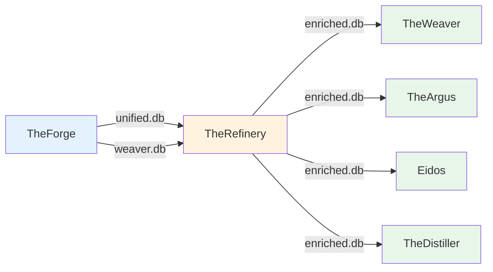

# TheRefinery - 資料精煉層

---

## 📋 文檔目的

本文檔提供 **TheRefinery** 系統的完整說明,幫助讀者理解:
- TheRefinery 的系統職責與定位
- 10 個 Enrichers 的功能與進度
- 資料輸入/輸出格式與介面
- 執行方式與效能指標

---

## 🎯 系統職責

**TheRefinery** 是 LuminNexus 生態系統中的**資料精煉層 (Data Enrichment Layer)**,負責將來自 TheForge 的原始結構化資料進行:
- 資料品質檢查 (Match Quality Validation)
- 資料標準化 (Normalization)
- 分類映射 (Taxonomy Mapping)
- 業務邏輯計算 (Business Logic)

### 系統定位
- **Layer**: AlchemyMind (Layer 2)
- **上游**: TheForge (AtlasVault Layer)
- **下游**: TheWeaver, TheArgus, Eidos, TheDistiller

---

## 🏗️ 系統架構



**資料流**:
1. TheForge 產出 `unified.db` + `weaver.db`
2. TheRefinery 執行 10 個 enrichers,寫入 `enriched.db`
3. 下游系統 ATTACH 三個資料庫進行進階分析

---

## 🔌 介面說明

### 輸入 (from TheForge)

TheRefinery 接收 TheForge 的輸出作為輸入:

| 資料庫 | 來源 | 內容 | 說明 |
|--------|------|------|------|
| `unified.db` | Unified Forge | 整合後的產品資料 | DSLD + iHerb + Keepa |
| `weaver.db` | Weaver Forge | Knowledge Realms taxonomies | 108 taxonomy nodes |

**位置**: 由 TheForge 產出,TheRefinery 讀取

---

### 輸出 (to 下游系統)

TheRefinery 產出單一豐富化資料庫:

| 資料庫 | 內容 | 下游使用者 |
|--------|------|-----------|
| `enriched.db` | 豐富化後的資料表 (9+ tables) | TheWeaver, TheArgus, Eidos, TheDistiller |

**下游系統使用方式**:
```python
# 下游系統需自行 ATTACH 三個資料庫
ATTACH 'unified.db' AS unified;
ATTACH 'weaver.db' AS weaver;
ATTACH 'enriched.db' AS enriched;
```

**重要**: TheRefinery 不會修改 `unified.db` 或 `weaver.db`,只產出新的 `enriched.db`

---

## 🔧 核心功能

TheRefinery 包含 **10 個 Enrichers**,目前完成進度: **6/10 (60%)**

### ✅ 已完成 (6/10)

#### 1. Keepa Match Quality (v4.0) - P0 ⭐
- **職責**: 驗證 DSLD ↔ Amazon (Keepa) 的產品匹配品質
- **資料來源**: DSLD + Keepa
- **輸出表格**: `DSLDKeepaMatchQuality`
- **驗證邏輯**:
  - PASS: Net content 差異 < 20%
  - FAIL: Net content 差異 ≥ 20%
  - UNAVAILABLE: 無法驗證 (缺少資料)
- **關鍵成果** (2025-11-14):
  - 識別 **11,910 個錯誤匹配**
  - 138,657 個產品對驗證
- **完成日期**: 2025-11-14

#### 2. iHerb Match Quality (v2.0) - P0 ⭐
- **職責**: 驗證 DSLD ↔ iHerb 的產品匹配品質
- **資料來源**: DSLD + iHerb
- **輸出表格**: `DSLDIHerbMatchQuality`
- **驗證邏輯**: 同 Keepa Match Quality
- **關鍵成果** (2025-11-14):
  - 識別 **416 個錯誤匹配**
  - 42,538 個產品對驗證
- **完成日期**: 2025-11-14

#### 3. Net Content Normalization (v1.0) - P0 ⭐
- **職責**: 統一標準化 net content (重量、體積、數量)
- **資料來源**: DSLD + iHerb + Keepa
- **輸出表格**: `NetContentNormalized`
- **處理內容**:
  - 853,238 records 處理
  - DSLD: 78.7%, iHerb: 4.7%, Keepa: 16.6%
  - 支援多值產品 (1:N relationships)
- **標準化單位**:
  - Weight: grams (g)
  - Volume: milliliters (ml)
  - Count: pieces (count)
- **完成日期**: 2025-12-08

#### 4. Knowledge Realms (v2.0) - P1
- **職責**: 映射產品到 Usage Context 和 Dietary Adaptability
- **資料來源**: DSLD + weaver.db
- **輸出表格**:
  - `UsageContextCalculated`
  - `DietaryAdaptabilityCalculated`
- **處理內容**:
  - 767,261 mappings
  - Usage Context: 100% coverage
  - Dietary Adaptability: 67.4% coverage
  - 整合 weaver.db 的 108 taxonomy nodes
- **完成日期**: 2025-12-08

#### 5. Dosage Form Facets (v1.0) - P1
- **職責**: 4 維度劑型分類
- **資料來源**: DSLD
- **輸出表格**: `DosageFormFacets`
- **分類維度**:
  - Form (形式): Solid, Liquid, Semi-solid, Other
  - Delivery (給藥方式): Oral, Topical, etc.
  - Structure (結構): Single, Multi-layer, etc.
  - Convenience (便利性): Ready-to-use, etc.
- **完成日期**: 2025-11-14

#### 6. Ingredient Normalization (v1.0) - P1
- **職責**: 成分標準化與分類
- **資料來源**: DSLD
- **輸出表格**: `NormalizedIngredients`
- **處理內容**:
  - 成分名稱標準化
  - 成分類別分類
  - 劑量單位統一
- **完成日期**: 2025-11-14

---

### ⏳ 待開始 (4/10)

| # | Enricher 名稱 | 優先級 | 預計資料來源 | 狀態 | 說明 |
|---|--------------|--------|-------------|------|------|
| 7 | **Servings Calculator** | P1 | DSLD | 待開始 | 計算每份營養成分 |
| 8 | **Brand Grouping** | P2 | DSLD + Keepa + iHerb | 待開始 | 品牌標準化與分組 |
| 9 | **Product Identities** | P2 | DSLD | 待開始 | 產品身份識別 |
| 10 | **iHerb Enrichment** | P0 | iHerb | 待開始 | iHerb 特定資料豐富化 |

---

## 🎯 核心特性總結

### 1. Match Quality Validation (P0) ⭐⭐⭐
- **Keepa Match Quality**: 驗證 DSLD ↔ Amazon (Keepa) 的產品匹配
- **iHerb Match Quality**: 驗證 DSLD ↔ iHerb 的產品匹配
- **Net Content Validation**: 檢測 net content 數量級錯誤 (≥20% diff → INVALID)

**關鍵成就** (2025-12-08):
- 識別 **12,326 個錯誤匹配** (Keepa: 11,910, iHerb: 416)
- PASS/FAIL/UNAVAILABLE 三級驗證系統
- Database constraints 確保資料完整性

### 2. Data Normalization (P0-P1) ⭐⭐
- **Net Content Normalization**: 統一標準化 net content (weight, volume, count)
  - 853,238 records 處理 (DSLD 78.7%, iHerb 4.7%, Keepa 16.6%)
  - 支援多值產品 (1:N relationships)
- **Ingredient Normalization**: 成分標準化與分類

### 3. Taxonomy Mapping (P1) ⭐
- **Knowledge Realms**: 映射產品到 Usage Context 和 Dietary Adaptability
  - 767,261 mappings (Usage: 100% coverage, Dietary: 67.4% coverage)
  - 整合 weaver.db 的 108 taxonomy nodes
- **Dosage Form Facets**: 4 維度劑型分類

---

## 📊 資料格式與 Schema

### Input Schema

#### unified.db
- **Products**: 產品主表 (DSLD, iHerb, Keepa)
- **DSLDKeepaMatching**: DSLD ↔ Keepa 匹配關係
- **DSLDIHerbMatching**: DSLD ↔ iHerb 匹配關係
- **Ingredients**: 成分資料
- **... (其他表格)**

#### weaver.db
- **Taxonomies**: Knowledge Realms 分類階層 (108 nodes)
- **TaxonomyTree**: 分類樹結構

### Output Schema

#### enriched.db
| 表格名稱 | Enricher | 記錄數 (approx.) | 說明 |
|---------|----------|-----------------|------|
| `DSLDKeepaMatchQuality` | Keepa Match Quality | 138,657 | DSLD-Keepa 匹配品質 |
| `DSLDIHerbMatchQuality` | iHerb Match Quality | 42,538 | DSLD-iHerb 匹配品質 |
| `NetContentNormalized` | Net Content Normalization | 853,238 | 標準化 net content |
| `UsageContextCalculated` | Knowledge Realms | ~700K | Usage Context 映射 |
| `DietaryAdaptabilityCalculated` | Knowledge Realms | ~500K | Dietary Adaptability 映射 |
| `DosageFormFacets` | Dosage Form Facets | ~200K | 劑型分類 |
| `NormalizedIngredients` | Ingredient Normalization | ~1M | 標準化成分 |

**詳細 Schema**: 參考專案內 `specs/` 目錄

---

## ⚙️ 配置與參數

### 環境變數
```bash
# .env
UNIFIED_DB_PATH=/path/to/unified.db
WEAVER_DB_PATH=/path/to/weaver.db
ENRICHED_DB_PATH=/path/to/enriched.db
```

### 執行參數
- `--limit N`: 限制處理記錄數 (測試模式)
- `--enrichers LIST`: 指定要執行的 enrichers (逗號分隔)

---

## 🚀 使用方式

### 完整執行
```bash
cd /path/to/TheRefinery
python3 scripts/refine.py
```

**輸出**:
```
TheRefinery v1.0
================
[1/10] Keepa Match Quality... ✓ (7.2s)
[2/10] iHerb Match Quality... ✓ (3.1s)
[3/10] Net Content Normalization... ✓ (31.4s)
...
Total: 248.60s (~4.1 min)
Success: 9/9 enrichers
```

### 測試模式 (限制記錄數)
```bash
python3 scripts/refine.py --limit 100
```

**用途**: 快速驗證 enrichers 邏輯,不處理完整資料集

### 執行特定 enrichers
```bash
python3 scripts/refine.py --enrichers keepa_match_quality,iherb_match_quality
```

**用途**: 只執行指定的 enrichers,跳過其他

---

## 📊 性能指標

### 最新完整執行 (2025-12-08)
- ⏱️ **總執行時間**: 248.60 秒 (~4.1 分鐘)
- 📊 **Enrichers 執行**: 9/9 (100% 成功)
- 📝 **處理記錄數**: 3,350,807 records
- 💾 **輸出記錄數**: 4,645,576 records
- 🗄️ **資料庫大小**: `enriched.db` = ~827 MB

### 各 Enricher 性能

| Enricher | 處理時間 | 記錄數 | 吞吐量 |
|----------|---------|--------|--------|
| Keepa Match Quality | ~7s | 138,657 pairs | ~19,800/s |
| iHerb Match Quality | ~3s | 42,538 pairs | ~14,200/s |
| Net Content Normalization | ~31s | 853,238 records | ~27,500/s |
| Knowledge Realms | ~2s | 767,261 mappings | ~383,600/s |
| Dosage Form Facets | ~5s | ~200K records | ~40,000/s |
| Ingredient Normalization | ~180s | ~1M records | ~5,500/s |

---

## 🔄 資料循環說明

TheRefinery 在 LuminNexus 的資料循環中扮演**中繼處理角色**:

```
Vault (原始資料)
  ↓
TheForge (ETL)
  ↓ unified.db + weaver.db
TheRefinery (精煉) ← 本系統
  ↓ enriched.db
下游系統 (分析/檢測/查詢)
  ├─ TheWeaver (LLM 分析)
  ├─ TheArgus (異常檢測)
  ├─ Eidos (知識圖譜)
  └─ TheDistiller (資料蒸餾)
  ↓ (人工 pipeline cycle)
Vault (更新資料)
```

**重要**: TheRefinery 不會直接接收下游系統的輸出,而是透過 TheForge 重新處理後的資料再繼續循環。

---

## 🐛 常見問題與除錯

### Q1: 執行時出現 "Database locked" 錯誤?
**A**: 確認沒有其他程序正在讀寫資料庫。使用 `fuser` 或 `lsof` 檢查:
```bash
lsof /path/to/enriched.db
```

### Q2: Enricher 執行失敗,如何除錯?
**A**:
1. 檢查日誌: `logs/refine.log`
2. 使用 `--limit 10` 測試模式
3. 檢查輸入資料庫的完整性:
   ```bash
   sqlite3 unified.db "PRAGMA integrity_check;"
   ```

### Q3: 如何查看 enriched.db 的內容?
**A**: 使用 SQLite 瀏覽器:
```bash
sqlite3 enriched.db
.tables
.schema DSLDKeepaMatchQuality
SELECT * FROM DSLDKeepaMatchQuality LIMIT 10;
```

### Q4: Net Content Normalization 為什麼有些產品沒有結果?
**A**: 可能原因:
- 原始資料缺少 net content 資訊
- 格式無法解析 (檢查 `parsing_errors` 欄位)
- 單位無法識別

### Q5: 如何新增一個 Enricher?
**A**:
1. 參考 `POLICY.md` 的 Enricher 規範
2. 在 `enrichers/` 目錄建立新模組
3. 在 `specs/` 建立規格文檔
4. 在 `scripts/refine.py` 註冊 Enricher

---

## 📚 相關文檔

### Learning Map 文檔
- [00_overview.md](00_overview.md) - AlchemyMind 概覽
- [../00_architecture-overview.md](../00_architecture-overview.md) - 系統架構全景
- [../01_data-flow.md](../01_data-flow.md) - 資料流與系統串連
- [../atlasvault/theforge.md](../atlasvault/theforge.md) - TheForge 詳細說明

### 專案內部文檔
- **CLAUDE.md**: 完整開發歷史與決策記錄
- **specs/**: 各 enricher 的詳細規格
  - `specs/keepa_match_quality.md`
  - `specs/iherb_match_quality.md`
  - `specs/net_content_normalization.md`
  - `specs/knowledge_realms.md`
  - ...
- **POLICY.md**: Schema 與實作規範

### 學習資源
- **.claude/skills/knowledge-realms-expert.md**: Knowledge Realms AI Expert Skill
- **docs/skills/**: Expert Skills 使用指南

### 外部專案文檔
- `LuminNexus-AlchemyMind-TheRefinery/README.md` - TheRefinery README
- `LuminNexus-AtlasVault-TheForge/docs/20251203_architecture_cycle.md` - TheForge 架構

---

## 📝 文檔維護

### 版本歷史

| 版本 | 日期 | 作者 | 變更說明 |
|------|------|------|----------|
| 1.0 | 2025-12-09 | AlchemyMind Team - TheRefinery | 初版建立,整合 TheRefinery team 的內容 |

### 維護職責
- **主要維護者**: AlchemyMind Team - TheRefinery
- **審核者**: Architecture Team
- **更新頻率**: 每次重大功能更新後

### 下一步
- [ ] 完成剩餘 4 個 Enrichers (Servings, Brand, Identity, iHerb)
- [ ] 補充各 Enricher 的詳細使用範例
- [ ] 新增效能優化建議
- [ ] 新增資料品質報告範例

---

**文檔結束**

> **Enricher 進度**: 6/10 (60%) | **下一個**: Servings Calculator (P1)
