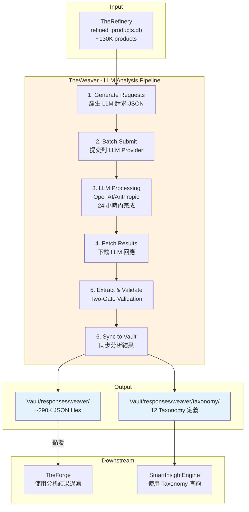

# TheWeaver - LLM 分析生成器

---

## 📋 文檔目的

本文檔提供 **TheWeaver** 的完整說明，幫助讀者理解:
- TheWeaver 使用 LLM 批次分析營養補充品產品的流程
- 10 個知識領域 (Knowledge Realms) 的分析維度
- 與 Vault 的循環架構關係
- Batch API 的使用方式與成本優化

> **完整技術文檔**: TheWeaver 專案的 `CLAUDE.md` 與 `specs/` 目錄
> **操作指南**: `.claude/skills/weaver-pipeline.md` 完整 5 階段流程

---

## 🎯 系統職責

**TheWeaver** 使用 LLM 批次分析營養補充品產品，生成 10 個知識領域的結構化資料。

### 核心職責

| 項目 | 說明 |
|------|------|
| **職責** | LLM 批次分析與知識領域生成 |
| **輸入** | refined_products.db (~130K products) |
| **輸出** | ~290K JSON 分析結果 + 12 Taxonomy 定義 |
| **處理規模** | 10 Knowledge Realms × ~29K products |
| **處理時間** | 24 小時內完成 (Batch API 並行處理) |

### 核心價值

- **非結構化 → 結構化**: 將產品描述轉換為可查詢的結構化資料
- **多維度分析**: 提供 10 個知識維度的產品分析
- **知識階層生成**: 產生 Taxonomy 供分類與導航使用
- **循環架構**: 分析結果回寫到 Vault，供下一輪 ETL 使用

---

## 🏗️ 系統架構



---

## 📥 輸入資料 (Input)

### 來源資料庫

**資料庫**: `refined_products.db` (from TheRefinery)

**資料內容**:
- 可食用產品的精煉資料
- 包含產品基本資訊、成分表、聲明、品牌等
- 資料規模: ~130,000 產品

### 資料來源統計

| 來源 | 產品數 | 說明 |
|------|--------|------|
| **DSLD** | 211,782 | 官方膳食補充品資料庫 |
| **iHerb** | 50,461 | 線上零售商產品目錄 |
| **Keepa** | 64,661 | Amazon 市場資料 |

**總計**: ~327K 產品 (經 TheRefinery 精煉後 ~130K 可食用產品)

---

## 📤 輸出資料 (Output)

### 1. 分析結果 (Analysis Results)

**格式**: JSON 檔案 (per product, per realm)

**檔案數量**: ~290,000 JSON files

**目錄結構**:
```
vault/responses/weaver/
└── {realm}/v1.0/{date}/{source}/{product_id}/
    ├── request.json          # LLM 請求
    ├── response.json         # LLM 完整回應
    └── response.meta.json    # 執行元數據（token usage, 成本）
```

**範例路徑**: `edible/v1.0/20251124/dsld/99999/`

**response.json 範例**:
```json
{
  "id": 99999,
  "source": "dsld",
  "realm": "edible",
  "is_edible": true,
  "confidence": 0.95,
  "reasoning": "Vitamin C is a dietary supplement, edible."
}
```

**response.meta.json 範例**:
```json
{
  "batch_id": "batch_xxx",
  "model": "gpt-4o-mini",
  "tokens_input": 1234,
  "tokens_output": 567,
  "cost_usd": 0.0012,
  "processing_time_ms": 15000
}
```

### 2. 知識階層 (Taxonomies)

**格式**: JSON 檔案 (per realm)

**數量**: 12 個 Taxonomy 定義

**位置**: `vault/responses/weaver/taxonomy/`

**範例**: `EdibleTaxonomy.json`
```json
{
  "realm": "Edible",
  "version": "v1.0",
  "hierarchy": {
    "Dietary Supplement": {
      "Vitamins": {
        "Fat-Soluble": ["Vitamin A", "Vitamin D", "Vitamin E", "Vitamin K"],
        "Water-Soluble": ["Vitamin C", "B-Complex"]
      },
      "Minerals": {
        "Macrominerals": ["Calcium", "Magnesium", "Potassium"],
        "Trace Minerals": ["Iron", "Zinc", "Selenium"]
      }
    }
  }
}
```

---

## 🧠 10 Knowledge Realms

TheWeaver 分析產品的 10 個知識維度:

| # | Realm | 中文名稱 | 說明 | 輸出範例 |
|---|-------|---------|------|---------|
| 1 | **Edible Classification** | 可食用性分類 | 判斷產品是否可食用 | `is_edible: true` |
| 2 | **Health Effect** | 健康效果 | 健康益處與警告 | `benefits: ["immune support"]` |
| 3 | **Certification** | 認證標章 | 第三方認證 | `certifications: ["USDA Organic"]` |
| 4 | **Ingredient Purity** | 成分純度 | 成分純度指標 | `purity_score: 0.92` |
| 5 | **Formulation Technology** | 配方技術 | 劑型與傳送技術 | `delivery_method: "capsule"` |
| 6 | **Performance Enhancement** | 效能提升 | 提升運動或認知表現 | `enhancement_type: "cognitive"` |
| 7 | **Usage Convenience** | 使用便利性 | 服用方便程度 | `ease_of_use: "high"` |
| 8 | **Flavor Characteristics** | 風味特徵 | 口味與口感 | `taste: "neutral"` |
| 9 | **Quality of Life** | 生活品質 | 對生活品質的影響 | `wellness_impact: "stress relief"` |
| 10 | **Usage Context** | 使用情境 | 最佳使用時機與場景 | `best_time: "morning"` |

---

## 🔧 核心功能

### 1. Context Builder - 完整性保證

**核心原則**: 完整呈現產品信息，不做人為截斷

**特性**:
- ✅ 完整提取所有成分（無數量限制）
- ✅ 完整展開嵌套結構（Proprietary Blends）
- ✅ 保留原始順序與層級
- ✅ 包含所有產品聲明與警告

**範例**:
```python
# 從 refined_products.db 提取完整產品資訊
context = {
    "product_name": "Vitamin C 1000mg",
    "brand": "Nature Made",
    "ingredients": [
        {"name": "Vitamin C", "amount": 1000, "unit": "mg"},
        {"name": "Rose Hips", "amount": 25, "unit": "mg"}
    ],
    "claims": ["Immune Support", "Antioxidant"],
    "warnings": ["Consult physician if pregnant"]
}
```

### 2. Structured Outputs

**OpenAI**: 使用 `response_format` with `json_schema`

```json
{
  "response_format": {
    "type": "json_schema",
    "json_schema": {
      "name": "EdibleClassification",
      "schema": {
        "type": "object",
        "properties": {
          "is_edible": {"type": "boolean"},
          "confidence": {"type": "number"}
        }
      }
    }
  }
}
```

**Anthropic**: 支援雙模式（Tool Use / JSON Outputs）

**好處**: 保證 LLM 輸出符合 schema，減少後處理成本

### 3. Batch Processing

**OpenAI Batch API**:
- 成本節省 50%
- 自動重試機制
- 非即時處理（24 小時內完成）

**Anthropic 批次處理**:
- 支援 Message Batches API
- 結構化輸出支援
- 並行處理多個請求

**使用範例**:
```bash
# 生成批次請求檔案
weaver generate --analyzer edible --source dsld --date 20251124

# 提交批次
weaver llm batch submit --analyzer edible

# 下載結果
weaver llm batch fetch --analyzer edible --batch-id xxx
```

### 4. Two-Gate Validation

**Gate 1: Schema 驗證**（格式正確性）
- 檢查 JSON 結構
- 驗證必要欄位
- 確認資料類型

**Gate 2: Business 驗證**（語義正確性）
- 檢查 confidence 範圍 (0-1)
- 驗證分類值在允許範圍內
- 確認邏輯一致性

**只有通過兩門驗證的結果才會同步到 Vault**

---

## 📊 資料格式與 Schema

### LLM Request Schema

```json
{
  "custom_id": "dsld_99999_edible_v1.0",
  "method": "POST",
  "url": "/v1/chat/completions",
  "body": {
    "model": "gpt-4o-mini",
    "messages": [
      {
        "role": "system",
        "content": "You are an expert analyzer..."
      },
      {
        "role": "user",
        "content": "Analyze this product: {context}"
      }
    ],
    "response_format": {
      "type": "json_schema",
      "json_schema": {...}
    }
  }
}
```

### LLM Response Schema

```json
{
  "id": 99999,
  "source": "dsld",
  "realm": "edible",
  "is_edible": true,
  "confidence": 0.95,
  "reasoning": "...",
  "metadata": {
    "model": "gpt-4o-mini",
    "tokens": 1234,
    "cost": 0.0012
  }
}
```

---

## 🔌 介面說明

### 1. TheRefinery (上游)

**輸入介面**: `refined_products.db`

**讀取內容**:
- 產品基本資訊 (id, name, brand)
- 成分表 (ingredients)
- 產品聲明 (claims)
- 警告標示 (warnings)

### 2. Vault (下游 - 循環回寫)

**輸出介面**: `vault/responses/weaver/`

**同步內容**:
- 分析結果 JSON (per product, per realm)
- Taxonomy 定義 JSON (per realm)
- 執行元數據 (token usage, cost)

**循環機制**: TheWeaver 的分析結果會回寫到 Vault，成為下一輪 ETL 的輸入

### 3. TheForge (下游 - 使用分析結果)

**使用方式**: 讀取 Weaver 分析結果進行資料過濾

**範例**: Unified Forge 使用 `edible` 分析結果過濾非食用產品

### 4. SmartInsightEngine (下游 - 使用 Taxonomy)

**使用方式**: 讀取 Taxonomy 定義進行查詢與導航

**範例**: MDOF 查詢使用 `UsageContextTaxonomy` 進行維度分組

---

## ⚙️ 配置與參數

### LLM Provider 配置

| Provider | 用途 | 模型 | 成本 (per MTok) |
|----------|------|------|----------------|
| **OpenAI** | Batch API 大規模處理 | gpt-4o-mini | $0.075 input, $0.300 output |
| **OpenAI** | 最新 Nano 模型 | gpt-5-nano | 更低成本 (TBD) |
| **Anthropic** | Structured Outputs | claude-3-haiku | $0.125 input, $0.625 output |
| **Anthropic** | 高準確度分析 | claude-sonnet-4-5 | $3 input, $15 output |

### 成本估算

**假設**: 每個產品平均 1K input tokens, 500 output tokens

| 模型 | 每個產品成本 | 10K 產品成本 | 100K 產品成本 |
|------|-------------|-------------|--------------|
| gpt-4o-mini | $0.00023 | $2.30 | $23 |
| claude-haiku | $0.00044 | $4.40 | $44 |
| claude-sonnet-4.5 | $0.0105 | $105 | $1,050 |

### 處理時間

- **OpenAI Batch API**: 通常 24 小時內完成
- **Anthropic**: 視並行處理量，通常數小時完成
- **並行處理**: 可同時處理多個 realm

---

## 🚀 使用方式

### 完整 Pipeline (5 階段)

```bash
# Stage 1: 生成請求
weaver generate --analyzer edible --source dsld --date 20251124

# Stage 2: 提交批次
weaver llm batch submit --analyzer edible

# Stage 3: 等待處理 (24 小時內)
weaver llm batch status --batch-id xxx

# Stage 4: 下載結果
weaver llm batch fetch --analyzer edible --batch-id xxx

# Stage 5: 驗證並同步
weaver validate --analyzer edible
```

### CLI 命令參考

**Generate**:
```bash
weaver generate \
  --analyzer edible \
  --source dsld \
  --date 20251124 \
  --output requests/edible_20251124.jsonl
```

**Batch Submit**:
```bash
weaver llm batch submit \
  --analyzer edible \
  --input requests/edible_20251124.jsonl \
  --provider openai
```

**Batch Fetch**:
```bash
weaver llm batch fetch \
  --analyzer edible \
  --batch-id batch_xxx \
  --output responses/edible_20251124/
```

**Validate**:
```bash
weaver validate \
  --analyzer edible \
  --input responses/edible_20251124/ \
  --sync-to-vault
```

> **詳細操作**: 請參考 `.claude/skills/weaver-pipeline.md` 獲得完整的 5 階段流程說明

---

## 🔑 關鍵概念

### 1. Knowledge Realm (知識領域)

**定義**: LLM 分析產品的一個特定維度

**特性**:
- 每個 realm 獨立分析
- 每個 realm 有獨立的 schema
- 每個 realm 生成獨立的 Taxonomy

**範例**: `edible` realm 分析產品是否可食用

### 2. Taxonomy (分類法)

**定義**: 階層式的分類結構

**特性**:
- 支援多層級 (root → parent → child → leaf)
- 每個 realm 一個 Taxonomy
- LLM 生成並人工審核

**用途**:
- SmartInsightEngine 查詢導航
- 產品分類與標籤
- 資料過濾與聚合

### 3. Batch API (批次 API)

**定義**: LLM Provider 提供的大規模批次處理介面

**優點**:
- 成本節省 50%
- 自動重試機制
- 非即時處理 (24 小時內)

**限制**:
- 非即時回應
- 無法取消進行中的批次

### 4. Structured Outputs (結構化輸出)

**定義**: LLM 保證輸出符合指定的 JSON schema

**好處**:
- 減少後處理成本
- 避免格式錯誤
- 提升驗證通過率

### 5. Two-Gate Validation (雙門驗證)

**定義**: 兩階段驗證機制

**Gate 1**: Schema 驗證（格式）
**Gate 2**: Business 驗證（語義）

**只有通過兩門驗證的結果才會同步到 Vault**

### 6. Cyclical Architecture (循環架構)

**定義**: TheWeaver 的分析結果會回寫到 Vault，供下一輪 ETL 使用

**流程**:
1. TheRefinery → refined_products.db
2. TheWeaver → 分析結果 JSON
3. Vault ← 同步分析結果
4. TheForge ← 讀取分析結果過濾資料
5. 重複循環

---

## 🐛 常見問題與除錯

### Q1: TheWeaver 和 TheRefinery 有什麼差別?

**A**:
- **TheRefinery**: 資料豐富化 (enrichment) - 整合 marketplace 數據、正規化成分
- **TheWeaver**: LLM 分析 (analysis) - 使用 LLM 生成知識領域分類

### Q2: 為什麼需要 Batch API?

**A**:
- 成本節省 50%
- 大規模處理 (~29K products × 10 realms = 290K 請求)
- 自動重試機制

### Q3: 如何選擇 LLM 模型?

**A**:
- **gpt-4o-mini**: 經濟實惠，適合大規模處理
- **claude-haiku**: 平衡成本與準確度
- **claude-sonnet-4.5**: 高準確度，適合重要分析

### Q4: Batch 處理失敗怎麼辦?

**A**:
1. 檢查 Batch API 狀態 (`weaver llm batch status`)
2. 查看錯誤日誌
3. 重新提交失敗的請求
4. 使用 Two-Gate Validation 過濾無效結果

### Q5: 如何驗證分析結果品質?

**A**:
1. Schema 驗證 (Gate 1)
2. Business 驗證 (Gate 2)
3. 抽樣人工審核
4. 監控 confidence 分佈
5. 檢查 Taxonomy 一致性

---

## 📚 相關文檔

### 內部文檔
- [00_overview.md](00_overview.md) - AlchemyMind 概覽
- [../01_data-flow.md](../01_data-flow.md) - 完整的資料循環流程
- [therefinery.md](therefinery.md) - TheRefinery (上游)
- [thedistiller.md](thedistiller.md) - TheDistiller (使用 Taxonomy)
- [../atlasvault/theforge.md](../atlasvault/theforge.md) - TheForge (使用分析結果)
- [../prismavision/smart-insight-engine/](../prismavision/smart-insight-engine/) - SmartInsightEngine (使用 Taxonomy)

### Skills 文檔
- `.claude/skills/weaver-pipeline.md` - 完整 5 階段流程
- `.claude/skills/weaver-cli-batch.md` - Batch 命令詳細參考
- `.claude/skills/weaver-validate.md` - 驗證與 Vault sync
- `.claude/skills/weaver-generate-guide.md` - Generate 命令配置

### 外部專案文檔
- `LuminNexus-AlchemyMind-TheWeaver/CLAUDE.md` - TheWeaver 完整專案文檔
- `LuminNexus-AlchemyMind-TheWeaver/specs/` - 詳細規格文檔

---

## 📝 文檔維護

### 版本歷史

| 版本 | 日期 | 作者 | 變更說明 |
|------|------|------|----------|
| 1.0 | 2025-12-09 | AlchemyMind Team | 初版建立 (簡潔版) |

### 維護職責
- **主要維護者**: AlchemyMind Team - TheWeaver
- **審核者**: Architecture Team
- **更新頻率**: 當架構變更時

### 系統依賴

**上游依賴**:
- AlchemyMind Team (TheRefinery) - refined_products.db

**下游依賴**:
- AtlasVault Team (Vault) - 接收分析結果
- AtlasVault Team (TheForge) - 使用分析結果過濾
- PrismaVision Team (SmartInsightEngine) - 使用 Taxonomy

---

**文檔結束**

> **注意**: 本文檔為簡化版概覽，詳細的技術實作請參考 TheWeaver 專案的 CLAUDE.md 與 specs/ 目錄。完整操作流程請參考 `.claude/skills/weaver-pipeline.md`。如需更多資訊，請聯絡 AlchemyMind Team。
