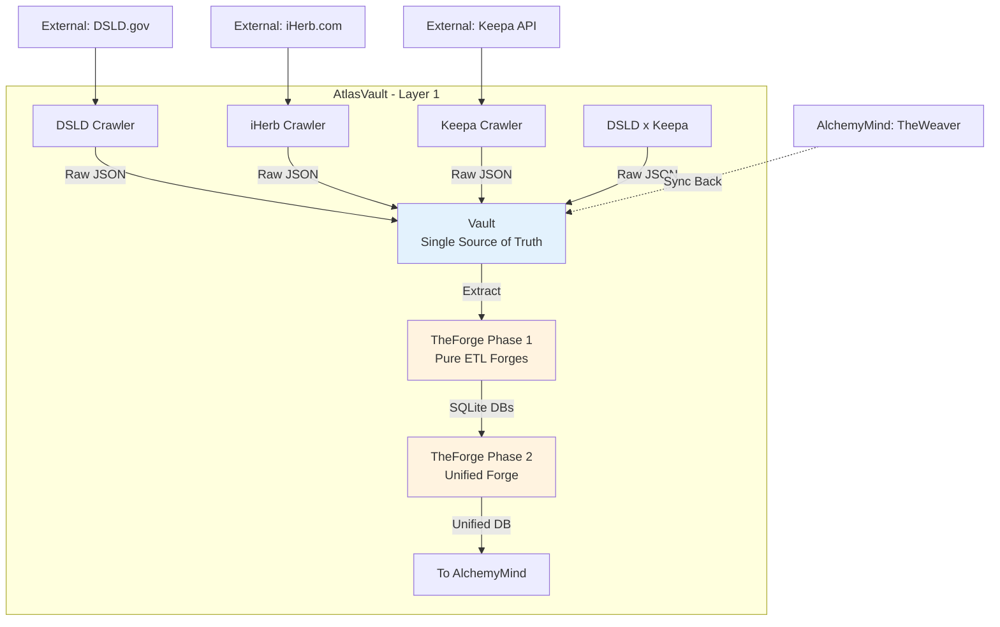
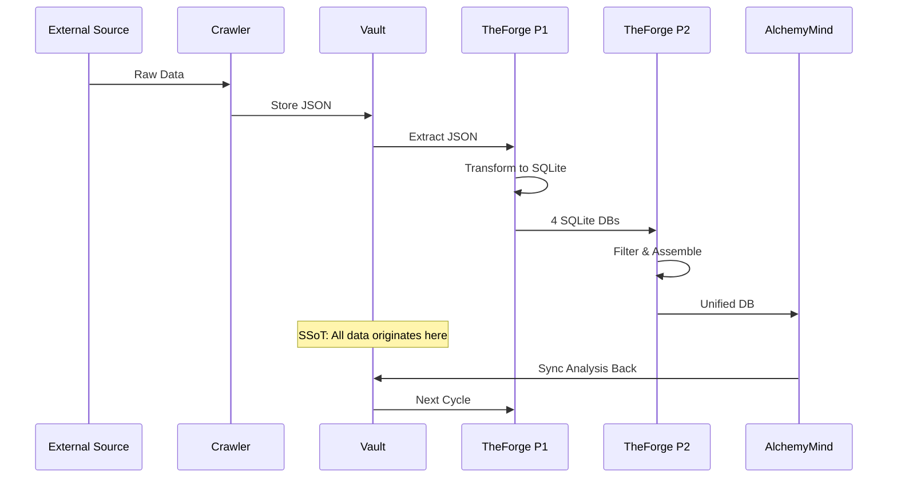

# AtlasVault - 資料蒐集與 ETL 層概覽

**版本**: 1.0
**更新日期**: 2025-12-09
**文檔類型**: 概覽
**維護團隊**: AtlasVault Team
**適用角色**: 全員
**前置知識**: [00_architecture-overview.md](../00_architecture-overview.md)

---

## 📋 文檔目的

本文檔提供 **AtlasVault** 系統的概覽,幫助讀者理解:
- AtlasVault 在整體架構中的定位
- 各子系統的職責與關係
- 資料蒐集與 ETL 的完整流程

> **詳細內容**: 各子系統的詳細說明請參考對應的文檔連結

---

## 🎯 系統概述

**AtlasVault** 是 LuminNexus 的**資料蒐集與 ETL 層** (Layer 1),負責:
- 從多個來源爬取原始資料
- 儲存在中央資料庫 (Vault) 作為 Single Source of Truth
- 透過 TheForge 進行 ETL 處理,轉換為結構化資料庫

---

## 🏗️ 系統架構

---

## 📦 子系統列表

### 1. Vault - 中央資料庫
- **職責**: Single Source of Truth (SSoT),儲存所有原始資料與分析結果
- **資料類型**:
  - 原始 JSON (DSLD, iHerb, Keepa)
  - Weaver 分析結果
  - Taxonomy 定義
- **版本控制**: 以日期為目錄 (`YYYYMMDD`)
- **詳細文檔**: [vault.md](vault.md)

### 2. Crawlers - 資料蒐集器

#### DSLD Crawler
- **職責**: 爬取 DSLD.gov 的營養補充品資料
- **資料量**: 211,782 products
- **詳細文檔**: [dsld-crawler.md](dsld-crawler.md)

#### iHerb Crawler
- **職責**: 爬取 iHerb.com 的產品資料
- **資料量**: 50,461 products
- **詳細文檔**: [iherb-crawler.md](iherb-crawler.md)

#### Keepa Integration
- **職責**: 整合 Keepa API 的價格與市場資料
- **資料量**: 64,661 products
- **詳細文檔**: 包含在 [dsldxkeepa.md](dsldxkeepa.md)

#### DSLD x Keepa
- **職責**: DSLD 與 Keepa 資料的整合與匹配
- **詳細文檔**: [dsldxkeepa.md](dsldxkeepa.md)

### 3. TheForge - ETL 層

#### Phase 1: Pure ETL Forges
- **職責**: 將原始 JSON 轉換為 SQLite 資料庫
- **模組**:
  - dsld-forge: 211,782 products → 19 tables
  - iherb-forge: 50,461 products → 118 columns
  - keepa-forge: 64,661 products → price history
  - weaver-forge: 290,768 analyses → cross-DB JOIN ready
- **特性**: Pure ETL,無 enrichment

#### Phase 2: Unified Forge
- **職責**: Config-driven 資料過濾與組裝
- **功能**: ATTACH 多個 DB,根據 config 生成不同輸出
- **特性**: 非 Pure ETL,但也非 Enrichment (僅過濾)

**詳細文檔**: [theforge.md](theforge.md)

---

## 🔄 資料流程

---

## 📊 資料規模

| 資料來源 | 產品數量 | 檔案大小 | 處理時間 |
|---------|---------|---------|---------|
| DSLD | 211,782 | ~1.8-2.0 GB | ~35-40 分鐘 |
| iHerb | 50,461 | ~200-300 MB | ~15-20 分鐘 |
| Keepa | 64,661 | ~200-300 MB | ~15-20 分鐘 |
| Weaver Analysis | 290,768 | ~151 MB | ~1 分鐘 |

---

## 🔄 與其他系統的關係

### 資料流入
- **External Sources** → Crawlers → Vault

### 資料流出
- Vault → TheForge → AlchemyMind (TheRefinery)

### 資料回寫
- AlchemyMind (TheWeaver) → Vault (Analysis Results)

**詳細說明**: 參考 [01_data-flow.md](../01_data-flow.md)

---

## 🎯 核心設計原則

### 1. Single Source of Truth (SSoT)
- Vault 是唯一的資料真相來源
- 所有原始資料必須先進入 Vault
- 所有分析結果必須回寫到 Vault

### 2. Pure ETL Separation (Phase 1)
- dsld-forge, iherb-forge, keepa-forge, weaver-forge 只做 ETL
- 不做 enrichment,不做過濾,不做業務邏輯
- 保持原始資料的完整性

### 3. Config-Driven Flexibility (Phase 2)
- Unified Forge 使用 JSON config 驅動
- 支援多種輸出配置
- 易於新增新的過濾需求

### 4. Cyclical Architecture
- 資料會循環流動
- TheWeaver 的輸出會回到 Vault
- 下一輪 ETL 會使用新的分析結果

---

## 📚 相關文檔

### 內部文檔
- [00_architecture-overview.md](../00_architecture-overview.md) - 整體架構
- [01_data-flow.md](../01_data-flow.md) - 資料流詳解
- [vault.md](vault.md) - Vault 詳細說明
- [theforge.md](theforge.md) - TheForge 詳細說明
- [dsld-crawler.md](dsld-crawler.md) - DSLD Crawler
- [iherb-crawler.md](iherb-crawler.md) - iHerb Crawler
- [dsldxkeepa.md](dsldxkeepa.md) - DSLD x Keepa 整合

### 外部專案文檔
- `LuminNexus-AtlasVault-TheForge/docs/20251203_architecture_cycle.md` - TheForge 完整架構
- `LuminNexus-AtlasVault-TheForge/dsld-forge/README.md` - DSLD Forge README
- `LuminNexus-AtlasVault-iHerb/README.md` - iHerb Crawler README

---

## ❓ 常見問題

### Q1: AtlasVault 和 Vault 有什麼差別?
**A**:
- **AtlasVault**: 整個 Layer 1 系統 (包含 Crawlers + Vault + TheForge)
- **Vault**: 中央資料庫,儲存所有原始資料的地方

### Q2: 為什麼 TheForge 分成 Phase 1 和 Phase 2?
**A**:
- **Phase 1** (Pure ETL): 保持原始資料完整性,不做任何過濾
- **Phase 2** (Unified Forge): 根據不同需求生成不同的子集

### Q3: 為什麼 TheWeaver 的結果要回寫到 Vault?
**A**: TheWeaver 的分析 (如 is_edible) 會被 Unified Forge 用來過濾資料,形成循環架構。

### Q4: 如何新增新的資料來源?
**A**:
1. 建立新的 Crawler (參考 dsld-crawler.md)
2. 資料寫入 Vault
3. 建立對應的 Forge 模組
4. 更新 Unified Forge config

---

## 📝 文檔維護

### 版本歷史

| 版本 | 日期 | 作者 | 變更說明 |
|------|------|------|----------|
| 1.0 | 2025-12-09 | Architecture Team | 初版建立 (待 AtlasVault Team 補充) |

### 維護職責
- **主要維護者**: AtlasVault Team
- **審核者**: Architecture Team
- **更新頻率**: 每季度檢視一次

### 待補充內容
- [ ] Vault 的詳細目錄結構
- [ ] TheForge 的配置範例
- [ ] Crawler 的排程與監控
- [ ] 錯誤處理與重試機制
- [ ] 效能優化策略

---

**文檔結束**

> **Note to AtlasVault Team**: 這是一個 skeleton 文檔,請根據 [DOCUMENTATION_POLICY.md](../DOCUMENTATION_POLICY.md) 補充詳細內容。
