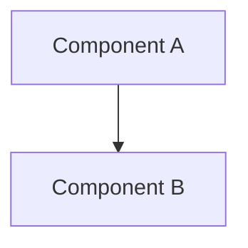

# [文檔標題 - 待 AtlasVault Team 補充]

**版本**: 1.0
**更新日期**: 2025-12-09
**文檔類型**: 詳細說明
**維護團隊**: AtlasVault Team
**適用角色**: 工程師、架構師
**前置知識**: [00_overview.md](00_overview.md), [../01_data-flow.md](../01_data-flow.md)

---

## 📋 文檔目的

[待補充]

---

## 🎯 系統職責

[待補充]

---

## 🏗️ 系統架構

[待補充]

---

## 🔧 核心功能

[待補充]

---

## 📊 資料格式與 Schema

[待補充]

---

## 🔌 介面說明

[待補充]

---

## ⚙️ 配置與參數

[待補充]

---

## 🚀 使用方式

[待補充]

---

## 🐛 常見問題與除錯

[待補充]

---

## 📚 相關文檔

- [00_overview.md](00_overview.md) - AtlasVault 概覽
- [../01_data-flow.md](../01_data-flow.md) - 資料流說明

---

## 📝 文檔維護

### 版本歷史

| 版本 | 日期 | 作者 | 變更說明 |
|------|------|------|----------|
| 1.0 | 2025-12-09 | Architecture Team | Skeleton 建立 (待 AtlasVault Team 補充) |

### 維護職責
- **主要維護者**: AtlasVault Team
- **審核者**: Architecture Team

---

**待 AtlasVault Team 補充詳細內容**

> 請參考 [DOCUMENTATION_POLICY.md](../DOCUMENTATION_POLICY.md) 的撰寫規範
