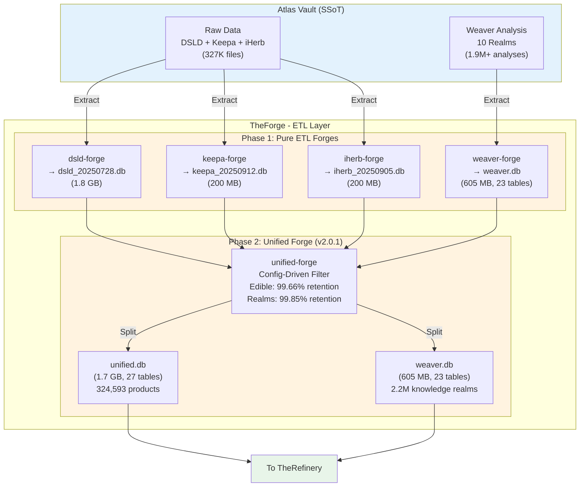

# TheForge - ETL 層架構

---

## 📋 文檔目的

本文檔提供 **TheForge ETL 層**的完整說明,幫助讀者理解:
- TheForge 在 LuminNexus 資料循環中的核心角色
- Phase 1 (Pure ETL) 與 Phase 2 (Unified Forge) 的職責分工
- Split Database Architecture (unified.db + weaver.db)
- 完整的資料處理流程與效能指標

> **完整架構文檔**: `LuminNexus-AtlasVault-TheForge/docs/20251209_architecture_cycle.md`

---

## 🎯 系統職責

**TheForge** 是 LuminNexus 的 **ETL 層 (Extract, Transform, Load)**,負責將來自 Atlas Vault 的原始 JSON 資料轉換為結構化的 SQLite 資料庫。

### 核心職責

| 項目 | 說明 |
|------|------|
| **職責** | 原始 JSON → 結構化 SQLite 資料庫 |
| **處理規模** | 327K+ 檔案 (DSLD + iHerb + Keepa + Weaver) |
| **輸出** | Split DB Architecture: unified.db (1.7GB) + weaver.db (605MB) |
| **特性** | Pure ETL (Phase 1) + Config-Driven Filter (Phase 2) |

### 系統定位
- **Layer**: AtlasVault (Layer 1)
- **上游**: Atlas Vault (SSoT)
- **下游**: TheRefinery (AlchemyMind Layer 2)

---

## 🏗️ 系統架構



---

## 🔧 核心功能

### Phase 1: Pure ETL Forges (4 模組)

#### 1. dsld-forge (v1.0)
- **職責**: DSLD JSON → SQLite
- **輸入**: 211,782 JSON 檔案
- **輸出**: `dsld_20250728.db` (~1.8 GB)
- **內容**:
  - 19 個資料表
  - 7 個自動生成的 Taxonomies
  - Pure ETL: 無 enrichment
- **處理時間**: ~35-40 分鐘

#### 2. keepa-forge (v0.1.0)
- **職責**: Keepa JSON → SQLite
- **輸入**: 64,661 JSON 檔案
- **輸出**: `keepa_20250912.db` (~200 MB)
- **內容**:
  - Price history tracking
  - Amazon marketplace data
  - Pure ETL: 無 enrichment
- **處理時間**: ~15-20 分鐘

#### 3. iherb-forge (v1.0)
- **職責**: iHerb JSON → SQLite
- **輸入**: 50,461 JSON 檔案
- **輸出**: `iherb_20250905.db` (~200 MB)
- **內容**:
  - 118 個欄位
  - UPC mapping integration
  - Pure ETL: 無 enrichment
- **處理時間**: ~15-20 分鐘

#### 4. weaver-forge (v2.0) ⭐
- **職責**: Weaver Analysis JSON → SQLite
- **輸入**: 1.9M+ 分析檔案 (10 realms)
- **輸出**: `weaver.db` (~605 MB, **23 tables**)
- **內容**:
  - Phase 1: EdibleAnalysis (290,768 records)
  - Phase 2: 10 Knowledge Realms (1,915,003 records)
  - Phase 3: RealmProcessingStatus (1,256,080 records) - Token tracking
  - Composite PK: `(id, source)`
  - Cross-database JOIN ready
- **處理時間**: ~20 分鐘

---

### Phase 2: Unified Forge (v2.0.1) ✅ Production Ready

#### 職責
- **Config-Driven Filter & Assembler**
- NOT Pure ETL, but NOT Enrichment
- 簡單過濾 + 資料組裝

#### 核心功能
- ✅ ATTACH multiple databases
- ✅ Apply config-driven filters (edible classification)
- ✅ Copy filtered tables (no schema changes)
- ✅ **Split output**: unified.db + weaver.db
- ✅ Support multiple output configurations

#### Split Database Architecture

**為什麼要分割?**
- **unified.db**: 產品資料 (DSLD + Keepa + iHerb + linkage)
- **weaver.db**: 知識領域資料 (10 realms + taxonomies + status)
- 模組化查詢與最佳效能
- Cross-database JOINs via `ATTACH DATABASE`

**輸出結構**:
```
output/dsld_centric/
├── unified.db (1.7 GB, 27 tables, 324,593 products)
└── weaver.db (605 MB, 23 tables, 2.2M knowledge realms)
```

#### 過濾邏輯

**Edible Filter** (dsld_centric.json):
```json
{
  "name": "dsld_centric",
  "auxiliary_filters": [
    {
      "source_table": "EdibleAnalysis",
      "filter_condition": "is_edible=1 AND confidence>=0.7"
    }
  ]
}
```

**過濾結果**:
- Products: 325,712 → 324,593 (**99.66% retention**)
- Knowledge Realms: 2,205,771 → 2,202,506 (**99.85% retention**)
- 僅過濾 1,119 個 non-edible products

---

## 📊 資料格式與 Schema

### Phase 1 Outputs

#### dsld_20250728.db
- **Products**: 產品主表 (211,782 rows)
- **Brands**: 品牌表
- **ProductSupplementFacts**: 成分表
- **7 Taxonomies**: DSLD 自動生成的分類
- **... 19 tables total**

#### keepa_20250912.db
- **KeepaProducts**: 64,661 rows
- **PriceHistory**: 價格歷史
- **MarketplaceData**: Amazon 市場資料

#### iherb_20250905.db
- **IHerbProducts**: 50,461 rows (118 columns)
- **ProductUPCs**: UPC 條碼
- **ProductEANs**: EAN 條碼

#### weaver.db (23 tables) ⭐
```
weaver.db
├── EdibleAnalysis (290,768 rows)
├── HealthEffect (175,628 rows)
├── Certification (227,474 rows)
├── IngredientPurity (242,792 rows)
├── FormulationTechnology (72,868 rows)
├── PerformanceEnhancement (39,992 rows)
├── UsageConvenience (269,107 rows)
├── FlavorCharacteristics (117,325 rows)
├── QualityOfLife (120,665 rows)
├── UsageContext (303,855 rows)
├── DietaryAdaptability (345,297 rows)
├── HealthEffectTaxonomy (231 nodes)
├── CertificationTaxonomy (370 nodes)
├── ... (10 taxonomies total, 2,431 nodes)
├── RealmProcessingStatus (1,256,080 rows) - Token tracking ⭐
└── _metadata
```

---

### Phase 2 Outputs

#### unified.db (1.7 GB, 27 tables)
```
Products (211,585 rows) - DSLD filtered
Brands - DSLD
KeepaProducts (62,548 rows) - filtered
IHerbProducts (50,460 rows) - filtered
ProductUPCs (279,842 rows)
ProductEANs (69,300 rows)
DSLDKeepaMatching - UPC matching
DSLDIHerbMatching - UPC matching
7 DSLD Taxonomies
... (27 tables total)
```

#### weaver.db (605 MB, 23 tables)
- 與 Phase 1 的 weaver.db 相同結構
- 但內容已過濾 (僅包含 is_edible=1 的產品)

---

## 🔌 介面說明

### 輸入 (from Atlas Vault)

**目錄結構**:
```
/opt/atlas_vault/
├── dsld/official/20250728/          (211,782 JSON files)
├── keepa/products/20250912/         (64,661 JSON files)
├── iherb/catalog/20250905/          (50,461 JSON files)
└── weaver/                          (1.9M+ analysis JSON files)
    ├── edible/v1.0/20251124/
    ├── health_effect/v1.0/20251202/
    ├── certification/v1.0/20251202/
    └── ... (10 realms)
```

---

### 輸出 (to TheRefinery)

**Split Database Architecture**:
```
output/dsld_centric/
├── unified.db (1.7 GB)
│   └── 產品資料 + 跨來源 matching
└── weaver.db (605 MB)
    └── 知識領域分析 + Taxonomies
```

**下游使用方式**:
```python
# TheRefinery 需要 ATTACH 兩個資料庫
ATTACH 'output/dsld_centric/unified.db' AS unified;
ATTACH 'output/dsld_centric/weaver.db' AS weaver;

# 可以進行跨資料庫 JOIN
SELECT
    p.product_name,
    e.is_edible,
    h.health_effects
FROM unified.Products p
JOIN weaver.EdibleAnalysis e ON p.id = e.id AND p.source = e.source
LEFT JOIN weaver.HealthEffect h ON p.id = h.id AND p.source = h.source
WHERE e.is_edible = 1;
```

---

## ⚙️ 配置與參數

### 環境變數

```bash
# .env
ATLASVAULT_DATA_PATH=/opt/atlas_vault/
```

### Unified Forge 配置

**配置檔案位置**: `unified-forge/config/filter_profiles/`

**dsld_centric.json**:
```json
{
  "name": "dsld_centric",
  "description": "DSLD-centric with edible filter",
  "auxiliary_filters": [
    {
      "source_table": "EdibleAnalysis",
      "filter_condition": "is_edible=1 AND confidence>=0.7",
      "description": "Filter non-edible products"
    }
  ]
}
```

---

## 🚀 使用方式

### Phase 1: 執行 Pure ETL Forges

```bash
cd LuminNexus-AtlasVault-TheForge

# 1. 執行 dsld-forge
cd dsld-forge
python main.py
# Output: output/dsld_20250728.db (~1.8 GB, ~35-40 min)

# 2. 執行 keepa-forge
cd ../keepa-forge
python main.py
# Output: output/keepa_20250912.db (~200 MB, ~15-20 min)

# 3. 執行 iherb-forge
cd ../iherb-forge
python main.py
# Output: output/iherb_20250905.db (~200 MB, ~15-20 min)

# 4. 執行 weaver-forge (multi-realm)
cd ../weaver-forge
python main.py --all-realms
# Output: output/weaver.db (~605 MB, 23 tables, ~20 min)
```

---

### Phase 2: 執行 Unified Forge

```bash
cd unified-forge

# 使用 dsld_centric profile (edible filter)
python main.py --profile dsld_centric

# Output:
#   output/dsld_centric/
#   ├── unified.db (1.7 GB, 324,593 products)
#   └── weaver.db (605 MB, 2.2M knowledge realms)

# 處理時間: ~15-20 分鐘
```

**輸出訊息**:
```
Unified-Forge v2.0.1
====================
Profile: dsld_centric
Config: config/filter_profiles/dsld_centric.json

[1/4] Attaching databases...
  ✓ dsld_20250728.db (1.8 GB)
  ✓ keepa_20250912.db (200 MB)
  ✓ iherb_20250905.db (200 MB)
  ✓ weaver.db (605 MB)

[2/4] Applying filters...
  ✓ EdibleAnalysis: is_edible=1 AND confidence>=0.7
  ✓ Filtered: 1,119 products (99.66% retention)

[3/4] Copying tables to temp database...
  ✓ Products: 324,593 rows
  ✓ KeepaProducts: 62,548 rows
  ✓ IHerbProducts: 50,460 rows
  ✓ Knowledge realms: 2.2M rows (99.85% retention)

[4/4] Splitting to unified.db + weaver.db...
  ✓ unified.db: 1.7 GB (27 tables)
  ✓ weaver.db: 605 MB (23 tables)

Total time: 18m 32s
```

---

## 📊 性能指標

### 處理時間

| Forge | 輸入規模 | 處理時間 | 吞吐量 |
|-------|---------|---------|--------|
| dsld-forge | 211,782 files | ~35-40 min | ~90 files/s |
| keepa-forge | 64,661 files | ~15-20 min | ~54 files/s |
| iherb-forge | 50,461 files | ~15-20 min | ~42 files/s |
| weaver-forge | 1.9M+ files | ~20 min | ~1,600 files/s |
| unified-forge | 4 DBs | ~15-20 min | N/A |
| **Total** | **327K+ files** | **~100-120 min** | **~54 files/s** |

---

### 資料庫大小

| 資料庫 | 大小 | 記錄數 |
|--------|------|--------|
| dsld_20250728.db | ~1.8 GB | 211,782 products |
| keepa_20250912.db | ~200 MB | 64,661 products |
| iherb_20250905.db | ~200 MB | 50,461 products |
| weaver.db (Phase 1) | ~605 MB | 1.9M+ analyses |
| **unified.db (Phase 2)** | **~1.7 GB** | **324,593 products** |
| **weaver.db (Phase 2)** | **~605 MB** | **2.2M realms** |

---

### 過濾統計 (Unified-Forge v2.0)

#### Products Filtered by Edible Classification

| Source | Before | After | Filtered | Retention |
|--------|--------|-------|----------|-----------|
| DSLD | 211,782 | 211,585 | 197 | **99.91%** |
| Keepa | 63,469 | 62,548 | 921 | **98.55%** |
| iHerb | 50,461 | 50,460 | 1 | **99.99%** |
| **Total** | **325,712** | **324,593** | **1,119** | **99.66%** |

#### Knowledge Realms Filtered by Product Existence

| Realm | Before | After | Retention |
|-------|--------|-------|-----------|
| EdibleAnalysis | 290,768 | 289,649 | **99.62%** |
| HealthEffect | 175,628 | 175,044 | **99.67%** |
| Certification | 227,474 | 226,813 | **99.71%** |
| UsageContext | 303,855 | 302,814 | **99.66%** |
| DietaryAdaptability | 345,297 | 344,273 | **99.70%** |
| RealmProcessingStatus | 1,256,080 | 1,256,080 | **100.00%** |
| **Total** | **2,205,771** | **2,202,506** | **99.85%** |

---

## 🏗️ 技術架構

### 設計原則

#### 1. Pure ETL Separation (Phase 1)
- dsld-forge, keepa-forge, iherb-forge, weaver-forge: **Pure ETL only**
- No enrichment, no filtering, no business logic
- "Extract → Transform → Load" 嚴格執行

#### 2. Config-Driven Flexibility (Phase 2)
- unified-forge 使用 JSON configs 驅動
- No hardcoded business rules
- 易於新增新的 filter profiles

#### 3. Split Database Architecture
- **unified.db**: 產品資料 (DSLD + Keepa + iHerb + linkage)
- **weaver.db**: 知識領域資料 (10 realms + taxonomies + status)
- 模組化查詢與最佳效能
- Cross-database JOINs via `ATTACH DATABASE`

#### 4. Single Source of Truth (SSoT)
- **Atlas Vault** 是唯一的資料真相來源
- 所有原始資料來自 Vault
- TheWeaver 的輸出會同步回 Vault

---

### 技術棧

- **Language**: Python 3.8+
- **Database**: SQLite 3
- **Dependencies**:
  - `python-dotenv` (environment variables)
  - `tqdm` (progress tracking)
  - `forge-common` (shared utilities)
- **Package Manager**: UV

---

### 優化策略

1. **Batch Processing**: 1,000 records per commit
2. **SQLite Pragmas**:
   - WAL mode (Write-Ahead Logging)
   - NORMAL sync
   - 128MB cache
   - 256MB mmap
3. **Index Creation**: Post-load (not during INSERT)
4. **VACUUM**: Run after all inserts complete
5. **Aggressive WAL Checkpoint**: TRUNCATE every 10 batches (dsld-forge)
6. **Temp DB → Split**: Build in temp, then split for optimal performance

---

## 🔄 資料流程與循環

### Complete Cycle

```
1. Atlas Vault (SSoT)
   ↓ Raw JSON
2. TheForge Phase 1 (Pure ETL)
   ↓ 4 separate DBs
3. TheForge Phase 2 (Unified Forge)
   ↓ unified.db + weaver.db
4. TheRefinery (Processing)
   ↓ refined_products.db
5. TheWeaver (LLM Analysis)
   ↓ Analysis JSON
6. Sync back to Vault ← Cycle complete!
```

### Pattern 1: New Product Addition

```
1. New DSLD product → Vault (99999.json)
2. Run dsld-forge → dsld_20250728.db (updated)
3. Run unified-forge → Product 99999 NOT included (no edible analysis)
4. Run TheWeaver → 10 realm analyses for product 99999
5. Sync back to Vault
6. Run weaver-forge → weaver.db (updated)
7. Run unified-forge again → Product 99999 NOW included (if is_edible=1)
```

---

## 🐛 常見問題與除錯

### Q1: 為什麼要分成 Phase 1 和 Phase 2?
**A**:
- **Phase 1 (Pure ETL)**: 保持原始資料完整性,不做任何過濾
- **Phase 2 (Unified Forge)**: 根據不同需求生成不同的子集

### Q2: Split Database Architecture 的優點?
**A**:
- **模組化**: 產品資料與知識領域分離,查詢更高效
- **彈性**: 可以只 ATTACH 需要的資料庫
- **效能**: 減少單一資料庫大小,提升查詢速度

### Q3: 如何新增一個 filter profile?
**A**:
1. 在 `unified-forge/config/filter_profiles/` 新增 JSON 檔案
2. 定義 `name`, `description`, `auxiliary_filters`
3. 執行 `python main.py --profile your_profile_name`

**範例**: certified_organic.json
```json
{
  "name": "certified_organic",
  "description": "Products with organic certification",
  "auxiliary_filters": [
    {
      "source_table": "Certification",
      "filter_condition": "organic=1",
      "description": "Filter non-organic products"
    }
  ]
}
```

### Q4: Unified Forge 執行失敗,如何除錯?
**A**:
1. 檢查 Phase 1 輸出是否存在:
   ```bash
   ls -lh dsld-forge/output/dsld_20250728.db
   ls -lh weaver-forge/output/weaver.db
   ```
2. 檢查資料庫完整性:
   ```bash
   sqlite3 dsld-forge/output/dsld_20250728.db "PRAGMA integrity_check;"
   ```
3. 檢查配置檔案語法:
   ```bash
   python -m json.tool unified-forge/config/filter_profiles/dsld_centric.json
   ```
4. 啟用 debug 模式:
   ```bash
   python main.py --profile dsld_centric --debug
   ```

### Q5: 過濾掉的產品如何查看?
**A**:
```bash
# 查看被過濾的產品
sqlite3 dsld-forge/output/dsld_20250728.db <<EOF
SELECT p.id, p.product_name, e.is_edible, e.confidence
FROM Products p
LEFT JOIN weaver.EdibleAnalysis e USING (id, source)
WHERE e.is_edible = 0 OR e.confidence < 0.7
LIMIT 10;
EOF
```

---

## 📚 相關文檔

### Learning Map 文檔
- [00_overview.md](00_overview.md) - AtlasVault 概覽
- [../00_architecture-overview.md](../00_architecture-overview.md) - 系統架構全景
- [../01_data-flow.md](../01_data-flow.md) - 資料流與系統串連
- [vault.md](vault.md) - Atlas Vault 詳細說明

### TheForge 專案文檔
- `LuminNexus-AtlasVault-TheForge/docs/20251209_architecture_cycle.md` - **完整架構文檔** ⭐
- `LuminNexus-AtlasVault-TheForge/CLAUDE.md` - 專案記憶檔
- `LuminNexus-AtlasVault-TheForge/dsld-forge/README.md` - DSLD Forge
- `LuminNexus-AtlasVault-TheForge/weaver-forge/README.md` - Weaver Forge v2.0
- `LuminNexus-AtlasVault-TheForge/unified-forge/README.md` - Unified Forge v2.0.1
- `LuminNexus-AtlasVault-TheForge/specs/` - 各模組規格文檔

---

## 🎯 適用角色

### 資料工程師
- ✅ 理解 ETL 流程與最佳實踐
- ✅ 學習 SQLite 優化技巧
- ✅ 掌握 Config-Driven Architecture
- 📖 建議先閱讀: 本文檔 + Phase 1 各模組 README

### 架構師
- ✅ 掌握 Split Database Architecture
- ✅ 理解 Pure ETL 與 Filtering 的分離
- ✅ 規劃未來的 filter profiles
- 📖 建議先閱讀: [../00_architecture-overview.md](../00_architecture-overview.md)

### 後端工程師
- ✅ 理解資料庫結構與 Schema
- ✅ 學習 Cross-database JOIN 技巧
- ✅ 了解如何使用 unified.db + weaver.db
- 📖 建議先閱讀: 本文檔的「介面說明」章節

---

## 📝 文檔維護

### 版本歷史

| 版本 | 日期 | 作者 | 變更說明 |
|------|------|------|----------|
| 2.0.1 | 2025-12-09 | AtlasVault Team - TheForge | 整合 TheForge team 完整架構文檔 |
| 1.0 | 2025-12-09 | Architecture Team | Skeleton 建立 |

### 維護職責
- **主要維護者**: AtlasVault Team - TheForge
- **審核者**: Architecture Team
- **更新頻率**: 每次重大版本更新後

### 下一步
- [ ] 實作更多 filter profiles (certified_organic, iherb_only, etc.)
- [ ] 自動化 cycle orchestration (Airflow DAG)
- [ ] Incremental updates support
- [ ] Taxonomy management forge

---

**文檔結束**

> **完整架構**: 請參考專案內 `docs/20251209_architecture_cycle.md` (810 行完整文檔)
>
> **Current Status**: v2.0.1 Production Ready | Split DB Architecture | 99.66% Products | 99.85% Realms
