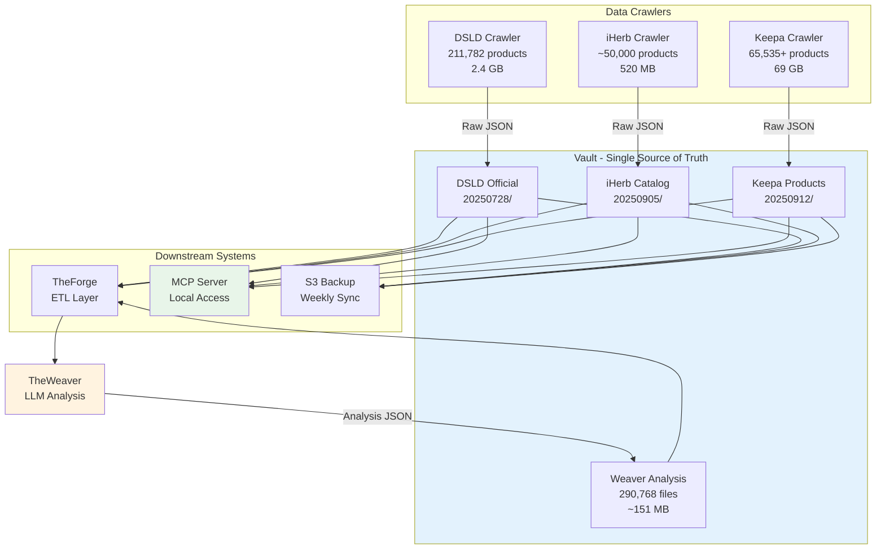

# Vault - 原始資料中央儲存庫

---

## 📋 文檔目的

本文檔說明 **Vault** 作為 LuminNexus 生態系統的**中央原始資料儲存庫** (Single Source of Truth)，幫助讀者理解:
- Vault 在整體資料循環中的核心角色
- 資料版本控制與管理機制
- 與上下游系統的資料流動關係
- URI 系統與資源定位方式

> **完整技術文檔**: AtlasVault 專案的 `CLAUDE.md` 與 `docs/20251111_raw_data_management_design_v2.1.md`

---

## 🎯 系統職責

**Vault** 是 LuminNexus 的**中央原始資料儲存庫**，負責集中管理所有來源的原始資料，並提供統一的版本控制與存取機制。

### 核心職責

| 項目 | 說明 |
|------|------|
| **職責** | Single Source of Truth (SSoT) |
| **資料規模** | ~332K 檔案, ~92 GB |
| **來源數量** | 4 個主要來源 (DSLD, iHerb, Keepa, TheWeaver) |
| **版本控制** | 日期版本 (YYYYMMDD) + 標籤版本 (v1.0) |

### 整體目標

- **統一資料來源**: 作為所有原始資料的唯一真相來源 (Single Source of Truth)
- **版本管理**: 以日期為版本控制所有資料快照 (YYYYMMDD)
- **不可變性**: 原始資料版本永不更改，確保資料完整性
- **循環歸檔**: 接收 TheWeaver 的分析結果，供下一輪 ETL 使用

---

## 🏗️ 系統架構



**循環機制**: TheWeaver 的分析結果會回寫到 Vault，成為下一輪 ETL 的輸入，形成資料不斷豐富的循環架構。

---

## 🔧 核心功能

### 1. 資料收集與儲存

Vault 從以下來源收集原始資料：

| 來源 | 收集方式 | 版本 | 檔案數 | 大小 | 儲存路徑 |
|------|---------|------|--------|------|----------|
| **DSLD** | 官方資料庫爬蟲 | 20250728 | 211,782 | 2.4 GB | `dsld/official/YYYYMMDD/` |
| **iHerb** | 產品目錄爬蟲 | 20250905 | ~50,000 | 520 MB | `iherb/catalog/YYYYMMDD/` |
| **Keepa** | Amazon 市場爬蟲 | 20250912 | 65,535+ | 69 GB | `keepa/products/YYYYMMDD/` |
| **TheWeaver** | LLM 分析結果 | 20251124 | 290,768 | ~151 MB | `weaver/{realm}/v1.0/YYYYMMDD/` |

**總計**: ~332K 檔案, ~92 GB

### 2. 版本控制

**日期版本**: `YYYYMMDD` (如 `20250728`)
- 每次資料更新建立新的版本目錄
- 原始資料版本永不更改（不可變性）

**標籤版本**: 如 `brand_review`, `v1.0`
- 用於 TheWeaver 分析結果的版本管理

### 3. URI 系統

統一的資源定位系統：
```
atlasvault://{source}/{version}/{identifier}
```

**範例**:
- `atlasvault://dsld/20250728/1000` - DSLD 產品 ID 1000
- `atlasvault://keepa/20250912/000856006508` - Keepa UPC 資料

### 4. 條碼正規化

- 支援 UPC-A (12 位) 和 EAN-13 (13 位)
- 包含 checksum 驗證
- 保留原始條碼類型，不強制轉換

### 5. 本地優先 + 雲端備份

- MCP 從本地檔案系統讀取 (回應時間 <20ms)
- 每週自動同步至 S3 (成本 ~$37-47/年)

---

## 📊 資料格式與 Schema

### 儲存結構

```
/opt/atlas_vault/  (或 ~/.atlasvault/)
├── dsld/
│   └── official/
│       └── 20250728/
│           ├── 1000.json
│           ├── 1001.json
│           └── ...
├── iherb/
│   └── catalog/
│       └── 20250905/
│           └── ...
├── keepa/
│   └── products/
│       └── 20250912/
│           └── ...
└── weaver/
    ├── edible/v1.0/20251124/
    ├── health_effect/v1.0/20251124/
    └── taxonomy/
        ├── EdibleTaxonomy.json
        └── ...
```

### 檔案格式

- **原始資料**: JSON 格式 (一個產品一個檔案)
- **TheWeaver 分析結果**: JSON 格式 (按 Knowledge Realm 分類)
- **Taxonomy 定義**: JSON 格式 (在 `weaver/taxonomy/` 目錄)

---

## 🔌 介面說明

### 1. TheForge (ETL 層)

**用途**: 讀取原始 JSON 檔案，轉換為結構化的 SQLite 資料庫

**存取路徑**:
- `dsld/official/20250728/`
- `iherb/catalog/20250905/`
- `keepa/products/20250912/`
- `weaver/{realm}/v1.0/20251124/`

### 2. MCP 資源伺服器

**用途**: 提供本地唯讀存取，支援 AI Agents 查詢原始資料

**支援 URI**: `atlasvault://{source}/{version}/{id}`
**本地路徑**: `~/.atlasvault/raw/`
**回應時間**: <20ms

### 3. TheWeaver 分析結果歸檔

**用途**: 接收 LLM 分析的 10 個知識領域結果

**儲存路徑**: `weaver/{realm}/v1.0/YYYYMMDD/`

**10 個 Knowledge Realms**:
1. Edible (可食用性)
2. HealthEffect (健康效果)
3. Certification (認證)
4. IngredientPurity (成分純度)
5. SupplementFact (營養標示)
6. DosageForm (劑型)
7. TargetAudience (目標受眾)
8. AllergenInfo (過敏原)
9. StorageCondition (儲存條件)
10. UsageInstruction (使用說明)

### 4. S3 備份

**用途**: 每週同步至 S3，確保資料安全

**S3 路徑**: `s3://luminnexus-atlasvault/raw/`
**同步頻率**: 每週一次
**成本**: ~$37-47/年

---

## ⚙️ 配置與參數

### 本地儲存路徑

- **Linux/macOS**: `/opt/atlas_vault/` 或 `~/.atlasvault/`
- **Windows**: `C:\AtlasVault\` 或 `%USERPROFILE%\.atlasvault\`

### 版本命名規範

- **日期版本**: `YYYYMMDD` (例如: `20250728`)
- **標籤版本**: `v{major}.{minor}` (例如: `v1.0`)

### 成本估算

| 項目 | 規模 | 成本 |
|------|------|------|
| 本地儲存 | ~92 GB | 免費 (本地硬碟) |
| S3 儲存 | ~92 GB | ~$2.12/月 |
| S3 下載 (每週) | ~92 GB/週 | ~$30-40/月 |
| **總計** | | **~$37-47/年** |

---

## 🚀 使用方式

### 1. 存取原始資料 (TheForge)

```python
# Phase 1 Forge 讀取原始資料
import json
from pathlib import Path

vault_path = Path("/opt/atlas_vault")
dsld_version = "20250728"

# 讀取單一產品
product_path = vault_path / f"dsld/official/{dsld_version}/1000.json"
with open(product_path) as f:
    product_data = json.load(f)
```

### 2. 使用 URI 系統 (MCP)

```python
# MCP Server 解析 URI
uri = "atlasvault://dsld/20250728/1000"
# → 對應到 ~/.atlasvault/raw/dsld/official/20250728/1000.json
```

### 3. 回寫分析結果 (TheWeaver)

```python
# TheWeaver 回寫分析結果
import json
from pathlib import Path

vault_path = Path("/opt/atlas_vault")
realm = "edible"
version = "v1.0"
date = "20251124"

output_dir = vault_path / f"weaver/{realm}/{version}/{date}"
output_dir.mkdir(parents=True, exist_ok=True)

# 寫入分析結果
result = {
    "product_id": 1000,
    "is_edible": True,
    "confidence": 0.95
}
with open(output_dir / "1000.json", "w") as f:
    json.dump(result, f, indent=2)
```

---

## 🔑 關鍵概念

### 1. Single Source of Truth (SSoT)

Vault 是唯一的資料真相來源，所有系統都從 Vault 讀取原始資料。

**好處**:
- 避免資料不一致
- 統一版本管理
- 易於追溯資料來源

### 2. 不可變性 (Immutable)

原始資料版本永不更改。每次更新都會建立新的版本目錄。

**範例**:
```
dsld/official/20250728/  ← 永不更改
dsld/official/20250915/  ← 新版本
```

### 3. 循環架構 (Cyclical Architecture)

資料會循環流動：
1. Crawler → Vault (原始資料)
2. Vault → TheForge → TheRefinery → TheWeaver (處理與分析)
3. TheWeaver → Vault (分析結果回寫)
4. Vault → TheForge (下一輪使用新的分析結果)

---

## 🐛 常見問題與除錯

### Q1: Vault 和 AtlasVault 有什麼差別?

**A**:
- **AtlasVault**: 整個 Layer 1 系統 (包含 Crawlers + Vault + TheForge)
- **Vault**: 中央資料庫，儲存所有原始資料的地方

### Q2: 為什麼 TheWeaver 的結果要回寫到 Vault?

**A**: TheWeaver 的分析 (如 is_edible) 會被 Unified Forge 用來過濾資料，形成循環架構。下一輪 ETL 時會使用新的分析結果。

### Q3: 如何確保資料不會被誤刪?

**A**:
- 原始資料版本永不更改（不可變性）
- 每週自動同步至 S3 備份
- 使用日期版本控制，每次更新建立新目錄

### Q4: 為什麼要用檔案系統而不是資料庫?

**A**:
- 原始資料是 JSON 格式，直接儲存更簡單
- MCP Server 可以快速讀取 (<20ms)
- 易於版本控制與備份
- 下游系統 (TheForge) 需要原始 JSON 進行 ETL

### Q5: URI 系統的優點是什麼?

**A**:
- 統一的資源定位方式
- 支援跨系統引用 (MCP, TheForge, etc.)
- 易於追溯資料來源與版本

---

## 📚 相關文檔

### 內部文檔
- [00_overview.md](00_overview.md) - AtlasVault 概覽
- [../01_data-flow.md](../01_data-flow.md) - 完整的資料循環流程
- [theforge.md](theforge.md) - ETL 層如何處理 Vault 資料
- [../alchemymind/theweaver.md](../alchemymind/theweaver.md) - LLM 分析如何回寫到 Vault
- [../prismavision/mcp.md](../prismavision/mcp.md) - MCP 伺服器如何存取 Vault

### 外部專案文檔
- `LuminNexus-AtlasVault/CLAUDE.md` - AtlasVault 專案完整設計與規範
- `LuminNexus-AtlasVault/docs/20251111_raw_data_management_design_v2.1.md` - v2.1 設計文檔

---

## 📝 文檔維護

### 版本歷史

| 版本 | 日期 | 作者 | 變更說明 |
|------|------|------|----------|
| 1.0 | 2025-12-09 | AtlasVault Team | 初版建立 (LearningMap 簡介版) |

### 維護職責
- **主要維護者**: AtlasVault Team
- **審核者**: Architecture Team
- **更新頻率**: 當架構變更時

---

**文檔結束**

> **注意**: 本文檔為簡化版概覽，詳細的技術實作請參考 AtlasVault 專案的 CLAUDE.md 與 docs/ 目錄。
