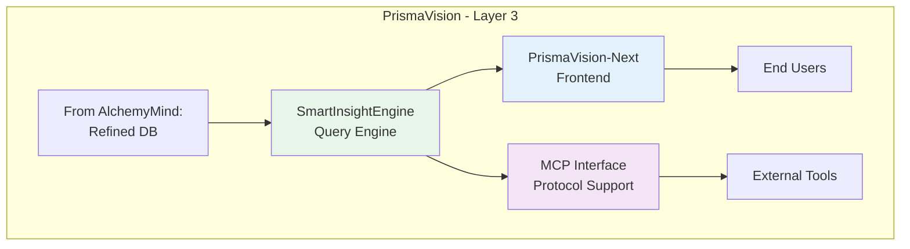
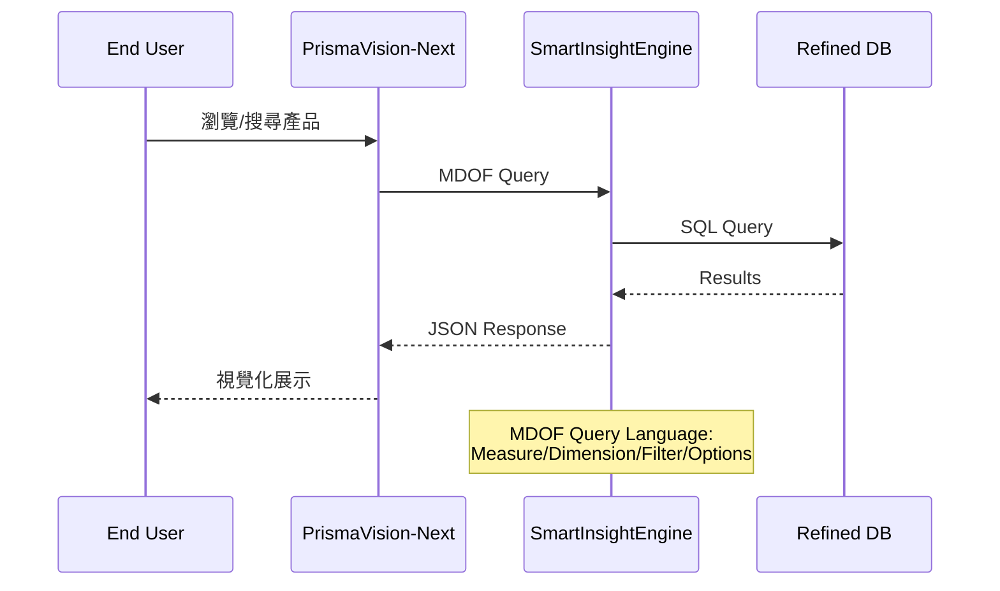

# PrismaVision - 使用者介面與引擎層概覽

**版本**: 1.0
**更新日期**: 2025-12-09
**文檔類型**: 概覽
**維護團隊**: PrismaVision Team
**適用角色**: 全員
**前置知識**: [00_architecture-overview.md](../00_architecture-overview.md)

---

## 📋 文檔目的

本文檔提供 **PrismaVision** 系統的概覽,幫助讀者理解:
- PrismaVision 在整體架構中的定位
- 各子系統的職責與關係
- 資料查詢、分析、展示的完整流程

> **詳細內容**: 各子系統的詳細說明請參考對應的文檔連結

---

## 🎯 系統概述

**PrismaVision** 是 LuminNexus 的**使用者介面與引擎層** (Layer 3),負責:
- 資料查詢與分析 (SmartInsightEngine)
- 前端介面展示 (PrismaVision-Next)
- 協議介面支援 (MCP)

---

## 🏗️ 系統架構

---

## 📦 子系統列表

### 1. SmartInsightEngine - 查詢引擎 ⭐

- **職責**: MDOF 查詢語言處理與執行,提供資料分析 API
- **核心功能**:
  - **M**easure: 度量指標 (product_count, avg_price, price_statistics...)
  - **D**imension: 維度選擇 (Brand, SupplementFact, DosageForm...)
  - **F**ilter: 過濾邏輯 (any/all bucket, cross_realms_logic)
  - **O**ptions: 選項配置 (limit, offset, bin_size...)
- **查詢能力**:
  - 支援 13 維度
  - ~130K 產品資料集
  - 複雜過濾邏輯 (any/all/cross-realms)
- **詳細文檔**: [smart-insight-engine/](smart-insight-engine/) ⭐ **完整學習路徑**
  - [00_overview.md](smart-insight-engine/00_overview.md) - SI Engine 總覽
  - [01_mdof-fundamentals.md](smart-insight-engine/01_mdof-fundamentals.md) - MDOF 基礎 (2-3天)
  - [02_query-design.md](smart-insight-engine/02_query-design.md) - 查詢設計進階 (2-3天)
  - [03_test-case-design.md](smart-insight-engine/03_test-case-design.md) - 測試案例設計 (1-2天)

### 2. PrismaVision-Next - 前端介面

- **職責**: 終端使用者介面,資料視覺化與互動
- **技術棧**: Next.js, React, TypeScript
- **核心功能**:
  - 產品瀏覽與搜尋
  - 資料視覺化 (圖表、儀表板)
  - 使用者互動與查詢建構器
- **詳細文檔**: [next.md](next.md)

### 3. MCP - 協議介面

- **職責**: MCP (Model Context Protocol) 協議支援
- **用途**: 讓外部工具 (如 AI Agents) 可以查詢 SmartInsightEngine
- **詳細文檔**: [mcp.md](mcp.md)

---

## 🔄 資料流程

---

## 📊 查詢能力

### SmartInsightEngine
- **資料規模**: ~130K products
- **支援維度**: 13 dimensions
  - Brand, SupplementFact, DosageForm
  - HealthEffect, Certification, IngredientPurity
  - ... (詳見 SI Engine 文檔)
- **查詢效能**: TBD (待 PrismaVision Team 補充)

### PrismaVision-Next
- **使用者容量**: TBD
- **頁面載入時間**: TBD

---

## 🔄 與其他系統的關係

### 資料流入
- **AlchemyMind (TheRefinery)** → SmartInsightEngine (Refined DB)

### 資料流出
- SmartInsightEngine → **PrismaVision-Next** (JSON API)
- SmartInsightEngine → **MCP** (JSON API)
- PrismaVision-Next → **End Users** (Web UI)
- MCP → **External Tools** (API)

**詳細說明**: 參考 [01_data-flow.md](../01_data-flow.md)

---

## 🎯 核心設計原則

### 1. Query Language Abstraction
- MDOF 提供高層級的查詢抽象
- 使用者不需要知道底層 SQL
- 支援複雜的分析需求

### 2. API-First Design
- SmartInsightEngine 提供 RESTful API
- 前端與後端完全分離
- 支援多種 client (Web UI, MCP, etc.)

### 3. User-Centric Interface
- PrismaVision-Next 專注於使用者體驗
- 資料視覺化優先
- 互動式查詢建構

### 4. Protocol Extensibility
- MCP 支援讓 AI Agents 可以查詢資料
- 開放介面讓其他工具整合

---

## 🔑 關鍵概念

### MDOF Query Language
- **M**easure: 要計算什麼? (count, avg, sum...)
- **D**imension: 按什麼分組? (Brand, SupplementFact...)
- **F**ilter: 篩選條件? (Brand="Nature Made")
- **O**ptions: 其他選項? (limit, offset, sort...)

### Dimension (維度)
- 產品的分類屬性
- 支援 13 個維度
- 有些是簡單欄位 (Brand),有些是分類法 (HealthEffect)

### Filter Logic
- **ANY bucket**: 任一條件滿足即可
- **ALL bucket**: 所有條件都要滿足
- **Cross-Realms**: 跨分類法的邏輯

---

## 📚 相關文檔

### 內部文檔
- [00_architecture-overview.md](../00_architecture-overview.md) - 整體架構
- [01_data-flow.md](../01_data-flow.md) - 資料流詳解
- [smart-insight-engine/](smart-insight-engine/) - **SmartInsightEngine 完整學習路徑** ⭐
- [next.md](next.md) - PrismaVision-Next 詳細說明
- [mcp.md](mcp.md) - MCP 協議介面

### 外部專案文檔
- `LuminNexus-PrismaVision-SmartInsightEngine/README.md` - SI Engine README
- `LuminNexus-PrismaVision-Next/README.md` - Next Frontend README
- `LuminNexus-PrismaVision-SmartInsightEngine-MCP/README.md` - MCP README

---

## 🎓 學習路徑

### 對於測試工程師
1. 先讀 [smart-insight-engine/00_overview.md](smart-insight-engine/00_overview.md) (1小時)
2. 深入學習 [smart-insight-engine/01_mdof-fundamentals.md](smart-insight-engine/01_mdof-fundamentals.md) (2-3天)
3. 學習測試設計 [smart-insight-engine/03_test-case-design.md](smart-insight-engine/03_test-case-design.md) (1-2天)

### 對於前端工程師
1. 理解 SmartInsightEngine 的 API
2. 學習 PrismaVision-Next 的架構 [next.md](next.md)
3. 實作資料視覺化元件

### 對於架構師
1. 理解 MDOF 查詢語言設計 [smart-insight-engine/02_query-design.md](smart-insight-engine/02_query-design.md)
2. 理解 API 介面與效能考量
3. 理解 MCP 協議整合 [mcp.md](mcp.md)

---

## ❓ 常見問題

### Q1: SmartInsightEngine 和一般的 SQL 查詢有什麼差別?
**A**: MDOF 提供更高層級的抽象,專門針對營養補充品分析設計,支援複雜的分類法邏輯 (如健康效果、認證等)。

### Q2: PrismaVision-Next 可以直接查詢資料庫嗎?
**A**: 不行,前端必須透過 SmartInsightEngine 的 API 查詢,確保資料安全與查詢邏輯一致性。

### Q3: MCP 是什麼?為什麼需要它?
**A**: MCP (Model Context Protocol) 讓 AI Agents (如 Claude Code) 可以查詢 SmartInsightEngine,實現 AI 驅動的資料分析。

### Q4: 如何學習 MDOF 查詢語言?
**A**: 請參考 [smart-insight-engine/](smart-insight-engine/) 的完整學習路徑,從基礎到進階,包含 50+ 實戰範例。

---

## 📝 文檔維護

### 版本歷史

| 版本 | 日期 | 作者 | 變更說明 |
|------|------|------|----------|
| 1.0 | 2025-12-09 | Architecture Team | 初版建立 (待 PrismaVision Team 補充) |

### 維護職責
- **主要維護者**: PrismaVision Team
- **審核者**: Architecture Team
- **更新頻率**: 每季度檢視一次

### 待補充內容
- [ ] PrismaVision-Next 的詳細架構
- [ ] MCP 協議的使用範例
- [ ] API 效能基準測試結果
- [ ] 使用者容量與擴展策略

---

**文檔結束**

> **Note to PrismaVision Team**: 這是一個 skeleton 文檔,請根據 [DOCUMENTATION_POLICY.md](../DOCUMENTATION_POLICY.md) 補充詳細內容。
>
> **SmartInsightEngine 文檔已存在**: `smart-insight-engine/` 目錄已有完整的學習路徑,請整合到本文檔。
