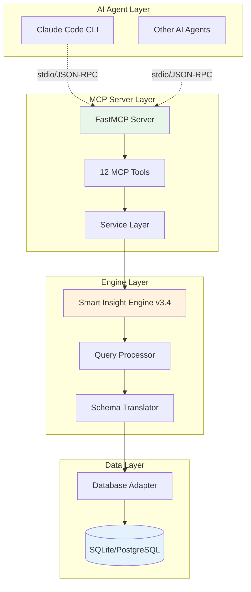
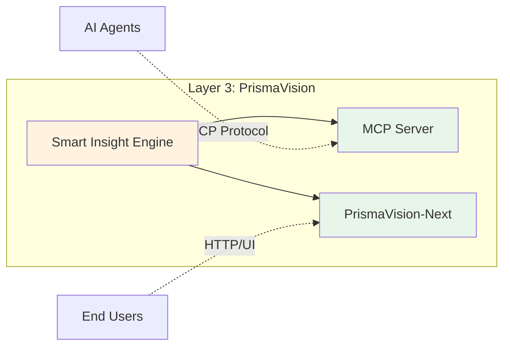
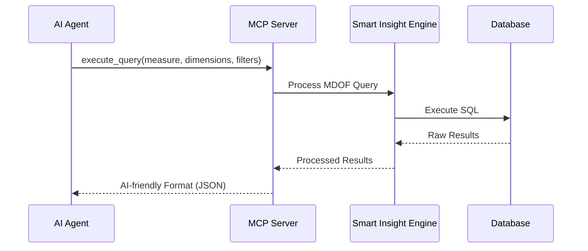

# Smart Insight Engine MCP - MCP 協議介面

**版本**: 1.0
**更新日期**: 2025-12-09
**文檔類型**: 詳細說明
**維護團隊**: PrismaVision Team - MCP
**適用角色**: 新進工程師、架構師
**前置知識**: [00_overview.md](00_overview.md), [../01_data-flow.md](../01_data-flow.md)

---

## 📋 文檔目的

本文檔說明 **Smart Insight Engine MCP Server** 的系統架構與設計理念，幫助讀者理解:
- MCP Server 在 LuminNexus 生態系統中的定位
- 如何透過標準化協議將查詢引擎能力開放給 AI Agent
- Input/Output 的資料流概念
- 與 Smart Insight Engine 的關係

> **注意**: 本文檔聚焦於 MCP 介面層，Engine 本身的詳細說明請參考 [smart-insight-engine/](smart-insight-engine/)

---

## 🎯 系統職責

### 核心職責

**Smart Insight Engine MCP Server** 是一個獨立服務，負責將 Smart Insight Engine v3.4 的查詢能力透過 **MCP (Model Context Protocol)** 標準協議開放給 AI Agent 使用。

### 系統目標

讓 AI Agent 能夠用標準化的方式查詢保健品資料庫 (~130K 產品)，**無需理解底層 SQL 或複雜的資料結構**。

### Input/Output 概念

**Input** (AI Agent → MCP Server):
```
自然語言意圖 → 結構化查詢請求
例如：「搜尋 folate 相關產品的品牌分佈，按價格排序」

轉換為 Query:
- Measure: product_count
- Dimensions: [Brand]
- Filters: {SupplementFact: ["Folate"]}
- Options: {order_by: "avg_price"}
```

**Output** (MCP Server → AI Agent):
```json
{
  "status": "success",
  "query": "product count by brand where supplement fact is folate",
  "results": [
    {"brand": "Nature Made", "product_count": 42, "rank": 1},
    {"brand": "NOW Foods", "product_count": 38, "rank": 2}
  ]
}
```

**設計特點**:
- snake_case 欄位名稱
- 扁平化結構 (無巢狀)
- 自然語言查詢描述

---

## 🏗️ 系統架構



### 架構分層說明

#### Layer 1: AI Agent Layer
- **職責**: 發起查詢請求、接收結果
- **協議**: stdio (本地) 或 SSE (遠端)
- **格式**: JSON-RPC 2.0

#### Layer 2: MCP Server Layer
- **FastMCP Server**: 處理 MCP 協議通訊
- **12 MCP Tools**: 開放的查詢工具集 (詳見下節)
- **Service Layer**: 業務邏輯層，串接 Engine

#### Layer 3: Engine Layer
- **Smart Insight Engine v3.4**: 核心查詢引擎
- **Query Processor**: 處理 MDOF 查詢語言
- **Schema Translator**: 轉換為 SQL

#### Layer 4: Data Layer
- **Database Adapter**: 支援 SQLite/PostgreSQL
- **Database**: 儲存約 130K 產品資料

---

## 🔧 核心功能

### MCP Tools 概覽

MCP Server 開放 **12 個工具**，分為 4 大類:

#### 1. 查詢執行工具 (4 個)

| 工具 | 說明 |
|------|------|
| `execute_query` | 執行單一查詢，回傳 AI-friendly 格式 |
| `execute_batch` | 批次執行多個查詢 |
| `execute_mixed_batch` | 混合查詢 (搜尋 + 查詢工作流) |
| `validate_query` | 驗證查詢參數正確性 |

**使用場景**: AI Agent 想要查詢產品資料

#### 2. 探索工具 (5 個)

| 工具 | 說明 |
|------|------|
| `search_taxonomies` | 搜尋分類名稱 (支援全局或指定 taxonomy) |
| `get_capabilities` | 取得系統支援的 measures/dimensions |
| `get_frontend_config` | 取得前端配置資訊 |
| `get_taxonomy_list` | 列出所有 taxonomy 類型 |
| `get_taxonomy` | 取得單一 taxonomy 完整樹狀結構 |

**使用場景**: AI Agent 需要了解系統能力、探索可用的維度

**新增工具**:
| 工具 | 說明 |
|------|------|
| `get_measure_info` | 取得 measure 詳細資訊 |

#### 3. 輔助工具 (1 個)

| 工具 | 說明 |
|------|------|
| `calculate_bin_size` | 計算分佈類 measure 的最佳 bin size |

**使用場景**: 執行價格分佈查詢時自動計算合適的區間

#### 4. 健康檢查工具 (2 個)

| 工具 | 說明 |
|------|------|
| `health_check` | 全面性系統健康檢查 |
| `test_all_tools` | 測試所有 MCP 工具是否正常運作 |

**使用場景**: 系統啟動時驗證、除錯時診斷問題

---

## 📊 資料格式與 Schema

### Input: Query Format (MDOF)

MDOF = **M**easure + **D**imension + **F**ilter + **O**ptions

**範例**:
```
查詢意圖：「各品牌的維他命 D 產品數量，取前 10 名」

MDOF Query:
├─ Measure: "product_count"          # 查什麼指標
├─ Dimensions: ["Brand"]             # 按什麼維度分組
├─ Filters: {                        # 過濾條件
│    "any": {"SupplementFact": ["Vitamin D"]},
│    "all": {}
│  }
└─ Options: {                        # 其他選項
     "limit": 10,
     "order_by": "product_count DESC"
   }
```

### Output: AI-Friendly Format

**設計原則**:
1. **snake_case 欄位**: `product_count` 而非 `productCount`
2. **扁平結構**: 無巢狀物件，方便 AI 解析
3. **自然語言描述**: `query` 欄位提供可讀的查詢描述

**範例**:
```json
{
  "status": "success",
  "query": "product count by brand where supplement fact is vitamin d",
  "results": [
    {
      "brand": "Nature Made",
      "product_count": 45,
      "rank": 1
    },
    {
      "brand": "NOW Foods",
      "product_count": 38,
      "rank": 2
    }
  ],
  "metadata": {
    "total_records": 2,
    "execution_time_ms": 125.3
  }
}
```

### 特殊功能: Search + Query Workflow

**場景**: AI Agent 不確定使用者說的 "folate" 在系統中的正確名稱

**解決方案**: 使用 `execute_mixed_batch` 工具

**流程**:
```
Step 1: Search
搜尋 "folate" → 找到 "Folate" (正確名稱)

Step 2: Query
使用 $search_id 引用搜尋結果
Filters: {"SupplementFact": ["$folate_search"]}

Step 3: 自動替換
MCP Server 自動將 $folate_search 替換為 "Folate"
```

---

## 🔌 介面說明

### 在 PrismaVision Layer 的定位



**說明**:
- **Smart Insight Engine**: 核心查詢引擎 (SSOT)
- **MCP Server**: 為 AI Agent 提供標準化介面
- **PrismaVision-Next**: 為終端使用者提供 Web UI

兩者都依賴同一個 Engine，但服務不同的使用者族群。

### 資料流向



---

## ⚙️ 配置與參數

### Environment-Based Config (環境變數配置)

```bash
SI_DB_TYPE=sqlite              # 資料庫類型
SI_DB_PATH=./data/products.db  # 資料庫路徑
```

**優點**: 12-Factor App 原則、容器化友善

### stdio Transport (標準輸入輸出)

- 使用 stdin/stdout 通訊 (非 HTTP)
- 原生支援 Claude Code 整合
- 本地執行、零網路延遲

**優點**: 安全、快速、簡單

### 系統能力

**資料規模**:
- **產品數量**: ~130K 產品
- **資料來源**: DSLD, iHerb, Keepa
- **資料庫大小**: 500MB - 2GB (取決於配置)

**查詢能力**:
- **Measures**: 15+ 種指標 (product_count, avg_price, price_distribution, etc.)
- **Dimensions**: 13 個維度 (Brand, DosageForm, SupplementFact, etc.)
- **Taxonomies**: 13 個分類階層

**效能指標**:
- **查詢響應時間**: ~100-500ms (簡單查詢)
- **批次查詢**: 支援最多 10 個並行查詢
- **Timeout**: 300 秒 (可配置)

---

## 🚀 使用方式

### 配置 MCP Server

**在 `.claude/mcp.json` 中配置**:
```json
{
  "mcpServers": {
    "smartinsight": {
      "command": "uv",
      "args": [
        "--directory",
        "/path/to/LuminNexus-PrismaVision-SmartInsightEngine-MCP",
        "run",
        "mcp-server"
      ],
      "env": {
        "SI_DB_TYPE": "sqlite",
        "SI_DB_PATH": "./data/products.db"
      }
    }
  }
}
```

### 使用範例 (Claude Code)

```bash
# AI Agent 可以直接使用 MCP Tools
# 例如：查詢各品牌的維他命 C 產品數量

execute_query(
  measure="product_count",
  dimensions=["Brand"],
  filters={"any": {"SupplementFact": ["Vitamin C"]}},
  options={"limit": 10}
)
```

---

## 🔑 關鍵設計理念

### 1. Standalone Architecture (無 Django 依賴)

- 早期版本依賴 Django ORM
- v1.0 重構為完全獨立的服務
- 使用 Engine 提供的 Database Adapter

**優點**: 輕量、快速啟動、易於部署

### 2. Engine as SSOT (單一真相來源)

- Canonical Query Schema 定義在 Engine 中
- MCP Server 只是 Engine 的「薄介面層」
- Schema 變更時，MCP Server 自動對齊

**優點**: 避免 schema 不一致、降低維護成本

### 3. AI-Friendly Format

- snake_case 欄位命名
- 扁平化結構
- 自然語言查詢描述

**優點**: 易於 AI Agent 解析與理解

### 4. Search + Query Workflow

- 支援模糊搜尋 taxonomy
- 自動替換 search_id 為正確名稱
- 提升查詢準確度

**優點**: 降低 AI Agent 的認知負擔

---

## 🎯 適用場景

### ✅ 適合使用 MCP Server 的場景

1. **AI Agent 對話式查詢**: Claude Code 與資料庫互動
2. **自動化報告生成**: 定期生成產品分析報告
3. **資料探索**: AI Agent 協助使用者探索資料
4. **原型開發**: 快速驗證查詢邏輯

### ❌ 不適合的場景

1. **高併發 Web API**: 應使用 PrismaVision-Next 的 HTTP API
2. **即時串流查詢**: MCP 是 request/response 模式
3. **複雜 JOIN 查詢**: Engine 設計為 denormalized 查詢

---

## 🐛 常見問題與除錯

### Q1: MCP Server 和 Smart Insight Engine 有什麼差別?

**A**:
- **Smart Insight Engine**: 核心查詢引擎，處理 MDOF 查詢邏輯、SQL 生成
- **MCP Server**: 介面層，將 Engine 能力透過 MCP 協議開放給 AI Agent

類比: Engine 是資料庫引擎，MCP Server 是驅動程式 (Driver)

### Q2: 為什麼不直接讓 AI Agent 呼叫 Engine?

**A**:
- Engine 是 Python library，需要 import
- MCP 是標準協議，任何支援 MCP 的 AI Agent 都能使用
- MCP Server 提供 AI-friendly 格式轉換

### Q3: MCP Server 支援遠端存取嗎?

**A**:
- 預設使用 stdio (本地)
- 可配置 SSE mode (Server-Sent Events) 支援遠端
- 生產環境建議使用反向代理 (如 nginx) 處理驗證

### Q4: 如何新增自定義 MCP Tool?

**A**:
1. 在 `mcp_server/server.py` 使用 `@app.tool()` 定義
2. 呼叫對應的 Service Layer 方法
3. 確保回傳 AI-friendly 格式
4. 更新文檔

詳見: `LuminNexus-PrismaVision-SmartInsightEngine-MCP/CLAUDE.md#adding-new-mcp-tool`

### Q5: MCP Server 可以連接多個資料庫嗎?

**A**:
- 單一 MCP Server instance 只連接一個資料庫
- 可啟動多個 MCP Server instances，分別連接不同資料庫
- 透過 `.claude/mcp.json` 配置多個 server

---

## 📚 相關文檔

### 內部文檔
- [00_overview.md](00_overview.md) - PrismaVision 概覽
- [../00_architecture-overview.md](../00_architecture-overview.md) - LuminNexus 系統架構全景
- [../01_data-flow.md](../01_data-flow.md) - 資料流與系統串連
- [smartinsightengine.md](smartinsightengine.md) - SmartInsightEngine 快速概覽
- [smart-insight-engine/](smart-insight-engine/) - Smart Insight Engine 學習路徑 ⭐

### 外部專案文檔
- `LuminNexus-PrismaVision-SmartInsightEngine/CLAUDE.md` - Engine CLAUDE.md
- `LuminNexus-PrismaVision-SmartInsightEngine-MCP/CLAUDE.md` - MCP Server CLAUDE.md
- `LuminNexus-PrismaVision-SmartInsightEngine-MCP/spec/MCP_Tools_API_Reference.md` - MCP Tools API Reference

---

## 📝 文檔維護

### 版本歷史

| 版本 | 日期 | 作者 | 變更說明 |
|------|------|------|----------|
| 1.0 | 2025-12-09 | PrismaVision Team | 初版建立 |

### 維護職責
- **主要維護者**: PrismaVision Team - MCP
- **審核者**: Architecture Team
- **更新頻率**: 隨 MCP Server 版本更新

---

**文檔結束**
