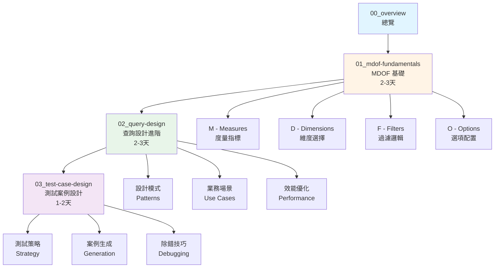
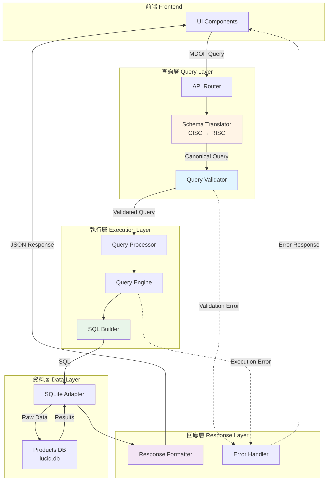
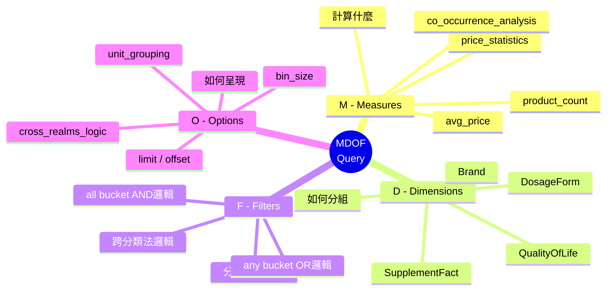
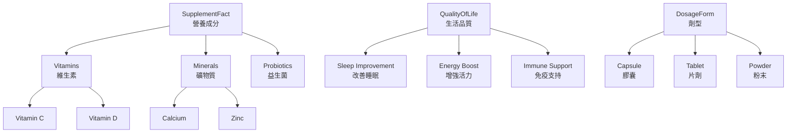
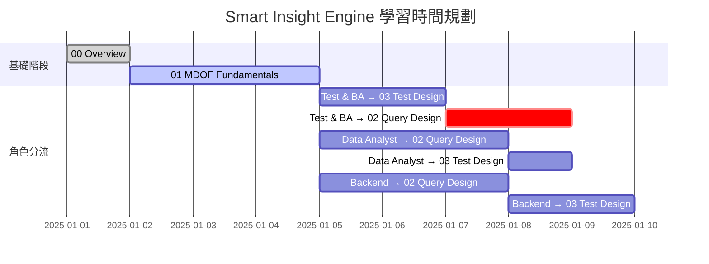

# Smart Insight Engine 學習總覽

**版本**: 1.0
**更新日期**: 2025-11-11
**適用角色**: Test & Business Analysis, Data Analyst, Backend Engineer
**前置知識**: General Learning Map 01-05 基礎階段

---

## 📚 學習目標

完成本系列學習後，你將能夠：

- ✅ 理解 Smart Insight Engine 的核心架構與設計理念
- ✅ 熟練使用 MDOF 查詢語言設計業務分析查詢
- ✅ 根據業務需求選擇合適的 Measure 和 Dimension 組合
- ✅ 設計完整的測試案例，涵蓋各種邊界情況
- ✅ 理解查詢優化與效能考量
- ✅ 獨立完成從需求分析到測試驗證的完整流程

---

## 🗺️ 學習地圖



---

## 📖 課程大綱

### **00_overview.md - Smart Insight Engine 總覽** (本文件)
> 學習階段：概覽 | 時間：1 小時

- SI Engine 是什麼？解決什麼問題？
- 系統架構概覽
- 核心概念速覽
- 學習路徑規劃

---

### **01_mdof-fundamentals.md - MDOF 查詢基礎** ⭐
> 學習階段：基礎 | 時間：2-3 天

#### 第一天：概念建立
- **1.1 MDOF 核心概念**
  - 什麼是 MDOF？
  - 為什麼需要查詢語言？
  - Query 的生命週期

- **1.2 M - Measures (度量指標)**
  - Measure 的作用與分類
  - CISC vs RISC 架構
  - 常用 Measure 速查表
  - Measure 選擇決策樹

#### 第二天：元素深入
- **1.3 D - Dimensions (維度)**
  - Dimension 的作用與類型
  - 分類法維度 vs 簡單欄位維度
  - 維度組合策略
  - 維度限制與特殊規則

- **1.4 F - Filters (過濾器)**
  - Filter 的兩層邏輯（any/all）
  - ANY vs ALL 的差異
  - 跨分類法邏輯（Cross-Realms）
  - Filter 設計模式

#### 第三天：實戰練習
- **1.5 O - Options (選項)**
  - 常用選項清單
  - 分頁與排序
  - 特殊選項（bin_size, unit_grouping）

- **1.6 MDOF 組合實戰**
  - 10 個經典業務場景範例
  - 常見錯誤與除錯技巧
  - 學習檢查清單

---

### **02_query-design.md - 查詢設計進階**
> 學習階段：進階 | 時間：2-3 天

- **2.1 查詢設計思維**
  - 從業務需求到 MDOF 查詢
  - 需求拆解技巧
  - 查詢複雜度評估

- **2.2 設計模式庫**
  - 單維度分析模式
  - 交叉分析模式
  - 時間序列分析模式
  - 漏斗分析模式

- **2.3 Filter-Dimension 互動**
  - Filter 與 Dimension 的關係
  - 四種互動模式（Pattern A/B/C/D）
  - 何時使用 dimension_inclusion

- **2.4 效能優化**
  - 查詢效能考量
  - 避免組合爆炸
  - SQL 執行計畫理解
  - 索引使用建議

- **2.5 業務場景實戰**
  - 市場分析場景
  - 產品組合分析
  - 價格策略分析
  - 成分共現分析

---

### **03_test-case-design.md - 測試案例設計**
> 學習階段：進階 | 時間：1-2 天

- **3.1 測試策略**
  - 測試金字塔
  - Simple vs Complex 測試
  - 測試覆蓋率目標

- **3.2 測試案例結構**
  - JSON Schema 規範
  - 必要欄位說明
  - 測試類型分類

- **3.3 測試案例設計技巧**
  - 等價類劃分
  - 邊界值分析
  - 組合測試策略
  - 錯誤案例設計

- **3.4 使用 Test Runner**
  - v3_test_case_runner.py 使用
  - 測試執行與報告
  - 批次測試管理

- **3.5 除錯技巧**
  - 使用 si_validate.py
  - 使用 si_query.py
  - 使用 si_debug_case.py
  - SQL 除錯技巧

---

## 🎯 什麼是 Smart Insight Engine？

### 核心定位

**Smart Insight Engine (SI Engine)** 是營養補充品領域的智慧查詢引擎，專門設計來回答業務分析問題。

### 解決的問題

**傳統方式的挑戰**：
```sql
-- 想回答「睡眠改善產品中最常見的成分」需要寫複雜 SQL
SELECT sf.name, COUNT(DISTINCT p.id) as product_count
FROM Products p
JOIN ProductSupplementFacts psf ON p.id = psf.product_id
JOIN SupplementFactTaxonomy sf ON psf.supplement_fact_id = sf.id
JOIN ProductQualityOfLife pq ON p.id = pq.product_id
JOIN QualityOfLifeTaxonomy qol ON pq.qol_id = qol.id
WHERE qol.name IN ('Sleep Improvement', 'Sleep Quality')
  AND sf.name NOT IN ('Calories', 'Total Fat', ...)  -- 排除巨量營養素
GROUP BY sf.id, sf.name
ORDER BY product_count DESC
LIMIT 20;
```

**SI Engine 方式**：
```json
{
  "measure": "supplement_fact_aggregation",
  "dimensions": [],
  "filters": {
    "any": {"QualityOfLife": ["Sleep Improvement"]},
    "all": {}
  },
  "options": {"limit": 20}
}
```

### 核心優勢

1. **宣告式查詢**：專注於「想要什麼」而非「如何做」
2. **領域專屬**：內建營養補充品業務邏輯
3. **一致性**：標準化的查詢格式與回應結構
4. **可驗證**：完整的 Schema 驗證與錯誤提示
5. **可測試**：規格驅動的測試框架

---

## 🏗️ 系統架構概覽

### 完整架構圖



### 關鍵組件說明

| 組件 | 職責 | 檔案位置 |
|------|------|---------|
| **Schema Translator** | CISC → RISC 轉換 | `api/schema_translator.py` |
| **Query Validator** | Schema 驗證 | `api/validator.py` |
| **Query Processor** | 查詢編排 | `core/query_processor.py` |
| **SQL Builder** | SQL 生成 | `core/shared/sql_builder.py` |
| **Response Formatter** | 回應格式化 | `api/response_formatter.py` |

---

## 🧩 核心概念速覽

### MDOF 四大元素



### CISC / RISC 架構

**設計理念**：
- **RISC (Reduced Instruction Set)**：基本操作，高度靈活
- **CISC (Complex Instruction Set)**：複雜操作，使用者友善

**轉換流程**：
```
User Query (CISC)
  ↓
Schema Translator (CISC → RISC + 注入邏輯)
  ↓
Validator (驗證 RISC)
  ↓
Engine (執行 RISC)
```

**範例**：
```json
// CISC: 使用者輸入
{"measure": "supplement_fact_aggregation", "dimensions": []}

// RISC: 引擎執行
{
  "measure": "product_count",
  "dimensions": ["SupplementFact"],
  "options": {"_post_processing": ["exclude_macronutrients"]}
}
```

### 分類法系統 (Taxonomy)

SI Engine 使用階層式分類法組織領域知識：



**關鍵分類法**：
- **SupplementFact**：營養成分（維生素、礦物質、益生菌等）
- **QualityOfLife**：生活品質效益（睡眠、活力、免疫等）
- **HealthEffects**：健康功效（心血管、骨骼、消化等）
- **DosageForm**：劑型（膠囊、片劑、粉末、液體等）
- **Certification**：認證（有機、非基改、素食等）

---

## 📊 學習路徑規劃

### 角色導向學習建議

#### **Test & Business Analysis 角色**

**重點學習順序**：
1. ✅ **01_mdof-fundamentals.md** (必修，3天)
   - 深入理解 MDOF 四大元素
   - 熟練 Filter 邏輯設計
   - 掌握常見業務場景

2. ✅ **03_test-case-design.md** (必修，2天)
   - 測試策略與案例設計
   - Test Runner 使用
   - 除錯工具鏈

3. ⭐ **02_query-design.md** (選修，依需求)
   - 進階設計模式
   - 效能優化考量

**能力檢核點**：
- [ ] 能獨立設計 MDOF 查詢回答業務問題
- [ ] 能設計完整測試案例（simple + complex）
- [ ] 能使用工具除錯查詢問題
- [ ] 能解讀 SQL 輸出與執行計畫

---

#### **Data Analyst 角色**

**重點學習順序**：
1. ✅ **01_mdof-fundamentals.md** (必修，3天)
2. ✅ **02_query-design.md** (必修，3天)
   - 重點：業務場景實戰
   - 重點：查詢設計思維
3. ⭐ **03_test-case-design.md** (選修)
   - 了解測試框架即可

**能力檢核點**：
- [ ] 能將業務需求轉換成 MDOF 查詢
- [ ] 能設計複雜的多維度分析
- [ ] 能優化查詢效能
- [ ] 能解讀與視覺化查詢結果

---

#### **Backend Engineer 角色**

**重點學習順序**：
1. ✅ **01_mdof-fundamentals.md** (必修，2天)
   - 快速了解 MDOF 語法
2. ✅ **02_query-design.md** (必修，3天)
   - 重點：系統架構
   - 重點：效能優化
   - 重點：SQL 生成邏輯
3. ✅ **03_test-case-design.md** (必修，2天)

**能力檢核點**：
- [ ] 理解 CISC/RISC 架構設計
- [ ] 理解查詢生命週期
- [ ] 能閱讀與優化 SQL
- [ ] 能擴展新 Measure/Dimension

---

### 學習時間規劃



---

## 🛠️ 學習資源

### 專案內文檔

| 文檔 | 說明 | 路徑 |
|------|------|------|
| **Canonical Query Schema** | 查詢結構規格（SSOT） | `spec/Canonical_Query_Schema.md` |
| **Measure Reference** | Measure 完整參考 | `spec/Measure_Reference.md` |
| **Dimension Registry** | Dimension 定義 | `config/dimension_registry.py` |
| **CISC Measures** | CISC 配置 | `config/cisc_measures.py` |
| **CLAUDE.md** | 開發指南 | `CLAUDE.md` |

### 工具與指令

```bash
# 驗證查詢結構
python tests/si_validate.py query.json

# 執行查詢並顯示 SQL
python tests/si_query.py query.json --show-sql

# 除錯特定測試案例
python tests/si_debug_case.py tests/testcase/measures/product_count.simple.json --case 0

# 執行所有 Measure 測試
python tests/v3_test_case_runner.py --all-measures

# 執行特定類別測試
python tests/v3_test_case_runner.py --category product_count
```

### 測試案例範例

- **Simple Tests**: `tests/testcase/measures/*.simple.json`
- **Complex Tests**: `tests/testcase/measures/*.complex.json`
- **Business Scenarios**: `tests/testcase/business_scenarios/*.json`

---

## ✅ 學習前的準備

### 前置知識檢查

開始學習前，請確認你已完成：

- [ ] General Learning Map 01-05 基礎階段
- [ ] 理解 JSON 格式與 JSON Schema
- [ ] 理解關聯式資料庫基本概念
- [ ] 熟悉 Git 版本控制
- [ ] 了解 API 基本概念

### 環境準備

```bash
# 1. Clone 專案
git clone <repo-url>
cd LuminNexus-PrismaVision-SmartInsightEngine

# 2. 設定環境變數
export SI_DB_TYPE=sqlite
export SI_DB_PATH=data/products_info.lucid.db
export PYTHONPATH=$PWD:$PYTHONPATH

# 3. 驗證環境
python -c "from smart_insight_engine import __version__; print(__version__)"

# 4. 執行範例查詢
python tests/si_query.py tests/testcase/measures/product_count.simple.json --case 0
```

---

## 🎓 學習建議

### 有效學習策略

1. **動手實作**：每個概念都要實際寫查詢驗證
2. **小步快跑**：從簡單範例開始，逐步增加複雜度
3. **對照文檔**：遇到問題先查 `spec/` 文檔
4. **使用工具**：善用 `si_validate.py` 和 `si_query.py`
5. **閱讀測試**：測試案例是最好的範例庫

### 避免的陷阱

❌ **跳過基礎直接寫複雜查詢**
→ 先熟悉單一元素，再組合

❌ **只看不做**
→ 每個範例都要實際執行

❌ **忽略錯誤訊息**
→ 錯誤訊息包含寶貴的學習資訊

❌ **不查文檔直接猜測**
→ Schema 規格是權威來源

---

## 📞 獲取幫助

### 內部資源

- **文檔問題**：查閱 `spec/` 目錄
- **範例查詢**：參考 `tests/testcase/` 目錄
- **工具使用**：執行 `python <tool>.py --help`

### 學習進度追蹤

建議建立個人學習筆記，記錄：
- ✅ 已完成的章節
- 🤔 不理解的概念
- 💡 實戰中的發現
- 🐛 遇到的問題與解決方法

---

## 🚀 開始學習

準備好了嗎？讓我們開始第一課：

👉 **[01_mdof-fundamentals.md - MDOF 查詢基礎](./01_mdof-fundamentals.md)**

---

**版本歷史**

| 版本 | 日期 | 變更內容 |
|------|------|---------|
| 1.0 | 2025-11-11 | 初始版本 |
