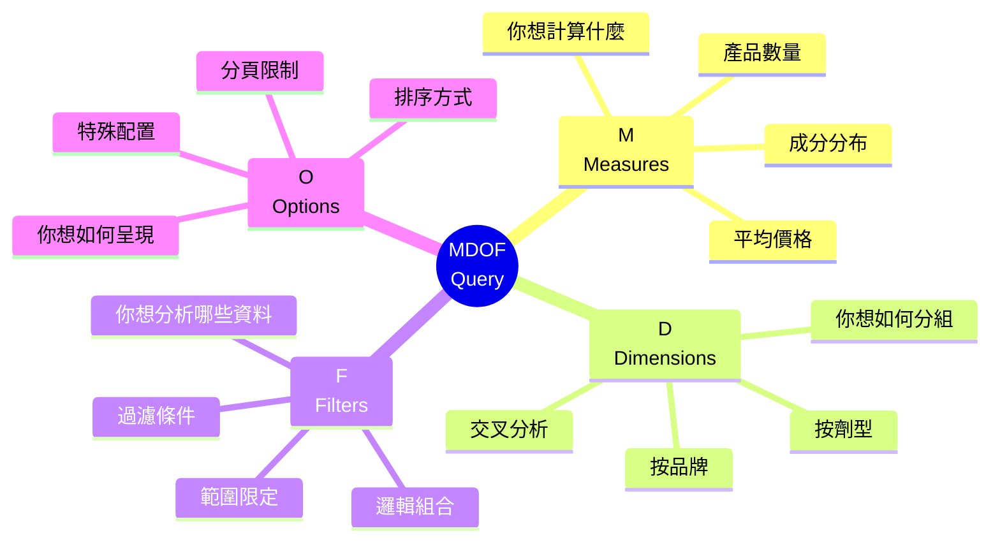
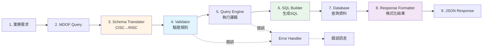
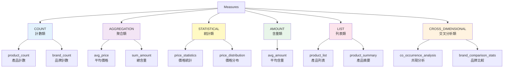
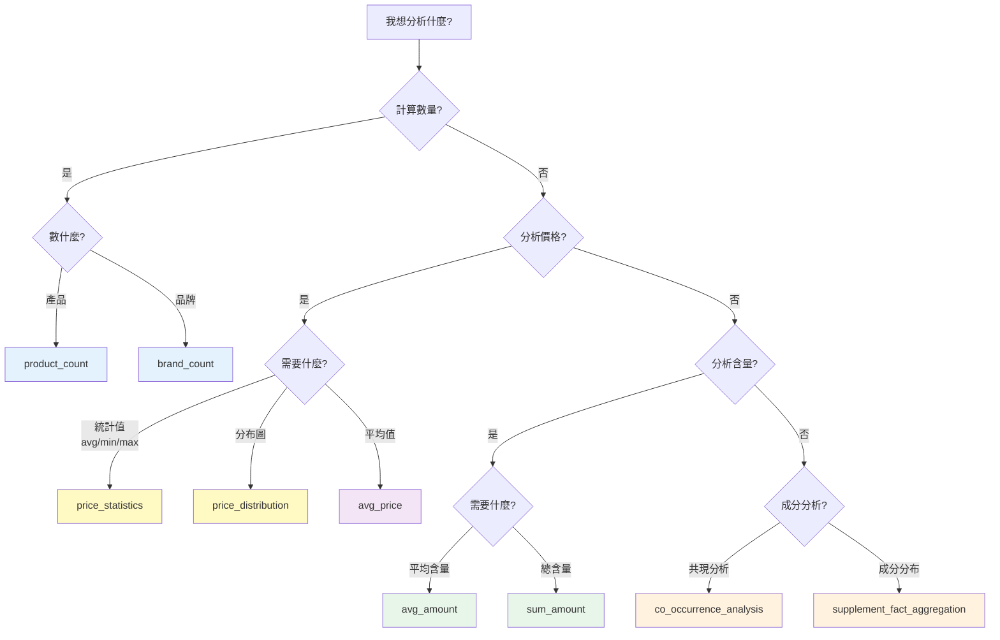
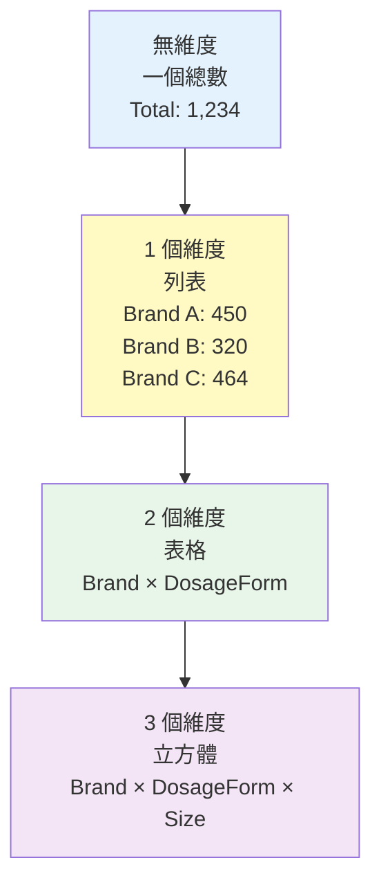
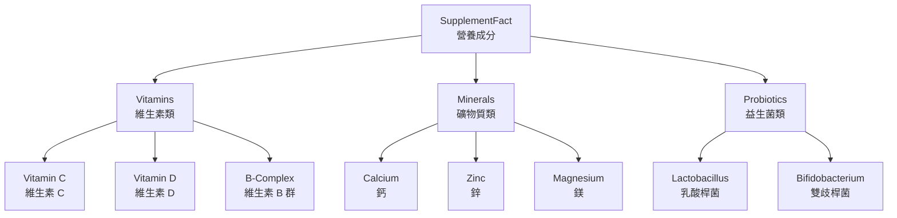
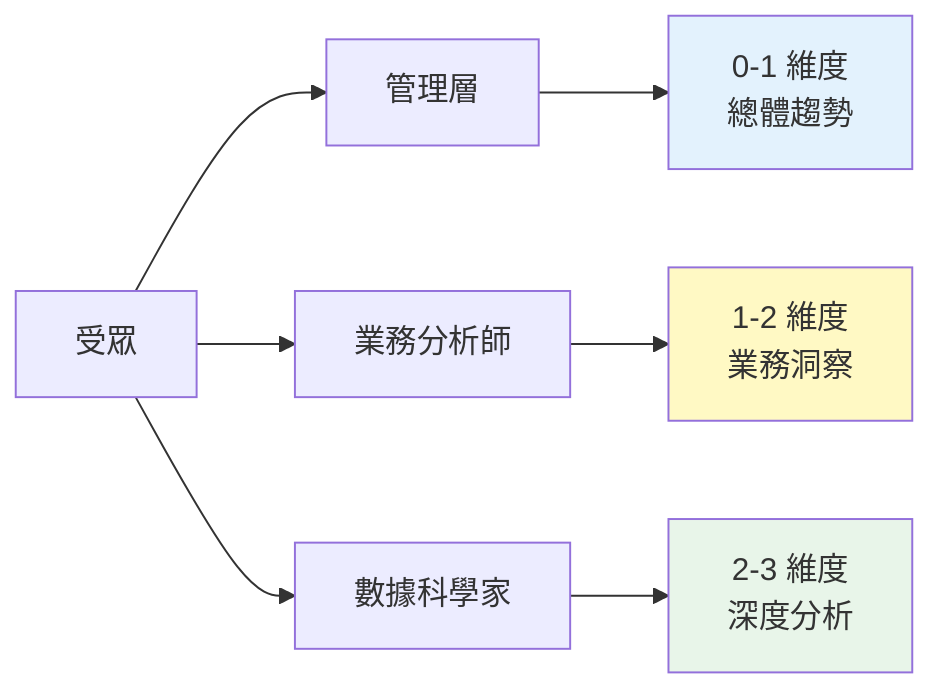

# MDOF 查詢基礎

---

## 📚 本章目標

完成本章學習後，你將能夠：

- ✅ 理解 MDOF 四大元素的用途與互動關係
- ✅ 熟練使用 Measures 選擇合適的計算指標
- ✅ 設計符合業務邏輯的 Dimensions 組合
- ✅ 撰寫正確的 Filters 過濾邏輯（any/all）
- ✅ 配置 Options 控制查詢行為
- ✅ 獨立完成常見業務場景的查詢設計
- ✅ 理解並解決常見的查詢錯誤

---

## 目錄

- [1. MDOF 核心概念](#1-mdof-核心概念)
- [2. M - Measures (度量指標)](#2-m---measures-度量指標)
- [3. D - Dimensions (維度)](#3-d---dimensions-維度)
- [4. F - Filters (過濾器)](#4-f---filters-過濾器)
- [5. O - Options (選項)](#5-o---options-選項)
- [6. MDOF 組合實戰](#6-mdof-組合實戰)
- [7. 常見錯誤與除錯](#7-常見錯誤與除錯)
- [8. 學習檢查清單](#8-學習檢查清單)

---

## 1. MDOF 核心概念

### 1.1 什麼是 MDOF？

**MDOF** 是 Smart Insight Engine 的查詢語言，由四個核心元素組成：



**四大提問框架**：

| 元素 | 核心提問 | 範例回答 |
|------|---------|---------|
| **M**easures | "我想**計算什麼**？" | "產品數量" / "平均價格" / "價格分布" |
| **D**imensions | "我想**如何分組**？" | "按品牌" / "按劑型" / "按品牌×劑型" |
| **F**ilters | "我想分析**哪些資料**？" | "只看維生素 C 產品" / "膠囊劑型" |
| **O**ptions | "我想**如何呈現**？" | "每頁 20 筆" / "按數量排序" |

### 1.2 為什麼需要 MDOF？

**傳統 SQL 的挑戰**：

```sql
-- 問題：「睡眠改善產品中，最常見的成分是什麼？」
-- SQL 需要：理解 JOIN、子查詢、聚合、排序...
SELECT
    sf.name,
    COUNT(DISTINCT p.id) as product_count
FROM Products p
JOIN ProductSupplementFacts psf ON p.id = psf.product_id
JOIN SupplementFactTaxonomy sf ON psf.supplement_fact_id = sf.id
JOIN ProductQualityOfLife pq ON p.id = pq.product_id
JOIN QualityOfLifeTaxonomy qol ON pq.qol_id = qol.id
WHERE qol.name IN ('Sleep Improvement', 'Sleep Quality')
  AND sf.name NOT IN ('Calories', 'Total Fat', 'Total Carbohydrate', ...)
GROUP BY sf.id, sf.name
ORDER BY product_count DESC
LIMIT 20;
```

**MDOF 的解決方案**：

```json
{
  "measure": "supplement_fact_aggregation",
  "dimensions": [],
  "filters": {
    "any": {"QualityOfLife": ["Sleep Improvement"]},
    "all": {}
  },
  "options": {"limit": 20}
}
```

**核心優勢**：

1. **宣告式語法**：說「想要什麼」而非「怎麼做」
2. **業務語言**：使用領域術語（SupplementFact, QualityOfLife）
3. **內建邏輯**：自動處理業務規則（如排除巨量營養素）
4. **結構驗證**：自動檢查查詢合法性
5. **可測試性**：標準格式便於測試

### 1.3 Query 的生命週期



**關鍵階段說明**：

| 階段 | 職責 | 輸出 |
|------|------|------|
| **1. 業務需求** | 理解問題 | "我想知道..." |
| **2. MDOF Query** | 轉換為查詢 | JSON 結構 |
| **3. Schema Translator** | CISC → RISC 轉換 | 標準查詢 |
| **4. Validator** | 驗證合法性 | 驗證報告 |
| **5. Query Engine** | 選擇執行引擎 | 執行計畫 |
| **6. SQL Builder** | 生成 SQL | SQL 語句 |
| **7. Database** | 查詢資料 | 原始結果 |
| **8. Response Formatter** | 格式化 | 結構化 JSON |
| **9. JSON Response** | 回傳客戶端 | 最終結果 |

### 1.4 MDOF 基本結構

**最小查詢範例**：

```json
{
  "measure": "product_count",
  "dimensions": [],
  "filters": {
    "any": {},
    "all": {}
  },
  "options": {}
}
```

**完整查詢範例**：

```json
{
  "measure": "price_statistics",
  "dimensions": ["Brand"],
  "filters": {
    "any": {
      "SupplementFact": ["Vitamin C"],
      "DosageForm": ["Capsule", "Tablet"]
    },
    "all": {
      "Certification": ["Organic"]
    }
  },
  "options": {
    "limit": 10,
    "offset": 0,
    "cross_realms_logic": "AND"
  }
}
```

**類比理解**：

想像你在問一個數據助理問題：

- **Measure**：「幫我**算一下**...」（計算什麼）
- **Dimensions**：「**按照**品牌分組」（如何呈現）
- **Filters**：「**只看**維生素 C 產品」（範圍限定）
- **Options**：「**只要前 10 筆**」（呈現細節）

---

## 2. M - Measures (度量指標)

### 2.1 Measure 核心概念

**Measure 回答的問題**：「我想**計算什麼**？」

**本質**：Measure 定義了如何「匯總」或「統計」資料

**類比**：
- 沒有 Measure = 看原始資料（一堆數字）
- 有 Measure = 看統計結果（有意義的數字）

### 2.2 Measure 分類



### 2.3 CISC vs RISC 架構 ⭐

**核心概念**：

- **RISC (Reduced Instruction Set)**：基本操作，高度靈活
- **CISC (Complex Instruction Set)**：複雜操作，自動注入邏輯

**類比理解**：

| 類比 | RISC | CISC |
|------|------|------|
| **計算機** | 基本運算 (+, -, ×, ÷) | 記憶功能 (M+, MR, MC) |
| **烹飪** | 基本食材（米、鹽、油） | 調味包（自動配好比例） |
| **樂高** | 基本積木（自由組合） | 預組模組（有固定用途） |

**RISC Measures**：

```json
// 例子：product_count
{
  "measure": "product_count",
  "dimensions": ["Brand"],  // 任意組合
  "filters": {
    "any": {"SupplementFact": ["Vitamin C"]},
    "all": {}
  }
}
```

特性：
- ✅ 高度靈活，可任意組合 Dimensions
- ✅ 直接執行，無轉換
- ❌ 需要明確指定所有邏輯

**CISC Measures**：

```json
// 例子：supplement_fact_aggregation
// 使用者只需提供空 dimensions
{
  "measure": "supplement_fact_aggregation",
  "dimensions": [],  // 會自動注入 SupplementFact
  "filters": {
    "any": {"QualityOfLife": ["Sleep Improvement"]},
    "all": {}
  }
}

// 實際轉換成 RISC
{
  "measure": "product_count",
  "dimensions": ["SupplementFact"],  // 自動注入
  "filters": {
    "any": {"QualityOfLife": ["Sleep Improvement"]},
    "all": {}
  },
  "options": {
    "_post_processing": ["exclude_macronutrients"]  // 自動排除巨量營養素
  }
}
```

特性：
- ✅ 使用者友善，自動處理邏輯
- ✅ 內建業務規則
- ❌ 維度限制較嚴格

### 2.4 常用 Measure 速查表

#### COUNT 類別

| Measure | 計算內容 | 維度要求 | 使用場景 |
|---------|---------|---------|---------|
| **product_count** | 產品數量 | 0-3 維 | 市場規模分析、品類分布 |
| **brand_count** | 品牌數量 | 0-3 維 | 競爭分析、市場集中度 |

**範例**：

```json
// 各品牌的維生素 C 產品數量
{
  "measure": "product_count",
  "dimensions": ["Brand"],
  "filters": {
    "any": {"SupplementFact": ["Vitamin C"]},
    "all": {}
  }
}
```

#### AGGREGATION 類別

| Measure | 計算內容 | 維度要求 | 使用場景 |
|---------|---------|---------|---------|
| **avg_price** | 平均價格 | 0-3 維 | 定價策略、價格比較 |

**範例**：

```json
// 各劑型的平均價格
{
  "measure": "avg_price",
  "dimensions": ["DosageForm"],
  "filters": {"any": {}, "all": {}}
}
```

#### STATISTICAL 類別

| Measure | 計算內容 | 維度要求 | 使用場景 |
|---------|---------|---------|---------|
| **price_statistics** | 平均/最小/最大價格 | 0-3 維 | 價格分析、定價參考 |
| **price_distribution** | 價格分布直方圖 | 0 維 | 市場價格帶分析 |

**範例**：

```json
// 各品牌的價格統計
{
  "measure": "price_statistics",
  "dimensions": ["Brand"],
  "filters": {
    "any": {"SupplementFact": ["Probiotic"]},
    "all": {}
  },
  "options": {"limit": 10}
}

// 輸出：
// {
//   "dimensions": [{"name": "Brand", "value": "Nature Made"}],
//   "measure_value": {
//     "avg": 24.99,
//     "min": 12.99,
//     "max": 49.99,
//     "product_count": 15
//   }
// }
```

```json
// 價格分布（10 美元為一個區間）
{
  "measure": "price_distribution",
  "dimensions": [],
  "filters": {
    "any": {"SupplementFact": ["Omega-3"]},
    "all": {}
  },
  "options": {"bin_size": 10.0}
}

// 輸出：
// {
//   "data": [
//     {"bin_start": 0, "bin_end": 10, "product_count": 45},
//     {"bin_start": 10, "bin_end": 20, "product_count": 128},
//     {"bin_start": 20, "bin_end": 30, "product_count": 87}
//   ]
// }
```

#### AMOUNT 類別

| Measure | 計算內容 | 維度要求 | 使用場景 |
|---------|---------|---------|---------|
| **avg_amount** | 平均含量 | 0-2 維 | 成分劑量分析、配方設計 |
| **sum_amount** | 總含量 | 0-2 維 | 總量統計 |

**特殊規則**：
- 會自動注入 `SupplementFact` 維度
- 使用者最多只能提供 1 個額外維度
- 支援 `unit_grouping` 選項控制單位處理

**範例**：

```json
// 益生菌產品的平均含量（mixed 模式：按單位類別分組）
{
  "measure": "avg_amount",
  "dimensions": [],  // 會自動加上 SupplementFact
  "filters": {
    "any": {"SupplementFact": ["Probiotic"]},
    "all": {}
  },
  "options": {"unit_grouping": "mixed"}
}

// 輸出：
// {
//   "data": [
//     {
//       "dimensions": [{"name": "SupplementFact", "value": "Probiotic (Billion CFU)"}],
//       "measure_value": 21.27,
//       "product_count": 539,
//       "standardized_unit": "Billion CFU"
//     },
//     {
//       "dimensions": [{"name": "SupplementFact", "value": "Probiotic (mg)"}],
//       "measure_value": 247.04,
//       "product_count": 132,
//       "standardized_unit": "mg"
//     }
//   ]
// }
```

#### CROSS_DIMENSIONAL 類別 (CISC)

| Measure | 計算內容 | 維度要求 | 使用場景 |
|---------|---------|---------|---------|
| **co_occurrence_analysis** | 成分共現分析 | 必須 [] | 配方設計、成分組合分析 |
| **supplement_fact_aggregation** | 成分聚合統計 | 必須 [] | 成分分布、熱門成分 |

**範例**：

```json
// 維生素 C 產品中常見的其他成分
{
  "measure": "co_occurrence_analysis",
  "dimensions": [],  // 必須為空
  "filters": {
    "any": {"SupplementFact": ["Vitamin C"]},
    "all": {}
  },
  "options": {"limit": 20}
}
```

### 2.5 Measure 選擇決策樹



### 2.6 Measure 使用建議

**選擇原則**：

1. **優先使用 CISC**：如果有符合需求的 CISC measure，優先使用
   - 例：成分分析 → 使用 `co_occurrence_analysis`
   - 而非手動用 `product_count` + `dimensions: ["SupplementFact"]`

2. **注意維度限制**：某些 measure 有嚴格限制
   - `co_occurrence_analysis`: 必須 `dimensions: []`
   - `avg_amount`: 最多 2 維（含自動注入的 SupplementFact）

3. **統計類優先**：如果需要多個統計值，用統計 measure
   - ✅ `price_statistics` 一次拿到 avg/min/max
   - ❌ 分別用 `avg_price`, `price_min`, `price_max`

4. **考慮效能**：簡單 measure 通常更快
   - `product_count` > `product_summary`

---

## 3. D - Dimensions (維度)

### 3.1 Dimension 核心概念

**Dimension 回答的問題**：「我想**如何分組**？」

**本質**：Dimension 定義了資料的「切面」或「視角」

**視覺化理解**：



**類比**：

| 維度數 | 類比 | 資料結構 |
|--------|------|---------|
| **0 維** | 一個數字 | 1,234 |
| **1 維** | 列表 | [450, 320, 464] |
| **2 維** | Excel 表格 | 行 × 列 |
| **3 維** | 立方體 | 長 × 寬 × 高 |

### 3.2 Dimension 類型

#### 分類法維度 (Taxonomy Dimensions)

**特性**：階層式結構，支援父子關係



**常見分類法維度**：

| Dimension | 說明 | 範例值 |
|-----------|------|--------|
| **SupplementFact** | 營養成分 | Vitamin C, Calcium, Probiotic |
| **QualityOfLife** | 生活品質效益 | Sleep Improvement, Energy Boost |
| **HealthEffects** | 健康功效 | Cardiovascular Health, Bone Health |
| **DosageForm** | 劑型 | Capsule, Tablet, Powder, Liquid |
| **Certification** | 認證 | Organic, Non-GMO, Vegan |

#### 簡單欄位維度 (Simple Field Dimensions)

**特性**：扁平結構，無階層關係

| Dimension | 說明 | 範例值 |
|-----------|------|--------|
| **Brand** | 品牌 | Nature Made, NOW Foods, Garden of Life |

### 3.3 維度選擇策略

#### 策略 1：根據受眾選擇維度數量



**範例**：

```json
// 管理層報告：總體數字
{
  "measure": "product_count",
  "dimensions": [],  // 0 維
  "filters": {"any": {"SupplementFact": ["Probiotic"]}, "all": {}}
}
// 結果：1,234

// 業務分析：按品牌分布
{
  "measure": "product_count",
  "dimensions": ["Brand"],  // 1 維
  "filters": {"any": {"SupplementFact": ["Probiotic"]}, "all": {}}
}
// 結果：
// Garden of Life: 87
// NOW Foods: 64
// Nature Made: 52

// 深度分析：品牌 × 劑型
{
  "measure": "product_count",
  "dimensions": ["Brand", "DosageForm"],  // 2 維
  "filters": {"any": {"SupplementFact": ["Probiotic"]}, "all": {}}
}
// 結果：
// Garden of Life × Capsule: 45
// Garden of Life × Powder: 42
// NOW Foods × Capsule: 38
```

#### 策略 2：根據分析目的選擇維度

**比較分析**：

```json
// 我想比較「各品牌」的表現
{
  "measure": "price_statistics",
  "dimensions": ["Brand"],
  "filters": {"any": {"SupplementFact": ["Omega-3"]}, "all": {}}
}
```

**交叉分析**：

```json
// 我想了解「品牌 × 劑型」的組合
{
  "measure": "product_count",
  "dimensions": ["Brand", "DosageForm"],
  "filters": {"any": {"SupplementFact": ["Vitamin D"]}, "all": {}}
}
```

**細分分析**：

```json
// 我想按「成分」細分
{
  "measure": "avg_price",
  "dimensions": ["SupplementFact"],
  "filters": {"any": {"QualityOfLife": ["Immune Support"]}, "all": {}}
}
```

#### 策略 3：根據資料量選擇維度

**組合爆炸警示**：

```
1 維度（Brand）：        ~100 個結果
2 維度（Brand × Form）：  ~500 個結果
3 維度（Brand × Form × Cert）： ~2,000 個結果
```

**建議**：
- 資料量小（< 1,000 產品）：可用 2-3 維
- 資料量中（1,000-10,000）：建議 1-2 維
- 資料量大（> 10,000）：建議 0-1 維

### 3.4 維度限制與特殊規則

#### 通用限制

- 最多 **3 個維度**（系統硬限制）
- 某些 Measure 有更嚴格限制

#### Measure 專屬限制

| Measure | 維度限制 | 說明 |
|---------|---------|------|
| `co_occurrence_analysis` | 必須 `[]` | 會自動注入 SupplementFact |
| `supplement_fact_aggregation` | 必須 `[]` | 會自動注入 SupplementFact |
| `price_distribution` | 必須 `[]` | 分布圖不支援維度 |
| `avg_amount` | 最多 2 維 | SupplementFact 自動注入，使用者只能提供 0-1 維 |
| `sum_amount` | 最多 2 維 | 同 avg_amount |

**範例：錯誤案例**

```json
// ❌ 錯誤：co_occurrence_analysis 不能有維度
{
  "measure": "co_occurrence_analysis",
  "dimensions": ["Brand"],  // 錯誤！
  "filters": {"any": {"SupplementFact": ["Vitamin C"]}, "all": {}}
}

// 錯誤訊息：
// "VALIDATION_ERROR: co_occurrence_analysis requires dimensions=[]"

// ✅ 正確
{
  "measure": "co_occurrence_analysis",
  "dimensions": [],  // 正確
  "filters": {"any": {"SupplementFact": ["Vitamin C"]}, "all": {}}
}
```

```json
// ❌ 錯誤：avg_amount 維度過多
{
  "measure": "avg_amount",
  "dimensions": ["Brand", "DosageForm"],  // 加上自動注入的 SupplementFact = 3 維
  "filters": {"any": {"SupplementFact": ["Calcium"]}, "all": {}}
}

// 錯誤訊息：
// "Measure 'avg_amount' supports max 1 additional dimension(s).
//  Provided 2 dimension(s): ['Brand', 'DosageForm'].
//  After adding required dimensions ['SupplementFact'], total would be 3 (exceeds limit)."

// ✅ 正確
{
  "measure": "avg_amount",
  "dimensions": ["Brand"],  // 加上 SupplementFact = 2 維
  "filters": {"any": {"SupplementFact": ["Calcium"]}, "all": {}}
}
```

### 3.5 維度使用技巧

**技巧 1：先單維度，再增加**

```json
// Step 1: 先看總體
{"measure": "product_count", "dimensions": []}

// Step 2: 再按品牌
{"measure": "product_count", "dimensions": ["Brand"]}

// Step 3: 最後交叉分析
{"measure": "product_count", "dimensions": ["Brand", "DosageForm"]}
```

**技巧 2：選擇有意義的維度**

```json
// ❌ 不建議：Brand × Brand（重複無意義）
{"dimensions": ["Brand", "Brand"]}

// ✅ 建議：Brand × DosageForm（有意義的交叉）
{"dimensions": ["Brand", "DosageForm"]}
```

**技巧 3：使用 limit 控制結果數量**

```json
{
  "measure": "product_count",
  "dimensions": ["Brand", "DosageForm"],
  "filters": {"any": {}, "all": {}},
  "options": {
    "limit": 50  // 只取前 50 筆，避免結果過多
  }
}
```

---

## 4. F - Filters (過濾器)

### 4.1 Filter 核心概念

**Filter 回答的問題**：「我想分析**哪些資料**？」

**本質**：Filter 定義了資料的「範圍」或「邊界」

**結構**：

```json
{
  "filters": {
    "any": {},  // OR 邏輯（符合任一條件）
    "all": {}   // AND 邏輯（必須符合所有條件）
  }
}
```

**類比理解**：

| 元素 | 類比 | 說明 |
|------|------|------|
| **any** | 購物車「或」條件 | "買蘋果或香蕉都可以" |
| **all** | 購物清單「且」條件 | "必須買麵包和牛奶" |

### 4.2 ANY Bucket - OR 邏輯

**語義**：符合**任一**條件即可

**單一分類法**：

```json
{
  "filters": {
    "any": {
      "SupplementFact": ["Vitamin C", "Vitamin D"]
    },
    "all": {}
  }
}
```

**意義**：產品含有 **Vitamin C** 或 **Vitamin D**（或兩者都有）

**SQL 等價**：

```sql
WHERE supplement_fact IN ('Vitamin C', 'Vitamin D')
-- 或更準確地說：
WHERE product_id IN (
  SELECT product_id WHERE supplement_fact = 'Vitamin C'
  UNION
  SELECT product_id WHERE supplement_fact = 'Vitamin D'
)
```

**多分類法 + cross_realms_logic**：

```json
{
  "filters": {
    "any": {
      "SupplementFact": ["Calcium"],
      "DosageForm": ["Capsule", "Tablet"]
    },
    "all": {}
  },
  "options": {
    "cross_realms_logic": "AND"  // 預設
  }
}
```

**意義**：
- `"AND"` 模式：含有 **Calcium** **且** 劑型是 **Capsule 或 Tablet**
- `"OR"` 模式：含有 **Calcium** **或** 劑型是 **Capsule/Tablet**

### 4.3 ALL Bucket - AND 邏輯

**語義**：必須符合**所有**條件

**範例**：

```json
{
  "filters": {
    "any": {},
    "all": {
      "SupplementFact": ["Vitamin C", "Zinc"]
    }
  }
}
```

**意義**：產品**同時**含有 Vitamin C **和** Zinc

**SQL 等價**：

```sql
WHERE product_id IN (
  SELECT product_id WHERE supplement_fact = 'Vitamin C'
)
AND product_id IN (
  SELECT product_id WHERE supplement_fact = 'Zinc'
)
```

**重要差異**：

| Bucket | 邏輯 | 範例 | 意義 |
|--------|------|------|------|
| **any** | OR | `["Vitamin C", "Vitamin D"]` | 含 C **或** D |
| **all** | AND | `["Vitamin C", "Vitamin D"]` | **同時**含 C **和** D |

### 4.4 ANY + ALL 組合

**範例 1：複合條件**

```json
{
  "filters": {
    "any": {
      "DosageForm": ["Capsule", "Tablet"]
    },
    "all": {
      "SupplementFact": ["Vitamin C", "Zinc"],
      "Certification": ["Organic"]
    }
  },
  "options": {"cross_realms_logic": "AND"}
}
```

**意義**：
1. 劑型是 Capsule **或** Tablet
2. **且**同時含有 Vitamin C **和** Zinc
3. **且**有 Organic 認證

**SQL 語義**：

```sql
WHERE
  dosage_form IN ('Capsule', 'Tablet')  -- any bucket
  AND product_id IN (SELECT ... Vitamin C)  -- all bucket
  AND product_id IN (SELECT ... Zinc)       -- all bucket
  AND product_id IN (SELECT ... Organic)    -- all bucket
```

### 4.5 Cross-Realms Logic (跨分類法邏輯)

**問題場景**：

```json
{
  "filters": {
    "any": {
      "SupplementFact": ["Calcium"],
      "DosageForm": ["Capsule"]
    },
    "all": {}
  }
}
```

**兩種解讀**：
1. 含 Calcium **且** 是 Capsule（交集）
2. 含 Calcium **或** 是 Capsule（聯集）

**解決方案**：`cross_realms_logic` 選項

```json
{
  "filters": {
    "any": {
      "SupplementFact": ["Calcium"],
      "DosageForm": ["Capsule"]
    },
    "all": {}
  },
  "options": {
    "cross_realms_logic": "AND"  // 或 "OR"
  }
}
```

**模式對比**：

| 模式 | 意義 | 結果集大小 |
|------|------|-----------|
| `"AND"` | Calcium **且** Capsule | 較小（交集） |
| `"OR"` | Calcium **或** Capsule | 較大（聯集） |

**預設行為**：`"AND"` （更常見的業務需求）

### 4.6 Filter 設計模式

**Pattern 1：單一分類法 OR**

```json
// 「維生素 C 或 D 的產品」
{
  "filters": {
    "any": {"SupplementFact": ["Vitamin C", "Vitamin D"]},
    "all": {}
  }
}
```

**Pattern 2：單一分類法 AND**

```json
// 「同時含有維生素 C 和鋅的產品」
{
  "filters": {
    "any": {},
    "all": {"SupplementFact": ["Vitamin C", "Zinc"]}
  }
}
```

**Pattern 3：多分類法 AND（交集）**

```json
// 「膠囊劑型的益生菌產品」
{
  "filters": {
    "any": {
      "SupplementFact": ["Probiotic"],
      "DosageForm": ["Capsule"]
    },
    "all": {}
  },
  "options": {"cross_realms_logic": "AND"}
}
```

**Pattern 4：多分類法 OR（聯集）**

```json
// 「含鈣的產品，或者是有機認證的產品」
{
  "filters": {
    "any": {
      "SupplementFact": ["Calcium"],
      "Certification": ["Organic"]
    },
    "all": {}
  },
  "options": {"cross_realms_logic": "OR"}
}
```

**Pattern 5：複合條件（ANY + ALL）**

```json
// 「膠囊或片劑，且同時含維生素C和鋅」
{
  "filters": {
    "any": {
      "DosageForm": ["Capsule", "Tablet"]
    },
    "all": {
      "SupplementFact": ["Vitamin C", "Zinc"]
    }
  },
  "options": {"cross_realms_logic": "AND"}
}
```

### 4.7 父節點語義（階層式 Filter）

**階層結構範例**：

```
SupplementFact
├── Vitamins (父節點)
│   ├── Vitamin C (子節點)
│   └── Vitamin D (子節點)
└── Minerals (父節點)
    ├── Calcium (子節點)
    └── Zinc (子節點)
```

**父節點在 ANY bucket**：

```json
{
  "filters": {
    "any": {"SupplementFact": ["Vitamins"]},  // 父節點
    "all": {}
  }
}
```

**意義**：含有 **Vitamins 或其任一子節點**（Vitamin C, Vitamin D, ...）

**等價於**：

```json
{
  "filters": {
    "any": {"SupplementFact": ["Vitamin C", "Vitamin D", "Vitamin A", ...]},
    "all": {}
  }
}
```

**父節點在 ALL bucket**：

```json
{
  "filters": {
    "any": {},
    "all": {"SupplementFact": ["Vitamins"]}  // 父節點
  }
}
```

**意義**：含有 **Vitamins 或其任一子節點**（與 ANY 相同！）

**重要**：單一父節點在 ALL bucket 等價於在 ANY bucket

### 4.8 Filter 使用技巧

**技巧 1：優先使用 ANY bucket**

```json
// ✅ 簡潔清晰
{
  "filters": {
    "any": {"SupplementFact": ["Vitamin C"]},
    "all": {}
  }
}

// ❌ 不必要的 ALL bucket
{
  "filters": {
    "any": {},
    "all": {"SupplementFact": ["Vitamin C"]}  // 單一值用 ANY 即可
  }
}
```

**技巧 2：避免父子重複**

```json
// ❌ 冗餘：Vitamins 已包含 Vitamin C
{
  "filters": {
    "any": {"SupplementFact": ["Vitamins", "Vitamin C"]},
    "all": {}
  }
}
// 系統會警告：REDUNDANT_FILTER_HIERARCHY

// ✅ 正確：只用父節點
{
  "filters": {
    "any": {"SupplementFact": ["Vitamins"]},
    "all": {}
  }
}

// ✅ 或只用子節點
{
  "filters": {
    "any": {"SupplementFact": ["Vitamin C", "Vitamin D"]},
    "all": {}
  }
}
```

**技巧 3：合理使用 cross_realms_logic**

```json
// 業務需求：「鈣質補充品，且是膠囊劑型」
{
  "filters": {
    "any": {
      "SupplementFact": ["Calcium"],
      "DosageForm": ["Capsule"]
    },
    "all": {}
  },
  "options": {"cross_realms_logic": "AND"}  // 明確指定 AND
}
```

---

## 5. O - Options (選項)

### 5.1 Options 核心概念

**Options 回答的問題**：「我想**如何呈現**？」

**本質**：Options 控制查詢的「執行細節」和「結果格式」

### 5.2 常用選項清單

#### 分頁選項

| 選項 | 類型 | 說明 | 預設值 | 範例 |
|------|------|------|--------|------|
| `limit` | `int` | 返回結果數量上限 | 無限制 | `10`, `20`, `100` |
| `offset` | `int` | 跳過前 N 筆結果 | `0` | `0`, `20`, `40` |

**範例**：

```json
{
  "measure": "product_count",
  "dimensions": ["Brand"],
  "filters": {"any": {}, "all": {}},
  "options": {
    "limit": 20,   // 每頁 20 筆
    "offset": 40   // 跳過前 40 筆（第 3 頁）
  }
}
```

#### 邏輯選項

| 選項 | 類型 | 說明 | 預設值 | 可選值 |
|------|------|------|--------|--------|
| `cross_realms_logic` | `string` | 跨分類法邏輯 | `"AND"` | `"AND"`, `"OR"` |

**範例**：

```json
{
  "measure": "product_count",
  "dimensions": [],
  "filters": {
    "any": {
      "SupplementFact": ["Calcium"],
      "DosageForm": ["Capsule"]
    },
    "all": {}
  },
  "options": {
    "cross_realms_logic": "OR"  // Calcium 或 Capsule
  }
}
```

#### Measure 專屬選項

| 選項 | 適用 Measure | 類型 | 說明 | 範例 |
|------|-------------|------|------|------|
| `bin_size` | `price_distribution` | `float` | 價格分布的區間大小 | `10.0`, `5.0` |
| `unit_grouping` | `avg_amount`, `sum_amount` | `string` | 單位分組模式 | `"mixed"`, `"split"` |

**範例 - bin_size**：

```json
{
  "measure": "price_distribution",
  "dimensions": [],
  "filters": {
    "any": {"SupplementFact": ["Omega-3"]},
    "all": {}
  },
  "options": {
    "bin_size": 10.0  // 每 10 美元一個區間
  }
}

// 結果：
// [0-10): 45 products
// [10-20): 128 products
// [20-30): 87 products
```

**範例 - unit_grouping**：

```json
{
  "measure": "avg_amount",
  "dimensions": [],
  "filters": {
    "any": {"SupplementFact": ["Probiotic"]},
    "all": {}
  },
  "options": {
    "unit_grouping": "mixed"  // 按單位類別分組（Billion CFU, mg, ...）
  }
}
```

### 5.3 Options 使用建議

**建議 1：永遠設定 limit**

```json
// ✅ 好習慣：設定 limit
{
  "measure": "product_count",
  "dimensions": ["Brand"],
  "filters": {"any": {}, "all": {}},
  "options": {"limit": 100}
}

// ❌ 風險：無 limit（可能返回數千筆）
{
  "measure": "product_count",
  "dimensions": ["Brand"],
  "filters": {"any": {}, "all": {}},
  "options": {}
}
```

**建議 2：明確指定 cross_realms_logic**

```json
// ✅ 明確：不依賴預設值
{
  "filters": {
    "any": {
      "SupplementFact": ["Calcium"],
      "DosageForm": ["Capsule"]
    },
    "all": {}
  },
  "options": {
    "cross_realms_logic": "AND"  // 明確指定
  }
}
```

**建議 3：針對 Measure 使用專屬選項**

```json
// price_distribution 必須有 bin_size
{
  "measure": "price_distribution",
  "dimensions": [],
  "filters": {"any": {}, "all": {}},
  "options": {
    "bin_size": 10.0  // 必要
  }
}

// avg_amount 建議設定 unit_grouping
{
  "measure": "avg_amount",
  "dimensions": [],
  "filters": {"any": {"SupplementFact": ["Vitamin D"]}, "all": {}},
  "options": {
    "unit_grouping": "mixed"  // 建議明確指定
  }
}
```

---

## 6. MDOF 組合實戰

### 6.1 業務場景範例

#### 場景 1：市場規模分析

**需求**：「維生素 C 市場有多少產品？各品牌佔比如何？」

**查詢**：

```json
{
  "measure": "product_count",
  "dimensions": ["Brand"],
  "filters": {
    "any": {"SupplementFact": ["Vitamin C"]},
    "all": {}
  },
  "options": {"limit": 10}
}
```

**結果解讀**：
```
Nature Made:     87 (23.4%)
NOW Foods:       64 (17.2%)
Garden of Life:  52 (14.0%)
...
Total: 372 products
```

#### 場景 2：價格策略分析

**需求**：「益生菌產品的價格分布如何？」

**查詢**：

```json
{
  "measure": "price_distribution",
  "dimensions": [],
  "filters": {
    "any": {"SupplementFact": ["Probiotic"]},
    "all": {}
  },
  "options": {"bin_size": 10.0}
}
```

**結果解讀**：
```
$0-10:    45 products (低價區)
$10-20:   128 products (主力價格帶)
$20-30:   87 products
$30-40:   42 products (高價區)
```

**業務洞察**：主力價格帶在 $10-20，可以此為定價參考

#### 場景 3：成分共現分析

**需求**：「維生素 C 產品通常還會添加什麼成分？」

**查詢**：

```json
{
  "measure": "co_occurrence_analysis",
  "dimensions": [],
  "filters": {
    "any": {"SupplementFact": ["Vitamin C"]},
    "all": {}
  },
  "options": {"limit": 20}
}
```

**結果解讀**：
```
Vitamin C:       372 (100% - 基準)
Zinc:            156 (41.9% - 常見組合)
Vitamin D:       134 (36.0%)
Echinacea:       89 (23.9%)
```

**業務洞察**：Zinc 和 Vitamin D 是最常見的配方組合

#### 場景 4：劑型偏好分析

**需求**：「睡眠改善產品，各劑型的平均價格？」

**查詢**：

```json
{
  "measure": "price_statistics",
  "dimensions": ["DosageForm"],
  "filters": {
    "any": {"QualityOfLife": ["Sleep Improvement"]},
    "all": {}
  },
  "options": {"limit": 10}
}
```

**結果解讀**：
```
Capsule:  avg=$24.99, min=$9.99, max=$49.99, count=124
Tablet:   avg=$18.49, min=$7.99, max=$39.99, count=87
Gummy:    avg=$21.99, min=$12.99, max=$35.99, count=56
Liquid:   avg=$32.49, min=$19.99, max=$59.99, count=34
```

**業務洞察**：
- Liquid 最貴（平均 $32.49）
- Tablet 最便宜（平均 $18.49）
- Capsule 是主流（124 products）

#### 場景 5：高階複合分析

**需求**：「有機認證的膠囊益生菌，各品牌的價格和數量？」

**查詢**：

```json
{
  "measure": "price_statistics",
  "dimensions": ["Brand"],
  "filters": {
    "any": {
      "SupplementFact": ["Probiotic"],
      "DosageForm": ["Capsule"],
      "Certification": ["Organic"]
    },
    "all": {}
  },
  "options": {
    "cross_realms_logic": "AND",
    "limit": 10
  }
}
```

**結果解讀**：
```
Garden of Life:  avg=$38.99, count=23 (高價精品路線)
NOW Foods:       avg=$24.99, count=18 (平價主流)
Nature Made:     avg=$29.99, count=12
```

#### 場景 6：成分劑量分析

**需求**：「鈣補充品的平均含量是多少？」

**查詢**：

```json
{
  "measure": "avg_amount",
  "dimensions": [],
  "filters": {
    "any": {"SupplementFact": ["Calcium"]},
    "all": {}
  },
  "options": {"unit_grouping": "mixed"}
}
```

**結果解讀**：
```
Calcium (mg): 687.5 mg, 234 products
```

**業務洞察**：市場平均劑量約 700mg，可作為配方參考

#### 場景 7：品牌競爭分析

**需求**：「Omega-3 市場，前 5 大品牌的產品數和平均價格？」

**查詢**：

```json
{
  "measure": "price_statistics",
  "dimensions": ["Brand"],
  "filters": {
    "any": {"SupplementFact": ["Omega-3"]},
    "all": {}
  },
  "options": {"limit": 5}
}
```

**結果解讀**：
```
Nordic Naturals:  avg=$35.99, count=42 (高價領導者)
NOW Foods:        avg=$19.99, count=38 (平價領導者)
Nature Made:      avg=$24.99, count=34
Carlson:          avg=$32.49, count=28
Garden of Life:   avg=$29.99, count=24
```

#### 場景 8：劑型 × 品牌交叉分析

**需求**：「維生素 D 產品，各品牌在不同劑型的分布？」

**查詢**：

```json
{
  "measure": "product_count",
  "dimensions": ["Brand", "DosageForm"],
  "filters": {
    "any": {"SupplementFact": ["Vitamin D"]},
    "all": {}
  },
  "options": {"limit": 30}
}
```

**結果解讀**：
```
Nature Made × Capsule:   18
Nature Made × Tablet:    12
NOW Foods × Capsule:     15
NOW Foods × Powder:      8
Garden of Life × Capsule: 14
Garden of Life × Liquid:  6
```

#### 場景 9：認證產品分析

**需求**：「素食認證的益生菌產品有哪些品牌？」

**查詢**：

```json
{
  "measure": "product_count",
  "dimensions": ["Brand"],
  "filters": {
    "any": {
      "SupplementFact": ["Probiotic"],
      "Certification": ["Vegan"]
    },
    "all": {}
  },
  "options": {
    "cross_realms_logic": "AND",
    "limit": 10
  }
}
```

#### 場景 10：多成分組合分析

**需求**：「同時含有鈣和維生素 D 的產品，各劑型分布？」

**查詢**：

```json
{
  "measure": "product_count",
  "dimensions": ["DosageForm"],
  "filters": {
    "any": {},
    "all": {
      "SupplementFact": ["Calcium", "Vitamin D"]
    }
  },
  "options": {"limit": 10}
}
```

**結果解讀**：
```
Tablet:  87 (主流組合)
Capsule: 64
Gummy:   23
Liquid:  12
```

**業務洞察**：鈣+維D 組合主要以 Tablet 形式存在

### 6.2 查詢設計檢查清單

在提交查詢前，檢查以下項目：

- [ ] **Measure 選擇正確**：符合業務需求
- [ ] **Dimensions 數量合理**：不超過限制，不會組合爆炸
- [ ] **Filters 邏輯清楚**：any/all 使用正確
- [ ] **Options 設定完整**：有 limit，必要時有 cross_realms_logic
- [ ] **語法正確**：JSON 格式合法
- [ ] **業務邏輯合理**：符合實際需求

---

## 7. 常見錯誤與除錯

### 7.1 錯誤類型速查表

| 錯誤代碼 | 原因 | 解決方法 |
|---------|------|---------|
| `VALIDATION_ERROR` | Schema 驗證失敗 | 檢查欄位類型和必填項 |
| `INVALID_TAXONOMY` | 分類法名稱錯誤 | 檢查拼字，參考 `dimension_registry.py` |
| `DIMENSION_LIMIT_EXCEEDED` | 維度數量超限 | 減少維度或檢查 Measure 限制 |
| `REDUNDANT_FILTER_HIERARCHY` | 父子節點重複 | 移除冗餘的父或子節點 |
| `TRIVIAL_QUERY` | 查詢過於簡單 | 考慮使用更合適的 Measure |
| `MISSING_REQUIRED_FILTER` | 缺少必要過濾器 | 添加必要的 Filter（如 co_occurrence_analysis 需要 SupplementFact） |

### 7.2 常見錯誤範例

#### 錯誤 1：維度要求不符

```json
// ❌ 錯誤
{
  "measure": "co_occurrence_analysis",
  "dimensions": ["Brand"],  // 錯誤：必須為 []
  "filters": {
    "any": {"SupplementFact": ["Vitamin C"]},
    "all": {}
  }
}

// 錯誤訊息：
// "VALIDATION_ERROR: co_occurrence_analysis requires dimensions=[]"

// ✅ 正確
{
  "measure": "co_occurrence_analysis",
  "dimensions": [],  // 正確
  "filters": {
    "any": {"SupplementFact": ["Vitamin C"]},
    "all": {}
  }
}
```

#### 錯誤 2：分類法名稱拼寫錯誤

```json
// ❌ 錯誤
{
  "measure": "product_count",
  "dimensions": ["Brands"],  // 錯誤：應為 Brand
  "filters": {
    "any": {"SupplmentFact": ["Vitamin C"]},  // 錯誤：拼字
    "all": {}
  }
}

// 錯誤訊息：
// "INVALID_TAXONOMY: 'Brands' is not a valid taxonomy. Did you mean 'Brand'?"
// "INVALID_TAXONOMY: 'SupplmentFact' is not a valid taxonomy. Did you mean 'SupplementFact'?"

// ✅ 正確
{
  "measure": "product_count",
  "dimensions": ["Brand"],
  "filters": {
    "any": {"SupplementFact": ["Vitamin C"]},
    "all": {}
  }
}
```

#### 錯誤 3：JSON 語法錯誤

```json
// ❌ 錯誤：缺少逗號
{
  "measure": "product_count"
  "dimensions": []  // 缺少逗號
}

// ❌ 錯誤：多餘逗號
{
  "measure": "product_count",
  "dimensions": [],
  "filters": {"any": {}, "all": {}},  // 最後一項不該有逗號
}

// ✅ 正確
{
  "measure": "product_count",
  "dimensions": [],
  "filters": {"any": {}, "all": {}}
}
```

#### 錯誤 4：維度數量超限

```json
// ❌ 錯誤：avg_amount 最多 2 維（含自動注入的 SupplementFact）
{
  "measure": "avg_amount",
  "dimensions": ["Brand", "DosageForm"],  // 2 + 1 (SupplementFact) = 3
  "filters": {
    "any": {"SupplementFact": ["Calcium"]},
    "all": {}
  }
}

// 錯誤訊息：
// "Measure 'avg_amount' supports max 1 additional dimension(s).
//  Provided 2 dimension(s): ['Brand', 'DosageForm'].
//  After adding required dimensions ['SupplementFact'], total would be 3 (exceeds limit)."

// ✅ 正確：只提供 1 個維度
{
  "measure": "avg_amount",
  "dimensions": ["Brand"],  // 1 + 1 (SupplementFact) = 2
  "filters": {
    "any": {"SupplementFact": ["Calcium"]},
    "all": {}
  }
}
```

### 7.3 除錯工具使用

#### 工具 1：si_validate.py

**用途**：驗證查詢結構是否合法

```bash
# 驗證查詢檔案
python tests/si_validate.py query.json

# 輸出範例：
# ✅ Query is valid
# 或
# ❌ VALIDATION_ERROR: dimensions must be []
```

#### 工具 2：si_query.py

**用途**：執行查詢並顯示結果

```bash
# 執行查詢
python tests/si_query.py query.json

# 顯示 SQL（除錯用）
python tests/si_query.py query.json --show-sql

# 輸出範例：
# Generated SQL:
# SELECT Brand, COUNT(*) as product_count
# FROM Products
# WHERE supplement_fact = 'Vitamin C'
# GROUP BY Brand
# ORDER BY product_count DESC
# LIMIT 10
```

#### 工具 3：si_debug_case.py

**用途**：除錯特定測試案例

```bash
# 除錯測試案例
python tests/si_debug_case.py tests/testcase/measures/product_count.simple.json --case 0

# 顯示詳細資訊
python tests/si_debug_case.py tests/testcase/measures/product_count.simple.json --case 0 --verbose
```

### 7.4 除錯技巧

**技巧 1：從簡單開始**

```json
// Step 1: 最簡查詢（驗證基本結構）
{
  "measure": "product_count",
  "dimensions": [],
  "filters": {"any": {}, "all": {}},
  "options": {}
}

// Step 2: 加入 Filter
{
  "measure": "product_count",
  "dimensions": [],
  "filters": {
    "any": {"SupplementFact": ["Vitamin C"]},
    "all": {}
  },
  "options": {}
}

// Step 3: 加入 Dimension
{
  "measure": "product_count",
  "dimensions": ["Brand"],
  "filters": {
    "any": {"SupplementFact": ["Vitamin C"]},
    "all": {}
  },
  "options": {"limit": 10}
}
```

**技巧 2：閱讀錯誤訊息**

錯誤訊息通常包含：
- 錯誤類型（VALIDATION_ERROR, INVALID_TAXONOMY）
- 錯誤位置（field: "dimensions"）
- 建議修正（Did you mean 'Brand'?）

**技巧 3：查閱文檔**

遇到問題時優先查閱：
1. `spec/Canonical_Query_Schema.md` - 查詢結構規格
2. `spec/Measure_Reference.md` - Measure 完整參考
3. `config/dimension_registry.py` - 維度名稱列表
4. 測試案例 `tests/testcase/measures/` - 參考範例

**技巧 4：對比測試案例**

```bash
# 找到類似的測試案例
ls tests/testcase/measures/

# 查看測試案例內容
cat tests/testcase/measures/product_count.simple.json

# 對比你的查詢與測試案例的差異
```

---

## 8. 學習檢查清單

### 8.1 知識檢查

完成本章學習後，你應該能夠回答以下問題：

**MDOF 概念**：
- [ ] 能解釋 MDOF 四個元素各自的用途
- [ ] 能說明 MDOF 相比 SQL 的優勢
- [ ] 能描述 Query 的生命週期

**Measures**：
- [ ] 能區分 CISC 和 RISC Measure
- [ ] 能根據業務需求選擇合適的 Measure
- [ ] 能說明常見 Measure 的使用場景
- [ ] 能理解 Measure 的維度限制

**Dimensions**：
- [ ] 能區分分類法維度和簡單欄位維度
- [ ] 能根據受眾選擇合適的維度數量
- [ ] 能理解維度組合會導致的結果數量
- [ ] 能識別不合理的維度組合

**Filters**：
- [ ] 能正確使用 any/all bucket
- [ ] 能理解 ANY 和 ALL 的邏輯差異
- [ ] 能設計複合 Filter 條件
- [ ] 能正確使用 cross_realms_logic

**Options**：
- [ ] 能正確使用 limit/offset 進行分頁
- [ ] 能理解 cross_realms_logic 的作用
- [ ] 能針對不同 Measure 使用專屬選項

### 8.2 實作檢查

請嘗試獨立完成以下查詢設計：

#### 練習 1：基礎查詢

**需求**：統計資料庫中所有產品數量

<details>
<summary>查看答案</summary>

```json
{
  "measure": "product_count",
  "dimensions": [],
  "filters": {"any": {}, "all": {}},
  "options": {}
}
```
</details>

#### 練習 2：單維度分析

**需求**：各品牌的產品數量，顯示前 10 名

<details>
<summary>查看答案</summary>

```json
{
  "measure": "product_count",
  "dimensions": ["Brand"],
  "filters": {"any": {}, "all": {}},
  "options": {"limit": 10}
}
```
</details>

#### 練習 3：Filter 應用

**需求**：膠囊劑型的維生素 C 產品數量

<details>
<summary>查看答案</summary>

```json
{
  "measure": "product_count",
  "dimensions": [],
  "filters": {
    "any": {
      "SupplementFact": ["Vitamin C"],
      "DosageForm": ["Capsule"]
    },
    "all": {}
  },
  "options": {"cross_realms_logic": "AND"}
}
```
</details>

#### 練習 4：交叉分析

**需求**：益生菌產品，各品牌在不同劑型的分布

<details>
<summary>查看答案</summary>

```json
{
  "measure": "product_count",
  "dimensions": ["Brand", "DosageForm"],
  "filters": {
    "any": {"SupplementFact": ["Probiotic"]},
    "all": {}
  },
  "options": {"limit": 30}
}
```
</details>

#### 練習 5：統計分析

**需求**：各品牌的 Omega-3 產品價格統計（平均、最小、最大）

<details>
<summary>查看答案</summary>

```json
{
  "measure": "price_statistics",
  "dimensions": ["Brand"],
  "filters": {
    "any": {"SupplementFact": ["Omega-3"]},
    "all": {}
  },
  "options": {"limit": 10}
}
```
</details>

#### 練習 6：複合條件

**需求**：有機認證的膠囊維生素 D 產品，各品牌數量

<details>
<summary>查看答案</summary>

```json
{
  "measure": "product_count",
  "dimensions": ["Brand"],
  "filters": {
    "any": {
      "SupplementFact": ["Vitamin D"],
      "DosageForm": ["Capsule"],
      "Certification": ["Organic"]
    },
    "all": {}
  },
  "options": {
    "cross_realms_logic": "AND",
    "limit": 10
  }
}
```
</details>

#### 練習 7：CISC Measure

**需求**：睡眠改善產品中最常見的成分

<details>
<summary>查看答案</summary>

```json
{
  "measure": "supplement_fact_aggregation",
  "dimensions": [],
  "filters": {
    "any": {"QualityOfLife": ["Sleep Improvement"]},
    "all": {}
  },
  "options": {"limit": 20}
}
```
</details>

#### 練習 8：ALL Bucket

**需求**：同時含有鈣和維生素 D 的產品數量

<details>
<summary>查看答案</summary>

```json
{
  "measure": "product_count",
  "dimensions": [],
  "filters": {
    "any": {},
    "all": {
      "SupplementFact": ["Calcium", "Vitamin D"]
    }
  },
  "options": {}
}
```
</details>

#### 練習 9：價格分布

**需求**：益生菌產品的價格分布（每 $15 一個區間）

<details>
<summary>查看答案</summary>

```json
{
  "measure": "price_distribution",
  "dimensions": [],
  "filters": {
    "any": {"SupplementFact": ["Probiotic"]},
    "all": {}
  },
  "options": {"bin_size": 15.0}
}
```
</details>

#### 練習 10：含量分析

**需求**：鈣補充品的平均含量

<details>
<summary>查看答案</summary>

```json
{
  "measure": "avg_amount",
  "dimensions": [],
  "filters": {
    "any": {"SupplementFact": ["Calcium"]},
    "all": {}
  },
  "options": {"unit_grouping": "mixed"}
}
```
</details>

### 8.3 能力驗證

如果你能完成以上 80% 的練習，並且：

- ✅ 理解每個查詢的業務意義
- ✅ 能解釋為什麼這樣設計
- ✅ 能預測查詢結果的大致格式
- ✅ 能識別並修正錯誤查詢

那麼你已經掌握了 MDOF 基礎！

---

## 9. 下一步

恭喜完成 MDOF 基礎學習！

**接下來你可以：**

1. **進階學習**：
   - 👉 [02_query-design.md - 查詢設計進階](./02_query-design.md)
   - 學習更多設計模式和優化技巧

2. **測試實戰**：
   - 👉 [03_test-case-design.md - 測試案例設計](./03_test-case-design.md)
   - 學習如何設計完整的測試案例

3. **實際應用**：
   - 嘗試用 MDOF 回答真實的業務問題
   - 參考 `tests/testcase/business_scenarios/` 中的範例

4. **深入文檔**：
   - 閱讀 `spec/Canonical_Query_Schema.md`
   - 閱讀 `spec/Measure_Reference.md`

---

**版本歷史**

| 版本 | 日期 | 變更內容 |
|------|------|---------|
| 1.0 | 2025-11-11 | 初始版本 |
