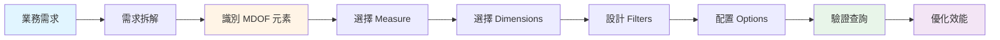
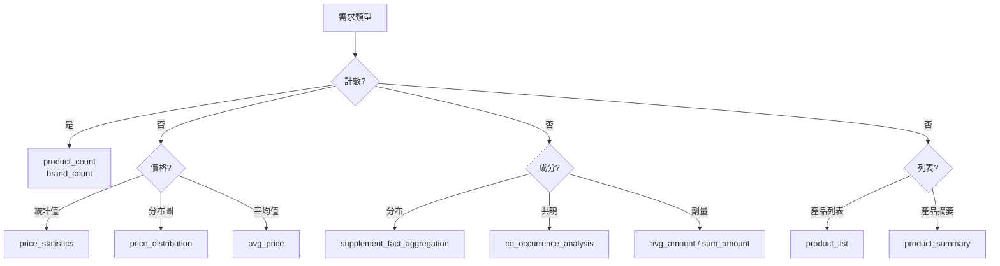
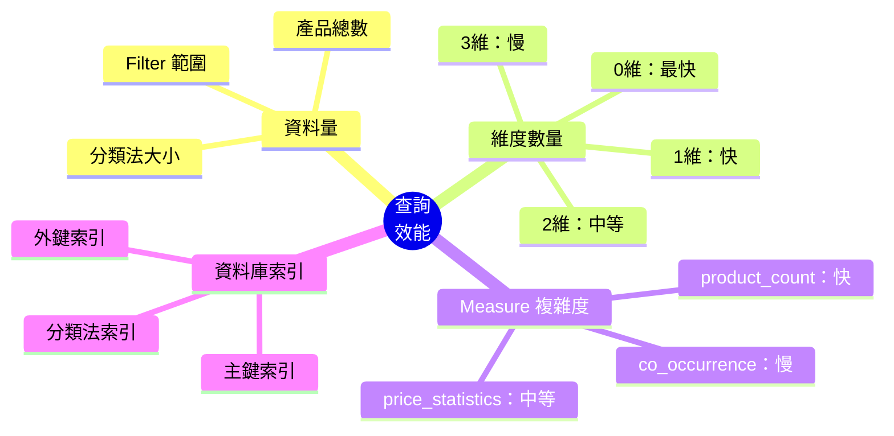

# 查詢設計進階

---

## 📚 本章目標

完成本章學習後，你將能夠：

- ✅ 將複雜業務需求拆解為 MDOF 查詢
- ✅ 掌握常見的查詢設計模式
- ✅ 理解 Filter-Dimension 互動語義
- ✅ 優化查詢效能，避免常見陷阱
- ✅ 設計可維護、可擴展的查詢結構
- ✅ 處理邊界情況與特殊需求

---

## 目錄

- [1. 查詢設計思維](#1-查詢設計思維)
- [2. 設計模式庫](#2-設計模式庫)
- [3. Filter-Dimension 互動](#3-filter-dimension-互動)
- [4. 效能優化](#4-效能優化)
- [5. 業務場景實戰](#5-業務場景實戰)
- [6. 進階技巧](#6-進階技巧)

---

## 1. 查詢設計思維

### 1.1 從業務需求到 MDOF 查詢

**設計流程**：



#### 步驟 1：需求拆解

將模糊的業務需求拆解為明確的問題：

**範例 1**：

```
業務需求：「我們想了解益生菌市場的競爭格局」

拆解：
- 市場規模？ → 產品數量
- 價格分布？ → 價格統計
- 品牌分布？ → 按品牌分組
- 劑型偏好？ → 按劑型分組
- 價格帶分析？ → 價格分布直方圖
```

**範例 2**：

```
業務需求：「幫我分析睡眠產品的成分配方」

拆解：
- 常見成分？ → supplement_fact_aggregation
- 成分組合？ → co_occurrence_analysis
- 劑量分析？ → avg_amount
- 各品牌差異？ → 加入 Brand 維度
```

#### 步驟 2：識別 MDOF 元素

**提問框架**：

| 提問 | 對應元素 | 範例回答 |
|------|---------|---------|
| 我想**計算什麼**？ | Measure | 產品數量 / 平均價格 / 成分分布 |
| 我想**如何分組**？ | Dimensions | 按品牌 / 按劑型 / 品牌×劑型 |
| 我想分析**哪些資料**？ | Filters | 益生菌 / 膠囊劑型 / 有機認證 |
| 我想**如何呈現**？ | Options | 前 20 筆 / 每頁 10 筆 |

**範例應用**：

```
需求：「有機認證的膠囊益生菌，各品牌的平均價格，只看前 10 名」

識別：
- 計算什麼：平均價格 → measure: "price_statistics"
- 如何分組：按品牌 → dimensions: ["Brand"]
- 哪些資料：益生菌 + 膠囊 + 有機 → filters
- 如何呈現：前 10 名 → options: {"limit": 10}
```

#### 步驟 3：選擇 Measure

**決策樹**：



**選擇建議**：

1. **優先使用統計 Measure**：
   - ✅ `price_statistics` 一次取得 avg/min/max
   - ❌ 分別用 `avg_price`, `price_min`, `price_max`

2. **優先使用 CISC Measure**：
   - ✅ `supplement_fact_aggregation` 自動排除巨量營養素
   - ❌ 手動用 `product_count` + 過濾邏輯

3. **考慮維度限制**：
   - 某些 Measure 有嚴格維度要求
   - 查閱 `spec/Measure_Reference.md`

#### 步驟 4：選擇 Dimensions

**決策因素**：

```mermaid
mindmap
  root((選擇<br/>Dimensions))
    受眾
      管理層 → 0-1維
      分析師 → 1-2維
      數據科學家 → 2-3維
    分析目的
      總體趨勢 → 0維
      單維比較 → 1維
      交叉分析 → 2維
      深度探索 → 3維
    資料量
      小<1K → 2-3維可行
      中1-10K → 1-2維建議
      大>10K → 0-1維建議
    Measure限制
      co_occurrence → 必須[]
      avg_amount → 最多2維
      一般 → 最多3維
```

#### 步驟 5：設計 Filters

**設計模式**：

| 需求 | Filter 結構 |
|------|------------|
| **單一條件** | `any: {Taxonomy: [value]}` |
| **OR 條件** | `any: {Taxonomy: [v1, v2]}` |
| **AND 條件** | `all: {Taxonomy: [v1, v2]}` |
| **跨分類法 AND** | `any: {T1: [...], T2: [...]}` + `cross_realms_logic: "AND"` |
| **跨分類法 OR** | `any: {T1: [...], T2: [...]}` + `cross_realms_logic: "OR"` |
| **複合條件** | `any: {...}` + `all: {...}` |

#### 步驟 6：配置 Options

**必要選項**：

```json
{
  "options": {
    "limit": 100,  // 永遠設定 limit
    "cross_realms_logic": "AND"  // 跨分類法時明確指定
  }
}
```

**條件選項**：

```json
{
  "options": {
    "bin_size": 10.0,  // price_distribution 專用
    "unit_grouping": "mixed",  // avg_amount 專用
    "offset": 20  // 分頁時使用
  }
}
```

#### 步驟 7：驗證查詢

**驗證檢查清單**：

- [ ] JSON 語法正確（無語法錯誤）
- [ ] Measure 選擇符合需求
- [ ] Dimensions 數量在限制內
- [ ] Filters 邏輯清楚正確
- [ ] Options 設定完整
- [ ] 分類法名稱拼寫正確

**驗證工具**：

```bash
# 驗證查詢結構
python tests/si_validate.py query.json

# 執行查詢看結果
python tests/si_query.py query.json

# 顯示 SQL（理解執行邏輯）
python tests/si_query.py query.json --show-sql
```

#### 步驟 8：優化效能

**優化檢查清單**：

- [ ] Dimensions 數量是否最少化？
- [ ] Filters 是否過於寬鬆？
- [ ] limit 是否設定合理？
- [ ] 是否會產生組合爆炸？

---

## 2. 設計模式庫

### 2.1 單維度分析模式

**模式 A：品牌競爭分析**

```json
{
  "measure": "product_count",
  "dimensions": ["Brand"],
  "filters": {
    "any": {"SupplementFact": ["Vitamin C"]},
    "all": {}
  },
  "options": {"limit": 10}
}
```

**適用場景**：
- 市場佔有率分析
- 品牌競爭格局
- 品牌排名

**模式 B：劑型分布分析**

```json
{
  "measure": "avg_price",
  "dimensions": ["DosageForm"],
  "filters": {
    "any": {"SupplementFact": ["Probiotic"]},
    "all": {}
  },
  "options": {}
}
```

**適用場景**：
- 劑型偏好分析
- 劑型定價策略
- 產品形式研究

**模式 C：成分分布分析**

```json
{
  "measure": "supplement_fact_aggregation",
  "dimensions": [],
  "filters": {
    "any": {"QualityOfLife": ["Immune Support"]},
    "all": {}
  },
  "options": {"limit": 20}
}
```

**適用場景**：
- 熱門成分識別
- 配方設計參考
- 成分趨勢分析

### 2.2 交叉分析模式

**模式 D：品牌 × 劑型**

```json
{
  "measure": "product_count",
  "dimensions": ["Brand", "DosageForm"],
  "filters": {
    "any": {"SupplementFact": ["Omega-3"]},
    "all": {}
  },
  "options": {"limit": 30}
}
```

**適用場景**：
- 品牌產品線分析
- 品牌劑型策略
- 市場細分研究

**模式 E：成分 × 劑型**

```json
{
  "measure": "avg_price",
  "dimensions": ["SupplementFact", "DosageForm"],
  "filters": {
    "any": {"QualityOfLife": ["Energy Boost"]},
    "all": {}
  },
  "options": {"limit": 50}
}
```

**適用場景**：
- 成分-劑型定價
- 產品組合設計
- 市場機會識別

**模式 F：品牌 × 認證**

```json
{
  "measure": "product_count",
  "dimensions": ["Brand", "Certification"],
  "filters": {
    "any": {"SupplementFact": ["Probiotic"]},
    "all": {}
  },
  "options": {"limit": 40}
}
```

**適用場景**：
- 品牌定位分析
- 認證策略研究
- 市場差異化

### 2.3 漏斗分析模式

**模式 G：多層過濾漏斗**

```json
// Step 1: 所有產品
{
  "measure": "product_count",
  "dimensions": [],
  "filters": {"any": {}, "all": {}},
  "options": {}
}
// 結果：10,000 products

// Step 2: 益生菌產品
{
  "measure": "product_count",
  "dimensions": [],
  "filters": {
    "any": {"SupplementFact": ["Probiotic"]},
    "all": {}
  },
  "options": {}
}
// 結果：1,234 products (12.3%)

// Step 3: 膠囊劑型的益生菌
{
  "measure": "product_count",
  "dimensions": [],
  "filters": {
    "any": {
      "SupplementFact": ["Probiotic"],
      "DosageForm": ["Capsule"]
    },
    "all": {}
  },
  "options": {"cross_realms_logic": "AND"}
}
// 結果：687 products (6.9%)

// Step 4: 有機認證的膠囊益生菌
{
  "measure": "product_count",
  "dimensions": [],
  "filters": {
    "any": {
      "SupplementFact": ["Probiotic"],
      "DosageForm": ["Capsule"],
      "Certification": ["Organic"]
    },
    "all": {}
  },
  "options": {"cross_realms_logic": "AND"}
}
// 結果：142 products (1.4%)
```

**適用場景**：
- 市場細分分析
- 目標市場規模評估
- 產品定位研究

### 2.4 價格分析模式

**模式 H：價格分布直方圖**

```json
{
  "measure": "price_distribution",
  "dimensions": [],
  "filters": {
    "any": {"SupplementFact": ["Probiotic"]},
    "all": {}
  },
  "options": {"bin_size": 10.0}
}
```

**適用場景**：
- 價格帶分析
- 定價策略制定
- 市場價格結構

**模式 I：品牌價格比較**

```json
{
  "measure": "price_statistics",
  "dimensions": ["Brand"],
  "filters": {
    "any": {"SupplementFact": ["Omega-3"]},
    "all": {}
  },
  "options": {"limit": 15}
}
```

**適用場景**：
- 品牌定價策略
- 競爭價格分析
- 價格定位研究

### 2.5 成分分析模式

**模式 J：成分共現分析**

```json
{
  "measure": "co_occurrence_analysis",
  "dimensions": [],
  "filters": {
    "any": {"SupplementFact": ["Vitamin C"]},
    "all": {}
  },
  "options": {"limit": 20}
}
```

**適用場景**：
- 配方設計參考
- 成分組合研究
- 產品差異化

**模式 K：成分劑量分析**

```json
{
  "measure": "avg_amount",
  "dimensions": [],
  "filters": {
    "any": {"SupplementFact": ["Calcium"]},
    "all": {}
  },
  "options": {"unit_grouping": "mixed"}
}
```

**適用場景**：
- 劑量標準研究
- 配方劑量設計
- 市場劑量趨勢

**模式 L：品牌劑量比較**

```json
{
  "measure": "avg_amount",
  "dimensions": ["Brand"],
  "filters": {
    "any": {"SupplementFact": ["Vitamin D"]},
    "all": {}
  },
  "options": {
    "unit_grouping": "mixed",
    "limit": 10
  }
}
```

**適用場景**：
- 品牌配方策略
- 劑量競爭分析
- 產品差異化

### 2.6 認證分析模式

**模式 M：認證分布分析**

```json
{
  "measure": "product_count",
  "dimensions": ["Certification"],
  "filters": {
    "any": {"SupplementFact": ["Probiotic"]},
    "all": {}
  },
  "options": {}
}
```

**適用場景**：
- 認證市場分析
- 認證策略研究
- 消費者偏好研究

**模式 N：多重認證分析**

```json
{
  "measure": "product_count",
  "dimensions": ["Brand"],
  "filters": {
    "any": {},
    "all": {
      "Certification": ["Organic", "Non-GMO", "Vegan"]
    }
  },
  "options": {"limit": 10}
}
```

**適用場景**：
- 高標準產品分析
- 品牌定位研究
- 認證組合策略

---

## 3. Filter-Dimension 互動

### 3.1 Filter 與 Dimension 的關係

**核心概念**：Filter 和 Dimension 可以使用相同的分類法

**範例**：

```json
{
  "measure": "product_count",
  "dimensions": ["SupplementFact"],
  "filters": {
    "any": {"SupplementFact": ["Vitamin C", "Vitamin D"]},
    "all": {}
  }
}
```

**意義**：
- **Filter**：限定範圍「只看維生素 C 和 D 產品」
- **Dimension**：在限定範圍內「按成分分組」

**結果**：
```
Vitamin C: 372 products
Vitamin D: 289 products
```

### 3.2 四種互動模式

#### Pattern A：Filter ⊂ Dimension（Filter 是 Dimension 的子集）

```json
{
  "measure": "product_count",
  "dimensions": ["SupplementFact"],
  "filters": {
    "any": {"SupplementFact": ["Vitamin C", "Vitamin D"]},
    "all": {}
  }
}
```

**語義**：在 Vitamin C/D 產品中，按成分分組

**結果特性**：
- Dimension 結果只會包含 Filter 中指定的值
- 結果最多 2 行（Vitamin C, Vitamin D）

**適用場景**：
- 比較特定成分的產品數量
- 分析子集內的分布

#### Pattern B：Filter ⊃ Dimension（Filter 是 Dimension 的父集）

```json
{
  "measure": "product_count",
  "dimensions": ["SupplementFact"],
  "filters": {
    "any": {"SupplementFact": ["Vitamins"]},  // 父節點
    "all": {}
  }
}
```

**語義**：在 Vitamins 類產品中，按具體成分分組

**結果特性**：
- Dimension 結果包含所有 Vitamins 的子成分
- 結果行數 = Vitamins 類下的所有成分數量

**適用場景**：
- 分析大類下的細分分布
- 識別子類別中的熱門項

#### Pattern C：Filter ∩ Dimension = ∅（Filter 與 Dimension 無交集）

```json
{
  "measure": "product_count",
  "dimensions": ["Brand"],
  "filters": {
    "any": {"SupplementFact": ["Probiotic"]},
    "all": {}
  }
}
```

**語義**：在益生菌產品中，按品牌分組

**結果特性**：
- Filter 和 Dimension 使用不同分類法
- 最常見的模式

**適用場景**：
- 交叉維度分析
- 多角度市場研究

#### Pattern D：Dimension 無 Filter（全域分組）

```json
{
  "measure": "product_count",
  "dimensions": ["Brand"],
  "filters": {"any": {}, "all": {}}
}
```

**語義**：所有產品，按品牌分組

**結果特性**：
- 無過濾，全資料分組
- 結果數量最多

**適用場景**：
- 總體市場分析
- 品牌全產品線統計

### 3.3 dimension_inclusion 選項 (進階)

**用途**：控制 Dimension 結果的範圍

```json
{
  "measure": "product_count",
  "dimensions": ["SupplementFact"],
  "filters": {
    "any": {"SupplementFact": ["Vitamin C"]},
    "all": {}
  },
  "options": {
    "dimension_inclusion": {
      "SupplementFact": "as_filtered"  // 或 "all"
    }
  }
}
```

**模式說明**：

| 模式 | 說明 | 結果範圍 |
|------|------|---------|
| `"as_filtered"` | 只顯示 Filter 中的值 | 限定在 Filter 範圍內 |
| `"all"` | 顯示所有非零值 | 可能超出 Filter 範圍 |

**範例對比**：

```json
// 範例 1：as_filtered（預設）
{
  "measure": "product_count",
  "dimensions": ["SupplementFact"],
  "filters": {
    "any": {"SupplementFact": ["Vitamin C"]},
    "all": {}
  },
  "options": {
    "dimension_inclusion": {
      "SupplementFact": "as_filtered"
    }
  }
}
// 結果：只顯示 Vitamin C

// 範例 2：all
{
  "measure": "product_count",
  "dimensions": ["SupplementFact"],
  "filters": {
    "any": {"SupplementFact": ["Vitamin C"]},
    "all": {}
  },
  "options": {
    "dimension_inclusion": {
      "SupplementFact": "all"
    }
  }
}
// 結果：顯示 Vitamin C 及其共存的所有成分
// Vitamin C: 372
// Zinc: 156 (因為有產品同時含 C 和 Zinc)
// Vitamin D: 134
```

**使用建議**：

- ✅ 預設使用 `"as_filtered"`：符合直覺
- ⭐ 使用 `"all"` 場景：想看「還有什麼」
  - 例：「維生素 C 產品中，還有哪些其他成分？」

---

## 4. 效能優化

### 4.1 查詢效能考量

**影響因素**：



### 4.2 避免組合爆炸

**問題**：維度組合會產生笛卡爾積

**範例**：

```
Brand: 100 個
DosageForm: 5 個
Certification: 10 個

1 維（Brand）：         100 個結果
2 維（Brand × Form）：   500 個結果
3 維（Brand × Form × Cert）： 5,000 個結果
```

**優化策略**：

1. **減少維度數量**：

```json
// ❌ 過多維度
{
  "measure": "product_count",
  "dimensions": ["Brand", "DosageForm", "Certification"],
  "filters": {"any": {}, "all": {}},
  "options": {}
}
// 可能產生數千行結果

// ✅ 減少維度
{
  "measure": "product_count",
  "dimensions": ["Brand"],
  "filters": {"any": {}, "all": {}},
  "options": {"limit": 20}
}
```

2. **收緊 Filter 範圍**：

```json
// ❌ Filter 過寬
{
  "measure": "product_count",
  "dimensions": ["Brand", "DosageForm"],
  "filters": {
    "any": {"SupplementFact": ["Vitamins"]},  // 父節點，範圍很大
    "all": {}
  }
}

// ✅ Filter 收緊
{
  "measure": "product_count",
  "dimensions": ["Brand", "DosageForm"],
  "filters": {
    "any": {"SupplementFact": ["Vitamin C"]},  // 具體成分
    "all": {}
  }
}
```

3. **設定合理 limit**：

```json
{
  "measure": "product_count",
  "dimensions": ["Brand", "DosageForm"],
  "filters": {"any": {}, "all": {}},
  "options": {
    "limit": 50  // 限制結果數量
  }
}
```

### 4.3 SQL 執行計畫理解

**查看 SQL**：

```bash
python tests/si_query.py query.json --show-sql
```

**SQL 結構**：

```sql
SELECT
    Brand,
    DosageForm,
    COUNT(DISTINCT product_id) as product_count
FROM Products p
WHERE supplement_fact IN ('Vitamin C')  -- Filter
GROUP BY Brand, DosageForm              -- Dimensions
ORDER BY product_count DESC
LIMIT 50;                                -- Options
```

**優化要點**：

1. **WHERE 子句優化**：
   - Filter 越緊，掃描資料越少
   - 利用索引加速過濾

2. **GROUP BY 優化**：
   - 維度越少，分組越快
   - 避免不必要的維度

3. **ORDER BY 優化**：
   - 通常按 measure_value 排序
   - 配合 limit 可提前終止

4. **JOIN 優化**：
   - lucid.db 使用反正規化，減少 JOIN
   - 分類法 JOIN 透過索引加速

### 4.4 索引使用建議

**lucid.db 索引**：

| 欄位 | 索引類型 | 用途 |
|------|---------|------|
| `Products.id` | 主鍵 | 產品唯一識別 |
| `Products.brand` | 普通索引 | 品牌過濾與分組 |
| `Products.dosage_form` | 普通索引 | 劑型過濾與分組 |
| 分類法關聯表 | 外鍵索引 | 成分/功效過濾 |

**查詢建議**：

- ✅ 使用索引欄位作為 Filter：快速
- ✅ 使用索引欄位作為 Dimension：快速
- ⚠️ 大量 JOIN（如 photon.db）：較慢
- ⚠️ 複雜子查詢：較慢

### 4.5 效能優化檢查清單

**設計階段**：

- [ ] Dimensions 是否最少化？
- [ ] Filters 是否收緊範圍？
- [ ] limit 是否設定合理？
- [ ] 是否使用了效能較好的 Measure？

**執行階段**：

- [ ] 查詢時間是否在可接受範圍？（< 2 秒）
- [ ] 結果數量是否合理？（< 1000 行）
- [ ] 是否有不必要的 JOIN？
- [ ] 是否有更簡單的查詢方式？

---

## 5. 業務場景實戰

### 5.1 市場研究場景

#### 場景 1：新產品市場評估

**業務需求**：
> 我們想推出有機認證的膠囊益生菌產品，評估市場機會

**分析步驟**：

```json
// Step 1：總市場規模（益生菌）
{
  "measure": "product_count",
  "dimensions": [],
  "filters": {
    "any": {"SupplementFact": ["Probiotic"]},
    "all": {}
  }
}
// 結果：1,234 products

// Step 2：劑型分布
{
  "measure": "product_count",
  "dimensions": ["DosageForm"],
  "filters": {
    "any": {"SupplementFact": ["Probiotic"]},
    "all": {}
  }
}
// 結果：
// Capsule: 687 (55.7%)
// Tablet: 245 (19.9%)
// Powder: 189 (15.3%)
// 洞察：膠囊是主流劑型

// Step 3：有機認證市場
{
  "measure": "product_count",
  "dimensions": [],
  "filters": {
    "any": {
      "SupplementFact": ["Probiotic"],
      "DosageForm": ["Capsule"],
      "Certification": ["Organic"]
    },
    "all": {}
  },
  "options": {"cross_realms_logic": "AND"}
}
// 結果：142 products (11.5%)
// 洞察：有機市場尚有空間

// Step 4：競爭品牌與價格
{
  "measure": "price_statistics",
  "dimensions": ["Brand"],
  "filters": {
    "any": {
      "SupplementFact": ["Probiotic"],
      "DosageForm": ["Capsule"],
      "Certification": ["Organic"]
    },
    "all": {}
  },
  "options": {
    "cross_realms_logic": "AND",
    "limit": 10
  }
}
// 結果：
// Garden of Life: avg=$38.99, count=23
// NOW Foods: avg=$24.99, count=18
// Renew Life: avg=$32.49, count=15
// 洞察：價格帶在 $25-40
```

**業務建議**：
- 市場機會：有機膠囊益生菌市場佔 11.5%，有成長空間
- 定價策略：建議定價 $28-35（中等價位）
- 競爭對手：主要競爭者為 Garden of Life, NOW Foods

#### 場景 2：品牌定位分析

**業務需求**：
> 分析各品牌在 Omega-3 市場的定位（價格×劑型）

```json
{
  "measure": "price_statistics",
  "dimensions": ["Brand", "DosageForm"],
  "filters": {
    "any": {"SupplementFact": ["Omega-3"]},
    "all": {}
  },
  "options": {"limit": 30}
}
```

**結果分析**：
```
Nordic Naturals × Liquid:  avg=$45.99 (高價精品)
Nordic Naturals × Softgel: avg=$35.99 (中高價)
NOW Foods × Softgel:       avg=$19.99 (平價主流)
NOW Foods × Capsule:       avg=$17.99 (平價)
Nature Made × Softgel:     avg=$24.99 (中價主流)
```

**洞察**：
- Nordic Naturals：高價精品路線，主打液態
- NOW Foods：平價路線，以 Softgel 為主
- Nature Made：中價主流，平衡價格與品質

### 5.2 產品設計場景

#### 場景 3：配方設計參考

**業務需求**：
> 設計一款睡眠改善產品，參考市場常見配方

```json
// Step 1：睡眠產品常見成分
{
  "measure": "supplement_fact_aggregation",
  "dimensions": [],
  "filters": {
    "any": {"QualityOfLife": ["Sleep Improvement"]},
    "all": {}
  },
  "options": {"limit": 20}
}
// 結果：
// Melatonin: 234 products
// Magnesium: 156 products
// L-Theanine: 128 products
// Valerian Root: 98 products
// GABA: 87 products

// Step 2：Melatonin 產品的其他成分
{
  "measure": "co_occurrence_analysis",
  "dimensions": [],
  "filters": {
    "any": {"SupplementFact": ["Melatonin"]},
    "all": {}
  },
  "options": {"limit": 20}
}
// 結果：
// Melatonin: 234 (100%)
// Magnesium: 98 (41.9%)
// L-Theanine: 87 (37.2%)
// Vitamin B6: 76 (32.5%)

// Step 3：Melatonin 的市場劑量
{
  "measure": "avg_amount",
  "dimensions": [],
  "filters": {
    "any": {"SupplementFact": ["Melatonin"]},
    "all": {}
  },
  "options": {"unit_grouping": "mixed"}
}
// 結果：
// Melatonin (mg): 3.2 mg average
```

**配方建議**：
- 核心成分：Melatonin (3mg)
- 協同成分：Magnesium, L-Theanine
- 劑量參考：Melatonin 3-5mg 為主流

#### 場景 4：劑型選擇

**業務需求**：
> 決定新產品的劑型

```json
// 各劑型的市場規模與價格
{
  "measure": "price_statistics",
  "dimensions": ["DosageForm"],
  "filters": {
    "any": {"QualityOfLife": ["Sleep Improvement"]},
    "all": {}
  }
}
```

**結果**：
```
Capsule:  avg=$24.99, count=156 (主流)
Tablet:   avg=$18.99, count=98
Gummy:    avg=$21.99, count=67 (新興)
Liquid:   avg=$32.49, count=34 (小眾高價)
```

**建議**：
- 主流市場：選擇 Capsule
- 差異化：選擇 Gummy（年輕族群）
- 高端市場：選擇 Liquid

### 5.3 定價策略場景

#### 場景 5：競爭定價分析

**業務需求**：
> 為新的益生菌產品定價

```json
// Step 1：價格分布
{
  "measure": "price_distribution",
  "dimensions": [],
  "filters": {
    "any": {
      "SupplementFact": ["Probiotic"],
      "DosageForm": ["Capsule"]
    },
    "all": {}
  },
  "options": {
    "cross_realms_logic": "AND",
    "bin_size": 10.0
  }
}
// 結果：
// $0-10:    23 products (低價區)
// $10-20:   156 products (主力價格帶)
// $20-30:   234 products (中高價)
// $30-40:   98 products (高價區)
// $40+:     45 products (精品區)

// Step 2：品牌價格定位
{
  "measure": "price_statistics",
  "dimensions": ["Brand"],
  "filters": {
    "any": {
      "SupplementFact": ["Probiotic"],
      "DosageForm": ["Capsule"]
    },
    "all": {}
  },
  "options": {
    "cross_realms_logic": "AND",
    "limit": 10
  }
}
// 結果：
// Garden of Life: avg=$35.99, min=$24.99, max=$49.99
// NOW Foods:      avg=$19.99, min=$12.99, max=$29.99
// Renew Life:     avg=$32.49, min=$24.99, max=$44.99
```

**定價建議**：
- 平價策略：$15-20（與 NOW Foods 競爭）
- 中價策略：$25-30（主流市場）
- 高價策略：$35-40（與 Garden of Life 競爭）

### 5.4 趨勢分析場景

#### 場景 6：認證趨勢分析

**業務需求**：
> 了解認證標籤的市場需求

```json
// 各認證的市場滲透率
{
  "measure": "product_count",
  "dimensions": ["Certification"],
  "filters": {
    "any": {"SupplementFact": ["Probiotic"]},
    "all": {}
  }
}
```

**結果**：
```
Organic:   142 products (11.5%)
Non-GMO:   234 products (19.0%)
Vegan:     189 products (15.3%)
Gluten-Free: 298 products (24.2%)
```

**洞察**：
- Gluten-Free 最普及（24.2%）
- Non-GMO 第二（19.0%）
- Organic 相對小眾（11.5%）

**建議**：
- 基本標配：Gluten-Free + Non-GMO
- 差異化：加上 Organic 或 Vegan

---

## 6. 進階技巧

### 6.1 查詢重用與模板化

**模板範例**：

```json
// 模板：品牌競爭分析
{
  "measure": "product_count",
  "dimensions": ["Brand"],
  "filters": {
    "any": {"SupplementFact": ["{{INGREDIENT}}"]}  // 參數化
  },
  "options": {"limit": 10}
}

// 實例 1：Vitamin C
{"INGREDIENT": "Vitamin C"}

// 實例 2：Probiotic
{"INGREDIENT": "Probiotic"}
```

### 6.2 查詢組合與比較

**對比分析**：

```json
// Query A：有機產品
{
  "measure": "product_count",
  "dimensions": ["Brand"],
  "filters": {
    "any": {
      "SupplementFact": ["Probiotic"],
      "Certification": ["Organic"]
    },
    "all": {}
  },
  "options": {"cross_realms_logic": "AND", "limit": 10}
}

// Query B：非有機產品（手動過濾）
{
  "measure": "product_count",
  "dimensions": ["Brand"],
  "filters": {
    "any": {"SupplementFact": ["Probiotic"]},
    "all": {}
  },
  "options": {"limit": 10}
}

// 結果對比：
// Garden of Life: 有機 23, 總計 87 (26.4%)
// NOW Foods:      有機 18, 總計 64 (28.1%)
```

### 6.3 錯誤處理與降級策略

**策略**：當複雜查詢失敗時，嘗試簡化

```json
// 嘗試 1：3 維查詢
{
  "measure": "product_count",
  "dimensions": ["Brand", "DosageForm", "Certification"]
}
// 如果超時或結果過多...

// 降級 1：減少到 2 維
{
  "measure": "product_count",
  "dimensions": ["Brand", "DosageForm"],
  "options": {"limit": 50}
}

// 降級 2：減少到 1 維
{
  "measure": "product_count",
  "dimensions": ["Brand"],
  "options": {"limit": 20}
}
```

### 6.4 查詢驗證清單

**提交前檢查**：

- [ ] **業務邏輯**：查詢回答了正確的業務問題
- [ ] **Measure 選擇**：使用最合適的 Measure
- [ ] **Dimensions 合理**：數量與組合合理
- [ ] **Filters 正確**：邏輯清楚無誤
- [ ] **Options 完整**：limit, cross_realms_logic 設定
- [ ] **語法正確**：JSON 格式合法
- [ ] **效能可接受**：預期結果數量合理
- [ ] **可維護性**：查詢易於理解與修改

---

## 7. 總結與下一步

### 7.1 本章核心要點

1. **設計思維**：從業務需求到 MDOF 的系統化方法
2. **設計模式**：12+ 個常見查詢模式可直接應用
3. **Filter-Dimension**：理解四種互動模式
4. **效能優化**：避免組合爆炸，合理使用 limit
5. **業務實戰**：涵蓋市場研究、產品設計、定價策略

### 7.2 進階學習方向

1. **測試設計**：
   - 👉 [03_test-case-design.md](./03_test-case-design.md)
   - 學習如何為查詢設計完整測試

2. **架構深入**：
   - 閱讀 `spec/Canonical_Query_Schema.md`
   - 理解 CISC/RISC 轉換細節

3. **實戰練習**：
   - 參考 `tests/testcase/business_scenarios/`
   - 嘗試設計更多業務場景查詢

### 7.3 常見問題 FAQ

**Q1：何時使用 2 維或 3 維？**

A：取決於資料量與分析目的
- 資料量小（< 1K）：可用 2-3 維
- 資料量大（> 10K）：建議 1-2 維
- 永遠設定 limit 保護

**Q2：cross_realms_logic 何時用 OR？**

A：較少使用，通常在以下場景：
- 想看「任一條件」的聯集
- 例：「含鈣的產品，或者有機認證的產品」

**Q3：如何選擇 bin_size？**

A：根據價格範圍決定：
- 低價產品（< $50）：bin_size = 5 或 10
- 中價產品（$50-200）：bin_size = 10 或 20
- 高價產品（> $200）：bin_size = 20 或 50

**Q4：dimension_inclusion 何時使用？**

A：通常不需要，除非：
- 想看「Filter 限定範圍內，還有什麼」
- 使用 `"all"` 模式

---

**版本歷史**

| 版本 | 日期 | 變更內容 |
|------|------|---------|
| 1.0 | 2025-11-11 | 初始版本 |
