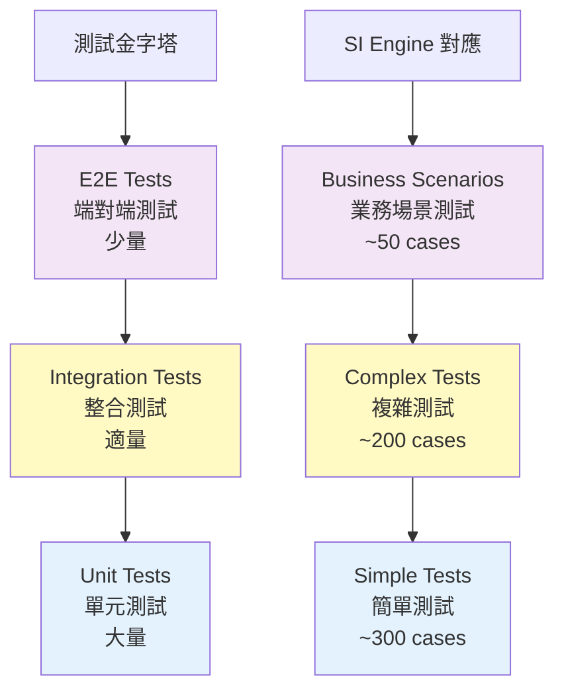
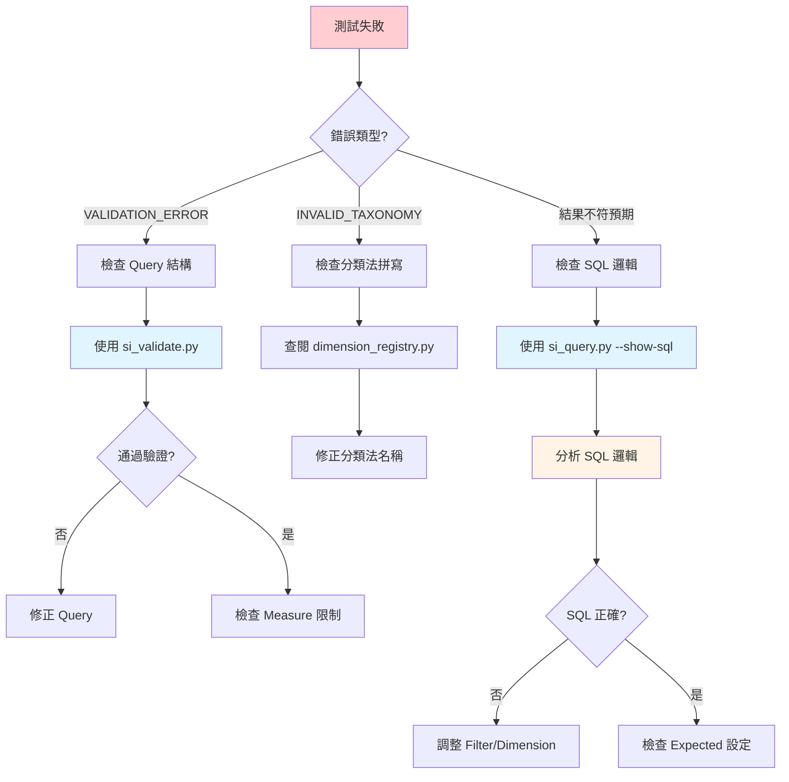

# 測試案例設計

---

## 📚 本章目標

完成本章學習後，你將能夠：

- ✅ 理解 Smart Insight Engine 的測試策略
- ✅ 設計符合 JSON Schema 的測試案例
- ✅ 使用等價類與邊界值分析技巧
- ✅ 熟練使用測試工具鏈（Test Runner, Debugger）
- ✅ 獨立設計 Simple 和 Complex 測試
- ✅ 進行有效的測試除錯

---

## 目錄

- [1. 測試策略](#1-測試策略)
- [2. 測試案例結構](#2-測試案例結構)
- [3. 測試案例設計技巧](#3-測試案例設計技巧)
- [4. 使用 Test Runner](#4-使用-test-runner)
- [5. 除錯技巧](#5-除錯技巧)
- [6. 實戰範例](#6-實戰範例)

---

## 1. 測試策略

### 1.1 測試金字塔



### 1.2 測試類型

#### Simple Tests（簡單測試）

**特性**：
- 單一 Measure 測試
- 基礎功能驗證
- 快速執行（< 1s per case）
- 覆蓋基本場景

**範例**：

```json
// tests/testcase/measures/product_count.simple.json
{
  "test_suite": "product_count_simple",
  "measure": "product_count",
  "test_cases": [
    {
      "name": "Basic count - no filters",
      "query": {
        "measure": "product_count",
        "dimensions": [],
        "filters": {"any": {}, "all": {}},
        "options": {}
      },
      "expected": {
        "type": "single_value",
        "validations": [
          {"field": "measure_value", "operator": ">", "value": 0}
        ]
      }
    }
  ]
}
```

#### Complex Tests（複雜測試）

**特性**：
- 多維度、多條件組合
- 邊界情況測試
- 執行時間稍長（1-5s per case）
- 覆蓋進階場景

**範例**：

```json
// tests/testcase/measures/product_count.complex.json
{
  "test_suite": "product_count_complex",
  "measure": "product_count",
  "test_cases": [
    {
      "name": "Multi-dimension with complex filters",
      "query": {
        "measure": "product_count",
        "dimensions": ["Brand", "DosageForm"],
        "filters": {
          "any": {
            "SupplementFact": ["Vitamin C", "Vitamin D"]
          },
          "all": {
            "Certification": ["Organic"]
          }
        },
        "options": {
          "limit": 20,
          "cross_realms_logic": "AND"
        }
      },
      "expected": {
        "type": "multi_row",
        "validations": [
          {"field": "row_count", "operator": "<=", "value": 20},
          {"field": "dimensions", "operator": "has_keys", "value": ["Brand", "DosageForm"]}
        ]
      }
    }
  ]
}
```

#### Business Scenarios（業務場景測試）

**特性**：
- 真實業務問題
- 端對端驗證
- 包含業務邏輯驗證
- 可作為使用範例

**範例**：

```json
// tests/testcase/business_scenarios/senior_bone_health.json
{
  "scenario": "Senior Bone Health Analysis",
  "description": "Analyze bone health supplements for senior citizens",
  "test_cases": [
    {
      "name": "Identify key supplements for bone health",
      "query": {
        "measure": "supplement_fact_aggregation",
        "dimensions": [],
        "filters": {
          "any": {"QualityOfLife": ["Bone Health"]},
          "all": {}
        },
        "options": {"limit": 10}
      },
      "business_expectations": [
        "Calcium should be in top 3",
        "Vitamin D should be in top 3",
        "Magnesium should appear in results"
      ]
    }
  ]
}
```

### 1.3 測試覆蓋率目標

| 測試維度 | 目標 | 當前狀態 |
|---------|------|---------|
| **Measure 覆蓋** | 100% | ✅ 所有 Measure 有測試 |
| **Dimension 組合** | 0D, 1D, 2D, 3D | ✅ 已覆蓋 |
| **Filter 邏輯** | any/all/cross_realms | ✅ 已覆蓋 |
| **邊界情況** | 空結果、大量結果 | ✅ 已覆蓋 |
| **錯誤情況** | 非法查詢 | ⚠️ 部分覆蓋 |

---

## 2. 測試案例結構

### 2.1 JSON Schema 規範

**最小結構**：

```json
{
  "test_suite": "測試套件名稱",
  "measure": "measure_name",
  "test_cases": [
    {
      "name": "測試案例名稱",
      "query": {
        // MDOF Query
      },
      "expected": {
        // 預期結果驗證
      }
    }
  ]
}
```

**完整結構**：

```json
{
  "test_suite": "product_count_comprehensive",
  "description": "Comprehensive tests for product_count measure",
  "measure": "product_count",
  "database": "lucid.db",  // 可選：指定資料庫
  "test_cases": [
    {
      "name": "Test case description",
      "description": "Detailed explanation",  // 可選
      "tags": ["basic", "filters"],  // 可選：標籤
      "query": {
        "measure": "product_count",
        "dimensions": [],
        "filters": {"any": {}, "all": {}},
        "options": {}
      },
      "expected": {
        "type": "single_value",  // 或 "multi_row"
        "validations": [
          {
            "field": "measure_value",
            "operator": ">",
            "value": 0,
            "message": "Product count should be positive"  // 可選
          }
        ]
      },
      "skip": false,  // 可選：跳過此測試
      "skip_reason": "Under development"  // 可選
    }
  ]
}
```

### 2.2 Expected 結構

#### Type 1: single_value

**用途**：0 維查詢，返回單一數值

```json
{
  "expected": {
    "type": "single_value",
    "validations": [
      {"field": "measure_value", "operator": ">", "value": 0},
      {"field": "measure_value", "operator": "<", "value": 200000}
    ]
  }
}
```

#### Type 2: multi_row

**用途**：1+ 維查詢，返回多行結果

```json
{
  "expected": {
    "type": "multi_row",
    "validations": [
      {"field": "row_count", "operator": ">", "value": 0},
      {"field": "row_count", "operator": "<=", "value": 10},
      {"field": "dimensions", "operator": "has_keys", "value": ["Brand"]},
      {"field": "dimensions[0].value", "operator": "not_empty"}
    ]
  }
}
```

### 2.3 Validation Operators

| Operator | 說明 | 範例 |
|----------|------|------|
| `==` | 等於 | `{"field": "row_count", "operator": "==", "value": 5}` |
| `!=` | 不等於 | `{"field": "measure_value", "operator": "!=", "value": 0}` |
| `>` | 大於 | `{"field": "measure_value", "operator": ">", "value": 0}` |
| `>=` | 大於等於 | `{"field": "row_count", "operator": ">=", "value": 1}` |
| `<` | 小於 | `{"field": "row_count", "operator": "<", "value": 100}` |
| `<=` | 小於等於 | `{"field": "row_count", "operator": "<=", "value": 20}` |
| `in` | 包含於 | `{"field": "dimensions[0].name", "operator": "in", "value": ["Brand", "DosageForm"]}` |
| `not_in` | 不包含於 | `{"field": "status", "operator": "not_in", "value": ["error"]}` |
| `contains` | 包含 | `{"field": "data", "operator": "contains", "value": "key"}` |
| `not_empty` | 非空 | `{"field": "measure_value", "operator": "not_empty"}` |
| `has_keys` | 包含鍵 | `{"field": "dimensions", "operator": "has_keys", "value": ["Brand"]}` |

---

## 3. 測試案例設計技巧

### 3.1 等價類劃分

**定義**：將輸入空間劃分為若干等價類，每類選擇代表值測試

**範例：Dimensions 數量**

| 等價類 | 代表值 | 測試案例 |
|--------|--------|---------|
| **0 維** | `[]` | 總體統計 |
| **1 維** | `["Brand"]` | 單維度分組 |
| **2 維** | `["Brand", "DosageForm"]` | 交叉分析 |
| **3 維** | `["Brand", "DosageForm", "Certification"]` | 深度分析 |
| **超限** | 4+ 維 | 預期錯誤 |

**測試案例設計**：

```json
{
  "test_cases": [
    {
      "name": "0D - Total count",
      "query": {"dimensions": [], ...}
    },
    {
      "name": "1D - By Brand",
      "query": {"dimensions": ["Brand"], ...}
    },
    {
      "name": "2D - Brand x Form",
      "query": {"dimensions": ["Brand", "DosageForm"], ...}
    },
    {
      "name": "3D - Brand x Form x Cert",
      "query": {"dimensions": ["Brand", "DosageForm", "Certification"], ...}
    }
  ]
}
```

### 3.2 邊界值分析

**定義**：測試邊界值附近的情況

**範例：Filter 數量**

| 邊界 | 測試值 | 說明 |
|------|--------|------|
| **最小** | 0 個 Filter | 無過濾 |
| **最小+1** | 1 個 Filter | 單一條件 |
| **正常** | 2-3 個 Filter | 常見組合 |
| **最大** | 10+ 個 Filter | 複雜條件 |

**測試案例設計**：

```json
{
  "test_cases": [
    {
      "name": "No filters",
      "query": {
        "filters": {"any": {}, "all": {}}
      }
    },
    {
      "name": "Single filter",
      "query": {
        "filters": {
          "any": {"SupplementFact": ["Vitamin C"]},
          "all": {}
        }
      }
    },
    {
      "name": "Multiple filters - moderate",
      "query": {
        "filters": {
          "any": {
            "SupplementFact": ["Vitamin C"],
            "DosageForm": ["Capsule"]
          },
          "all": {}
        }
      }
    },
    {
      "name": "Complex filters - many values",
      "query": {
        "filters": {
          "any": {
            "SupplementFact": ["Vitamin C", "Vitamin D", "Calcium", "Zinc"]
          },
          "all": {
            "Certification": ["Organic", "Non-GMO"]
          }
        }
      }
    }
  ]
}
```

### 3.3 組合測試策略

**兩兩組合（Pairwise Testing）**：

測試所有兩兩參數組合，而非全組合

**範例**：

```
參數：
- Measure: product_count, avg_price
- Dimensions: 0D, 1D, 2D
- Filters: none, single, multiple

全組合 = 2 × 3 × 3 = 18 cases
兩兩組合 = ~9 cases（覆蓋所有兩兩組合）
```

**測試案例設計**：

```json
{
  "test_cases": [
    {"name": "product_count + 0D + none", ...},
    {"name": "product_count + 1D + single", ...},
    {"name": "product_count + 2D + multiple", ...},
    {"name": "avg_price + 0D + single", ...},
    {"name": "avg_price + 1D + multiple", ...},
    {"name": "avg_price + 2D + none", ...}
  ]
}
```

### 3.4 錯誤案例設計

**常見錯誤類型**：

| 錯誤類型 | 測試案例 | 預期結果 |
|---------|---------|---------|
| **維度超限** | 4 個維度 | VALIDATION_ERROR |
| **非法分類法** | `"Brand123"` | INVALID_TAXONOMY |
| **維度要求不符** | `co_occurrence_analysis` + 1D | VALIDATION_ERROR |
| **缺少必要 Filter** | `co_occurrence_analysis` 無 SupplementFact | VALIDATION_ERROR |
| **非法 JSON** | 缺少逗號 | JSON_PARSE_ERROR |

**測試案例設計**：

```json
{
  "test_cases": [
    {
      "name": "Error - Too many dimensions",
      "query": {
        "measure": "product_count",
        "dimensions": ["Brand", "DosageForm", "Certification", "SupplementFact"],
        "filters": {"any": {}, "all": {}}
      },
      "expected": {
        "type": "error",
        "error_code": "DIMENSION_LIMIT_EXCEEDED"
      }
    },
    {
      "name": "Error - Invalid taxonomy",
      "query": {
        "measure": "product_count",
        "dimensions": ["InvalidTaxonomy"],
        "filters": {"any": {}, "all": {}}
      },
      "expected": {
        "type": "error",
        "error_code": "INVALID_TAXONOMY"
      }
    }
  ]
}
```

### 3.5 特殊情況測試

**空結果測試**：

```json
{
  "name": "Empty result - impossible filter",
  "query": {
    "measure": "product_count",
    "dimensions": [],
    "filters": {
      "any": {},
      "all": {
        "SupplementFact": ["Vitamin C"],
        "DosageForm": ["Injection"]  // 不存在的組合
      }
    },
    "options": {"cross_realms_logic": "AND"}
  },
  "expected": {
    "type": "single_value",
    "validations": [
      {"field": "measure_value", "operator": "==", "value": 0}
    ]
  }
}
```

**大量結果測試**：

```json
{
  "name": "Large result set - with limit",
  "query": {
    "measure": "product_count",
    "dimensions": ["Brand", "DosageForm"],
    "filters": {"any": {}, "all": {}},
    "options": {"limit": 100}
  },
  "expected": {
    "type": "multi_row",
    "validations": [
      {"field": "row_count", "operator": "<=", "value": 100}
    ]
  }
}
```

---

## 4. 使用 Test Runner

### 4.1 v3_test_case_runner.py 基本使用

**執行所有 Measure 測試**：

```bash
python tests/v3_test_case_runner.py --all-measures
```

**執行所有業務場景測試**：

```bash
python tests/v3_test_case_runner.py --all-business
```

**執行特定類別**：

```bash
# 執行 product_count 相關測試
python tests/v3_test_case_runner.py --category product_count

# 執行 price_statistics 相關測試
python tests/v3_test_case_runner.py --category price_statistics
```

**指定資料庫**：

```bash
# 使用 lucid.db（預設）
python tests/v3_test_case_runner.py --all-measures

# 使用 photon.db（legacy）
python tests/v3_test_case_runner.py --all-measures --photon
```

### 4.2 測試輸出解讀

**成功輸出**：

```
========================================
Running Test Suite: product_count_simple
========================================

✅ Test 1/5: Basic count - no filters
   Duration: 0.12s
   Result: measure_value = 12,345

✅ Test 2/5: Count with single filter
   Duration: 0.08s
   Result: measure_value = 372

========================================
Summary: 5/5 tests passed
Total duration: 0.45s
========================================
```

**失敗輸出**：

```
❌ Test 3/5: Count with invalid taxonomy
   Duration: 0.05s
   Error: INVALID_TAXONOMY: 'Brand123' is not a valid taxonomy
   Expected: VALIDATION_ERROR
   Actual: INVALID_TAXONOMY

Failure Details:
  Query: {...}
  Expected Error Code: VALIDATION_ERROR
  Actual Error Code: INVALID_TAXONOMY
```

### 4.3 測試報告分析

**報告結構**：

```
Test Run Summary
================
Total Tests: 502
Passed: 498 (99.2%)
Failed: 4 (0.8%)
Skipped: 0

Failures by Category:
- product_count: 1
- avg_amount: 2
- price_distribution: 1

Slowest Tests:
- business_scenario_complex_001: 4.23s
- price_distribution_large: 3.87s
```

### 4.4 進階選項

**只執行失敗的測試**：

```bash
python tests/v3_test_case_runner.py --failed-only
```

**產生詳細報告**：

```bash
python tests/v3_test_case_runner.py --all-measures --report-file=report.json
```

**並行執行（加速）**：

```bash
python tests/v3_test_case_runner.py --all-measures --parallel=4
```

---

## 5. 除錯技巧

### 5.1 使用 si_validate.py

**驗證查詢結構**：

```bash
# 驗證單一查詢
python tests/si_validate.py query.json

# 驗證測試案例中的所有查詢
python tests/si_validate.py tests/testcase/measures/product_count.simple.json
```

**輸出範例**：

```
✅ Query is valid

Validations:
- Measure: product_count (valid)
- Dimensions: ["Brand"] (valid, count=1)
- Filters: any=1 taxonomy, all=0 taxonomy (valid)
- Options: limit=10 (valid)

Warnings:
⚠️  No cross_realms_logic specified, defaulting to AND
```

### 5.2 使用 si_query.py

**執行查詢**：

```bash
# 基本執行
python tests/si_query.py query.json

# 顯示 SQL
python tests/si_query.py query.json --show-sql

# 顯示詳細執行資訊
python tests/si_query.py query.json --verbose
```

**輸出範例**：

```bash
$ python tests/si_query.py query.json --show-sql

Generated SQL:
--------------
SELECT
    Brand,
    COUNT(DISTINCT product_id) as product_count
FROM Products p
WHERE supplement_fact IN ('Vitamin C')
GROUP BY Brand
ORDER BY product_count DESC
LIMIT 10;

Execution Time: 0.08s

Results:
--------
{
  "data": [
    {"dimensions": [{"name": "Brand", "value": "Nature Made"}], "measure_value": 87},
    {"dimensions": [{"name": "Brand", "value": "NOW Foods"}], "measure_value": 64},
    ...
  ]
}
```

### 5.3 使用 si_debug_case.py

**除錯特定測試案例**：

```bash
# 除錯測試案例 0
python tests/si_debug_case.py tests/testcase/measures/product_count.simple.json --case 0

# 顯示完整資訊
python tests/si_debug_case.py tests/testcase/measures/product_count.simple.json --case 0 --verbose

# 顯示 SQL
python tests/si_debug_case.py tests/testcase/measures/product_count.simple.json --case 0 --show-sql
```

**輸出範例**：

```
========================================
Debugging Test Case #0
========================================

Test Name: Basic count - no filters

Query:
------
{
  "measure": "product_count",
  "dimensions": [],
  "filters": {"any": {}, "all": {}},
  "options": {}
}

Expected:
---------
Type: single_value
Validations:
  - measure_value > 0

Actual Result:
--------------
{
  "measure_value": 12345
}

Validation Results:
-------------------
✅ measure_value > 0: PASS (12345 > 0)

Overall: ✅ PASS
```

### 5.4 除錯流程



### 5.5 常見除錯問題

#### 問題 1：測試失敗但查詢看起來正確

**排查步驟**：

1. 使用 `si_query.py --show-sql` 查看 SQL
2. 手動執行 SQL 驗證結果
3. 檢查 `expected` 驗證條件是否過於嚴格
4. 檢查資料庫版本（lucid vs photon）

#### 問題 2：VALIDATION_ERROR 但不知道哪裡錯

**排查步驟**：

1. 使用 `si_validate.py` 查看詳細驗證資訊
2. 閱讀錯誤訊息中的 `field` 和 `message`
3. 查閱 `spec/Canonical_Query_Schema.md`
4. 參考類似的通過案例

#### 問題 3：結果數量與預期不符

**排查步驟**：

1. 檢查 Filter 邏輯（any/all/cross_realms_logic）
2. 檢查 Dimension 是否包含在 Filter 中
3. 使用 `--show-sql` 查看 WHERE 子句
4. 手動調整 Filter 範圍驗證

---

## 6. 實戰範例

### 6.1 設計 Simple Test

**需求**：為 `avg_price` measure 設計簡單測試

**測試案例設計**：

```json
{
  "test_suite": "avg_price_simple",
  "measure": "avg_price",
  "description": "Simple tests for avg_price measure",
  "test_cases": [
    {
      "name": "01 - Basic average price (0D)",
      "description": "Calculate average price across all products",
      "query": {
        "measure": "avg_price",
        "dimensions": [],
        "filters": {"any": {}, "all": {}},
        "options": {}
      },
      "expected": {
        "type": "single_value",
        "validations": [
          {"field": "measure_value", "operator": ">", "value": 0},
          {"field": "measure_value", "operator": "<", "value": 1000}
        ]
      }
    },
    {
      "name": "02 - Average price by Brand (1D)",
      "description": "Calculate average price grouped by Brand",
      "query": {
        "measure": "avg_price",
        "dimensions": ["Brand"],
        "filters": {"any": {}, "all": {}},
        "options": {"limit": 10}
      },
      "expected": {
        "type": "multi_row",
        "validations": [
          {"field": "row_count", "operator": ">", "value": 0},
          {"field": "row_count", "operator": "<=", "value": 10},
          {"field": "dimensions", "operator": "has_keys", "value": ["Brand"]},
          {"field": "dimensions[0].value", "operator": "not_empty"},
          {"field": "measure_value", "operator": ">", "value": 0}
        ]
      }
    },
    {
      "name": "03 - Average price with filter",
      "description": "Average price for Vitamin C products",
      "query": {
        "measure": "avg_price",
        "dimensions": [],
        "filters": {
          "any": {"SupplementFact": ["Vitamin C"]},
          "all": {}
        },
        "options": {}
      },
      "expected": {
        "type": "single_value",
        "validations": [
          {"field": "measure_value", "operator": ">", "value": 5},
          {"field": "measure_value", "operator": "<", "value": 100}
        ]
      }
    },
    {
      "name": "04 - Average price 2D",
      "description": "Average price by Brand and DosageForm",
      "query": {
        "measure": "avg_price",
        "dimensions": ["Brand", "DosageForm"],
        "filters": {
          "any": {"SupplementFact": ["Probiotic"]},
          "all": {}
        },
        "options": {"limit": 20}
      },
      "expected": {
        "type": "multi_row",
        "validations": [
          {"field": "row_count", "operator": "<=", "value": 20},
          {"field": "dimensions", "operator": "has_keys", "value": ["Brand", "DosageForm"]}
        ]
      }
    },
    {
      "name": "05 - Empty result",
      "description": "Average price with impossible filter",
      "query": {
        "measure": "avg_price",
        "dimensions": [],
        "filters": {
          "any": {},
          "all": {
            "SupplementFact": ["Vitamin C"],
            "DosageForm": ["Injection"]
          }
        },
        "options": {"cross_realms_logic": "AND"}
      },
      "expected": {
        "type": "single_value",
        "validations": [
          {"field": "measure_value", "operator": "==", "value": null}
        ]
      }
    }
  ]
}
```

### 6.2 設計 Complex Test

**需求**：為 `co_occurrence_analysis` 設計複雜測試

**測試案例設計**：

```json
{
  "test_suite": "co_occurrence_complex",
  "measure": "co_occurrence_analysis",
  "description": "Complex tests for co_occurrence_analysis",
  "test_cases": [
    {
      "name": "01 - Basic co-occurrence",
      "description": "Ingredients that co-occur with Vitamin C",
      "query": {
        "measure": "co_occurrence_analysis",
        "dimensions": [],
        "filters": {
          "any": {"SupplementFact": ["Vitamin C"]},
          "all": {}
        },
        "options": {"limit": 20}
      },
      "expected": {
        "type": "multi_row",
        "validations": [
          {"field": "row_count", "operator": "<=", "value": 20},
          {"field": "dimensions[0].name", "operator": "==", "value": "SupplementFact"},
          {"field": "measure_value", "operator": ">", "value": 0}
        ]
      }
    },
    {
      "name": "02 - Co-occurrence with multiple filters",
      "description": "Co-occurrence in sleep products",
      "query": {
        "measure": "co_occurrence_analysis",
        "dimensions": [],
        "filters": {
          "any": {
            "SupplementFact": ["Melatonin"],
            "QualityOfLife": ["Sleep Improvement"]
          },
          "all": {}
        },
        "options": {
          "cross_realms_logic": "AND",
          "limit": 15
        }
      },
      "expected": {
        "type": "multi_row",
        "validations": [
          {"field": "row_count", "operator": "<=", "value": 15}
        ]
      }
    },
    {
      "name": "03 - Error - dimensions not empty",
      "description": "Should fail when dimensions provided",
      "query": {
        "measure": "co_occurrence_analysis",
        "dimensions": ["Brand"],
        "filters": {
          "any": {"SupplementFact": ["Vitamin C"]},
          "all": {}
        },
        "options": {}
      },
      "expected": {
        "type": "error",
        "error_code": "VALIDATION_ERROR",
        "error_message": "dimensions must be []"
      }
    },
    {
      "name": "04 - Error - missing SupplementFact filter",
      "description": "Should fail without SupplementFact in filters",
      "query": {
        "measure": "co_occurrence_analysis",
        "dimensions": [],
        "filters": {
          "any": {"DosageForm": ["Capsule"]},
          "all": {}
        },
        "options": {}
      },
      "expected": {
        "type": "error",
        "error_code": "VALIDATION_ERROR",
        "error_message": "requires SupplementFact in filters"
      }
    }
  ]
}
```

### 6.3 設計 Business Scenario Test

**需求**：設計「高階骨骼健康分析」業務場景測試

```json
{
  "scenario": "Senior Bone Health Analysis",
  "description": "Comprehensive analysis for bone health supplements targeting senior citizens",
  "test_cases": [
    {
      "name": "Step 1: Identify key supplements",
      "business_question": "What are the most common supplements for bone health?",
      "query": {
        "measure": "supplement_fact_aggregation",
        "dimensions": [],
        "filters": {
          "any": {"QualityOfLife": ["Bone Health"]},
          "all": {}
        },
        "options": {"limit": 10}
      },
      "expected": {
        "type": "multi_row",
        "validations": [
          {"field": "row_count", "operator": ">=", "value": 3}
        ]
      },
      "business_expectations": [
        "Calcium should be in top 3",
        "Vitamin D should be in top 3",
        "Magnesium should appear in results"
      ]
    },
    {
      "name": "Step 2: Price analysis by brand",
      "business_question": "What is the price range for bone health supplements by brand?",
      "query": {
        "measure": "price_statistics",
        "dimensions": ["Brand"],
        "filters": {
          "any": {
            "SupplementFact": ["Calcium", "Vitamin D"],
            "QualityOfLife": ["Bone Health"]
          },
          "all": {}
        },
        "options": {
          "cross_realms_logic": "AND",
          "limit": 10
        }
      },
      "expected": {
        "type": "multi_row",
        "validations": [
          {"field": "row_count", "operator": ">", "value": 0}
        ]
      },
      "business_expectations": [
        "Average price should be between $15-40",
        "At least 5 brands should be represented"
      ]
    },
    {
      "name": "Step 3: Dosage analysis",
      "business_question": "What is the typical Calcium dosage?",
      "query": {
        "measure": "avg_amount",
        "dimensions": [],
        "filters": {
          "any": {
            "SupplementFact": ["Calcium"],
            "QualityOfLife": ["Bone Health"]
          },
          "all": {}
        },
        "options": {
          "cross_realms_logic": "AND",
          "unit_grouping": "mixed"
        }
      },
      "expected": {
        "type": "multi_row",
        "validations": [
          {"field": "row_count", "operator": ">=", "value": 1},
          {"field": "standardized_unit", "operator": "==", "value": "mg"}
        ]
      },
      "business_expectations": [
        "Average Calcium dosage should be 500-1200mg",
        "Product count should be > 50"
      ]
    },
    {
      "name": "Step 4: Dosage form preference",
      "business_question": "What dosage forms are most common for senior-friendly supplements?",
      "query": {
        "measure": "product_count",
        "dimensions": ["DosageForm"],
        "filters": {
          "any": {
            "SupplementFact": ["Calcium", "Vitamin D"],
            "QualityOfLife": ["Bone Health"]
          },
          "all": {}
        },
        "options": {"cross_realms_logic": "AND"}
      },
      "expected": {
        "type": "multi_row",
        "validations": [
          {"field": "row_count", "operator": ">", "value": 2}
        ]
      },
      "business_expectations": [
        "Tablet should be most common (ease of swallowing)",
        "Capsule should be second",
        "Powder should appear (for mixing)"
      ]
    },
    {
      "name": "Step 5: Co-occurrence analysis",
      "business_question": "What other supplements are combined with Calcium and Vitamin D?",
      "query": {
        "measure": "co_occurrence_analysis",
        "dimensions": [],
        "filters": {
          "any": {
            "SupplementFact": ["Calcium"],
            "QualityOfLife": ["Bone Health"]
          },
          "all": {}
        },
        "options": {
          "cross_realms_logic": "AND",
          "limit": 15
        }
      },
      "expected": {
        "type": "multi_row",
        "validations": [
          {"field": "row_count", "operator": ">=", "value": 5}
        ]
      },
      "business_expectations": [
        "Vitamin D should be top co-occurring ingredient",
        "Magnesium should appear in top 5",
        "Vitamin K2 may appear (emerging trend)"
      ]
    }
  ]
}
```

---

## 7. 測試最佳實踐

### 7.1 測試命名規範

**Good**：

```
01 - Basic count - no filters
02 - Count with single filter
03 - Count with multiple filters (AND logic)
04 - Count 2D - Brand x Form
05 - Error - Invalid taxonomy
```

**Bad**：

```
Test 1
test_product_count
測試一
pc_test_basic
```

**原則**：
- 使用編號（01, 02, ...）便於排序
- 描述性名稱，看名稱就知道測試什麼
- 錯誤案例加上 "Error -" 前綴

### 7.2 Validation 設計原則

**Good**：

```json
{
  "validations": [
    {"field": "measure_value", "operator": ">", "value": 0, "message": "Count should be positive"},
    {"field": "measure_value", "operator": "<", "value": 200000, "message": "Count should not exceed total products"}
  ]
}
```

**Bad**：

```json
{
  "validations": [
    {"field": "measure_value", "operator": "==", "value": 12345}  // 過於具體，資料變動會失敗
  ]
}
```

**原則**：
- 使用範圍檢查（>, <）而非精確值（==）
- 添加 message 解釋驗證意圖
- 驗證業務邏輯，而非具體數值

### 7.3 測試維護

**定期審查**：

```bash
# 執行所有測試，檢查通過率
python tests/v3_test_case_runner.py --all-measures --all-business

# 目標：> 95% 通過率
```

**更新測試**：

- 資料庫更新時，檢查受影響的測試
- 新增 Measure 時，同步新增測試
- 修改邏輯時，更新相關測試

**移除過時測試**：

```json
{
  "name": "Legacy test - deprecated measure",
  "skip": true,
  "skip_reason": "Measure deprecated in v3.5"
}
```

---

## 8. 總結

### 8.1 核心要點

1. **測試類型**：Simple（基礎）、Complex（進階）、Business Scenarios（業務場景）
2. **設計技巧**：等價類劃分、邊界值分析、組合測試
3. **工具鏈**：v3_test_case_runner, si_validate, si_query, si_debug_case
4. **除錯流程**：驗證 → 查看 SQL → 分析邏輯 → 修正
5. **最佳實踐**：描述性命名、範圍驗證、定期維護

### 8.2 學習檢查

完成本章後，你應該能夠：

- [ ] 設計符合 JSON Schema 的測試案例
- [ ] 使用等價類與邊界值技巧設計測試
- [ ] 獨立運行並解讀測試報告
- [ ] 使用工具鏈除錯失敗測試
- [ ] 設計 Simple、Complex 和 Business Scenario 測試
- [ ] 理解測試維護的最佳實踐

### 8.3 下一步

1. **實戰練習**：
   - 為新 Measure 設計測試套件
   - 參與測試 Code Review
   - 修復失敗的測試案例

2. **深入研究**：
   - 閱讀 `tests/v3_test_case_runner.py` 源碼
   - 研究 `tests/testcase/` 下的優秀案例
   - 參與測試框架改進

---

**版本歷史**

| 版本 | 日期 | 變更內容 |
|------|------|---------|
| 1.0 | 2025-11-11 | 初始版本 |
