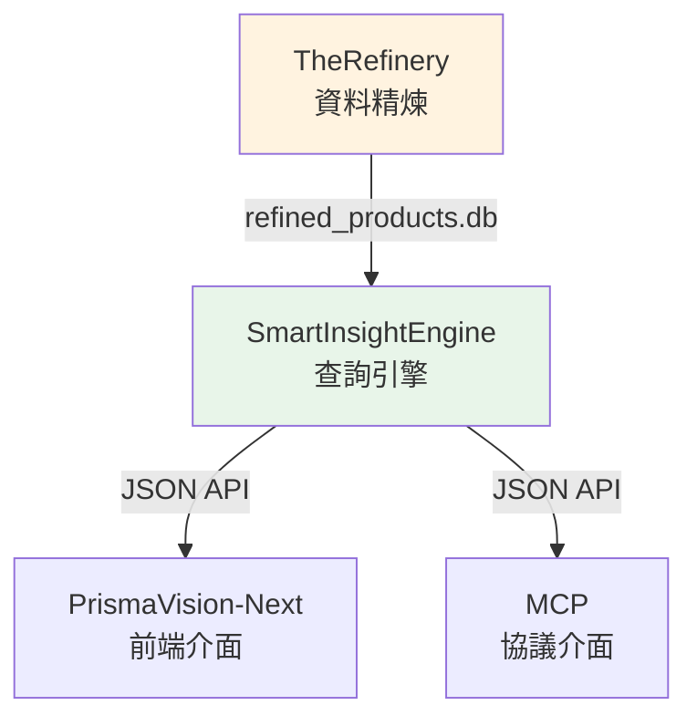
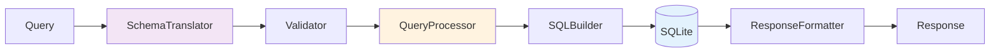

# SmartInsightEngine - 查詢引擎概覽

---

## 📋 文檔目的

本文檔提供 **SmartInsightEngine 查詢引擎的快速概覽**，幫助讀者理解：
- 系統的核心目標與定位
- Input/Output 格式
- 與其他系統的關係

> **深入學習**: 完整的學習路徑請參考 [smart-insight-engine/](smart-insight-engine/)

---

## 🎯 系統概述

**SmartInsightEngine** 是一個結構化查詢引擎，讓使用者能夠用 **MDOF 查詢語言** (Measure/Dimension/Filter/Options) 從保健食品資料庫中提取多維度洞察。

**一句話說明**:
將業務問題 ("哪個品牌的維他命 C 產品最多?") 轉換為結構化查詢，並返回可視覺化的分析結果。

**核心能力**:
- **資料規模**: ~130K 產品
- **維度支援**: 13 種分析維度 (Brand, SupplementFact, DosageForm...)
- **度量支援**: 10+ 種度量 (product_count, avg_price, price_distribution...)
- **彈性過濾**: 支援 any/all 組合邏輯

---

## 📥 Input: MDOF 查詢語言

### 查詢結構

```json
{
  "measure": "price_distribution",
  "dimensions": [],
  "filters": {
    "any": {
      "Brand": ["Nature Made", "Vitafusion"]
    },
    "all": {}
  },
  "options": {
    "bin_size": 10.0
  }
}
```

### 四大元素

| 元素 | 說明 | 範例 |
|------|------|------|
| **Measure** | 要計算的度量 | `price_distribution`, `product_count`, `avg_price` |
| **Dimensions** | 分析維度 (可多選) | `["Brand", "SupplementFact"]` |
| **Filters** | 篩選條件 | `{"any": {...}, "all": {...}}` |
| **Options** | 查詢選項 | `{"limit": 100, "bin_size": 10.0}` |

### 常見查詢模式

**模式 1: 分布分析** (無維度)
```json
{
  "measure": "price_distribution",
  "dimensions": [],
  "filters": {"any": {"Brand": ["Nature Made"]}, "all": {}},
  "options": {"bin_size": 10.0}
}
```

**模式 2: 多維聚合**
```json
{
  "measure": "product_count",
  "dimensions": ["Brand", "SupplementFact"],
  "filters": {"any": {}, "all": {}},
  "options": {"limit": 100}
}
```

---

## 📤 Output: 結構化回應

### 回應格式

```json
{
  "data": [
    {
      "dimensions": [],
      "measure_value": 45,
      "product_count": 45,
      "metadata": {
        "bin_start": 0.0,
        "bin_end": 10.0
      }
    },
    {
      "dimensions": [],
      "measure_value": 128,
      "product_count": 128,
      "metadata": {
        "bin_start": 10.0,
        "bin_end": 20.0
      }
    }
  ],
  "summary": {
    "total_rows": 8,
    "total_products": 892
  }
}
```

### 輸出結構

| 欄位 | 說明 |
|------|------|
| **dimensions** | 維度值列表 (陣列) |
| **measure_value** | 度量計算結果 |
| **product_count** | 符合條件的產品數量 |
| **metadata** | 額外資訊 (如 bin 範圍) |

---

## 🏗️ 系統架構與定位

### 在 LuminNexus 的位置



### 資料流

**輸入來源**:
- `refined_products.db` (from TheRefinery)
- 包含 ~130K 產品
- 已完成 Taxonomy mapping 與品質檢查

**輸出介面**:
- **PrismaVision-Next**: Web UI 查詢介面
- **MCP**: 協議介面 (支援 Claude Desktop 等工具)

---

## 🔧 核心特性

### 1. MDOF 查詢語言

**設計理念**: 將複雜的 SQL 查詢抽象為業務語言

**優勢**:
- 統一的查詢介面
- 自動處理 JOIN/GROUP BY
- 內建驗證與錯誤處理

### 2. 雙層架構 (CISC/RISC)

**簡化說明**:
- **CISC 層**: 使用者友善的查詢 (如 `co_occurrence_analysis`)
- **RISC 層**: 引擎底層的原子操作 (如 `product_count`)
- **自動轉換**: 系統自動將 CISC 轉換為 RISC 執行

**範例**:
```json
// 使用者輸入 (CISC)
{"measure": "supplement_fact_aggregation", "dimensions": []}

// 引擎執行 (RISC)
{"measure": "product_count", "dimensions": ["SupplementFact"]}
```

### 3. 維度與度量分離

**13 種分析維度**:
- 產品屬性: Brand, DosageForm, ServingSize
- 成分: SupplementFact
- 知識領域: HealthEffect, Certification, QualityOfLife...

**10+ 種度量**:
- 計數: `product_count`
- 價格: `avg_price`, `price_distribution`, `price_statistics`
- 成分: `avg_amount`, `sum_amount`
- 分析: `co_occurrence_analysis`

---

## 📊 使用案例

### 案例 1: 價格分布分析

**業務問題**: "Nature Made 品牌的產品價格分布如何？"

**MDOF 查詢**:
```json
{
  "measure": "price_distribution",
  "dimensions": [],
  "filters": {
    "any": {"Brand": ["Nature Made"]},
    "all": {}
  },
  "options": {"bin_size": 10.0}
}
```

**輸出解讀**:
- $0-10: 45 個產品
- $10-20: 128 個產品
- $20-30: 89 個產品
- ...

### 案例 2: 多維度產品計數

**業務問題**: "各品牌有哪些維他命 C 產品？"

**MDOF 查詢**:
```json
{
  "measure": "product_count",
  "dimensions": ["Brand", "SupplementFact"],
  "filters": {
    "any": {"SupplementFact": ["Vitamin C"]},
    "all": {}
  },
  "options": {"limit": 100}
}
```

**輸出解讀**:
- Nature Made + Vitamin C: 45 個產品
- Vitafusion + Vitamin C: 32 個產品
- ...

---

## 🔌 技術架構概要

### 核心元件



**處理流程**:
1. **SchemaTranslator**: CISC → RISC 轉換
2. **Validator**: 驗證查詢合法性
3. **QueryProcessor**: 協調查詢執行
4. **SQLBuilder**: 生成 SQL 語句
5. **ResponseFormatter**: 格式化輸出

### 資料庫配置

**主要資料庫**: `data/products_info.lucid.db`
- Denormalized schema (查詢優化)
- ~130K 產品
- 13 維度支援

---

## 📚 相關文檔

### 深入學習
- [smart-insight-engine/](smart-insight-engine/) - 完整學習路徑
  - 01_getting_started.md - 快速開始
  - 02_query_language.md - 查詢語言詳解
  - 03_measures_reference.md - 度量參考手冊
  - 04_dimensions_reference.md - 維度參考手冊

### 系統文檔
- [00_architecture-overview.md](../00_architecture-overview.md) - 系統架構全景
- [01_data-flow.md](../01_data-flow.md) - 資料流與系統串連
- [next.md](next.md) - PrismaVision-Next 前端
- [mcp.md](mcp.md) - MCP 協議介面

### 專案 README
- `LuminNexus-PrismaVision-SmartInsightEngine/README.md`
- `LuminNexus-PrismaVision-SmartInsightEngine/CLAUDE.md`

---

## 🎯 適用角色

### 必讀角色
- **前端工程師** - 理解查詢介面與回應格式
- **資料分析師** - 理解查詢能力與限制
- **產品經理** - 理解系統定位與使用案例

### 選讀角色
- **測試工程師** - 理解查詢驗證規則
- **後端工程師** - 深入學習請參考完整學習路徑

---

## ❓ 常見問題

### Q1: SmartInsightEngine 與一般 SQL 查詢有什麼差別？
**A**:
- SQL: 需要理解表結構、寫 JOIN、處理 NULL
- MDOF: 用業務語言描述需求，引擎自動處理技術細節

### Q2: 支援哪些查詢類型？
**A**:
- 聚合查詢 (計數、平均、總和)
- 分布分析 (價格分布、成分分布)
- 統計分析 (標準差、最大最小值)
- 共現分析 (成分共現模式)

### Q3: 如何開始使用？
**A**:
1. 閱讀 [smart-insight-engine/01_getting_started.md](smart-insight-engine/01_getting_started.md)
2. 查看測試案例: `tests/testcase/measures/`
3. 使用測試執行器: `python tests/v3_test_case_runner.py --all-measures`

### Q4: 查詢效能如何？
**A**:
- 簡單聚合: <1 秒
- 多維度查詢: 1-3 秒
- 複雜統計: 3-10 秒
- 資料規模: ~130K 產品

---

## 📝 文檔維護

### 版本歷史

| 版本 | 日期 | 作者 | 變更說明 |
|------|------|------|----------|
| 1.0 | 2025-12-09 | PrismaVision Team | 初版建立 |

### 維護職責
- **主要維護者**: PrismaVision Team - SmartInsightEngine
- **審核者**: Architecture Team
- **更新頻率**: 每季度檢視一次

---

**文檔結束**
