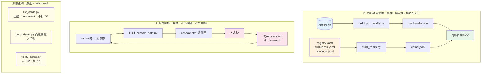
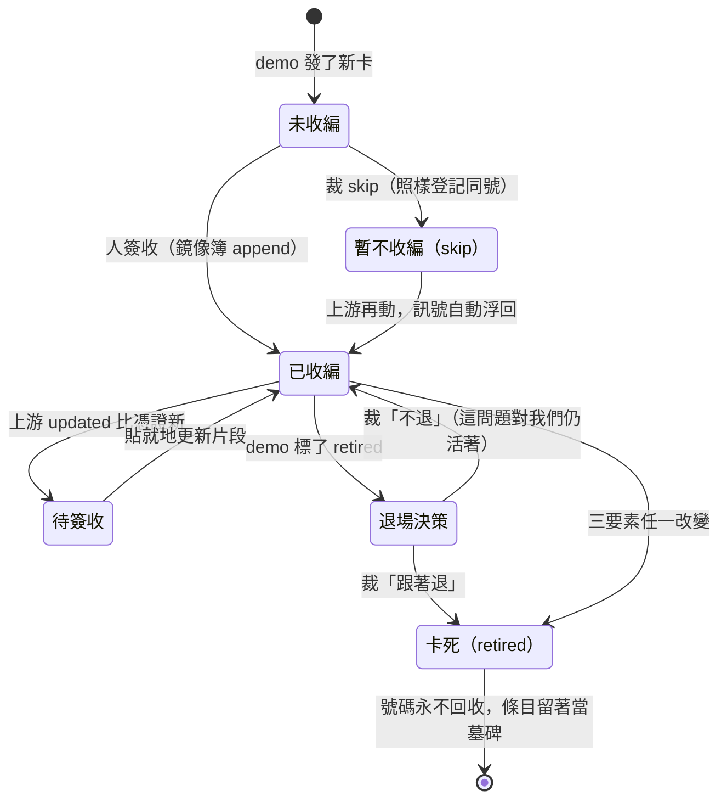
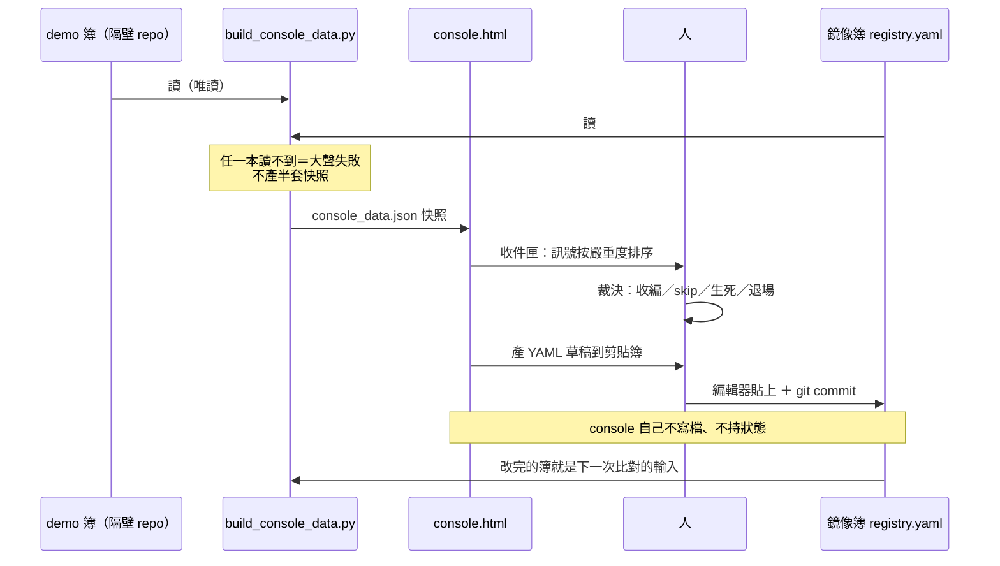
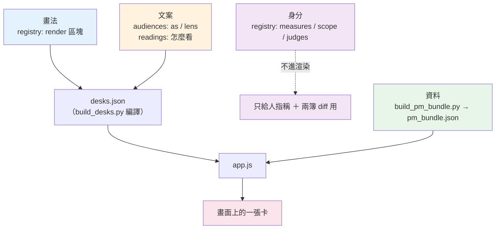

# TheJournalism · Parallax - 概念卡對位系統

---

## 📋 文檔目的

本文檔提供 **Parallax** 的系統導覽，給兩種讀者：**想理解這套系統怎麼運作的新人**，以及**要接手維護它的工程師**。

- Parallax 解決什麼問題（為什麼需要「對位」這件事）
- 為什麼它不是一條 pipeline，而是三個形狀不同的子系統
- 卡＝一個問題：三要素、生死規則、卡號制度
- 一張卡怎麼從資料庫變成畫面上的一張圖（四層分工）
- 人在迴路裡到底做什麼動作、寫入時哪一關會擋
- renderer 圖鑑：每種畫法長什麼樣、判讀重點在哪

> **給你的閱讀建議**：Parallax 跟 TheJournalism 本體的思路很不一樣，別把報告 pipeline 的直覺帶進來（見「⭐ 零 LLM」）。
>
> **想快速上手** → 只讀「🏗️ 系統架構 → 兩條流，一個接點」＋「🏗️ 系統架構 → 真相 vs 編譯產物」＋「🚀 使用方式」＋「🐛 常見問題與除錯」。其餘回頭再補。
>
> **要看懂畫面** → 直接跳「🔧 核心功能與機制 → 6. 一張卡怎麼變成一張圖」與「🔧 核心功能與機制 → 8. renderer 圖鑑」。

> **前置知識**：[thejournalism.md](thejournalism.md)（本系統的母系統，尤其 Clip URI 與三層架構）
>
> **完整技術文檔**：`parallax/OPS.md`（evergreen 操作手冊）、`parallax/README.md`（設計意圖）、`parallax/docs/`（設計 SSOT 與裁決紀錄）

---

## 🎯 系統職責

### 解決什麼問題

團隊在**另一個 repo** 做分析表的原型：`prismavision-business-model` 底下的 Astraline The Position Desk（跑在 `:8078`）。一張表在那裡確認「邏輯對、資料撐得住」之後，才收編進 Parallax，由 Parallax 自己的 pipeline 重新實作一遍。

問題是**上游不會停下來等**。系統必須接住四種上游變動：

| 上游做了什麼 | 落在哪一層 | 系統反應 |
|---|---|---|
| 同一張表改了名字 | 呈現層 | **系統無感** —— 顯示名根本不進系統 |
| 邏輯改了，但問的還是同一個問題 | 同卡的內容動靜 | 上游時間戳 bump → 兩簿 diff 出動靜 → 人簽收 |
| 邏輯改到問的問題都不一樣了 | 卡的生死 | 舊卡標 `retired`、發一張新卡（新號碼） |
| 同一張表出現在別的 desk | 桌 × 卡 | 同卡多落點，不發新 id |

同時 Parallax 自己的對齊狀態也是活的：同一張表某些部分已經驗過、某些等 pipeline、某些有 bug，每張表都不一樣。這些狀態要有地方住、要機器管得動、要有畫面給人看。

### 一句話定位

> **Parallax ＝ 一個「靜態網站產生器」，外掛一套「上游變動追蹤機制」。**

前半段（建置管線）跟 Hugo／Jekyll 同構，無聊得剛剛好：資料源 ＋ 設定檔 → build script → 靜態 JSON → 前端 fetch 渲染。有趣的全在後半段——它處理的是「上游改了，我怎麼知道、誰來決定」。

### 命名由來

**Parallax**（視差）—— 同一個對象從兩個視角看，位置會有偏移。兩本登記簿記著同一張卡，欄位可能對不上；那個偏移量就是系統要偵測與消化的東西。名字直接說明了機制。

### ⭐ 零 LLM：跟報告 pipeline 最根本的差異

**Parallax 裡沒有任何一行程式碼呼叫 LLM。** 全部是 Python ＋ YAML ＋ 前端 JS。`prep/` 底下所有 Python 的第三方相依只有 `PyYAML`，其餘全是 stdlib（`sqlite3` / `json` / `argparse` / `re` / `http.server`）。你不會在這裡找到 prompt、subagent，或「驗 LLM 輸出格式」的那一整套機制。

| | TheJournalism 報告 pipeline | Parallax |
|---|---|---|
| 形狀 | 一條線（Stage 1 → 7） | **三塊：管線 ＋ 迴路 ＋ 閘** |
| 判斷者 | **LLM**（窄範圍，配 script 驗證） | **人**（配 lint 驗證） |
| 中間產物 | 進 git ＝交付物 | **全 gitignored** ＝編譯產物，可重生 |
| 可回溯位址 | fact ID | 卡號 |
| 驗證重點 | 格式與參照 | **獨立重算數字** |

因此 Parallax 架構裡的「不確定性」不來自模型，而來自**上游會變**。你接下來看到的每一個機制，都在處理同一件事：**上游變了我怎麼知道、知道了誰來決定**——而決定者永遠是人。

所有你在報告 pipeline 裡熟悉的「怎麼讓模型別亂講」的設計，在這裡沒有對應物。

---

## 🏗️ 系統架構

### 為什麼不能用「一條 pipeline」來講

如果你剛讀完 TheJournalism 的報告 pipeline（Stage 1 → 7 一條線走到底），很容易把 Parallax 也想成一條線。**會誤導**——因為子系統 ② 根本不是管線，它是**迴路**：出口接回入口，而且中間那一段永遠是人。硬畫成線，你會找不到那個人該站在哪。

| | 形狀 | 誰在執行 |
|---|---|---|
| **① 資料建置管線** | 線性 · 確定性 | 機器全包，人只按 Enter |
| **② 對齊迴路** | 環狀 · 人在裡面 | **人是唯一的執行單元** |
| **③ 驗證閘** | 橫切在兩者的出口上 | 一支掛 pre-commit，兩支人手動 |



### 兩條流，一個接點

這是整套系統**最重要的一張圖**。① 和 ② 其實是兩條各自獨立的流，它們只透過一個檔案相連：


兩邊互不相識：

> **② 說：「我不知道 ① 存在。」**
> 對齊迴路只回答一個問題：**我這本簿跟隔壁那本對得上嗎**。它從不開 `distiller.db`、不碰 `pm_bundle.json`，也不知道畫面上有幾張圖。

> **① 說：「我不在乎簿怎麼來的。」**
> 建置管線把 `registry.yaml` 當成一份已經定案的規格書照做。是誰改的、為什麼改、上游同不同意，都不影響它的輸出。

這個解耦有很實際的後果：**你可以整週不跑巡檢，照樣重建畫面；也可以整天在簽收，一次都不重建畫面。** 兩邊的節奏各自獨立，唯一會互相影響的時刻，是有人改了簿。

`registry.yaml` 之所以是「唯一接點」，是因為它**身兼二職**——同一個檔案，兩組欄位，兩個消費者：

| 欄位群 | 誰用 | 用途 |
|---|---|---|
| `measures` / `scope` / `judges` | ② 迴路（console 的 `derive()`）＋ 人 | 跟隔壁簿逐字比對 |
| `status` / `note` | ② 迴路 ＋ 人 | 驗到哪了、有什麼已知落差 |
| `render:` | ① 管線（`build_desks.py` → `app.js`） | 查表指路：去哪拿資料、用哪支筆畫 |

### 真相 vs 編譯產物

接手時**第一個要建立的分界**：哪些檔案動了要 commit、哪些砍掉重跑就好。

| Source of truth（進 git） | Build artifact（gitignored） |
|---|---|
| `parallax/registry.yaml`<br/>鏡像簿：卡的身分（三要素）＋ `render:` 綁定 ＋ 簽收狀態 | `prep/out/pm_bundle.json`<br/>卡的**資料**（key ＝卡號）· 打 DB 重建，慢 |
| `parallax/audiences.yaml`<br/>2×4 策展簿：哪張卡進哪一格、用什麼 lens 讀 | `prep/out/desks.json`<br/>卡的**擺法** · 秒級重建 |
| `parallax/issues.yaml`<br/>`ISS-###` 帳：why／ruling／followup | `prep/out/console_data.json`<br/>兩本簿的 **diff 快照** · 開 console 前跑一次 |

`prep/.gitignore` 的內容只有一行 `out/` —— 整個 `prep/out/` 都不進 git。

**推論**：`prep/out/` 底下刪掉不會掉資料，只會讓畫面讀不到檔。反過來說，**畫面上任何數字都不是真相本身，而是某次 build 的結果**—— `pm_bundle.json` 舊了，畫面就舊了。真相只有三簿，動它們要 commit。

### 每支 script 的 INPUT / OUTPUT

| Script | INPUT | OUTPUT | 進 git |
|---|---|---|---|
| ① `prep/build_pm_bundle.py` | `distiller.db`（**直接開 DistillerDB，不走 L0 clip URI**） | `prep/out/pm_bundle.json` | ✗ |
| ① `prep/build_desks.py` | `registry.yaml` ＋ `audiences.yaml` ＋ `readings.yaml` | `prep/out/desks.json` | ✗ |
| ② `prep/build_console_data.py` | **兩本** `registry.yaml`（鏡像簿 ＋ demo 簿） | `prep/out/console_data.json` | ✗ |
| ② **人簽收** | `console.html` 顯示的訊號 | **`registry.yaml`** ← 真正的產物 | **✓** |
| ③ `prep/lint_cards.py` | 三簿 | exit code（0 / 1） | — |
| ③ `prep/verify_cards.py` | `pm_bundle.json` ＋ `distiller.db` | 逐卡驗證報告 | — |
| 前端 `app.js` | `desks.json` ＋ `pm_bundle.json` | 瀏覽器畫面 | — |

**兩條讀法**：所有 script 的產物都 gitignored，**唯一進 git 的產物是「人改的 yaml」**；而 `registry.yaml` 同時出現在 OUTPUT 欄和 INPUT 欄——那就是那個唯一接點。

各支的 CLI 參數見「⚙️ 配置與參數」。

### 支援模組（不是 CLI，但改它會動到所有卡）

| 檔案 | 是什麼 |
|---|---|
| `prep/populations.py` | **母體／口徑規則的 SSOT**。「哪些 row 算數」的規則以前散在 builder 好幾處（verify 又抄一份），漏套一處就是一整類 drift bug 的來源 |
| `prep/launch_cohort.py` | 「真新品」判定規則，從上游 `LAUNCH-DATE-SSOT.md` 移植，DAY granularity |
| `prep/market_membership.py` | 歸市規則。複製 `market_universe.py` 這份權威實作的規則，但**保持 Parallax-local**（不新增 L0 view） |
| `prep/probe_pm_desk.py` | 共用 helper：DB 連線、資料窗解析、guards |
| `prep/serve.py` | review server（port 見「⚙️ 配置與參數」）。不是 stock `http.server`，理由見 Q2 |
| `prep/probe_*.py` | 一次性探勘（假龍頭 texture 軸、movers baseline 誠實性、voice universe 設計）。**不是產線的一部分**，是決策留痕 |

---

## 🔑 關鍵概念

> 把系統術語翻成白話。分兩層：**🔴 必懂**（不懂會看不下去）與 **🟡 該懂**（用到再回來查）。
>
> 這裡**只收 Parallax 自己的詞**。跨系統通用的那些——`canonical`／`taxonomy`／`slug`／`cohort` 的一般定義見 [classification-terminology.md](../../general/classification-terminology.md)，`voice`／MVM／劑型／功能市場見 [supplement-industry-terminology.md](../../general/supplement-industry-terminology.md)。本文用到這些字時不再解釋。

### 🔴 最小必懂集合

| 名詞 | 白話 |
|---|---|
| **卡** | **一個問題**（一個概念）。不是一張圖、不是一段 SQL、也不是一個面板 |
| **三要素** | `measures`（量什麼）／`scope`（範圍）／`judges`（判斷什麼）。判斷「這是不是同一張卡」只看這三個欄位 |
| **卡號** | 全系統**唯一共用的 join key**。正典名就是裸號碼，口頭講「007 號卡」 |
| **demo 簿** | 上游 Astraline 那本登記簿（`Q-###`），住在隔壁 repo。對 Parallax 唯讀 |
| **鏡像簿** | Parallax 自己那本（`P-###`）。**就是隔壁那本簿的一份手抄副本**，加上自己的狀態與畫法 |
| **同號＝同卡** | `Q-007` 與 `P-007` 是同一張卡在兩本簿上的兩筆記錄 |
| **知會型** | 機器只**標記**差異、**永不自動同步**。上游變動是情報，不是命令 |
| **桌** | 一格 segment × role 的組合（例如「品牌商的 PM 桌」）。一張桌上擺幾張卡 |
| **cohort** | 「真新品」集合。資料窗內首次上市的 canonical 產品，經過三道 filter |

### 🟡 該懂：畫法相關

| 名詞 | 白話 |
|---|---|
| **`render:`** | registry 每卡的畫法綁定區塊。**這才是控制畫面的東西**，三要素完全不進渲染 |
| **`renderer`** | 畫圖函式的名字。`app.js` 的 `const RENDERERS` 是它的 SSOT |
| **`storage`** | 告訴 `app.js`「去 bundle 的哪裡拿資料」。值域與各自的取法見第 6 節的 `cardData()` 對照表 |
| **`calibre`** | 口徑開關。`mvm_switched` 表示這張卡要接「排除 MVM 與否」兩棵資料樹 |
| **`substrate`** | 多張卡共讀的一塊資料（目前只有 `voice_universe`），不掛在單一卡號下 |
| **`as` / `lens`** | 策展層文案：卡**在這一格叫什麼**、**在這一格回答什麼**。一格一份 |
| **`readings`** | 讀法簿：**圖形語法**（條長代表什麼、淡色那條是什麼）。一卡一份，跨角色共用 |

### 🟡 該懂：對齊相關

| 名詞 | 白話 |
|---|---|
| **`upstream_updated`** | 抄下來的上游時間戳。它同時是「這張卡有上游憑證」的標記 |
| **自生卡** | Parallax 自己發的卡（`901+` 號段），demo 那邊沒有，**不參與 diff** |
| **`status`** | 檢核項清單，每項有 `item` / `state` / `since`。這是 Parallax 對這張卡「驗到哪了」的紀錄 |
| **`ISS-###`** | 裁決帳的條目。每條有 `why`（發現什麼）→ `ruling`（人的裁決）→ `followup` |
| **`retired`** | 卡死了的標記。條目照樣留著當墓碑，**號碼永不回收** |

---

## 🔧 核心功能與機制

### 1. 卡＝一個問題：三要素與生死規則

**卡不是一張圖，是一個問題。** 判斷「這是不是同一張卡」只看三個欄位：

```yaml
measures: 資料窗內首次出現的新進品牌數與全量品牌數（品牌軸）
scope:    逐市場；新進判定＝真新品口徑（市集＋DTC、含 MVM、不隨納入規則切換），
          密度背景＝全量品牌、截至資料窗結束時點
judges:   我的市場在資料窗內湧入多少新品牌＝品牌軸的戰場擁擠度
```

三欄都是自由文字，但 **lint 強制單行**——「一行寫不下，代表問題還沒蒸餾好」。拆成三個獨立欄位是為了讓 diff 能指出「變的是量的、範圍的，還是判斷的」。

**生死規則**：

- **三要素任一變 → 舊卡死、新卡生。** 「同表邏輯改變」這個分類在系統中**不存在**——它要嘛是同卡的內容動靜，要嘛是卡的生死，沒有中間態
- **三要素不變的邏輯改**（修 bug、換算法）→ 同卡，`updated` bump，Parallax 收到一個動靜訊號
- **誠實邊界**：機器只擋得住格式層。原地改三要素 ＋ bump 可以讓一個號碼靜默換問題，防線是人

**卡沒有名字。** 顯示名是呈現層的事——同一張卡跨桌本來就有多個名字，不進註冊表。人指稱一張卡的正式方式是**卡號 ＋ `judges` 一行文字**。



### 2. 卡號制度

兩個 repo 之間**只共用一樣東西：三位數字**。除了號碼，什麼 id 都不共用（分桌不發新 id、資料 query 層不進系統、呈現層 id 與顯示名不進系統）。

| 成分 | 規則 |
|---|---|
| **號碼** | 卡的身分。**永不回收**：卡死了號碼跟著死，不補位 |
| **前綴** | 哪一本登記簿。demo 簿一律 `Q-###`、鏡像簿一律 `P-###` |
| **號段** | 出生地。demo 出生的卡發 **001–899**；Parallax 自生的發 **901 起**。號段互斥，兩邊各發各的，永不協調、永不撞號 |

**為什麼是號碼，不是名字**：兩本簿靠號碼機器 join，不用遍歷一一比對——demo 有、鏡像沒有＝新卡待簽收；兩邊都有但欄位不同＝上游改過；demo 標了 `retired` ＝卡死了，Parallax 自己決定退不退。

現況（有哪些卡號、卡數多少）不要背，查詢指令見「🚀 使用方式 → 常用查詢」。

### 3. 兩本簿與 diff 機制

「鏡像」不是什麼技術機制，就是**隔壁那本簿的一份手抄副本**。目的：記住「我上次確認過的上游狀態」，才能 diff 出「上游後來又動了」。

```
~/github/
├── LuminNexus-AlchemyMind-TheJournalism/
│   └── parallax/registry.yaml               ← 鏡像簿（P）
└── prismavision-business-model/
    └── module/astraline/demo/registry.yaml  ← demo 簿（Q）
```

> **以下是某時點的實際內容，用來說明抄了哪些欄位；現況請直接開兩本簿對照。**

**demo 簿的 `Q-003`**（欄位少，只描述卡本身）：

```yaml
id: Q-003
measures: 各功能市場的新品數
scope: 新品 cohort、逐功能市場
judges: 哪些功能市場湧入最多新品=擁擠 vs 空
updated: 2026-07-15
```

**鏡像簿的 `P-003`**（前四欄逐字抄，再加 Parallax 自己的三欄）：

```yaml
id: P-003
measures: 各功能市場的新品數                    # ← 抄的
scope: 新品 cohort、逐功能市場                  # ← 抄的
judges: 哪些功能市場湧入最多新品=擁擠 vs 空      # ← 抄的
upstream_updated: 2026-07-15                   # ← 抄的（記下對方的時間戳）
status:                                        # ← Parallax 自己的：驗到哪了
  - {item: 口徑對齊驗證（市場清單、level-3 歸市）, state: ok, since: 2026-07-16}
  - {item: 呈現改版（ISS-021）——條改市集/DTC 堆疊（零新資料、零量法改動）。,
     state: ok, since: 2026-07-20}
note: 已知本體論差——「功能市場」兩側指涉不同：demo＝HealthEffect taxonomy L3
      機轉節點橫切（HE 單表、product 級）、本地＝config/markets 需求側策展市場
      （HE+PE+QoL 三表、混 L3/L4 葉、canonical 級），清單交集≈0；同一棵 taxonomy
      樹的兩種切法，2026-07-16 裁決維持同卡          # ← Parallax 自己的
render:                                        # ← Parallax 自己的：怎麼畫
  title: 市場榜
  renderer: mrank
  storage: global
  rescope: false
  calibre: mvm_switched
```

**diff 原理**：拿 `Q-003` 的四欄 vs `P-003` 抄過來的四欄比對。

| 比對結果 | 意思 |
|---|---|
| 一樣 | 沒事 |
| 不一樣 | **上游改過了** → 進收件匣等人裁決 |
| demo 有、鏡像沒有 | **新卡待簽收** |
| demo 整條消失、我方有憑證 | **異常** → 找 demo 團隊（該標 retired 不該硬刪） |

`901+` 的自生卡在 demo 那邊沒有對應條目，**不參與 diff**。所以「鏡像簿卡數扣掉自生卡」應該等於「demo 簿卡數」——這是一個隨時可以自己驗的一致性檢查。

> diff 出了動靜之後，機器**永不自動同步**。為什麼要這樣設計，見「💡 設計原則 → 1. 知會型，不是同步型」。

### 4. 人在迴路裡做什麼

**紅線先講**：`console.html` 是純呈現層，**永遠不寫檔、不持狀態**——它 join 兩本簿、推導訊號、把 YAML 草稿**複製到剪貼簿**。寫入永遠是人在編輯器改 `registry.yaml` ＋ `git commit`。巡檢**不自動、不排程**。



**訊號全集**（`derive()` 推導，按嚴重度排序）與人的決定：

| 訊號 | 機器看到什麼 | 人要做什麼 |
|---|---|---|
| **異常** `anomaly` | 有憑證但 demo 簿整條消失 | 找 demo 團隊——該標 retired、不該硬刪；我方情報都在鏡像，不動 |
| **三要素變** `sign3` | 兩簿三要素逐字有一項不同（獨立觸發，不看時間戳） | **先裁生死**：措辭修正→就地更新；問題變了→請上游退舊發新。判錯＝同號靜默換了問題，機器救不回 |
| **待簽收** `sign` | demo 的 `updated` 比簽收憑證新 | 看 diff → 貼就地更新片段 → 有實質邏輯變動就順手加一條驗證待辦 |
| **退場決策** `retire` | demo 標了 retired、我方還沒表態 | 裁「跟著退」或「不退」。跟著退要連帶刪 `render:`、builder 計算段、audiences 所有引用格 |
| **未收編** `adopt` | demo 有、鏡像沒有 | 裁「收編」或「skip」 |
| **暫不收編** `skip` | `status` 有 `state: skip` | 與未收編同亮、同屬「收編候選」（skip 是候選池，不是沉底常態） |
| **回訪中** `revisit` | 卡乾淨、但還有未結的檢核項 | 看該項的 `since` 對照世界後來的變化，可解就去解 |
| **自生卡** `self` | `901+` 無憑證 | 不動 |
| **乾淨** `clean` | 都對上 | 不動 |

**收編一張新卡的七個動作**：

1. **簽收** → append 條目進 `registry.yaml`（自帶 `upstream_updated` ＋第一條待驗檢核項）→ commit
2. **實作資料** → `prep/build_pm_bundle.py` 加計算段，bundle key ＝卡號
3. **綁畫法** → `registry.yaml` 加 `render:` 區塊（renderer 沿用既有的，或在 `app.js` `RENDERERS` 新增一支）→ 重建 bundle
4. **編譯策展** → 跑 `build_desks.py`，卡自動進**總覽**並標「未進任何格——待策展」
5. **驗證口徑** → `verify_cards.py --card P-###` 獨立重算、**雙口徑都比**，過了才把檢核項翻 `ok`
6. **策展上桌 ＋ 寫讀法** → `audiences.yaml` 寫 `as`/`lens`、`readings.yaml` 寫怎麼看 → 重跑 `build_desks.py`。**零改 `app.js`**
7. **commit**（一批一 commit；pre-commit lint 自動把關；**禁用 `--no-verify`**）

### 5. 兩道寫入閘各擋什麼

分工判準：**lint 只讀 YAML，不打 DB、不讀 `app.js`**（掛在每次 commit 上，要快）；**`build_desks` 讀 `app.js` 與 bundle**（重，人手動跑）。兩者都 fail-closed，且都有**空砲自檢**——解析器壞掉時「通過」只是因為沒在驗。

#### 閘 A · `lint_cards.py`（pre-commit，自動）

觸發條件：本次 **staged 檔案**觸及 `parallax/{app.js, registry.yaml, audiences.yaml, issues.yaml, readings.yaml, prep/lint_cards.py}` 之一。找不到 `uv` 也 fail-closed 不放行。

擋這些（完整檢查項以 `lint_cards.py` 為準，這裡挑帶設計意圖的）：

1. **格式基本盤**：卡號格式 `^P-\d{3}$` 且不重複（號碼永不回收）、三要素非空**且必須單行**、`status` 每項 `item` / `state` / `since` 齊全、`issues.yaml` id 不得撞號（兩個 session 並行 append 真的撞過）
2. **號段守門**：沒有 `upstream_updated`（＝自生卡）→ 號碼必須 ≥ 901。用**真值判定**，空字串／`false` 佔位一律視同「無憑證」，防繞過
3. **audiences 的參照完整性**：`card` 必須**已存在於 registry**、無卡的缺口條目必附 `note`、每條 `as` 與 `lens` 齊全、role id ∈ `{pm, rd, mk, bd}`
4. **readings**：**檔案不存在直接 exit 1**（這本簿不得缺席）；key 是 `P-###`、卡存在、**非 retired**、**有 `render`**、**`storage ≠ none`**
5. **空砲自檢**：registry／readings 讀不到或解析不到 → 大聲失敗

**已知限制**：驗的是 **worktree 當下內容、不是 staged 版本**（`git add -p` 部分暫存時以 worktree 為準）。另外它在新 clone 上會**靜默完全不觸發**，見 Q6。

#### 閘 B · `build_desks.py` 內建驗證（人手動，fail-closed）

違規則不產檔、`exit 1`——**壞掉的 `desks.json` 永遠不會落地**。

1. `render.renderer` 必須 ∈ `app.js` 的 `RENDERERS`（用 regex 從 `app.js` 直接解析當 SSOT）
2. **`has_data()` —— 最硬的一條**：不是只查一個位置，而是**查 `app.js` switch 在任何開關組合下可能讀到的每一個位置**：
   - `calibre: mvm_switched` → 連 `{key}_incl_mvm` 一起驗
   - `variants` 含 `incl_base` → 連 `{key}_incl_base` 一起驗
   - `scoped` / `scoped_desk` → `scopes` 與 `scopes_incl_mvm` **兩棵樹 × 每一個 scope** 都要有該 key
   - 目的：**讀者按任何 checkbox 都不會把卡按爆**
3. **策展參照**：card 必須存在於 registry、必須有 `render:` 綁定、role id 合法
4. **retired 卡不可策展**（墓碑保留號碼，但不進 render 集、不吐總覽）
5. **空格（`cards: []`）必附 note**（才編成誠實空格）
6. **readings 多視圖 map 的 key 必須 ∈ `app.js` 視圖 id 全集**。擋的是最現實的故障：**key 打錯字，整段說明靜默不顯示**
7. **總覽也驗**：每張有 `render` 的卡都跑一次 `has_data()`，不只被策展的那些
8. **空砲自檢**：解不出任何視圖 id → 大聲失敗

只警告不擋：live 卡未進任何格（只在總覽露出）；尚無讀法說明的卡。

#### 閘 C · `verify_cards.py`（人手動，打 DB）

每張活卡跑**三種**檢查：

| 檢查 | 做什麼 |
|---|---|
| **independent recompute** | 照**文件規則**從 `distiller.db` 重新推導一次，跟 bundle 比。**絕不 import builder 的 code path** |
| **invariants** | bundle payload 的結構自洽性（加總、排序、不超過母體…） |
| **acceptance assertions** | 從踩過的坑反推出來的守門斷言 |

「絕不 import builder 的程式碼」是整套驗證的靈魂：**驗證器若用 builder 的函式算，builder 有 bug 驗證器也跟著錯，驗了等於沒驗。** 這是 differential testing——用兩個獨立實作互相驗證。

以品牌榜為例，實際的檢查項長這樣：

```
recompute per-brand mkt/dtc      ← 逐品牌的市集/DTC 數字對不對
recompute top-set (tie-tolerant) ← 榜上該有誰（容許並列）
invariant mkt+dtc=total          ← 市集 ＋ DTC 必須等於總數
invariant total descending       ← 排序真的是降冪嗎
invariant total<=n_cohort        ← 任何一列不能超過母體
acceptance no dup brand_slug     ← 同一個 slug 不能出現兩次
acceptance _raw_generic excluded ← 無品牌集合桶必須不在榜上（ISS-004）
```

**驗證結果存在 `registry.yaml`，靠人翻**：跑完之後人手動把該卡「口徑對齊驗證」那條的 `state` 改成 `ok`，git 就是 changelog。這也是為什麼 `status` 是 registry 的一部分。

### 6. 一張卡怎麼變成一張圖

四路資料匯進一支函式。**這是理解畫面的關鍵圖**：



**最容易誤解的一點：三要素從來沒進過渲染路徑。** 證據：

- `build_desks.py` 編譯時**只取 `c["render"]`**，三要素完全沒被編譯進 `desks.json`
- `app.js` **全檔沒有任何一處讀 `measures` 或 `judges`**

三要素的真正消費者只有三個：**人**（指稱卡）、**`console.html` 的 `derive()`**（逐字比對觸發訊號）、**`lint_cards.py`**（驗非空且單行）。

`app.js` 拿到兩個 JSON 後做的事：

1. 從 `desks.json` 查「這一格要擺哪些卡」（總覽走 `overview.cards`）
2. 對每張卡，看 `render.storage` → 去 `pm_bundle.json` 撈對應資料（`cardData()` 就是一個 switch）
3. 看 `render.renderer` → 呼叫對應的畫圖函式
4. 把 `as` / `lens` / `reading` 的文案貼上去

`cardData()` 是**唯一把「畫法宣告」與「資料」接起來的地方**：

| `storage` | 去哪拿 |
|---|---|
| `global` | `BUNDLE[卡號]` |
| `substrate` | `BUNDLE[render.substrate]`（多卡共讀） |
| `scoped` | `scopes[當前範圍].spine[卡號]` |
| `scoped_desk` | `scopes[當前範圍].desk[卡號]` |
| `none` | `null`（誠實空卡，不預期有資料） |

兩個全域 checkbox 在這裡**改寫 key**：`calibre == 'mvm_switched'` 且沒排除 MVM → 用 `key + '_incl_mvm'`；`variants` 含 `incl_base` 且沒排除基礎營養素 → 用 `key + '_incl_base'`。這就是閘 B 的 `has_data()` 要窮舉所有組合的原因。

**兩個對照實驗**（最能說明四層分工）：

- **同資料、不同圖**：`voice_universe` 這一塊 substrate 資料同時餵三張卡（象限泡泡／機會象限＋綠地清單／佔比條榜）。資料一模一樣，圖完全不同——**差別只在 `render.renderer` 一行**
- **同函式、不同圖**：兩張卡共用同一支 `rank` 函式，但畫出來的欄位不同——**差別只在 `render` 宣告的 `label` / `val` / `sec` / `sec2`。換一個 `val` 就換一張圖，不用碰 `app.js`**

### 7. `render:` 欄位字典

| 欄位 | 合法值 | 語意 | 誰讀 |
|---|---|---|---|
| `renderer` | 見 `app.js` 的 `const RENDERERS` | 用哪支畫圖函式 | `build_desks` 驗 ∈ RENDERERS；`app.js` 派送 |
| `storage` | `global` / `scoped` / `scoped_desk` / `substrate` / `none` | 去 bundle 的哪裡拿資料 | `cardData()` 的 switch |
| `calibre` | `fixed` / `mvm_switched` | 要不要接「排除 MVM 與否」兩棵樹 | `cardData()` 改寫 key |
| `variants` | `[incl_base]` | 額外的口徑變體（排除基礎營養素與否） | `cardData()` 改寫 key |
| `substrate` | `voice_universe` | 共讀的資料塊名稱（`storage: substrate` 時必填） | `cardData()` |
| `rescope` | `true` / `false` | **純呈現**：卡頭範圍標籤顯「跨市場」還是市場名。**不影響撈資料** | `cardHead()` |
| `title` | 自由字串 | 卡頭標題。**只在總覽、或某格沒寫 `as` 時**才顯示 | `app.js` |
| `label` / `val` / `unit` | 欄位名（`label` 常見 `brand` / `dosage_form` / `ingredient`） | 通用 renderer 的欄位映射：列名讀哪一欄、主值欄（條長依據）、值的單位標籤 | 通用 renderer |
| `sec` / `sec2` ＋ `secHead` / `sec2Head` | 欄位名＋表頭字串 | 第二／第三值欄與它們的表頭。**有 `sec` 就自動長出「排序」tab** | 通用 renderer |
| `secDenom` | 欄位名 | 分母欄。**有它就自動附上分母揭露** | 通用 renderer |
| `ui_note` | 自由字串 | 卡底**口徑註解**（方法論，不是讀法） | `app.js` |
| `why` | 自由字串 | `backlog` 卡專用：說明為什麼還沒上線 | `backlog` renderer |

> **`ui_note` vs `readings` vs `lens` 的三方分界**（很容易混）：
> `ui_note` 寫**口徑警告**（這個數字的分母是什麼、覆蓋率多少）；`readings` 寫**圖形語法**（條長代表什麼、淡色那條是什麼），一卡一份；`lens` 寫**角色用法**（PM 讀這張是什麼、RD 讀同一張是什麼），一格一份。
>
> 判準是「**隨不隨角色變**」。圖形語法若寫在策展層，一張進了好幾格的卡就要抄好幾遍——而「其他幾處都排了、唯獨一處漏排」這種 bug 真的發生過（ISS-029）。

### 8. renderer 圖鑑

**技術實作只有三種基底，零外部函式庫、零 canvas**：

1. **條類** —— 絕對定位的 `div`，`width` 給百分比（`值 ÷ 該榜最大值 × 100`）。疊條就是兩個 div 疊放
2. **象限／散佈類** —— 手寫 inline `<svg>`，座標在 JS 裡算好再串進樣板字串
3. **清單類** —— 純 DOM（手風琴、註記）

共通機制：hover 讀數統一走 `data-tip`，文法是「標的 · 值＋單位（相對於什麼）」，**不寫算式**（推導住 legend／卡註）；值欄一格一概念（主數字深色、佐證欄淡色，**禁止在同一格用「·」並排兩個裸數字**）。

> **一條硬紀律**：象限類的散佈點**絕不位移**——軸承載判定門檻，推過線＝改掉卡的判定。只位移標籤並在位移大時補引線。反之「又弱又大」那張允許點碰撞推擠，因為該軸不承載門檻。這是有意識的差別。

以下逐支列出**資料形狀**與**判讀重點**。實際長什麼樣請直接開畫面對照——靜態文字描述再細也追不上 renderer 的改版，這裡只負責讓你知道「這支在回答什麼問題、看的時候該注意什麼」。

**速查表**（本節每一支都是 H4，不會出現在網站側欄目錄，用這張表跳）：

| renderer | 一句話用途 |
|---|---|
| [`rank`](#rank--條榜多值欄可切排序) | 一組項目照單一數字排高低，佐證欄可切著當排序依據 |
| [`brank`](#brank--品牌榜市集dtc-疊條) | 品牌的新品量排名，同一條裡拆出市集與 DTC 兩段 |
| [`mrank`](#mrank--市場榜擠空兩視圖) | 市場的擁擠程度排名，反序過來就是「哪裡還空著」 |
| [`biviews`](#biviews--品牌原料榜三視圖) | 品牌原料的三種看法：新品採用量／全庫標配度／標配度反序找空窗 |
| [`track`](#track--價格帶軌) | 把新品的均價與中位放進全庫價格帶上，看定價偏離常規多少 |
| [`arrivals`](#arrivals--新品雷達唯一無圖的資料卡) | 逐件列出窗內新品，可展開看標示成分 |
| [`crowding`](#crowding--新進品牌-watch) | 各市場湧入多少「全新品牌」，配全量品牌數當背景刻度 |
| [`owners`](#owners--owner-集中度供應守門) | 原料商手上的 BI 觸及多少品牌，順帶標出單一來源風險 |
| [`margintrap`](#margintrap--margin-陷阱雙點棒棒糖) | 哪些劑型的新品定價低於全庫常規（毛利警訊） |
| [`movers`](#movers--上新動能本窗-vs-前窗) | 品牌上新量的本窗 vs 前窗對比 |
| [`odm`](#odm--獵單員高聲量缺劑型名單) | 找「聲量高、卻沒做某個劑型」的品牌，當代工開發名單 |
| [`sellto`](#sellto--客戶開發換牌綠地) | 針對一支品牌原料，列出可換牌與全新綠地的目標品牌 |
| [`coform`](#coform--配方搭檔共配強度) | 一個主成分實際常跟誰搭配（比碰巧同框高多少） |
| [`dose`](#dose--劑量顧問log-分箱直方圖) | 新品的用量分布疊在全庫常規分布上，看有沒有偏移 |
| [`scorecard`](#scorecard--行情官市場體質--佔兩欄寬) | 用價格與失敗密度兩軸給市場分象限，看哪塊又貴又難做 |
| [`skubloat`](#skubloat--精簡師sku-臃腫) | 找 SKU 鋪很多、但每支帶不動聲量的品牌 |
| [`leadertexture`](#leadertexture--假龍頭識破佔兩欄寬) | 分辨市場龍頭是真的強，還是靠鋪很多支撐出來的量 |
| [`voicepos`](#voicepos--陣地能見度一份資料兩種讀法) | 一個品牌在它擠進的每個市場站第幾名、佔多少 |
| [`growth`](#growth--成長軍師佔兩欄寬) | 找「市場夠大、自己卻站得弱」的上行戰場，外加缺席的綠地市場 |
| [`backlog`](#backlog--誠實空卡) | 還沒上線的卡也占一格，明寫卡在什麼地方 |

---

#### `rank` — 條榜（多值欄可切排序）

**資料形狀**：`[{label 欄, val 欄, sec 欄, sec2 欄, secDenom 欄}]`
**判讀重點**：有價品數（`priced_n`）通常小於新品數——價格欄的分母不是全部產品。

---

#### `brank` — 品牌榜（市集／DTC 疊條）

**資料形狀**：`[{brand_slug, brand, new_marketplace, new_dtc, new_total}]`
**判讀重點**：無品牌集合桶（`_raw_generic`）不上榜（ISS-004）。

---

#### `mrank` — 市場榜（擠／空兩視圖）

**資料形狀**：同 `brank`，多一個 `market_key`
**判讀重點**：「空」視圖不是另一份資料，就是同一份反序——找空白市場用。

---

#### `biviews` — 品牌原料榜（三視圖）

**資料形狀**：`[{branded_ingredient, owner, fg_new_products, bg_total_brands}]`

---

#### `track` — 價格帶軌

**資料形狀**：`[{dosage_form, fg_new_count, fg_avg_pps, fg_median_pps, bg_band:{p10,p50,p90}, fg_*_percentile_in_catalog}]`
**判讀重點**：全軌共用尺度，所以軌的**相對位置**才是訊息；點落在帶外＝新品定價偏離全庫常規。

---

#### `arrivals` — 新品雷達（唯一無圖的資料卡）

**資料形狀**：`[{name, brand, form, pps, date, src, url, facts:{label_type, blend, marks, actives:[{name,amt}], more, full:[…]}}]`

---

#### `crowding` — 新進品牌 watch

**資料形狀**：`[{market_key, market, bg_brands, new_brands}]`
**判讀重點**：「新進品牌」≠「有新品的品牌」——要求該市場**每一件**產品都是窗內真新品。

---

#### `owners` — owner 集中度（供應守門）

**資料形狀**：`[{owner, n_bis, reach, top_bi, single_source}]`

---

#### `margintrap` — margin 陷阱（雙點棒棒糖）

**資料形狀**：`[{dosage_form, fg_new_products, fg_median_pps, fg_avg_pps, bg_p50_pps, ratio, ratio_avg}]`
**判讀重點**：觸發器刻意用**中位**（單一高價離群品不該把警報消音），但主要看的點是均價比。

---

#### `movers` — 上新動能（本窗 vs 前窗）

**資料形狀**：`{prior_start, prior_end, cur_start, cur_end, sources, excluded_sources, settled, edge_margin_days, maturity_shift_days, rows:[{…, cur, prev, delta, delta_pct}]}`
**判讀重點**：這是**全系統唯一真的窗差**（其他卡都是單窗快照）。而且窗會被「成熟前緣」往回搬——資料尚未 settle 時，比較的窗尾比 `cohort_end` 更早，才能兩窗對等。

---

#### `odm` — 獵單員（高聲量缺劑型名單）

**資料形狀**：`{forms:[…], food_excluded, rows:[{brand_slug, brand, voice, n_sku, forms:{…}}]}`

---

#### `sellto` — 客戶開發（換牌／綠地）

**資料形狀**：`{bis:[{bi_id, name, owner, generic, resolved_via, reach, switch:[…], greenfield:[…]}]}`
**判讀重點**：通用成分是三段 fallback 解析出來的（BI 分類 → 別名表 → 通用父類），`resolved_via` 記錄命中哪一段。

---

#### `coform` — 配方搭檔（共配強度）

**資料形狀**：`{n_cohort, mains:[{main, n_x, ceiling, partners:[{ingredient, co, n_y, lift}]}]}`
**判讀重點**：一堆搭檔並列在 ceiling 上是**病**（lift 停止排序）；只有少數幾個在天花板上才是真的獨佔配伍（ISS-009）。

---

#### `dose` — 劑量顧問（log 分箱直方圖）

**資料形狀**：`{mains:[{ingredient, n_cohort, n_norm, unit_purity, edges:[…], cohort_hist:[…], norm_hist:[…], cohort_p:{…}, norm_p:{…}}]}`
**判讀重點**：兩側套**同一組過濾**（不像上游只過濾一邊）；單位不純的成分整個踢出。

---

#### `scorecard` — 行情官（市場體質 · 佔兩欄寬）

**資料形狀**：`[{market_key, market, n_prod, n_brand, avg_pps, med_pps, pct_lt4, rating_coverage}]`

---

#### `skubloat` — 精簡師（SKU 臃腫）

**資料形狀**：`[{brand_slug, brand, n_sku, voice, vps}]`

---

#### `leadertexture` — 假龍頭識破（佔兩欄寬）

**資料形狀**（substrate）：`voice_universe.markets[key] = {n_universe, total_voice, peer_persku_median, top:[{brand_slug, brand, rank, share, voice, sku, per_sku, texture}]}`
**判讀重點**：`texture` 必須用未 round 的值相除；`peer_persku_median` 是給人看的顯示欄，不是實際分母。

---

#### `voicepos` — 陣地能見度（一份資料兩種讀法）

**資料形狀**（substrate）：`voice_universe.brand_index[slug] = {market: [rank, share, voice, sku]}`
**判讀重點**：品牌在**每個**它擠進母體的市場都被索引，不限名次——因為「又弱又大」那張卡需要弱位置。

---

#### `growth` — 成長軍師（佔兩欄寬）

**資料形狀**（substrate）：`voice_universe.markets[key].total_voice` / `n_universe` ＋ `brand_index[slug][key][0]`
**判讀重點**：這張允許點碰撞推擠——該軸不承載判定門檻。缺席的市場不畫在圖上，另列綠地清單。

---

#### `backlog` — 誠實空卡

**資料形狀**：無（`storage: none` → `null`）

---

> **有幾種 renderer？** 不要背——以 `app.js` 的 `const RENDERERS` 為準：
> ```bash
> grep -A40 'const RENDERERS' parallax/app.js | grep -oE '^\s+[a-z]+:' 
> ```
> 而且「map 裡有幾個 key」和「有幾支被活卡使用」可能不同（有 renderer 的唯一使用者已 retired）。要看實際使用狀況，比對 `registry.yaml` 的 `renderer:` 欄位。

### 9. 2×4 策展與「卡沒有名字」

「2×4」是**兩個維度的乘積，不是數量**：

```
         pm         rd         mk         bd        ← 4 種角色（role）
brand    定位桌     配方桌     訴求桌      ——        ← 品牌商
material 定位桌     配方桌     訴求桌     動向桌      ← 原料商
         ↑ 2 種客戶（segment）
```

- **2** ＝兩種客戶：品牌商 `brand`（決策：下一個產品做什麼、進哪市場、怎麼定位）／原料商 `material`（決策：這支料賣什麼給誰、怎麼定位）
- **4** ＝四種角色：PM 定位桌／RD 配方桌／MKT 訴求桌／BD·Sales 動向桌

相乘理論上八格，但**實際有卡的格數以 `audiences.yaml` 為準**——某些組合刻意沒有桌，缺格條目要附 `note` 說明（lint 與 build 都會驗）。每一格是一張「桌」，上面擺幾張卡。

**同一張卡可以進很多格——而且在每一格叫不同名字。** 這是「卡沒有名字」原則的實物：卡在 `registry.yaml` 裡只有 id 與三要素，**叫什麼是策展層（`audiences.yaml`）的事**。

例如同一張市場榜，在不同格的 `as` / `lens` 可能是：

| 格 | 這格叫它 | 這格的讀法（lens） |
|---|---|---|
| brand / pm | 我的戰場擁擠度 | 你想打的市場近期湧入多少新品＝這塊戰場多擠 |
| brand / mk | 訴求空位 | 哪個訴求市場擠、哪個還空＝你的切入點 |
| material / pm | 我的戰場擁擠度 | 你的料要打的市場湧入多少新品 |
| material / rd | 成分落點 | 這類活性都聚在哪些功能市場＝配方該往哪個訴求靠 |
| material / bd | 開發熱區 | 哪些品類新品數最多＝該去開發的區（單窗量，非趨勢） |

**這幾格拿的是同一份資料**（`pm_bundle.json` 裡那一個卡號 key），差別只在標題與 lens 文案。所以「換個講法給另一種客戶看」不需要動資料，只要改 `audiences.yaml` 再重跑 `build_desks.py`。

查現況：

```bash
# 每格有哪些卡
python3 -c "
import yaml
for s in yaml.safe_load(open('parallax/audiences.yaml')):
    for r in s['roles']:
        print(s['id'], r['id'], [c['card'] for c in r['cards']])
"
```

### 10. 統一模型（#369，2026-07-23 落地）

這是 Parallax 架構上最重要的一次重構，理解它才知道為什麼「加一張卡不用改 `app.js`」：

| | 之前 | 之後 |
|---|---|---|
| 卡的 render 綁定 | 寫在 `app.js` 的 `SPINE` const | 搬回 `registry.yaml` 每卡的 `render:` 區塊 |
| 桌策展 | 寫在 `app.js` 的 `DESKS` const（1×4） | 搬到 `audiences.yaml`（2×4 segment × role） |
| 編譯 | 無 | `prep/build_desks.py` 把兩簿編譯成 `desks.json` ＋ fail-closed 驗證 |
| `app.js` | 含硬編策展 | **零硬編策展**，fetch `desks.json` 後純照著畫 |

**結果**：加一張卡 ＝ registry 加身分 ＋ `render:`、audiences 放進某幾格、readings 寫讀法，重跑 `build_desks.py`。**零改 `app.js`**。

（唯一殘留的硬編呈現決策是「哪些 renderer 佔兩欄寬」那個集合，仍寫在 `app.js`，尚未升格成 `render.span` SSOT。）

---

## 📊 資料格式與 Schema

### `registry.yaml` 條目結構

頂層是一個 list，每個條目是一張卡：

```yaml
- id: P-###                    # 卡號，^P-\d{3}$
  measures: …                  # 三要素之一（單行）
  scope: …                     # 三要素之二（單行）
  judges: …                    # 三要素之三（單行）
  upstream_updated: YYYY-MM-DD # 上游時間戳；沒有這欄＝自生卡（號碼須 ≥901）
  retired: true                # 可選：卡死了（墓碑保留）
  status:                      # 檢核項清單
    - item: 口徑對齊驗證（…）
      state: ok                # ok / waiting / bug / skip / retired / backlog
      since: YYYY-MM-DD
  note: …                      # 已知落差、限度、裁決摘要
  render:                      # 畫法綁定（見「render: 欄位字典」）
    title: …
    renderer: …
    storage: …
    calibre: …
```

### `audiences.yaml` 結構

```yaml
- id: brand                    # segment id
  name: 品牌商
  decision: 下一個產品做什麼、進哪市場、怎麼定位
  roles:
    - id: pm                   # ∈ {pm, rd, mk, bd}
      name: PM · 定位桌
      h1: 我站在哪              # 桌標題
      sub: …                   # 桌副標
      cards:
        - card: P-###
          as: 我的戰場擁擠度     # 這格叫它什麼
          lens: …              # 這格回答什麼（角色用法）
          src: …               # 來源走線標記
    - id: bd
      cards: []
      note: …                  # 空格必附 note（誠實空格）
```

### `readings.yaml` 結構

以卡號為 key 的 map，值是「怎麼看這張圖」的散文（圖形語法）：

```yaml
P-###: |
  條長是…，淡色那條是…，按鈕按下去會換掉…
P-###:                         # 多視圖卡：per-視圖 map
  view_a: |
    …
  view_b: |
    …
```

多視圖 map 的 key 有硬約束（`build_desks.py` 會驗，見「🔧 核心功能與機制 → 5. 兩道寫入閘各擋什麼 → 閘 B」第 6 條）。

### `desks.json`（編譯產物，禁手改）

```json
{
  "_generated_by": "prep/build_desks.py",
  "_note": "compiled from registry.yaml (身分+render) + audiences.yaml (2×4 策展)",
  "segments": [ … ],
  "overview": { "show": true, "cards": [ … ] }
}
```

每張卡的 key 只有 `id` / `as` / `lens` / `render` / `reading` —— **三要素完全沒被編譯進來**（第 6 節那條「三要素不進渲染」的直接證據）。

### `pm_bundle.json`（編譯產物）

**卡號直接當 JSON 的 key**：

```json
{
  "cohort_basis": "true-new canonical launches (…)",
  "cohort_start": "YYYY-MM-DD",
  "cohort_end":   "YYYY-MM-DD",
  "cohort_window_days": N,

  "P-003":          [ { "market_key": "…", "new_marketplace": 9, "new_total": 9 }, … ],
  "P-003_incl_mvm": [ … ],
  "P-901":          [ … ],
  "P-018":          { … },
  "P-018_incl_base":{ … },

  "scopes":          { "__all__": { "n_cohort": …, "spine": {…}, "desk": {…} }, "…": {…} },
  "scopes_incl_mvm": { … },
  "voice_universe":  { "markets": {…}, "brand_index": {…} },
  "guards":          { "batch": {…}, "channel": {…}, "launch_filter": {…} },
  "market_names":    { … },
  "brands":          [ … ],
  "me_index":        { … }
}
```

> **方向容易搞反**：不是「把產品編成一張 key」，而是**逐卡備料、用卡號當 key**。

**這是「卡號＝全系統唯一 join key」的實體證據**——同一組三位數字同時是：`registry.yaml` 的條目 id、`audiences.yaml` 的策展引用、`pm_bundle.json` 的資料 key、`app.js` 的查表鍵。**四個地方靠同一組數字對上。**

### `cohort`：「真新品」怎麼判定

`launch_cohort.py` 的三道 filter：

1. **canonical dedup** —— key ＝ `canonical_id`（孤兒列 fallback 到自己）。多來源／重新上架的多筆掛牌算**一件**
2. **launch ＝ MIN over trusted members** —— 取**最小**日期。這條才擋得住「重新掛牌」：舊品換新頁面時新頁面的首見日是今天，但舊成員留著更早日期，取 MIN 就落在窗外。取 MAX 或取當列都會把重新掛牌誤算成上市
3. **onboarding false-new guard** 三部分：
   - **官網來源整源剔除** —— 它的首見日是「我們開始監測」的日期，不是上市日；且缺 UPC 讓 canonical merge 接不回市集孿生列（暫時性，等上游修好）
   - **目錄傾倒偵測** —— 同一品牌同一天上架量與佔比雙雙超標 → 該成員不帶上市日
   - **首次接觸偵測** —— 用了 fallback 日期、且那天正好是該店最早觀測日 → 不帶上市日

這三道 filter 用到的口徑常數（`EDGE_SETTLE_DAYS`、`BATCH_SPIKE_FACTOR` 等）見「⚙️ 配置與參數」。

---

## 🔌 介面說明

Parallax 的對外介面**全部是唯讀的單向讀取**——它讀三個地方，不對任何人供資料。

**母系統**：TheJournalism。`parallax/` 是它的一個子目錄，不是獨立 repo。

### 上游一：`distiller.db`（數字的唯一來源）

唯讀。`build_pm_bundle.py` **直接開 DistillerDB，不走 L0 Clip URI**——理由見 Q1。

### 上游二：Astraline demo 簿（卡的情報來源）

唯讀、非 submodule。路徑是 `prismavision-business-model/module/astraline/demo/registry.yaml`。

> ⚠️ **新人一定會撞到的前置條件**：這本簿住在**另一個 private repo** `prismavision-business-model`，要**另外申請存取權**。而且它**必須 clone 在與 TheJournalism 同一層目錄**——`build_console_data.py` 是用同層鄰居的相對路徑去找它的，位置不對就讀不到檔，② 對齊迴路整條跑不起來（臨時放別處可用 `--demo-repo` 覆寫）。
>
> 沒有這個 repo，① 建置管線照樣跑得動（它不碰 demo 簿），但你看不到收件匣、也做不了任何簽收。

### 對父 repo 的唯一耦合：`../dashboard/shared/`

design tokens 與 base chrome 直接重用父 repo dashboard 的那組共用 CSS（`tokens.primitive.css` / `tokens.css` / `base.css`）。**若 Parallax 日後獨立拆出，這組檔案要跟著走**——這是唯一一條會扯到的線。

### 反向依賴：無

Parallax 單向讀上游；上游不需要知道 Parallax 存在也能照常運作。它的產物（`prep/out/`）只給自己的前端消費，不對外供給資料。

---

## ⚙️ 配置與參數

### 資料窗參數（CLI）

`build_pm_bundle.py` 的窗參數定義在 `probe_pm_desk.add_window_args()`，三支 script 共用同一份：

| 參數 | 預設 | 說明 |
|---|---|---|
| `--start YYYY-MM-DD` | — | 資料窗起，**必須與 `--end` 同時給**，否則 `SystemExit` |
| `--end YYYY-MM-DD` | — | 資料窗迄，**inclusive**（SQL 內部轉半開 `[start, end_excl)`） |
| `--asof YYYY-MM-DD` | 今天 | 窗尾；語法糖模式 `[asof-days, asof]` |
| `--days N` | `WINDOW_DAYS` | `--asof` 模式的窗長 |
| `--out` / `--print` | — | `build_desks.py`：輸出路徑／同時印到 stdout |
| `--demo-repo` | 同層鄰居目錄 | `build_console_data.py`：覆寫 demo repo 路徑 |
| `--registry` | 預設路徑 | `lint_cards.py` |
| `--card P-###` | 全部 | `verify_cards.py`：只驗一張卡 |

> ⚠️ 資料窗是 **build-time debug 旋鈕，UI 永不暴露**。UI 只把 active window 當唯讀 badge 顯示，使用者不能挑。實際跑的窗以 `pm_bundle.json` 裡的 `cohort_start` / `cohort_end` 為準——`README.md` 裡的建議窗只是**建議**，不下參數時跑的是預設值。

### review server 的 port

`prep/serve.py` 起在 **8079**（團隊約定）。它不是 stock `http.server`，多加了一個 `Cache-Control: no-cache` header——為什麼非加不可見 Q2。

### 口徑常數（`prep/populations.py`）

**名稱記住，值以 `populations.py` 為準**（這支模組為什麼存在，見「🏗️ 系統架構 → 支援模組」）：

| 常數 | 管什麼 |
|---|---|
| `MACRO_NUTRIENTS` | 營養標示巨量列，從食品型產品漏進來，永遠不是配方訊號 |
| `BUCKET_WORDS` | 具名複方桶（blend / complex / matrix…）＝容器列不是成分 |
| `RAW_GENERIC` | 無品牌集合桶，多處排除 |
| `VOICE_UNIVERSE_MIN_SKU` | 聲量母體門檻，讓 rank 的分母誠實 |
| `PRICE_MIN_N` | 價格統計最低樣本（n≤2 時中位＝均值，雙欄會顯示同一個數） |
| `MVM_LANGUAL_CODES` / `MVM_INGREDIENT_THRESHOLD` | 綜合維他命判定：LanguaL 為主、成分列數僅 fallback |
| `BATCH_SPIKE_FACTOR` | 批次匯入尖峰偵測倍數 |
| `EDGE_SETTLE_DAYS` | 資料是否已 settle 的判準（決定 movers 窗要不要往回搬） |

---

## 🚀 使用方式

### 接手第一天，照這個順序跑

```bash
cd ~/github/LuminNexus-AlchemyMind-TheJournalism

# ① 建資料（窗參數見「⚙️ 配置與參數」；不給就用預設值）
uv run python parallax/prep/build_pm_bundle.py --start YYYY-MM-DD --end YYYY-MM-DD

# ① 編譯策展
uv run python parallax/prep/build_desks.py

# 起 review server
uv run python parallax/prep/serve.py
# → http://localhost:8079/parallax/index.html
```

```bash
# ② 巡檢（⚠️ 人手動觸發，不自動、不排程）
uv run python parallax/prep/build_console_data.py
# → 開 http://localhost:8079/parallax/console.html 看收件匣
# → 人裁決 → 改 registry.yaml → git commit
```

```bash
# ③ 驗證
uv run python parallax/prep/verify_cards.py                # 全部（慢，打 DB）
uv run python parallax/prep/verify_cards.py --card P-###   # 只驗一張
# lint_cards.py 掛 pre-commit，自動跑；新 clone 記得：
git config core.hooksPath .githooks
```

### 常用查詢（取代背數字）

（「有哪些 renderer」的查法見「🔧 核心功能與機制 → 8. renderer 圖鑑」節末。）

```bash
# 有哪些卡、卡數
grep -E '^- id:' parallax/registry.yaml
grep -cE '^- id:' parallax/registry.yaml

# 每張卡綁哪個 renderer / storage
python3 -c "
import yaml
for c in yaml.safe_load(open('parallax/registry.yaml')):
    r = c.get('render') or {}
    print(c['id'], r.get('renderer','—'), r.get('storage','—'), r.get('title',''))
"

# 裁決帳現況
python3 -c "
import yaml, collections
i = yaml.safe_load(open('parallax/issues.yaml'))
print(collections.Counter(x['state'] for x in i))
print([x['id'] for x in i if x['state']=='open'])
"

# 實際跑的資料窗（不要相信文件裡的建議窗）
python3 -c "
import json
b = json.load(open('parallax/prep/out/pm_bundle.json'))
print(b['cohort_start'], '~', b['cohort_end'], b['cohort_window_days'], 'days')
"
```

---

## 🐛 常見問題與除錯

### Q1: 我可以用 `journalism clip` 驗 Parallax 的數字嗎？

**不行。** Parallax **繞過 L0**——`build_pm_bundle.py` 直接開 `DistillerDB`，不走 Clip URI。它跟 dashboard 走同一個 precedent：`distiller.db → prep/（離線）→ 靜態 bundle → SPA`。

`market_membership.py` 的註解明講：複製 `market_universe.py` 這份權威實作的規則，但**保持 Parallax-local，不新增 L0 view**。理由是這套 cohort 切片邏輯目前只有 Parallax 一個消費者，提升到 L0 是**過早抽象**——等第二個消費者出現再議。

所以兩邊是**平行實作**，數字可能有細微差異，不該互相當驗證。要驗 Parallax 的數字，用 `verify_cards.py`。

### Q2: 為什麼 `file://` 打開 `index.html` 是空白的？

`app.js` 用 `fetch()` 取 bundle，Chrome 把 `file://` 視為 cross-origin 直接擋掉。必須經 `prep/serve.py` 走 http。

而 `serve.py` 不是 stock server —— 它加了 `Cache-Control: no-cache`。因為 stock `http.server` 不送 cache header，Chrome 的 heuristic freshness（檔案年齡的 10%）會讓 stale 的 `app.js` / `app.css` 卡好幾個小時，你改了程式重新整理卻看到舊 UI。

### Q3: 改了讀法文案，畫面沒變？

`readings.yaml` 是**內聯進 `desks.json`** 的。改了讀法沒重編 `desks.json`，畫面上看到的是舊文案。重跑 `build_desks.py`。

同理，改 `audiences.yaml` 的策展、改 `registry.yaml` 的 `render:`，全部要重跑 `build_desks.py` 才生效。**只有改 builder 計算段才需要重跑 `build_pm_bundle.py`**（那個慢，要打 DB）。

### Q4: 畫面上某個市場的新品數異常少，是市場真的冷嗎？

**很可能不是。** 逐市場的 scope 資料**結構性稀薄**：歸市要靠 HealthEffect / PerformanceEnhancement / QualityOfLife 事實列，而剛上市的新品多半還沒被抽出這些事實。所以逐市場 cohort 加總會遠小於「全地盤」的總量，逐市場的卡幾乎是空的（價格欄可能全 `null`）。

這是**抽取覆蓋率問題，不是市場冷**。`README.md` 也記了同一件事：單一市場的市集 cohort 很薄，全地盤才是資訊豐富的視圖。

另外要注意資料窗：不下 `--start/--end` 就跑預設值，而近期窗會有兩個已知污染——近期到貨還沒完成分類（讓逐市場更薄）、以及可能撞上爬蟲批次匯入（`guards.batch` 就是在偵測這個）。跑之前先確認 `pm_bundle.json` 的 `cohort_start` / `cohort_end` 是你要的窗。

### Q5: `verify_cards.py` 跑出紅字，是不是壞了？

先分三種情況：

1. **已知且被容忍的 FAIL** —— 有卡的註記明寫「這裡的 mismatch 是某個已記錄的落差，跟之前一樣」。看到不要慌，但也不要因此養成忽略紅字的習慣
2. **bundle 不新鮮** —— 用舊 bundle 對新規則驗會得到假紅。跑之前先重建 bundle
3. **新卡沒註冊 check** —— 會回 "no check registered" 並 exit 1，這是設計行為（新卡必須寫 check 才能驗）

另外要知道：**有少數幾張卡刻意不做獨立重算**（哪幾張看 `verify_cards.py` 的 check 註冊表），只驗結構與守門。它們的 PASS 是**較弱的證據**——通過只代表「形狀對」，不代表「數字對」。

### Q6: 三道防線，哪些是自動的？

**只有一道。**

| 層 | 驗什麼 | 何時跑 |
|---|---|---|
| `lint_cards.py` | yaml 格式、卡號存在、號段守門 | **自動**（pre-commit） |
| `build_desks.py` | 策展 ↔ bundle 的結構自洽 | 人手動 |
| `verify_cards.py` | 數字對不對（獨立重算） | 人手動 |

而且第一道在**新 clone 上會靜默失效**——沒跑 `git config core.hooksPath .githooks` 就不會觸發。接手第一件事就是設這個。

### Q7: 兩道閘都攔不到什麼？

**「卡的量法改了、`readings.yaml` 的散文沒跟著改」。**

drift 軸是 `app.js` ↔ 散文，任何存放位置與 lint 都改不了，只能靠人工紀律。設計文件誠實記下這個代價。

另一半風險由號碼制度承擔：三要素變＝舊卡退場、新卡發號，而新卡缺 readings 條目會被擋下。

還有一個更根本的：`build_desks.py` 是**人手動跑**的，不掛 pre-commit。所以你可以 commit 一份策展了不存在資料的 `audiences.yaml`——只要不跑 build 就不會被發現。掛 pre-commit 的 `lint_cards.py` 只驗 yaml 格式，不打 bundle。

---

## 💡 設計原則

> 「🔧 核心功能與機制」回答**怎麼運作**，這一節回答**為什麼這樣定**。第 1 條決定了整套系統長什麼樣，其餘四條都是它的推論。

### 1. 知會型，不是同步型

**原則**：機器只**標記**上游差異，**永不自動同步**。

```python
# 不是這樣（同步型）
if upstream_changed:
    mirror = upstream.copy()      # 自動同步，差異＝故障

# 而是這樣（知會型）
if upstream_changed:
    signal_to_human()             # 只標記，等人決定
```

| | 同步型 | **知會型（實際）** |
|---|---|---|
| 上游一改 | 下游自動跟著改 | 機器只**標記**差異 |
| 下游的定位 | 上游的複本，差異＝故障 | 自己重新實作的表，**差異是預期的** |
| 需要什麼 | 對照引擎把兩邊拉成一致 | 以號碼 join 兩份檔案、diff 共用欄位 |
| 人的角色 | 只在自動化壞掉時介入 | **align 永遠是人的簽收動作** |

**為什麼**：Parallax 的表是自己 pipeline 重新實作的，不是上游的複本。上游改了不代表這邊該改——**那是情報，不是命令**。反過來說，如果採同步型，兩邊任何一處合理的實作差異都會被當成故障，系統會不斷發假警報。

### 2. 機器只強制格式層

**原則**：lint 管得動的只有「有掛卡號、卡號存在、動了要 bump」這類機械可判定的事。語意層（掛對卡沒、三要素寫得實不實）**不為它另造機制**。

**為什麼**：語意層已經有兩張天然的網——發卡＝改註冊表，git 有 commit 紀錄；對齊時人拿卡對表，寫得不實會當場發現。再造一套機制只會多一個要維護的東西，擋住的還是同一批問題。誠實邊界寫在第 1 節：原地改三要素 ＋ bump 可以讓一個號碼靜默換問題，防線是人。

### 3. 最小 harness

**原則**：lint 掛兩邊現成引擎，不另起爐灶；每加一個欄位、一條規則之前先問「不加行不行」。

**為什麼**：這套系統的維護者就是使用者本人。多一條規則就多一次要記得的例外，而規則的價值必須大於它的記憶成本才划算。

### 4. 註冊表只放「現在的認知」

**原則**：所有歷史住 git，註冊表只留當下狀態。欄位取捨判準：**工作流會不會拿它來「比對」**——會比對的是運轉零件（時間欄、`since`），進註冊表；只是想知道「當時發生什麼」的是歷史，查 git。

**為什麼**：註冊表是每次巡檢都要人眼掃過的檔案。混進歷史，它會越長越長，最後沒人願意讀——而讀不動的登記簿就等於沒有登記簿。

### 5. 單向讀上游

**原則**：Parallax 讀上游，但不產生任何反向依賴。上游不需要知道 Parallax 存在。

**為什麼**：上游是別的團隊的 repo，節奏不歸這邊管。一旦上游要為 Parallax 做任何事，「上游不會停下來等」這個前提就變成協調成本，整套對位機制存在的理由也跟著消失。

---

## 📚 相關文檔

### 本專案內

- [`thejournalism.md`](thejournalism.md) —— **母系統**。Parallax 住在它的 `parallax/` 子目錄；先讀它建立 L0 / L1 / L2 與 Clip URI 的直覺
- [`00_overview.md`](00_overview.md) —— PrismaVision 層總覽

### 通用概念（先備知識）

- [`../../general/classification-terminology.md`](../../general/classification-terminology.md) —— **canonical（正典）／taxonomy／slug／cohort** 的通用定義。本文只講這些概念在 Parallax 的**特化用法**（例如「cohort」在這裡專指窗內真新品集合），一般定義不再重述
- [`../../general/supplement-industry-terminology.md`](../../general/supplement-industry-terminology.md) —— **voice（聲量）／MVM／劑型（dosage form）／功能市場 vs 品類**。renderer 圖鑑裡那些欄位名（`voice`、`n_sku`、`dosage_form`、`market_key`）全都出自這套產業術語

### 源 repo 內（`LuminNexus-AlchemyMind-TheJournalism/parallax/`）

| 檔案 | 是什麼 |
|---|---|
| `OPS.md` | **evergreen 操作手冊** —— 只寫現況、隨系統更新，歷史看 git。實際操作以它為準 |
| `README.md` | 設計意圖：foreground × background 模型、data substrate、architecture、bundle cost、layout、status |
| `docs/20260715_concept_card_registry_design.md` | **設計 SSOT** —— 卡的定義、三要素、生死觀、設計原則 |
| `docs/20260715_card_console_design.md` | 管理台（收件匣）設計 |
| `docs/20260722_unified_desk_curation_architecture.html` | **設計 SSOT** —— 統一策展架構（#369／#372；`build_desks.py` 引它） |
| `docs/20260728_card_reading_design.md` | 讀法簿設計：readings vs lens vs ui_note 的分工判準 |
| `docs/20260714_card-verification-design.md` | 驗證設計：三種檢查、為什麼不 import builder |
| `docs/20260719_subset_not_whole_population_principle.md` | 子集不是母體的原則 |
| `issues.yaml` | 裁決帳：每條 `why` → `ruling` → `followup`。**想知道某個奇怪設計為什麼這樣，先搜這裡** |

### 相關工具

- **`parallax-walkthrough` skill** —— UX 盲點稽核工具（不是教學工具）。讓 agent 扮「第一次看到桌面」的角色使用者，動作前說預期、動作後比對實際，把落差記成盲點。用在「找桌面不直覺的地方」，不掃 `console.html`（收件匣使用者是設計者本人，無天真訪客）
- **計算層深潛** —— `build_pm_bundle.py` 逐卡算了什麼、口徑規則、計算陷阱，另有一份較深的解剖材料（本文只覆蓋到「資料從哪來、怎麼被消費」的層次）

---

## 📝 文檔維護

### 版本歷史

| 版本 | 日期 | 作者 | 變更說明 |
|---|---|---|---|
| 1.0 | 2026-07-30 | Dustin | 首版。合併三份教學材料（設計哲學／三子系統與規格／渲染層），renderer 圖鑑改用等寬示意圖，所有可變數字改寫成查詢指令 |
| 1.1 | 2026-07-31 | Dustin | 修導航與章節骨架：① 閱讀導航的兩條捷徑指到不存在的標題，改成「H2 → H3」全名；② renderer 圖鑑的 H4 不進網站側欄目錄，補一張錨點速查表；③ 依 `DOCUMENTATION_POLICY.md` 補三個標準章節——「🔌 介面說明」（收攏原「系統定位」，並補上 Astraline demo 簿在另一個 private repo、且必須與 TheJournalism 同層 clone 的前置條件，這是全 repo 唯一寫下此事的地方）、「⚙️ 配置與參數」（集中原本散在三處的窗參數、port、口徑常數）、「💡 設計原則」（原 §4「知會型不是同步型」升為第 1 條，核心功能節專責「怎麼運作」）；④ 相關文檔補「通用概念（先備知識）」指向兩份術語文，關鍵概念節改為只收 Parallax 自己的詞；⑤ 修正「正典」誤用（canonical 已定案為「同義寫法的代表」，此處指的是權威實作）；⑥ 依本檔自訂的「不內嵌可變數字」原則，清掉六處會漂移的計數；⑦ **移除 renderer 圖鑑的 20 張等寬示意圖**（約 225 行）——靜態文字追不上 renderer 改版，畫面長什麼樣直接開來看即可；該節保留「資料形狀」與「判讀重點」，那兩樣才是文件該承擔的。連帶消除一處與產業術語文的口徑衝突（`odm` 圖說「voice 只算 Amazon 評論數」，而術語文定義 voice ＝ Amazon 評論數＋iHerb 評分數）|

### 維護職責

- **文檔擁有者**: TheJournalism Team
- **更新時機**: 三子系統邊界調整、`render:` 欄位增減、`storage` 值域變動、寫入閘檢查項變動、卡號制度變更時
- **維護原則**: **不在本文檔內嵌可變動的清單或數字**（卡數、renderer 種數、issue 條數、策展落點、檔案大小、行號、資料窗）。需要時改寫成查詢指令，避免文檔與程式碼漂移
- **與源 repo 文件的分工**: 本文是**教材**（講「為什麼這樣設計、怎麼理解」）；操作以 `parallax/OPS.md` 為準（evergreen runbook），設計決策以 `parallax/docs/` 的 SSOT 為準。三者衝突時，**以源 repo 為準**

### 系統依賴

**上游依賴**：`distiller.db`（TheDistiller）、Astraline demo 簿（`prismavision-business-model` repo）、`../dashboard/shared/` 的共用 CSS。三者的性質、存取前置條件與耦合範圍見「🔌 介面說明」。

**下游依賴**：無。

---

**文檔結束**

> **注意**：本文檔為新人導覽與接手用的系統教材，詳細技術實作請參考源 repo 的 `parallax/OPS.md`（操作）與 `parallax/docs/`（設計 SSOT）。renderer 的實際樣貌請直接開畫面對照；所有清單與數字請用文中提供的查詢指令取得現值。

*"機器只標記，人來裁決" - Machines flag, humans rule* 🎯
