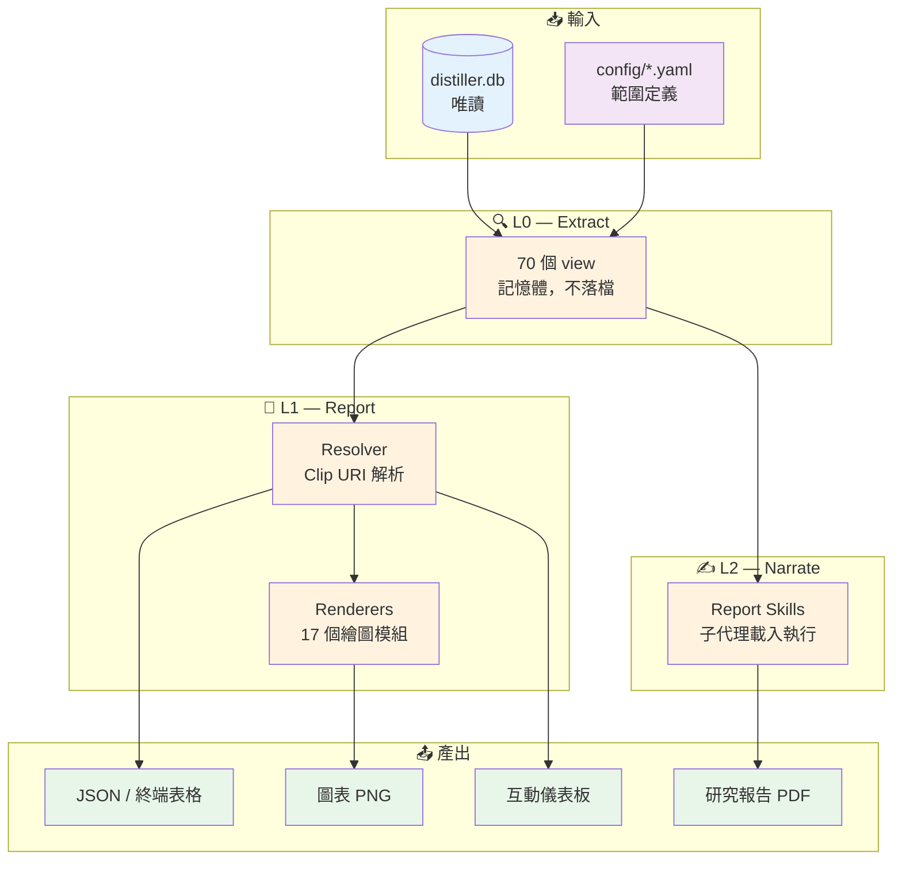

# TheJournalism - 資料詮釋層

---

## 📋 文檔目的

本文檔提供 **TheJournalism** 的系統導覽，幫助**新人建立對這套系統的整體理解**：

- TheJournalism 在 PrismaVision 層的定位（它跟 pipeline 型系統有何不同）
- 它的核心比喻：新聞編輯室的三層分工 L0 / L1 / L2（Extract / Report / Narrate）
- Clip URI 介面：一行字串如何決定產出什麼
- 一份把系統術語翻成白話的**名詞對照表**（放在「🔑 關鍵概念」）

> **給你的閱讀建議**：先看「🎯 系統職責」的命名由來與「🗞️ 三層架構」建立直覺，再看「🔑 關鍵概念」的名詞對照表時**只讀標 🔴 的 9 個**即可上手；其餘 🟡 用到再回來查。

> **完整技術文檔**：TheJournalism 專案的 `CLAUDE.md`、`LORI.md`（設計哲學）、`INTERPRETATION.md`（敘事工藝）、`CLIP.md`（URI 語法）
> **操作指南**：`.claude/skills/` 目錄下的報告 pipeline skills

---

## 🎯 系統職責

**TheJournalism** 是 PrismaVision 層的**資料詮釋層**，負責把 AlchemyMind 產出的結構化產品資料庫，轉換成人能讀、能引用、能出版的分析內容。它與 SmartInsightEngine 同屬資料消費側——後者回答「查詢」，前者回答「這批資料在講什麼故事」。

保健食品市場有數十萬件產品，資料庫裡每一欄都是事實，但人看不出故事。「NOW 有 465 件關節產品」和「Swanson 有 399 件」擺在一起沒有意義；要等到把聲量除以產品數，看出前者的每件產品拿到的注意力是後者的六倍，才成為一個可以講的發現。TheJournalism 的工作就是**把事實加工成可讀的觀點，而且每一句話都能追回原始數字**。

### 核心職責

| 項目 | 說明 |
|------|------|
| **職責** | 資料萃取、視覺化呈現、多視角敘事生成 |
| **輸入** | distiller.db（唯讀）+ config/ 範圍定義 YAML |
| **輸出** | JSON / 圖表 PNG / 互動儀表板 / 研究報告 PDF |
| **處理規模** | 342,668 products、2,917,089 supplement facts、18,911 brands |
| **覆蓋範圍** | 24 個功能市場、70 個成分、7 個分析 scope |

### 核心價值

- **事實與解讀分離**：資料萃取層不做任何詮釋，解讀只發生在最上層，兩者可分別驗證
- **每句話可追溯**：報告裡的每個數字都有引用編號，能一路追回原始查詢
- **多視角而非唯一答案**：同一批事實可由不同角度、甚至不同模型產出不同報告

### 命名由來

**Journalism**（新聞業）—— 這套系統的分工直接借用新聞編輯室：資料庫是**線人**，L0 是**跑線記者**（帶回素材，不加評論），L1 是**編輯台**（決定版面與圖表），L2 是**專欄作家**（寫出觀點）。

新聞業之所以是好的比喻，在於它早就處理過同一個難題：**如何在保有觀點的同時，讓事實可被查核**。記者不寫社論，社論不改數字，這條界線在本系統被實作成 L0 / L1 / L2 的層邊界。

（這延續了 LuminNexus 用命名承載概念的傳統，如 TheArgus 取自百眼巨人 Argus Panoptes，象徵全面監控。）

### 系統定位

- **Layer**: PrismaVision (Layer 3)
- **上游**: TheDistiller（`distiller.db`）—— **跨層依賴**，來自 AlchemyMind (Layer 2)
- **同層**: SmartInsightEngine（查詢引擎）、PrismaVision-Next（前端介面）
- **下游**: 對外交付的報告、簡報與儀表板

---

## 🏗️ 系統架構



**資料流說明**：

1. **範圍先定義，再取數** —— `config/markets/*.yaml` 宣告「什麼算是關節健康市場」，L0 依此組出產品集
2. **L0 不落檔** —— 70 個 view 是函式呼叫，回傳記憶體中的 JSON，程式結束即消失
3. **Clip URI 是唯一介面** —— L1 與 L2 都透過同一組 URI 取數，沒有第二條路徑
4. **產出由消費端決定** —— 同一包資料，存成 PNG 是圖、存成 factlist 是事實庫、不存就只是終端上一段輸出

---

## 📥 輸入資料 (Input)

### 主要來源

| 來源 | 內容 | 供給方 |
|------|------|--------|
| `distiller.db` | 產品、成分、品牌、功效訴求、品質檔案 | TheDistiller |
| `config/markets/*.yaml` | 24 個功能市場的邊界定義 | 本專案人工維護 |
| `config/ingredients/*.yaml` | 70 個成分的 UNII 與關鍵字定義 | 本專案人工維護 |
| `config/panels/*.yaml` | 編輯手選的產品比較清單 | 本專案人工維護 |

### 資料規模

以 schema 3.26.1 為例（`uv run journalism info` 可查當前值）：

| 資料表 | 筆數 |
|--------|------|
| SupplementFact | 2,917,089 |
| OtherIngredients | 1,513,304 |
| Products | 342,668 |
| HealthEffect | 528,287 |
| Brands | 18,911 |
| BrandedIngredients | 5,750 |

> **注意**：config 定義的是**邊界**不是資料。改一個 market 的 YAML，該市場所有 view 的結果同時改變。

---

## 📤 輸出資料 (Output)

### 1. L0 產物 —— 沒有檔案

L0 的 70 個 view **沒有磁碟寫入**。它們是函式，回傳 `dict`，用完即丟。系統中不存在 `output/l0/` 這類目錄。

這是新人最常見的誤解。正確理解是：**L0 提供內容，檔案由消費端決定要不要存。**

### 2. L1 產物 —— 圖表與快取

| 產物 | 位置 | 是否進 git |
|------|------|-----------|
| 圖表 PNG | `output/charts/{scope}/{key}/{view}/{renderer}.png` | 否 |
| 儀表板快取 | `dashboard/cache/` | 否 |
| 資料庫結構指紋 | `data/snapshots/YYYYMMDD/*.json` | **是** |

### 3. L2 產物 —— 事實庫與報告

| 產物 | 位置 | 說明 |
|------|------|------|
| 事實庫 | `data/highlights/{scope}/{key}/*.factlist.json` | 帶引用編號的結構化事實，**與任何一次報告解耦** |
| 報告中間產物 | `docs/reports/{日期}_{key}_report/` | 敘事骨架、圖表清單、章節草稿 |
| 最終報告 | 同上目錄的 `report.{lang}.{md,pdf,html}` | 中英雙語、六種版面風格 |

> **來源真相 vs 衍生物**：事實庫是來源真相（SSOT），可餵給多份報告、newsletter 與儀表板；報告是衍生物，重跑即可再生。

---

## 🗞️ 三層架構：Extract / Report / Narrate

這是理解本系統的**唯一核心比喻**。三層的分界只有一條判準：**這個輸出包含「選擇」嗎？**

> **稱呼約定**：本文以 **L0 / L1 / L2** 指本系統內部的三層，以 **Layer 1 / 2 / 3** 指 LuminNexus 生態系的三大層（AtlasVault / AlchemyMind / PrismaVision）。TheJournalism 整體位於生態系的 **Layer 3**，其內部再分 L0 / L1 / L2。

| 層 | 英文 | 新聞業對應 | 回答什麼問題 | 產物 | 可重現 |
|----|------|-----------|-------------|------|--------|
| **L0** | Extract | 跑線記者 | 事實是什麼？ | 記憶體 dict | ✅ 完全 |
| **L1** | Report | 編輯台 | 怎麼呈現才看得懂？ | 圖表、表格、快取 | ✅ 完全 |
| **L2** | Narrate | 專欄作家 | 這意味著什麼？ | 敘事文字 | ❌ 每次不同 |

判準的展開：

```
這個輸出包含「選擇」嗎？
├─ 沒有 ─────────────────────────► L0
└─ 有
   ├─ 選擇固化在程式碼裡，每次一樣 ─► L1
   └─ 選擇每次可能不同（LLM 決定）──► L2
```

**標定案例**（判準的實際應用）：

| 案例 | 層 | 理由 |
|------|----|----|
| 算出集中度指標 HHI = 0.235 | L0 | 公式就是公式，沒有選擇 |
| 只取前 30 名、依數量排序、畫成長條圖 | L1 | 有選擇，但寫死在程式裡 |
| 決定這一章要講品牌集中度 | L2 | 每次可能不同 |
| 說「Terry Naturally 佔 48.5%」 | L0 | 這是數字 |
| 說「BCM-95 高度依賴單一品牌」 | L2 | 同一份資料，這是判斷 |

> **記住三層的一句話**：最後兩列是精髓 —— **同一份資料、兩種說法、分屬不同層**。第一句可以查核，第二句需要被說服。

---

## 🔧 核心功能與機制

### 1. Clip URI 系統

一行字串同時指定「看誰、看什麼、怎麼呈現」，是 L0 與 L1 之間唯一的介面。

```
{scope}/{key}/{view}?{參數}#{renderer}
```

```bash
uv run journalism clip "market/joint_health/brand_distribution#hbar"
```

同一個 view 換 renderer 即換呈現方式，**不需修改任何程式碼**。這正是「編輯選擇固化在程式碼裡」的具體實作 —— 選擇存在，但它被寫成一段可重現的字串。

### 2. 七個 Scope 與 70 個 View

| Scope | 分析單位 | key 來源 |
|-------|---------|---------|
| `market` | 功能市場 | config YAML（24 個） |
| `ingredient` | 成分 | config YAML（70 個） |
| `brand` | 品牌 | 資料庫解析 |
| `branded-ingredient` | 品牌成分 | 資料庫解析 |
| `owner` | 原料商／集團 | 資料庫解析 |
| `superlatives` | **跨市場排行** | 固定為 `all` |
| `panel` | 編輯手選產品組 | config YAML |

> **清單會變，指令不會**。view 的完整清單請用 `uv run journalism list clip` 查詢，不要相信任何文件裡抄下來的清單。

### 3. 一個 View 是什麼

**一個 view = 對資料庫提出的一個固定問句**，產物是一包 JSON。

```json
// market/joint_health/brand_distribution
{ "brands": [
    { "brand_name": "NOW",     "product_count": 465,
      "total_voice": 1196375,  "voice_density": 1.95 },
    { "brand_name": "Swanson", "product_count": 399,
      "total_voice":  175026,  "voice_density": 0.33 } ] }
```

view 存在的理由不是「存資料」，而是這兩件事：

- **預先算好「該怎麼比」** —— 不丟原始數字，直接給 density、lift、share、rank
- **自帶誠實性註腳** —— 主動宣告分母涵蓋率、樣本量與可信度等級

第二點是有紀律的：每個指標帶 `SOLID` / `FRAGILE` / `UNUSABLE` 三級品質標記，且有一條事故驅動的鐵律 —— **UNUSABLE 代表「資料破損」而非「樣本太少」，任何筆數大於 0 至少是 FRAGILE**。這條規則來自一次真實事故：把 n=4 誤判為 UNUSABLE，導致儀表板把真實資料灰掉、報告跳過了本可撰寫的發現。

### 4. 報告 Pipeline

L2 的報告生成分為多個階段，各階段產物皆為檔案，任一階段皆可中斷檢視。

| Stage | 做什麼 | LLM |
|-------|--------|-----|
| 1 | 五個面向平行抽取事實 | ✅ |
| 3 | 實體正名、跨面向綜合 | ✅ |
| 4 | 決定敘事骨架（不寫字） | ✅ |
| 4.5 | 決定要什麼圖 → 程式渲染 | ◐ 判斷 |
| 5 | 逐章寫作 | ✅ |
| 7 | 組裝、展開引用、輸出 PDF | ❌ |

> **編號跳號是正常的**。Stage 2（發散探索）與 Stage 6（品質稽核）僅有設計、尚未實作，不是你漏跑了。

---

## 📊 資料格式與 Schema

### Clip URI 的組成

```text
market / joint_health / brand_distribution ? top_n=20 # hbar
  │           │                │                │        │
  │           │                │                │        └─ renderer：怎麼畫
  │           │                │                └────────── 參數：篩選或改變計算
  │           │                └─────────────────────────── view：問哪個問題
  │           └──────────────────────────────────────────── key：問哪個對象
  └──────────────────────────────────────────────────────── scope：哪種分析單位
```

參數分兩類，語意不同：

| 類型 | 效果 | 範例 |
|------|------|------|
| **L0 參數** | **改變計算**，會重跑查詢 | `exclude_mvm`、`product_type_class` |
| **L1 參數** | **只篩選**已算好的結果 | `top_n`、`min_voice` |

### 事實的引用編號

事實庫中每條事實帶一個前綴編號，供報告引用與回溯：

| 前綴 | 來源 |
|------|------|
| `F-G` | 通用面向 |
| `F-B` | 品牌面向 |
| `F-I` | 成分面向 |
| `F-C` | 跨面向綜合 |

```bash
uv run journalism facts lookup F-G101 --factlist-dir data/highlights/market/joint_health
```

> **通用概念**：資料庫 schema、外鍵與正規化等基礎概念，見 [../../general/03_data-engineering.md](../../general/03_data-engineering.md)。

---

## 🔌 介面說明

### 1. TheDistiller（上游，跨層）

TheJournalism **唯讀**存取 `distiller.db`，不寫入、不修改。所有存取都經過單一封裝類別，確保這條界線不被繞過。

資料庫更新後應執行結構指紋比對，確認上游 schema 沒有非預期變動：

```bash
uv run journalism snapshot
```

### 2. 儀表板部署（同層）

互動儀表板編譯為靜態檔案後部署至 VPS。可另行編譯為單一 HTML 檔，方便寄送給客戶或業務使用。

### 3. 這是 TheJournalism 不做的那半

明確劃界，避免誤解職責：

| 不做的事 | 誰做 |
|---------|------|
| 修正品牌成分（BI）的別名與身分歸屬 | **Eidos** |
| 修正標籤擷取、成分名稱撞群 | **Factum** |
| 修改資料庫內容 | **TheDistiller** |
| 判定分類法該怎麼切 | **上游決定** |

**核心立場：不在 TheJournalism 層做 workaround。** 在 extractor 裡加一行過濾就能讓數字變漂亮，但那會讓錯誤變成隱性的，且下一個人看不出來。正確做法是回報上游，並在 config 中註記已知的上游問題。

> **為什麼這件事重要**：上游的錯會長得像你的 bug。曾發生某支品牌成分的別名清單納入了通用成分名，導致比對器把該通用成分 97.9% 的產品全數歸給它。稽核報告的結論寫得很直白：「This is not a pipeline bug」。**知道上游存在，才會往正確方向找。**

---

## ⚙️ 配置與參數

### 執行環境

| 項目 | 值 |
|------|-----|
| 套件管理 | `uv` |
| 進入點 | `uv run journalism <command>` |
| 資料庫路徑 | `data/distiller.db`（需手動下載，約 3.7 GB） |
| 圖表輸出 | `output/charts/`（未納入版控） |

### 範圍定義

`config/markets/*.yaml` 的關鍵欄位：

| 欄位 | 作用 |
|------|------|
| `health_effect_names` | 宣告此市場涵蓋哪些功效分類（**市場邊界的定義來源**） |
| `default_product_type_class` | 預設的產品型態鏡頭 |
| `top_n_brands` / `top_n_ingredients` | 預設取樣範圍 |

---

## 🚀 使用方式

### 確認環境

```bash
uv run journalism info
# 輸出:
#   Schema: 3.26.1
#   Total records: 10,044,467
```

### 查詢系統能力

```bash
# 列出所有 scope / view / key / renderer
uv run journalism list clip

# 查詢術語的精確定義
uv run journalism terms voice_density
```

### 產出資料與圖表

```bash
# 純資料（JSON 到終端）
uv run journalism clip "market/joint_health/overview"

# 終端表格
uv run journalism clip "market/joint_health/brand_distribution#table"

# 圖表 PNG
uv run journalism clip "market/joint_health/brand_distribution#hbar"
# 輸出:
#   Chart saved: output/charts/market/joint_health/brand_distribution/hbar.png
```

### 產出一份 PDF（不使用 LLM）

這是理解整套系統最短的完整迴路：

```bash
# 1. 手寫 markdown，圖表用 clip:// 埋著
#    

# 2. 把 URI 換成實際圖檔
uv run journalism materialize note.md

# 3. 輸出 PDF（六種版面風格可選）
uv run scripts/publish/compose.py note.rendered.md --style wsj --pdf
```

### 建置互動儀表板

```bash
# 單一市場（約 5 分鐘）；全部建置約 2 小時
uv run python dashboard/build/fetch.py market --only joint_health
uv run python dashboard/build/write_manifest.py

python -m http.server        # 從 repo 根目錄啟動
# → http://localhost:8000/dashboard/
```

---

## 🔑 關鍵概念

> 把系統術語翻成白話。分兩層：**🔴 必懂**（不懂會看不下去）與 **🟡 該懂**（用到再回來查）。

### 🔴 最小必懂集合（先只記這 9 個）

| 名詞 | 白話 |
|------|------|
| **L0 / Extract** | 跑線記者。把資料庫查成一包 JSON，不加任何評論 |
| **L1 / Report** | 編輯台。決定用什麼圖、排什麼順序，選擇固化在程式碼裡 |
| **L2 / Narrate** | 專欄作家。由 LLM 寫成人話，每次可能不同 |
| **view** | 對資料庫提出的一個固定問句，產物是一包 JSON |
| **scope** | 分析單位 —— 你要看的是一個市場、一個成分、還是一個品牌 |
| **key** | 那個 scope 底下的具體對象，例如 `joint_health` |
| **Clip URI** | 一行字串同時指定「看誰、看什麼、怎麼呈現」 |
| **renderer** | 把資料畫成圖的模組，`#` 後面那個字 |
| **voice** | 消費者注意力的代理指標，來自市集通路的評論數 |

### 🟡 該懂：資料品質相關

| 名詞 | 白話 |
|------|------|
| **`_meta`** | 每個 view 自帶的說明書 —— 這個數字是怎麼算的、分母是誰 |
| **`_quality`** | 三級可信度標記。`UNUSABLE` 是「資料破損」，不是「樣本太少」 |
| **voice density** | 聲量份額除以產品份額。大於 1 代表以少量產品拿到超額注意力 |
| **MVM** | 綜合維他命。成分數極多，會灌水幾乎所有成分的滲透率，常需排除 |

### 🟡 該懂：報告 pipeline 相關

| 名詞 | 白話 |
|------|------|
| **factlist** | 事實庫。LLM 讀完 view 後寫下的結構化事實，每條帶引用編號 |
| **skill** | 作業說明書，寫在 markdown 裡；由子代理載入後，交給模型詮釋執行 |
| **snapshot** | 資料庫的結構指紋，用來偵測上游 schema 漂移 |

---

## 🐛 常見問題與除錯

### Q1: TheJournalism 和 TheWeaver 有什麼差別？兩者都用 LLM

**A**：兩者處理的層級與對象完全不同。

| 面向 | TheWeaver | TheJournalism |
|------|-----------|---------------|
| **對象** | 單一產品 | 整個市場／成分／品牌 |
| **任務** | 把非結構化描述**轉成結構化資料** | 把結構化資料**轉成敘事** |
| **產出** | 資料庫欄位 | 人閱讀的報告 |
| **位置** | 資料生產側 | 資料消費側 |

一句話：**TheWeaver 幫資料庫長出欄位，TheJournalism 幫人看懂那些欄位。**

### Q2: 為什麼算出來的數字跟商業直覺完全不符？

**A**：先確認不是上游資料問題再改程式碼。常見成因依機率排序：

1. **上游別名污染** —— 某支品牌成分吃掉整個通用成分的產品（見「🔌 介面說明」的案例）
2. **MVM 灌水** —— 綜合維他命讓成分滲透率虛高，試加 `?exclude_mvm=true`
3. **分母不同** —— 兩個 view 的母體不一樣，看 `--meta` 的分母說明
4. 才輪到程式碼有錯

### Q3: 為什麼資料庫更新了，圖表還是舊的？

**A**：圖表快取**只檢查檔案是否存在，不比對資料是否變動**。加上 `--force` 參數，或手動刪除該 PNG 檔。

### Q4: 同樣的指令跑兩次，為什麼結果不一樣？

**A**：要看是哪一層。

- **L0 / L1**（圖表、儀表板、快取）：純程式，跑兩次結果相同
- **L2**（報告、newsletter）：LLM 判斷即控制流，**連主題都可能換掉**

這不是 bug，是設計。要驗證 L2 的穩定性，正確做法是**用同一批事實餵給不同模型**，比較結論是否收斂。

### Q5: 我該從哪裡開始？

**A**：不要從完整報告 pipeline 開始（耗時數小時）。建議順序：

1. `uv run journalism info` —— 確認資料庫接得上
2. `uv run journalism list clip` —— 看系統能回答哪些問題
3. 同一個 view 換三種 renderer 跑一次 —— **體感層級邊界**：資料沒變，只有呈現變了
4. 走一次「產出一份 PDF」流程 —— 最小完整迴路，且不碰 LLM

---

## 💡 設計原則

### 1. Every Interpretation Has Bias

所有解讀都帶有立場，因此系統不追求「唯一正確的分析」，而是提供厚實的事實底層加上多角度的解讀框架。

- **好處**：同一批事實可產出面向不同讀者的多份報告
- **好處**：解讀被推翻時，事實層不受影響

### 2. Extraction Is Not Interpretation

資料萃取層**不得**包含任何編輯選擇。挑選、排序、強調都屬於更上層的職責。

- **分工**：L0 負責「是什麼」，L2 負責「意味著什麼」
- **好處**：報告出現爭議時，可分別檢驗事實錯了還是解讀錯了

### 3. Editorial Decisions Frozen In Code

L1 有選擇，但選擇被寫成程式碼與 URI 字串，因此可重現、可比對、可版控。

- **好處**：同一條 URI 在任何時間、任何人手上都產出同一張圖
- **好處**：改變呈現方式不需修改資料層

### 4. Every Number Is Traceable

報告中的每個數字都帶引用編號，能回溯至事實庫，再回溯至某個 view 與某段查詢。

- **好處**：外部讀者可查核
- **好處**：上游資料變動時，能定位受影響的段落

### 5. Report Upstream, Never Patch Locally

資料品質問題一律回報上游，不在本層做局部修補。

- **分工**：身分歸屬問題歸 Eidos，標籤擷取問題歸 Factum
- **好處**：避免錯誤被隱藏，避免各下游各自修出不一致的結果

---

## 🎯 適用角色

### 新進工程師

- ✅ 建立三層架構的心智模型與層級判準
- ✅ 學會用 Clip URI 取數與產圖
- ✅ 了解哪些問題該回報上游而非自行修補
- 📖 建議先閱讀: [00_overview.md](00_overview.md), [../alchemymind/thedistiller.md](../alchemymind/thedistiller.md)

### 分析報告撰寫者

- ✅ 了解事實庫與引用編號機制
- ✅ 掌握「產出一份 PDF」的最小迴路
- ✅ 知道 L2 產物不可重現，需以多模型交叉驗證
- 📖 建議先閱讀: 專案內的 `INTERPRETATION.md`

### 跨團隊協作

- ✅ 理解 TheJournalism 只讀不寫，所有資料問題須由上游修正
- ✅ 能判斷一個問題該路由到 Eidos、Factum 還是 TheDistiller
- 📖 建議先閱讀: [../alchemymind/eidos.md](../alchemymind/eidos.md), [../alchemymind/factum.md](../alchemymind/factum.md)

### 架構師

- ✅ 理解層級邊界判準如何被實作成程式碼結構
- ✅ 評估新功能該落在哪一層
- 📖 建議先閱讀: 專案內的 `LORI.md`

---

## 📚 相關文檔

### Learning Map 文檔

**同層（PrismaVision）**

- [00_overview.md](00_overview.md) - PrismaVision 系統概覽
- [smartinsightengine.md](smartinsightengine.md) - MDOF 查詢引擎
- [next.md](next.md) - 前端介面

**上游（AlchemyMind, Layer 2）**

- [../alchemymind/00_overview.md](../alchemymind/00_overview.md) - AlchemyMind 系統概覽
- [../alchemymind/thedistiller.md](../alchemymind/thedistiller.md) - 上游資料來源
- [../alchemymind/theweaver.md](../alchemymind/theweaver.md) - LLM 分析生成器（資料生產側）
- [../alchemymind/eidos.md](../alchemymind/eidos.md) - 供應鏈身分系統
- [../alchemymind/factum.md](../alchemymind/factum.md) - Supplement Facts 圖片解析

### 通用概念（先備知識）

- [../../general/03_data-engineering.md](../../general/03_data-engineering.md) - 資料庫與 ETL 基礎
- [../../general/tension-value-perspective.md](../../general/tension-value-perspective.md) - 事實單一、價值多元（呼應「💡 設計原則 → 1. Every Interpretation Has Bias」。注意該文談的是不同**角色**的價值差異，與本系統依「是否含選擇」切分的 L0/L1/L2 是兩種切法）
- [../../general/claude-agent-skill.md](../../general/claude-agent-skill.md) - Skill 機制（Narrate 層的實作形式）

### TheJournalism 專案文檔

- `CLAUDE.md` - 指令速查與開發約定
- `LORI.md` - 三層架構設計哲學（**動架構前必讀**）
- `INTERPRETATION.md` - 敘事工藝原則（**寫報告前必讀**）
- `CLIP.md` - Clip URI 完整語法參考
- `SKILLS.md` - 報告 pipeline skill 參考

---

## 📝 文檔維護

### 版本歷史

| 版本 | 日期 | 作者 | 變更說明 |
|------|------|------|---------|
| 1.0 | 2026-07-21 | Dustin | 初版：系統職責、三層架構比喻、Clip URI 介面、名詞白話對照表。定位於 PrismaVision (Layer 3) 資料消費側 |

### 維護職責

- **文檔擁有者**: TheJournalism Team
- **更新時機**: 三層架構調整、Clip URI 語法變更、上下游介面變動時
- **維護原則**: **不在本文檔內嵌可變動的清單或數字**（view 數量、市場數量等）。需要時改寫成查詢指令，避免文檔與程式碼漂移

### 系統依賴

**上游依賴**：
- TheDistiller（`distiller.db`）—— 唯一資料來源
- Eidos / Factum —— 間接依賴，資料品質問題須回溯至此

**下游依賴**：
- PrismaVision —— 儀表板部署

---

**文檔結束**

> **注意**：本文檔為新人導覽用的系統概覽，詳細技術實作請參考 TheJournalism 專案的 `CLAUDE.md` 與 `LORI.md`。文中的清單與數字可能隨系統演進而變動，需要精確值時請使用文中提供的查詢指令。

*"事實可查核，觀點可辯論" - Facts verifiable, opinions debatable* 📰
